# Renders overview

Auto-generated by `overview.py`. Organised into **sets** (sections), microbes in **alphabetical order**. For each microbe: row 1 is the latest render of every style; row 2 is the real micrograph followed by the labelled figures (English layer shown — Latin/German toggle in the SVG/HTML); then the descriptions used, in every language. Global burn: [`RENDER-STATUS.md`](../RENDER-STATUS.md).

## Set: `antibodies`

### Immunoglobulin A (IgA) (`iga`)
Secretory IgA — two Y-shaped IgA monomers joined tail-to-tail at their Fc stems by a J-chain, wrapped in a protective secretory component picked up while crossing the mucosal epithelium; the guardian antibody of saliva, tears, gut and breast milk.

| Textbook | SEM | 3D | Watercolor |
| --- | --- | --- | --- |
|  |  |  |  |
| **Reference (real)**  | **Textbook · labelled**  | **3D · labelled**  | **Watercolor · labelled**  |

| Audience | English | Deutsch |
| --- | --- | --- |
| **Kids** | Meet IgA, the coast guard of your body's mucus coastlines! Your body doesn't just build one plain Y — for the wet, busy borders like your mouth, nose, gut and tears, it welds TWO Y-shaped helpers together tail-to-tail with a tiny clip called the J-chain, so IgA ends up with four sticky grabbing hands instead of two. Then it wraps the join in a tough little raincoat (the secretory component) so digestive juices and germ enzymes can't chew it apart. IgA patrols your saliva, your tears, the lining of your gut, and even your mom's breast milk, grabbing onto germs and clumping them together so they get swept away in mucus before they can dig in — no alarm bells needed, just a quiet, constant coastal patrol. | Das ist IgA, die Küstenwache der schleimigen Grenzen deines Körpers! Dein Körper baut hier nicht nur ein einzelnes Y — für die feuchten, viel besuchten Grenzposten wie Mund, Nase, Darm und Augen verschweißt er ZWEI Y-förmige Helfer Schwanz an Schwanz mit einer winzigen Klammer, der J-Kette, sodass IgA am Ende vier klebrige Greifhände statt zwei hat. Dann wickelt er die Verbindungsstelle noch in einen robusten kleinen Regenmantel (die Sekretkomponente), damit Verdauungssäfte und Keim-Enzyme sie nicht zerlegen können. IgA patrouilliert in deinem Speichel, deinen Tränen, der Darmschleimhaut und sogar in der Muttermilch, schnappt sich Keime und verklumpt sie, damit sie mit dem Schleim weggespült werden, bevor sie sich festsetzen können — ganz ohne Alarmglocken, einfach eine ruhige, ständige Küstenpatrouille. |
| **Adults** | IgA is the antibody your body stations along its wet, high-traffic borders rather than in the bloodstream. Where IgG is built to fight inside tissue and blood, secretory IgA is engineered for a rougher neighbourhood: two IgA units are fused tail-to-tail by a small J-chain into a four-armed dimer, and a large secretory-component protein is bolted onto the join as the antibody is ferried out through the gut, airway or salivary lining — that wrap is what lets IgA survive being bathed in digestive enzymes and bacterial proteases that would shred an ordinary antibody. Rather than triggering inflammation, IgA mostly works by "immune exclusion": clumping bacteria and viruses together in mucus so they're carried away or blocked from ever reaching the cells underneath. It's the dominant antibody in saliva, tears, gut lining and breast milk, which is also how a nursing mother passes some of her own mucosal immunity on to her baby. | IgA ist der Antikörper, den der Körper vor allem an seinen feuchten, stark frequentierten Grenzflächen postiert statt im Blut. Während IgG darauf ausgelegt ist, in Gewebe und Blut zu kämpfen, ist sekretorisches IgA für eine raueres Umfeld gebaut: Zwei IgA-Einheiten werden über eine kleine J-Kette Schwanz an Schwanz zu einem vierarmigen Dimer verschmolzen, und beim Transport durch die Darm-, Atemwegs- oder Speicheldrüsenschleimhaut wird an der Verbindungsstelle noch ein großes Sekretkomponenten-Protein angebracht — dieser Schutzmantel lässt IgA das Bad in Verdauungsenzymen und bakteriellen Proteasen überstehen, das einen gewöhnlichen Antikörper zerlegen würde. Statt Entzündungen auszulösen, wirkt IgA meist durch "Immunausschluss": Es verklumpt Bakterien und Viren im Schleim, sodass sie fortgespült werden oder gar nicht erst die darunterliegenden Zellen erreichen. Es ist der vorherrschende Antikörper in Speichel, Tränenflüssigkeit, Darmschleimhaut und Muttermilch — so gibt eine stillende Mutter auch einen Teil ihrer eigenen Schleimhautimmunität an ihr Baby weiter. |
| **Scientific** | Secretory IgA (sIgA) is the dominant immunoglobulin of the mucosal immune system. Two IgA monomers (each two heavy + two light chains, four Fab arms folding to two per monomer) are covalently joined tail-to-tail at their Fc regions by a single J-chain, which templates dimerization and interlocks with the heavy-chain tailpieces in a small β-sheet motif, yielding a divalent-per-monomer, tetravalent dimer overall. During transcytosis across mucosal epithelial cells, the dimeric IgA-J-chain complex binds the polymeric immunoglobulin receptor (pIgR); on the luminal side the receptor's extracellular portion is proteolytically cleaved and remains covalently/non-covalently associated as the secretory component (SC), conferring resistance to proteolytic and microbial enzymatic degradation in mucosal secretions. Unlike IgG or IgM, sIgA does not efficiently activate complement via the classical pathway and instead functions largely through immune exclusion — agglutination and steric neutralization of pathogens and toxins at mucosal surfaces, and cross-linking of antigen within the mucus layer for clearance by mucociliary or peristaltic action. sIgA is present in saliva, tears, colostrum/breast milk, and intestinal and respiratory secretions, and maternal sIgA transferred via breastfeeding provides passive mucosal immunity to the neonate. | Sekretorisches IgA (sIgA) ist das dominierende Immunglobulin des mukosalen Immunsystems. Zwei IgA-Monomere (je zwei schwere und zwei leichte Ketten, vier Fab-Arme, zwei pro Monomer) werden über ihre Fc-Regionen kovalent Schwanz an Schwanz durch eine einzelne J-Kette verbunden, die die Dimerisierung templiert und mit den Tailpiece-Fortsätzen der schweren Ketten in einem kleinen β-Faltblatt-Motiv verzahnt, wodurch ein pro Monomer divalentes, insgesamt tetravalentes Dimer entsteht. Beim transzytotischen Transport durch mukosale Epithelzellen bindet der IgA-J-Ketten-Komplex den polymeren Immunglobulinrezeptor (pIgR); auf der luminalen Seite wird der extrazelluläre Rezeptoranteil proteolytisch abgespalten und bleibt als Sekretkomponente (SC) assoziiert, was Resistenz gegenüber proteolytischem und mikrobiellem Enzymabbau in mukosalen Sekreten verleiht. Anders als IgG oder IgM aktiviert sIgA den klassischen Komplementweg nur ineffizient und wirkt stattdessen überwiegend durch Immunausschluss — Agglutination und sterische Neutralisierung von Erregern und Toxinen an Schleimhautoberflächen sowie Vernetzung von Antigen im Schleim zur Beseitigung durch mukoziliäre oder peristaltische Bewegung. sIgA findet sich in Speichel, Tränenflüssigkeit, Kolostrum/Muttermilch sowie Darm- und Atemwegssekreten, und mütterliches sIgA, das über das Stillen übertragen wird, verleiht dem Neugeborenen passive mukosale Immunität. |

[full log](set/antibodies/iga.render.md) · [set overview](set/antibodies/OVERVIEW.md)

---

### Immunoglobulin D (IgD) (`igd`)
The "training-wheels" antibody of the naive B cell - a single T/Y-shaped monomer of two heavy (delta) and two light chains, co-expressed with IgM on the surface of every mature naive B cell via a short transmembrane anchor as part of the B-cell receptor, and marked by the longest, most flexible hinge of any human immunoglobulin.

| Textbook | SEM | 3D | Watercolor |
| --- | --- | --- | --- |
|  |  |  |  |
| **Reference (real)**  | **Textbook · labelled**  | **3D · labelled**  | **Watercolor · labelled**  |

| Audience | English | Deutsch |
| --- | --- | --- |
| **Kids** | Meet Immunoglobulin D, or IgD for short - think of it as the training-wheels antibody! Almost every antibody floats freely in your blood looking for germs, but IgD is different: it stays bolted to the outside of a brand-new B cell, like a little sensor sticking out of the cell's skin. Right next to it sits its buddy IgM, and together they're the very first pair of "feelers" a fresh B cell grows so it can test the world and figure out what it's supposed to recognise. IgD has an extra-long, extra-bendy connector piece (way longer than other antibodies get), which lets its two sticky hands wave around and bump into lots of different things going by. It doesn't fight germs by itself - it's more like a practice sensor that helps a young B cell learn the ropes. Once that B cell grows up, finds its one true target, and turns into an antibody factory, it usually stops wearing its IgD training wheels and switches to grown-up antibodies like IgG instead. | Das ist Immunglobulin D, kurz IgD - die Trainingsräder unter den Antikörpern! Fast jeder Antikörper schwimmt frei in deinem Blut auf der Suche nach Keimen, aber IgD ist anders: Es bleibt fest an der Außenseite einer ganz frischen B-Zelle verankert, wie ein kleiner Fühler, der aus der Zellhaut herausragt. Direkt daneben sitzt sein Kumpel IgM, und zusammen sind sie das allererste Fühlerpaar, das eine frische B-Zelle ausbildet, um die Welt zu testen und herauszufinden, was sie erkennen soll. IgD hat ein extra langes, extra biegsames Verbindungsstück - viel länger als bei anderen Antikörpern -, wodurch seine beiden klebrigen Hände herumwedeln und mit vielen vorbeikommenden Dingen in Kontakt kommen können. Es bekämpft Keime nicht selbst, sondern ist eher ein Übungsfühler, der einer jungen B-Zelle hilft, das Handwerk zu lernen. Sobald die B-Zelle erwachsen wird, ihr eines wahres Ziel findet und sich in eine Antikörper-Fabrik verwandelt, legt sie ihre IgD-Trainingsräder meist ab und wechselt zu erwachsenen Antikörpern wie IgG. |
| **Adults** | Immunoglobulin D (IgD) is a bit of an oddball among antibodies: instead of circulating freely to hunt down antigens, it's found mainly bolted to the surface of freshly matured, naive B cells - the immune cells that haven't yet met their target antigen. There, sitting right alongside its close relative IgM, IgD forms one half of the B-cell receptor, the sensor a young B cell uses to sample its surroundings before committing to a fight. What makes IgD structurally distinctive is its unusually long, floppy hinge - by far the longest of any human antibody class - which lets its two antigen-grabbing arms swing around more freely than in other antibodies. Only a tiny fraction of IgD is ever released into the bloodstream as a free-floating antibody, and even then its job remains only partly understood, with some evidence pointing to a role in surveillance of the upper airways. Once a B cell finally locks onto its target and matures into an antibody-secreting cell, it typically stops making IgD altogether and switches to producing a different, more specialised antibody class instead. | Immunglobulin D (IgD) ist ein bisschen ein Außenseiter unter den Antikörpern: Statt frei zu zirkulieren und Antigene aufzuspüren, sitzt es hauptsächlich fest verankert auf der Oberfläche frisch gereifter, unerfahrener B-Zellen - jener Immunzellen, die ihrem Zielantigen noch nicht begegnet sind. Dort bildet IgD, direkt neben seinem engen Verwandten IgM, eine Hälfte des B-Zell-Rezeptors, des Sensors, mit dem eine junge B-Zelle ihre Umgebung abtastet, bevor sie sich auf einen Kampf einlässt. Strukturell zeichnet sich IgD durch eine ungewöhnlich lange, biegsame Gelenkregion aus - mit Abstand die längste aller menschlichen Antikörperklassen -, die es seinen beiden antigenbindenden Armen erlaubt, sich freier zu bewegen als bei anderen Antikörpern. Nur ein winziger Bruchteil des IgD wird jemals als frei zirkulierender Antikörper ins Blut abgegeben, und selbst dessen Aufgabe ist nur teilweise verstanden - manche Hinweise deuten auf eine Rolle bei der Überwachung der oberen Atemwege hin. Sobald eine B-Zelle schließlich ihr Ziel findet und zur antikörperproduzierenden Zelle heranreift, stellt sie die IgD-Produktion meist komplett ein und wechselt zu einer anderen, spezialisierteren Antikörperklasse. |
| **Scientific** | Immunoglobulin D is a ~180 kDa heterotetramer (two δ heavy chains, two κ or λ light chains) that, unlike the other isotypes, exists predominantly as a membrane-bound receptor (mIgD) rather than a secreted serum antibody; free serum IgD makes up well under 1% of total immunoglobulin. Each δ chain carries three constant domains (Cδ1-Cδ3, matching IgG/IgA rather than the four-domain IgM/IgE) joined to VH by an exceptionally long (~64-residue), heavily O-glycosylated hinge stabilized by only a single interheavy-chain disulfide bond - structurally the most extended and flexible hinge of any human isotype, giving intact IgD a predominantly T-shaped (with Y/inverted-Y contributions) solution conformation rather than the compact Y of IgG. mIgD is generated, together with mIgM, by alternative splicing/polyadenylation of a single VDJ-Cμ-Cδ primary transcript, and is anchored via a C-terminal extracellular spacer, a transmembrane segment, and a minimal three-residue (Lys-Val-Lys) cytoplasmic tail, pairing non-covalently with the Igα/Igβ (CD79a/CD79b) signal-transduction heterodimer to constitute the B-cell receptor on mature, antigen-inexperienced naive B cells; mIgD expression is downregulated upon terminal differentiation to memory B cells or plasma cells. Its precise contribution to BCR signalling beyond that of co-expressed mIgM remains incompletely defined, though it has been implicated in modulating activation thresholds and peripheral B-cell survival, while secreted IgD has been reported to engage basophils/mast cells and activate antimicrobial and pro-inflammatory transcriptional programs relevant to upper-respiratory mucosal immunity. | Immunglobulin D ist ein ~180 kDa schweres Heterotetramer (zwei δ-Schwerketten, zwei κ- oder λ-Leichtketten), das im Gegensatz zu den anderen Isotypen überwiegend als membrangebundener Rezeptor (mIgD) und nicht als sezerniertes Serum-Antikörper vorliegt; freies Serum-IgD macht deutlich unter 1 % des gesamten Immunglobulins aus. Jede δ-Kette trägt drei konstante Domänen (Cδ1-Cδ3, wie bei IgG/IgA statt der vierdomänigen IgM/IgE), die über eine außergewöhnlich lange (~64 Reste), stark O-glykosylierte Gelenkregion mit nur einer einzigen Disulfidbrücke zwischen den schweren Ketten mit VH verbunden ist - strukturell die am weitesten gestreckte und beweglichste Gelenkregion aller menschlichen Isotypen, wodurch intaktes IgD in Lösung überwiegend eine T-förmige (mit Y-/invers-Y-Anteilen) Konformation statt des kompakten Y von IgG einnimmt. mIgD entsteht zusammen mit mIgM durch alternatives Spleißen/Polyadenylierung eines einzigen VDJ-Cμ-Cδ-Primärtranskripts und ist über einen extrazellulären C-terminalen Spacer, ein Transmembransegment und einen minimalen dreiteiligen (Lys-Val-Lys) zytoplasmatischen Schwanz verankert; es paart sich nichtkovalent mit dem signalübertragenden Igα/Igβ-Heterodimer (CD79a/CD79b) zum B-Zell-Rezeptor auf reifen, antigen-unerfahrenen naiven B-Zellen, wobei die mIgD-Expression bei der terminalen Differenzierung zu Gedächtnis-B-Zellen oder Plasmazellen herunterreguliert wird. Sein genauer Beitrag zur BCR-Signalgebung über das koexprimierte mIgM hinaus ist noch nicht vollständig geklärt, wird aber mit der Modulation von Aktivierungsschwellen und dem Überleben peripherer B-Zellen in Verbindung gebracht, während sezerniertes IgD Berichten zufolge Basophile und Mastzellen aktiviert und antimikrobielle sowie proinflammatorische Genprogramme mit Bezug zur mukosalen Immunität der oberen Atemwege in Gang setzt. |

[full log](set/antibodies/igd.render.md) · [set overview](set/antibodies/OVERVIEW.md)

---

### Immunoglobulin E (IgE) (`ige`)
The rarest serum antibody and the allergy trigger - a single ~190 kDa monomer of two heavy (epsilon) and two light chains with NO hinge region; an extra pair of constant domains (Cε2-Cε4) makes the Fc fold back on itself into an acutely bent conformation, giving the whole molecule a curved, fishhook-like silhouette rather than a flat Y.

| Textbook | SEM | 3D | Watercolor |
| --- | --- | --- | --- |
|  |  |  |  |
| **Reference (real)**  | **Textbook · labelled**  | **3D · labelled**  | **Watercolor · labelled**  |

| Audience | English | Deutsch |
| --- | --- | --- |
| **Kids** | Meet Immunoglobulin E, or IgE for short - the body's allergy trigger! Like all antibodies, IgE isn't a living cell; it's a tiny grabby tool your body builds. But IgE looks a bit different from its Y-shaped cousins: instead of a stretchy bendy joint in the middle, IgE is built with one extra chunky segment, so the whole tool curls into a bent, hook-like shape instead of a crisp straight Y. IgE's normal job is to sit stuck to special cells called mast cells, like a loaded trap, waiting for real troublemakers such as parasitic worms. But sometimes IgE gets its wires crossed and starts reacting to harmless things instead - pollen, peanuts, cat fur, dust - and when that happens, the mast cell it's sitting on pops and releases itchy, sneezy, swelly chemicals. That's an allergy! Doctors can help by figuring out exactly what a person's IgE is overreacting to and finding ways to avoid it, calm it down, or slowly retrain the body to stop overreacting. | Das ist Immunglobulin E, kurz IgE - der Allergie-Auslöser des Körpers! Wie alle Antikörper ist IgE keine lebende Zelle, sondern ein winziges Greif-Werkzeug, das dein Körper baut. Aber IgE sieht etwas anders aus als seine Y-förmigen Verwandten: Statt eines dehnbaren, beweglichen Gelenks in der Mitte hat IgE ein zusätzliches, klobiges Teilstück eingebaut, wodurch sich das ganze Werkzeug zu einer gebogenen, hakenförmigen Form zusammenrollt statt zu einem geraden Y. Normalerweise klebt IgE an besonderen Zellen, den Mastzellen, wie eine geladene Falle, und wartet auf echte Störenfriede wie Parasiten-Würmer. Manchmal verwechselt IgE aber die Dinge und reagiert auf harmlose Sachen wie Pollen, Erdnüsse, Katzenhaare oder Hausstaub - und dann platzt die Mastzelle, an der es klebt, und schüttet juckende, niesende, schwellende Stoffe aus. Das ist eine Allergie! Ärztinnen und Ärzte können herausfinden, worauf das IgE einer Person genau überreagiert, und dann Wege finden, es zu meiden, zu beruhigen oder den Körper langsam umzutrainieren, damit er nicht mehr überreagiert. |
| **Adults** | Immunoglobulin E (IgE) is the rarest antibody in your bloodstream - present at roughly 50,000 times lower concentration than IgG - yet it's the one behind allergies, hay fever, food reactions and asthma flare-ups. Structurally, IgE is built like a smaller antibody's Y-shape but without a hinge: instead, it carries an extra pair of constant domains that fold back on themselves, so the whole molecule sits in a compact, bent, almost fishhook-shaped conformation rather than the loose, flexible Y of IgG. IgE spends most of its life stuck to the surface of mast cells and basophils via its Fc region, essentially arming them like loaded traps; when something IgE recognizes cross-links several of these bound antibodies at once, the cell bursts open and releases histamine and other chemicals, producing the classic allergy symptoms. This system evolved to fight parasitic worms, which is still IgE's main job in parts of the world with high parasite exposure - allergies are essentially this ancient defense system misfiring against harmless substances like pollen or peanuts. | Immunglobulin E (IgE) ist der seltenste Antikörper in deinem Blut - etwa 50.000-mal geringer konzentriert als IgG - und trotzdem steckt er hinter Allergien, Heuschnupfen, Nahrungsmittelreaktionen und Asthma-Schüben. Strukturell ist IgE wie die Y-Form anderer Antikörper aufgebaut, allerdings ohne Gelenkregion: Stattdessen trägt es ein zusätzliches Paar konstanter Domänen, die sich zurückfalten, sodass das ganze Molekül in einer kompakten, gebogenen, fast hakenförmigen Form vorliegt statt im lockeren, beweglichen Y von IgG. IgE verbringt die meiste Zeit seines Lebens über seine Fc-Region an der Oberfläche von Mastzellen und Basophilen festgeklebt und bewaffnet diese quasi wie geladene Fallen; wenn etwas, das IgE erkennt, mehrere dieser gebundenen Antikörper gleichzeitig vernetzt, platzt die Zelle auf und setzt Histamin und andere Botenstoffe frei - die typischen Allergiesymptome entstehen. Dieses System hat sich ursprünglich zur Abwehr von Parasiten-Würmern entwickelt, was in Regionen mit hoher Parasitenbelastung auch heute noch IgEs Hauptaufgabe ist - Allergien sind im Grunde dieses uralte Abwehrsystem, das gegen harmlose Stoffe wie Pollen oder Erdnüsse fehlzündet. |
| **Scientific** | Immunoglobulin E is the least abundant serum immunoglobulin isotype (typically 0.05-0.4 μg/mL, roughly 10^4-10^5-fold lower than IgG) and the principal effector of type I hypersensitivity. It is a ~190 kDa heterotetramer (two ε heavy chains, two κ or λ light chains) that, unlike IgG/IgA/IgD, lacks a hinge region entirely; the ε heavy chain instead carries an additional constant domain (VH-Cε1-Cε2-Cε3-Cε4, four constant domains versus three in γ/α/δ chains), and crystallographic studies (Wan et al. 2002, PDB 1O0V; Wurzburg & Jardetzky 2000, PDB 1F6A) showed that the (Cε2-Cε4)2 Fc adopts a compact, asymmetrically bent conformation in which the Cε2 domain pair folds back against Cε3-Cε4 rather than extending as an open stalk. A subsequent full-length crystal structure of Fc plus two bound Fab fragments (Drinkwater et al. 2014, PDB 4J4P) demonstrated that intact IgE flexes between this acutely bent state and a more extended one, but the resting/receptor-bound molecule is predominantly bent, giving it a curved, non-planar silhouette rather than the flexible open Y of hinge-containing isotypes. IgE engages its high-affinity receptor FcεRI (Kd ~10^-10 M) on mast cells and basophils via the Cε3 domains, and the low-affinity receptor FcεRII/CD23 on B cells, eosinophils, monocytes and platelets; antigen-induced cross-linking of FcεRI-bound IgE triggers immediate mast-cell/basophil degranulation (histamine, leukotrienes, cytokines), the mechanism underlying immediate hypersensitivity reactions, while the same receptor-arming mechanism, deployed against helminth antigens, mediates IgE's physiological role in anti-parasite defense via eosinophil ADCC. Class switching to Cε is driven by IL-4/IL-13 signaling in Th2-polarized responses; free serum IgE has a short half-life (~2-3 days), but IgE bound to FcεRI on tissue mast cells persists for weeks, sensitizing the cell long-term. | Immunglobulin E ist der am wenigsten häufige Serum-Immunglobulin-Isotyp (typischerweise 0,05-0,4 μg/mL, etwa 10^4-10^5-fach geringer als IgG) und der zentrale Effektor der Typ-I-Hypersensitivität. Es ist ein ~190 kDa schweres Heterotetramer (zwei ε-schwere Ketten, zwei κ- oder λ-leichte Ketten), dem im Gegensatz zu IgG/IgA/IgD eine Gelenkregion vollständig fehlt; stattdessen trägt die ε-schwere Kette eine zusätzliche konstante Domäne (VH-Cε1-Cε2-Cε3-Cε4, vier konstante Domänen gegenüber drei bei γ-/α-/δ-Ketten). Kristallstrukturanalysen (Wan et al. 2002, PDB 1O0V; Wurzburg & Jardetzky 2000, PDB 1F6A) zeigten, dass das (Cε2-Cε4)2-Fc eine kompakte, asymmetrisch gebogene Konformation einnimmt, bei der sich das Cε2-Domänenpaar gegen Cε3-Cε4 zurückfaltet, statt sich als offener Stiel zu erstrecken. Eine spätere Kristallstruktur des vollständigen Moleküls mit Fc und zwei gebundenen Fab-Fragmenten (Drinkwater et al. 2014, PDB 4J4P) zeigte, dass intaktes IgE zwischen diesem stark gebogenen und einem gestreckteren Zustand flexibel wechseln kann, das ruhende bzw. rezeptorgebundene Molekül aber überwiegend gebogen vorliegt - eine gekrümmte, nicht-planare Silhouette statt des beweglichen, offenen Y der Gelenk-tragenden Isotypen. IgE bindet über die Cε3-Domänen an seinen hochaffinen Rezeptor FcεRI (Kd ~10^-10 M) auf Mastzellen und Basophilen sowie an den niedrigaffinen Rezeptor FcεRII/CD23 auf B-Zellen, Eosinophilen, Monozyten und Thrombozyten; antigeninduzierte Quervernetzung von FcεRI-gebundenem IgE löst die sofortige Degranulation von Mastzellen/Basophilen aus (Histamin, Leukotriene, Zytokine) - der Mechanismus hinter Soforttyp-Überempfindlichkeitsreaktionen -, während derselbe Rezeptor-Bewaffnungsmechanismus, gegen Helminthen-Antigene eingesetzt, IgEs physiologische Rolle in der Parasitenabwehr über eosinophile ADCC vermittelt. Der Klassenwechsel zu Cε wird durch IL-4/IL-13-Signalgebung in Th2-polarisierten Antworten angetrieben; freies Serum-IgE hat eine kurze Halbwertszeit (~2-3 Tage), aber an FcεRI auf Gewebemastzellen gebundenes IgE bleibt wochenlang bestehen und sensibilisiert die Zelle langfristig. |

[full log](set/antibodies/ige.render.md) · [set overview](set/antibodies/OVERVIEW.md)

---

### Immunoglobulin G (IgG) (`igg`)
The most abundant antibody in human blood (~75% of serum immunoglobulin) - a single Y-shaped monomer of two heavy and two light chains, disulfide-linked, with two identical antigen-binding Fab arms on a flexible hinge and one Fc stem; four subclasses (IgG1-4) differ mainly in hinge length and disulfide count.

| Textbook | SEM | 3D | Watercolor |
| --- | --- | --- | --- |
|  |  |  |  |
| **Reference (real)**  | **Textbook · labelled**  | **3D · labelled**  | **Watercolor · labelled**  |

| Audience | English | Deutsch |
| --- | --- | --- |
| **Kids** | Meet Immunoglobulin G, or IgG for short - the body's long-term memory keeper! IgG isn't a living cell; it's a tiny Y-shaped tool your body custom-builds, with two sticky hands at the top of the Y that grab onto one exact kind of germ, and a handle at the bottom that other immune cells can grab onto to come help clean up. The first time a new germ shows up, your body needs a few days to design the perfect IgG for it - but once it has learned the trick, it keeps a copy of the recipe on file for years, sometimes for your whole life, so if that same germ ever comes back, your body can build a fresh batch almost instantly. That's exactly how many vaccines work: they let your body practise building the right IgG ahead of time, before the real germ ever shows up. IgG is also the only antibody special enough to cross from a mom to her baby before birth, so newborns start life with a little borrowed protection already on board. | Das ist Immunglobulin G, kurz IgG - der Gedächtnis-Bewahrer des Körpers! IgG ist keine lebende Zelle, sondern ein winziges Y-förmiges Werkzeug, das dein Körper maßgeschneidert baut: Oben am Y sitzen zwei klebrige Hände, die sich an genau eine bestimmte Sorte Keim festhalten, und unten ist ein Griff, an dem sich andere Immunzellen festhalten können, um zu helfen. Wenn ein neuer Keim zum ersten Mal auftaucht, braucht dein Körper ein paar Tage, um das passende IgG dafür zu entwerfen - aber sobald er den Trick gelernt hat, bewahrt er das Bauplan-Rezept jahrelang auf, manchmal ein Leben lang. Taucht derselbe Keim noch einmal auf, kann dein Körper fast sofort eine frische Ladung nachbauen. Genau so funktionieren viele Impfungen: Sie lassen deinen Körper das richtige IgG schon vorher üben, bevor der echte Keim überhaupt da ist. Und IgG ist auch der einzige Antikörper, der schon vor der Geburt von der Mama zum Baby wandern kann, sodass Neugeborene mit ein bisschen geliehenem Schutz starten. |
| **Adults** | Immunoglobulin G (IgG) is the workhorse of long-term humoral immunity and makes up roughly three-quarters of the antibody circulating in your blood. Structurally it's a single Y-shaped protein - two heavy and two light chains stitched together with disulfide bonds - with two identical arms that grab onto one specific target and a stem that recruits the rest of the immune system once that target has been grabbed. IgG usually doesn't show up in force until several days into a first infection, but once your immune system has built it, memory B cells keep the blueprint on file, which is why a second exposure, or a vaccine, typically triggers a much faster and stronger IgG response the next time around. It's also the only antibody class that crosses the placenta, so a newborn arrives already carrying a starter set of its mother's IgG for the first months of life. | Immunglobulin G (IgG) ist das Arbeitspferd der langfristigen humoralen Immunität und macht etwa drei Viertel der Antikörper in deinem Blut aus. Strukturell ist es ein einzelnes Y-förmiges Protein - zwei schwere und zwei leichte Ketten, durch Disulfidbrücken zusammengehalten - mit zwei identischen Armen, die sich an ein ganz bestimmtes Ziel klammern, und einem Stamm, der den Rest des Immunsystems herbeiruft, sobald dieses Ziel gepackt ist. Bei einer ersten Infektion taucht IgG meist erst nach einigen Tagen in größerer Menge auf, doch sobald das Immunsystem es einmal gebaut hat, bewahren Gedächtnis-B-Zellen den Bauplan auf - weshalb ein zweiter Kontakt, etwa durch eine Impfung, in der Regel eine viel schnellere und stärkere IgG-Antwort auslöst. IgG ist zudem die einzige Antikörperklasse, die die Plazenta überquert, sodass ein Neugeborenes für die ersten Lebensmonate bereits einen Grundvorrat mütterlichen IgGs mitbringt. |
| **Scientific** | Immunoglobulin G is the dominant serum immunoglobulin isotype (~75% of total Ig, roughly 8-16 mg/mL in adult serum) and the principal product of the secondary (memory) humoral response following B-cell class-switch recombination to Cγ. It is a ~150 kDa heterotetramer (two heavy and two light chains) with the canonical two-Fab / hinge / Fc architecture: each Fab arm pairs a heavy-chain VH-CH1 with a light-chain VL-CL, its antigen specificity set by somatically hypermutated CDR loops, while the paired CH2-CH3 domains of both heavy chains form the Fc stem that engages Fcγ receptors and complement C1q. The four human subclasses (IgG1-4) share >90% sequence identity but differ in hinge length and interheavy-chain disulfide number, and consequently in effector profile - IgG1 and IgG3 are the most potent activators of classical-pathway complement fixation and Fcγ-receptor-mediated phagocytosis/ADCC, whereas IgG4 is comparatively inert and prone to Fab-arm exchange. IgG's serum half-life of roughly three weeks - the longest of any isotype - is sustained by pH-dependent recycling through the neonatal Fc receptor (FcRn), the same receptor that mediates active transplacental transport and confers passive immunity to the fetus and neonate. | Immunglobulin G ist der dominante Serum-Immunglobulin-Isotyp (~75 % des Gesamt-Ig, etwa 8-16 mg/mL im Serum Erwachsener) und das Hauptprodukt der sekundären (Gedächtnis-)humoralen Antwort nach Klassenwechsel-Rekombination der B-Zelle zu Cγ. Es ist ein ~150 kDa schweres Heterotetramer (zwei schwere und zwei leichte Ketten) mit der klassischen Architektur aus zwei Fab-Armen, Gelenkregion und Fc-Stamm: Jeder Fab-Arm verbindet ein VH-CH1 der schweren Kette mit einem VL-CL der leichten Kette, wobei die Antigenspezifität durch somatisch hypermutierte CDR-Schleifen festgelegt wird, während die gepaarten CH2-CH3-Domänen beider schwerer Ketten den Fc-Stamm bilden, der Fcγ-Rezeptoren und das Komplementprotein C1q bindet. Die vier humanen Subklassen (IgG1-4) sind zu über 90 % sequenzidentisch, unterscheiden sich aber in Gelenklänge und Anzahl der Disulfidbrücken zwischen den schweren Ketten und damit im Effektorprofil - IgG1 und IgG3 aktivieren den klassischen Komplementweg (C1q-Bindung) sowie Fcγ-Rezeptor-vermittelte Phagozytose/ADCC am stärksten, während IgG4 vergleichsweise inert ist und zum Fab-Arm-Austausch neigt. Die Serumhalbwertszeit von IgG - mit rund drei Wochen die längste aller Isotypen - wird durch pH-abhängiges Recycling über den neonatalen Fc-Rezeptor (FcRn) aufrechterhalten, denselben Rezeptor, der auch den aktiven plazentaren Transport vermittelt und dem Fetus bzw. Neugeborenen passive Immunität verleiht. |

[full log](set/antibodies/igg.render.md) · [set overview](set/antibodies/OVERVIEW.md)

---

### Immunoglobulin M (IgM) (`igm`)
The largest human antibody and the first responder of the immune system - normally a star/wheel-shaped PENTAMER of five Y-shaped monomers, their Fc stems joined at a central hub by a single J chain, with all ten Fab arms pointing outward; flat in solution, it bends into a staple/umbrella shape once it grips a multivalent antigen surface.

| Textbook | SEM | 3D | Watercolor |
| --- | --- | --- | --- |
|  |  |  |  |
| **Reference (real)**  | **Textbook · labelled**  | **3D · labelled**  | **Watercolor · labelled**  |

| Audience | English | Deutsch |
| --- | --- | --- |
| **Kids** | Meet Immunoglobulin M, or IgM for short - the immune system's first responder, and the biggest antibody of the whole family! IgM isn't a living cell; it's five little Y-shaped helpers stuck together at their tails like a starburst, which gives it TEN sticky hands instead of the usual two. The moment a brand-new germ shows up that your body has never met before, IgM is the very first special helper sent out to grab it - with ten hands reaching out at once, it doesn't need a perfect grip with any single hand to hold on tight. Once IgM has caught hold of a germ, it can fold down over it like a tiny umbrella and call in extra helper proteins that help pop the germ open. After a few days your body switches to building more precise, longer-lasting helpers like IgG - but IgM is always the fast first move. | Das ist Immunglobulin M, kurz IgM - der Erstversorger des Immunsystems und der größte Antikörper der ganzen Familie! IgM ist keine lebende Zelle, sondern fünf kleine Y-förmige Helfer, die an ihren Enden wie ein Sternenkranz zusammengeklebt sind - dadurch hat es ZEHN klebrige Hände statt der üblichen zwei. Sobald ein brandneuer Keim auftaucht, den dein Körper noch nie zuvor getroffen hat, ist IgM der allererste besondere Helfer, der losgeschickt wird, um ihn zu packen - mit zehn Händen gleichzeitig muss keine einzelne Hand perfekt greifen, damit es festhält. Hat IgM einen Keim erst gepackt, kann es sich wie ein winziger Regenschirm über ihn legen und zusätzliche Helferproteine herbeirufen, die den Keim aufplatzen lassen. Nach ein paar Tagen baut dein Körper lieber die genaueren, länger haltbaren Helfer wie IgG - aber IgM ist immer der schnelle erste Schritt. |
| **Adults** | Immunoglobulin M (IgM) is the first antibody your immune system deploys against a new pathogen, appearing within days of a first exposure, well before more targeted antibodies like IgG show up. Structurally it's the giant of the antibody family: five Y-shaped units bolted together tail-to-tail around a small central hub (held in place by a small connector protein called the J chain), giving it ten antigen-grabbing arms instead of the usual two. That's a deliberate trade-off: IgM's grip on any single target is comparatively weak, but with ten arms working together it doesn't need to be precise to hold on, which is exactly what's needed in the earliest, least fine-tuned phase of an immune response. IgM is also unusually good at switching on the complement system, the immune system's backup demolition crew, and because a fresh pentamer is too large to cross the placenta, finding pathogen-specific IgM in a newborn's blood is a sign the infection happened before birth rather than being passed down from the mother. | Immunglobulin M (IgM) ist der Antikörper, den dein Immunsystem als Erstes gegen einen neuen Erreger einsetzt - er taucht schon wenige Tage nach dem ersten Kontakt auf, lange bevor gezielter wirkende Antikörper wie IgG bereitstehen. Strukturell ist es der Riese der Antikörperfamilie: fünf Y-förmige Einheiten, die an ihren Enden um eine kleine zentrale Nabe herum zusammengeschraubt sind (gehalten von einem kleinen Verbindungsprotein namens J-Kette), was ihm zehn Greifarme statt der üblichen zwei verschafft. Das ist ein bewusster Kompromiss: Der Griff von IgM an ein einzelnes Ziel ist vergleichsweise schwach, aber mit zehn gemeinsam arbeitenden Armen muss er nicht präzise sein, um festzuhalten - genau das, was in der frühesten, noch wenig feinjustierten Phase einer Immunantwort gebraucht wird. IgM ist außerdem ungewöhnlich gut darin, das Komplementsystem zu aktivieren, das Abriss-Team des Immunsystems, und weil ein frisches Pentamer zu groß ist, um die Plazenta zu überqueren, zeigt erregerspezifisches IgM im Blut eines Neugeborenen, dass die Infektion schon vor der Geburt stattgefunden hat und nicht von der Mutter übertragen wurde. |
| **Scientific** | Immunoglobulin M is the phylogenetically oldest antibody isotype and the first class secreted during a primary humoral immune response, produced before activation-induced-cytidine-deaminase-mediated class-switch recombination to IgG, IgA or IgE. Its secreted form assembles as a ~970 kDa pentamer of five identical monomers, each heavy (mu) chain contributing a VH domain plus four constant domains (C(mu)1-C(mu)4) rather than IgG's three-domain-plus-hinge arrangement, so the monomer itself has no flexible hinge. The five monomers are held together by disulfide-bonded C-terminal tailpieces packed with a single ~15 kDa J chain into a central Fc(mu) core, presenting ten comparatively low-affinity, germline-proximal Fab arms whose combined avidity compensates for the limited somatic hypermutation typical of an early primary response. This pentameric geometry also makes IgM the most potent single-molecule activator of the classical complement pathway of any isotype: antigen engagement on a multivalent surface drives a conformational transition from the planar 'star' to a bent 'staple' or dome conformation that exposes a C1q-binding surface on C(mu)3, letting one bound IgM molecule fix complement, whereas IgG typically requires two adjacent bound molecules. A J-chain-independent hexameric assembly can also form and is an even more efficient complement activator; monomeric, membrane-anchored IgM additionally serves, together with Ig(alpha)/Ig(beta) signalling subunits, as the B-cell receptor on naive and immature B cells. Owing to its size (~30 nm, ~970 kDa) secreted pentameric IgM remains largely confined to the vascular and lymphatic compartments and does not cross the placenta, so pathogen-specific IgM in neonatal serum is diagnostic of congenital infection. | Immunglobulin M ist der phylogenetisch älteste Antikörper-Isotyp und die erste Klasse, die in einer primären humoralen Immunantwort sezerniert wird, noch bevor die durch aktivierungsinduzierte Cytidin-Desaminase vermittelte Klassenwechsel-Rekombination zu IgG, IgA oder IgE einsetzt. In sezernierter Form bildet es ein ca. 970 kDa schweres Pentamer aus fünf identischen Monomeren; jede schwere (mu-)Kette steuert eine VH-Domäne plus vier konstante Domänen (C(mu)1-C(mu)4) bei statt der drei Domänen plus Gelenkregion von IgG, sodass das Monomer selbst keine flexible Gelenkregion besitzt. Die fünf Monomere werden durch disulfidverbrückte C-terminale Tailpieces zusammengehalten, die zusammen mit einer einzelnen ca. 15 kDa schweren J-Kette einen zentralen Fc(mu)-Kern bilden, von dem zehn vergleichsweise niedrigaffine, keimbahnnahe Fab-Arme ausgehen, deren gemeinsame Avidität die begrenzte somatische Hypermutation einer frühen Primärantwort ausgleicht. Diese pentamere Geometrie macht IgM zudem zum wirksamsten Ein-Molekül-Aktivator des klassischen Komplementwegs unter allen Isotypen: Die Bindung an eine multivalente Antigenoberfläche löst einen Konformationswechsel von der planaren 'Stern'- in eine gebogene 'Klammer'- oder Kuppelform aus, die eine C1q-Bindungsfläche an C(mu)3 freilegt, sodass ein einzelnes gebundenes IgM-Molekül Komplement aktivieren kann, während IgG dafür meist zwei benachbarte gebundene Moleküle benötigt. Es kann sich auch eine J-Ketten-unabhängige, hexamere Form bilden, die Komplement sogar noch wirksamer aktiviert; monomeres, membranverankertes IgM dient zudem zusammen mit den Signaluntereinheiten Ig(alpha)/Ig(beta) als B-Zell-Rezeptor auf naiven und unreifen B-Zellen. Aufgrund seiner Größe (ca. 30 nm, ca. 970 kDa) bleibt sezerniertes pentameres IgM weitgehend auf das Gefäß- und Lymphsystem beschränkt und überquert die Plazenta nicht, weshalb erregerspezifisches IgM im Serum eines Neugeborenen auf eine konnatale Infektion hinweist. |

[full log](set/antibodies/igm.render.md) · [set overview](set/antibodies/OVERVIEW.md)

---

## Set: `bone-cells`

### Chondrocyte (cartilage cell) (`chondrocyte`)
Round to ovoid cell sitting alone or in small isogenous groups inside a matrix-carved lacuna; rich rough ER and Golgi for producing/maintaining the collagen-II and proteoglycan cartilage matrix around it. Cartilage is avascular, so chondrocytes rely on diffusion and store glycogen/lipid as energy reserve.

| Textbook | SEM | 3D | Watercolor |
| --- | --- | --- | --- |
|  |  |  |  |
| **Reference (real)**  | **Textbook · labelled**  | **3D · labelled**  | **Watercolor · labelled**  |

| Audience | English | Deutsch |
| --- | --- | --- |
| **Kids** | Meet the Chondrocyte — the cozy cushion-maker of your joints! It builds itself a little round pocket called a lacuna and settles in, often with a sibling or two right next door (they came from the same mother cell, splitting in place). From in there it spins out a rubbery, bendy building material all around itself, the stuff that lets your ears fold, your nose wiggle, and your knees glide smoothly instead of grinding bone on bone. There are no delivery trucks (blood vessels) coming to its little pocket, so it lives a slow, patient life, sipping nutrients that soak in from far away and stashing away tiny energy snacks (glycogen and fat droplets) for when things get lean. Slow and steady, it keeps your cartilage springy for decades. | Das ist der Chondrozyt — der gemütliche Polster-Baumeister deiner Gelenke! Er baut sich ein rundes Höhlchen, die sogenannte Lakune, und richtet sich dort häuslich ein, oft zusammen mit ein oder zwei Geschwistern direkt nebenan (sie stammen von derselben Mutterzelle, die sich an Ort und Stelle geteilt hat). Von dort aus spinnt er ringsum ein gummiartiges, biegsames Baumaterial, das dafür sorgt, dass sich dein Ohr falten lässt, deine Nase wackeln kann und deine Knie sanft gleiten statt Knochen auf Knochen zu reiben. Zu seinem kleinen Höhlchen fahren keine Lieferwagen (Blutgefäße), also lebt er ein langsames, geduldiges Leben und nascht Nährstoffe, die von weit her einsickern, während er kleine Energie-Snacks (Glykogen und Fetttröpfchen) für magere Zeiten bunkert. Langsam, aber beständig hält er deinen Knorpel jahrzehntelang federnd. |
| **Adults** | The chondrocyte is the sole resident cell type of cartilage, sitting alone or in small clusters of two to eight cells (an isogenous group, born from one parent cell dividing in place) inside a small cavity called a lacuna. From there it continuously builds and maintains the surrounding matrix — mostly type II collagen fibrils and water-trapping proteoglycans — that gives cartilage its rubbery, shock-absorbing texture in joints, the rib cage, the ear, the nose, the airway and the spine's intervertebral discs. Cartilage has essentially no blood vessels of its own, so chondrocytes depend entirely on nutrients diffusing in from the surrounding tissue and stockpile glycogen and lipid droplets to cope with the resulting low-oxygen, low-turnover lifestyle. That same lack of blood supply is exactly why cartilage injuries — a torn meniscus, worn-down joint cartilage in osteoarthritis — heal so slowly and poorly compared to bone or skin. | Der Chondrozyt ist der einzige Zelltyp im Knorpelgewebe und sitzt allein oder in kleinen Gruppen von zwei bis acht Zellen (einer isogenen Gruppe, entstanden aus einer Mutterzelle, die sich an Ort und Stelle geteilt hat) in einem kleinen Hohlraum, der Lakune. Von dort aus baut und erhält er fortwährend die umgebende Matrix — vor allem Kollagen-Typ-II-Fibrillen und wasserbindende Proteoglykane —, die dem Knorpel seine gummiartige, stoßdämpfende Beschaffenheit in Gelenken, Rippenbogen, Ohr, Nase, Atemwegen und den Bandscheiben der Wirbelsäule verleiht. Knorpel besitzt so gut wie keine eigenen Blutgefäße, weshalb Chondrozyten vollständig auf Nährstoffe angewiesen sind, die aus dem umliegenden Gewebe eindiffundieren, und Glykogen sowie Lipidtröpfchen bunkern, um mit dem daraus folgenden sauerstoffarmen, langsamen Stoffwechsel zurechtzukommen. Genau dieser fehlende Blutanschluss ist auch der Grund, warum Knorpelverletzungen — ein gerissener Meniskus, abgenutzter Gelenkknorpel bei Arthrose — so viel langsamer und schlechter heilen als Knochen oder Haut. |
| **Scientific** | Chondrocytes are the exclusive resident cell of cartilage, differentiating from mesenchymal/perichondrial precursors and occupying matrix-carved lacunae either singly or as isogenous groups of two to eight cells produced by interstitial mitosis of a single progenitor. Ultrastructurally they show the secretory phenotype expected of a matrix-synthesising cell: a round to oval, often eccentric nucleus with a prominent nucleolus, extensive rough endoplasmic reticulum and a well-developed Golgi apparatus for the synthesis, glycosylation and export of type II/IX/XI collagen and large aggregating proteoglycans (notably aggrecan), a vimentin intermediate-filament cytoskeleton rather than the actin-stress-fibre-dominated cytoskeleton of migratory mesenchymal cells, and a single non-motile primary cilium that projects into the pericellular matrix and acts as a mechanosensory/chemosensory organelle. Because hyaline, elastic and fibrocartilage are avascular, aneural and alymphatic, chondrocyte metabolism operates chiefly under hypoxic conditions via anaerobic glycolysis, and the cells accumulate cytoplasmic glycogen granules and lipid droplets as energy reserves; nutrient and gas exchange occurs entirely by diffusion through the matrix (from the perichondrium, synovial fluid, or subchondral bone). Matrix immediately around the cell (the pericellular/territorial matrix, rich in type VI collagen) differs biochemically from the bulk interterritorial matrix and is thought to transduce mechanical loading to the cell via the primary cilium and integrins. Chondrocytes are terminally differentiated and largely post-mitotic in adult tissue, which — together with the avascularity described above — underlies cartilage's very limited intrinsic capacity for repair. | Chondrozyten sind die ausschließliche ortsständige Zellpopulation des Knorpelgewebes; sie differenzieren aus mesenchymalen bzw. perichondralen Vorläuferzellen und besetzen in die Matrix eingelassene Lakunen entweder einzeln oder als isogene Gruppen von zwei bis acht Zellen, die durch interstitielle Mitose einer einzelnen Vorläuferzelle entstehen. Ultrastrukturell zeigen sie den für eine matrixsynthetisierende Zelle typischen sekretorischen Phänotyp: einen runden bis ovalen, häufig exzentrischen Zellkern mit deutlichem Nukleolus, ausgedehntes raues endoplasmatisches Retikulum und einen gut entwickelten Golgi-Apparat für Synthese, Glykosylierung und Sekretion von Kollagen Typ II/IX/XI sowie großen aggregierenden Proteoglykanen (insbesondere Aggrecan), ein Zytoskelett aus Vimentin-Intermediärfilamenten anstelle der Aktin-Stressfasern migrierender mesenchymaler Zellen, sowie ein einzelnes, unbewegliches Primärzilium, das in die perizelluläre Matrix hineinragt und als mechano-/chemosensorisches Organell fungiert. Da hyaliner, elastischer Knorpel und Faserknorpel gefäß-, nerven- und lymphfrei sind, läuft der Chondrozytenstoffwechsel überwiegend unter hypoxischen Bedingungen über anaerobe Glykolyse ab, wobei die Zellen zytoplasmatische Glykogengranula und Lipidtröpfchen als Energiereserve anlegen; Nährstoff- und Gasaustausch erfolgen ausschließlich durch Diffusion durch die Matrix (aus Perichondrium, Synovialflüssigkeit oder subchondralem Knochen). Die unmittelbar zellnahe Matrix (perizelluläre/territoriale Matrix, reich an Kollagen Typ VI) unterscheidet sich biochemisch von der übrigen interterritorialen Matrix und überträgt vermutlich mechanische Belastung über Primärzilium und Integrine auf die Zelle. Chondrozyten sind im adulten Gewebe terminal differenziert und weitgehend postmitotisch, was zusammen mit der oben beschriebenen Gefäßlosigkeit die sehr begrenzte intrinsische Reparaturfähigkeit des Knorpels erklärt. |

[full log](set/bone-cells/chondrocyte.render.md) · [set overview](set/bone-cells/OVERVIEW.md)

---

### Fibroblast (`fibroblast`)
Connective-tissue all-rounder: makes collagen and other fibres, keeps skin and organs in shape and closes wounds.

| Textbook | SEM | 3D | Watercolor |
| --- | --- | --- | --- |
|  |  |  |  |
| **Reference (real)**  | **Textbook · labelled**  | **3D · labelled**  | **Watercolor · labelled**  |

| Audience | English | Deutsch |
| --- | --- | --- |
| **Kids** | Meet the Fibroblast — the body's tireless master builder and seamstress! It lives quietly inside your skin, tendons and pretty much every organ, spinning out tough little collagen threads that hold everything together, like an endless ball of yarn it never runs out of. Most days it just potters along, keeping your skin stretchy and your joints strong. But the moment you get a scrape or a cut, alarm signals (called TGF-β and PDGF) go off, and the fibroblast rushes to the scene, rolls up its sleeves, and starts weaving a patch of fresh fibres to close the wound. It doesn't work alone — it teams up with the macrophage, the body's clean-up helper, which tidies away the mess so the fibroblast has a clear space to build on. Builder and cleaner, side by side, until the wound is sewn shut! | Das ist der Fibroblast — der unermüdliche Baumeister und Schneider deines Körpers! Er wohnt still und leise in deiner Haut, in Sehnen und eigentlich in fast jedem Organ und spinnt dort feste kleine Kollagenfäden, die alles zusammenhalten, wie ein Wollknäuel, das ihm nie ausgeht. Meistens werkelt er einfach vor sich hin und hält deine Haut dehnbar und deine Gelenke stark. Doch sobald du dich schneidest oder aufschürfst, gehen Alarmsignale los (sie heißen TGF-β und PDGF), und der Fibroblast eilt herbei, krempelt die Ärmel hoch und beginnt, einen Flicken aus frischen Fasern zu weben, um die Wunde zu schließen. Er arbeitet nicht allein — er tut sich mit dem Makrophagen zusammen, dem Aufräum-Helfer des Körpers, der das Chaos wegräumt, damit der Fibroblast freie Bahn zum Bauen hat. Baumeister und Aufräumer, Seite an Seite, bis die Wunde vernäht ist! |
| **Adults** | The fibroblast is the workhorse cell of connective tissue — found in skin, tendons, ligaments and the stroma of most organs — and it is responsible for producing and maintaining the collagen and other fibres that give tissues their structure and elasticity. Quietly active for most of its life, it ramps up dramatically after an injury: growth factors released at a wound site, especially TGF-β and PDGF, switch it into a more contractile, matrix-producing state (the "myofibroblast"), in which it lays down new collagen and helps pull the wound edges together. It works closely alongside macrophages, which clear debris and coordinate the healing signals the fibroblast responds to. This same biology has a flip side worth knowing: fibroblast activity gradually slows with age (a factor in thinner, less elastic skin and slower healing), while overactive fibroblast signalling is what drives excess scarring, keloids, and fibrotic diseases of the lung, liver or heart. | Der Fibroblast ist die Arbeitszelle des Bindegewebes — zu finden in Haut, Sehnen, Bändern und im Stützgewebe fast aller Organe — und dafür zuständig, das Kollagen und die anderen Fasern zu produzieren und zu erhalten, die Geweben ihre Struktur und Elastizität geben. Meist arbeitet er ruhig im Hintergrund, doch nach einer Verletzung fährt er seine Aktivität deutlich hoch: Wachstumsfaktoren, die am Wundort freigesetzt werden, vor allem TGF-β und PDGF, schalten ihn in einen kontraktileren, matrixproduzierenden Zustand (den „Myofibroblasten“), in dem er neues Kollagen bildet und hilft, die Wundränder zusammenzuziehen. Dabei arbeitet er eng mit Makrophagen zusammen, die Zelltrümmer beseitigen und die Heilungssignale koordinieren, auf die der Fibroblast reagiert. Diese Biologie hat auch eine Kehrseite: Mit zunehmendem Alter lässt die Fibroblasten-Aktivität nach (ein Grund für dünnere, weniger elastische Haut und langsamere Wundheilung), während eine überschießende Fibroblasten-Aktivität übermäßiger Narbenbildung, Keloiden und fibrotischen Erkrankungen von Lunge, Leber oder Herz zugrunde liegt. |
| **Scientific** | The fibroblast is the principal mesenchymally derived cell of connective tissue proper, characterized by a flattened, spindle-to-stellate morphology, a large euchromatic nucleus with prominent nucleolus/nucleoli, extensive rough endoplasmic reticulum and a well-developed Golgi apparatus reflecting its role as the dominant biosynthetic source of extracellular matrix (ECM) components: type I/III collagen, fibronectin, elastin precursors, glycosaminoglycans and matrix metalloproteinases. Quiescent fibroblasts (fibrocytes) are activated at sites of injury by growth factors released from degranulating platelets and inflammatory macrophages — principally platelet-derived growth factor (PDGF) and transforming growth factor-β (TGF-β) — which drive proliferation, chemotaxis into the provisional fibrin matrix, and differentiation into the contractile α-smooth-muscle-actin-expressing myofibroblast phenotype responsible for wound-edge contraction. This fibroblast–macrophage crosstalk (macrophage-derived TGF-β1 promoting a profibrotic, matrix-depositing program) is central to normal proliferative-phase wound repair, and its dysregulation underlies pathological fibrosis and hypertrophic/keloid scarring. | Der Fibroblast ist die wichtigste mesenchymal abstammende Zelle des Bindegewebes, gekennzeichnet durch eine abgeflachte, spindel- bis sternförmige Morphologie, einen großen euchromatischen Zellkern mit deutlichem Nukleolus bzw. Nukleoli, ein ausgedehntes raues endoplasmatisches Retikulum und einen gut entwickelten Golgi-Apparat, die seine Rolle als dominante biosynthetische Quelle der extrazellulären Matrix (EZM) widerspiegeln: Kollagen Typ I/III, Fibronektin, Elastin-Vorstufen, Glykosaminoglykane und Matrix-Metalloproteinasen. Ruhende Fibroblasten (Fibrozyten) werden an Verletzungsstellen durch Wachstumsfaktoren aktiviert, die aus degranulierenden Thrombozyten und entzündlichen Makrophagen freigesetzt werden — vor allem Platelet-derived Growth Factor (PDGF) und Transforming Growth Factor-β (TGF-β) —, welche Proliferation, Chemotaxis in die provisorische Fibrinmatrix und die Differenzierung zum kontraktilen, α-Glattmuskelaktin-exprimierenden Myofibroblasten-Phänotyp antreiben, der für die Kontraktion der Wundränder verantwortlich ist. Diese Fibroblast-Makrophagen-Kommunikation (von Makrophagen stammendes TGF-β1 fördert ein profibrotisches, matrixablagerndes Programm) ist zentral für die normale proliferative Phase der Wundheilung, und ihre Fehlregulation liegt der pathologischen Fibrose sowie hypertrophen Narben und Keloiden zugrunde. |

[full log](set/bone-cells/fibroblast.render.md) · [set overview](set/bone-cells/OVERVIEW.md)

---

### Osteoblast (`osteoblast`)
Cuboidal-to-columnar, matrix-bound bone-forming cell that lines the surface of growing/remodeling bone in a single epithelioid layer; intensely basophilic cytoplasm packed with rough ER and a prominent Golgi zone, secreting type I collagen and other osteoid proteins that it then mineralises with calcium. Once it walls itself inside its own matrix it becomes an osteocyte.

| Textbook | SEM | 3D | Watercolor |
| --- | --- | --- | --- |
|  |  |  |  |
| **Reference (real)**  | **Textbook · labelled**  | **3D · labelled**  | **Watercolor · labelled**  |

| Audience | English | Deutsch |
| --- | --- | --- |
| **Kids** | Meet the Osteoblast — your skeleton's bricklayer! This little builder lines up shoulder-to-shoulder with hundreds of its teammates along the surface of your bones, and together they lay down a soft, stretchy building material called osteoid, made mostly of collagen. Then the osteoblast sprinkles in calcium to harden it into real, solid bone — like pouring concrete over a wire frame. It works hand-in-hand with the osteoclast, a demolition crew that clears away old bone so the osteoblast has room to build fresh. When an osteoblast finally bricks itself into the wall it just built, it settles down and becomes an osteocyte, a quiet watch-keeper cell that lives inside the bone forever after. Every time you grow taller or heal a broken bone, thank your osteoblasts! | Das ist der Osteoblast — der Maurer deines Skeletts! Dieser kleine Baumeister reiht sich mit Hunderten Kolleginnen Schulter an Schulter auf der Oberfläche deiner Knochen auf, und gemeinsam tragen sie ein weiches, dehnbares Baumaterial namens Osteoid auf, das hauptsächlich aus Kollagen besteht. Dann streut der Osteoblast Calcium hinein, damit daraus richtiger, fester Knochen wird — wie Beton, der über ein Drahtgerüst gegossen wird. Er arbeitet Hand in Hand mit dem Osteoklasten, einem Abrisstrupp, der alten Knochen wegräumt, damit der Osteoblast Platz zum Neubauen hat. Wenn sich ein Osteoblast schließlich in die Mauer einmauert, die er gerade gebaut hat, richtet er sich häuslich ein und wird zur Osteozyte, einer ruhigen Wächterzelle, die für immer im Knochen wohnt. Jedes Mal, wenn du wächst oder ein gebrochener Knochen heilt, kannst du deinen Osteoblasten danken! |
| **Adults** | The osteoblast is the cell responsible for building new bone. Lining the bone surface in tight, organised sheets, it secretes collagen-rich osteoid and then mineralises it with calcium and phosphate, laying down the material that gives your skeleton its strength. Bone is not a static scaffold — it's constantly being renewed — and osteoblasts work in a carefully balanced partnership with osteoclasts, the cells that break old bone down, so that formation and resorption stay roughly matched. When that balance tips toward too much resorption, as happens with age or falling oestrogen levels, bone density drops and osteoporosis can follow, which is why several osteoporosis treatments are designed to support osteoblast activity or rein in the osteoclasts. Osteoblast activity itself is steered by hormones, chiefly parathyroid hormone and vitamin D, together with the mechanical loading your bones experience day to day — which is part of why weight-bearing exercise helps keep bones strong. | Der Osteoblast ist die Zelle, die neuen Knochen aufbaut. In dicht organisierten Schichten an der Knochenoberfläche angeordnet, scheidet er kollagenreiches Osteoid aus und mineralisiert es anschließend mit Calcium und Phosphat — genau das Material, das deinem Skelett seine Festigkeit verleiht. Knochen ist kein starres Gerüst, sondern wird ständig erneuert, und Osteoblasten arbeiten in einem fein austarierten Zusammenspiel mit Osteoklasten, den Zellen, die alten Knochen abbauen, damit Aufbau und Abbau ungefähr im Gleichgewicht bleiben. Kippt dieses Gleichgewicht zugunsten des Abbaus, etwa im Alter oder bei sinkendem Östrogenspiegel, sinkt die Knochendichte, und Osteoporose kann die Folge sein — deshalb zielen manche Osteoporose-Therapien darauf ab, die Osteoblasten zu unterstützen oder die Osteoklasten zu bremsen. Gesteuert wird die Osteoblasten-Aktivität vor allem durch Hormone — Parathormon und Vitamin D — sowie durch die mechanische Belastung, der die Knochen im Alltag ausgesetzt sind, weshalb Bewegung mit Gewichtsbelastung den Knochen stärkt. |
| **Scientific** | The osteoblast is a mononuclear, matrix-bound bone-forming cell derived from Runx2/Osterix-committed mesenchymal osteoprogenitors. Osteoblasts occupy a single continuous epithelioid (cuboidal-to-columnar) layer on bone surfaces (the osteogenic seam) rather than existing as isolated cells. Their basally-located nucleus and intensely basophilic, RER-rich cytoplasm reflect a very high rate of type I procollagen synthesis; a large perinuclear Golgi apparatus packages procollagen and non-collagenous matrix proteins (osteocalcin, osteopontin, bone sialoprotein, osteonectin) for apical secretion as osteoid, a subset of secretory (matrix) vesicles carrying alkaline phosphatase to nucleate hydroxyapatite once the osteoid has matured. Osteoblasts are gap-junction-coupled to neighbouring osteoblasts and to the osteocyte network embedded in matrix they have already deposited, providing the structural continuity for the osteoblast-to-osteocyte transition as cells become progressively entombed in mineralising matrix. Osteoblast-driven bone formation is coupled to osteoclast-mediated resorption chiefly through the RANKL/OPG axis (osteoblasts/osteocytes are the principal source of both RANKL, which drives osteoclastogenesis, and its decoy receptor osteoprotegerin), with additional regulation by PTH (catabolic when chronically elevated, anabolic when given intermittently), vitamin D/calcitriol, Wnt/β-catenin and BMP/TGF-β signalling, and mechanical loading (mechanotransduction via osteocytes). | Der Osteoblast ist eine mononukleäre, matrixgebundene knochenbildende Zelle, die aus Runx2/Osterix-determinierten mesenchymalen Osteoprogenitoren hervorgeht. Osteoblasten bilden auf Knochenoberflächen eine durchgehende, epithelioide (kuboidale bis zylindrische) Zellschicht (den osteogenen Saum) und liegen nicht als isolierte Einzelzellen vor. Der basal gelegene Zellkern und das ausgeprägt basophile, RER-reiche Zytoplasma spiegeln eine sehr hohe Syntheserate von Typ-I-Procollagen wider; ein großer perinukleärer Golgi-Apparat verpackt Procollagen und nicht-kollagene Matrixproteine (Osteocalcin, Osteopontin, Knochen-Sialoprotein, Osteonectin) zur apikalen Sekretion als Osteoid, wobei ein Teil der sekretorischen (Matrix-)Vesikel alkalische Phosphatase enthält, die nach Reifung des Osteoids die Hydroxylapatit-Bildung nukleiert. Osteoblasten sind über Gap Junctions mit benachbarten Osteoblasten und mit dem Osteozyten-Netzwerk in der bereits abgelagerten Matrix verbunden, was die strukturelle Grundlage für den Übergang vom Osteoblasten zur Osteozyte bildet, während Zellen zunehmend in mineralisierende Matrix eingeschlossen werden. Die osteoblastenvermittelte Knochenbildung ist mit der osteoklastenvermittelten Resorption vor allem über die RANKL/OPG-Achse gekoppelt (Osteoblasten/Osteozyten sind die Hauptquelle sowohl von RANKL, das die Osteoklastogenese antreibt, als auch seines Decoy-Rezeptors Osteoprotegerin), mit zusätzlicher Regulation durch Parathormon (katabol bei chronischer Erhöhung, anabol bei intermittierender Gabe), Vitamin D/Calcitriol, Wnt/β-Catenin- und BMP/TGF-β-Signalwege sowie mechanische Belastung (Mechanotransduktion über Osteozyten). |

[full log](set/bone-cells/osteoblast.render.md) · [set overview](set/bone-cells/OVERVIEW.md)

---

### Osteoclast (`osteoclast`)
Multi-nucleated giant cell that resorbs bone. Secretes acid and enzymes that dissolve calcium and matrix.

| Textbook | SEM | 3D | Watercolor |
| --- | --- | --- | --- |
|  |  |  |  |
| **Reference (real)**  | **Textbook · labelled**  | **3D · labelled**  | **Watercolor · labelled**  |

| Audience | English | Deutsch |
| --- | --- | --- |
| **Kids** | Meet the Osteoclast — the biggest cell on the whole construction site of your skeleton! While most cells have just one nucleus, this giant is made of several monocyte cells that teamed up and melted together, so it ends up with a whole cluster of nuclei packed inside one huge body. Its job is to be the demolition crew: it clamps itself onto a patch of old or worn-out bone, seals the edges shut like a tiny diving bell, and then pumps out acid and special enzymes that dissolve the old bone away, crumb by crumb. That makes room for its teammate the osteoblast to build shiny new bone right behind it. Your skeleton is being quietly renewed like this your whole life — old bone out, new bone in — and the osteoclast is the one swinging the wrecking ball. | Das ist der Osteoklast — die größte Zelle auf der ganzen Baustelle deines Skeletts! Die meisten Zellen haben nur einen Zellkern, aber dieser Riese entsteht, weil sich mehrere Monozyten-Zellen zusammentun und miteinander verschmelzen — am Ende hat er also einen ganzen Haufen Zellkerne in einem einzigen riesigen Körper. Seine Aufgabe ist die Abrissmannschaft: Er klemmt sich an ein Stück altes, abgenutztes Knochengewebe, dichtet die Ränder ab wie eine winzige Taucherglocke und pumpt dann Säure und besondere Enzyme heraus, die den alten Knochen Krümel für Krümel auflösen. So entsteht Platz, damit sein Teamkollege, der Osteoblast, direkt dahinter frischen, glänzenden Knochen aufbauen kann. Dein Skelett wird dein ganzes Leben lang auf diese Weise leise erneuert — alter Knochen raus, neuer rein — und der Osteoklast ist derjenige mit der Abrissbirne. |
| **Adults** | The osteoclast is the body's dedicated bone-demolition cell — a giant, multinucleated cell formed when several monocyte-lineage precursors fuse together, giving it a cluster of nuclei instead of the usual one. It anchors itself to a patch of bone, seals off the space underneath with a tight ring of actin filaments, and then floods that sealed pocket with acid and enzymes (notably cathepsin K) through a heavily folded 'ruffled border' membrane, dissolving both the mineral and the collagen scaffold of old or damaged bone. This is not destruction for its own sake: bone is a living tissue under constant renovation, and osteoclast resorption is normally matched, step for step, by bone-building osteoblasts. That balance is what keeps a skeleton strong yet responsive to load, injury and calcium demand throughout life. When the balance tips — for instance after menopause, when oestrogen no longer restrains osteoclast activity — resorption outpaces rebuilding and bone gradually thins, which is the underlying mechanism of osteoporosis. | Der Osteoklast ist die spezialisierte Abrisszelle des Körpers für Knochengewebe — eine riesige, vielkernige Zelle, die entsteht, wenn mehrere Vorläuferzellen aus der Monozyten-Linie miteinander verschmelzen, sodass sie statt eines einzelnen Zellkerns gleich einen ganzen Cluster besitzt. Er verankert sich an einem Stück Knochen, dichtet den Raum darunter mit einem engen Ring aus Aktinfilamenten ab und flutet diese abgedichtete Tasche dann über eine stark gefaltete 'Ruffled-Border'-Membran mit Säure und Enzymen (allen voran Cathepsin K), wodurch sowohl das Mineral als auch das Kollagen-Gerüst von altem oder beschädigtem Knochen aufgelöst werden. Das ist kein Selbstzweck: Knochen ist lebendiges Gewebe, das ständig umgebaut wird, und der Abbau durch Osteoklasten wird normalerweise Schritt für Schritt vom Knochenaufbau der Osteoblasten ausgeglichen. Dieses Gleichgewicht hält das Skelett stabil und trotzdem anpassungsfähig an Belastung, Verletzungen und den Kalziumbedarf ein Leben lang. Kippt das Gleichgewicht — etwa nach den Wechseljahren, wenn Östrogen die Osteoklasten-Aktivität nicht mehr bremst — überholt der Abbau den Aufbau, und der Knochen wird allmählich dünner; das ist der zugrunde liegende Mechanismus der Osteoporose. |
| **Scientific** | The osteoclast is a terminally differentiated, multinucleated giant cell of monocyte/macrophage lineage, formed by RANKL- and M-CSF-driven fusion of mononuclear precursors. Upon attachment to mineralized bone matrix, it polarizes into distinct membrane domains: an actin-rich sealing zone (a podosome-based attachment ring) isolates an extracellular resorption compartment beneath the cell, within which the plasma membrane elaborates into a highly infolded ruffled border. Vacuolar H+-ATPases and ClC-7 chloride channels acidify this sealed lacuna (Howship's lacuna) to roughly pH 4-5, dissolving hydroxyapatite, while lysosomally derived cathepsin K, matrix metalloproteinases and tartrate-resistant acid phosphatase (TRAP) are secreted through the ruffled border to degrade the exposed type I collagen matrix; degraded products are transcytosed and released at the opposing functional secretory domain. The high metabolic demand of proton pumping is reflected in abundant mitochondria, and a well-developed Golgi apparatus and dense secretory-vesicle population support continuous enzyme trafficking. Osteoclastic resorption is normally coupled to osteoblastic bone formation as part of physiological bone remodelling; dysregulated RANKL/OPG signalling that favours osteoclastogenesis (e.g. oestrogen deficiency) uncouples this balance and underlies osteoporosis and related metabolic bone diseases. | Der Osteoklast ist eine terminal differenzierte, vielkernige Riesenzelle der Monozyten-/Makrophagen-Linie, die durch RANKL- und M-CSF-vermittelte Fusion mononukleärer Vorläuferzellen entsteht. Nach der Anheftung an mineralisierte Knochenmatrix polarisiert er in distinkte Membrandomänen: Eine aktinreiche Dichtungszone (ein podosomenbasierter Haftring) grenzt ein extrazelluläres Resorptionskompartiment unter der Zelle ab, in dem sich die Plasmamembran zu einem stark gefalteten Ruffled Border ausbildet. Vakuoläre H+-ATPasen und ClC-7-Chloridkanäle senken den pH-Wert dieser abgedichteten Lakune (Howship-Lakune) auf etwa 4-5 und lösen so das Hydroxylapatit, während lysosomales Cathepsin K, Matrix-Metalloproteinasen und tartratresistente saure Phosphatase (TRAP) über den Ruffled Border sezerniert werden, um die freigelegte Typ-I-Kollagenmatrix abzubauen; abgebaute Produkte werden transzytiert und an der gegenüberliegenden funktionellen Sekretionsdomäne freigesetzt. Der hohe Energiebedarf der Protonenpumpen spiegelt sich in zahlreichen Mitochondrien wider, und ein gut entwickelter Golgi-Apparat sowie eine dichte Population sekretorischer Vesikel unterstützen den kontinuierlichen Enzymtransport. Die osteoklastäre Resorption ist im physiologischen Knochenumbau normalerweise eng mit der osteoblastären Knochenbildung gekoppelt; eine gestörte RANKL/OPG-Signalgebung zugunsten der Osteoklastogenese (z. B. bei Östrogenmangel) entkoppelt dieses Gleichgewicht und liegt der Osteoporose und verwandten metabolischen Knochenerkrankungen zugrunde. |

[full log](set/bone-cells/osteoclast.render.md) · [set overview](set/bone-cells/OVERVIEW.md)

---

### Osteocyte (`osteocyte`)
Mature, star-shaped bone cell walled inside a lacuna within its own mineralised matrix, connected to dozens of neighbours by long dendritic processes running through canaliculi. Senses mechanical strain on the skeleton and orchestrates remodeling by signalling osteoblasts and osteoclasts (via sclerostin and the RANKL/OPG axis). Terminally differentiated from an osteoblast; can live for decades.

| Textbook | SEM | 3D | Watercolor |
| --- | --- | --- | --- |
|  |  |  |  |
| **Reference (real)**  | **Textbook · labelled**  | **3D · labelled**  | **Watercolor · labelled**  |

| Audience | English | Deutsch |
| --- | --- | --- |
| **Kids** | Meet the Osteocyte — the secret spider living inside your bones! Long ago it was a busy bricklayer cell called an osteoblast, but once it got walled inside the bone it just built, it settled in for good and grew dozens of long, thin arms that reach out through tiny tunnels to touch all its neighbours, like a web spun through solid rock. It doesn't build or demolish anything itself — instead it just sits very still and feels everything: every jump, every step, every time you swing on the monkey bars. When it feels you being active, it radios out messages telling the builder cells (osteoblasts) to add more bone and telling the demolition crew (osteoclasts) to calm down, so your skeleton grows exactly as strong as it needs to be for the life you're living. It can stay on duty in the very same spot for decades — some osteocytes have been quietly listening inside your bones since before you learned to walk! | Das ist die Osteozyte — die geheime Spinne, die in deinen Knochen wohnt! Früher war sie eine geschäftige Maurer-Zelle namens Osteoblast, aber sobald sie sich in den Knochen einmauerte, den sie gerade gebaut hatte, richtete sie sich für immer häuslich ein und ließ Dutzende lange, dünne Arme wachsen, die durch winzige Tunnel zu all ihren Nachbarn reichen — wie ein Spinnennetz, gesponnen durch massiven Stein. Sie baut und reißt selbst nichts ab, sondern sitzt ganz still und spürt einfach alles: jeden Sprung, jeden Schritt, jedes Mal, wenn du am Klettergerüst schaukelst. Wenn sie merkt, dass du aktiv bist, funkt sie Nachrichten hinaus, die den Baumeister-Zellen (Osteoblasten) sagen, mehr Knochen anzubauen, und dem Abrisstrupp (Osteoklasten) sagen, sich zu beruhigen, damit dein Skelett genau so stark wird, wie es für dein Leben gebraucht wird. Sie kann Jahrzehnte lang auf demselben Posten bleiben — manche Osteozyten lauschen schon still in deinen Knochen, seit du laufen gelernt hast! |
| **Adults** | The osteocyte is the bone's resident sensor cell — a former osteoblast that got progressively entombed in its own mineralising matrix and, rather than dying, transformed into a small, star-shaped cell that spends the rest of its long life buried inside a tiny cavity called a lacuna. Dozens of hair-thin cytoplasmic processes radiate out from each osteocyte through microscopic tunnels (canaliculi), linking it to neighbouring osteocytes, to the osteoblasts still working the bone surface, and to nearby blood vessels — together forming a vast, fluid-filled communication network that runs through every bone in your body. Its job is mechanosensation: it detects the tiny fluid movements created whenever your skeleton is loaded, whether by walking, lifting or resistance exercise, and translates that signal into chemical instructions that tell osteoblasts to add bone and osteoclasts to hold back on removing it. This is a big part of why weight-bearing exercise keeps bones dense and why prolonged bed rest or spaceflight causes rapid bone loss — the osteocyte network simply isn't being told to keep building. Remarkably long-lived, individual osteocytes can remain active in the same spot for decades, making them the longest-serving cells in the skeleton. | Die Osteozyte ist die ortsansässige Sensorzelle des Knochens — ein ehemaliger Osteoblast, der nach und nach in seiner eigenen mineralisierenden Matrix eingemauert wurde und sich, statt abzusterben, in eine kleine, sternförmige Zelle verwandelte, die den Rest ihres langen Lebens in einem winzigen Hohlraum namens Lakune verbringt. Von jeder Osteozyte strahlen Dutzende haardünne Zellfortsätze durch mikroskopisch kleine Kanälchen (Canaliculi) aus und verbinden sie mit benachbarten Osteozyten, mit den noch an der Knochenoberfläche arbeitenden Osteoblasten und mit nahegelegenen Blutgefäßen — zusammen bilden sie ein riesiges, flüssigkeitsgefülltes Kommunikationsnetzwerk, das durch jeden Knochen deines Körpers verläuft. Ihre Aufgabe ist die Mechanosensorik: Sie erkennt die winzigen Flüssigkeitsbewegungen, die entstehen, wenn dein Skelett belastet wird — beim Gehen, Heben oder Krafttraining — und übersetzt dieses Signal in chemische Anweisungen, die Osteoblasten zum Knochenaufbau und Osteoklasten zur Zurückhaltung beim Abbau veranlassen. Das erklärt zu einem großen Teil, warum Bewegung mit Gewichtsbelastung die Knochendichte erhält und warum langes Liegen oder Aufenthalte im Weltraum zu raschem Knochenschwund führen — dem Osteozyten-Netzwerk fehlt schlicht das Signal, weiter aufzubauen. Bemerkenswert langlebig, können einzelne Osteozyten jahrzehntelang am selben Ort aktiv bleiben, was sie zu den am längsten dienenden Zellen des Skeletts macht. |
| **Scientific** | The osteocyte is the terminally differentiated, most abundant (>90% of all bone cells) resident cell of mineralised bone, generated when a matrix-secreting osteoblast becomes progressively embedded in the osteoid it produces and undergoes a dramatic phenotypic switch: a ~70% reduction in RER/Golgi volume, cell-body shrinkage and flattening, and outgrowth of 40–100 dendritic processes (filopodia) that retract just ahead of the mineralisation front, leaving behind a network of canaliculi. The resulting stellate cell occupies an ellipsoidal lacuna (~15–20 µm), with processes running through canaliculi (~200–900 nm) to couple, via gap junctions, with neighbouring osteocytes, surface osteoblasts/bone-lining cells and the vasculature, forming the lacunocanalicular network (LCN) — the structural basis of the 'osteocyte syncytium.' A thin pericellular fluid layer fills the LCN; mechanical loading drives interstitial fluid flow through this space, and the resulting shear stress on the cell processes constitutes the primary mechanotransduction stimulus, detected via integrins, primary cilia, connexin hemichannels and the cytoskeleton. Downstream, osteocytes act as the master regulators of bone remodeling: load-dependent downregulation of sclerostin (SOST) relieves inhibition of Wnt/β-catenin signalling in osteoblasts (promoting formation), while the osteocyte-tuned RANKL/OPG ratio governs osteoclastogenesis (resorption); osteocytes are the dominant physiological source of both RANKL and OPG in bone. Osteocytes also function endocrinologically, secreting FGF23 to regulate renal phosphate handling and 1,25(OH)2D synthesis. Nutrient and waste exchange occurs by diffusion/convection through the LCN, given the avascular nature of the surrounding mineralised matrix; despite this metabolically constrained environment, osteocytes are exceptionally long-lived, persisting for years to decades until the enclosing matrix is resorbed by osteoclasts. | Die Osteozyte ist die terminal differenzierte, häufigste (>90 % aller Knochenzellen) ortsständige Zelle des mineralisierten Knochens, die entsteht, wenn ein matrixsezernierender Osteoblast zunehmend in das von ihm gebildete Osteoid eingebettet wird und dabei einen dramatischen Phänotypwechsel durchläuft: eine Reduktion des RER/Golgi-Volumens um etwa 70 %, Schrumpfung und Abflachung des Zellkörpers sowie das Auswachsen von 40–100 dendritischen Fortsätzen (Filopodien), die sich unmittelbar vor der Mineralisationsfront zurückziehen und dabei ein Netzwerk von Canaliculi hinterlassen. Die entstehende sternförmige Zelle besetzt eine ellipsoide Lakune (~15–20 µm), deren Fortsätze durch Canaliculi (~200–900 nm) verlaufen und über Gap Junctions benachbarte Osteozyten, oberflächliche Osteoblasten/Knochendeckzellen sowie die Gefäßversorgung koppeln — das lakunokanalikuläre Netzwerk (LCN), die strukturelle Grundlage des sogenannten „Osteozyten-Synzytiums“. Eine dünne perizelluläre Flüssigkeitsschicht füllt das LCN; mechanische Belastung erzeugt einen interstitiellen Flüssigkeitsstrom durch diesen Raum, und die daraus resultierende Scherbeanspruchung der Zellfortsätze stellt den primären mechanotransduktiven Stimulus dar, der über Integrine, primäre Zilien, Connexin-Hemikanäle und das Zytoskelett detektiert wird. Nachgeschaltet fungieren Osteozyten als übergeordnete Regulatoren des Knochenumbaus: Die belastungsabhängige Herunterregulation von Sklerostin (SOST) hebt die Hemmung des Wnt/β-Catenin-Signalwegs in Osteoblasten auf (fördert den Aufbau), während das osteozytär regulierte RANKL/OPG-Verhältnis die Osteoklastogenese (Resorption) steuert; Osteozyten sind im Knochen die dominante physiologische Quelle sowohl von RANKL als auch von OPG. Osteozyten wirken zudem endokrin, indem sie FGF23 sezernieren, das die renale Phosphathomöostase und die Synthese von 1,25(OH)2D reguliert. Nährstoff- und Abfallaustausch erfolgen aufgrund der Gefäßlosigkeit der umgebenden mineralisierten Matrix durch Diffusion/Konvektion über das LCN; trotz dieser metabolisch eingeschränkten Umgebung sind Osteozyten außergewöhnlich langlebig und bestehen über Jahre bis Jahrzehnte, bis die umschließende Matrix von Osteoklasten resorbiert wird. |

[full log](set/bone-cells/osteocyte.render.md) · [set overview](set/bone-cells/OVERVIEW.md)

---

### Tenocyte (tendon cell) (`tenocyte`)
Slim, in-line spindle cell of tendons with thin winglike processes, packed with rough ER and Golgi to mass-produce type I collagen that anchors muscle to bone. Responds to mechanical tension; heals slowly because tendons are poorly vascularised.

| Textbook | SEM | 3D | Watercolor |
| --- | --- | --- | --- |
|  |  |  |  |
| **Reference (real)**  | **Textbook · labelled**  | **3D · labelled**  | **Watercolor · labelled**  |

| Audience | English | Deutsch |
| --- | --- | --- |
| **Kids** | Meet the Tenocyte, the master rope-braider who lives inside your tendons - those tough cords that connect your muscles to your bones! This slim, stretched-out cell lines up in neat rows with hundreds of its teammates, all working together like a factory line. Its one job: spin out strong collagen threads, over and over, to keep the tendon cord thick and strong. When you jump, kick a ball, or do a cartwheel, the Tenocyte feels the tug and pull of the movement and answers by weaving even tougher fibres. It doesn't like being lazy - sitting still for weeks makes its tendon thinner, so it loves it when you stay active! One thing to know about the Tenocyte: it's a slow healer. Because tendons don't get much blood, if a tendon tears, this careful cell needs lots of patience and rest to stitch things back together. | Das ist der Tenozyt, der geschickte Seilflechter, der in deinen Sehnen wohnt - den zähen Strängen, die deine Muskeln mit den Knochen verbinden! Diese schmale, langgezogene Zelle reiht sich fein säuberlich mit Hunderten Teamkolleginnen auf, wie an einem Fließband. Ihr Job: immer wieder starke Kollagenfäden zu spinnen, damit die Sehne dick und kräftig bleibt. Wenn du hüpfst, einen Ball kickst oder ein Rad schlägst, spürt der Tenozyt den Zug der Bewegung und antwortet, indem er noch stabilere Fasern webt. Stillsitzen mag er gar nicht - wochenlange Ruhe lässt seine Sehne dünner werden, deshalb freut er sich, wenn du in Bewegung bleibst! Eine Sache solltest du über den Tenozyten wissen: Er heilt langsam. Weil Sehnen nur wenig durchblutet sind, braucht diese sorgfältige Zelle viel Geduld und Ruhe, um einen Riss wieder zusammenzunähen. |
| **Adults** | The tenocyte is the resident fibroblast of tendons - a slender, elongated cell that lines up end-to-end in longitudinal rows between the tightly packed, parallel bundles of type I collagen that give tendons their tensile strength. Seen in cross-section, tenocytes have a distinctive stellate shape with thin, wing-like cytoplasmic processes that reach out to touch collagen fibrils and neighbouring cells via gap junctions, forming a body-wide mechanosensory network. Their job is to continuously synthesise, organise and remodel the collagen-rich extracellular matrix in response to the mechanical load placed on the tendon: more use tends to stimulate matrix production, while immobilisation lets the tissue atrophy. This responsiveness is exactly why gradual, progressive loading is central to rehabilitating tendon injuries. Tendons themselves are relatively poorly supplied with blood vessels, which is a major reason tendon injuries such as Achilles tendinopathy or rotator-cuff tears are notoriously slow to heal compared with more vascular tissues. | Der Tenozyt ist der ortsansässige Fibroblast der Sehne - eine schlanke, längliche Zelle, die sich in langen Reihen zwischen den dicht gepackten, parallel verlaufenden Bündeln aus Typ-I-Kollagen aneinanderreiht, die der Sehne ihre Zugfestigkeit verleihen. Im Querschnitt betrachtet, haben Tenozyten eine markante sternförmige Gestalt mit dünnen, flügelartigen Zellfortsätzen, die zu Kollagenfibrillen und über Gap Junctions zu Nachbarzellen reichen und so ein körperweites mechanosensorisches Netzwerk bilden. Ihre Aufgabe ist es, die kollagenreiche extrazelluläre Matrix fortlaufend zu synthetisieren, zu organisieren und an die mechanische Belastung der Sehne anzupassen: Mehr Beanspruchung regt in der Regel die Matrixproduktion an, während Ruhigstellung das Gewebe schwächer werden lässt. Genau diese Anpassungsfähigkeit ist der Grund, warum ein schrittweise gesteigertes Training bei der Rehabilitation von Sehnenverletzungen so wichtig ist. Sehnen selbst sind vergleichsweise schlecht durchblutet, was ein Hauptgrund dafür ist, dass Sehnenverletzungen wie eine Achillessehnen-Tendinopathie oder ein Rotatorenmanschettenriss im Vergleich zu stärker durchblutetem Gewebe notorisch langsam heilen. |
| **Scientific** | Tenocytes (also termed tendon fibrocytes, the mature, less proliferative counterpart of the more spindle-shaped, mitotically active tenoblast) are specialised fibroblast-lineage cells that occupy roughly 90-95% of the cellularity of tendon and constitute its principal matrix-synthesising and mechanotransducing population. In longitudinal section they appear as flattened, elongated nuclei arranged in parallel rows (a 'box-car' pattern) between the collagen fascicles; in transverse section they present a triangular to stellate profile with long, thin, sheet-like cytoplasmic processes that ensheath and interdigitate with individual collagen fibrils and connect to neighbouring tenocytes via gap junctions, forming an extensive three-dimensional intercellular network revealed by confocal microscopy. Ultrastructurally, healthy tenocytes show a well-developed rough endoplasmic reticulum and prominent Golgi apparatus reflecting high procollagen (type I collagen, >95% of tendon collagen, with smaller amounts of types III, V and others) secretory throughput, numerous free ribosomes, and a cytoskeleton rich in actin microfilaments and vimentin intermediate filaments that mediates mechanotransduction from matrix strain to gene expression governing matrix turnover. Tenocytes are mechanoresponsive: cyclic tensile loading upregulates collagen and matrix-protein synthesis, whereas stress-shielding/immobilisation leads to matrix catabolism and tissue atrophy, a relationship exploited clinically in progressive-loading tendon rehabilitation protocols. Because tendon proper is hypovascular and largely aneural except at the paratenon/epitenon, tenocyte-mediated repair after injury proceeds slowly through overlapping inflammatory, proliferative and remodelling phases that can take many months, and the resulting scar tissue is biomechanically inferior to native tendon. | Tenozyten (auch Sehnenfibrozyten genannt, die reife, weniger proliferative Form des spindelförmigeren, mitotisch aktiveren Tenoblasten) sind spezialisierte Zellen der Fibroblasten-Linie, die etwa 90-95% der Zellularität der Sehne ausmachen und deren wichtigste matrixsynthetisierende und mechanotransduzierende Population darstellen. Im Längsschnitt erscheinen sie als flache, längliche Zellkerne, die in parallelen Reihen (einem 'Waggon-Muster') zwischen den Kollagenfaszikeln angeordnet sind; im Querschnitt zeigen sie ein dreieckiges bis sternförmiges Profil mit langen, dünnen, blattartigen Zellfortsätzen, die einzelne Kollagenfibrillen umhüllen und über Gap Junctions mit Nachbarzellen verbunden sind, wodurch ein ausgedehntes dreidimensionales interzelluläres Netzwerk entsteht, das sich in der Konfokalmikroskopie zeigt. Ultrastrukturell weisen gesunde Tenozyten ein gut entwickeltes raues endoplasmatisches Retikulum und einen ausgeprägten Golgi-Apparat auf, was den hohen sekretorischen Durchsatz von Prokollagen (Typ-I-Kollagen, >95% des Sehnenkollagens, mit geringeren Anteilen der Typen III, V und anderer) widerspiegelt, dazu zahlreiche freie Ribosomen sowie ein an Aktin-Mikrofilamenten und Vimentin-Intermediärfilamenten reiches Zytoskelett, das die Mechanotransduktion von Matrixdehnung zu jener Genexpression vermittelt, die den Matrixumsatz steuert. Tenozyten sind mechanosensitiv: zyklische Zugbelastung steigert die Synthese von Kollagen und Matrixproteinen, während Entlastung/Ruhigstellung zu Matrixabbau und Gewebeatrophie führt - ein Zusammenhang, der klinisch in Rehabilitationsprotokollen mit schrittweiser Belastungssteigerung genutzt wird. Da das eigentliche Sehnengewebe hypovaskulär und, außer im Peritendineum/Epitendineum, weitgehend nervenfrei ist, verläuft die tenozytenvermittelte Reparatur nach einer Verletzung langsam über sich überlappende Entzündungs-, Proliferations- und Umbauphasen, die viele Monate dauern können, wobei das entstehende Narbengewebe dem nativen Sehnengewebe biomechanisch unterlegen bleibt. |

[full log](set/bone-cells/tenocyte.render.md) · [set overview](set/bone-cells/OVERVIEW.md)

---

## Set: `cancer-cells`

### Cancer cell (malignant neoplasm) (`cancer-cell`)
A cell of the body that has lost control of its own division through accumulated mutations. The classic cytological signs are an enlarged, irregular nucleus with prominent nucleoli, a raised nucleus-to-cytoplasm ratio, an irregular cell outline and atypical mitotic figures — while ordinary organelles (mitochondria, ER, ribosomes) are still present, because it is still a human cell.

| Textbook | SEM | 3D | Watercolor |
| --- | --- | --- | --- |
|  |  |  |  |
| **Reference (real)**  | **Textbook · labelled**  | **3D · labelled**  | **Watercolor · labelled**  |

| Audience | English | Deutsch |
| --- | --- | --- |
| **Kids** | Meet the Cancer cell — one of your own body's cells that has forgotten the rules! Every cell in you normally follows a simple plan: grow when you need it, stop when there's enough, and make room for its neighbours. This cell picked up some mistakes (called mutations) in the instructions it carries, and it stopped listening — it just keeps dividing and dividing, and it stopped making room. Its control room, the nucleus, has grown big and lumpy, which is one of the clues doctors look for under a microscope. The good news: your body has patrol cells that are always on the lookout for cells acting strangely, and if a cell like this is found, doctors today have many different ways to help — surgery, medicines, radiation or treatments that boost the patrol cells — so there's a real plan for dealing with it, not just one single trick. | Das ist die Krebszelle — eine Zelle aus deinem eigenen Körper, die die Regeln vergessen hat! Normalerweise hält sich jede Zelle in dir an einen einfachen Plan: wachsen, wenn es gebraucht wird, aufhören, wenn genug da ist, und den Nachbarn Platz machen. Diese Zelle hat ein paar Fehler (Mutationen genannt) in ihrer Bauanleitung gesammelt und hört nicht mehr zu — sie teilt sich einfach immer weiter und macht keinen Platz mehr. Ihre Kommandozentrale, der Zellkern, ist groß und klumpig geworden, und genau das ist einer der Hinweise, nach denen Ärztinnen und Ärzte unter dem Mikroskop suchen. Die gute Nachricht: Dein Körper hat Wächterzellen, die ständig nach seltsam handelnden Zellen Ausschau halten, und wenn so eine Zelle gefunden wird, gibt es heute viele verschiedene Wege zu helfen — Operation, Medikamente, Bestrahlung oder Behandlungen, die die Wächterzellen stärken. Es gibt also einen echten Plan dafür, nicht nur einen einzigen Trick. |
| **Adults** | A cancer cell is not an invader — it is one of the body's own cells that has accumulated enough genetic damage to escape the normal controls on growth and division. Under a microscope, that shows up as a set of recognisable cytological changes: an enlarged, irregularly-shaped nucleus with coarse chromatin and prominent nucleoli, a nucleus that takes up an unusually large share of the cell, an irregular outline, and cell divisions that look abnormal. Because the cell still carries most of the same surface markers as its healthy neighbours, the immune system — chiefly natural killer cells and cytotoxic T cells — can only catch it while it still looks sufficiently abnormal; tumours that manage to blend in better are the hardest to clear on their own. That's why modern treatment rarely relies on one single approach: depending on the type and stage, it combines surgery, radiotherapy, drug therapy and immunotherapy, often aimed specifically at helping the immune system recognise and respond to these cells again. | Eine Krebszelle ist kein Eindringling — sie ist eine körpereigene Zelle, die genug genetische Schäden angehäuft hat, um den normalen Kontrollen für Wachstum und Teilung zu entkommen. Unter dem Mikroskop zeigt sich das an einer Reihe erkennbarer Veränderungen: ein vergrößerter, unregelmäßig geformter Zellkern mit grobem Chromatin und auffälligen Nukleolen, ein Zellkern, der einen ungewöhnlich großen Anteil der Zelle einnimmt, ein unregelmäßiger Umriss und Zellteilungen, die abnormal aussehen. Da die Zelle noch die meisten Oberflächenmerkmale ihrer gesunden Nachbarn trägt, kann das Immunsystem — vor allem natürliche Killerzellen und zytotoxische T-Zellen — sie nur erkennen, solange sie noch ausreichend auffällig wirkt; Tumoren, denen es gelingt, sich besser zu tarnen, sind am schwersten von selbst zu beseitigen. Deshalb verlässt sich die moderne Behandlung selten auf einen einzigen Ansatz: Je nach Art und Stadium kombiniert sie Operation, Bestrahlung, medikamentöse Therapie und Immuntherapie, oft gezielt darauf ausgerichtet, dem Immunsystem zu helfen, diese Zellen wieder zu erkennen und zu bekämpfen. |
| **Scientific** | A malignant cell arises from a normal somatic cell through the sequential accumulation of driver mutations that activate oncogenes and inactivate tumour-suppressor genes, producing the hallmarks of cancer (Hanahan & Weinberg): self-sufficient growth signalling, insensitivity to anti-growth signals, apoptosis evasion, replicative immortality, sustained angiogenesis, invasion/metastasis, reprogrammed energy metabolism, genome instability, tumour-promoting inflammation and immune evasion. These are reflected cytologically in the classic criteria of malignancy used diagnostically: nuclear enlargement with an irregular, often notched or thickened membrane; coarse, hyperchromatic, clumped chromatin; enlarged and sometimes multiple/angulated nucleoli; a markedly raised nucleus-to-cytoplasm ratio; intragroup pleomorphism (anisocytosis/anisokaryosis) between neighbouring tumour cells; and atypical (e.g. tripolar/multipolar) mitotic figures reflecting chromosomal instability. Immune surveillance by NK cells (recognising stress ligands and reduced MHC class I) and cytotoxic CD8+ T cells (recognising tumour-associated/neoantigens via MHC class I) exerts selective pressure toward immunoediting, whereby immunogenic clones are eliminated and poorly immunogenic or actively immunosuppressive clones (e.g. via PD-L1 upregulation, MHC downregulation) predominate — the rationale behind checkpoint-inhibitor immunotherapy, alongside surgery, radiotherapy and cytotoxic/targeted drug therapy as the principal treatment modalities. | Eine maligne Zelle entsteht aus einer normalen somatischen Zelle durch die sukzessive Anhäufung von Treibermutationen, die Onkogene aktivieren und Tumorsuppressorgene inaktivieren, wodurch die Hallmarks of Cancer (Hanahan & Weinberg) entstehen: autarke Wachstumssignale, Unempfindlichkeit gegenüber wachstumshemmenden Signalen, Apoptoseresistenz, replikative Unsterblichkeit, anhaltende Angiogenese, Invasion/Metastasierung, reprogrammierter Energiestoffwechsel, Genominstabilität, tumorfördernde Entzündung und Immunevasion. Zytologisch spiegeln sich diese in den klassischen diagnostischen Malignitätskriterien wider: Kernvergrößerung mit unregelmäßiger, oft eingekerbter oder verdickter Kernmembran; grobes, hyperchromatisches, verklumptes Chromatin; vergrößerte, teils multiple bzw. eckige Nukleolen; ein deutlich erhöhtes Kern-Plasma-Verhältnis; intragruppärer Pleomorphismus (Anisozytose/Anisokaryose) zwischen benachbarten Tumorzellen; sowie atypische (z. B. tripolare/multipolare) Mitosefiguren als Ausdruck chromosomaler Instabilität. Die Immunüberwachung durch NK-Zellen (Erkennung von Stressliganden und reduziertem MHC-Klasse-I) und zytotoxische CD8+-T-Zellen (Erkennung tumorassoziierter Antigene/Neoantigene über MHC-Klasse-I) übt einen Selektionsdruck im Sinne des Immunoediting aus, wodurch immunogene Klone eliminiert werden und schlecht immunogene oder aktiv immunsuppressive Klone (z. B. über PD-L1-Hochregulation, MHC-Herunterregulation) dominieren — die Grundlage der Checkpoint-Inhibitor-Immuntherapie neben Operation, Bestrahlung sowie zytotoxischer/zielgerichteter medikamentöser Therapie als den wichtigsten Behandlungsmodalitäten. |

[full log](set/cancer-cells/cancer-cell.render.md) · [set overview](set/cancer-cells/OVERVIEW.md)

---

## Set: `epithelial`

### Alveolar cell type II (`alveolar-cell-type-ii`)
Small cuboidal lung cell packed with lamellar bodies that store and secrete pulmonary surfactant, the lipid-protein film that keeps the alveoli from collapsing; also acts as the resident stem/progenitor cell that repopulates the thin, gas-exchanging type I cells.

| Textbook | SEM | 3D | Watercolor |
| --- | --- | --- | --- |
|  |  |  |  |
| **Reference (real)**  | **Textbook · labelled**  | **3D · labelled**  | **Watercolor · labelled**  |

| Audience | English | Deutsch |
| --- | --- | --- |
| **Kids** | Meet the Type II Alveolar Cell — the lung's tiny soap-bubble maker! It lives way down at the very end of your airways, inside the itty-bitty air sacs called alveoli, tucked in the corners next to its thin, stretched-out neighbours. Its job is to cook up a special slippery soap called surfactant and squirt it out to coat the inside of every air sac. That soapy film is what stops your air sacs from sticking shut like a wet balloon every time you breathe out — without it, your lungs would collapse like a popped bubble! This little cell packs the soap into neat swirly rolls inside itself, like a tiny bakery stacking cinnamon rolls, ready to deliver. And it has a secret superpower: if one of its flat neighbour cells gets damaged, the Type II cell can transform itself into a brand-new one, patching up the lung from the inside. | Das ist die Alveolarzelle Typ II — die winzige Seifenblasen-Macherin deiner Lunge! Sie wohnt ganz hinten am Ende deiner Atemwege, in den klitzekleinen Lungenbläschen, den Alveolen, direkt neben ihren dünnen, ausgestreckten Nachbarn. Ihr Job ist es, eine besondere, glitschige Seife namens Surfactant herzustellen und damit die Innenseite jedes Lungenbläschens einzupinseln. Dieser Seifenfilm sorgt dafür, dass deine Lungenbläschen beim Ausatmen nicht wie ein nasser Luftballon zusammenkleben — ohne ihn würden deine Lungen wie eine geplatzte Seifenblase in sich zusammenfallen! Diese kleine Zelle packt die Seife in ordentliche, aufgerollte Päckchen, ganz wie eine kleine Bäckerei, die Zimtschnecken stapelt, bereit zur Auslieferung. Und sie hat eine geheime Superkraft: Wird eine ihrer flachen Nachbarzellen beschädigt, kann sich die Typ-II-Zelle in eine ganz neue verwandeln und die Lunge von innen flicken. |
| **Adults** | The type II alveolar cell (AT2, or "great alveolar cell") is a small, cuboidal cell tucked into the corners of the alveoli — the microscopic air sacs where oxygen enters the blood. Its defining job is manufacturing pulmonary surfactant, a lipid-and-protein film it packages inside distinctive organelles called lamellar bodies and secretes onto the alveolar surface. Surfactant dramatically lowers surface tension, which is what keeps the delicate air sacs from collapsing at the end of every exhale — a process that fails in premature babies whose lungs haven't yet matured enough to make it, causing infant respiratory distress syndrome. AT2 cells sit alongside the much thinner type I cells that do the actual job of letting gases diffuse across, and they act as the lung's built-in repair crew: after injury, AT2 cells can divide and differentiate into new type I cells, making them a key focus of current lung-regeneration research. | Die Alveolarzelle Typ II (AT2, auch "große Alveolarzelle") ist eine kleine, würfelige Zelle, die in den Ecken der Alveolen sitzt — den mikroskopisch kleinen Lungenbläschen, in denen Sauerstoff ins Blut übertritt. Ihre Hauptaufgabe ist die Herstellung von Lungensurfactant, einem Film aus Lipiden und Proteinen, den sie in speziellen Organellen namens Lamellenkörperchen verpackt und auf die Oberfläche der Lungenbläschen abgibt. Surfactant senkt die Oberflächenspannung erheblich, wodurch die empfindlichen Lungenbläschen am Ende jeder Ausatmung nicht kollabieren — ein Vorgang, der bei Frühgeborenen versagt, deren Lunge noch nicht reif genug ist, um genug davon zu bilden, was das Atemnotsyndrom des Neugeborenen verursacht. AT2-Zellen liegen neben den viel dünneren Typ-I-Zellen, die den eigentlichen Gasaustausch übernehmen, und sie fungieren als eingebautes Reparaturteam der Lunge: Nach einer Verletzung können sich AT2-Zellen teilen und zu neuen Typ-I-Zellen ausdifferenzieren, weshalb sie derzeit ein zentraler Forschungsschwerpunkt der Lungenregeneration sind. |
| **Scientific** | The alveolar type II epithelial cell (AT2 pneumocyte) is a cuboidal cell occupying roughly 3–7% of the alveolar surface area but constituting the majority of alveolar epithelial cells by number, distinguished ultrastructurally by numerous lamellar bodies — lysosome-related, multivesicular organelles that store surfactant phospholipids (predominantly dipalmitoylphosphatidylcholine) complexed with the hydrophobic surfactant proteins SP-B and SP-C, synthesised via an extensive rough endoplasmic reticulum and Golgi apparatus. Upon apical exocytosis, lamellar-body contents unravel into tubular myelin and spread as a surface-active monolayer that reduces alveolar surface tension per the Young–Laplace relationship, preventing end-expiratory alveolar collapse and stabilising alveoli of differing radii against each other. AT2 cells additionally secrete the collectins SP-A and SP-D, which contribute to innate immune opsonisation of inhaled particulates and pathogens, and are joined to neighbouring AT1 and AT2 cells via apical tight and adherens junctions. Lineage-tracing studies (Barkauskas et al. 2013; Desai et al. 2014) established AT2 cells as facultative alveolar epithelial progenitors capable of both self-renewal and transdifferentiation into squamous AT1 cells during homeostatic turnover and post-injury repair, making AT2 biology central to current research on pulmonary fibrosis, ARDS and regenerative therapy. | Die alveoläre Typ-II-Epithelzelle (AT2-Pneumozyt) ist eine würfelige Zelle, die etwa 3–7 % der Alveolaroberfläche einnimmt, aber zahlenmäßig den Großteil der alveolären Epithelzellen stellt. Ultrastrukturell ist sie durch zahlreiche Lamellenkörperchen gekennzeichnet — lysosomenverwandte, multivesikuläre Organellen, die Surfactant-Phospholipide (überwiegend Dipalmitoylphosphatidylcholin) zusammen mit den hydrophoben Surfactant-Proteinen SP-B und SP-C speichern, welche über ein ausgedehntes raues endoplasmatisches Retikulum und den Golgi-Apparat synthetisiert werden. Nach apikaler Exozytose entfaltet sich der Inhalt der Lamellenkörperchen zu tubulärem Myelin und breitet sich als oberflächenaktive Monoschicht aus, die gemäß der Young-Laplace-Beziehung die Oberflächenspannung der Alveolen senkt, ein endexspiratorisches Kollabieren verhindert und Alveolen unterschiedlichen Radius gegeneinander stabilisiert. AT2-Zellen sezernieren zudem die Kollectine SP-A und SP-D, die zur angeborenen Immunopsonisierung eingeatmeter Partikel und Erreger beitragen, und sind über apikale Tight- und Adhärens-Junctions mit benachbarten AT1- und AT2-Zellen verbunden. Lineage-Tracing-Studien (Barkauskas et al. 2013; Desai et al. 2014) etablierten AT2-Zellen als fakultative alveoläre Epithelvorläufer, die sowohl zur Selbsterneuerung als auch zur Transdifferenzierung in squamöse AT1-Zellen während des homöostatischen Zellumsatzes und der Reparatur nach Verletzung fähig sind, weshalb die AT2-Biologie ein zentraler Forschungsschwerpunkt bei Lungenfibrose, ARDS und regenerativer Therapie ist. |

[full log](set/epithelial/alveolar-cell-type-ii.render.md) · [set overview](set/epithelial/OVERVIEW.md)

---

### Enterocyte (gut cell) (`enterocyte`)
Tall column-shaped absorptive cell with a dense apical brush border (microvilli). Absorbs nutrients from the gut lumen and passes them into the body; replaced every few days by intestinal stem cells and forms a barrier against gut microbes.

| Textbook | SEM | 3D | Watercolor |
| --- | --- | --- | --- |
|  |  |  |  |
| **Reference (real)**  | **Textbook · labelled**  | **3D · labelled**  | **Watercolor · labelled**  |

| Audience | English | Deutsch |
| --- | --- | --- |
| **Kids** | Meet the Enterocyte — the tall, hardworking harvester of your small intestine! Thousands of these column-shaped cells stand shoulder to shoulder in neat rows, lining the little finger-like folds (called villi) that make your gut look fuzzy on the inside. Each Enterocyte wears an amazing 'brush' on its top — thousands of tiny bristles called microvilli, packed so densely that scientists call it a brush border. That brush isn't for sweeping; it's for grabbing! As your lunch travels past, the Enterocyte's brush snags the last crumbs of sugar, protein and fat and pulls them inside, then hands them down to blood vessels waiting just underneath, so the nutrients can travel around your whole body. It's a short but very busy career: a fresh Enterocyte is built every few days by stem cells living in tiny pits below the villi, works hard right at the tip, and then gets replaced by the next one in line — the intestine's absorption team never takes a day off. Standing packed tightly against its neighbours, it also helps form a snug wall that keeps the trillions of gut bacteria on the inside of the tube, right where they belong. | Das ist der Enterozyt — der hochgewachsene, fleißige Erntehelfer deines Dünndarms! Tausende dieser säulenförmigen Zellen stehen Schulter an Schulter in ordentlichen Reihen und kleiden die kleinen fingerförmigen Falten aus, die Zotten genannt werden und deinen Darm von innen ganz flauschig aussehen lassen. Jeder Enterozyt trägt oben eine erstaunliche 'Bürste' — tausende winzige Borsten, Mikrovilli genannt, so dicht gepackt, dass man von einem Bürstensaum spricht. Diese Bürste ist nicht zum Fegen da, sondern zum Zupacken! Während dein Mittagessen vorbeiwandert, schnappt sich die Bürste des Enterozyten die letzten Krümel aus Zucker, Eiweiß und Fett und zieht sie hinein, um sie dann an Blutgefäße direkt darunter weiterzugeben, damit die Nährstoffe im ganzen Körper verteilt werden können. Es ist eine kurze, aber sehr geschäftige Karriere: Ein frischer Enterozyt wird alle paar Tage von Stammzellen gebaut, die in winzigen Grübchen unterhalb der Zotten wohnen, arbeitet dann hart oben an der Zottenspitze und wird schließlich vom nächsten in der Reihe abgelöst — das Team des Darms für die Nährstoffaufnahme legt nie eine Pause ein. Weil er dicht an dicht mit seinen Nachbarn steht, hilft er außerdem, eine feste Wand zu bilden, die die Billionen Darmbakterien schön innen im Darmrohr hält, genau dort, wo sie hingehören. |
| **Adults** | The enterocyte is the primary workhorse of nutrient absorption in the small intestine, a tall, column-shaped epithelial cell whose apical surface is covered by a dense brush border of microvilli — a specialisation that multiplies the intestine's effective absorptive surface area many times over. Digestive enzymes anchored right on the microvillar membrane finish breaking down carbohydrates and proteins at the last possible moment, immediately next to the transporters that shuttle the resulting sugars, amino acids and fats into the cell and onward into the bloodstream and lymphatics. Enterocytes are also unique among the body's epithelial cells in reassembling absorbed dietary fat into chylomicrons for export via the lymphatic lacteals. They live fast: continuously produced by intestinal stem cells in the crypts, they migrate up the villus over a few days, do their absorptive work at the tip, and are then shed — one of the quickest cell-turnover cycles in the human body. Packed tightly together and sealed by tight junctions, the enterocyte layer also forms a selective barrier that keeps the gut's resident microbial community safely separated from the rest of the body while still allowing nutrients through. | Der Enterozyt ist die zentrale Arbeitszelle für die Nährstoffaufnahme im Dünndarm — eine hochprismatische Epithelzelle, deren obere Oberfläche von einem dichten Bürstensaum aus Mikrovilli bedeckt ist. Diese Spezialisierung vervielfacht die wirksame Aufnahmefläche des Darms um ein Vielfaches. Verdauungsenzyme, die direkt in der Mikrovillimembran verankert sind, spalten Kohlenhydrate und Eiweiße im letzten Moment fertig auf, genau neben den Transportern, die die entstehenden Zucker, Aminosäuren und Fette in die Zelle und weiter ins Blut und die Lymphe schleusen. Enterozyten sind zudem als einzige Epithelzellen des Körpers dafür zuständig, aufgenommene Nahrungsfette zu Chylomikronen zusammenzusetzen, die über die Lymphbahnen der Zotten abtransportiert werden. Sie leben schnell: Ständig neu gebildet von Darm-Stammzellen in den Krypten, wandern sie über wenige Tage die Zotte hinauf, leisten oben an der Spitze ihre Aufnahmearbeit und werden dann abgestoßen — einer der schnellsten Zellerneuerungszyklen im menschlichen Körper. Dicht aneinandergereiht und durch Tight Junctions abgedichtet, bildet die Enterozytenschicht außerdem eine selektive Barriere, die die Darmbakterien sicher vom restlichen Körper trennt und trotzdem Nährstoffe durchlässt. |
| **Scientific** | Enterocytes are the predominant simple columnar epithelial cell of the small-intestinal villus, exhibiting pronounced apicobasal polarity with an apical brush border of ~1,000–3,000 actin-cored microvilli anchored via a terminal web of spectrin, myosin and villin/fimbrin-crosslinked actin filaments beneath the plasma membrane. The brush border membrane hosts terminal hydrolases (lactase, sucrase-isomaltase, aminopeptidases) and secondary-active nutrient transporters (SGLT1, GLUT5, PepT1) that complete luminal digestion and mediate the final absorptive step, while apicolateral tight and adherens junctions of the junctional complex restrict paracellular permeability and maintain epithelial barrier integrity. Enterocytes are metabolically specialised for triglyceride re-esterification and chylomicron assembly: absorbed 2-monoacylglycerols and free fatty acids are re-esterified in the smooth endoplasmic reticulum, packaged with apolipoprotein B-48 in the rough ER/Golgi, and exported basolaterally by exocytosis into lacteals — a function unique to this epithelial lineage. Enterocytes differentiate from Lgr5+ intestinal stem cells at the crypt base, migrate along the crypt-villus axis over roughly 3–5 days while progressively elaborating the brush border, and undergo anoikis-mediated shedding at the villus tip, making the intestinal epithelium one of the most rapidly self-renewing tissues in mammals. | Enterozyten sind der vorherrschende einschichtig-hochprismatische Epithelzelltyp der Dünndarmzotte und zeigen eine ausgeprägte apikobasale Polarität mit einem apikalen Bürstensaum aus etwa 1.000–3.000 aktinbasierten Mikrovilli, die über ein Terminalnetz aus Spektrin, Myosin und durch Villin/Fimbrin quervernetzten Aktinfilamenten unterhalb der Plasmamembran verankert sind. Die Bürstensaummembran trägt terminale Hydrolasen (Laktase, Sucrase-Isomaltase, Aminopeptidasen) und sekundär-aktive Nährstofftransporter (SGLT1, GLUT5, PepT1), die die luminale Verdauung abschließen und den letzten Absorptionsschritt vermitteln, während apikolaterale Tight- und Adherens-Junctions des Schlussleistenkomplexes die parazelluläre Permeabilität einschränken und die epitheliale Barrierefunktion aufrechterhalten. Enterozyten sind metabolisch auf die Reveresterung von Triglyzeriden und den Zusammenbau von Chylomikronen spezialisiert: aufgenommene 2-Monoacylglyzerine und freie Fettsäuren werden im glatten endoplasmatischen Retikulum reverestert, im rauen ER/Golgi mit Apolipoprotein B-48 verpackt und basolateral durch Exozytose in die Lymphgefäße (Lacteale) der Zotte abgegeben — eine Funktion, die einzigartig für diese Epithellinie ist. Enterozyten differenzieren sich aus Lgr5+-Darmstammzellen am Kryptengrund, wandern über etwa 3–5 Tage entlang der Krypten-Zotten-Achse, während sie den Bürstensaum zunehmend ausbilden, und werden an der Zottenspitze durch Anoikis abgestoßen — damit gehört das Darmepithel zu den am schnellsten sich selbst erneuernden Geweben des Menschen. |

[full log](set/epithelial/enterocyte.render.md) · [set overview](set/epithelial/OVERVIEW.md)

---

### Goblet cell (`goblet-cell`)
Goblet-shaped mucus producer in gut and airways. Releases mucin packets that form a protective gel over the epithelium.

| Textbook | SEM | 3D | Watercolor |
| --- | --- | --- | --- |
|  |  |  |  |
| **Reference (real)**  | **Textbook · labelled**  | **3D · labelled**  | **Watercolor · labelled**  |

| Audience | English | Deutsch |
| --- | --- | --- |
| **Kids** | Meet the Goblet Cell — the body's own little glassblower! Shaped exactly like a tiny wine goblet, with a narrow foot planted on the floor of your gut or airway and a big round cup on top, this cell spends its whole life brewing slime — and that's a very good thing. Inside its cup it packs thousands of tiny mucus balloons, and when the moment is right it pops them open, squeezing out a slippery, stretchy gel that spreads into a smooth protective blanket over the whole tissue. In your gut, the Goblet Cell works side by side with its tall neighbours the enterocytes: while they're busy soaking up nutrients from your food, the Goblet Cell keeps laying down fresh slime so the rough, busy traffic of digestion never scratches or dries out the delicate skin underneath. Up in your nose and windpipe it does the same trick, coating the airway so dust and germs get stuck in the goo instead of sliding deeper in, ready to be swept back out by its ciliated neighbours. No goblet, no glaze — this cell is the reason your insides stay smooth, slippery and comfortable. | Das ist die Becherzelle — die kleine Glasbläserin deines Körpers! Geformt wie ein winziger Weinkelch, mit einem schmalen Fuß auf dem Boden deines Darms oder deiner Atemwege und einem großen runden Becher obendrauf, verbringt diese Zelle ihr ganzes Leben damit, Schleim zu brauen — und das ist eine richtig gute Sache. In ihrem Becher stapelt sie tausende winzige Schleim-Bällchen, und im richtigen Moment lässt sie sie platzen und presst ein glitschiges, dehnbares Gel heraus, das sich zu einer glatten Schutzdecke über das ganze Gewebe legt. In deinem Darm arbeitet die Becherzelle Seite an Seite mit ihren hochgewachsenen Nachbarn, den Enterozyten: Während die fleißig Nährstoffe aus deinem Essen aufsaugen, legt die Becherzelle immer wieder frischen Schleim nach, damit der raue, geschäftige Verdauungsverkehr die empfindliche Haut darunter nie zerkratzt oder austrocknet. Oben in Nase und Luftröhre macht sie denselben Trick: Sie überzieht die Atemwege, damit Staub und Keime im Schleim kleben bleiben, statt tiefer hineinzurutschen, und ihre Flimmerhaar-Nachbarn sie dann wieder nach draußen befördern können. Ohne Becher kein Glasur — diese Zelle sorgt dafür, dass es in dir drin schön glatt, glitschig und gemütlich bleibt. |
| **Adults** | The goblet cell is the body's dedicated mucus factory, scattered among the absorptive and ciliated cells that line the gut and the airways. True to its name, it is shaped like a tiny wine glass: a narrow base holding the nucleus and protein-making machinery, topped by a broad cup packed with mucin-filled granules. When triggered, it releases those granules at the surface, and the mucins swell rapidly into a slippery, gel-like layer that coats the epithelium beneath. That layer does double duty — it lubricates tissue that is under constant mechanical stress (food moving through the gut, air moving through the airway) and it acts as a physical and chemical barrier, trapping particles, microbes and irritants before they can reach the cells underneath. In the intestine, goblet cells work in close partnership with enterocytes, the nutrient-absorbing cells beside them: the enterocytes handle uptake while the goblet cells keep the protective coating renewed, so the absorptive surface never runs dry or unguarded. The same principle plays out in the respiratory tract, where mucus produced by goblet cells is swept along by neighbouring ciliated cells and cleared from the airway. It is unglamorous, continuous work, but it is one of the reasons your gut lining and airway surfaces stay intact day after day. | Die Becherzelle ist die körpereigene Schleimfabrik, verteilt zwischen den aufnehmenden und den flimmerhaartragenden Zellen, die Darm und Atemwege auskleiden. Ihrem Namen entsprechend ist sie geformt wie ein kleines Weinglas: ein schmaler Fuß trägt Zellkern und Proteinfabrik, darüber sitzt ein breiter Becher voller mucinhaltiger Granula. Wird sie aktiviert, gibt sie diese Granula an der Oberfläche frei, und die Mucine quellen rasch zu einer glitschigen, gelartigen Schicht auf, die das darunterliegende Epithel überzieht. Diese Schicht erfüllt gleich zwei Aufgaben: Sie schmiert Gewebe, das ständigem mechanischem Stress ausgesetzt ist (Nahrung, die durch den Darm wandert, Luft, die durch die Atemwege strömt), und sie wirkt als physikalische und chemische Barriere, die Partikel, Mikroben und Reizstoffe abfängt, bevor sie die darunterliegenden Zellen erreichen. Im Darm arbeitet die Becherzelle eng mit den Enterozyten zusammen, den Nährstoff-aufnehmenden Zellen in ihrer Nachbarschaft: Während die Enterozyten die Aufnahme übernehmen, hält die Becherzelle die schützende Schicht ständig erneuert, damit die Aufnahmefläche nie austrocknet oder ungeschützt bleibt. Dasselbe Prinzip gilt in den Atemwegen, wo der von Becherzellen produzierte Schleim von benachbarten Flimmerzellen weitertransportiert und aus den Atemwegen abgeführt wird. Es ist unspektakuläre, aber fortwährende Arbeit — und einer der Gründe, warum Darmschleimhaut und Atemwegsoberflächen Tag für Tag intakt bleiben. |
| **Scientific** | Goblet cells are polarised, unicellular mucous glands interspersed within the simple columnar epithelium of the gastrointestinal tract and the pseudostratified/columnar epithelium of the conjunctiva and respiratory tract. Their characteristic goblet morphology reflects extreme secretory specialisation: a basal nucleus and dense rough endoplasmic reticulum synthesise large, heavily O-glycosylated mucin core proteins (e.g. MUC2 in the intestine, MUC5AC/MUC5B in the airway), which pass through a prominent supranuclear Golgi apparatus — described ultrastructurally as a single perforated, spiralling, cup-shaped cisterna — for further glycosylation and packaging into membrane-bound mucin granules that occupy the apical theca. A cortical cytoskeletal shell (terminal web) supports the granule mass and mediates regulated, and under strong stimulation compound, exocytosis at the apical membrane; released mucins hydrate and expand roughly 500-fold to form the viscoelastic mucus gel. In the intestine, goblet cells are functionally coupled to neighbouring enterocytes, maintaining the protective mucus layer over the absorptive epithelium and contributing to the mucosal barrier that limits direct epithelial contact with luminal microbiota; in the airway, goblet-cell mucus is transported by adjacent ciliated cells as part of mucociliary clearance. Goblet cells differentiate from the same multipotent epithelial stem-cell pool as their neighbours (e.g. Lgr5+ crypt stem cells in the gut) and are continuously renewed. | Becherzellen sind polarisierte, einzellige Schleimdrüsen, die in das einschichtige hochprismatische Epithel des Magen-Darm-Trakts sowie in das mehrreihige bzw. prismatische Epithel von Bindehaut und Atemwegen eingestreut sind. Ihre charakteristische Becherform spiegelt eine extreme sekretorische Spezialisierung wider: Ein basaler Zellkern und ein dichtes raues endoplasmatisches Retikulum synthetisieren große, stark O-glykosylierte Mucin-Kernproteine (z. B. MUC2 im Darm, MUC5AC/MUC5B in den Atemwegen), die einen ausgeprägten supranukleären Golgi-Apparat durchlaufen — ultrastrukturell als eine einzelne, perforierte, spiralig gewundene, becherförmige Zisterne beschrieben — zur weiteren Glykosylierung und Verpackung in membranumschlossene Mucingranula, die die apikale Theka füllen. Eine kortikale Zytoskelett-Hülle (Terminalnetz) stützt die Granulamasse und vermittelt regulierte, bei starker Stimulation auch kompound ablaufende Exozytose an der apikalen Membran; die freigesetzten Mucine hydratisieren und expandieren dabei um etwa das 500-Fache zu einem viskoelastischen Schleimgel. Im Darm sind Becherzellen funktionell eng mit den benachbarten Enterozyten gekoppelt, erhalten die schützende Schleimschicht über dem resorbierenden Epithel und tragen zur mukosalen Barriere bei, die den direkten Kontakt des Epithels mit der luminalen Mikrobiota begrenzt; in den Atemwegen wird der von Becherzellen produzierte Schleim von benachbarten Flimmerzellen im Rahmen der mukoziliären Clearance abtransportiert. Becherzellen differenzieren sich aus demselben multipotenten Epithel-Stammzellpool wie ihre Nachbarn (z. B. Lgr5+-Krypten-Stammzellen im Darm) und werden fortlaufend erneuert. |

[full log](set/epithelial/goblet-cell.render.md) · [set overview](set/epithelial/OVERVIEW.md)

---

### Hepatocyte (liver cell) (`hepatocyte`)
Polyhedral liver cell, ~25 µm across and often binucleate, packed with smooth and rough ER, mitochondria and peroxisomes. It detoxifies blood, breaks down medicines, makes bile and plasma proteins, and stores sugar as glycogen; one face borders a blood sinusoid, the opposite face forms a tiny bile canal shared with its neighbour.

| Textbook | SEM | 3D | Watercolor |
| --- | --- | --- | --- |
|  |  |  |  |
| **Reference (real)**  | **Textbook · labelled**  | **3D · labelled**  | **Watercolor · labelled**  |

| Audience | English | Deutsch |
| --- | --- | --- |
| **Kids** | Meet the Hepatocyte — the liver's chunky little chemistry factory! It isn't round like a ball; it's a many-sided block, a bit like a piece of Lego, and it stands shoulder to shoulder with thousands of others in long walls just one cell thick. Look closely and you'll notice something unusual: lots of Hepatocytes have TWO nuclei instead of one, as if the cell decided one brain wasn't enough for all the jobs it has to do. And what jobs! On one side, a river of blood flows past, and the Hepatocyte reaches into it with tiny fuzzy fingers to grab whatever arrives: sugar from your breakfast, which it packs away into little storage bundles called glycogen for later; leftover bits of old medicine and other stuff the body doesn't want, which it takes apart in its enormous tangle of tubes; and building materials it turns into proteins for your blood. On the other side, where it presses against its neighbour, the two cells leave a tiny gutter between them — that's the bile canal, and the Hepatocyte drips golden-green bile into it that flows off to help you digest tomorrow's chips. Best of all, the Hepatocyte is one of the few cells in your body that can grow back. Give your liver good food, plenty of water and a bit of rest, and this hard-working block will keep rebuilding itself for a lifetime. | Das ist die Leberzelle, der Hepatozyt — die kleine, kantige Chemiefabrik deiner Leber! Sie ist nicht rund wie ein Ball, sondern ein vielflächiger Klotz, ein bisschen wie ein Legostein, und sie steht Schulter an Schulter mit Tausenden anderen in langen Mauern, die nur eine Zelle dick sind. Wenn du genau hinschaust, entdeckst du etwas Ungewöhnliches: Viele Hepatozyten haben ZWEI Zellkerne statt einem — als hätte die Zelle beschlossen, dass ein Gehirn für all ihre Aufgaben einfach nicht reicht. Und was für Aufgaben! Auf der einen Seite fließt ein Fluss aus Blut vorbei, und der Hepatozyt greift mit winzigen flauschigen Fingern hinein und schnappt sich, was ankommt: Zucker von deinem Frühstück, den er als kleine Vorratspäckchen namens Glykogen für später einlagert; Reste von alten Medikamenten und anderen Dingen, die der Körper nicht mehr braucht und die er in seinem riesigen Röhrengewirr zerlegt; und Baustoffe, aus denen er Eiweiße für dein Blut macht. Auf der anderen Seite, dort wo er sich an seinen Nachbarn drückt, lassen die beiden Zellen eine winzige Rinne zwischen sich frei — das ist das Gallenkanälchen, und der Hepatozyt tropft goldgrüne Galle hinein, die davonfließt und dir hilft, morgen die Pommes zu verdauen. Das Beste kommt zum Schluss: Der Hepatozyt gehört zu den wenigen Zellen deines Körpers, die nachwachsen können. Gib deiner Leber gutes Essen, genug Wasser und ein bisschen Ruhe, dann baut sich dieser fleißige Klotz ein Leben lang immer wieder neu auf. |
| **Adults** | Hepatocytes make up roughly 80% of the liver's mass and are arguably the most metabolically versatile cells in the body. Each is a polyhedral block about 25 micrometres across, packed into plates one cell thick, and each faces two completely different worlds. One face borders a sinusoid — a wide, leaky blood channel — and is covered in microvilli that dip into a narrow fluid gap, the space of Disse, giving the cell direct access to everything arriving from the gut and the general circulation. The opposite face is pressed against a neighbouring hepatocyte, and where the two membranes meet they leave a tiny sealed gutter: the bile canaliculus. Material therefore moves in both directions at once — taken up from and released into the blood on one side, secreted as bile on the other, with blood and bile flowing in opposite directions through the lobule. The interior reflects this workload. An extensive smooth endoplasmic reticulum carries the cytochrome P450 enzymes that chemically modify drugs, alcohol and hormones so they can be excreted; abundant rough endoplasmic reticulum manufactures albumin, clotting factors and transport proteins for the plasma; a thousand or more mitochondria and a few hundred peroxisomes supply energy and break down fatty acids; and the cytoplasm stores sugar as glycogen rosettes and fat as lipid droplets, buffering your blood sugar between meals. Many hepatocytes carry two nuclei, and a large fraction are polyploid — an unusual arrangement that appears to support their heavy synthetic output and their tolerance of chemical stress. Unusually for a specialised cell, the hepatocyte can also re-enter the cell cycle and divide, which is why a damaged liver can regrow substantial lost tissue — a capacity that is remarkable but not unlimited, and that repeated injury from alcohol, chronic viral hepatitis or fatty liver disease eventually exhausts as scar tissue takes over. | Hepatozyten machen etwa 80 % der Lebermasse aus und sind wohl die stoffwechselvielseitigsten Zellen des Körpers. Jede ist ein vielflächiger Block von rund 25 Mikrometern Kantenlänge, dicht gepackt in Zellplatten, die nur eine Zelle dick sind — und jede grenzt an zwei völlig verschiedene Welten. Die eine Seite liegt an einem Sinusoid, einem weiten, durchlässigen Blutkanal, und trägt Mikrovilli, die in einen schmalen Flüssigkeitsspalt ragen, den Disse-Raum. So hat die Zelle direkten Zugriff auf alles, was aus dem Darm und dem Kreislauf ankommt. Die gegenüberliegende Seite presst sich an eine Nachbarzelle, und dort, wo sich die beiden Membranen treffen, bleibt eine winzige abgedichtete Rinne frei: das Gallenkanälchen. Stoffe bewegen sich deshalb gleichzeitig in zwei Richtungen — auf der einen Seite Aufnahme aus dem und Abgabe ins Blut, auf der anderen die Sekretion von Galle, wobei Blut und Galle im Leberläppchen gegenläufig fließen. Das Innere spiegelt diese Arbeitslast wider. Ein ausgedehntes glattes endoplasmatisches Retikulum trägt die Cytochrom-P450-Enzyme, die Medikamente, Alkohol und Hormone chemisch so umbauen, dass sie ausgeschieden werden können; reichlich raues endoplasmatisches Retikulum stellt Albumin, Gerinnungsfaktoren und Transportproteine für das Blutplasma her; tausend und mehr Mitochondrien und einige hundert Peroxisomen liefern Energie und bauen Fettsäuren ab; und das Zytoplasma speichert Zucker als Glykogenrosetten und Fett als Lipidtropfen, was deinen Blutzucker zwischen den Mahlzeiten abpuffert. Viele Hepatozyten besitzen zwei Zellkerne, und ein großer Teil ist polyploid — eine ungewöhnliche Ausstattung, die offenbar die hohe Syntheseleistung und die Belastbarkeit gegenüber chemischem Stress unterstützt. Ungewöhnlich für eine spezialisierte Zelle kann der Hepatozyt außerdem wieder in den Zellzyklus eintreten und sich teilen — deshalb kann eine geschädigte Leber verlorenes Gewebe in großem Umfang nachbilden. Diese Fähigkeit ist bemerkenswert, aber nicht unbegrenzt: Wiederholte Schädigung durch Alkohol, chronische Virushepatitis oder eine Fettleber erschöpft sie irgendwann, und Narbengewebe übernimmt. |
| **Scientific** | The hepatocyte is a polyhedral, epithelial-derived parenchymal cell of ~20-30 µm diameter that constitutes roughly 80% of liver mass and about 60-65% of its cells. Hepatocytes are arranged in anastomosing laminae one cell thick, radiating from the portal tracts toward the central vein and separated by fenestrated, discontinuous sinusoids. The cell is functionally polarized without a classical apical brush border: the basolateral (sinusoidal) domain, comprising roughly 70% of the surface, projects irregular microvilli into the space of Disse and mediates bidirectional exchange with plasma via transporters including NTCP, OATPs and GLUT2; the apical (canalicular) domain is a narrow groove formed between adjacent hepatocytes and sealed circumferentially by tight junctions, bearing short microvilli and the ATP-binding-cassette export pumps BSEP/ABCB11, MDR3/ABCB4 and MRP2/ABCC2 that drive bile formation. Lateral domains carry gap junctions and desmosomes. Approximately 25-30% of adult human hepatocytes are binucleate, and a substantial fraction are polyploid (4n or higher), generated by failed cytokinesis; ploidy increases with age and oxidative stress. The cytoplasm is exceptionally organelle-rich: 1,000-2,000 mitochondria per cell, extensive rough endoplasmic reticulum supporting secretion of albumin, fibrinogen, prothrombin and other coagulation factors, transferrin and apolipoproteins; a prominent smooth endoplasmic reticulum housing cytochrome P450 mono-oxygenases, UDP-glucuronosyltransferases and glucose-6-phosphatase for phase I/II biotransformation and the terminal step of glycogenolysis and gluconeogenesis; several hundred peroxisomes performing fatty-acid beta-oxidation, catalase-mediated H2O2 disposal and ethanol oxidation; numerous lysosomes; and multiple Golgi complexes near the canaliculus. Cytosolic glycogen rosettes and lipid droplets fluctuate with nutritional state. Hepatocyte function is zonated along the porto-central axis, with periportal cells favouring gluconeogenesis, ureagenesis and beta-oxidation and pericentral cells favouring glycolysis, lipogenesis and CYP-mediated xenobiotic metabolism. Although normally quiescent (G0), hepatocytes retain the capacity to re-enter the cell cycle and restore liver mass after partial hepatectomy or injury, driven by HGF, EGF-family ligands, IL-6 and TNF signalling. | Der Hepatozyt ist eine polyedrische, epithelial abgeleitete Parenchymzelle von etwa 20-30 µm Durchmesser, die rund 80 % der Lebermasse und etwa 60-65 % ihrer Zellen ausmacht. Hepatozyten sind in anastomosierenden, nur eine Zelle dicken Laminae angeordnet, die von den Portalfeldern radiär zur Zentralvene ziehen und durch fenestrierte, diskontinuierliche Sinusoide getrennt sind. Die Zelle ist funktionell polarisiert, jedoch ohne klassischen apikalen Bürstensaum: Die basolaterale (sinusoidale) Domäne umfasst etwa 70 % der Oberfläche, entsendet unregelmäßige Mikrovilli in den Disse-Raum und vermittelt über Transporter wie NTCP, OATPs und GLUT2 den bidirektionalen Austausch mit dem Plasma; die apikale (kanalikuläre) Domäne ist eine schmale Rinne zwischen benachbarten Hepatozyten, zirkulär durch Tight Junctions abgedichtet, mit kurzen Mikrovilli und den ABC-Exportpumpen BSEP/ABCB11, MDR3/ABCB4 und MRP2/ABCC2, die die Gallebildung antreiben. Die lateralen Domänen tragen Gap Junctions und Desmosomen. Etwa 25-30 % der adulten menschlichen Hepatozyten sind zweikernig, und ein erheblicher Anteil ist polyploid (4n oder höher), entstanden durch unvollständige Zytokinese; die Ploidie nimmt mit Alter und oxidativem Stress zu. Das Zytoplasma ist außergewöhnlich organellenreich: 1.000-2.000 Mitochondrien pro Zelle, ein ausgedehntes raues endoplasmatisches Retikulum für die Sekretion von Albumin, Fibrinogen, Prothrombin und weiteren Gerinnungsfaktoren, Transferrin und Apolipoproteinen; ein prominentes glattes endoplasmatisches Retikulum mit Cytochrom-P450-Monooxygenasen, UDP-Glucuronosyltransferasen und Glucose-6-Phosphatase für die Phase-I/II-Biotransformation sowie den letzten Schritt von Glykogenolyse und Gluconeogenese; mehrere hundert Peroxisomen für die Fettsäure-Beta-Oxidation, den katalasevermittelten H2O2-Abbau und die Ethanoloxidation; zahlreiche Lysosomen; und mehrere Golgi-Komplexe nahe dem Gallenkanälchen. Zytosolische Glykogenrosetten und Lipidtropfen schwanken mit dem Ernährungszustand. Die Hepatozytenfunktion ist entlang der portozentralen Achse zoniert: periportale Zellen bevorzugen Gluconeogenese, Harnstoffsynthese und Beta-Oxidation, perizentrale Zellen Glykolyse, Lipogenese und CYP-vermittelten Fremdstoffwechsel. Obwohl normalerweise ruhend (G0), behalten Hepatozyten die Fähigkeit, wieder in den Zellzyklus einzutreten und die Lebermasse nach Teilresektion oder Schädigung wiederherzustellen, angetrieben durch HGF, EGF-Liganden sowie IL-6- und TNF-Signale. |

[full log](set/epithelial/hepatocyte.render.md) · [set overview](set/epithelial/OVERVIEW.md)

---

### Keratinocyte (skin cell) (`keratinocyte`)
Polyhedral epidermal cell joined to its neighbours by desmosomal "spines", packed with keratin tonofilament bundles; differentiates upward from the basal layer, produces keratohyalin and lamellar bodies, and finally cornifies into the anucleate, waterproof outer skin barrier.

| Textbook | SEM | 3D | Watercolor |
| --- | --- | --- | --- |
|  |  |  |  |
| **Reference (real)**  | **Textbook · labelled**  | **3D · labelled**  | **Watercolor · labelled**  |

| Audience | English | Deutsch |
| --- | --- | --- |
| **Kids** | Say hello to the Keratinocyte — the brick-layer of your skin! Millions and millions of these cells live shoulder to shoulder, holding hands with tiny spot-welds called desmosomes, which make the skin layer look a bit spiky up close, like a tiny wall of LEGO bricks with clips. Every Keratinocyte starts life down in the basement of the skin, then slowly rides up an escalator toward the surface. On the way up it fills itself with a tough protein called keratin — the same stuff your hair and fingernails are made of — and packs little grease-parcels that it squirts out to waterproof the gaps between cells. By the time it reaches the top, it has flattened out, lost its nucleus, and become part of the tough, dead, waterproof roof that keeps germs and water exactly where they belong: outside you and inside you. It works closely with its neighbours, the colour-making Melanocytes and the germ-spotting Langerhans cells, to keep your skin strong, dry and safe. | Das ist der Keratinozyt — der Maurer deiner Haut! Millionen und Abermillionen dieser Zellen leben Schulter an Schulter und halten sich mit winzigen Klammern fest, den Desmosomen, wodurch die Hautschicht aus der Nähe ein bisschen stachelig aussieht, wie eine kleine Mauer aus LEGO-Steinen mit Klickverschluss. Jeder Keratinozyt beginnt sein Leben unten im Keller der Haut und fährt dann langsam auf einer Rolltreppe nach oben zur Oberfläche. Auf dem Weg füllt er sich mit einem robusten Eiweiß namens Keratin — demselben Stoff, aus dem auch deine Haare und Fingernägel bestehen — und packt kleine Fettpäckchen, die er zwischen die Zellen spritzt, um die Zwischenräume wasserdicht zu machen. Wenn er oben ankommt, ist er ganz flach geworden, hat seinen Zellkern verloren und ist Teil des robusten, toten, wasserdichten Dachs geworden, das dafür sorgt, dass Keime und Wasser genau dort bleiben, wo sie hingehören: draußen bzw. drinnen. Er arbeitet eng mit seinen Nachbarn zusammen, den farbgebenden Melanozyten und den keimspürenden Langerhans-Zellen, damit deine Haut stark, trocken und sicher bleibt. |
| **Adults** | The keratinocyte is the workhorse cell of the epidermis, making up roughly 90–95% of the cells in your skin's outer layer. Born from stem cells in the basal layer, each keratinocyte migrates outward over two to four weeks, undergoing a remarkable transformation along the way: it locks arms with its neighbours via desmosomes, fills itself with keratin filaments for mechanical toughness, and manufactures lipid-filled granules that it releases to cement the cell layers together and seal the skin against water loss and outside invaders. By the time it reaches the surface it has flattened, lost its nucleus, and become a tough, dead, keratin-packed cell that eventually flakes off — to be replaced from below in a continuous conveyor belt. Along the way it cooperates closely with melanocytes, which hand it pigment granules for UV protection, and Langerhans cells, the skin's resident immune sentinels. | Der Keratinozyt ist die Arbeitszelle der Oberhaut und macht etwa 90–95 % der Zellen in der äußersten Hautschicht aus. Er entsteht aus Stammzellen in der Basalschicht und wandert über zwei bis vier Wochen nach außen, wobei er sich unterwegs bemerkenswert verändert: Er verbindet sich über Desmosomen fest mit seinen Nachbarn, füllt sich mit Keratinfilamenten für mechanische Stabilität und stellt fettgefüllte Bläschen her, die er freisetzt, um die Zellschichten zu verkitten und die Haut gegen Wasserverlust und Eindringlinge von außen abzudichten. Wenn er die Oberfläche erreicht, ist er abgeflacht, hat seinen Zellkern verloren und ist zu einer robusten, toten, keratingefüllten Zelle geworden, die irgendwann abschilfert und von unten nachgeliefert wird — ein ständiges Fließband. Dabei arbeitet er eng mit Melanozyten zusammen, die ihm Pigmentkörnchen zum UV-Schutz übergeben, sowie mit Langerhans-Zellen, den ortsansässigen Immunwächtern der Haut. |
| **Scientific** | Keratinocytes are the dominant cell type of stratified squamous epidermis, arising from mitotically active basal keratinocytes attached to the basement membrane via hemidesmosomes and undergoing a tightly regulated programme of terminal differentiation (cornification) as they transit the stratum spinosum, stratum granulosum and (in glabrous skin) stratum lucidum en route to the stratum corneum. Suprabasal keratinocytes are joined by desmosomes into which bundles of keratin 1/10 intermediate filaments (tonofilaments) insert, distributing mechanical load across the epithelial sheet and producing the classic 'prickle cell' morphology of the stratum spinosum. Differentiation is marked by the appearance of keratohyalin granules (profilaggrin-rich aggregates that condense the keratin cytoskeleton) and lamellar bodies (Golgi-derived organelles secreting ceramides, cholesterol and phospholipids that form the intercellular lipid lamellae of the permeability barrier), culminating in nuclear and organelle degradation, assembly of a cross-linked cornified envelope (involucrin, loricrin, small proline-rich proteins) beneath the plasma membrane, and formation of anucleate corneocytes that are eventually desquamated. Keratinocytes additionally act as a paracrine and phagocytic partner to neighbouring cell types: they receive melanosomes transferred from melanocytes via the melanocyte-keratinocyte melanin unit, providing UV-shielding supra-nuclear pigment caps, and they physically house and support Langerhans cells (epidermal dendritic antigen-presenting cells) within the stratum spinosum. Complete epidermal renewal (basal division to desquamation) takes roughly 28–40 days. | Keratinozyten sind der dominierende Zelltyp des verhornenden mehrschichtigen Plattenepithels der Epidermis. Sie entstehen aus mitotisch aktiven Basalzellen, die über Hemidesmosomen an der Basalmembran verankert sind, und durchlaufen ein streng reguliertes Programm der terminalen Differenzierung (Kornifikation), während sie das Stratum spinosum, das Stratum granulosum und (in unbehaarter Haut) das Stratum lucidum durchwandern, bevor sie das Stratum corneum erreichen. Suprabasale Keratinozyten sind über Desmosomen verbunden, in die Bündel von Keratin-1/10-Intermediärfilamenten (Tonofilamente) einstrahlen, wodurch mechanische Belastung über das gesamte Epithel verteilt wird und die charakteristische 'Stachelzellen'-Morphologie des Stratum spinosum entsteht. Die Differenzierung zeigt sich am Auftreten von Keratohyalingranula (profilaggrinreiche Aggregate, die das Keratin-Zytoskelett verdichten) und Lamellenkörperchen (vom Golgi-Apparat abstammende Organellen, die Ceramide, Cholesterin und Phospholipide sezernieren und die interzellulären Lipidlamellen der Permeabilitätsbarriere bilden). Am Ende stehen der Abbau von Zellkern und Organellen, der Aufbau einer quervernetzten kornifizierten Hülle (Involucrin, Loricrin, kleine prolinreiche Proteine) unterhalb der Plasmamembran sowie die Bildung kernloser Korneozyten, die schließlich abschilfern (Desquamation). Keratinozyten stehen zudem in parakriner und phagozytärer Wechselwirkung mit Nachbarzellen: Sie nehmen über die melanozytär-keratinozytäre Melanineinheit Melanosomen von Melanozyten auf, die als UV-schützende, kernständige Pigmentkappen dienen, und beherbergen physisch die Langerhans-Zellen (dendritische antigenpräsentierende Zellen der Epidermis) im Stratum spinosum. Die vollständige Erneuerung der Epidermis von der Basalzellteilung bis zur Abschilferung dauert etwa 28 bis 40 Tage. |

[full log](set/epithelial/keratinocyte.render.md) · [set overview](set/epithelial/OVERVIEW.md)

---

### Paneth cell (`paneth-cell`)
Pyramidal secretory epithelial cell at the base of small-intestinal crypts, packed with large apical eosinophilic secretory granules; releases antimicrobial defensins and lysozyme to protect the neighbouring intestinal stem-cell niche.

| Textbook | SEM | 3D | Watercolor |
| --- | --- | --- | --- |
|  |  |  |  |
| **Reference (real)**  | **Textbook · labelled**  | **3D · labelled**  | **Watercolor · labelled**  |

| Audience | English | Deutsch |
| --- | --- | --- |
| **Kids** | Meet the Paneth Cell — the tiny gatekeeper guarding the very bottom of your gut's crypts (deep little pits in the lining of your small intestine)! It stands right next to your precious intestinal stem cells, like a bodyguard at their front door. Whenever a germ gets too close, the Paneth Cell fires off tiny chemical weapons called defensins and lysozyme — think of them as its own custom-made spray that keeps the neighbourhood safe. It never wanders off; it just stays at its post, packed to the brim with these ready-to-fire granules, making sure the stem cells next door can keep doing their very important job of building fresh gut lining every single day. | Das ist die Paneth-Zelle — die kleine Torwächterin ganz unten in den Krypten deines Darms (das sind winzige Vertiefungen in der Darmschleimhaut)! Sie steht direkt neben deinen kostbaren Darm-Stammzellen, wie eine Leibwächterin vor deren Haustür. Kommt ein Keim zu nah, feuert die Paneth-Zelle winzige chemische Waffen ab, die Defensine und Lysozym heißen — eine Art selbstgemachtes Spray, das die Nachbarschaft sauber hält. Sie wandert nie weg, sondern bleibt einfach auf ihrem Posten, randvoll mit einsatzbereiten Körnchen, damit die Stammzellen nebenan jeden Tag in Ruhe neue Darmschleimhaut bauen können. |
| **Adults** | The Paneth cell sits at the very base of the crypts of Lieberkühn in the small intestine, right beside the intestinal stem cells that continuously regenerate the gut lining. Its cytoplasm is crammed with large granules containing antimicrobial molecules — alpha-defensins, lysozyme, phospholipase A2 — which it releases into the crypt in response to bacteria and their molecular signatures. This keeps the microbial population near the stem-cell niche in check without triggering a full inflammatory response, and it supplies growth factors that help maintain the stem cells themselves. Because of this dual role, Paneth cell dysfunction is closely linked to inflammatory bowel diseases such as Crohn's disease. | Die Paneth-Zelle sitzt ganz am Grund der Lieberkühn-Krypten im Dünndarm, direkt neben den Darm-Stammzellen, die die Darmschleimhaut ständig erneuern. Ihr Zytoplasma ist vollgepackt mit großen Granula voller antimikrobieller Moleküle — Alpha-Defensine, Lysozym, Phospholipase A2 —, die sie als Reaktion auf Bakterien und deren molekulare Signale in die Krypte abgibt. So wird die Keimzahl in der Nähe der Stammzell-Nische in Schach gehalten, ohne eine ausgeprägte Entzündungsreaktion auszulösen, und gleichzeitig liefert sie Wachstumsfaktoren, die die Stammzellen selbst unterstützen. Wegen dieser Doppelrolle steht eine gestörte Paneth-Zell-Funktion in engem Zusammenhang mit chronisch-entzündlichen Darmerkrankungen wie Morbus Crohn. |
| **Scientific** | Paneth cells are terminally differentiated, long-lived (~30–60 day turnover) secretory epithelial cells positioned at the base of the small-intestinal crypts of Lieberkühn, intercalated among Lgr5+ intestinal stem cells. Morphologically they are pyramidal, with a basal nucleus, hyperplastic rough endoplasmic reticulum and a prominent supranuclear Golgi apparatus reflecting a classic serous secretory phenotype, and are dominated apically by large electron-dense secretory (zymogen) granules discharged by regulated apical exocytosis. These granules contain a broad antimicrobial arsenal — α-defensins (cryptdins in mice; human α-defensin 5/6 the major constituent in humans), lysozyme C, secretory phospholipase A2, RegIIIγ/RegIIIα C-type lectins and angiogenin-4 — released in response to cholinergic, bacterial (TLR/NOD2, MyD88-dependent) and Ca2+-mediated stimuli. Beyond direct antimicrobial defence, Paneth cells are a core structural and signalling component of the crypt-base stem-cell niche: they express Wnt3, EGF, Dll4/Dll1 (Notch ligands) and TGF-α, providing juxtacrine and paracrine support that is required for Lgr5+ stem-cell maintenance in vitro (organoid co-culture) and contributes to it in vivo. NOD2 mutations that impair Paneth cell granule composition are a major genetic risk factor for ileal Crohn's disease. | Paneth-Zellen sind terminal differenzierte, langlebige (Umsatz ca. 30–60 Tage) sekretorische Epithelzellen am Grund der Lieberkühn-Krypten des Dünndarms, eingestreut zwischen Lgr5-positiven Darmstammzellen. Morphologisch sind sie pyramidenförmig mit basalem Zellkern, hyperplastischem rauem endoplasmatischem Retikulum und einem ausgeprägten supranukleären Golgi-Apparat, was den klassischen serösen Sekretionsphänotyp widerspiegelt; apikal dominieren große elektronendichte Sekretgranula (Zymogengranula), die durch regulierte apikale Exozytose freigesetzt werden. Diese Granula enthalten ein breites antimikrobielles Arsenal — Alpha-Defensine (bei Mäusen Cryptdine; beim Menschen humanes Alpha-Defensin 5/6 als Hauptbestandteil), Lysozym C, sekretorische Phospholipase A2, die C-Typ-Lektine RegIIIγ/RegIIIα und Angiogenin-4 —, das als Reaktion auf cholinerge, bakterielle (TLR/NOD2, MyD88-abhängige) und Ca2+-vermittelte Reize ausgeschüttet wird. Über die direkte antimikrobielle Abwehr hinaus sind Paneth-Zellen ein zentraler struktureller und signalgebender Bestandteil der Stammzell-Nische am Kryptengrund: Sie exprimieren Wnt3, EGF, Dll4/Dll1 (Notch-Liganden) und TGF-α und liefern damit juxtakrine und parakrine Unterstützung, die für den Erhalt der Lgr5-Stammzellen in vitro (Organoid-Kokultur) notwendig ist und in vivo dazu beiträgt. NOD2-Mutationen, die die Granula-Zusammensetzung der Paneth-Zellen beeinträchtigen, gehören zu den wichtigsten genetischen Risikofaktoren für den ilealen Morbus Crohn. |

[full log](set/epithelial/paneth-cell.render.md) · [set overview](set/epithelial/OVERVIEW.md)

---

### Urothelial cell (umbrella cell) (`urothelial-cell`)
Large, dome-shaped surface cell of the bladder's transitional epithelium (urothelium). Its apical membrane is armored with rigid uroplakin plaques and can unfold via a reserve pool of fusiform vesicles as the bladder fills, while tight junctions and a glycosaminoglycan coat seal it against acidic, hypertonic urine.

| Textbook | SEM | 3D | Watercolor |
| --- | --- | --- | --- |
|  |  |  |  |
| **Reference (real)**  | **Textbook · labelled**  | **3D · labelled**  | **Watercolor · labelled**  |

| Audience | English | Deutsch |
| --- | --- | --- |
| **Kids** | Meet the Urothelial Cell — also called an umbrella cell, because it really does act like one! It lives on the inside surface of your bladder, and its top is armored with tough little plates, like a knight's tiny suit of armor stitched together with flexible seams. When your bladder is empty, the Urothelial Cell sits tall and puffed up, plates folded close together. But as your bladder fills up with pee, it does something amazing: it unpacks a stash of spare folded-up membrane it keeps stored inside itself, like a raincoat rolled up in a backpack, and unfolds to become wide and flat — stretching to cover way more space without ever tearing or leaking a single drop. Thousands of these cells link arms in a super-tight zipper-seal so that nothing sneaks through between them. That's how your bladder can hold a lot more than it looks like it should, and why the acidic pee inside never touches the rest of your body. | Das ist die Urothelzelle — auch Deckzelle oder Schirmzelle genannt, denn genau wie ein Schirm hält sie dicht! Sie sitzt auf der Innenseite deiner Blase, und ihre Oberseite trägt eine Rüstung aus winzigen, harten Platten, die wie eine kleine Ritterrüstung mit beweglichen Nähten zusammengehalten wird. Wenn deine Blase leer ist, sitzt die Urothelzelle hoch aufgerichtet da, mit eng zusammengefalteten Platten. Aber wenn sich die Blase mit Urin füllt, macht sie etwas Erstaunliches: Sie packt einen Vorrat an zusammengefalteter Extra-Membran aus, den sie in sich aufbewahrt hat, wie einen Regenmantel, der im Rucksack zusammengerollt ist, und breitet sich aus, um weit und flach zu werden — sie dehnt sich, um viel mehr Platz zu bedecken, ohne jemals zu reißen oder einen einzigen Tropfen durchzulassen. Tausende dieser Zellen halten sich mit einem superdichten Reißverschluss-Ring aneinander fest, damit nichts zwischen ihnen hindurchschlüpft. So kann deine Blase viel mehr fassen, als man ihr ansieht, und der saure Urin darin berührt nie den Rest deines Körpers. |
| **Adults** | The urothelial cell — also known as an umbrella or facet cell — is the large, terminally differentiated cell that forms the luminal surface of the bladder wall's transitional epithelium (urothelium). Its apical membrane is armored with rigid protein plaques called uroplakins, arranged in a tight mosaic that gives it a distinctive scalloped surface, and connected by flexible hinge regions. Beneath the surface sits a stash of pre-made, plaque-covered membrane folded into small disc-shaped vesicles; as the bladder fills, these fuse with the surface to let the cell flatten and expand its area dramatically, then are pulled back in as the bladder empties. Neighboring cells are cinched together by an unusually tight ring of junctions, and the whole surface carries a protective mucus-like coating — together these form the tight seal that keeps concentrated, acidic urine from leaking into the body while letting the bladder change volume enormously without damage. Renewed slowly from a deeper layer of basal stem cells, the urothelium is one of the body's most watertight and most stretchable barrier tissues. | Die Urothelzelle — auch Deckzelle oder Schirmzelle genannt — ist die große, ausdifferenzierte Zelle, die die dem Hohlraum zugewandte Oberfläche der Blasenwand bildet, des sogenannten Urothels (Übergangsepithel). Ihre Außenmembran ist mit starren Eiweißplatten, den Uroplakinen, gepanzert, die in einem engen Mosaik angeordnet sind und der Zelle eine charakteristisch geriffelte Oberfläche verleihen; sie sind über bewegliche Scharnierbereiche miteinander verbunden. Darunter liegt ein Vorrat an bereits fertig mit Plaques bestückter Membran, zusammengefaltet in kleinen scheibenförmigen Bläschen. Füllt sich die Blase, verschmelzen diese Bläschen mit der Oberfläche, sodass sich die Zelle abflacht und ihre Fläche stark vergrößert; beim Entleeren wird die überschüssige Membran wieder eingezogen. Benachbarte Zellen sind über einen ungewöhnlich dichten Ring von Zellverbindungen fest miteinander verknüpft, und die gesamte Oberfläche trägt eine schützende, schleimähnliche Beschichtung — zusammen bilden diese Elemente die dichte Barriere, die verhindert, dass konzentrierter, saurer Urin in den Körper gelangt, während sich die Blase enorm im Volumen verändern kann, ohne Schaden zu nehmen. Erneuert wird das Urothel langsam aus einer tieferliegenden Schicht von Basalstammzellen — es zählt zu den dichtesten und dehnbarsten Barrieregeweben des Körpers. |
| **Scientific** | The urothelial (umbrella/facet/superficial) cell is the terminally differentiated, often binucleate or polyploid cell type capping the luminal surface of the stratified transitional epithelium (urothelium) lining the renal pelvis, ureters, bladder and proximal urethra. Roughly 90% of its apical plasma membrane is occupied by the asymmetric unit membrane (AUM): rigid, hexagonally packed 16 nm plaques composed of the four major uroplakins (UPIa, UPIb, UPII, UPIIIa), separated by narrow, flexible hinge regions that permit the plaque mosaic to fold and unfold. A large cytoplasmic reserve of flattened, discoidal fusiform vesicles — each bearing paired plaque-covered membrane leaflets — undergoes regulated exocytic insertion into the apical membrane as the bladder distends and compensatory endocytic retrieval as it empties, providing the membrane-area plasticity underlying the cell's shape change from cuboidal/domed to squamous. A dense cytokeratin (notably CK20) intermediate-filament network and cortical actin cytoskeleton anchor the plaques and support vesicle trafficking, while an extensive apicolateral zonula occludens (tight-junction) belt confers exceptionally high transepithelial electrical resistance, and a glycosaminoglycan/mucin surface coat adds a further diffusion barrier. Together the uroplakin plaques, tight junctions and GAG layer constitute the blood–urine (permeability) barrier that maintains the steep osmotic and pH gradient between hypertonic, acidic urine and the underlying interstitium/blood. The urothelium is renewed from a basal, mitotically active progenitor/stem-cell layer at a markedly slower turnover rate than most other epithelia, with umbrella cells representing the final differentiated product of this lineage. | Die Urothelzelle (Deckzelle, Schirmzelle, Superfizialzelle) ist der terminal differenzierte, häufig binukleäre oder polyploide Zelltyp, der die dem Lumen zugewandte Oberfläche des mehrschichtigen Übergangsepithels (Urothel) bildet, welches Nierenbecken, Harnleiter, Harnblase und proximale Harnröhre auskleidet. Etwa 90 % ihrer apikalen Plasmamembran werden von der asymmetrischen Einheitsmembran (AUM) eingenommen: starren, hexagonal gepackten 16-nm-Plaques aus den vier Haupturoplakinen (UPIa, UPIb, UPII, UPIIIa), getrennt durch schmale, flexible Scharnierregionen, die dem Plaque-Mosaik Faltung und Entfaltung erlauben. Ein großer zytoplasmatischer Vorrat abgeflachter, diskoidaler fusiformer Vesikel — jedes mit gepaarten plaquebedeckten Membranflügeln — wird bei Blasenfüllung reguliert exozytotisch in die Apikalmembran eingebaut und bei Entleerung kompensatorisch endozytotisch zurückgeholt, was der Zelle die Membranflächen-Plastizität für den Formwechsel von kuboidal/kuppelförmig zu squamös verleiht. Ein dichtes Zytokeratin-Intermediärfilamentnetz (insbesondere CK20) und ein kortikales Aktin-Zytoskelett verankern die Plaques und unterstützen den Vesikeltransport, während ein ausgedehnter apikolateraler Zonula-occludens-Gürtel (Tight Junctions) einen außergewöhnlich hohen transepithelialen elektrischen Widerstand vermittelt und eine Glykosaminoglykan-/Muzin-Oberflächenschicht eine zusätzliche Diffusionsbarriere bildet. Uroplakin-Plaques, Tight Junctions und GAG-Schicht bilden zusammen die Blut-Urin-Barriere (Permeabilitätsbarriere), die den steilen osmotischen und pH-Gradienten zwischen hypertonem, saurem Urin und dem darunterliegenden Interstitium/Blut aufrechterhält. Erneuert wird das Urothel aus einer basalen, mitotisch aktiven Progenitor-/Stammzellschicht mit einer im Vergleich zu den meisten anderen Epithelien deutlich langsameren Umsatzrate, wobei die Urothelzelle das terminal differenzierte Endprodukt dieser Zelllinie darstellt. |

[full log](set/epithelial/urothelial-cell.render.md) · [set overview](set/epithelial/OVERVIEW.md)

---

## Set: `fat-cells`

### Adipogenic progenitor (`adipogenic-progenitor`)
Mesenchymal-stem-cell-derived precursor that sits as a mural (pericyte-like) cell wrapped around small blood vessels in adipose tissue; still uncommitted, but usually differentiates into a fat cell. Compact, stellate body with several thin radiating processes, a large euchromatic nucleus, moderate rough ER/Golgi/mitochondria, and (once adipogenic signalling starts) a handful of small early lipid droplets.

| Textbook | SEM | 3D | Watercolor |
| --- | --- | --- | --- |
|  |  |  |  |
| **Reference (real)**  | **Textbook · labelled**  | **3D · labelled**  | **Watercolor · labelled**  |

| Audience | English | Deutsch |
| --- | --- | --- |
| **Kids** | Meet the Adipogenic Progenitor — the great 'still deciding' cell of your body fat! You'll find it clinging to the outside of the tiny blood vessels running through your fatty tissue, holding on with several thin little arms like a shy octopus hugging a pipe. It hasn't picked a career yet — with the right nudge it could grow into a few different kinds of cells — but most of the time, once you've eaten and your hormones give the signal, it makes up its mind: 'Today, I become a fat cell!' Then it starts tucking away tiny droplets of energy one by one, like a squirrel hiding acorns, getting ready to grow into a full-sized fat-storage cell. Think of it as the trainee quietly leaning toward becoming your body's favourite energy-savings account. | Das ist die Adipogene Vorläuferzelle — die große 'Ich überlege noch'-Zelle deines Körperfetts! Man findet sie außen an den winzigen Blutgefäßen im Fettgewebe, wo sie sich mit mehreren dünnen Ärmchen festhält, wie ein schüchterner Oktopus, der ein Rohr umarmt. Ihren Beruf hat sie noch nicht gewählt — mit dem richtigen Anstoß könnte sie zu ein paar verschiedenen Zelltypen heranwachsen — aber meistens entscheidet sie sich, sobald du gegessen hast und die Hormone das Signal geben: 'Heute werde ich eine Fettzelle!' Dann beginnt sie, kleine Energietröpfchen einzulagern, eins nach dem anderen, wie ein Eichhörnchen, das Nüsse versteckt, und bereitet sich darauf vor, zu einer vollwertigen Fettspeicherzelle heranzuwachsen. Man kann sie sich wie die Auszubildende vorstellen, die sich still und heimlich zum Lieblings-Sparkonto deines Körpers für Energie entwickelt. |
| **Adults** | The adipogenic progenitor is an early, still-uncommitted descendant of mesenchymal stem cells that lives wrapped around the tiny blood vessels of adipose tissue — its perivascular 'home base'. Rather than floating freely, it clings to the vessel wall in a pericyte-like position, waiting for hormonal cues (insulin and related signals, often strongest after meals) before deciding its fate. Once it commits, a cascade of transcription factors switches on fat-cell genes, and the cell begins depositing small droplets of stored energy that will eventually grow and merge into the single large fat droplet of a mature adipocyte. Because this decision point can be nudged in different directions in the lab, adipogenic progenitors are of major interest for research into metabolic health, obesity and tissue engineering. | Die adipogene Vorläuferzelle ist eine frühe, noch nicht festgelegte Abkömmlingin mesenchymaler Stammzellen, die um die winzigen Blutgefäße des Fettgewebes gewickelt lebt — ihre perivaskuläre 'Heimatbasis'. Statt frei umherzuschwimmen, hält sie sich pericytenartig an der Gefäßwand fest und wartet auf hormonelle Signale (Insulin und verwandte Botenstoffe, oft am stärksten nach dem Essen), bevor sie sich für ihren weiteren Weg entscheidet. Sobald sie sich festlegt, schaltet eine Kaskade von Transkriptionsfaktoren die Fettzell-Gene an, und die Zelle beginnt, kleine Tröpfchen gespeicherter Energie einzulagern, die später zu dem einen großen Fetttropfen einer reifen Fettzelle verschmelzen. Weil dieser Entscheidungspunkt im Labor in verschiedene Richtungen gelenkt werden kann, sind adipogene Vorläuferzellen ein wichtiges Forschungsthema für Stoffwechselgesundheit, Übergewicht und Gewebezüchtung. |
| **Scientific** | The adipogenic progenitor (adipose progenitor cell, APC) is a PDGFRα+ (often also PDGFRβ+/αSMA+/NG2+) mural-lineage cell that occupies the perivascular niche of adipose tissue, retained there via PPARγ-driven PDGFRβ/VEGF signalling. Prior to commitment it expresses the EGF-repeat transmembrane protein Pref-1/DLK1, whose soluble cleaved form sustains Sox9 activity and represses C/EBPβ and C/EBPδ, gatekeeping adipogenesis. Morphologically it is a stellate, multipolar, fibroblast-derived cell with a large euchromatic nucleus, a prominent nucleolus, moderate rough endoplasmic reticulum and Golgi apparatus, and an actin-based cytoskeleton supporting several radiating cytoplasmic processes that anchor it to the vessel wall. Upon adipogenic induction (insulin/IGF-1, glucocorticoids, cAMP), clearance of Pref-1 permits C/EBPβ/δ induction, which activates PPARγ and C/EBPα — the master regulators driving terminal differentiation — accompanied by the earliest morphological sign of commitment: several small, multilocular lipid droplets accumulating in the cytoplasm and a shift of mitochondrial morphology from elongated toward more rounded, well before the single, nucleus-displacing unilocular lipid droplet of the mature adipocyte forms. | Die adipogene Vorläuferzelle (adipose progenitor cell, APC) ist eine PDGFRα-positive (oft auch PDGFRβ+/αSMA+/NG2+) Zelle der Mural-Linie, die die perivaskuläre Nische des Fettgewebes besetzt und dort durch PPARγ-gesteuerte PDGFRβ/VEGF-Signalgebung gehalten wird. Vor der Festlegung exprimiert sie das EGF-Repeat-Transmembranprotein Pref-1/DLK1, dessen lösliche, abgespaltene Form die Sox9-Aktivität aufrechterhält und C/EBPβ sowie C/EBPδ unterdrückt und so die Adipogenese kontrolliert blockiert. Morphologisch ist sie eine sternförmige, multipolare, von Fibroblasten abstammende Zelle mit großem euchromatischem Zellkern, deutlichem Nukleolus, mäßig ausgeprägtem rauem endoplasmatischem Retikulum und Golgi-Apparat sowie einem Aktin-Zytoskelett, das mehrere strahlenförmig abgehende Zellfortsätze stützt, mit denen sie sich an der Gefäßwand verankert. Nach adipogener Induktion (Insulin/IGF-1, Glukokortikoide, cAMP) ermöglicht der Abbau von Pref-1 die Induktion von C/EBPβ/δ, die wiederum PPARγ und C/EBPα aktivieren — die zentralen Regulatoren der terminalen Differenzierung — begleitet vom frühesten morphologischen Zeichen der Festlegung: mehreren kleinen, multilokulären Lipidtropfen im Zytoplasma und einer Verschiebung der Mitochondrienform von länglich zu eher rundlich, lange bevor sich der einzelne, den Zellkern verdrängende unilokuläre Lipidtropfen der reifen Fettzelle bildet. |

[full log](set/fat-cells/adipogenic-progenitor.render.md) · [set overview](set/fat-cells/OVERVIEW.md)

---

### Beige adipocyte (`beige-adipocyte`)
In-between form: lives in white fat depots but can be switched on by cold or exercise to a heat-producing state ('browning'). Responds to irisin (from muscle) and noradrenaline. A therapeutic target against obesity.

| Textbook | SEM | 3D | Watercolor |
| --- | --- | --- | --- |
|  |  |  |  |
| **Reference (real)**  | **Textbook · labelled**  | **3D · labelled**  | **Watercolor · labelled**  |

| Audience | English | Deutsch |
| --- | --- | --- |
| **Kids** | Meet the Beige Adipocyte — the shape-shifter of the fat cell family! Most of the time it hangs out quietly in your white fat neighbourhood, minding its own business, storing a bit of energy just like its white neighbours. But it's secretly got a superhero mode. When your skin catches a chill, or your muscles send it a message called irisin after a good run or workout, the Beige Adipocyte powers up: it grows extra little energy-droplets, builds itself a bunch of brand-new mitochondria engines, and starts burning fat to make warmth instead of just storing it. Scientists call this trick "browning," and it's a bit like a sleepy storage locker suddenly turning into a cosy little heater. Because it can flip between saving energy and burning it for heat, doctors are very curious whether waking up more Beige Adipocytes could help people who want to manage their weight. | Das ist der Beige Adipozyt — der Verwandlungskünstler unter den Fettzellen! Meistens hängt er ganz ruhig in seiner weißen Fettnachbarschaft ab, kümmert sich um seinen eigenen Kram und speichert ein bisschen Energie, genau wie seine weißen Nachbarn. Aber er hat heimlich einen Superhelden-Modus. Wenn deine Haut Kälte spürt oder deine Muskeln ihm nach einem guten Lauf oder Training eine Botschaft namens Irisin schicken, schaltet der Beige Adipozyt hoch: Er bildet mehr kleine Energietröpfchen, baut sich einen ganzen Haufen brandneuer Mitochondrien-Motoren und beginnt, Fett zu verbrennen, um Wärme zu erzeugen, statt es nur zu speichern. Forscher nennen diesen Trick „Bräunung“, und es ist ein bisschen so, als würde sich ein verschlafenes Lagerregal plötzlich in ein gemütliches kleines Heizgerät verwandeln. Weil er zwischen Energiesparen und Wärme-Verbrennen hin- und herschalten kann, sind Ärzte sehr neugierig, ob mehr aufgeweckte Beige Adipozyten Menschen helfen könnten, die ihr Gewicht im Griff behalten wollen. |
| **Adults** | The beige adipocyte is one of the more remarkable discoveries in fat biology: a cell that lives inside ordinary white fat depots yet retains the latent ability to switch into a heat-producing state. At rest it can look much like an everyday white fat cell, but cold exposure or regular exercise triggers a striking transformation - it develops multiple smaller lipid droplets and a surge of new mitochondria carrying UCP1, the protein that lets it burn stored fat directly into warmth rather than ATP. Two separate signals can flip this switch: noradrenaline released by nerves during cold exposure, and irisin, a hormone released by working muscle, which is part of why exercise has metabolic benefits that go beyond simply burning calories during the workout itself. Because 'browning' more of a person's white fat could, in principle, raise how much energy the body burns at rest, beige fat is one of the most actively pursued targets in obesity and metabolic-disease research. | Der beige Adipozyt ist eine der bemerkenswertesten Entdeckungen der Fettbiologie: eine Zelle, die in ganz gewöhnlichem weißem Fettgewebe lebt, sich aber jederzeit in einen wärmeproduzierenden Zustand umschalten lässt. In Ruhe kann sie fast wie eine normale weiße Fettzelle aussehen, doch Kälte oder regelmäßiger Sport lösen eine auffällige Verwandlung aus - sie bildet mehrere kleinere Lipidtropfen und einen Schub neuer Mitochondrien mit UCP1, dem Protein, das gespeichertes Fett direkt in Wärme statt in ATP umwandeln lässt. Zwei getrennte Signale können diesen Schalter umlegen: Noradrenalin, das Nerven bei Kälteexposition ausschütten, und Irisin, ein Hormon aus arbeitendem Muskel - ein Grund, warum Sport auch Stoffwechseleffekte hat, die über das reine Kalorienverbrennen während des Trainings hinausgehen. Weil eine stärkere „Bräunung“ des weißen Fettgewebes im Prinzip den Ruheenergieverbrauch des Körpers erhöhen könnte, zählt beiges Fett zu den am intensivsten verfolgten Zielstrukturen der Adipositas- und Stoffwechselforschung. |
| **Scientific** | The beige (or "brite", brown-in-white) adipocyte is a thermogenic cell that arises within white adipose tissue depots, chiefly subcutaneous fat, from a PDGFRα+ progenitor lineage distinct from the myogenic (Myf5+) precursors of classical brown fat, either via de novo differentiation or transdifferentiation of existing white adipocytes. Its thermogenic programme is inducible rather than constitutive: at baseline it can resemble a white adipocyte, but cold-induced sympathetic noradrenaline acting on β3-adrenergic receptors, or the exercise-induced myokine irisin (cleaved from FNDC5, proposed to signal via αV/β5 integrin), converge on PGC-1α-driven induction of UCP1 in the inner mitochondrial membrane. This remodels the cell into a paucilocular/multilocular phenotype with increased mitochondrial density, dissipating the proton-motive force as heat via UCP1-mediated proton leak (non-shivering thermogenesis) rather than driving ATP synthase. Because expanding functional beige fat mass increases whole-body energy expenditure, the beige adipocyte and its recruitment pathways (β3-adrenergic agonism, irisin/FNDC5 signalling) are a major focus of pharmacological research into obesity and metabolic disease. | Der beige (oder „Brite-“, brown-in-white) Adipozyt ist eine thermogene Zelle, die innerhalb von weißem Fettgewebe, vor allem subkutanem Fett, aus einer PDGFRα+-Vorläuferlinie entsteht, die sich von der myogenen (Myf5+) Vorläuferlinie des klassischen braunen Fetts unterscheidet - entweder durch De-novo-Differenzierung oder durch Transdifferenzierung bereits bestehender weißer Adipozyten. Ihr thermogenes Programm ist induzierbar, nicht konstitutiv: im Ruhezustand kann sie einem weißen Adipozyten ähneln, doch kälteinduziertes sympathisches Noradrenalin über β3-Adrenorezeptoren oder das belastungsinduzierte Myokin Irisin (abgespalten von FNDC5, vermutlich über das Integrin αV/β5 wirkend) münden beide in eine PGC-1α-vermittelte Induktion von UCP1 in der inneren Mitochondrienmembran. Dies formt die Zelle zu einem parvilokulären/multilokulären Phänotyp mit erhöhter Mitochondriendichte um, wodurch die protonenmotorische Kraft über den UCP1-vermittelten Protonenleckweg als Wärme abgegeben wird (zitterfreie Thermogenese), statt die ATP-Synthase anzutreiben. Da eine Vergrößerung der funktionellen beigen Fettmasse den Energieverbrauch des gesamten Körpers erhöht, sind der beige Adipozyt und seine Rekrutierungswege (β3-adrenerge Agonisten, Irisin/FNDC5-Signalgebung) ein zentraler Forschungsschwerpunkt der pharmakologischen Adipositas- und Stoffwechselforschung. |

[full log](set/fat-cells/beige-adipocyte.render.md) · [set overview](set/fat-cells/OVERVIEW.md)

---

### Brown adipocyte (`brown-adipocyte`)
Body heater: many small lipid droplets and unusually many mitochondria. Burns fat directly into heat (via UCP1) rather than ATP.

| Textbook | SEM | 3D | Watercolor |
| --- | --- | --- | --- |
|  |  |  |  |
| **Reference (real)**  | **Textbook · labelled**  | **3D · labelled**  | **Watercolor · labelled**  |

| Audience | English | Deutsch |
| --- | --- | --- |
| **Kids** | Meet the Brown Adipocyte — your body's own tiny furnace! While most fat cells are lazy energy piggy banks, this one loves to work: it's stuffed with hundreds of little fat droplets and packed wall-to-wall with mitochondria, its personal power plants. When your skin feels a chill, nerves send it a wake-up signal and it fires up all those mitochondria at once — but instead of making fuel for other cells, it burns the fat right there and lets the energy escape as cozy warmth, like a built-in heating pad. Babies are born with lots of these heaters (they can't shiver yet, so they need the help), and grown-ups still keep a stash around the neck and collarbones for extra-cold days. | Das ist der Braune Adipozyt — der körpereigene Mini-Ofen! Während die meisten Fettzellen faule Energiesparbüchsen sind, ist diese hier ein echter Arbeiter: Sie steckt voller Hunderter winziger Fetttröpfchen und ist bis obenhin mit Mitochondrien gefüllt, ihren persönlichen Kraftwerken. Wenn deine Haut Kälte spürt, schicken die Nerven ihr ein Wecksignal, und sie schaltet alle Mitochondrien gleichzeitig ein — aber statt daraus Treibstoff für andere Zellen zu machen, verbrennt sie das Fett direkt an Ort und Stelle und lässt die Energie als wohlige Wärme entweichen, wie ein eingebautes Heizkissen. Babys kommen mit vielen dieser Heizungen zur Welt (sie können ja noch nicht zittern, also brauchen sie die Hilfe), und Erwachsene behalten sich noch einen Vorrat am Hals und an den Schlüsselbeinen für besonders kalte Tage. |
| **Adults** | The brown adipocyte is a specialised fat cell built for heat production rather than energy storage. Unlike the single large fat globule of a white fat cell, it holds many small lipid droplets and an unusually dense population of large mitochondria, which give brown fat its characteristic colour. These mitochondria carry a unique protein, UCP1, that short-circuits their normal fuel-burning process so that the energy is released directly as heat instead of being packaged into ATP - a process called non-shivering thermogenesis. Newborns rely heavily on brown fat because they cannot yet shiver effectively; adults retain smaller, cold-activatable depots mainly around the neck and collarbones, and interest in reactivating this tissue is a growing area of metabolic research linked to weight and blood-sugar regulation. | Der braune Adipozyt ist eine spezialisierte Fettzelle, die auf Wärmeproduktion statt auf Energiespeicherung ausgelegt ist. Anders als die eine große Fettkugel einer weißen Fettzelle enthält sie viele kleine Lipidtropfen und eine ungewöhnlich dichte Ansammlung großer Mitochondrien, die dem braunen Fett seine charakteristische Farbe verleihen. Diese Mitochondrien tragen ein besonderes Protein namens UCP1, das ihren normalen Verbrennungsprozess kurzschließt, sodass die Energie direkt als Wärme freigesetzt wird, statt in ATP verpackt zu werden - ein Vorgang, der als zitterfreie Thermogenese bezeichnet wird. Neugeborene sind stark auf braunes Fett angewiesen, weil sie noch nicht effektiv zittern können; Erwachsene behalten kleinere, durch Kälte aktivierbare Depots vor allem am Hals und an den Schlüsselbeinen, und die Reaktivierung dieses Gewebes ist ein wachsendes Forschungsfeld der Stoffwechselforschung im Zusammenhang mit Gewicht und Blutzuckerregulation. |
| **Scientific** | The brown adipocyte is a myogenic-lineage (Myf5+)-derived thermogenic cell characterised by a multilocular distribution of small lipid droplets, a round, centrally located nucleus, and an unusually high density of large mitochondria with tightly packed cristae, densely vascularised and richly innervated by sympathetic (noradrenergic) fibres. Cold exposure triggers noradrenaline release onto β3-adrenergic receptors, activating lipolysis and fatty-acid oxidation; the resulting proton-motive force is dissipated as heat rather than driving ATP synthase because uncoupling protein 1 (UCP1), embedded in the inner mitochondrial membrane, provides an alternative proton-leak pathway - non-shivering thermogenesis. Brown adipose tissue depots are proportionally large in human infants (interscapular, perirenal, periadrenal) and persist in smaller, cold-inducible form in adults (supraclavicular, cervical, paravertebral), detectable by 18F-FDG PET-CT under cold stimulation; their mitochondrial density and vascularity also account for the tissue's characteristic brown colour, distinguishing it from mitochondria-poor, sparsely vascularised white adipose tissue. | Der braune Adipozyt ist eine aus der myogenen Linie (Myf5+) hervorgehende thermogene Zelle, gekennzeichnet durch eine multilokuläre Verteilung kleiner Lipidtropfen, einen runden, zentral gelegenen Zellkern und eine ungewöhnlich hohe Dichte großer Mitochondrien mit eng gepackten Cristae, stark vaskularisiert und reich innerviert durch sympathische (noradrenerge) Fasern. Kälteexposition löst die Freisetzung von Noradrenalin an β3-Adrenorezeptoren aus, was Lipolyse und Fettsäureoxidation aktiviert; die dabei entstehende protonenmotorische Kraft wird als Wärme abgegeben statt die ATP-Synthase anzutreiben, da das Entkopplerprotein 1 (UCP1) in der inneren Mitochondrienmembran einen alternativen Protonenleckweg bereitstellt - die zitterfreie Thermogenese. Braune-Fett-Depots sind bei menschlichen Säuglingen anteilig groß (interskapulär, perirenal, periadrenal) und bleiben bei Erwachsenen in kleinerer, kälteinduzierbarer Form bestehen (supraklavikulär, zervikal, paravertebral), nachweisbar durch 18F-FDG-PET-CT unter Kältestimulation; ihre Mitochondriendichte und Vaskularisierung erklären zudem die charakteristische braune Farbe des Gewebes im Unterschied zum mitochondrienarmen, spärlich vaskularisierten weißen Fettgewebe. |

[full log](set/fat-cells/brown-adipocyte.render.md) · [set overview](set/fat-cells/OVERVIEW.md)

---

### Lipoblast (`lipoblast`)
Early precursor from a mesenchymal stem cell. Picks up the first small lipid droplets before maturing into a preadipocyte. Key in embryonic fat development; reappear in liposarcomas.

| Textbook | SEM | 3D | Watercolor |
| --- | --- | --- | --- |
|  |  |  |  |
| **Reference (real)**  | **Textbook · labelled**  | **3D · labelled**  | **Watercolor · labelled**  |

| Audience | English | Deutsch |
| --- | --- | --- |
| **Kids** | Meet the Lipoblast — the little cell that just started its very first savings account! Not long ago it was a plain, stretched-out cell that hadn't stored a single crumb of energy. But now, tiny golden droplets are popping up all through its middle, like a jar slowly filling with little beads of honey, one at a time instead of all at once. Because of all those new droplets pushing and nudging from every side, even its control-centre nucleus gets a little dented, like a beanbag someone is leaning on. Lipoblasts were especially busy back when you were still growing inside your mother, building up your very first layers of baby fat. Doctors also keep an eye out for this cell under the microscope, because spotting one can be an important clue when they're checking a fatty lump to make sure it's growing the way it should. | Das ist der Lipoblast — die kleine Zelle, die gerade ihr allererstes Sparkonto eröffnet hat! Vor Kurzem war er noch eine schlichte, lang gestreckte Zelle, die noch keinen einzigen Krümel Energie gespeichert hatte. Aber jetzt sprudeln überall in seiner Mitte winzige goldene Tröpfchen hervor, wie ein Glas, das sich nach und nach mit kleinen Honigperlen füllt, eins nach dem anderen statt auf einmal. Weil so viele neue Tröpfchen von allen Seiten drücken und schubsen, bekommt sogar sein Kontrollzentrum, der Zellkern, ein paar kleine Dellen ab, wie ein Sitzsack, an den sich jemand anlehnt. Lipoblasten waren besonders fleißig, als du noch im Bauch deiner Mama gewachsen bist, und haben deine allerersten Speckschichtchen aufgebaut. Ärzte behalten diese Zelle auch unter dem Mikroskop im Blick, denn sie zu entdecken kann ein wichtiger Hinweis sein, wenn sie eine fettige Gewebeveränderung genauer untersuchen, um sicherzugehen, dass sie sich normal entwickelt. |
| **Adults** | The lipoblast is the moment adipocyte development becomes visible: a precursor cell, descended from mesenchymal stem cells, that has just begun laying down fat as a scatter of small, separate droplets rather than the single large droplet of a mature fat cell. As those droplets multiply and grow, they press in on the nucleus from several sides, giving it a distinctive scalloped, dented outline that is one of the clearest signs a cell is actively becoming a fat cell rather than sitting quietly as an undifferentiated precursor. Lipoblasts do their most important work before birth, populating the growing fetus's subcutaneous and internal fat depots, and they resurface later in life in a specific medical context: pathologists look for lipoblast-like cells when examining fatty tumours under the microscope, since their presence can help distinguish a harmless lipoma from a liposarcoma that needs closer follow-up. | Der Lipoblast markiert den Moment, in dem die Entwicklung einer Fettzelle erstmals sichtbar wird: eine von mesenchymalen Stammzellen abstammende Vorläuferzelle, die gerade erst begonnen hat, Fett in Form mehrerer kleiner, getrennter Tröpfchen einzulagern, statt in dem einen großen Tropfen einer reifen Fettzelle. Während diese Tröpfchen sich vermehren und wachsen, drücken sie von mehreren Seiten auf den Zellkern und verleihen ihm eine charakteristisch gebuchtete, eingedellte Kontur — eines der deutlichsten Zeichen dafür, dass eine Zelle sich aktiv zur Fettzelle entwickelt und nicht mehr ruhig als undifferenzierte Vorläuferin verharrt. Ihre wichtigste Arbeit leisten Lipoblasten schon vor der Geburt, wenn sie die wachsenden Fettdepots des Fötus unter der Haut und im Körperinneren besiedeln, und sie tauchen später im Leben in einem bestimmten medizinischen Zusammenhang wieder auf: Pathologen achten bei der mikroskopischen Untersuchung fettiger Tumoren gezielt auf lipoblastenartige Zellen, da ihr Vorkommen helfen kann, ein harmloses Lipom von einem Liposarkom zu unterscheiden, das genauer beobachtet werden muss. |
| **Scientific** | The lipoblast is the earliest morphologically identifiable stage of adipocyte differentiation, marking the transition of a mesenchymal-derived, previously fibroblast-like preadipocyte into a lipid-accumulating cell under the PPARγ/C/EBPα transcriptional programme. It is defined by a multilocular pattern of small, PLIN1 (perilipin)-coated lipid droplets dispersed through the cytoplasm — mechanically distinct from both the lipid-free preadipocyte and the unilocular mature adipocyte — accompanied by a characteristic scalloped or indented nuclear contour produced by droplet impingement on the nuclear envelope, moderate rough endoplasmic reticulum and Golgi activity supporting lipogenic and droplet-coat protein synthesis, and a moderately increased, still-dispersed mitochondrial population as the cytoskeleton (actin/vimentin) remodels toward a rounder cell shape. Lipoblasts are the principal effector cells of embryonic and fetal adipogenesis, populating subcutaneous and visceral fat depots from mid-gestation onward. In postnatal pathology, cells with lipoblast-like cytomorphology (multivacuolated cytoplasm, hyperchromatic scalloped nuclei) are a recognised, though non-specific, diagnostic feature in the histological work-up of adipocytic soft-tissue tumours, most notably in distinguishing well-differentiated liposarcoma and myxoid liposarcoma from benign lipoma. | Der Lipoblast ist das früheste morphologisch erkennbare Stadium der Adipozytendifferenzierung und markiert den Übergang einer von Mesenchymzellen abstammenden, zuvor fibroblastenähnlichen Präadipozyte in eine lipidspeichernde Zelle unter dem PPARγ/C/EBPα-Transkriptionsprogramm. Er ist definiert durch ein multilokuläres Muster kleiner, PLIN1(Perilipin)-umhüllter Lipidtropfen im Zytoplasma — morphologisch klar unterscheidbar sowohl von der lipidfreien Präadipozyte als auch von der unilokulären reifen Fettzelle —, begleitet von einer charakteristisch gebuchteten oder eingedellten Kernkontur, die durch den Druck der Tropfen auf die Kernhülle entsteht, mäßiger Aktivität des rauen endoplasmatischen Retikulums und des Golgi-Apparats zur Synthese lipogener und tropfenumhüllender Proteine sowie einer moderat erhöhten, weiterhin verstreuten Mitochondrienpopulation, während sich das Zytoskelett (Aktin/Vimentin) hin zu einer runderen Zellform umbaut. Lipoblasten sind die wichtigsten Effektorzellen der embryonalen und fetalen Adipogenese und besiedeln ab der mittleren Schwangerschaft die subkutanen und viszeralen Fettdepots. In der postnatalen Pathologie gelten Zellen mit lipoblastenartiger Zytomorphologie (multivakuolisiertes Zytoplasma, hyperchromatische, gebuchtete Kerne) als anerkanntes, wenn auch unspezifisches diagnostisches Merkmal bei der histologischen Aufarbeitung adipozytärer Weichteiltumoren, insbesondere zur Abgrenzung des gut differenzierten Liposarkoms und des myxoiden Liposarkoms vom gutartigen Lipom. |

[full log](set/fat-cells/lipoblast.render.md) · [set overview](set/fat-cells/OVERVIEW.md)

---

### Preadipocyte (`preadipocyte`)
Direct precursor of the fat cell. Waits as a spindle-shaped cell in adipose tissue and matures into an adipocyte on demand.

| Textbook | SEM | 3D | Watercolor |
| --- | --- | --- | --- |
|  |  |  |  |
| **Reference (real)**  | **Textbook · labelled**  | **3D · labelled**  | **Watercolor · labelled**  |

| Audience | English | Deutsch |
| --- | --- | --- |
| **Kids** | Meet the Preadipocyte, the patient understudy of the fat-cell world! It looks nothing like a plump, round fat cell just yet — it's long, thin and stretchy, with skinny little arms reaching out in two directions, tucked away quietly among the fibers of your body's fat tissue. Think of it as an actor waiting backstage in a fibroblast costume, totally ready to go on but not performing yet. It spends its days holding its spot, listening for a cue from hormones like insulin. The moment your body says "we need more storage space," the Preadipocyte springs into action, rounds itself up, and transforms step by step into a brand-new, fully-grown fat cell ready to store energy. | Das ist der Präadipozyt, der geduldige Ersatzspieler der Fettzellen-Welt! Er sieht noch gar nicht aus wie eine pralle, runde Fettzelle - er ist lang, dünn und dehnbar, mit schmalen Ärmchen, die in zwei Richtungen ausgestreckt sind, und versteckt sich still zwischen den Fasern des Fettgewebes in deinem Körper. Stell ihn dir vor wie einen Schauspieler, der backstage in einem Fibroblasten-Kostüm wartet, startbereit, aber noch nicht auf der Bühne. Er verbringt seine Tage damit, seinen Platz zu halten und auf ein Signal von Hormonen wie Insulin zu lauschen. Sobald dein Körper sagt „wir brauchen mehr Stauraum“, legt der Präadipozyt los, rundet sich ab und verwandelt sich Schritt für Schritt in eine brandneue, ausgewachsene Fettzelle, bereit, Energie zu speichern. |
| **Adults** | The preadipocyte is the body's on-call reserve for fat storage: a spindle-shaped, fibroblast-like cell that lives quietly within adipose tissue, indistinguishable at first glance from an ordinary connective-tissue cell, until it's needed. It doesn't yet hold any stored fat — that's precisely what marks it out from a mature adipocyte. Instead, it waits in a poised, undifferentiated state, held there by its own internal brake (a protein called Pref-1), while producing a supportive scaffold of matrix proteins around itself. When hormonal signals line up — insulin, cortisol-family hormones, and activation of the master fat-cell switch PPARγ — the brake releases, and the preadipocyte commits to becoming a full adipocyte, rounding up and beginning to accumulate lipid. This reserve of preadipocytes is a big part of how the body expands its fat stores during weight gain, by making genuinely new fat cells rather than only enlarging existing ones. | Der Präadipozyt ist die Einsatzreserve des Körpers für die Fettspeicherung: eine spindelförmige, fibroblastenähnliche Zelle, die still im Fettgewebe lebt und auf den ersten Blick von einer gewöhnlichen Bindegewebszelle kaum zu unterscheiden ist, bis sie gebraucht wird. Sie enthält noch kein gespeichertes Fett - genau das unterscheidet sie von einer reifen Fettzelle. Stattdessen wartet sie in einem bereitstehenden, undifferenzierten Zustand, gehalten durch eine eigene innere Bremse (ein Protein namens Pref-1), während sie um sich herum ein stützendes Gerüst aus Matrixproteinen produziert. Wenn hormonelle Signale zusammenkommen - Insulin, Hormone der Cortisonfamilie und die Aktivierung des zentralen Fettzell-Schalters PPARγ -, löst sich die Bremse, und der Präadipozyt entwickelt sich zu einer vollwertigen Fettzelle, rundet sich ab und beginnt, Lipide einzulagern. Diese Reserve an Präadipozyten trägt wesentlich dazu bei, dass der Körper seine Fettdepots bei Gewichtszunahme erweitert, indem er tatsächlich neue Fettzellen bildet und nicht nur bestehende vergrößert. |
| **Scientific** | The preadipocyte is the committed, mitotically-competent precursor of the adipocyte, morphologically a fibroblast-like spindle cell with tapering cytoplasmic processes, an oval euchromatic nucleus, moderate rough endoplasmic reticulum/Golgi and an actin/vimentin cytoskeleton, residing predominantly in the perivascular stromal-vascular fraction of adipose depots. It is identified by a defined surface signature (PDGFRα+, Sca-1+, CD34+, CD45−, CD31−, with CD38 marking the most committed subset) and, distinctively, by Pref-1/DLK1, an EGF-repeat transmembrane protein that maintains the undifferentiated state and is proteolytically shed as a soluble adipogenesis inhibitor. Adipogenic commitment and terminal differentiation are driven by a transcriptional cascade — C/EBPβ/δ induction followed by PPARγ and C/EBPα activation — triggered physiologically by insulin/IGF-1 and glucocorticoid signalling, which switches on lipogenic and lipid-droplet-associated gene programs (e.g. perilipin 1) and drives the morphological transition from spindle-shaped preadipocyte to lipid-laden adipocyte. Expansion of the preadipocyte pool via proliferation and recruitment (hyperplasia) is a major mechanism, alongside adipocyte hypertrophy, by which adipose tissue mass increases during positive energy balance. | Der Präadipozyt ist der determinierte, mitotisch kompetente Vorläufer des Adipozyten - morphologisch eine fibroblastenähnliche Spindelzelle mit spitz zulaufenden Zytoplasmafortsätzen, einem ovalen euchromatischen Zellkern, mäßig ausgeprägtem rauem endoplasmatischem Retikulum/Golgi-Apparat und einem Aktin-/Vimentin-Zytoskelett, die überwiegend in der perivaskulären stromal-vaskulären Fraktion der Fettdepots liegt. Sie wird anhand eines definierten Oberflächenmusters identifiziert (PDGFRα+, Sca-1+, CD34+, CD45−, CD31−, wobei CD38 die am stärksten determinierte Subpopulation kennzeichnet) und charakteristisch durch Pref-1/DLK1, ein EGF-Repeat-Transmembranprotein, das den undifferenzierten Zustand aufrechterhält und proteolytisch als löslicher Adipogenese-Inhibitor abgespalten wird. Die adipogene Determinierung und terminale Differenzierung werden durch eine Transkriptionskaskade gesteuert - Induktion von C/EBPβ/δ, gefolgt von Aktivierung von PPARγ und C/EBPα -, physiologisch ausgelöst durch Insulin-/IGF-1- und Glukokortikoid-Signalgebung, die lipogene und lipidtropfen-assoziierte Genprogramme (z. B. Perilipin 1) anschaltet und den morphologischen Übergang von der spindelförmigen Präadipozyte zum lipidbeladenen Adipozyten antreibt. Die Expansion des Präadipozyten-Pools durch Proliferation und Rekrutierung (Hyperplasie) ist neben der Hypertrophie bestehender Adipozyten ein zentraler Mechanismus, über den die Fettgewebsmasse bei positiver Energiebilanz zunimmt. |

[full log](set/fat-cells/preadipocyte.render.md) · [set overview](set/fat-cells/OVERVIEW.md)

---

### White adipocyte (`white-adipocyte`)
Classic fat cell: a single huge lipid droplet pushes the nucleus and cytoplasm to the rim. Stores energy for lean times; releases leptin to signal the brain about fat reserves.

| Textbook | SEM | 3D | Watercolor |
| --- | --- | --- | --- |
|  |  |  |  |
| **Reference (real)**  | **Textbook · labelled**  | **3D · labelled**  | **Watercolor · labelled**  |

| Audience | English | Deutsch |
| --- | --- | --- |
| **Kids** | Meet the White Adipocyte, the coziest storage cell in your body! Picture a fluffy round warehouse who always says "sure, I've got room for that" and then blows up one single giant balloon of stored fuel right in the middle of itself — so big that it squishes its own nucleus and the rest of its insides into a thin ring around the edge, like the jam squashed to the rim of a jelly donut. Whenever you eat a bit more than you need right now, insulin comes knocking, and the White Adipocyte happily tucks the extra energy away for later — ready for a rainy day or a long hike. And it isn't just a silent storage room, it's also a chatty pen pal: it writes little chemical letters called leptin and sends them all the way up to your brain to say "don't worry, we've got plenty saved up here," which helps your brain know when you're full. | Das ist der Weiße Adipozyt, die gemütlichste Vorratszelle deines Körpers! Stell dir ein rundes, flauschiges Lager vor, das immer sagt: „Klar, dafür ist noch Platz!“, und dann einen einzigen riesigen Ballon voller gespeicherter Energie mitten in sich aufbläst - so groß, dass er seinen eigenen Zellkern und den Rest seines Inneren zu einem dünnen Ring an den Rand quetscht, so wie die Marmelade eines Berliners an den Rand gedrückt wird. Wenn du mal ein bisschen mehr isst, als du gerade brauchst, klopft das Insulin an, und der Weiße Adipozyt verstaut die zusätzliche Energie gern für später - bereit für einen Regentag oder eine lange Wanderung. Und er ist nicht nur ein stiller Lagerraum, er ist auch ein plauderfreudiger Brieffreund: Er schreibt kleine chemische Briefe namens Leptin und schickt sie bis hinauf zu deinem Gehirn, um zu sagen: „Keine Sorge, hier ist noch reichlich gespeichert“ - das hilft deinem Gehirn zu wissen, wann du satt bist. |
| **Adults** | The white adipocyte is the body's principal long-term energy reservoir: a single fat cell that can swell to store nearly all of its volume as one large droplet of triglyceride, leaving only a thin rim of cytoplasm and a flattened nucleus at its edge. Far from being an inert storage sac, white fat is now recognised as an active endocrine organ. It responds to insulin by pulling glucose and fatty acids in for storage after a meal, and during fasting or exercise it releases free fatty acids back into the bloodstream as fuel. It also secretes hormones of its own, most notably leptin, which travels to the brain to report how much energy is in reserve and helps regulate appetite and metabolism. How much white fat a person carries, and where it is distributed in the body, is closely tied to overall metabolic health, which is why researchers study adipocyte biology so closely in the context of diabetes and obesity. | Der weiße Adipozyt ist der wichtigste Langzeit-Energiespeicher des Körpers: eine einzelne Fettzelle, die anschwellen kann, bis sie fast ihr gesamtes Volumen als einen einzigen großen Tropfen Triglycerid speichert, sodass nur ein dünner Zytoplasmasaum und ein abgeflachter Zellkern am Rand übrig bleiben. Weit davon entfernt, ein reiner Vorratsbeutel zu sein, gilt weißes Fett heute als aktives Hormonorgan. Es reagiert auf Insulin, indem es nach einer Mahlzeit Glukose und Fettsäuren zur Speicherung aufnimmt, und beim Fasten oder bei Bewegung gibt es freie Fettsäuren wieder als Brennstoff ins Blut ab. Außerdem schüttet es eigene Hormone aus, allen voran Leptin, das zum Gehirn wandert und meldet, wie viel Energie noch in Reserve ist, und so Appetit und Stoffwechsel mitreguliert. Wie viel weißes Fett jemand hat und wo im Körper es verteilt ist, hängt eng mit der allgemeinen Stoffwechselgesundheit zusammen, weshalb die Adipozytenbiologie in der Diabetes- und Adipositasforschung so intensiv untersucht wird. |
| **Scientific** | The white adipocyte is a large (~50–150 µm), unilocular lipid-storing cell whose single triglyceride droplet, bounded by a phospholipid monolayer and coated with perilipin 1, occupies up to ~90% of cell volume and displaces the nucleus and remaining organelles into a thin peripheral rim. Insulin signalling through the insulin receptor drives translocation of GLUT4 to the plasma membrane, promoting glucose uptake for glycerol-3-phosphate synthesis and triglyceride esterification (lipogenesis), while fasting/catecholamine signalling activates protein kinase A, which phosphorylates perilipin 1 and hormone-sensitive lipase to trigger lipolysis and release free fatty acids and glycerol. Beyond substrate storage, the white adipocyte functions as a major endocrine cell, secreting adipokines including leptin (which signals energy sufficiency to hypothalamic centres regulating appetite and energy expenditure), adiponectin (which enhances insulin sensitivity), and other cytokines that link adipose mass to systemic metabolic and inflammatory state. Plasma-membrane caveolae, rich in caveolin, mediate cholesterol trafficking and contribute to insulin-receptor and GLUT4 signalling at the cell surface. | Der weiße Adipozyt ist eine große (~50-150 µm), unilokuläre lipidspeichernde Zelle, deren einzelner Triglycerid-Tropfen - begrenzt von einer Phospholipid-Monoschicht und mit Perilipin 1 überzogen - bis zu ~90% des Zellvolumens einnimmt und den Zellkern sowie die übrigen Organellen in einen dünnen Randsaum verdrängt. Die Insulinsignalgebung über den Insulinrezeptor treibt die Translokation von GLUT4 an die Plasmamembran an und fördert so die Glukoseaufnahme für die Glycerin-3-phosphat-Synthese und die Triglycerid-Veresterung (Lipogenese), während beim Fasten oder unter Katecholaminwirkung die Proteinkinase A aktiviert wird, die Perilipin 1 und die hormonsensitive Lipase phosphoryliert und so die Lipolyse mit Freisetzung von freien Fettsäuren und Glycerin auslöst. Über die reine Substratspeicherung hinaus fungiert der weiße Adipozyt als bedeutende endokrine Zelle, die Adipokine wie Leptin (meldet Energiesuffizienz an hypothalamische Zentren, die Appetit und Energieverbrauch regulieren), Adiponectin (verbessert die Insulinsensitivität) und weitere Zytokine ausschüttet, die die Fettmasse mit dem systemischen Stoffwechsel- und Entzündungszustand verknüpfen. Caveolin-reiche Caveolen der Plasmamembran vermitteln den Cholesterintransport und tragen zur Insulinrezeptor- und GLUT4-Signalgebung an der Zelloberfläche bei. |

[full log](set/fat-cells/white-adipocyte.render.md) · [set overview](set/fat-cells/OVERVIEW.md)

---

## Set: `heart-cells`

### Cardiac macrophage (`cardiac-macrophage`)
Resident scavenger cell of the heart with a rare second job: an elongated, spindled macrophage wedged between cardiomyocytes that not only clears debris but couples to the muscle cells through connexin-43 gap junctions and helps carry the electrical impulse through the atrioventricular node.

| Textbook | SEM | 3D | Watercolor |
| --- | --- | --- | --- |
|  |  |  |  |
| **Reference (real)**  | **Textbook · labelled**  | **3D · labelled**  | **Watercolor · labelled**  |

| Audience | English | Deutsch |
| --- | --- | --- |
| **Kids** | Meet the Cardiac Macrophage, the heart's live-in caretaker. Macrophages — the name means 'big eater' — work all over your body, and this one has settled into the heart for good: it is long and thin, squeezed sideways into the narrow gap between two heart muscle cells like someone wedged into a packed lift. It does the usual tidying, nibbling up worn-out bits and old rubbish so the muscle stays clean, and it even catches the little parcels of used-up batteries that heart muscle cells throw out when they spring-clean. But here is the surprise nobody expected: the tidy-up cell also helps pass the beat along! Where it presses against a muscle cell, the two of them build a row of tiny doorways in their skins, so small that only a spark of electricity fits through. Every time the heartbeat arrives, the macrophage feels it, buzzes along with it, and helps hand it on to the next muscle cell — like a helper in a bucket chain who was only supposed to sweep the floor. Scientists only worked this out a few years ago, and when these cells go missing, the beat starts stumbling. So while your heart is thumping right now, a whole crowd of little sweepers is quietly keeping the rhythm going too. | Das ist der Herz-Makrophage, der Hausmeister deines Herzens. Makrophagen — der Name heißt „großer Fresser“ — arbeiten überall im Körper, aber dieser hier ist im Herzen fest eingezogen: Er ist lang und schmal und quetscht sich seitlich in den engen Spalt zwischen zwei Herzmuskelzellen wie jemand, der sich in einen vollen Aufzug drückt. Er macht die übliche Aufräumarbeit, knabbert abgenutzte Reste und alten Zellmüll weg, damit der Muskel sauber bleibt, und fängt sogar die kleinen Päckchen mit verbrauchten Batterien auf, die Herzmuskelzellen beim Großreinemachen hinauswerfen. Und jetzt die Überraschung, mit der niemand gerechnet hat: Die Aufräumzelle hilft auch, den Takt weiterzugeben! Dort, wo sie sich an eine Muskelzelle drückt, bauen die beiden gemeinsam eine Reihe winziger Türchen in ihre Zellhäute — so klein, dass nur ein elektrischer Funke hindurchpasst. Jedes Mal, wenn der Herzschlag ankommt, spürt der Makrophage ihn, schwingt mit und hilft, ihn an die nächste Muskelzelle weiterzureichen — wie jemand in einer Eimerkette, der eigentlich nur den Boden fegen sollte. Forscherinnen und Forscher haben das erst vor wenigen Jahren herausgefunden, und wenn diese Zellen fehlen, kommt der Takt ins Stolpern. Während dein Herz gerade klopft, hält also auch ein ganzer Trupp kleiner Kehrmaschinen den Rhythmus mit am Laufen. |
| **Adults** | Every organ keeps its own permanent crew of macrophages, and the heart's crew turned out to have a job nobody had suspected. These cells are not recruited from the blood: most of them arrive in the embryo, from the yolk sac and the fetal liver, and then simply stay for life, dividing about once a month to keep their numbers up. They make up something like six to eight per cent of the heart's non-muscle cells, and on average around five of them wrap around each individual heart muscle cell. Squeezed into the interstitial clefts, they lose the round shape of a blood monocyte entirely and become long and spindly. Their day job is maintenance: swallowing dying cells and debris, and clearing the mitochondria-filled packages ('exophers') that heart muscle cells eject when they renew their power plants. The unexpected part came in 2017, when a Boston group found that in the atrioventricular node — the relay station between the atria and the ventricles — these elongated macrophages sit interleaved with the conducting cells and connect to them through connexin-43 gap junctions, the same protein channels heart muscle cells use to wire themselves to each other. Being electrically continuous with the muscle, the macrophage depolarises in time with every beat and, in return, nudges the muscle cell's membrane potential and speeds its recovery. Take the connexin-43 away from the macrophages, or remove the macrophages altogether, and conduction through the node slows and eventually blocks. It is a striking reminder that the heart's electrical system is not built from muscle and nerve alone, and it opens a new angle on why conduction problems become more common as the heart ages. | Jedes Organ hält sich eine eigene, dauerhaft ansässige Makrophagen-Mannschaft, und bei der des Herzens hat sich eine Aufgabe herausgestellt, die niemand vermutet hätte. Diese Zellen werden nicht aus dem Blut nachgeliefert: Die meisten wandern schon im Embryo aus Dottersack und fetaler Leber ein und bleiben dann ein Leben lang, wobei sie sich etwa einmal im Monat teilen, um ihre Zahl zu halten. Sie machen rund sechs bis acht Prozent der Nicht-Muskelzellen des Herzens aus, und im Schnitt umhüllen etwa fünf von ihnen jede einzelne Herzmuskelzelle. In die schmalen Zwischenräume gepresst, verlieren sie die runde Form eines Blutmonozyten vollständig und werden lang und spindelförmig. Ihr Alltagsgeschäft ist Instandhaltung: Sie schlucken sterbende Zellen und Zelltrümmer und entsorgen die mit Mitochondrien gefüllten Päckchen („Exopheren“), die Herzmuskelzellen abstoßen, wenn sie ihre Kraftwerke erneuern. Das Überraschende kam 2017, als eine Bostoner Arbeitsgruppe zeigte, dass diese länglichen Makrophagen im Atrioventrikularknoten — der Umschaltstelle zwischen Vorhöfen und Kammern — zwischen den Leitungszellen liegen und über Connexin-43-Gap-Junctions mit ihnen verbunden sind, also über dieselben Proteinkanäle, mit denen sich Herzmuskelzellen untereinander verdrahten. Weil der Makrophage dadurch elektrisch mit dem Muskel zusammenhängt, depolarisiert er im Takt jedes Herzschlags mit und verschiebt umgekehrt das Membranpotential der Muskelzelle und beschleunigt deren Erholung. Nimmt man den Makrophagen das Connexin 43 weg oder entfernt sie ganz, verlangsamt sich die Überleitung im Knoten und blockiert schließlich. Das ist eine eindrucksvolle Erinnerung daran, dass das elektrische System des Herzens nicht allein aus Muskel und Nerv besteht, und es eröffnet eine neue Perspektive darauf, warum Überleitungsstörungen mit zunehmendem Alter häufiger werden. |
| **Scientific** | Cardiac resident macrophages are tissue-resident mononuclear phagocytes of the myocardial interstitium. The dominant steady-state population is CCR2-negative and MHC-II-low, with a TIMD4+/LYVE1+/FOLR2+ ('TLF+') signature; fate-mapping shows it originates from yolk-sac erythro-myeloid progenitors seeded from about E10.5 and from fetal-liver monocytes, and is maintained by local self-renewal largely independent of monocyte input, whereas the minor CCR2+ subset derives from definitive haematopoiesis and expands in injury. Resident macrophages constitute roughly 6-8% of non-myocyte cells, with on average about five cells apposed to each cardiomyocyte. Morphologically they are elongated and spindled, conforming to the interstitial cleft rather than adopting the rounded shape of a circulating monocyte, with membrane ruffles, lamellipodial veils and filopodia, an eccentric reniform nucleus with peripheral heterochromatin, abundant lysosomes, phagosomes, mitochondria, rough endoplasmic reticulum and Golgi. Homeostatic functions include efferocytosis of apoptotic cells, clearance of cardiomyocyte-derived exophers containing dysfunctional mitochondria, coronary and valvular morphogenesis, and adaptive remodelling. Hulsmans et al. (Cell 2017;169:510-522) demonstrated an additional electrophysiological role: in the distal atrioventricular node, HCN4+ conducting cells are densely interspersed with connexin-43-expressing elongated macrophages that form functional gap junctions with them. Patch-clamp and optical mapping showed the coupled macrophage holds a negative resting membrane potential and depolarises in synchrony with the cardiomyocyte, while reciprocally depolarising the myocyte resting potential and, per in-silico modelling, accelerating repolarisation. Optogenetic depolarisation of ChR2-expressing macrophages improved AV conduction; conditional Gja1 (Cx43) deletion in the macrophage compartment or macrophage ablation (Cd11b-DTR) prolonged AV conduction and produced progressive AV block. Resident cardiac macrophages therefore act as accessory conducting elements as well as scavengers, and are implicated in both physiological conduction and arrhythmogenesis. | Herzresidente Makrophagen sind gewebeständige mononukleäre Phagozyten des myokardialen Interstitiums. Die im Steady State dominierende Population ist CCR2-negativ und MHC-II-niedrig und trägt eine TIMD4+/LYVE1+/FOLR2+-Signatur („TLF+“); Fate-Mapping zeigt einen Ursprung aus erythro-myeloiden Vorläufern des Dottersacks, die ab etwa E10.5 einwandern, sowie aus fetalen Lebermonozyten, mit Erhalt durch lokale Selbsterneuerung weitgehend unabhängig vom Monozyten-Nachschub; die kleinere CCR2+-Subpopulation stammt dagegen aus der definitiven Hämatopoese und expandiert bei Schädigung. Residente Makrophagen stellen etwa 6-8 % der Nicht-Kardiomyozyten, im Mittel liegen rund fünf von ihnen jeder Herzmuskelzelle an. Morphologisch sind sie länglich und spindelförmig, dem interstitiellen Spalt angepasst statt rundlich wie ein zirkulierender Monozyt, mit Membranfalten, lamellipodialen Säumen und Filopodien, einem exzentrischen, nierenförmigen Zellkern mit randständigem Heterochromatin sowie reichlich Lysosomen, Phagosomen, Mitochondrien, rauem endoplasmatischem Retikulum und Golgi-Apparat. Zu den homöostatischen Funktionen zählen die Efferozytose apoptotischer Zellen, die Beseitigung kardiomyozytärer Exopheren mit dysfunktionalen Mitochondrien, die Koronar- und Klappenmorphogenese sowie das adaptive Remodeling. Hulsmans et al. (Cell 2017;169:510-522) wiesen eine zusätzliche elektrophysiologische Rolle nach: Im distalen Atrioventrikularknoten sind HCN4+-Leitungszellen dicht mit länglichen, Connexin-43-exprimierenden Makrophagen durchsetzt, die mit ihnen funktionelle Gap Junctions bilden. Patch-Clamp- und Optical-Mapping-Untersuchungen zeigten, dass der gekoppelte Makrophage ein negatives Ruhemembranpotential besitzt und synchron mit dem Kardiomyozyten depolarisiert, während er umgekehrt dessen Ruhepotential positiviert und laut In-silico-Modellierung die Repolarisation beschleunigt. Optogenetische Depolarisation ChR2-exprimierender Makrophagen verbesserte die AV-Überleitung; die konditionale Deletion von Gja1 (Cx43) im Makrophagenkompartiment sowie die Makrophagen-Ablation (Cd11b-DTR) verlängerten die AV-Überleitung und führten zu progredientem AV-Block. Herzresidente Makrophagen fungieren damit neben ihrer Aufräumfunktion als akzessorische Leitungselemente und sind sowohl an der physiologischen Erregungsleitung als auch an der Arrhythmogenese beteiligt. |

[full log](set/heart-cells/cardiac-macrophage.render.md) · [set overview](set/heart-cells/OVERVIEW.md)

---

### Contractile cardiomyocyte (`cardiomyocyte`)
The actual heart muscle cell: a branched, striated cell about 100-150 um long with usually ONE central nucleus, sarcomeres running Z-disc to Z-disc, T-tubules entering at the Z-disc, mitochondria filling roughly a third of its volume, and - its defining feature - intercalated discs whose fascia adherens, desmosomes and connexin-43 gap junctions bind and electrically couple it to its neighbours so the whole myocardium beats as one.

| Textbook | SEM | 3D | Watercolor |
| --- | --- | --- | --- |
|  |  |  |  |
| **Reference (real)**  | **Textbook · labelled**  | **3D · labelled**  | **Watercolor · labelled**  |

| Audience | English | Deutsch |
| --- | --- | --- |
| **Kids** | Meet the Cardiomyocyte — the muscle cell that never gets to take a day off! You can tell your arm muscles what to do: bend, lift, wave. Try that with this one and nothing happens. It simply will not take orders from you, and honestly that is good news, because if you had to remember to squeeze your heart you would have forgotten by lunchtime. Instead of standing alone like a straight arm-muscle fibre, this cell is BRANCHED, like a little Y-shaped arm, and its ends are glued to its neighbours' ends by special press-studs called intercalated discs. Those studs do two jobs at once: they hold on tight so nobody gets torn loose, and they have tiny doorways in them so the electric 'GO!' signal jumps straight through into the next cell. That is why the heart does not squeeze in a messy jumble — the whole team pulls at exactly the same instant, like a tug-of-war crew on one rope. And to keep that up about three billion times, every cardiomyocyte is stuffed with mitochondria, the little power packs: about a THIRD of the whole cell is engine room. That is why it never gets tired, never needs a rest, and has been quietly squeezing away since long before you were born. The best thing you can do for it is move about, play outside and sleep properly — it likes being used. | Das ist die Kardiomyozyte — die Muskelzelle, die niemals frei bekommt! Deinen Armmuskeln kannst du sagen, was sie tun sollen: beugen, heben, winken. Versuch das mal bei dieser Zelle — nichts passiert. Sie nimmt von dir einfach keine Befehle an, und ehrlich gesagt ist das ein Glück: Müsstest du selbst daran denken, dein Herz zusammenzudrücken, hättest du es spätestens beim Mittagessen vergessen. Statt allein herumzuliegen wie eine gerade Armmuskelfaser ist diese Zelle VERZWEIGT, wie ein kleiner Y-förmiger Arm, und ihre Enden sind mit den Enden der Nachbarn durch besondere Druckknöpfe verbunden: die Glanzstreifen. Die machen zwei Dinge gleichzeitig — sie halten bombenfest zusammen, damit niemand abreißt, und sie haben winzige Türchen, durch die das elektrische „LOS!“ direkt in die nächste Zelle springt. Deshalb drückt das Herz nicht wild durcheinander, sondern die ganze Mannschaft zieht im selben Augenblick, wie ein Tauzieh-Team an einem einzigen Seil. Und damit das rund drei Milliarden Mal klappt, steckt jede Kardiomyozyte voller Mitochondrien, der kleinen Kraftpakete: Etwa ein DRITTEL der Zelle ist reiner Maschinenraum. Darum wird sie nie müde, braucht nie eine Pause und drückt schon still vor sich hin, seit du noch gar nicht geboren warst. Das Beste, was du für sie tun kannst: dich bewegen, draußen spielen und ordentlich schlafen — sie mag es, gebraucht zu werden. |
| **Adults** | The contractile cardiomyocyte is the cell that actually does the pumping, and it is built quite differently from the skeletal muscle you can consciously command. A skeletal fibre is a long, unbranched tube formed by dozens of fused cells, with its nuclei shoved out against the membrane, and it is recruited fibre by fibre by a motor nerve. A cardiomyocyte is a single cell roughly 100–150 µm long and 20–35 µm wide, with one nucleus sitting in its middle, and it BRANCHES, so that neighbouring cells interlock into a three-dimensional mesh. Where two of them meet end to end sits the structure that defines cardiac muscle: the intercalated disc, visible under a microscope as a dark step-like line crossing the fibre. It is three junctions in one — a fascia adherens that anchors the last sarcomere's actin filaments so contractile force is handed on mechanically, desmosomes that spot-weld the cells so systole cannot tear them apart, and connexin-43 gap junctions that open a direct electrical channel into the next cell's interior. That last one is why the heart works at all: the impulse from the pacemaker does not have to be delivered to each cell separately, it simply spreads, and the myocardium behaves as one electrically continuous sheet. The trade-off is that you cannot grade a heartbeat the way you can grade a grip; when the wave arrives, everyone contracts. Powering that is a mitochondrial density found almost nowhere else in the body — roughly a third of the cell's volume is mitochondria, packed in rows between the myofibrils — which keeps the cell almost entirely aerobic and practically fatigue-proof. It is also why the heart is so unforgiving about blood supply: a cell with that little anaerobic reserve dies quickly when a coronary artery blocks, and because adult cardiomyocytes barely divide, the loss is repaired with scar rather than new muscle. Endurance exercise, blood pressure control and not smoking are, in the end, all about keeping these cells fed. | Die kontraktile Kardiomyozyte ist die Zelle, die das Pumpen tatsächlich erledigt — und sie ist ganz anders gebaut als der Skelettmuskel, den du bewusst steuern kannst. Eine Skelettmuskelfaser ist ein langer, unverzweigter Schlauch aus Dutzenden verschmolzenen Zellen, deren Kerne an den Rand gedrängt sind, und sie wird Faser für Faser von einem Nerv angesteuert. Eine Kardiomyozyte dagegen ist eine einzelne Zelle von etwa 100–150 µm Länge und 20–35 µm Breite mit einem Zellkern mitten drin — und sie VERZWEIGT sich, sodass benachbarte Zellen zu einem dreidimensionalen Geflecht ineinandergreifen. Dort, wo zwei von ihnen Ende an Ende zusammenstoßen, sitzt das, was den Herzmuskel ausmacht: der Glanzstreifen, unter dem Mikroskop als dunkle, treppenförmige Linie quer über die Faser zu sehen. Er ist drei Verbindungen in einer — eine Fascia adhaerens, die die Aktinfilamente des letzten Sarkomers verankert und so die Kraft mechanisch weiterreicht, Desmosomen, die die Zellen punktverschweißen, damit die Systole sie nicht auseinanderreißt, und Connexin-43-Gap-Junctions, die einen direkten elektrischen Kanal ins Innere der Nachbarzelle öffnen. Letztere sind der Grund, warum das Herz überhaupt funktioniert: Der Impuls des Schrittmachers muss nicht an jede Zelle einzeln zugestellt werden, er breitet sich einfach aus, und das Myokard verhält sich wie eine einzige elektrisch durchgehende Fläche. Der Preis dafür: Man kann einen Herzschlag nicht dosieren wie einen Händedruck — kommt die Welle, zieht sich alles zusammen. Angetrieben wird das von einer Mitochondriendichte, die es sonst kaum im Körper gibt: Rund ein Drittel des Zellvolumens sind Mitochondrien, in Reihen zwischen den Myofibrillen gestapelt. Das hält die Zelle nahezu vollständig aerob und praktisch ermüdungsfrei. Es erklärt aber auch, warum das Herz so wenig verzeiht, wenn die Durchblutung stockt: Eine Zelle mit so geringer anaerober Reserve stirbt schnell, wenn ein Herzkranzgefäß verschließt — und weil sich erwachsene Kardiomyozyten kaum noch teilen, wird der Verlust durch Narbe statt durch neuen Muskel ersetzt. Ausdauerbewegung, ein gut eingestellter Blutdruck und Rauchverzicht laufen letztlich alle darauf hinaus, diese Zellen versorgt zu halten. |
| **Scientific** | The contractile (working) cardiomyocyte is the terminally differentiated striated muscle cell of the myocardium: in the human ventricle a branched, approximately cylindrical cell of ~100–150 µm length and ~20–35 µm width, constituting roughly a third of cardiac cells by number but 70–80 % of myocardial mass. In contrast to the multinucleated, unbranched skeletal myofibre with subsarcolemmal nuclei, it is mononucleated as a rule (a substantial minority is binucleate, and polyploidy is common), with the nucleus centrally placed in a myofibril-free perinuclear clearing. Myofibrils composed of serially arranged sarcomeres (Z-disc to Z-disc, ~1.6–2.2 µm) produce the cross-striation of alternating A bands (thick-filament length, containing the H zone and M line) and I bands (thin filaments only) bisected by the Z-disc. Excitation–contraction coupling proceeds through wide, sparse transverse tubules that invaginate at the level of the Z-disc — one per sarcomere, versus the A–I junction triads of skeletal muscle — each apposing a single junctional sarcoplasmic-reticulum cisterna to form a dyad; sarcolemmal depolarisation opens L-type Ca²⁺ channels, and the resulting Ca²⁺ influx triggers ryanodine-receptor-mediated calcium-induced calcium release, rendering cardiac contraction obligatorily dependent on extracellular Ca²⁺. The defining ultrastructure is the intercalated disc, the step-shaped end-to-end junctional complex comprising (i) fascia adherens on its transverse segments, into which terminal-sarcomere actin filaments insert and through which contractile force is transmitted intercellularly, (ii) desmosomes (maculae adhaerentes) anchoring the desmin intermediate-filament network — in mammalian myocardium these two intermix as the hybrid 'area composita' — and (iii) connexin-43 gap junctions concentrated on the longitudinal segments, providing low-resistance cytoplasmic continuity that propagates the action potential cell to cell and constitutes the myocardium as a functional syncytium. Mitochondria occupy ~30–40 % of cell volume, arrayed in interfibrillar rows and perinuclear/subsarcolemmal clusters with densely packed cristae, supporting an essentially obligate-aerobic, fatigue-resistant oxidative metabolism dominated by fatty-acid β-oxidation with lactate, glucose and ketone bodies as substrates; myoglobin, glycogen and lipid droplets provide local reserve. Contraction is myogenic and involuntary, triggered by pacemaker/conduction-system depolarisation and only modulated in rate and force by autonomic and endocrine input; the prolonged action potential and absolute refractory period preclude tetanus. Adult cardiomyocyte turnover is <1 % per year, so ischaemic loss is replaced by fibrotic scar rather than by regenerated myocardium. | Die kontraktile (Arbeits-)Kardiomyozyte ist die terminal differenzierte quergestreifte Muskelzelle des Myokards: im menschlichen Ventrikel eine verzweigte, annähernd zylindrische Zelle von etwa 100–150 µm Länge und 20–35 µm Breite, die zwar nur rund ein Drittel der Herzzellen nach Anzahl, aber 70–80 % der Myokardmasse stellt. Anders als die vielkernige, unverzweigte Skelettmuskelfaser mit subsarkolemmalen Kernen ist sie in der Regel einkernig (ein erheblicher Anteil ist zweikernig, Polyploidie ist häufig), wobei der Kern zentral in einer myofibrillenfreien perinukleären Aufhellung liegt. Myofibrillen aus seriell angeordneten Sarkomeren (Z-Scheibe bis Z-Scheibe, ~1,6–2,2 µm) erzeugen die Querstreifung aus alternierenden A-Banden (Länge der Myosinfilamente, mit H-Zone und M-Streifen) und I-Banden (nur Aktinfilamente), die von der Z-Scheibe halbiert werden. Die elektromechanische Kopplung läuft über weite, im Vergleich zum Skelettmuskel spärliche transversale Tubuli, die auf Höhe der Z-Scheibe einstülpen — einer pro Sarkomer statt der Triaden am A-I-Übergang — und jeweils einer junktionalen Zisterne des sarkoplasmatischen Retikulums als Diade anliegen; die Depolarisation des Sarkolemms öffnet L-Typ-Ca²⁺-Kanäle, der einströmende Ca²⁺-Anteil löst über Ryanodinrezeptoren die calciuminduzierte Calciumfreisetzung aus, weshalb die Herzkontraktion zwingend auf extrazelluläres Ca²⁺ angewiesen ist. Die definierende Ultrastruktur ist der Glanzstreifen (Discus intercalatus), der treppenförmige End-zu-End-Haftkomplex aus (i) Fasciae adhaerentes auf den transversalen Abschnitten, in die die Aktinfilamente des terminalen Sarkomers einstrahlen und über die die Kontraktionskraft interzellulär übertragen wird, (ii) Desmosomen (Maculae adhaerentes), die das Desmin-Intermediärfilamentnetz verankern — im Säugermyokard durchmischen sich beide zur hybriden „Area composita“ — und (iii) Connexin-43-Gap-Junctions, konzentriert auf den longitudinalen Abschnitten, die eine niederohmige zytoplasmatische Kontinuität herstellen, das Aktionspotential von Zelle zu Zelle fortleiten und das Myokard damit zum funktionellen Synzytium machen. Mitochondrien nehmen etwa 30–40 % des Zellvolumens ein, in interfibrillären Reihen sowie perinukleären und subsarkolemmalen Gruppen mit dicht gepackten Cristae, und tragen einen praktisch obligat aeroben, ermüdungsresistenten oxidativen Stoffwechsel, dominiert von der Fettsäure-β-Oxidation mit Laktat, Glukose und Ketonkörpern als weiteren Substraten; Myoglobin, Glykogen und Lipidtropfen dienen als lokale Reserve. Die Kontraktion ist myogen und unwillkürlich, ausgelöst durch die Depolarisation von Schrittmacher- und Reizleitungssystem und durch vegetative sowie endokrine Einflüsse lediglich in Frequenz und Kraft moduliert; das lange Aktionspotential mit ausgedehnter absoluter Refraktärzeit verhindert einen Tetanus. Der Umsatz adulter Kardiomyozyten liegt bei unter 1 % pro Jahr, weshalb ischämischer Zellverlust durch fibrotische Narbe und nicht durch regeneriertes Myokard ersetzt wird. |

[full log](set/heart-cells/cardiomyocyte.render.md) · [set overview](set/heart-cells/OVERVIEW.md)

---

### Intracardiac neuron (intrinsic nervous system) (`intracardiac-neuron`)
Multipolar ganglion neuron of the heart's own nerve network, sitting in a small ganglion of the epicardial ganglionated plexus and wrapped in satellite glia: it senses the heart's stretch and chemistry and trims rate and force locally, before the brain can react.

| Textbook | SEM | 3D | Watercolor |
| --- | --- | --- | --- |
|  |  |  |  |
| **Reference (real)**  | **Textbook · labelled**  | **3D · labelled**  | **Watercolor · labelled**  |

| Audience | English | Deutsch |
| --- | --- | --- |
| **Kids** | Here is a secret: your heart has a small brain of its own — and it reacts faster than the one in your head. Meet the intracardiac neuron, a nerve cell that does not live in your skull at all. It lives right in the wall of your heart, in a tiny bundle of nerve cells called a ganglion, tucked into a little cushion of fat on the outside of the heart. Around its round, chubby body sits a soft blanket of helper cells that keep it comfortable, and from it a bushy crown of branches reaches out to all its neighbours, so the little bundle can chat with itself like a team in a control room. And that is exactly what it does. It listens: how hard is the heart squeezing right now, how full is it, is it running out of puff? Then it decides on the spot: a bit faster, a bit gentler, a little more push on that side. Your real brain does send instructions down — but they have to travel all the way from your head, and by the time they arrive the heart has usually fixed the problem already. That is why a heart that has been transplanted, with no connection to the brain at all, still beats and still speeds up when you climb the stairs. Its own little crew is still on duty, listening to every single beat. | Ein Geheimnis: Dein Herz hat ein kleines eigenes Gehirn — und das reagiert schneller als das in deinem Kopf. Das hier ist das herzeigene Neuron, eine Nervenzelle, die überhaupt nicht im Schädel wohnt. Sie sitzt mitten in der Herzwand, in einem winzigen Bündel von Nervenzellen, das man Ganglion nennt, eingebettet in ein kleines Fettpolster außen am Herzen. Um ihren runden, pummeligen Zellkörper liegt eine weiche Decke aus Helferzellen, die sie umsorgen, und aus ihr wächst eine buschige Krone von Ästen zu allen Nachbarn hinüber — so kann sich das kleine Bündel untereinander besprechen wie ein Team in einer Leitzentrale. Und genau das tut es. Es hört zu: Wie kräftig drückt das Herz gerade? Wie voll ist es? Geht ihm die Puste aus? Und dann entscheidet es an Ort und Stelle: ein bisschen schneller, ein bisschen sanfter, auf dieser Seite etwas mehr Schub. Dein richtiges Gehirn schickt zwar Anweisungen los — aber die müssen den ganzen weiten Weg vom Kopf herunter, und bis sie ankommen, hat das Herz die Sache meistens längst selbst geregelt. Deshalb schlägt sogar ein verpflanztes Herz weiter, das gar keine Verbindung mehr zum Gehirn hat, und wird schneller, wenn du die Treppe hochläufst. Seine eigene kleine Mannschaft ist eben immer noch im Dienst und hört jedem einzelnen Schlag zu. |
| **Adults** | Most people picture the heart as an organ that takes orders — the brain sends nerves down, the heart obeys. The truth is stranger and more interesting: the heart carries a nervous system of its own, physically inside its wall, and it reacts faster than your brain can. Anatomically it is a network of small ganglia, clusters of a few dozen to a few hundred nerve cells, sitting mainly in the fat pads on the outer surface of the atria and around the roots of the great vessels, wired to each other by fine nerve trunks into what anatomists call the epicardial ganglionated plexus. Estimates of the total run into the tens of thousands of neurons. Each of those neurons is a plump, round cell body with a large pale nucleus and a single conspicuous nucleolus, dressed in a complete jacket of satellite glial cells, sending a bushy spray of dendrites to its neighbours inside the same ganglion. The old textbook view called them simple parasympathetic relay stations for the vagus nerve. They are not. The ganglia contain sensory neurons that measure stretch and local chemistry, interneurons that talk only to other cells in the network, and motor neurons — cholinergic, adrenergic and a large mixed population — that go back out to the pacemaker, the conduction system and the muscle. That means a complete reflex arc lives inside the heart: measure, decide, correct, all without leaving the organ. The signals from your brain still matter, but they arrive as a broad instruction — be ready, we are about to run — which the local network then reconciles with what the muscle is actually doing beat by beat. The clearest proof is a transplanted heart. Its connection to the brain has been cut and never fully returns, yet it still beats, still adapts its rate to exercise, and still works for decades. Clinically this little brain is now a target in its own right: ablating the atrial ganglionated plexuses is part of some atrial-fibrillation procedures, and remodelling of these neurons after a heart attack or in heart failure is a recognised contributor to dangerous rhythm disturbances. | Die meisten stellen sich das Herz als Organ vor, das Befehle entgegennimmt: Das Gehirn schickt Nerven hinunter, das Herz gehorcht. Die Wahrheit ist merkwürdiger und interessanter — das Herz trägt ein eigenes Nervensystem mitten in seiner Wand, und das reagiert schneller, als es dein Gehirn je könnte. Anatomisch ist es ein Netz kleiner Ganglien, Ansammlungen von einigen Dutzend bis einigen Hundert Nervenzellen, überwiegend in den Fettpolstern an der Außenfläche der Vorhöfe und rund um die Ursprünge der großen Gefäße, untereinander durch feine Nervenstränge zu dem verbunden, was Anatomen den epikardialen Ganglienplexus nennen. Schätzungen für die Gesamtzahl liegen im Bereich von Zehntausenden Neuronen. Jedes dieser Neurone ist ein rundlicher, praller Zellkörper mit großem hellem Zellkern und einem einzigen auffälligen Nukleolus, vollständig eingehüllt in einen Mantel aus Satellitenzellen, mit einem buschigen Dendritenbaum zu den Nachbarn im selben Ganglion. Die alte Lehrbuchansicht hielt sie für einfache parasympathische Umschaltstationen des Vagusnervs. Das sind sie nicht. In den Ganglien sitzen sensorische Neurone, die Dehnung und lokale Chemie messen, Interneurone, die ausschließlich mit anderen Zellen des Netzwerks sprechen, und motorische Neurone — cholinerg, adrenerg und eine große gemischte Population —, die zurück zum Schrittmacher, zum Reizleitungssystem und zum Muskel ziehen. Damit liegt ein vollständiger Reflexbogen im Herzen selbst: messen, entscheiden, nachregeln, ohne das Organ zu verlassen. Die Signale aus dem Gehirn bleiben wichtig, aber sie kommen als grobe Vorgabe an — gleich wird gerannt, macht euch bereit —, die das lokale Netz dann mit dem abgleicht, was der Muskel Schlag für Schlag tatsächlich tut. Der deutlichste Beleg ist ein transplantiertes Herz: Seine Verbindung zum Gehirn ist durchtrennt und kehrt nie vollständig zurück, trotzdem schlägt es, passt seine Frequenz der Belastung an und tut über Jahrzehnte seinen Dienst. Klinisch ist dieses kleine Gehirn inzwischen ein eigenes Ziel: Die Verödung der atrialen Ganglienplexus gehört zu manchen Eingriffen bei Vorhofflimmern, und der Umbau dieser Neurone nach einem Herzinfarkt oder bei Herzschwäche gilt als anerkannter Mitverursacher gefährlicher Rhythmusstörungen. |
| **Scientific** | The intracardiac (intrinsic cardiac) neuron is a peripheral autonomic ganglion neuron residing within intracardiac ganglia of the epicardial ganglionated plexus, the anatomical substrate of the intrinsic cardiac nervous system or "little brain on the heart". In the human heart, ganglia are distributed across five atrial epicardial ganglionated subplexuses (ventral right atrial, ventral left atrial, dorsal right atrial, middle dorsal and left dorsal, per Pauza's nomenclature) and several ventricular clusters located in adipose tissue around the aortic root and the origins of the major coronary arteries; individual ganglia range from a few neurons to structures of approximately 0.5 × 1 mm, with whole-heart neuron totals conventionally cited in the tens of thousands (the frequently quoted ~43,000 derives from Armour et al. 1997 and is best treated as an order-of-magnitude estimate). Morphologically the neuron is multipolar, with a round-to-ovoid soma of roughly 20–40 µm in human material (intracellularly labelled canine intracardiac neurons averaged 62 × 40 µm) bearing 2–12 primary dendrites whose arborisation is largely confined to the ganglion; pseudo-unipolar and effectively unipolar profiles occur, and a substantial subset possesses only a short intraganglionic axon or no traceable axon, consistent with local-circuit function. The nucleus is large, vesicular and euchromatic with a single prominent nucleolus, the perikaryon contains coarse Nissl substance (rough endoplasmic reticulum plus polyribosomes) sparing the axon hillock, and lipofuscin-type inclusions are frequent in adult human cells. As in all peripheral ganglia, the soma and proximal processes are completely ensheathed by satellite glial cells (amphicytes) separated from the neurolemma by a cleft on the order of 20 nm; these cells buffer extracellular K+ and neurotransmitter, provide metabolic support and modulate neuronal excitability, and in whole-mount preparations neurons together with their satellite glia form a monolayer directly apposed to the underlying atrial myocardium. Functionally the plexus is not a simple parasympathetic relay. It comprises afferent (mechanosensory and chemosensory) neurons, local circuit interneurons, and efferent postganglionic neurons of cholinergic, adrenergic, biphenotypic (ChAT/TH co-expressing) and nitrergic (nNOS-positive) phenotype, with NPY, calbindin and VIP among the co-transmitters described; soma size correlates with chemical code and location within the subplexus. Because sensory, integrative and motor elements are co-localised intracardially, complete reflex arcs are closed within the organ, permitting beat-to-beat modulation of chronotropy, dromotropy and inotropy on a latency far shorter than a spinal or medullary loop; descending vagal and sympathetic preganglionic traffic synapses onto these neurons as a higher-order set-point that the local network integrates with ongoing mechanical and chemical feedback. Persistence of rate adaptation in the cardiac-denervated transplanted heart is the standard functional demonstration. Clinically, ganglionated plexus ablation is employed adjunctively in atrial fibrillation, and post-infarction and heart-failure remodelling of intrinsic cardiac neurons contributes to arrhythmogenesis. | Das herzeigene (intrinsische kardiale) Neuron ist ein peripheres autonomes Ganglienneuron innerhalb der intrakardialen Ganglien des epikardialen Ganglienplexus, des anatomischen Substrats des intrinsischen kardialen Nervensystems oder „kleinen Gehirns des Herzens". Im menschlichen Herzen verteilen sich die Ganglien auf fünf atriale epikardiale Subplexus (ventral rechtsatrial, ventral linksatrial, dorsal rechtsatrial, mittlerer dorsaler und linker dorsaler Subplexus nach der Nomenklatur von Pauza) sowie mehrere ventrikuläre Ansammlungen im Fettgewebe um die Aortenwurzel und die Ursprünge der großen Koronararterien; einzelne Ganglien reichen von wenigen Neuronen bis zu Strukturen von etwa 0,5 × 1 mm, und die Gesamtzahl der Neurone im Herzen wird üblicherweise mit Zehntausenden angegeben (die häufig zitierten ~43.000 gehen auf Armour et al. 1997 zurück und sind als Größenordnung, nicht als exakte Zahl zu verstehen). Morphologisch ist das Neuron multipolar, mit einem rundlich-ovalen Soma von etwa 20–40 µm beim Menschen (intrazellulär markierte kanine intrakardiale Neurone maßen im Mittel 62 × 40 µm) und 2–12 Primärdendriten, deren Verzweigung weitgehend auf das Ganglion beschränkt bleibt; pseudounipolare und faktisch unipolare Profile kommen vor, und ein erheblicher Anteil besitzt nur ein kurzes intraganglionäres Axon oder gar kein verfolgbares Axon, passend zu einer Funktion als lokales Schaltneuron. Der Zellkern ist groß, bläschenförmig und euchromatisch mit einem einzigen auffälligen Nukleolus, das Perikaryon enthält grobschollige Nissl-Substanz (raues endoplasmatisches Retikulum und Polyribosomen) unter Aussparung des Axonhügels, und Lipofuszin-artige Einschlüsse sind in adulten menschlichen Zellen häufig. Wie in allen peripheren Ganglien sind Soma und proximale Fortsätze vollständig von Satellitenzellen (Amphizyten) umhüllt, getrennt durch einen Spalt in der Größenordnung von 20 nm; diese Zellen puffern extrazelluläres K+ und Neurotransmitter, leisten metabolische Unterstützung und modulieren die neuronale Erregbarkeit, und in Whole-Mount-Präparaten bilden Neurone samt ihren Satellitenzellen eine Monolage unmittelbar auf dem darunterliegenden Vorhofmyokard. Funktionell ist der Plexus keine einfache parasympathische Umschaltstation. Er umfasst afferente (mechano- und chemosensorische) Neurone, lokale Interneurone sowie efferente postganglionäre Neurone cholinergen, adrenergen, biphänotypischen (ChAT/TH-koexprimierenden) und nitrergen (nNOS-positiven) Phänotyps, mit NPY, Calbindin und VIP unter den beschriebenen Kotransmittern; die Somagröße korreliert mit chemischem Code und Lage im Subplexus. Da sensorische, integrative und motorische Elemente intrakardial kolokalisiert sind, schließen sich vollständige Reflexbögen innerhalb des Organs, was eine Modulation von Chronotropie, Dromotropie und Inotropie von Schlag zu Schlag mit einer Latenz weit unterhalb einer spinalen oder medullären Schleife erlaubt; absteigender vagaler und sympathischer präganglionärer Zustrom synaptiert auf diesen Neuronen als übergeordnete Sollwertvorgabe, die das lokale Netzwerk mit laufender mechanischer und chemischer Rückmeldung verrechnet. Der Fortbestand der Frequenzanpassung im kardial denervierten Transplantatherzen gilt als der klassische funktionelle Nachweis. Klinisch wird die Ablation der Ganglienplexus ergänzend bei Vorhofflimmern eingesetzt, und der Umbau intrinsischer kardialer Neurone nach Myokardinfarkt und bei Herzinsuffizienz trägt zur Arrhythmogenese bei. |

[full log](set/heart-cells/intracardiac-neuron.render.md) · [set overview](set/heart-cells/OVERVIEW.md)

---

### Pacemaker cell (sinoatrial node) (`pacemaker-cell`)
Small spindle-shaped nodal myocyte of the sinoatrial node that generates its own electrical impulse: its membrane potential never rests but drifts steadily upward until the cell fires — the body's built-in metronome.

| Textbook | SEM | 3D | Watercolor |
| --- | --- | --- | --- |
|  |  |  |  |
| **Reference (real)**  | **Textbook · labelled**  | **3D · labelled**  | **Watercolor · labelled**  |

| Audience | English | Deutsch |
| --- | --- | --- |
| **Kids** | Meet the Pacemaker Cell — the tiny conductor who keeps the whole heart in time! It lives in a little patch at the top of your heart called the sinoatrial node, and it is much smaller and skinnier than the big muscly heart cells around it. Here is the amazing part: nobody has to tell it what to do. Most cells sit quietly and wait for a signal, but this one can never sit still. Its electric charge slowly creeps upward, and upward, and upward — and the moment it reaches the top, PING, it fires a spark. Then it slides back down and starts creeping up again, over and over, all day and all night, about once every second. That spark shoots out to all the other heart cells and tells them exactly when to squeeze, so your heart beats as one instead of everybody flapping about on their own. Your brain and your body can lean over and say "faster, please, we're running!" or "slow down, we're falling asleep" — but they are only nudging the speed dial. The beat itself belongs to this little cell. It has been keeping time since before you were born, and it has never once needed reminding. | Das ist die Schrittmacherzelle — die winzige Dirigentin, die das ganze Herz im Takt hält! Sie wohnt in einem kleinen Fleckchen oben im Herzen, dem Sinusknoten, und ist viel kleiner und dünner als die dicken Muskelzellen um sie herum. Und jetzt kommt das Verblüffende: Niemand muss ihr sagen, was sie tun soll. Die meisten Zellen warten brav auf ein Signal, aber diese hier kann einfach nicht stillhalten. Ihre elektrische Ladung klettert langsam nach oben, und weiter nach oben, und noch weiter — und in dem Moment, in dem sie ganz oben ankommt: PING, sie zündet einen Funken. Dann rutscht sie wieder herunter und fängt von vorne an zu klettern, immer und immer wieder, Tag und Nacht, ungefähr einmal pro Sekunde. Dieser Funke saust zu allen anderen Herzzellen und sagt ihnen ganz genau, wann sie sich zusammenziehen sollen — so schlägt dein Herz wie ein einziger Muskel und nicht jeder für sich. Dein Gehirn und dein Körper dürfen zwar dazwischenrufen: „Schneller bitte, wir rennen!“ oder „Langsamer, wir schlafen gleich ein“ — aber sie drehen nur am Tempo-Regler. Der Takt selbst gehört dieser kleinen Zelle. Sie zählt ihn schon, seit du noch gar nicht geboren warst, und sie hat noch kein einziges Mal daran erinnert werden müssen. |
| **Adults** | Your heartbeat does not come from your brain. It is made in a crescent of tissue a couple of centimetres long where the superior vena cava meets the right atrium — the sinoatrial node — and specifically by the small spindle-shaped pacemaker cells inside it. What makes them extraordinary is that they have no true resting state. In a nerve or a muscle cell the membrane voltage sits still until something disturbs it; in a pacemaker cell it immediately begins to drift upward again the moment it has reset, thanks to a slow inward leak through so-called HCN4 channels that physiologists cheerfully named the "funny" current because it behaved backwards compared with everything else known at the time. When the drift reaches threshold the cell fires, the impulse spreads through the conduction system, and the heart contracts. To make room for that job the cell has given up almost everything else: it is thin, pale and packed with glycogen, with only a few disorganised myofibrils and a barely-there sarcoplasmic reticulum, and it couples to its neighbours through slow connexin-45 channels inside a thick collar of collagen — an arrangement that deliberately insulates the node so the surrounding atrium cannot drown out its small voice. Autonomic nerves and hormones adjust how steeply the drift climbs, which is why fear, fever, caffeine or an overactive thyroid speed you up and why a trained endurance athlete can sit at forty beats a minute; but they only move the tempo dial, never the rhythm. When these cells fail or their exit route scars over — sick sinus syndrome, common in older age — the result is a heart that beats too slowly or pauses, and the standard fix is an implanted electronic pacemaker that simply supplies the ticking the cells no longer manage. A drug in the opposite direction, ivabradine, works by blocking the funny current directly and is used to slow a heart that is racing. | Dein Herzschlag kommt nicht aus dem Gehirn. Er entsteht in einem wenige Zentimeter langen, sichelförmigen Gewebestück dort, wo die obere Hohlvene in den rechten Vorhof mündet — im Sinusknoten — und dort ganz konkret in den kleinen, spindelförmigen Schrittmacherzellen. Das Außergewöhnliche an ihnen: Sie kennen keinen echten Ruhezustand. Bei einer Nerven- oder Muskelzelle bleibt die Membranspannung stehen, bis etwas sie stört; bei einer Schrittmacherzelle beginnt sie sofort wieder nach oben zu driften, sobald sie zurückgesetzt wurde — verursacht durch einen langsamen Einwärtsstrom über sogenannte HCN4-Kanäle, den Physiologen seinerzeit „funny current“ tauften, weil er sich genau andersherum verhielt als alles bis dahin Bekannte. Erreicht die Drift die Schwelle, zündet die Zelle, der Impuls läuft über das Reizleitungssystem, und das Herz zieht sich zusammen. Für diese Aufgabe hat die Zelle fast alles andere aufgegeben: Sie ist dünn, blass und voller Glykogen, besitzt nur wenige, ungeordnete Myofibrillen und ein kaum ausgebildetes sarkoplasmatisches Retikulum, und sie ist über langsame Connexin-45-Kanäle in einem dicken Kragen aus Kollagen mit ihren Nachbarn verbunden — eine Anordnung, die den Knoten bewusst isoliert, damit der große Vorhof seine leise Stimme nicht übertönt. Vegetative Nerven und Hormone verstellen, wie steil die Drift ansteigt; deshalb treiben Angst, Fieber, Koffein oder eine überaktive Schilddrüse den Puls hoch, und deshalb kommt ein austrainierter Ausdauersportler mit vierzig Schlägen pro Minute aus. Sie drehen aber nur am Tempo-Regler, nie am Rhythmus selbst. Versagen diese Zellen oder vernarbt ihr Ausgang — das Sick-Sinus-Syndrom, im höheren Alter häufig —, schlägt das Herz zu langsam oder setzt aus; die Standardlösung ist ein implantierter elektronischer Herzschrittmacher, der schlicht den Takt liefert, den die Zellen nicht mehr schaffen. In die Gegenrichtung wirkt der Arzneistoff Ivabradin: Er blockiert genau diesen funny current und bremst ein zu schnell schlagendes Herz. |
| **Scientific** | The sinoatrial node pacemaker cell (nodal myocyte, classically the "P cell") is a highly specialised cardiomyocyte restricted to the heart's conduction system, found in a crescentic region at the superior vena cava / right atrial junction along the sulcus terminalis. Morphologically it is small (≈5–10 µm diameter, ≈20–30 µm long) and fusiform, presenting as spindle, elongated-spindle or spider morphotypes on isolation, with a single central nucleus and a pale, glycogen-rich sarcoplasm. Ultrastructurally it is defined by regression of the contractile and excitation–contraction apparatus: myofibrils are sparse, thin and non-aligned, T-tubules are few or absent, mitochondrial density is comparatively low, and the sarcoplasmic reticulum is rudimentary (total SR ≈0.07 % of cell volume in rabbit SAN, versus several percent in ventricular myocytes), with an anatomical gradient of increasing myofibrillar and SR content from the nodal centre toward the periphery. Automaticity arises because the cell lacks a stable resting potential: from a maximum diastolic potential of about −60 mV the membrane undergoes slow diastolic (phase-4) depolarisation driven by the hyperpolarisation-activated, cyclic-nucleotide-gated "funny" current I_f, carried predominantly by HCN4 channels concentrated in sarcolemmal caveolae, and reinforced by an intracellular "Ca²⁺ clock" of spontaneous rhythmic RyR2-mediated SR Ca²⁺ release that generates inward Na⁺/Ca²⁺-exchanger (NCX1) current; the two mechanisms operate as a coupled-clock system. On reaching threshold (≈−40 mV) the upstroke is carried by L-type Cav1.3 and T-type Cav3.1/Cav3.2 Ca²⁺ channels rather than by fast Nav1.5 current, which is largely absent from the nodal centre, yielding a slow-rising action potential without a plateau; repolarisation follows via delayed-rectifier K⁺ currents (I_Kr, I_Ks). Intercellular coupling is deliberately poor: nodal-centre gap junctions are small, sparse and composed of low-conductance connexin-45, with connexin-43 and connexin-40 restricted to transitional and atrial tissue, and the myocytes are embedded in a dense collagenous matrix together with fibroblasts. This source–sink mismatch protection prevents hyperpolarising electrotonic load from the atrium suppressing the node while enforcing exit conduction delay. Autonomic modulation is exerted chiefly through cAMP: β-adrenergic stimulation raises cAMP, which binds the HCN4 cyclic-nucleotide-binding domain and shifts I_f activation positively (steeper phase 4, positive chronotropy), whereas muscarinic M2 activation lowers cAMP and opens I_KACh, flattening the drift and hyperpolarising the cell. The intrinsic rate of the human SA node (≈100 min⁻¹, reduced to typical resting rates by tonic vagal dominance) exceeds that of subsidiary pacemakers (AV node ≈40–60 min⁻¹, His-Purkinje ≈20–40 min⁻¹), so the SA node entrains the heart and suppresses latent automaticity by overdrive suppression. HCN4 and connexin-45 serve as defining molecular markers; loss or dysfunction of these cells underlies sinus node dysfunction (sick sinus syndrome), and I_f blockade by ivabradine is its pharmacological mirror image. | Die Schrittmacherzelle des Sinusknotens (nodaler Myozyt, klassisch „P-Zelle“) ist ein hochspezialisierter Kardiomyozyt, der ausschließlich im Reizleitungssystem des Herzens vorkommt, und zwar in einer sichelförmigen Region am Übergang der oberen Hohlvene in den rechten Vorhof entlang des Sulcus terminalis. Morphologisch ist sie klein (≈5–10 µm Durchmesser, ≈20–30 µm Länge) und spindelförmig; nach Isolation lassen sich Spindel-, verlängerte Spindel- und Spider-Morphotypen unterscheiden, jeweils mit einem einzelnen zentralen Zellkern und blassem, glykogenreichem Sarkoplasma. Ultrastrukturell ist sie durch die Rückbildung des kontraktilen und des elektromechanischen Kopplungsapparats definiert: Myofibrillen sind spärlich, dünn und nicht parallel ausgerichtet, T-Tubuli fehlen weitgehend, die Mitochondriendichte ist vergleichsweise gering, und das sarkoplasmatische Retikulum ist rudimentär (Gesamt-SR ≈0,07 % des Zellvolumens im Kaninchen-Sinusknoten gegenüber mehreren Prozent im Ventrikelmyozyten), mit einem anatomischen Gradienten zunehmenden Myofibrillen- und SR-Gehalts vom Knotenzentrum zur Peripherie. Die Automatie entsteht daraus, dass die Zelle kein stabiles Ruhepotential besitzt: Ausgehend von einem maximalen diastolischen Potential von etwa −60 mV durchläuft die Membran eine langsame diastolische Depolarisation (Phase 4), getragen vom hyperpolarisationsaktivierten, zyklonukleotidgesteuerten „funny current“ I_f, der überwiegend von HCN4-Kanälen in sarkolemmalen Caveolae geführt wird, und verstärkt durch eine intrazelluläre „Calcium-Uhr“ spontaner rhythmischer RyR2-vermittelter SR-Ca²⁺-Freisetzungen, die einen einwärtsgerichteten Na⁺/Ca²⁺-Austauscherstrom (NCX1) erzeugen; beide Mechanismen arbeiten als gekoppeltes Uhrensystem. Beim Erreichen der Schwelle (≈−40 mV) wird der Aufstrich nicht vom schnellen Nav1.5-Strom getragen — dieser fehlt im Knotenzentrum weitgehend —, sondern von L-Typ-Cav1.3- und T-Typ-Cav3.1/Cav3.2-Calciumkanälen, woraus ein langsam ansteigendes Aktionspotential ohne Plateau resultiert; die Repolarisation erfolgt über verzögerte Kalium-Auswärtsströme (I_Kr, I_Ks). Die interzelluläre Kopplung ist bewusst schwach: Gap Junctions im Knotenzentrum sind klein, spärlich und aus niedrigleitfähigem Connexin-45 aufgebaut, während Connexin-43 und Connexin-40 auf Übergangs- und Vorhofgewebe beschränkt bleiben; die Myozyten liegen zusammen mit Fibroblasten in einer dichten Kollagenmatrix. Dieser Schutz vor einem Source-Sink-Missverhältnis verhindert, dass die hyperpolarisierende elektrotonische Last des Vorhofs den Knoten unterdrückt, und erzwingt zugleich eine Verzögerung der Erregungsausbreitung am Knotenausgang. Die vegetative Modulation läuft im Wesentlichen über cAMP: β-adrenerge Stimulation erhöht cAMP, das an die zyklonukleotidbindende Domäne von HCN4 bindet und die I_f-Aktivierung positiv verschiebt (steilere Phase 4, positive Chronotropie), während muskarinerge M2-Aktivierung cAMP senkt und I_KACh öffnet, wodurch die Drift abflacht und die Zelle hyperpolarisiert. Die Eigenfrequenz des menschlichen Sinusknotens (≈100 min⁻¹, durch tonische Vagusdominanz auf die üblichen Ruhefrequenzen gesenkt) übertrifft die untergeordneter Schrittmacher (AV-Knoten ≈40–60 min⁻¹, His-Purkinje-System ≈20–40 min⁻¹), sodass der Sinusknoten das Herz führt und latente Automatie durch Overdrive-Suppression unterdrückt. HCN4 und Connexin-45 dienen als definierende molekulare Marker; Verlust oder Funktionsstörung dieser Zellen liegt der Sinusknotendysfunktion (Sick-Sinus-Syndrom) zugrunde, und die I_f-Blockade durch Ivabradin ist deren pharmakologisches Spiegelbild. |

[full log](set/heart-cells/pacemaker-cell.render.md) · [set overview](set/heart-cells/OVERVIEW.md)

---

### Purkinje fibre (conducting cell) (`purkinje-fibre`)
Heavily rebuilt cardiomyocyte of the ventricular conduction system: a fat, pale, glycogen-stuffed muscle cell that traded most of its contractile machinery for connexin-40 gap junctions, making it the fastest-conducting cell in the heart (~2-4 m/s) so both ventricles contract as one.

| Textbook | SEM | 3D | Watercolor |
| --- | --- | --- | --- |
|  |  |  |  |
| **Reference (real)**  | **Textbook · labelled**  | **3D · labelled**  | **Watercolor · labelled**  |

| Audience | English | Deutsch |
| --- | --- | --- |
| **Kids** | Meet the Purkinje fibre — the express cable of your heart! Here's the surprise: it isn't a nerve at all. It started out as a heart muscle cell, exactly like the ones that squeeze, and then it gave nearly all its squeezing machinery away. What was left over it filled with fuel, and it grew fat and pale and hooked itself up to its neighbours with hundreds of tiny doorways, so an electric signal can jump through the whole chain almost instantly. It is the fastest cell in your heart by a mile. Every heartbeat, the signal arrives from the pacemaker at the top, races down these cables through the wall of the heart, and pops out at the bottom tip — and because it gets everywhere at once, the big pumping chambers squeeze together in one clean beat instead of rippling like a wave in a swimming pool. One squeeze, one push, blood out. If a cable ever gets damaged, that side of the heart is a beat behind, and a doctor can spot it right away on a heart-tracing machine — the wiggly line goes wide and lumpy instead of sharp and pointy. That is the express cable saying: without me, everyone is out of time. | Das ist die Purkinje-Faser — das Blitzkabel deines Herzens! Und jetzt die Überraschung: Sie ist überhaupt kein Nerv. Sie war einmal eine ganz normale Herzmuskelzelle, genau wie die, die sich zusammenziehen — und dann hat sie fast ihre gesamte Muskelausrüstung abgegeben. Den frei gewordenen Platz hat sie mit Brennstoff vollgestopft, ist dick und blass geworden und hat sich mit Hunderten winziger Türchen an ihre Nachbarn angedockt. So springt ein elektrisches Signal fast ohne Verzögerung durch die ganze Kette. Sie ist mit Abstand die schnellste Zelle deines Herzens. Bei jedem Herzschlag kommt das Signal vom Taktgeber oben an, saust durch diese Kabel die Herzwand hinunter und kommt unten an der Herzspitze wieder heraus — und weil es überall gleichzeitig ankommt, ziehen sich die großen Pumpkammern in einem sauberen Schlag zusammen, statt zu wabern wie eine Welle im Schwimmbad. Einmal zusammenziehen, einmal drücken, Blut raus. Wenn ein Kabel einmal beschädigt ist, hinkt diese Seite des Herzens einen Takt hinterher, und eine Ärztin sieht das sofort am EKG — die Zackenlinie wird breit und klumpig statt spitz und scharf. Dann sagt das Blitzkabel: Ohne mich kommt hier alles aus dem Takt. |
| **Adults** | The Purkinje fibre is one of biology's neatest bits of repurposing: a cardiac muscle cell rebuilt into a wire. Its ancestors were ordinary contractile cardiomyocytes, but during development these cells shed most of their myofibrils, filled the space with glycogen, grew to two or three times the diameter of their working neighbours, and studded their contact faces with connexin-40 gap junctions — the highest-conductance electrical connections in the heart. The result is a cell that barely contracts and instead conducts at roughly 2 to 4 metres per second, several times faster than working heart muscle. That speed is the whole point. The Purkinje network spreads through the layer just beneath the inner lining of both ventricles, from the apex upward, so the electrical signal reaches the entire pumping chamber almost simultaneously. Both ventricles therefore squeeze as a single coordinated unit rather than as a slow wave creeping from cell to cell, which is what turns the heart into an efficient pump instead of a quivering bag. When part of the network fails — a bundle branch block, for instance — the affected ventricle has to be activated the slow way, through ordinary muscle, and the ECG immediately shows it as a broadened, notched QRS complex. Purkinje cells also keep a faint pacemaker rhythm of their own in reserve, roughly 20 to 40 beats a minute, which can keep a heart going if the normal pacemakers fail; the same excitability is a recognised trigger of dangerous ventricular arrhythmias, which is why the Purkinje system is a target in catheter ablation. | Die Purkinje-Faser ist eines der elegantesten Beispiele für Umwidmung in der Biologie: eine Herzmuskelzelle, die zum Kabel umgebaut wurde. Ihre Vorläufer waren gewöhnliche kontraktile Kardiomyozyten, doch während der Entwicklung haben diese Zellen den größten Teil ihrer Myofibrillen abgebaut, den frei gewordenen Raum mit Glykogen gefüllt, den zwei- bis dreifachen Durchmesser ihrer arbeitenden Nachbarn erreicht und ihre Kontaktflächen mit Connexin-40-Gap-Junctions besetzt — den elektrisch leitfähigsten Zellverbindungen des Herzens. Herausgekommen ist eine Zelle, die sich kaum noch zusammenzieht und dafür mit etwa zwei bis vier Metern pro Sekunde leitet, ein Vielfaches der Geschwindigkeit gewöhnlicher Herzmuskulatur. Genau darum geht es. Das Purkinje-Netz zieht sich durch die Schicht direkt unter der Innenauskleidung beider Herzkammern, von der Herzspitze aufwärts, sodass das elektrische Signal praktisch gleichzeitig in der gesamten Pumpkammer ankommt. Beide Ventrikel ziehen sich deshalb als eine koordinierte Einheit zusammen und nicht als langsame Welle, die von Zelle zu Zelle kriecht — erst das macht aus dem Herzen eine effiziente Pumpe statt eines zitternden Beutels. Fällt ein Teil des Netzes aus, etwa bei einem Schenkelblock, muss die betroffene Kammer auf dem langsamen Weg über gewöhnliche Muskulatur erregt werden, und das EKG zeigt es sofort als verbreiterten, geknoteten QRS-Komplex. Purkinje-Zellen halten außerdem einen eigenen schwachen Schrittmacherrhythmus von etwa 20 bis 40 Schlägen pro Minute in Reserve, der ein Herz am Laufen halten kann, wenn die übergeordneten Schrittmacher versagen; dieselbe Erregbarkeit gilt als Auslöser gefährlicher Kammerrhythmusstörungen, weshalb das Purkinje-System ein Ziel der Katheterablation ist. |
| **Scientific** | The Purkinje fibre (cardiac conducting myocyte, myocytus conducens cardiacus) is the terminal element of the ventricular conduction system, forming the subendocardial network distal to the bundle of His and its two bundle branches. Morphologically it is a profoundly modified working cardiomyocyte: cell diameter is typically two to three times that of adjacent ventricular myocytes, the cells are short and barrel-shaped and joined end to end into chains invested by a delicate connective-tissue sheath, and one or frequently two nuclei sit centrally. Myofibrils are sparse and displaced to a thin subsarcolemmal ring, so cross-striation is peripheral and faint, while the myofibril-free core is loaded with glycogen; because glycogen is extracted during routine processing, the cells appear conspicuously pale and clear in H&E, with the classic perinuclear clear zone that distinguishes them from the strongly eosinophilic working myocardium. Ultrastructurally the transverse-tubule system and its core dyads are largely or entirely absent (species-dependent, minimal in large mammals), excitation-contraction coupling relying instead on peripheral junctional sarcoplasmic reticulum with L-type Ca2+ channels triggering RyR2-mediated Ca2+-induced Ca2+ release. Electrical coupling is the cell's defining specialisation: gap junctions are numerous, both end-to-end and lateral, and are dominated by the high-conductance isoform connexin-40, whose abundance rises roughly ten-fold from AV node to AV bundle and a further ten-fold from AV bundle to Purkinje fibres, with Cx43 and Cx45 also present. Together with a very high Nav1.5 density giving action-potential upstroke velocities near 1000 V/s, and with the favourable large-diameter cable geometry, this yields conduction velocities of approximately 2-4 m/s, against roughly 0.3-1 m/s in working ventricular myocardium and about 0.05 m/s in the AV node. Functionally, near-simultaneous delivery of the impulse across the endocardial surface of both ventricles converts activation from a slowly propagating myocyte-to-myocyte wavefront into a coordinated apex-to-base contraction, maximising stroke volume; loss of conduction in one bundle branch produces the widened, notched QRS of bundle branch block. Purkinje cells additionally retain diastolic phase-4 depolarisation, providing a ventricular escape rhythm of approximately 20-40 min-1, and their propensity for delayed afterdepolarisations and triggered activity implicates them in the initiation and maintenance of ventricular tachycardia and fibrillation. | Die Purkinje-Faser (kardiale Leitungsmyozyte, Myocytus conducens cardiacus) bildet das terminale Element des ventrikulären Reizleitungssystems und damit das subendokardiale Netzwerk distal des His-Bündels und seiner beiden Kammerschenkel. Morphologisch handelt es sich um eine tiefgreifend umgebaute Arbeitsmyokardzelle: Der Zelldurchmesser beträgt typischerweise das Zwei- bis Dreifache benachbarter Ventrikelmyozyten, die Zellen sind kurz und tonnenförmig, End-an-End zu Ketten verbunden und von einer zarten Bindegewebsscheide umhüllt, und ein oder häufig zwei Zellkerne liegen zentral. Die Myofibrillen sind spärlich und an einen dünnen subsarkolemmalen Ring verlagert, sodass die Querstreifung randständig und schwach ausfällt, während der myofibrillenfreie Kern mit Glykogen beladen ist; da Glykogen bei der Routineaufarbeitung herausgelöst wird, erscheinen die Zellen in der HE-Färbung auffallend blass und aufgehellt, mit der klassischen perinukleären Aufhellungszone, die sie vom stark eosinophilen Arbeitsmyokard abgrenzt. Ultrastrukturell fehlen das transversale Tubulussystem und die zugehörigen Dyaden weitgehend oder vollständig (speziesabhängig, bei großen Säugern minimal); die elektromechanische Kopplung erfolgt stattdessen über peripheres junktionales sarkoplasmatisches Retikulum, wobei L-Typ-Ca2+-Kanäle eine RyR2-vermittelte Calcium-induzierte Calciumfreisetzung auslösen. Die elektrische Kopplung ist die eigentliche Spezialisierung der Zelle: Gap Junctions sind zahlreich, sowohl end-an-end als auch lateral, und werden von der hochleitfähigen Isoform Connexin-40 dominiert, deren Menge etwa zehnfach vom AV-Knoten zum AV-Bündel und nochmals zehnfach vom AV-Bündel zu den Purkinje-Fasern ansteigt; Cx43 und Cx45 sind ebenfalls vorhanden. Zusammen mit einer sehr hohen Nav1.5-Dichte, die Aufstrichgeschwindigkeiten des Aktionspotenzials von nahezu 1000 V/s ermöglicht, und der günstigen Kabelgeometrie des großen Durchmessers ergibt dies Leitungsgeschwindigkeiten von etwa 2-4 m/s gegenüber rund 0,3-1 m/s im Arbeitsmyokard und etwa 0,05 m/s im AV-Knoten. Funktionell verwandelt die nahezu gleichzeitige Zustellung des Impulses über die endokardiale Oberfläche beider Kammern die Erregungsausbreitung aus einer langsam von Myozyt zu Myozyt fortschreitenden Wellenfront in eine koordinierte Kontraktion von der Herzspitze zur Basis und maximiert so das Schlagvolumen; ein Leitungsverlust in einem Kammerschenkel erzeugt den verbreiterten, geknoteten QRS-Komplex des Schenkelblocks. Purkinje-Zellen behalten zudem eine diastolische Phase-4-Depolarisation und liefern damit einen ventrikulären Ersatzrhythmus von etwa 20-40 min-1; ihre Neigung zu späten Nachdepolarisationen und getriggerter Aktivität macht sie zu einem wesentlichen Faktor bei Auslösung und Unterhaltung von Kammertachykardie und Kammerflimmern. |

[full log](set/heart-cells/purkinje-fibre.render.md) · [set overview](set/heart-cells/OVERVIEW.md)

---

## Set: `helpful-microbes`

### Bifidobacterium longum (`bifidobacterium-longum`)
Gram-positive, strictly anaerobic, non-motile, non-sporing rod (2-5 um) that is characteristically bifid - forked into a Y, or club-ended and branched, which is exactly what gives the genus its name. One of the first colonisers of a newborn's gut, it ferments the human-milk oligosaccharides the baby cannot digest and releases acetate and lactate that acidify the gut and keep pathogens out.

| Textbook | SEM | 3D | Watercolor |
| --- | --- | --- | --- |
|  |  |  |  |
| **Reference (real)**  | **Textbook · labelled**  | **3D · labelled**  | **Watercolor · labelled**  |

| Audience | English | Deutsch |
| --- | --- | --- |
| **Kids** | Hello! I'm Bifidobacterium longum, and I am shaped like the letter Y — a little rod that splits into two stubby arms. That fork is where my name comes from, and I'm rather proud of it. I move into a baby's tummy almost the moment the baby is born, and then I get straight to work. Breast milk is full of special sugars that the baby cannot digest at all — no matter how hard that little tummy tries, nothing happens. But I can! Those sugars are my dinner, and while I munch them up I make a mild sour juice that spreads through the gut. Nasty germs hate sour. They try to move in, find the place far too sour and sharp-tasting for them, and give up. So while the baby drinks, I eat, and by eating I turn the whole gut into a place where troublemakers simply cannot settle. I even hand my leftovers to the cells of the gut wall, who use them for energy — they're my neighbours and we get along beautifully. I stay with you your whole life, though there are fewer of me once you grow up. A course of antibiotics can knock a lot of us out; yoghurt, kefir, sauerkraut and plenty of vegetables help our numbers come back. | Hallo! Ich bin Bifidobacterium longum, und ich habe die Form eines Y — ein kleines Stäbchen, das sich in zwei stumpfe Ärmchen gabelt. Von dieser Gabelung kommt mein Name, und ein bisschen stolz bin ich darauf schon. Ich ziehe fast in dem Moment in den Bauch eines Babys ein, in dem es geboren wird, und dann lege ich sofort los. In der Muttermilch stecken besondere Zucker, die das Baby überhaupt nicht verdauen kann — der kleine Bauch mag sich noch so anstrengen, da passiert nichts. Ich aber kann das! Diese Zucker sind mein Abendessen, und während ich sie verputze, mache ich einen milden sauren Saft, der sich im Darm verteilt. Fiese Keime hassen sauer. Sie wollen einziehen, finden es viel zu sauer und zu scharf und geben auf. Während das Baby also trinkt, futtere ich — und mache den ganzen Darm dabei zu einem Ort, an dem sich Störenfriede einfach nicht einnisten können. Meine Reste gebe ich sogar an die Zellen der Darmwand weiter, die daraus Energie gewinnen: Sie sind meine Nachbarn, und wir verstehen uns prächtig. Ich bleibe dein Leben lang bei dir, auch wenn wir weniger werden, wenn du groß bist. Eine Antibiotikakur haut viele von uns um; Joghurt, Kefir, Sauerkraut und viel Gemüse helfen uns, wieder auf die Beine zu kommen. |
| **Adults** | Bifidobacterium longum is one of the first bacteria to move into a newborn's gut, and it arrives with a job no human cell can do. Breast milk contains human milk oligosaccharides — complex sugars that are, astonishingly, the third most abundant solid in milk and completely indigestible to the infant. They are not food for the baby at all; they are food for this bacterium. Mother feeds the microbe, and the microbe feeds the baby back. B. longum ferments those sugars into acetate and lactate, which lowers the pH of the gut, and an acidic gut is a poor place for Salmonella, pathogenic E. coli and other opportunists to establish themselves. The acetate is absorbed by the cells lining the intestine and used as fuel, and it is passed on to other gut bacteria that turn it into butyrate, the preferred energy source of the colon lining. In breast-fed infants this single species can dominate the entire gut flora; after weaning it settles back to a steady few percent and stays with us for life. It is a genuine commensal rather than a passenger: it lives right against the mucus layer alongside the enterocytes that absorb its acids, the goblet cells whose mucus it grips, and the Paneth cells whose antimicrobial peptides decide who is tolerated there. Antibiotics deplete it — that is part of why a course can upset digestion for weeks — while fermented foods, fibre and prebiotics support its recovery. It is a food-grade organism used in probiotic products, and disease caused by it is vanishingly rare. | Bifidobacterium longum ist eines der ersten Bakterien, das den Darm eines Neugeborenen besiedelt, und es bringt eine Aufgabe mit, die keine menschliche Zelle übernehmen kann. Muttermilch enthält humane Milch-Oligosaccharide — komplexe Zucker, die erstaunlicherweise der drittgrößte Feststoffanteil der Milch sind und für den Säugling völlig unverdaulich bleiben. Sie sind gar keine Nahrung für das Kind, sondern Nahrung für dieses Bakterium. Die Mutter füttert die Mikrobe, und die Mikrobe füttert das Kind zurück. B. longum vergärt diese Zucker zu Acetat und Lactat, was den pH-Wert im Darm senkt — und ein saurer Darm ist ein schlechter Ort für Salmonellen, krankmachende E. coli und andere Gelegenheitskeime. Das Acetat wird von den Zellen der Darmschleimhaut aufgenommen und als Brennstoff genutzt; außerdem geben es andere Darmbakterien weiter und machen daraus Butyrat, die bevorzugte Energiequelle der Dickdarmschleimhaut. Bei gestillten Säuglingen kann diese eine Art die gesamte Darmflora dominieren; nach dem Abstillen pendelt sie sich bei wenigen Prozent ein und bleibt uns ein Leben lang erhalten. Sie ist ein echter Kommensale und kein bloßer Passagier: Sie lebt unmittelbar an der Schleimschicht, Seite an Seite mit den Enterozyten, die ihre Säuren aufnehmen, den Becherzellen, an deren Schleim sie sich festhält, und den Paneth-Zellen, deren antimikrobielle Peptide darüber entscheiden, wer dort geduldet wird. Antibiotika dezimieren sie — auch deshalb kann eine Kur die Verdauung wochenlang durcheinanderbringen —, während fermentierte Lebensmittel, Ballaststoffe und Präbiotika ihre Erholung unterstützen. Sie hat Lebensmittelqualität und wird in Probiotika eingesetzt; Erkrankungen durch sie sind verschwindend selten. |
| **Scientific** | Bifidobacterium longum is a Gram-positive, strictly anaerobic, non-motile, non-sporulating member of the phylum Actinomycetota, 2-5 um long, and pleomorphic: cells are irregular rods that characteristically bifurcate into Y- or V-shaped forms with swollen club-shaped poles, the morphology from which the genus takes its name (Latin bifidus, cleft in two) and which becomes more pronounced under nutrient limitation, bile stress or alkaline pH. The envelope is a thick multilayered peptidoglycan sacculus with associated wall polysaccharides and lipoteichoic acid, frequently overlaid by an exopolysaccharide capsule and sortase-dependent or Tad pili that mediate adhesion to mucus and epithelium; there is no outer membrane and no periplasm. The cytoplasm contains a single circular chromosome as an irregular nucleoid (reference strain NCC2705: 2.26 Mb, ~60% GC, with over 8% of coding capacity devoted to carbohydrate metabolism) and 70S ribosomes. Carbon metabolism runs through the fructose-6-phosphate phosphoketolase pathway, the bifid shunt, the genus-defining biochemical marker: two hexoses yield three acetate plus two lactate and five ATP without CO2 release. B. longum subsp. infantis carries a ~43 kb gene cluster that imports intact human milk oligosaccharides through family-1 ABC transporters for intracellular degradation by fucosidases, sialidases, beta-galactosidases and N-acetyl-beta-hexosaminidases, whereas subsp. longum deploys extracellular lacto-N-biosidase (LnbB) and the GNB/LNB import pathway. The resulting acidification suppresses Enterobacteriaceae, the acetate confers epithelial protection against enterohaemorrhagic E. coli O157:H7 in murine models, and acetate and lactate are cross-fed to butyrogenic taxa such as Faecalibacterium prausnitzii and Anaerostipes. B. longum is among the earliest colonisers of the neonatal intestine, can dominate the breast-fed infant faecal microbiota, and persists at lower relative abundance through adulthood. It is a commensal and food-grade probiotic organism; invasive infection is exceptional and confined to severely immunocompromised or preterm hosts. | Bifidobacterium longum ist ein grampositives, strikt anaerobes, unbewegliches und nicht sporenbildendes Mitglied des Phylums Actinomycetota, 2-5 um lang und pleomorph: Die Zellen sind unregelmäßige Stäbchen, die sich charakteristisch zu Y- oder V-Formen mit angeschwollenen, keulenförmigen Polen verzweigen - jene Morphologie, der die Gattung ihren Namen verdankt (lateinisch bifidus, zweigespalten) und die sich unter Nährstoffmangel, Gallensalzstress oder alkalischem pH verstärkt. Die Hülle besteht aus einem dicken, mehrschichtigen Peptidoglykan-Sacculus mit Wandpolysacchariden und Lipoteichonsäure, häufig überzogen von einer Exopolysaccharidkapsel und von Sortase-abhängigen bzw. Tad-Pili, die die Anheftung an Schleim und Epithel vermitteln; eine äußere Membran und ein Periplasma fehlen. Das Cytoplasma enthält ein einzelnes zirkuläres Chromosom als unregelmäßiges Nucleoid (Referenzstamm NCC2705: 2,26 Mb, ca. 60% GC, über 8% der Kodierkapazität für den Kohlenhydratstoffwechsel) sowie 70S-Ribosomen. Der Kohlenstoffwechsel läuft über den Fructose-6-Phosphat-Phosphoketolase-Weg, den sogenannten Bifidus-Shunt, den biochemischen Marker der Gattung: Aus zwei Hexosen entstehen drei Acetat, zwei Lactat und fünf ATP, ohne CO2-Freisetzung. B. longum subsp. infantis besitzt ein etwa 43 kb großes Gencluster, das intakte humane Milch-Oligosaccharide über ABC-Transporter der Familie 1 importiert und intrazellulär durch Fucosidasen, Sialidasen, beta-Galactosidasen und N-Acetyl-beta-Hexosaminidasen abbaut, während subsp. longum die extrazelluläre Lacto-N-Biosidase (LnbB) und den GNB/LNB-Importweg nutzt. Die resultierende Ansäuerung unterdrückt Enterobacteriaceae, das Acetat schützt im Mausmodell das Epithel vor enterohämorrhagischen E. coli O157:H7, und Acetat wie Lactat werden im Cross-Feeding an butyratbildende Taxa wie Faecalibacterium prausnitzii und Anaerostipes weitergereicht. B. longum gehört zu den frühesten Besiedlern des Neugeborenendarms, kann die Fäkalmikrobiota gestillter Säuglinge dominieren und bleibt im Erwachsenenalter in geringerer relativer Häufigkeit bestehen. Es ist ein Kommensale mit Lebensmittelqualität und probiotischer Verwendung; invasive Infektionen sind Ausnahmefälle und auf schwer immunsupprimierte oder frühgeborene Patienten beschränkt. |

[full log](set/helpful-microbes/bifidobacterium-longum.render.md) · [set overview](set/helpful-microbes/OVERVIEW.md)

---

### Penicillin mould (Penicillium chrysogenum) (`penicillium-chrysogenum`)
Filamentous green mould built from septate hyaline hyphae. Erect conidiophores branch into metulae and flask-shaped phialides that pinch off unbranched chains of green conidia - the little brush (penicillus) that names the genus. It secretes penicillin to keep competing bacteria at a distance, and Alexander Fleming's accidental sighting of that bacteria-free zone in 1928 became the first antibiotic.

| Textbook | SEM | 3D | Watercolor |
| --- | --- | --- | --- |
|  |  |  |  |
| **Reference (real)**  | **Textbook · labelled**  | **3D · labelled**  | **Watercolor · labelled**  |

| Audience | English | Deutsch |
| --- | --- | --- |
| **Kids** | Hello! I'm the penicillin mould — the fuzzy blue-green stuff that turns up on forgotten bread and old oranges. Look at my head: my stalk splits into a bunch of little flasks, and each flask keeps pinching off spores until they stack up in long chains. It looks exactly like a paintbrush, and that is why I am called Penicillium, from the Latin word for 'little brush'. Shake me and thousands of green spores puff off into the air to go and find the next crumb. Now the important bit: bacteria want my crumbs too, so I fight them with chemistry. I drip out a substance that wrecks the wall a bacterium builds around itself, and without its wall the bacterium simply pops. Wherever I sit, a bare ring appears where no bacteria dare grow. In 1928 a scientist called Alexander Fleming went on holiday and left a dish of germs uncovered. When he came back, one of my cousins had landed in it — and around that little mould spot the germs had melted clean away. He noticed instead of throwing it out, and my chemical became penicillin, the very first antibiotic. Doctors still use medicines like it today. But remember: antibiotics only work on BACTERIA. A cold, the flu and chickenpox are made by viruses, and viruses have no wall for my chemical to break, so an antibiotic does nothing at all to them — which is why the doctor sometimes says 'no antibiotic this time, just rest and plenty to drink.' | Hallo! Ich bin der Pinselschimmel — das flauschige blaugrüne Zeug, das auf vergessenem Brot und alten Orangen auftaucht. Schau dir meinen Kopf an: Mein Stiel verzweigt sich in lauter kleine Fläschchen, und jedes Fläschchen schnürt immer weiter Sporen ab, bis sie in langen Ketten übereinanderstehen. Das sieht aus wie ein Malpinsel — genau deshalb heiße ich Penicillium, nach dem lateinischen Wort für „Pinselchen“. Rüttelt man an mir, stäuben Tausende grüne Sporen davon und suchen sich den nächsten Krümel. Und jetzt das Wichtigste: Bakterien wollen meine Krümel auch, also wehre ich mich mit Chemie. Ich sondere einen Stoff ab, der die Wand zerstört, die ein Bakterium um sich herum baut — und ohne Wand platzt das Bakterium einfach. Wo ich sitze, entsteht deshalb ein blanker Ring, in dem sich kein Bakterium hintraut. 1928 fuhr ein Forscher namens Alexander Fleming in den Urlaub und ließ eine Schale mit Keimen offen stehen. Als er zurückkam, war einer meiner Verwandten hineingeflogen — und rund um den kleinen Schimmelfleck waren die Keime restlos verschwunden. Fleming warf die Schale nicht weg, sondern schaute genau hin, und aus meinem Stoff wurde das Penicillin, das allererste Antibiotikum. Solche Medikamente benutzen Ärztinnen und Ärzte bis heute. Aber merk dir: Antibiotika wirken nur gegen BAKTERIEN. Schnupfen, Grippe und Windpocken kommen von Viren, und Viren haben gar keine Wand, die mein Stoff kaputt machen könnte — ein Antibiotikum richtet bei ihnen also überhaupt nichts aus. Deshalb sagt die Ärztin manchmal: „Diesmal kein Antibiotikum, sondern Ruhe und viel trinken.“ |
| **Adults** | Penicillium chrysogenum is an ordinary mould with an extraordinary side effect. It grows as a mat of fine, colourless threads through damp bread, soil and rotting fruit, and when it is ready to spread it raises upright stalks that branch at the tip into whorls of little flask-shaped cells. Each flask pinches spore after spore off its own neck, so the spores pile up into long dry chains and the whole head splays out like a paintbrush — penicillus in Latin, which is where both the mould's name and the word penicillin come from. Those spores carry the blue-green pigment you see on a mouldy loaf. Down in the soil the mould's rivals are bacteria after exactly the same sugars, and its answer is chemical warfare: it secretes penicillin, a molecule that jams the enzymes a bacterium uses to stitch its cell wall together. A growing bacterium keeps unpicking its wall to expand and can no longer close it up again, so it bursts. That is why a mould colony on an agar plate sits in a clear halo where no bacteria grow. In September 1928 Alexander Fleming came back from holiday to a staphylococcus plate spoiled by a stray mould and saw exactly that halo — and, crucially, wondered why instead of discarding it. He named the substance penicillin in 1929 but could not purify it; Howard Florey, Ernst Chain and Norman Heatley in Oxford did, and the first patients were treated in 1941. The three shared the Nobel Prize in 1945. Penicillin is remarkably safe for us because human cells have no cell wall at all, and for exactly the same reason it is useless against viruses: a cold, flu or COVID has nothing for it to attack. That is not a technicality — taking antibiotics for a viral infection cannot help you and does breed resistant bacteria, which is why prescriptions have become deliberately more sparing. | Penicillium chrysogenum ist ein gewöhnlicher Schimmelpilz mit einer außergewöhnlichen Nebenwirkung. Er wächst als Geflecht feiner, farbloser Fäden durch feuchtes Brot, Erde und faulendes Obst, und wenn er sich ausbreiten will, richtet er Stiele auf, die sich an der Spitze in Wirtel kleiner flaschenförmiger Zellen verzweigen. Jede dieser Flaschen schnürt an ihrem eigenen Hals Spore um Spore ab, sodass sich die Sporen zu langen trockenen Ketten stapeln und der ganze Kopf auffächert wie ein Malpinsel — lateinisch penicillus, woher sowohl der Name des Pilzes als auch das Wort Penicillin stammt. Diese Sporen tragen das blaugrüne Pigment, das man auf schimmeligem Brot sieht. Im Boden sind die Konkurrenten des Pilzes Bakterien, die es auf dieselben Zucker abgesehen haben, und seine Antwort ist chemische Kriegsführung: Er scheidet Penicillin aus, ein Molekül, das genau die Enzyme blockiert, mit denen ein Bakterium seine Zellwand vernäht. Eine wachsende Bakterienzelle öffnet ihre Wand ständig, um sich zu vergrößern, kann sie aber nicht mehr schließen — und platzt. Deshalb sitzt eine Schimmelkolonie auf der Agarplatte in einem klaren Hof, in dem keine Bakterien wachsen. Im September 1928 kam Alexander Fleming aus dem Urlaub zurück, fand eine von Schimmel verunreinigte Staphylokokken-Platte vor und sah genau diesen Hof — und fragte sich, entscheidenderweise, warum, statt die Platte wegzuwerfen. 1929 nannte er den Stoff Penicillin, konnte ihn aber nicht reinigen; das gelang Howard Florey, Ernst Chain und Norman Heatley in Oxford, und 1941 wurden die ersten Patienten behandelt. Die drei erhielten 1945 gemeinsam den Nobelpreis. Penicillin ist für uns bemerkenswert verträglich, weil menschliche Zellen überhaupt keine Zellwand besitzen — und aus genau demselben Grund ist es gegen Viren wirkungslos: Bei Erkältung, Grippe oder COVID gibt es nichts, was es angreifen könnte. Das ist keine Spitzfindigkeit: Ein Antibiotikum gegen eine Virusinfektion nützt nichts und züchtet resistente Bakterien heran. Deshalb wird heute bewusst zurückhaltender verordnet. |
| **Scientific** | Penicillium chrysogenum is a filamentous ascomycete (Eurotiales, Aspergillaceae) whose vegetative body is a mycelium of hyaline, septate, branching hyphae 2-4 um wide, the septa perforated by a central pore and plugged on injury by Woronin bodies; the wall is chitin embedded in beta-1,3-/beta-1,6-glucan and mannoproteins, with no peptidoglycan. Asexual reproduction is by conidiogenesis from erect, smooth-walled, hyaline conidiophores 200-300 um long (stipe 2.5-4 um wide) that terminate without a vesicle in a typically terverticillate penicillus: stipe to rami to metulae (8-12 um) to whorls of two to three ampulliform phialides (7-10 x 2-2.5 um). Each phialide is a phialidic conidiogenous cell producing conidia basipetally from its open neck, so conidia accumulate in long unbranched dry chains with the oldest distal; conidia are smooth, subglobose to ellipsoidal, 3-4 um, and pigmented blue-green, giving colonies a velutinous blue-green surface with a white margin, a yellow soluble pigment and yellow exudate droplets. The absence of a swollen vesicle is the primary morphological discriminator from Aspergillus. Penicillin is a secondary metabolite assembled by a three-step pathway: the nonribosomal peptide synthetase ACV synthetase (pcbAB) condenses L-alpha-aminoadipate, L-cysteine and L-valine to the tripeptide ACV; isopenicillin N synthase (pcbC) performs oxidative bicyclisation to the beta-lactam-thiazolidine nucleus; and peroxisomal isopenicillin N acyltransferase (penDE) exchanges the side chain, yielding penicillin G with phenylacetate as precursor. The beta-lactam acylates the active-site serine of DD-transpeptidases (penicillin-binding proteins), abolishing peptidoglycan cross-linking so that autolysin-driven wall remodelling in a growing cell proceeds unchecked and the cell lyses osmotically. Selectivity follows directly from target distribution: peptidoglycan is bacterial, absent from human cells and absent from viruses, so beta-lactams have no antiviral activity whatsoever. Fleming's 1928 observation of staphylococcal lysis around a contaminating colony initiated the field; his isolate and the industrial Wisconsin lineage derived from NRRL 1951 were re-identified in 2011 as the sibling species P. rubens, the two being separable only by sequencing (ITS, benA, CaM, RPB2). Industrial strains carry amplified penicillin-gene clusters and yield tens of grams per litre. | Penicillium chrysogenum ist ein filamentöser Schlauchpilz (Eurotiales, Aspergillaceae), dessen vegetativer Körper ein Myzel aus hyalinen, septierten, verzweigten Hyphen von 2-4 um Durchmesser ist; die Septen tragen einen zentralen Porus und werden bei Verletzung durch Woronin-Körper verschlossen. Die Zellwand besteht aus Chitin in einem Netz aus beta-1,3-/beta-1,6-Glucan und Mannoproteinen und enthält kein Peptidoglycan. Die asexuelle Vermehrung erfolgt über Konidiogenese an aufrechten, glattwandigen, hyalinen Konidienträgern von 200-300 um Länge (Stiel 2,5-4 um breit), die ohne Vesikel in einem meist terverticillaten Penicillus enden: Stiel, Rami, Metulae (8-12 um) und Wirtel aus zwei bis drei ampulliformen Phialiden (7-10 x 2-2,5 um). Jede Phialide ist eine phialidische Konidiogenzelle und schnürt an ihrem offenen Hals basipetal Konidien ab, sodass lange, unverzweigte Trockenketten mit der ältesten Konidie distal entstehen. Die Konidien sind glatt, subglobos bis ellipsoid, 3-4 um und blaugrün pigmentiert; Kolonien erscheinen dadurch samtig blaugrün mit weißem Rand, dazu ein gelbes lösliches Pigment und gelbe Exsudattropfen. Das Fehlen eines geschwollenen Vesikels ist das wichtigste morphologische Unterscheidungsmerkmal gegenüber Aspergillus. Penicillin ist ein Sekundärmetabolit aus einem dreistufigen Weg: Die nichtribosomale Peptidsynthetase ACV-Synthetase (pcbAB) verknüpft L-alpha-Aminoadipat, L-Cystein und L-Valin zum Tripeptid ACV; die Isopenicillin-N-Synthase (pcbC) bildet durch oxidative Bicyclisierung den beta-Lactam-Thiazolidin-Kern; die peroxisomale Isopenicillin-N-Acyltransferase (penDE) tauscht die Seitenkette aus und liefert mit Phenylacetat als Vorstufe Penicillin G. Das beta-Lactam acyliert das aktive Serin der DD-Transpeptidasen (Penicillin-bindende Proteine) und unterbindet die Quervernetzung des Peptidoglycans; der autolysingetriebene Wandumbau einer wachsenden Zelle läuft dann ungebremst weiter, und die Zelle lysiert osmotisch. Die Selektivität folgt unmittelbar aus der Zielverteilung: Peptidoglycan ist bakterienspezifisch, fehlt menschlichen Zellen und fehlt Viren vollständig, weshalb beta-Lactame keinerlei antivirale Wirkung besitzen. Flemings Beobachtung der Staphylokokken-Lyse um eine Kontaminationskolonie im Jahr 1928 begründete das Feld; sein Isolat und die industrielle Wisconsin-Linie aus NRRL 1951 wurden 2011 als die Schwesterart P. rubens neu bestimmt, die sich nur durch Sequenzierung (ITS, benA, CaM, RPB2) abgrenzen lässt. Industriestämme tragen amplifizierte Penicillin-Gencluster und erreichen Ausbeuten im Bereich von mehreren zehn Gramm pro Liter. |

[full log](set/helpful-microbes/penicillium-chrysogenum.render.md) · [set overview](set/helpful-microbes/OVERVIEW.md)

---

### Baker's yeast (Saccharomyces cerevisiae) (`saccharomyces-cerevisiae`)
Single-celled ovoid fungus (~5-10 um) that multiplies by budding and leaves chitin bud scars on its mother cell. Its fermentation turns sugar into carbon dioxide and ethanol - the gas that raises bread dough and the alcohol in beer and wine - and it is one of biology's most important model organisms, the first eukaryote to have its genome fully sequenced.

| Textbook | SEM | 3D | Watercolor |
| --- | --- | --- | --- |
|  |  |  |  |
| **Reference (real)**  | **Textbook · labelled**  | **3D · labelled**  | **Watercolor · labelled**  |

| Audience | English | Deutsch |
| --- | --- | --- |
| **Kids** | Hi, I'm Baker's yeast — a tiny round fungus, and I am definitely one of the good guys! Give me a spoonful of sugar and a warm place to sit and I go to work: I eat the sugar and puff out little bubbles of carbon dioxide gas. In a lump of dough those bubbles get trapped, the dough swells up like a balloon, and that is why your bread is soft and full of holes instead of flat as a pancake. I never make anybody ill — you eat me in every slice of toast. I make babies in a funny way too: a little bump grows on my side, gets bigger and bigger, and then pops off as a brand-new yeast. Each bump leaves a tiny ring on me like a stamp, so you can count how many babies I've made! Scientists love me so much that they keep me in laboratories all over the world, because my cells work a lot like yours — figuring me out helped them figure out you. | Hallo, ich bin die Backhefe — ein winziger runder Pilz, und ich gehöre ganz sicher zu den Guten! Gib mir einen Löffel Zucker und ein warmes Plätzchen, dann lege ich los: Ich futtere den Zucker und puste kleine Bläschen Kohlendioxid aus. Im Teig bleiben diese Bläschen stecken, der Teig geht auf wie ein Luftballon, und genau deshalb ist dein Brot locker und voller Löcher statt platt wie ein Pfannkuchen. Krank mache ich niemanden — du isst mich in jeder Scheibe Toast mit. Und meine Babys bekomme ich auf eine lustige Art: An meiner Seite wächst ein kleiner Buckel, der wird immer dicker und ploppt dann als brandneue Hefe ab. Jeder Buckel hinterlässt bei mir einen kleinen Ring wie einen Stempel — so kann man nachzählen, wie viele Babys ich schon gemacht habe! Forscherinnen und Forscher mögen mich so gern, dass sie mich in Laboren auf der ganzen Welt halten, denn meine Zelle funktioniert ganz ähnlich wie deine — wer mich versteht, versteht auch dich ein Stück besser. |
| **Adults** | Saccharomyces cerevisiae is the single-celled fungus behind bread, beer and wine, and one of the oldest tools of human technology — we were using it thousands of years before anyone knew microbes existed. Its trick is fermentation: it breaks sugar down to carbon dioxide and ethanol. In a dough the gas is what matters, trapped in the gluten network as thousands of bubbles that lift the loaf while the alcohol evaporates in the oven; in a sealed fermenter the alcohol is the point and the gas puts the fizz into beer and sparkling wine. Baker's, brewer's and nutritional yeast are all the same species, and eating it is entirely normal: it supplies B vitamins and protein and is a routine part of the diet. Unusually for a microbe, it also has a second career in the laboratory. Yeast cells are built like ours — nucleus, mitochondria, membranes, the same basic machinery — but grow in a day and are easy to manipulate, so much of what we know about how human cells divide, ship proteins around and recycle their own parts was first discovered in yeast. Modern strains are also factories: insulin and the hepatitis B vaccine antigen are both produced in engineered S. cerevisiae. | Saccharomyces cerevisiae ist der einzellige Pilz hinter Brot, Bier und Wein und eines der ältesten Werkzeuge der Menschheit — wir haben ihn jahrtausendelang genutzt, bevor überhaupt jemand von Mikroben wusste. Sein Kunststück ist die Gärung: Er baut Zucker zu Kohlendioxid und Ethanol ab. Im Teig zählt das Gas, das als tausende Bläschen im Klebernetz gefangen bleibt und den Laib hebt, während der Alkohol im Ofen verdampft; im geschlossenen Gärtank ist der Alkohol das Ziel, und das Gas sorgt für die Kohlensäure in Bier und Sekt. Backhefe, Bierhefe und Nährhefe sind dieselbe Art, und sie zu essen ist völlig normal: Sie liefert B-Vitamine und Eiweiß und gehört ganz selbstverständlich zur Ernährung. Ungewöhnlich für eine Mikrobe hat sie zudem eine zweite Karriere im Labor. Hefezellen sind aufgebaut wie unsere — Zellkern, Mitochondrien, Membranen, dieselbe Grundausstattung —, wachsen aber über Nacht und lassen sich leicht verändern. Vieles von dem, was wir über Zellteilung, Proteintransport und zelluläres Recycling im Menschen wissen, wurde deshalb zuerst in der Hefe entdeckt. Moderne Stämme sind außerdem Fabriken: Insulin und das Antigen des Hepatitis-B-Impfstoffs werden in gentechnisch veränderter S. cerevisiae hergestellt. |
| **Scientific** | Saccharomyces cerevisiae is a unicellular ascomycetous yeast, 5-10 um in diameter, that propagates vegetatively by multilateral budding: polarised surface growth into the daughter, cytoplasmic and nuclear transfer through a septin-organised bud neck, and abscission by a chitin primary septum that leaves a persistent chitin-rich bud scar on the mother wall (never re-used, giving a replicative lifespan of roughly 20-30 divisions). The cell wall is a two-layer structure of inner beta-1,3-/beta-1,6-glucan cross-linked with chitin and an outer layer of mannoproteins; the plasma membrane inside it is ergosterol-based. The interior is fully eukaryotic: a nucleus with an intact double envelope that persists through a closed mitosis nucleated by a spindle pole body (no centrioles), a prominent lytic vacuole, a tubular mitochondrial reticulum, perinuclear and cortical ER with 80S ribosomes, dispersed unstacked Golgi cisternae, peroxisomes and lipid droplets. Energy metabolism is facultatively fermentative and Crabtree-positive: at high glucose, respiration is repressed even under aerobic conditions and glycolytic pyruvate is decarboxylated by pyruvate decarboxylase to acetaldehyde and reduced by alcohol dehydrogenase to ethanol, with stoichiometric CO2 release. That CO2 leavens dough; the ethanol is the basis of brewing and winemaking. S. cerevisiae is the reference eukaryotic model organism - the first eukaryote with a completely sequenced genome (1996; ~12 Mb, ~6,000 genes) - and the system in which cell-cycle control, the secretory pathway and autophagy were dissected (Nobel Prizes 2001, 2013, 2016). It is non-pathogenic in immunocompetent hosts, invasive disease being confined to rare opportunistic cases. | Saccharomyces cerevisiae ist eine einzellige Hefe aus der Abteilung der Schlauchpilze mit 5-10 um Durchmesser, die sich vegetativ durch multilaterale Knospung vermehrt: polarisiertes Oberflächenwachstum in die Tochterzelle, Übertritt von Cytoplasma und Zellkernanteil durch einen Septin-organisierten Knospenhals und Abschnürung durch ein primäres Chitinseptum, das eine bleibende, chitinreiche Knospennarbe auf der Mutterzellwand hinterlässt (nie wiederverwendet, daher eine replikative Lebensspanne von etwa 20-30 Teilungen). Die Zellwand besteht aus zwei Schichten: innen ein mit Chitin quervernetztes beta-1,3-/beta-1,6-Glucan-Netz, außen eine Lage aus Mannoproteinen; die darunterliegende Plasmamembran ist ergosterolbasiert. Das Zellinnere ist vollständig eukaryotisch: ein Zellkern mit durchgehend intakter Doppelmembran, der eine geschlossene Mitose vom Spindelpolkörper aus durchläuft (keine Zentriolen), eine große lytische Vakuole, ein tubuläres Mitochondrien-Netzwerk, perinukleäres und kortikales ER mit 80S-Ribosomen, verstreute, nicht gestapelte Golgi-Zisternen, Peroxisomen und Lipidtröpfchen. Der Energiestoffwechsel ist fakultativ fermentativ und Crabtree-positiv: Bei hohem Glucoseangebot wird die Atmung auch unter Sauerstoff unterdrückt, glykolytisches Pyruvat wird von der Pyruvat-Decarboxylase zu Acetaldehyd decarboxyliert und von der Alkoholdehydrogenase zu Ethanol reduziert, unter stöchiometrischer Freisetzung von CO2. Dieses CO2 lockert den Teig; das Ethanol ist die Grundlage von Brauerei und Weinbereitung. S. cerevisiae ist der eukaryotische Referenz-Modellorganismus - der erste Eukaryot mit vollständig sequenziertem Genom (1996; ca. 12 Mb, ca. 6.000 Gene) - und das System, an dem Zellzykluskontrolle, Sekretionsweg und Autophagie aufgeklärt wurden (Nobelpreise 2001, 2013, 2016). Bei immunkompetenten Menschen ist sie nicht pathogen; invasive Verläufe bleiben seltene opportunistische Einzelfälle. |

[full log](set/helpful-microbes/saccharomyces-cerevisiae.render.md) · [set overview](set/helpful-microbes/OVERVIEW.md)

---

## Set: `immune-cells`

### B cell (`b-cell`)
Antibody factory: a small round agranulocyte that recognises antigen with its B-cell receptor (surface IgM/IgD) and, usually with CD4 T-cell help, matures into plasma cells that pump out tailored antibodies against free bacteria, virus particles and toxins in blood and tissue.

| Textbook | SEM | 3D | Watercolor |
| --- | --- | --- | --- |
|  |  |  |  |
| **Reference (real)**  | **Textbook · labelled**  | **3D · labelled**  | **Watercolor · labelled**  |

| Audience | English | Deutsch |
| --- | --- | --- |
| **Kids** | Say hello to the B Cell — the body's antibody factory! She spends her days cruising through your blood and hanging out in your lymph nodes, on the lookout for germs. The moment she spots one that matches her special sticky receptor, she gets to work: she grows a huge internal factory floor and starts churning out thousands of tiny Y-shaped antibodies, each one custom-built to grab that exact germ and stick a "get rid of me" tag on it. She usually waits for a nod from her friend the Helper T cell before switching into full factory mode — teamwork makes her antibodies stronger and longer-lasting. Some of her sisters become memory cells that remember the germ for years, so next time it shows up, the body is ready in a flash. | Das ist die B-Zelle — die Antikörper-Fabrik deines Körpers! Sie flitzt durch dein Blut und hält sich gern in deinen Lymphknoten auf, immer auf der Suche nach Keimen. Sobald sie einen entdeckt, der zu ihrem besonderen, klebrigen Rezeptor passt, legt sie los: Sie baut sich eine riesige Fabrikhalle in ihrem Inneren und produziert Tausende winziger Y-förmiger Antikörper, jeder maßgeschneidert, um genau diesen Keim zu packen und mit einem "Entsorgen!"-Etikett zu versehen. Meistens wartet sie erst auf ein Okay von ihrer Freundin, der Helferzelle, bevor sie auf volle Fabrikleistung schaltet — Teamarbeit macht ihre Antikörper stärker und langlebiger. Manche ihrer Schwestern werden zu Gedächtniszellen, die sich jahrelang an den Keim erinnern, damit der Körper beim nächsten Mal blitzschnell bereit ist. |
| **Adults** | The B cell is the immune system's antibody manufacturer. Each B cell carries a unique receptor on its surface — essentially a preview copy of one specific antibody — and when that receptor binds a matching antigen on a bacterium, virus or toxin, the cell is set on a path to mass-produce that antibody. Full activation usually requires a second signal from a CD4 helper T cell, a checkpoint that helps ensure antibodies are made against real threats rather than the body's own tissues. Once licensed, some B cells differentiate into plasma cells, dedicating almost their entire internal machinery to churning out antibodies, while others become long-lived memory B cells that give repeat infections, and vaccines, a faster and stronger response the second time around. | Die B-Zelle ist die Antikörper-Herstellerin des Immunsystems. Jede B-Zelle trägt einen einzigartigen Rezeptor auf ihrer Oberfläche — quasi eine Vorschau eines ganz bestimmten Antikörpers — und wenn dieser Rezeptor auf ein passendes Antigen eines Bakteriums, Virus oder Toxins trifft, wird die Zelle auf den Weg zur Massenproduktion dieses Antikörpers gebracht. Die volle Aktivierung braucht meist ein zweites Signal von einer CD4-Helferzelle, eine Kontrollstufe, die dafür sorgt, dass Antikörper eher gegen echte Bedrohungen als gegen körpereigenes Gewebe gebildet werden. Nach dieser "Freigabe" verwandeln sich manche B-Zellen in Plasmazellen und widmen fast ihre gesamte innere Maschinerie der Antikörperproduktion, während andere zu langlebigen Gedächtnis-B-Zellen werden, die bei einer erneuten Infektion — oder nach einer Impfung — für eine schnellere und stärkere Reaktion sorgen. |
| **Scientific** | The B lymphocyte is an adaptive-immune cell that undergoes antigen-independent development and negative selection in the bone marrow before circulating as a naive, resting cell displaying a clonally unique B-cell receptor (BCR): a membrane-bound immunoglobulin (IgM, co-expressed with IgD) non-covalently associated with the signal-transducing Igα/Igβ (CD79a/CD79b) heterodimer, together with the CD19/CD21/CD81 co-receptor complex that lowers the activation threshold. BCR crosslinking by cognate antigen, combined for most T-dependent antigens with CD40–CD40L engagement and cytokine signals from a cognate CD4⁺ T follicular helper cell, drives clonal expansion, germinal-centre reactions (somatic hypermutation, affinity maturation, class-switch recombination) and terminal differentiation into either long-lived memory B cells or antibody-secreting plasma cells. Ultrastructurally the resting B cell is a small agranulocyte with a large, mildly heterochromatic nucleus, a thin rim of ribosome-rich basophilic cytoplasm, modest rough ER and Golgi, and MHC class II for antigen presentation to helper T cells — a phenotype that expands dramatically in rough ER and Golgi volume upon plasma-cell differentiation. | Der B-Lymphozyt ist eine Zelle der adaptiven Immunabwehr, die eine antigenunabhängige Entwicklung und negative Selektion im Knochenmark durchläuft, bevor sie als naive, ruhende Zelle mit einem klonal einzigartigen B-Zell-Rezeptor (BCR) zirkuliert: einem membrangebundenen Immunglobulin (IgM, gemeinsam mit IgD exprimiert), das nichtkovalent mit dem signalübertragenden Igα/Igβ-Heterodimer (CD79a/CD79b) sowie dem CD19/CD21/CD81-Korezeptorkomplex assoziiert ist, der die Aktivierungsschwelle senkt. Die Quervernetzung des BCR durch passendes Antigen treibt zusammen mit — bei den meisten T-Zell-abhängigen Antigenen — CD40–CD40L-Interaktion und Zytokinsignalen einer follikulären CD4⁺-T-Helferzelle die klonale Expansion, Keimzentrumsreaktionen (somatische Hypermutation, Affinitätsreifung, Klassenwechsel-Rekombination) und die terminale Differenzierung zu langlebigen Gedächtnis-B-Zellen oder antikörpersezernierenden Plasmazellen voran. Ultrastrukturell ist die ruhende B-Zelle ein kleiner Agranulozyt mit großem, leicht heterochromatischem Zellkern, einem schmalen Saum ribosomenreichen basophilen Zytoplasmas, mäßigem rauem ER und Golgi-Apparat sowie MHC-Klasse-II zur Antigenpräsentation gegenüber Helferzellen — ein Phänotyp, dessen raues ER und Golgi-Volumen sich bei der Plasmazell-Differenzierung dramatisch vergrößern. |

[full log](set/immune-cells/b-cell.render.md) · [set overview](set/immune-cells/OVERVIEW.md)

---

### Cytotoxic T cell (CD8) (`cytotoxic-t-cell`)
Killer cell: spots infected or tumour cells by their MHC-I signal and kills them precisely with perforin and granzymes.

| Textbook | SEM | 3D | Watercolor |
| --- | --- | --- | --- |
|  |  |  |  |
| **Reference (real)**  | **Textbook · labelled**  | **3D · labelled**  | **Watercolor · labelled**  |

| Audience | English | Deutsch |
| --- | --- | --- |
| **Kids** | Meet the Cytotoxic T Cell — the immune system's sharpshooter! She's small and round, mostly nucleus with just a thin ring of cytoplasm around it, but don't let that fool you: she's carrying tiny loaded pouches of two special weapons called perforin and granzymes. Before she can act, a dendritic cell has to train her at boot camp, showing her exactly what trouble looks like — often with a CD4 helper cell cheering her on and lending a hand. Once she's ready, she patrols the body checking every cell's ID card, a little display called MHC-I that almost every cell wears. If a cell has been hijacked by a virus or has turned into a tumour cell, its ID card gives it away. She locks on, presses right up against it, and fires her perforin to punch a tiny doorway, then sends the granzymes through to tell that one cell — and only that cell — it's time to switch itself off. Precise, calm, and never hitting an innocent neighbour: that's her superpower. | Das ist die Zytotoxische T-Zelle — die Scharfschützin des Immunsystems! Sie ist klein und rund, fast nur Zellkern mit einem hauchdünnen Ring aus Zytoplasma drumherum, aber lass dich davon nicht täuschen: Sie trägt winzige, prall gefüllte Beutel mit zwei besonderen Waffen namens Perforin und Granzyme. Bevor sie loslegen kann, wird sie von einer dendritischen Zelle in einer Art Grundausbildung scharfgemacht, die ihr genau zeigt, wie Ärger aussieht — oft feuert dabei eine CD4-Helferzelle mit an und hilft mit. Sobald sie bereit ist, patrouilliert sie durch den Körper und prüft bei jeder Zelle den Ausweis, ein kleines Anzeigemerkmal namens MHC-I, das fast jede Zelle trägt. Wurde eine Zelle von einem Virus gekapert oder ist zur Tumorzelle geworden, verrät sie das ihr Ausweis. Sie dockt an, presst sich dicht heran und feuert Perforin ab, das eine winzige Tür in die Zellhülle bohrt, dann schickt sie die Granzyme hindurch, die genau dieser einen Zelle — und nur dieser — sagen, dass sie sich jetzt abschalten soll. Präzise, ruhig und trifft nie einen unschuldigen Nachbarn: das ist ihre Superkraft. |
| **Adults** | The cytotoxic T cell (CD8+ T cell, or CTL) is the immune system's precision killer, specialised in eliminating individual body cells that have gone wrong rather than attacking pathogens directly. It only becomes active after a dendritic cell 'primes' it, presenting antigen fragments and often relying on help from a CD4 helper T cell to fully licence the response. Once primed, cytotoxic T cells circulate and survey the surface of virtually every nucleated cell they meet for MHC class I, a molecular display that all body cells use to show a sample of what's inside them. Virus-infected cells and many tumour cells present abnormal fragments this way, marking themselves as targets. On finding one, the T cell forms a tight, focused contact called an immunological synapse and releases its cytotoxic granules — pre-loaded packets of the pore-forming protein perforin and the protease family granzymes — directly onto that single cell, driving it into programmed cell death while leaving healthy neighbours untouched. This targeted killing underlies the body's defence against viral infection and much of its natural surveillance against cancer, and is also the biological principle behind modern CAR-T and checkpoint-inhibitor cancer therapies. | Die zytotoxische T-Zelle (CD8+-T-Zelle, auch CTL) ist die Präzisionskillerin des Immunsystems: Sie ist darauf spezialisiert, einzelne entgleiste Körperzellen auszuschalten, statt Krankheitserreger direkt anzugreifen. Aktiv wird sie erst, nachdem eine dendritische Zelle sie 'scharf gemacht' hat, ihr Antigen-Bruchstücke präsentiert und dabei oft auf Unterstützung durch eine CD4-Helferzelle angewiesen ist, um die Reaktion vollständig freizugeben. Einmal geprägt, zirkuliert die zytotoxische T-Zelle durch den Körper und prüft an praktisch jeder kernhaltigen Zelle den MHC-Klasse-I-Komplex, eine molekulare Anzeige, mit der jede Körperzelle eine Probe ihres Innenlebens zeigt. Virusinfizierte Zellen und viele Tumorzellen präsentieren dabei auffällige Bruchstücke und outen sich so als Ziel. Findet die T-Zelle eine solche Zelle, bildet sie einen engen, fokussierten Kontakt namens immunologische Synapse und schüttet ihre zytotoxischen Granula — vorgefüllte Pakete aus dem porenbildenden Protein Perforin und der Protease-Familie Granzyme — direkt auf diese eine Zelle aus, wodurch diese in den programmierten Zelltod getrieben wird, während gesunde Nachbarzellen unangetastet bleiben. Diese gezielte Tötung ist die Grundlage der Virusabwehr und eines Großteils der körpereigenen Krebsüberwachung und liefert zugleich das biologische Prinzip moderner CAR-T- und Checkpoint-Inhibitor-Krebstherapien. |
| **Scientific** | The CD8+ cytotoxic T lymphocyte (CTL) is an MHC class I-restricted effector cell of adaptive cellular immunity. Naive CD8 T cells require priming by professional antigen-presenting cells (typically dendritic cells) that present peptide-MHC-I via cross-presentation, together with co-stimulatory signals and, for full licensing, help delivered indirectly by CD4+ T cells (via CD40L-driven DC maturation) or directly by IL-2. Morphologically the resting cell is a small agranulocyte dominated by a heterochromatin-rich nucleus and a thin rim of cytoplasm with modest rough ER and free polyribosomes; activation and differentiation into an effector CTL upregulates biogenesis of dense-core secretory lysosomes ('cytotoxic granules') containing perforin, granzymes (A, B and others) and granulysin. TCR-CD3 engagement of peptide-MHC-I, co-receptor stabilisation by CD8, and integrin (LFA-1/ICAM-1)-mediated adhesion drive formation of an immunological synapse, polarising the microtubule-organising centre and Golgi toward the contact zone and directing calcium-dependent, SNARE-mediated granule exocytosis onto the target. Perforin oligomerises in the target membrane to form pores that facilitate granzyme entry into the cytosol, where granzyme B activates caspase-dependent (and caspase-independent) apoptotic pathways; CTLs can also induce death via Fas ligand (FasL)-Fas signalling. This serial, polarised killing allows a single CTL to eliminate multiple targets sequentially while sparing untargeted bystander cells, and underlies antiviral immunity, tumour immunosurveillance, and the mechanism exploited by checkpoint-inhibitor and CAR-T immunotherapies. | Die CD8+-zytotoxische T-Zelle (CTL) ist eine MHC-Klasse-I-restringierte Effektorzelle der adaptiven zellulären Immunität. Naive CD8-T-Zellen müssen zunächst von professionellen antigenpräsentierenden Zellen (typischerweise dendritischen Zellen) geprägt werden, die Peptid-MHC-I über Kreuzpräsentation zeigen, zusammen mit kostimulatorischen Signalen und, für die vollständige Lizenzierung, Hilfe, die indirekt über CD4+-T-Zellen (über CD40L-vermittelte DC-Reifung) oder direkt über IL-2 vermittelt wird. Morphologisch ist die ruhende Zelle ein kleiner Agranulozyt mit einem heterochromatinreichen Zellkern und einem schmalen Zytoplasmasaum mit mäßigem rauem ER und freien Polyribosomen; Aktivierung und Differenzierung zur Effektor-CTL steigern die Biogenese elektronendichter sekretorischer Lysosomen ('zytotoxische Granula'), die Perforin, Granzyme (A, B und weitere) und Granulysin enthalten. Die Bindung von TCR-CD3 an Peptid-MHC-I, die Stabilisierung durch den CD8-Korezeptor und integrinvermittelte (LFA-1/ICAM-1) Adhäsion führen zur Bildung einer immunologischen Synapse, polarisieren das Mikrotubuli-Organisationszentrum und den Golgi-Apparat zur Kontaktzone hin und steuern die kalziumabhängige, SNARE-vermittelte Exozytose der Granula gezielt auf die Zielzelle. Perforin oligomerisiert in der Zielmembran zu Poren, die den Granzymen den Eintritt ins Zytosol erleichtern, wo Granzym B caspaseabhängige (und caspaseunabhängige) Apoptosewege aktiviert; CTLs können den Zelltod auch über Fas-Ligand (FasL)-Fas-Signalgebung auslösen. Diese serielle, polarisierte Tötung erlaubt es einer einzelnen CTL, mehrere Zielzellen nacheinander zu eliminieren, ohne unbeteiligte Nachbarzellen zu schädigen, und ist die Grundlage der antiviralen Immunität, der Tumorimmunüberwachung sowie des Wirkprinzips von Checkpoint-Inhibitor- und CAR-T-Immuntherapien. |

[full log](set/immune-cells/cytotoxic-t-cell.render.md) · [set overview](set/immune-cells/OVERVIEW.md)

---

### Helper T cell (CD4) (`helper-t-cell`)
Conductor of the immune response: a small, round agranulocyte with a huge heterochromatic nucleus and a thin rim of ribosome-rich cytoplasm; recognises antigen fragments on MHC class II via its TCR-CD4 complex and releases cytokines that switch on B cells, CD8 killer cells and macrophages.

| Textbook | SEM | 3D | Watercolor |
| --- | --- | --- | --- |
|  |  |  |  |
| **Reference (real)**  | **Textbook · labelled**  | **3D · labelled**  | **Watercolor · labelled**  |

| Audience | English | Deutsch |
| --- | --- | --- |
| **Kids** | Meet the Helper T Cell — the conductor of your body's immune orchestra! She doesn't fight germs herself; instead she drifts through your lymph nodes waiting for a tip-off. Scout cells called dendritic cells and macrophages come running up to show her little pieces of anything suspicious they've found, held up on a tray called MHC-II. The moment she recognises a piece as trouble, she springs into action: she shouts out chemical messages called cytokines that tell the B cells to start making antibodies, wake up the CD8 killer cells to go deal with infected cells, and rally even more helpers to the scene. She never lands a hit herself — she's the one calling the shots, making sure every other player in the immune orchestra comes in at exactly the right moment. | Das ist die T-Helferzelle — die Dirigentin im Orchester deines Immunsystems! Sie kämpft nicht selbst gegen Keime, sondern schwebt durch deine Lymphknoten und wartet auf einen Hinweis. Kundschafter-Zellen wie dendritische Zellen und Makrophagen kommen zu ihr gerannt und zeigen ihr kleine Häppchen von allem Verdächtigen, das sie gefunden haben, präsentiert auf einem Tablett namens MHC-II. Erkennt sie so ein Häppchen als Ärger, legt sie los: Sie ruft mit chemischen Botenstoffen, den Zytokinen, den B-Zellen zu, dass sie Antikörper bauen sollen, weckt die CD8-Killerzellen, damit sie sich um infizierte Zellen kümmern, und trommelt noch mehr Helfer herbei. Selbst zuschlagen tut sie nie — sie gibt nur den Ton an und sorgt dafür, dass jeder andere Spieler im Immunorchester genau im richtigen Moment einsetzt. |
| **Adults** | The helper T cell (T_H, CD4+ T lymphocyte) is the coordinator of the adaptive immune response rather than a direct attacker. It patrols lymph nodes and other lymphoid tissue, and is activated only when an antigen-presenting cell — a dendritic cell, macrophage or B cell — physically shows it a small fragment of a pathogen protein on an MHC class II molecule. Once that recognition happens (backed up by co-stimulatory signals confirming genuine danger), the helper T cell proliferates and starts secreting cytokines, chemical messengers that switch on other immune cells: they prompt B cells to mature into antibody factories, license CD8 killer T cells to go after infected cells, and recruit macrophages to clean up debris. Different subsets of helper T cells (T_H1, T_H2, T_H17, T_FH and others) specialise in coordinating different kinds of threats, from viruses to parasites to extracellular bacteria — which is exactly why HIV, which specifically destroys CD4 cells, is so devastating: it silences the conductor and the whole immune orchestra falls out of sync. | Die T-Helferzelle (T_H-Zelle, CD4+-T-Lymphozyt) ist nicht selbst ein Angreifer, sondern die Koordinatorin der erworbenen Immunantwort. Sie patrouilliert durch Lymphknoten und anderes lymphatisches Gewebe und wird erst aktiv, wenn eine antigenpräsentierende Zelle — eine dendritische Zelle, ein Makrophage oder eine B-Zelle — ihr ein winziges Stück eines Krankheitserreger-Proteins auf einem MHC-Klasse-II-Molekül zeigt. Sobald diese Erkennung stattfindet (bestätigt durch zusätzliche Signale, die echte Gefahr anzeigen), vermehrt sich die T-Helferzelle und schüttet Zytokine aus, chemische Botenstoffe, die andere Immunzellen einschalten: Sie bringen B-Zellen dazu, zu Antikörperfabriken heranzureifen, geben CD8-Killerzellen grünes Licht, infizierte Zellen anzugreifen, und rufen Makrophagen zum Aufräumen herbei. Verschiedene Untergruppen von T-Helferzellen (T_H1, T_H2, T_H17, T_FH und andere) sind auf die Koordination unterschiedlicher Bedrohungen spezialisiert, von Viren über Parasiten bis zu extrazellulären Bakterien — genau deshalb ist HIV, das gezielt CD4-Zellen zerstört, so verheerend: Es bringt die Dirigentin zum Schweigen, und das ganze Immunorchester gerät aus dem Takt. |
| **Scientific** | The CD4+ helper T lymphocyte is a small (~7-10 µm resting) agranulocyte with a large heterochromatic nucleus and a thin rim of ribosome-rich cytoplasm, activated when its clonally distributed alpha-beta T-cell receptor (TCR), in complex with CD3 and the CD4 co-receptor, engages a peptide-MHC class II complex on a professional antigen-presenting cell (dendritic cell, macrophage or B cell), together with co-stimulatory signals (e.g. CD28-CD80/86). Productive activation drives clonal proliferation and differentiation into effector subsets — T_H1, T_H2, T_H17, T_FH, and induced regulatory (iT_reg) — each defined by a characteristic cytokine secretion profile (e.g. IFN-gamma, IL-4/IL-5/IL-13, IL-17, IL-21) driven by distinct master transcription factors (T-bet, GATA3, RORgammat, Bcl-6). Through cytokine secretion and cognate CD40L-CD40 interaction, helper T cells license B-cell antibody class-switching and germinal-centre formation, provide 'help' required for optimal CD8+ cytotoxic T-cell priming and memory formation, and activate macrophage microbicidal function. A subset persists as long-lived central and effector memory cells after antigen clearance. CD4+ T cells are the principal target of HIV, whose progressive depletion of this population underlies the immunodeficiency of AIDS. | Der CD4+-T-Helferlymphozyt ist ein kleiner (im Ruhezustand ca. 7-10 µm) Agranulozyt mit großem, heterochromatinreichem Zellkern und einem schmalen, ribosomenreichen Zytoplasmasaum. Er wird aktiviert, wenn sein klonal verteilter Alpha-Beta-T-Zell-Rezeptor (TCR) im Komplex mit CD3 und dem CD4-Korezeptor einen Peptid-MHC-Klasse-II-Komplex auf einer professionellen antigenpräsentierenden Zelle (dendritische Zelle, Makrophage oder B-Zelle) erkennt, zusammen mit ko-stimulatorischen Signalen (z. B. CD28-CD80/86). Eine produktive Aktivierung führt zu klonaler Proliferation und Differenzierung in Effektor-Subpopulationen — T_H1, T_H2, T_H17, T_FH und induzierte regulatorische T-Zellen (iT_reg) —, die jeweils durch ein charakteristisches Zytokinsekretionsprofil (z. B. IFN-gamma, IL-4/IL-5/IL-13, IL-17, IL-21) definiert sind, gesteuert von unterschiedlichen Schlüssel-Transkriptionsfaktoren (T-bet, GATA3, RORgammat, Bcl-6). Über Zytokinsekretion und die CD40L-CD40-Interaktion ermöglichen T-Helferzellen den Antikörper-Klassenwechsel und die Keimzentrumsbildung der B-Zellen, liefern die für eine optimale Prägung und Gedächtnisbildung der CD8+-zytotoxischen T-Zellen nötige 'Hilfe' und aktivieren die mikrobizide Funktion von Makrophagen. Ein Teil der Zellen persistiert nach Antigen-Clearance als langlebige zentrale und Effektor-Gedächtniszellen. CD4+-T-Zellen sind das Hauptziel von HIV, dessen fortschreitende Dezimierung dieser Population der Immunschwäche bei AIDS zugrunde liegt. |

[full log](set/immune-cells/helper-t-cell.render.md) · [set overview](set/immune-cells/OVERVIEW.md)

---

### Macrophage (`macrophage`)
'Big eater' of the innate immune system: a large, irregular ameboid cell with abundant cytoplasm, an eccentric kidney-shaped nucleus, dense lysosomes and phagosomes; engulfs bacteria, dead cells and debris, presents fragments to T cells and calls reinforcements with cytokines.

| Textbook | SEM | 3D | Watercolor |
| --- | --- | --- | --- |
|  |  |  |  |
| **Reference (real)**  | **Textbook · labelled**  | **3D · labelled**  | **Watercolor · labelled**  |

| Audience | English | Deutsch |
| --- | --- | --- |
| **Kids** | Say hello to the Macrophage, the biggest eater in your body's clean-up crew! Its name literally means 'big eater', and it lives up to it: it oozes around your tissues like a blob, stretching out long sticky arms to grab anything that doesn't belong — old worn-out cells, crumbs of dead tissue, dust from the air you breathe, even whole bacteria — and gulps them down whole. Once it's swallowed something interesting, it tears off a little piece and holds it up like a trophy to show the T-cells, its teammates, so they know exactly what to look out for. Then it shouts the alarm using chemical messengers, calling in backup from the rest of the immune squad. Every tissue has its own local macrophage on duty: in your lungs they're called alveolar macrophages, in your liver Kupffer cells, and they all do the same job — eat first, ask questions later, keep the neighbourhood tidy. | Das ist der Makrophage, der größte Fresser in der Aufräum-Truppe deines Körpers! Sein Name bedeutet wörtlich 'großer Fresser', und das nimmt er ernst: Er fließt wie ein Klecks durch dein Gewebe und streckt lange, klebrige Arme aus, um alles zu schnappen, was nicht dorthin gehört — alte, verbrauchte Zellen, Reste von totem Gewebe, Staub aus der Atemluft, sogar ganze Bakterien — und schluckt es einfach herunter. Hat er etwas Interessantes verschluckt, reißt er ein kleines Stückchen davon ab und hält es wie eine Trophäe hoch, damit die T-Zellen, seine Teamkolleginnen, genau wissen, wonach sie Ausschau halten müssen. Danach schlägt er mit Botenstoffen Alarm und ruft Verstärkung aus der Immun-Mannschaft herbei. In jedem Gewebe wohnt sein eigener Makrophage: in der Lunge heißen sie Alveolarmakrophagen, in der Leber Kupffer-Zellen, und alle machen denselben Job — erst essen, dann fragen, und die Nachbarschaft sauber halten. |
| **Adults** | The macrophage is one of the body's most versatile innate-immune workhorses. Differentiating from blood monocytes once they settle into tissue, it patrols continuously, engulfing anything that looks foreign or worn out — bacteria, fungal spores, dying or damaged cells, cellular debris, even inhaled particles or early tumour cells. This phagocytosis isn't the end of the story: fragments of what it digests get displayed on its surface so T cells can recognise the threat, and it releases cytokines that recruit and activate other immune cells, turning a local encounter into a coordinated response. Different tissues host their own specialised resident populations — microglia in the brain, Kupffer cells in the liver, alveolar macrophages in the lungs, osteoclasts remodelling bone — reflecting how central this cell type is not just to fighting infection but to everyday tissue maintenance, wound healing and clearing the debris of normal cell turnover. | Der Makrophage ist einer der vielseitigsten Arbeiter des angeborenen Immunsystems. Er entwickelt sich aus Blutmonozyten, sobald diese ins Gewebe einwandern, und patrouilliert dort fortwährend, um alles zu verschlingen, was fremd oder verbraucht wirkt — Bakterien, Pilzsporen, sterbende oder geschädigte Zellen, Zelltrümmer, sogar eingeatmete Partikel oder frühe Tumorzellen. Mit dem Fressen allein ist es aber nicht getan: Bruchstücke dessen, was er verdaut, zeigt er an seiner Oberfläche, damit T-Zellen die Bedrohung erkennen können, und er schüttet Botenstoffe aus, die weitere Immunzellen anlocken und aktivieren — so wird aus einer lokalen Begegnung eine koordinierte Reaktion. Verschiedene Gewebe beherbergen ihre eigenen spezialisierten, ortsansässigen Populationen — Mikroglia im Gehirn, Kupffer-Zellen in der Leber, Alveolarmakrophagen in der Lunge, Osteoklasten beim Knochenumbau —, ein Zeichen dafür, wie zentral dieser Zelltyp nicht nur für die Infektionsabwehr, sondern auch für die alltägliche Gewebepflege, Wundheilung und das Entsorgen normaler Zellreste ist. |
| **Scientific** | The macrophage is a large, terminally differentiated mononuclear phagocyte derived from circulating monocytes (or, in some tissues, from yolk-sac/fetal-liver progenitors seeded prenatally and self-renewing locally, e.g. microglia, Kupffer cells). Morphologically it is characterised by an irregular, ameboid cell body with membrane ruffling, lamellipodia and filopodia; an eccentric, oval-to-reniform nucleus with looser chromatin than a lymphocyte; abundant rough endoplasmic reticulum and a well-developed Golgi apparatus supporting high secretory output; and numerous lysosomes and phagosomes reflecting its principal function. Pattern-recognition receptors (Toll-like receptors, scavenger receptors, complement and Fc receptors) mediate recognition and internalisation of pathogens, apoptotic cells and debris via actin-driven phagocytosis; the resulting phagosome matures through fusion with lysosomes into a phagolysosome, where acid hydrolases and reactive oxygen/nitrogen species degrade the cargo. Peptide fragments can be loaded onto MHC class II for presentation to CD4+ T cells, linking innate recognition to adaptive immunity, while secreted cytokines (TNF-α, IL-1, IL-6, IL-12) and chemokines recruit and instruct additional effector cells. Macrophages further exhibit marked functional plasticity, polarising along a spectrum from pro-inflammatory (M1-like) to tissue-repair/anti-inflammatory (M2-like) phenotypes depending on the local cytokine milieu, underpinning roles in infection control, wound healing, tissue remodelling and homeostatic clearance of senescent cells. | Der Makrophage ist ein großer, terminal differenzierter mononukleärer Phagozyt, der aus zirkulierenden Monozyten hervorgeht (in manchen Geweben auch aus pränatal eingewanderten Dottersack-/Fetalleber-Vorläufern, die sich lokal selbst erneuern, z. B. Mikroglia, Kupffer-Zellen). Morphologisch zeichnet er sich durch einen unregelmäßigen, amöboiden Zellkörper mit Membranfalten, Lamellipodien und Filopodien aus, einen exzentrischen, oval- bis nierenförmigen Zellkern mit lockererem Chromatin als bei einem Lymphozyten, reichlich raues endoplasmatisches Retikulum und einen gut entwickelten Golgi-Apparat für eine hohe Sekretionsleistung sowie zahlreiche Lysosomen und Phagosomen, die seine Hauptfunktion widerspiegeln. Mustererkennungsrezeptoren (Toll-like-Rezeptoren, Scavenger-Rezeptoren, Komplement- und Fc-Rezeptoren) vermitteln die Erkennung und aktinabhängige Aufnahme von Erregern, apoptotischen Zellen und Zelltrümmern; das entstandene Phagosom reift durch Fusion mit Lysosomen zum Phagolysosom, in dem saure Hydrolasen und reaktive Sauerstoff-/Stickstoffspezies das Material abbauen. Peptidfragmente können auf MHC-Klasse-II geladen und CD4+-T-Zellen präsentiert werden, was die angeborene Erkennung mit der adaptiven Immunität verknüpft, während sezernierte Zytokine (TNF-α, IL-1, IL-6, IL-12) und Chemokine weitere Effektorzellen anlocken und instruieren. Zudem zeigen Makrophagen eine ausgeprägte funktionelle Plastizität und polarisieren je nach lokalem Zytokinmilieu entlang eines Spektrums von proinflammatorischen (M1-artigen) zu gewebereparierenden/entzündungshemmenden (M2-artigen) Phänotypen, was ihre Rolle bei Infektionsabwehr, Wundheilung, Gewebeumbau und der homöostatischen Beseitigung seneszenter Zellen begründet. |

[full log](set/immune-cells/macrophage.render.md) · [set overview](set/immune-cells/OVERVIEW.md)

---

### Natural killer cell (NK) (`natural-killer-cell`)
Innate-immune bouncer: kills cells that have lost their MHC-I 'ID badge' — typical for virus infection or cancer. Revved up by interferons and IL-12. Kills virus-infected and tumour cells without prior priming.

| Textbook | SEM | 3D | Watercolor |
| --- | --- | --- | --- |
|  |  |  |  |
| **Reference (real)**  | **Textbook · labelled**  | **3D · labelled**  | **Watercolor · labelled**  |

| Audience | English | Deutsch |
| --- | --- | --- |
| **Kids** | Meet the Natural Killer Cell — the body's ever-watchful bouncer! She cruises through your blood and tissues, stopping by every cell she passes for a quick ID check: a little tag called MHC-I. Flash the badge, get a friendly nod and she moves on. But if a cell has been hijacked by a virus or gone rogue and turned cancerous, its badge often goes missing — no warning needed, no training required, she just knows. That's her cue: she pops open her granule pouches like a spy's gadget belt, releasing perforin to punch a tiny doorway and granzymes to deliver the message that it's time for that cell to quietly shut down. She works closely with messenger proteins called interferons, which shout 'something's wrong here!' and rev her up to react even faster. No ID, no entry — that's the natural killer cell's whole job, and she never clocks off. | Das ist die Natürliche Killerzelle — die immer wachsame Türsteherin deines Körpers! Sie zieht durch dein Blut und deine Gewebe und hält bei jeder Zelle kurz an, um den Ausweis zu prüfen: ein kleines Erkennungsmerkmal namens MHC-I. Wird der Ausweis gezeigt, nickt sie freundlich und zieht weiter. Wurde eine Zelle aber von einem Virus gekapert oder ist zur Krebszelle geworden, fehlt oft genau dieser Ausweis — und das merkt sie sofort, ganz ohne Vorwarnung oder Training. Das ist ihr Stichwort: Sie öffnet ihre Granula wie den Gürtel eines Geheimagenten, setzt Perforin frei, das eine winzige Tür in die Zellhülle bohrt, und schickt Granzyme hindurch, die der Zelle sagen, dass sie sich jetzt still abschalten soll. Dabei arbeitet sie eng mit Botenstoffen namens Interferonen zusammen, die rufen 'hier stimmt was nicht!' und sie noch schneller machen. Kein Ausweis, kein Einlass — das ist der ganze Job der Natürlichen Killerzelle, und Feierabend kennt sie nicht. |
| **Adults** | The natural killer (NK) cell is one of the immune system's fastest-acting cytotoxic cells, patrolling blood and tissue and killing virus-infected or cancerous cells without needing to be pre-sensitised to a specific target the way T cells do. Its surveillance strategy is elegantly simple: healthy cells display MHC class I molecules as a kind of self-ID, and NK cells carry inhibitory receptors that read this badge and hold their fire. Many viruses and tumours downregulate MHC-I specifically to dodge T cells — but that very trick unmasks them to NK cells, a strategy immunologists call 'missing-self' recognition. Once triggered, the NK cell releases perforin and granzymes from its cytolytic granules to induce the target's controlled self-destruction, and it can also destroy antibody-tagged cells via its CD16 receptor. Messenger molecules such as interferons and IL-12 rev NK cells up, making them a key early responder in viral infections and part of the body's ongoing tumour surveillance. | Die Natürliche Killerzelle (NK-Zelle) gehört zu den schnellsten zytotoxischen Zellen des Immunsystems: Sie patrouilliert durch Blut und Gewebe und tötet virusinfizierte oder entartete Zellen, ohne — anders als T-Zellen — vorher auf ein bestimmtes Ziel sensibilisiert werden zu müssen. Ihre Überwachungsstrategie ist elegant einfach: Gesunde Zellen zeigen MHC-Klasse-I-Moleküle als eine Art Personalausweis, und NK-Zellen tragen hemmende Rezeptoren, die diesen Ausweis lesen und dann Ruhe geben. Viele Viren und Tumoren drosseln gezielt MHC-I, um T-Zellen zu entgehen — doch genau dieser Trick macht sie für NK-Zellen sichtbar, eine Strategie, die Immunologen 'Missing-Self-Erkennung' nennen. Ist die NK-Zelle einmal aktiviert, schüttet sie Perforin und Granzyme aus ihren zytolytischen Granula aus und bringt die Zielzelle so zur kontrollierten Selbstzerstörung; über ihren CD16-Rezeptor kann sie außerdem antikörperbeladene Zellen zerstören. Botenstoffe wie Interferone und IL-12 fahren die NK-Zelle hoch und machen sie zu einer wichtigen frühen Reaktion bei Virusinfektionen und zu einem festen Bestandteil der körpereigenen Tumorüberwachung. |
| **Scientific** | NK cells are innate lymphoid cells with large-granular-lymphocyte (LGL) morphology: an eccentric nucleus with condensed chromatin and abundant cytoplasm containing azurophilic secretory lysosomes (cytolytic granules) that store perforin and granzymes. Target recognition integrates signals from germline-encoded inhibitory receptors — killer-cell immunoglobulin-like receptors (KIRs) and CD94/NKG2A — that engage MHC class I, and activating receptors such as NKG2D and the natural cytotoxicity receptors that engage stress-induced ligands, implementing 'missing-self' and 'induced-self' recognition without prior antigen priming or clonal selection. Net-activating signal integration polarises the microtubule-organising centre and cytolytic granules toward the immunological synapse, releasing perforin (which forms membrane pores) and granzymes (serine proteases that trigger caspase-dependent apoptosis) into the target cell. NK cells also mediate antibody-dependent cellular cytotoxicity (ADCC) via the low-affinity Fc receptor CD16 (FcγRIIIA). Their cytotoxic and IFN-γ-producing functions are potentiated by IL-12, IL-15, IL-18 and type I interferons from other innate cells, positioning NK cells as an early, non-antigen-specific defence against virus-infected and malignant cells that also cross-talks with and primes the adaptive immune response. | NK-Zellen sind angeborene lymphatische Zellen mit der Morphologie eines großen granulären Lymphozyten (LGL): ein exzentrischer Zellkern mit kondensiertem Chromatin und reichlich Zytoplasma mit azurophilen sekretorischen Lysosomen (zytolytischen Granula), die Perforin und Granzyme speichern. Die Zielerkennung integriert Signale keimbahnkodierter, hemmender Rezeptoren — Killerzell-Immunglobulin-ähnliche Rezeptoren (KIRs) und CD94/NKG2A —, die MHC-Klasse-I binden, sowie aktivierender Rezeptoren wie NKG2D und der natürlichen Zytotoxizitätsrezeptoren, die stressinduzierte Liganden binden; so wird 'Missing-Self'- und 'Induced-Self'-Erkennung ohne vorherige Antigenprägung oder klonale Selektion umgesetzt. Überwiegt das aktivierende Signal, polarisiert die Zelle ihr Mikrotubuli-Organisationszentrum und ihre zytolytischen Granula zur immunologischen Synapse und schüttet Perforin (bildet Membranporen) und Granzyme (Serinproteasen, die Caspase-abhängige Apoptose auslösen) in die Zielzelle aus. Über den niedrigaffinen Fc-Rezeptor CD16 (FcγRIIIA) vermitteln NK-Zellen zudem antikörperabhängige zelluläre Zytotoxizität (ADCC). Ihre zytotoxische und IFN-γ-produzierende Funktion wird durch IL-12, IL-15, IL-18 und Typ-I-Interferone anderer angeborener Zellen verstärkt, wodurch NK-Zellen eine frühe, nicht antigenspezifische Abwehr gegen virusinfizierte und entartete Zellen darstellen und zugleich die adaptive Immunantwort mit anstoßen. |

[full log](set/immune-cells/natural-killer-cell.render.md) · [set overview](set/immune-cells/OVERVIEW.md)

---

### Neutrophil (`neutrophil`)
First responder: arrives first at sites of inflammation, eats bacteria, dumps antimicrobials and even casts sticky DNA nets (NETs).

| Textbook | SEM | 3D | Watercolor |
| --- | --- | --- | --- |
|  |  |  |  |
| **Reference (real)**  | **Textbook · labelled**  | **3D · labelled**  | **Watercolor · labelled**  |

| Audience | English | Deutsch |
| --- | --- | --- |
| **Kids** | Meet the Neutrophil — the fastest first-responder in your whole body! The instant there's a scrape, a splinter or a sneaky bacterium sneaking in, this round little speedster is already racing there through your blood, squeezing right out of the vessel wall to reach the scene. It gobbles up germs like tiny snacks, sprays out germ-zapping chemicals, and — if things get really wild — it can even fling out a sticky, stringy net made of its own DNA to tangle up bacteria like a spider's web! Neutrophils are the biggest gang in your blood (there are billions of them on patrol right now), but each one only lives a few hectic days before a fresh batch is shipped out from your bone marrow. Short life, big hustle — that's the neutrophil way. | Das ist der Neutrophile — der schnellste Ersthelfer in deinem ganzen Körper! Kaum gibt es eine Schürfwunde, einen Splitter oder ein fieses Bakterium, das sich einschleicht, saust dieser runde kleine Flitzer schon durch dein Blut dorthin und quetscht sich sogar durch die Gefäßwand, um an den Ort des Geschehens zu kommen. Er verschlingt Keime wie kleine Snacks, verspritzt keimtötende Stoffe und kann, wenn es richtig wild wird, sogar ein klebriges, fadenziehendes Netz aus seiner eigenen DNA werfen, um Bakterien wie in einem Spinnennetz zu verheddern! Neutrophile sind die größte Truppe in deinem Blut — gerade jetzt patrouillieren Milliarden von ihnen —, aber jeder Einzelne lebt nur ein paar hektische Tage, bevor frischer Nachschub aus deinem Knochenmark kommt. Kurzes Leben, großer Einsatz — so tickt der Neutrophile. |
| **Adults** | The neutrophil is the body's rapid-response innate immune cell, and by sheer numbers it dominates the bloodstream, making up roughly half to two-thirds of all white blood cells. Within minutes of an infection or injury, neutrophils sense chemical distress signals, squeeze out of nearby blood vessels and swarm the site, where they engulf bacteria and fungi, release antimicrobial enzymes, and generate a burst of reactive molecules to destroy what they've swallowed. When overwhelmed, a neutrophil can even sacrifice itself, expelling a web of its own DNA studded with toxic proteins to trap and kill microbes outside the cell — a process called NETosis. This intensity comes at a cost: neutrophils are short-lived, surviving only hours in blood and up to a few days in tissue, so the bone marrow constantly mass-produces fresh ones. The pus of a healing wound is, largely, spent neutrophils that gave their all. | Der Neutrophile ist die schnelle Eingreiftruppe des angeborenen Immunsystems und dominiert allein durch seine schiere Zahl den Blutkreislauf — er macht etwa die Hälfte bis zwei Drittel aller weißen Blutkörperchen aus. Innerhalb von Minuten nach einer Infektion oder Verletzung registrieren Neutrophile chemische Alarmsignale, quetschen sich aus nahegelegenen Blutgefäßen und stürmen den Ort des Geschehens, wo sie Bakterien und Pilze verschlingen, antimikrobielle Enzyme freisetzen und einen Schwall reaktiver Moleküle erzeugen, um das Verschluckte zu zerstören. Wenn es zu viel wird, kann sich ein Neutrophiler sogar selbst opfern und ein Netz aus seiner eigenen DNA, gespickt mit giftigen Proteinen, ausstoßen, um Mikroben außerhalb der Zelle zu fangen und zu töten — ein Vorgang namens NETose. Diese Intensität hat ihren Preis: Neutrophile leben nur kurz, überstehen im Blut nur Stunden und im Gewebe höchstens wenige Tage, weshalb das Knochenmark ständig Nachschub produziert. Der Eiter einer heilenden Wunde besteht größtenteils aus verbrauchten Neutrophilen, die alles gegeben haben. |
| **Scientific** | The neutrophil (polymorphonuclear neutrophil, PMN) is a terminally differentiated granulocyte and the most abundant circulating leukocyte, characterised by a 2-5-lobed nucleus and cytoplasm packed with primary (azurophilic), secondary (specific) and tertiary (gelatinase) granules. Guided by a chemotactic gradient of complement fragments (C5a), bacterial formyl peptides and chemokines (notably CXCL8/IL-8), neutrophils undergo selectin-mediated rolling, integrin-mediated firm adhesion and transendothelial migration to reach sites of infection or tissue damage within minutes. Effector mechanisms include phagocytosis followed by phagolysosomal killing via myeloperoxidase-generated hypochlorous acid and granule proteases, NADPH-oxidase-dependent respiratory burst producing reactive oxygen species, degranulation, and, as a terminal effector response, NETosis — the release of decondensed chromatin decorated with granule and cytoplasmic antimicrobial proteins that immobilises and neutralises extracellular pathogens. Neutrophils rely predominantly on glycolysis for ATP production, consistent with their low mitochondrial content, and have a short circulating half-life (hours) before undergoing constitutive apoptosis or migrating into tissue, necessitating continuous replenishment via bone-marrow granulopoiesis under G-CSF control. | Der Neutrophile (polymorphkerniger neutrophiler Granulozyt, PMN) ist ein endgültig differenzierter Granulozyt und der häufigste zirkulierende Leukozyt, gekennzeichnet durch einen 2-5-lappigen Zellkern und ein Zytoplasma voller primärer (azurophiler), sekundärer (spezifischer) und tertiärer (Gelatinase-)Granula. Geleitet von einem chemotaktischen Gradienten aus Komplementfragmenten (C5a), bakteriellen Formylpeptiden und Chemokinen (insbesondere CXCL8/IL-8), durchlaufen Neutrophile selektinvermitteltes Rollen, integrinvermittelte feste Adhäsion und transendotheliale Migration, um Infektions- oder Gewebeschadensorte innerhalb von Minuten zu erreichen. Zu den Effektormechanismen zählen Phagozytose mit anschließender phagolysosomaler Abtötung durch myeloperoxidase-erzeugte hypochlorige Säure und Granula-Proteasen, der NADPH-Oxidase-abhängige respiratorische Burst mit reaktiven Sauerstoffspezies, Degranulation sowie, als terminale Effektorantwort, die NETose — die Freisetzung dekondensierten Chromatins, besetzt mit Granula- und zytoplasmatischen antimikrobiellen Proteinen, das extrazelluläre Erreger immobilisiert und neutralisiert. Neutrophile decken ihren ATP-Bedarf überwiegend durch Glykolyse, was zu ihrem geringen Mitochondriengehalt passt, und haben eine kurze zirkulierende Halbwertszeit (Stunden), bevor sie eine konstitutive Apoptose durchlaufen oder ins Gewebe wandern, sodass unter Kontrolle von G-CSF ständiger Nachschub durch Granulopoese im Knochenmark nötig ist. |

[full log](set/immune-cells/neutrophil.render.md) · [set overview](set/immune-cells/OVERVIEW.md)

---

### White blood cell (leukocyte) (`white-blood-cell`)
The umbrella term for every nucleated defence cell in the blood — a GROUP composition (not one species) showing a lobed-nucleus granulocyte, a round-nucleus lymphocyte and a kidney-bean-nucleus monocyte together among anucleate red blood cells, one squeezing through a vessel wall (diapedesis).

| Textbook | SEM | 3D | Watercolor |
| --- | --- | --- | --- |
|  |  |  |  |
| **Reference (real)**  | **Textbook · labelled**  | **3D · labelled**  | **Watercolor · labelled**  |

| Audience | English | Deutsch |
| --- | --- | --- |
| **Kids** | White blood cells aren't one single character — they're a whole family! Every cell in your blood that has its own little control-room nucleus inside counts as one: the multi-lobed neutrophil, the round-nucleus lymphocyte, the kidney-bean-nucleus monocyte, and all their cousins you've already met on this site. Your red blood cells don't get a nucleus at all — they gave it up so they'd have more room to carry oxygen — so that's the easy way to spot who's who under a microscope: got a nucleus, you're white; no nucleus, you're red. And here's the fun part: white blood cells treat your blood vessels like a road network, not a home. They hitch a ride wherever the blood is flowing, then squeeze themselves right out through a tiny gap between the cells lining the vessel wall the moment they're needed somewhere else in the body. Blood is just their bus — the real work happens off the road. | Weiße Blutkörperchen sind keine einzelne Figur — sie sind eine ganze Familie! Jede Zelle in deinem Blut, die ihren eigenen kleinen Kontrollraum, den Zellkern, in sich trägt, zählt dazu: der mehrfach gelappte Neutrophile, der Lymphozyt mit dem runden Kern, der Monozyt mit dem nierenförmigen Kern und all ihre Cousins und Cousinen, die du auf dieser Seite schon kennengelernt hast. Deine roten Blutkörperchen bekommen dagegen gar keinen Zellkern — sie haben ihn aufgegeben, um mehr Platz für den Sauerstofftransport zu haben. So erkennst du unter dem Mikroskop ganz leicht, wer wer ist: mit Zellkern bist du weiß, ohne Zellkern bist du rot. Und das Lustige daran: Weiße Blutkörperchen behandeln deine Blutgefäße wie ein Straßennetz, nicht wie ein Zuhause. Sie lassen sich einfach mitnehmen, wohin das Blut gerade fließt, und quetschen sich dann durch eine winzige Lücke zwischen den Zellen der Gefäßwand, sobald sie woanders im Körper gebraucht werden. Das Blut ist nur ihr Bus — die eigentliche Arbeit passiert abseits der Straße. |
| **Adults** | "White blood cell" is not a single cell type but the umbrella term covering every nucleated defence cell that travels in the blood — neutrophils, eosinophils, basophils, lymphocytes and monocytes, together making up roughly 4,000 to 10,000 cells per microlitre. What unites them, and what sets them apart from red blood cells, is the nucleus: red blood cells lose theirs during maturation to make room for haemoglobin, while every white cell keeps its full genetic control centre, and the shape of that nucleus — tightly lobed, round and dense, or loosely kidney-shaped — is often enough on its own to identify which subtype you're looking at under a microscope. A routine "differential count" simply tallies the proportions of each subtype, and shifts in that ratio are one of the most informative signals in a standard blood test, hinting at anything from a bacterial infection to a viral one to an allergic reaction. Crucially, white blood cells treat the bloodstream as infrastructure rather than habitat: they roll along the vessel wall, get chemically flagged down near a site of trouble, and squeeze bodily through the gap between two endothelial cells — a process called diapedesis — to reach the tissue where they're actually needed. | "Weißes Blutkörperchen" ist kein einzelner Zelltyp, sondern der Oberbegriff für jede kernhaltige Abwehrzelle, die mit dem Blut unterwegs ist — Neutrophile, Eosinophile, Basophile, Lymphozyten und Monozyten, zusammen etwa 4.000 bis 10.000 Zellen pro Mikroliter. Was sie eint und zugleich von den roten Blutkörperchen unterscheidet, ist der Zellkern: Rote Blutkörperchen verlieren ihn während der Reifung, um Platz für Hämoglobin zu schaffen, während jede weiße Zelle ihre komplette genetische Kommandozentrale behält — und schon die Form dieses Kerns, ob eng gelappt, rund und dicht, oder locker nierenförmig, reicht oft aus, um den jeweiligen Subtyp unter dem Mikroskop zu bestimmen. Ein routinemäßiges "Differentialblutbild" zählt schlicht die Anteile der einzelnen Subtypen, und Verschiebungen in diesem Verhältnis gehören zu den aussagekräftigsten Signalen eines Standard-Bluttests — sie deuten auf alles von einer bakteriellen über eine virale Infektion bis hin zu einer allergischen Reaktion hin. Entscheidend ist: Weiße Blutkörperchen behandeln den Blutkreislauf als Transportweg, nicht als Lebensraum. Sie rollen an der Gefäßwand entlang, werden in der Nähe eines Krankheitsherds chemisch aufgehalten und zwängen sich regelrecht durch die Lücke zwischen zwei Endothelzellen hindurch — ein Vorgang namens Diapedese —, um das Gewebe zu erreichen, in dem sie tatsächlich gebraucht werden. |
| **Scientific** | Leukocyte is the collective term for the nucleated cellular component of blood, comprising the granulocytes (neutrophils, eosinophils, basophils — classified by the tinctorial properties of their specific cytoplasmic granules) and the agranulocytes (lymphocytes and monocytes), all derived from multipotent haematopoietic stem cells via myeloid or lymphoid progenitor lineages in the bone marrow. Circulating reference range is approximately 4.0-11.0 x10^9/L. Leukocytes are morphologically distinguished chiefly by nuclear architecture: granulocytes exhibit a segmented (polymorphonuclear) nucleus of 2-5 lobes connected by thin chromatin strands; small lymphocytes present a single dense, round-to-ovoid nucleus with condensed heterochromatin and minimal surrounding cytoplasm (high nuclear-to-cytoplasmic ratio); monocytes, the largest normal leukocyte (12-20 um), display an eccentric, reniform to horseshoe-shaped nucleus with abundant grey-blue cytoplasm. Unlike leukocytes, mature circulating erythrocytes are anucleate, having extruded their nucleus during the orthochromatic-normoblast-to-reticulocyte transition, and lack mitochondria and other membrane-bound organelles. Leukocytes are functionally non-resident in the vasculature: they undergo a multistep adhesion cascade (selectin-mediated tethering and rolling, chemokine-triggered integrin activation, firm adhesion via ICAM-1/VCAM-1, intraluminal crawling) culminating in diapedesis — predominantly paracellular transendothelial migration through interendothelial junctions mediated by PECAM-1, JAM family proteins and CD99 — to enter tissue at sites of infection or inflammation. Clinically, the leukocyte differential count (relative proportions of each subtype) is a routine diagnostic index, with leukocytosis, leukopenia or a shift in differential proportions indicating infection, inflammation, haematologic malignancy or immune dysfunction. | Leukozyt ist der Sammelbegriff für die kernhaltigen zellulären Bestandteile des Blutes und umfasst die Granulozyten (neutrophile, eosinophile, basophile — klassifiziert nach den Färbeeigenschaften ihrer spezifischen Zytoplasmagranula) sowie die Agranulozyten (Lymphozyten und Monozyten), die alle über myeloische oder lymphatische Vorläuferlinien aus multipotenten hämatopoetischen Stammzellen im Knochenmark hervorgehen. Der zirkulierende Referenzbereich liegt bei etwa 4,0-11,0 x10^9/L. Morphologisch unterscheiden sich Leukozyten vor allem durch ihre Kernarchitektur: Granulozyten weisen einen segmentierten (polymorphkernigen) Zellkern mit 2-5 durch dünne Chromatinstränge verbundenen Lappen auf; kleine Lymphozyten zeigen einen einzelnen, dichten, rundlich-ovalen Zellkern mit kondensiertem Heterochromatin und minimalem umgebendem Zytoplasma (hohes Kern-Plasma-Verhältnis); Monozyten, die größten normalen Leukozyten (12-20 µm), besitzen einen exzentrischen, nieren- bis hufeisenförmigen Zellkern mit reichlich graublauem Zytoplasma. Im Gegensatz zu Leukozyten sind reife zirkulierende Erythrozyten kernlos, da sie ihren Zellkern während des Übergangs vom orthochromatischen Normoblasten zum Retikulozyten ausgestoßen haben, und ihnen fehlen zudem Mitochondrien und andere membranumschlossene Organellen. Leukozyten sind funktionell keine Dauerbewohner des Gefäßsystems: Sie durchlaufen eine mehrstufige Adhäsionskaskade (selektinvermitteltes Anhaften und Rollen, chemokinausgelöste Integrinaktivierung, feste Adhäsion über ICAM-1/VCAM-1, intraluminales Kriechen), die in der Diapedese gipfelt — überwiegend parazelluläre transendotheliale Migration durch interendotheliale Verbindungen, vermittelt durch PECAM-1, JAM-Proteine und CD99 —, um Gewebe an Infektions- oder Entzündungsherden zu erreichen. Klinisch ist das Leukozyten-Differentialblutbild (relative Anteile der einzelnen Subtypen) ein Routine-Diagnoseindex; Leukozytose, Leukopenie oder eine Verschiebung der Differentialanteile weisen auf Infektion, Entzündung, hämatologische Malignität oder Immundysfunktion hin. |

[full log](set/immune-cells/white-blood-cell.render.md) · [set overview](set/immune-cells/OVERVIEW.md)

---

## Set: `nerve-cells`

### Astrocyte (`astrocyte`)
Star-shaped glial support cell with many radiating processes ending in perivascular end-feet on brain capillaries; feeds and buffers neurons, recycles glutamate, and helps form the blood-brain barrier.

| Textbook | SEM | 3D | Watercolor |
| --- | --- | --- | --- |
|  |  |  |  |
| **Reference (real)**  | **Textbook · labelled**  | **3D · labelled**  | **Watercolor · labelled**  |

| Audience | English | Deutsch |
| --- | --- | --- |
| **Kids** | Meet the Astrocyte — the brain's star-shaped everything-doer! With dozens of little arms reaching out in every direction, this cell touches thousands of neurons at once, like a many-armed helper handing out snacks. It feeds neurons with sugar, tidies up leftover chatter-chemicals so the message stays clear, and wraps its flat little feet around tiny blood-vessel pipes to help build a security fence (the blood-brain barrier) that keeps troublemakers out of the brain. Astrocytes even hold hands with their neighbours through tiny doorways called gap junctions, passing snacks and signals down the line like a bucket brigade. No wonder there are more astrocytes in your brain than almost any other kind of cell! | Das ist der Astrozyt — der sternförmige Alleskönner im Gehirn! Mit Dutzenden kleinen Armen, die in alle Richtungen ausgestreckt sind, berührt diese Zelle tausende Neuronen gleichzeitig, wie eine vielarmige Helferin, die Snacks verteilt. Sie versorgt Neuronen mit Zucker, räumt übrig gebliebene Botenstoffe weg, damit die Nachricht klar bleibt, und legt ihre flachen kleinen Füßchen um winzige Blutgefäß-Röhrchen, um einen Sicherheitszaun (die Blut-Hirn-Schranke) mitzubauen, der Störenfriede vom Gehirn fernhält. Astrozyten halten sogar über winzige Türen, Gap Junctions genannt, Händchen mit ihren Nachbarn und reichen Snacks und Signale weiter wie bei einer Eimerkette. Kein Wunder, dass es in deinem Gehirn mehr Astrozyten gibt als fast jede andere Zellart! |
| **Adults** | The astrocyte is the most abundant glial cell in the brain and spinal cord, and far more than passive scaffolding. Its star-shaped body sends out dozens of fine, branching processes that ensheath synapses, supply neurons with glucose-derived fuel, and mop up neurotransmitters such as glutamate before they can build up to toxic levels. Flattened end-feet on the tips of some processes wrap around nearby brain capillaries, contributing to the blood-brain barrier and adjusting local blood flow to match neuronal activity. Neighbouring astrocytes are linked by gap junctions into a communicating network that spreads potassium and metabolites through tissue, helping keep the chemical environment around neurons stable. Because of this central housekeeping role, astrocyte dysfunction is now linked to conditions ranging from epilepsy to neurodegenerative disease. | Der Astrozyt ist die häufigste Gliazelle in Gehirn und Rückenmark und weit mehr als ein passives Stützgerüst. Sein sternförmiger Zellkörper streckt Dutzende feine, verzweigte Fortsätze aus, die Synapsen umhüllen, Neuronen mit Brennstoff aus Glukose versorgen und Botenstoffe wie Glutamat aufsaugen, bevor sie sich zu giftigen Mengen ansammeln können. Abgeflachte Fußfortsätze an den Enden mancher Fortsätze umschließen benachbarte Hirnkapillaren, tragen so zur Blut-Hirn-Schranke bei und passen die lokale Durchblutung an die Aktivität der Neuronen an. Benachbarte Astrozyten sind über Gap Junctions zu einem kommunizierenden Netzwerk verbunden, das Kalium und Stoffwechselprodukte im Gewebe verteilt und so das chemische Umfeld der Neuronen stabil hält. Wegen dieser zentralen Haushaltsfunktion wird eine Fehlfunktion von Astrozyten inzwischen mit Erkrankungen von Epilepsie bis zu neurodegenerativen Krankheiten in Verbindung gebracht. |
| **Scientific** | Astrocytes are stellate macroglial cells of the CNS, subdivided into protoplasmic (grey matter, densely branched) and fibrous (white matter, GFAP-filament-rich) subtypes, that provide metabolic, ionic and structural support to neurons. Their fine processes form the glial component of the tripartite synapse, clearing synaptically released glutamate via the EAAT1/GLAST and EAAT2/GLT-1 transporters and recycling it to neurons as glutamine through the glutamate-glutamine cycle, while cytoplasmic glycogen stores fuel neurons via the astrocyte-neuron lactate shuttle. Perivascular end-feet, enriched in AQP4 water channels and Kir4.1 potassium channels, cover the majority of brain capillary surface area and, together with endothelial tight junctions and pericytes, constitute the blood-brain barrier while mediating neurovascular coupling. Connexin-43/connexin-30 gap junctions couple neighbouring astrocytes into a functional syncytium that underlies potassium spatial buffering, and the GFAP-based intermediate filament cytoskeleton provides mechanical resilience and serves as the standard immunohistochemical marker for the lineage. | Astrozyten sind sternförmige Makrogliazellen des ZNS, die in protoplasmatische (graue Substanz, dicht verzweigt) und fibröse (weiße Substanz, GFAP-filamentreiche) Subtypen unterteilt werden und Neuronen metabolisch, ionisch und strukturell unterstützen. Ihre feinen Fortsätze bilden die gliale Komponente der tripartiten Synapse, entfernen synaptisch freigesetztes Glutamat über die Transporter EAAT1/GLAST und EAAT2/GLT-1 und recyceln es über den Glutamat-Glutamin-Zyklus als Glutamin an Neuronen zurück, während zytoplasmatische Glykogenspeicher Neuronen über den Astrozyten-Neuronen-Laktat-Shuttle mit Energie versorgen. Perivaskuläre Fußfortsätze, angereichert mit AQP4-Wasserkanälen und Kir4.1-Kaliumkanälen, bedecken den Großteil der Oberfläche von Hirnkapillaren und bilden zusammen mit endothelialen Tight Junctions und Perizyten die Blut-Hirn-Schranke, während sie die neurovaskuläre Kopplung vermitteln. Connexin-43/Connexin-30-Gap-Junctions koppeln benachbarte Astrozyten zu einem funktionellen Synzytium, das der kaliumbezogenen räumlichen Pufferung zugrunde liegt, und das GFAP-basierte Intermediärfilament-Zytoskelett verleiht mechanische Widerstandsfähigkeit und dient als Standard-immunhistochemischer Marker für diese Zelllinie. |

[full log](set/nerve-cells/astrocyte.render.md) · [set overview](set/nerve-cells/OVERVIEW.md)

---

### Microglia (`microglia`)
Brain-resident macrophage with a small soma and many thin, highly branched processes that constantly probe the tissue, clear debris and prune synapses; yolk-sac derived and the CNS's first line of immune defence.

| Textbook | SEM | 3D | Watercolor |
| --- | --- | --- | --- |
|  |  |  |  |
| **Reference (real)**  | **Textbook · labelled**  | **3D · labelled**  | **Watercolor · labelled**  |

| Audience | English | Deutsch |
| --- | --- | --- |
| **Kids** | Meet Microglia — the brain's tiniest, busiest caretaker! Picture a little cell with a small round body and a whole bunch of skinny, twiggy arms reaching out in every direction, like a tiny octopus doing its rounds. It never sits still: those arms are constantly tapping and feeling around the brain, checking that every corner is okay. Spot a bit of cellular litter lying around? Microglia scoops it up and tidies it away. Notice a connection between two brain cells that isn't being used anymore? Microglia snips it like a gardener trimming a hedge, so the busy connections have more room to work well. It has one of the earliest start dates of any cell in your body too — it moves into the brain before you're even born and then stays on the job for life, patrolling its own little neighbourhood without ever asking for a break. | Das ist die Mikroglia — die kleinste und fleißigste Hausmeisterin deines Gehirns! Stell dir eine winzige Zelle mit einem kleinen runden Körper vor, aus dem lauter dünne, verzweigte Ärmchen in alle Richtungen ragen, wie ein kleiner Oktopus bei seiner Runde. Sie sitzt nie still: Diese Ärmchen tasten ständig das Gehirn ab und prüfen, ob wirklich jede Ecke in Ordnung ist. Liegt irgendwo Zell-Müll herum? Die Mikroglia sammelt ihn ein und räumt ihn weg. Bemerkt sie eine Verbindung zwischen zwei Gehirnzellen, die kaum noch gebraucht wird? Dann schneidet sie sie zurück wie eine Gärtnerin eine Hecke, damit die vielbenutzten Verbindungen mehr Platz zum Arbeiten haben. Außerdem gehört sie zu den allerersten Zellen, die überhaupt in deinem Körper unterwegs sind: Sie zieht schon vor deiner Geburt ins Gehirn ein und bleibt dann ihr ganzes Leben lang auf Posten, patrouilliert durch ihr eigenes kleines Revier, ganz ohne Pause. |
| **Adults** | Microglia are the brain's resident housekeepers and sentinels — small cells with a compact body and a dense crown of thin, constantly moving processes that sweep through the surrounding tissue hour after hour. That restless probing lets them stay on top of the brain's ordinary maintenance: clearing away cellular debris and stray protein clumps, and quietly trimming back synapses that are no longer being used, a process that helps sculpt efficient neural circuits from childhood through adulthood. What makes microglia unusual among the body's cells is their origin story: rather than being replenished from bone marrow like most immune cells, they arrive very early, from the yolk sac of the developing embryo, take up residence in the brain, and then self-renew in place for an entire lifetime. That makes them, in effect, the brain's permanent local staff, always on-site and quick to notice when something in their neighbourhood needs attention. | Die Mikroglia ist die ansässige Hausmeisterin und Wächterin des Gehirns — eine kleine Zelle mit kompaktem Zellkörper und einer dichten Krone aus dünnen, ständig beweglichen Fortsätzen, die Stunde um Stunde das umliegende Gewebe abtasten. Dieses rastlose Sondieren erlaubt es ihr, die normale Instandhaltung des Gehirns zu übernehmen: Sie räumt Zelltrümmer und fehlgefaltete Proteinklumpen weg und stutzt nebenbei still Synapsen zurück, die kaum noch genutzt werden — ein Vorgang, der von der Kindheit bis ins Erwachsenenalter hilft, effiziente neuronale Schaltkreise zu formen. Ungewöhnlich unter den Körperzellen ist ihre Herkunft: Statt wie die meisten Immunzellen ständig aus dem Knochenmark nachgeliefert zu werden, wandert sie schon sehr früh aus dem Dottersack des Embryos ein, siedelt sich im Gehirn an und erneuert sich dort ihr ganzes Leben lang selbst. Damit ist sie quasi das feste, ortsansässige Personal des Gehirns, immer vor Ort und schnell zur Stelle, wenn in ihrem Revier etwas Aufmerksamkeit braucht. |
| **Scientific** | Microglia are the resident tissue macrophages of the central nervous system, distinguished from other body macrophages by their ontogeny: fate-mapping studies show they arise from yolk-sac erythromyeloid progenitors that colonise the neural tube during early embryogenesis and subsequently self-renew locally throughout life, largely independent of monocyte replacement (Ginhoux et al. 2010). In the homeostatic state they adopt a ramified morphology — a small soma with a heterochromatin-dense nucleus and thin cytoplasm containing scattered mitochondria, modest rough ER and Golgi, and numerous lysosomes, from which many thin, repeatedly branching processes radiate. In vivo two-photon imaging demonstrated that these processes are highly motile even at rest, continuously extending and retracting to survey non-overlapping tissue territories on a timescale of hours (Nimmerjahn, Kirchhoff & Helmchen 2005), a behaviour mediated substantially by P2Y12 and CX3CR1 receptors concentrated on the fine processes. Functionally, microglia perform constitutive phagocytic clearance of cellular debris, apoptotic cells and protein aggregates, and execute complement-dependent (C1q/C3-tagged) synaptic pruning during development and in the adult CNS, thereby shaping circuit connectivity. Upon injury or infection they retract their arbour and adopt a more amoeboid, actively phagocytic and cytokine-secreting state, constituting the CNS's first line of innate immune defence. | Die Mikroglia ist das ortsansässige Gewebemakrophagen-System des zentralen Nervensystems und unterscheidet sich von anderen Körpermakrophagen durch ihre Entwicklungsgeschichte: Fate-Mapping-Studien zeigen, dass sie aus erythromyeloiden Vorläuferzellen des Dottersacks hervorgeht, die während der frühen Embryogenese das Neuralrohr besiedeln und sich anschließend zeitlebens lokal selbst erneuern, weitgehend unabhängig von einer Auffüllung durch Monozyten (Ginhoux et al. 2010). Im homöostatischen Zustand zeigt sie eine ramifizierte Morphologie — ein kleines Soma mit heterochromatindichtem Zellkern und dünnem Zytoplasma, das vereinzelte Mitochondrien, mäßig ausgeprägtes raues ER und einen Golgi-Apparat sowie zahlreiche Lysosomen enthält, von dem aus viele dünne, sich wiederholt verzweigende Fortsätze ausgehen. In-vivo-Zwei-Photonen-Mikroskopie zeigte, dass diese Fortsätze auch im Ruhezustand hochbeweglich sind und kontinuierlich über Stunden hinweg nicht überlappende Gewebereviere absuchen (Nimmerjahn, Kirchhoff & Helmchen 2005) — ein Verhalten, das wesentlich durch die auf den feinen Fortsätzen konzentrierten Rezeptoren P2Y12 und CX3CR1 vermittelt wird. Funktionell übernimmt die Mikroglia die konstitutive phagozytische Beseitigung von Zelltrümmern, apoptotischen Zellen und Proteinaggregaten und führt komplementabhängiges (C1q/C3-markiertes) synaptisches Pruning während der Entwicklung und im adulten ZNS durch, wodurch sie die Konnektivität neuronaler Schaltkreise mitformt. Bei Verletzung oder Infektion zieht sie ihr Fortsatzgeflecht zurück und nimmt eine eher amöboide, aktiv phagozytierende und zytokinsezernierende Form an — die erste Verteidigungslinie der angeborenen Immunität im ZNS. |

[full log](set/nerve-cells/microglia.render.md) · [set overview](set/nerve-cells/OVERVIEW.md)

---

### Motor neuron (Motoneuron) (`motor-neuron`)
Large multipolar nerve cell of the brainstem/spinal-cord anterior horn, with a star-shaped soma full of Nissl bodies, many branching dendrites and a single long myelinated axon that can reach a meter in length, ending at the motor end plate on a skeletal-muscle fibre.

| Textbook | SEM | 3D | Watercolor |
| --- | --- | --- | --- |
|  |  |  |  |
| **Reference (real)**  | **Textbook · labelled**  | **3D · labelled**  | **Watercolor · labelled**  |

| Audience | English | Deutsch |
| --- | --- | --- |
| **Kids** | Meet the Motor Neuron — the body's longest-distance messenger! It sits snugly in your spinal cord with a big starry body and lots of little arms (dendrites) listening for signals from your brain. The moment it hears "move!", it fires a tiny electric spark down its super-long cable, the axon — sometimes almost as long as your whole leg! At the very end, it taps a muscle on the shoulder with a puff of a chemical messenger called acetylcholine, and — twitch! — your muscle jumps into action. Wiggling your toes, waving hello, blinking an eye: every single one of those moves starts with a motor neuron shouting "go!" all the way down its long wire. | Das ist das Motoneuron — der Langstrecken-Bote deines Körpers! Es sitzt gemütlich in deinem Rückenmark, hat einen großen sternförmigen Körper und viele kleine Ärmchen (Dendriten), die auf Signale aus deinem Gehirn lauschen. Sobald es "Bewegung!" hört, schickt es einen winzigen elektrischen Funken durch sein superlanges Kabel, das Axon — manchmal fast so lang wie dein ganzes Bein! Ganz am Ende tippt es einem Muskel mit einem chemischen Botenstoff namens Acetylcholin auf die Schulter, und zack — dein Muskel zuckt los. Zehen wackeln, winken, mit den Augen blinzeln: Jede einzelne dieser Bewegungen beginnt damit, dass ein Motoneuron "los!" durch sein langes Kabel ruft. |
| **Adults** | The motor neuron is the final relay in every voluntary movement you make: a large, multipolar nerve cell whose cell body sits in the spinal cord or brainstem and whose single axon can run nearly a metre to reach a specific skeletal muscle. When it fires, an electrical impulse races down the myelin-insulated axon and triggers the release of acetylcholine at the motor end plate, the specialised junction where nerve meets muscle — this is the last step that turns a thought or reflex into an actual contraction. Because each motor neuron has to keep such a long axon supplied with proteins and energy, its cell body is unusually large and packed with visible protein-making machinery (Nissl bodies). Motor neurons are also of direct medical importance: they are the cells that progressively die in amyotrophic lateral sclerosis (ALS) and spinal muscular atrophy, which is why understanding and protecting them is a major focus of neurodegenerative-disease research. | Das Motoneuron ist das letzte Glied in der Kette jeder willkürlichen Bewegung: eine große, vielarmige Nervenzelle, deren Zellkörper im Rückenmark oder Hirnstamm sitzt und deren einzelnes Axon fast einen Meter lang sein kann, um einen bestimmten Skelettmuskel zu erreichen. Feuert sie, rast ein elektrischer Impuls durch das myelinisolierte Axon und löst an der motorischen Endplatte — der speziellen Kontaktstelle zwischen Nerv und Muskel — die Freisetzung von Acetylcholin aus. Das ist der letzte Schritt, der einen Gedanken oder Reflex in eine tatsächliche Muskelkontraktion verwandelt. Weil jedes Motoneuron ein so langes Axon ständig mit Proteinen und Energie versorgen muss, ist sein Zellkörper ungewöhnlich groß und voller sichtbarer Proteinfabriken (Nissl-Schollen). Motoneuronen sind auch medizinisch von direkter Bedeutung: Sie sind genau die Zellen, die bei Amyotropher Lateralsklerose (ALS) und spinaler Muskelatrophie fortschreitend absterben, weshalb ihr Schutz ein zentrales Forschungsfeld der Neurodegenerationsforschung ist. |
| **Scientific** | The somatic (α-) motor neuron is a large multipolar neuron with its soma located in the anterior horn of the spinal-cord grey matter or in a cranial-nerve motor nucleus of the brainstem. Its soma is characterised by abundant Nissl substance (rough endoplasmic reticulum with free ribosomes), a large euchromatic nucleus with a prominent nucleolus, and multiple profusely branching dendrites that integrate thousands of afferent synaptic inputs. A single axon originates at the Nissl-free axon hillock, the site of action-potential initiation, and projects — via peripheral nerve, often over distances approaching a metre — to extrafusal skeletal-muscle fibres, myelinated in segments by successive Schwann cells with intervening nodes of Ranvier that support saltatory conduction. At the axon terminal, acetylcholine released from synaptic vesicles acts on nicotinic acetylcholine receptors clustered on the highly folded postsynaptic membrane of the motor end plate, producing an end-plate potential that triggers muscle-fibre depolarisation and excitation-contraction coupling. Motor neurons are the selectively vulnerable cell population in amyotrophic lateral sclerosis and spinal muscular atrophy, making their axonal-transport and protein-homeostasis biology a central object of neurodegeneration research. | Das somatische (α-) Motoneuron ist eine große, vielpolige Nervenzelle, deren Soma im Vorderhorn der Rückenmarks-grauen Substanz oder in einem motorischen Hirnnervenkern des Hirnstamms liegt. Sein Soma ist gekennzeichnet durch reichlich Nissl-Substanz (raues endoplasmatisches Retikulum mit freien Ribosomen), einen großen euchromatischen Zellkern mit deutlichem Nukleolus sowie mehrere stark verzweigte Dendriten, die tausende afferente synaptische Eingänge integrieren. Ein einzelnes Axon entspringt am Nissl-freien Axonhügel, dem Ort der Aktionspotential-Auslösung, und projiziert über einen peripheren Nerv — oft über Strecken von nahezu einem Meter — zu extrafusalen Skelettmuskelfasern; es wird abschnittsweise von aufeinanderfolgenden Schwann-Zellen myelinisiert, mit dazwischenliegenden Ranvier-Schnürringen, die die saltatorische Erregungsleitung ermöglichen. An der Axonendigung wirkt aus synaptischen Vesikeln freigesetztes Acetylcholin auf nikotinische Acetylcholinrezeptoren, die auf der stark gefalteten postsynaptischen Membran der motorischen Endplatte konzentriert sind, und erzeugt ein Endplattenpotential, das die Depolarisation der Muskelfaser und die Erregungs-Kontraktions-Kopplung auslöst. Motoneuronen sind die selektiv vulnerable Zellpopulation bei Amyotropher Lateralsklerose und spinaler Muskelatrophie, weshalb ihre Axontransport- und Proteinhomöostase-Biologie ein zentraler Gegenstand der Neurodegenerationsforschung ist. |

[full log](set/nerve-cells/motor-neuron.render.md) · [set overview](set/nerve-cells/OVERVIEW.md)

---

### Neuron (`neuron`)
Compute-and-signal cell of the nervous system: a star-shaped soma with branching dendrites collects synaptic input, sums it up and, if threshold is reached, fires an electrical impulse down its single axon to the next cell.

| Textbook | SEM | 3D | Watercolor |
| --- | --- | --- | --- |
|  |  |  |  |
| **Reference (real)**  | **Textbook · labelled**  | **3D · labelled**  | **Watercolor · labelled**  |

| Audience | English | Deutsch |
| --- | --- | --- |
| **Kids** | Say hello to the Neuron — the busy messenger racing through your body's own internet! Neurons live in your brain, your spinal cord, and thread out through your whole body, and their entire job is passing notes at lightning speed. Little branches called dendrites reach out like antennae to catch messages arriving from other neurons. The neuron adds all those messages up, and if there's enough going on, it fires off a tiny electric spark that zooms down its long tail — the axon — all the way to the next cell in line. Some neurons wrap their axon in a cosy insulating blanket called myelin, built by a helper cell called the oligodendrocyte, so the spark can zip along super fast — like a race car on a smooth track instead of a bumpy one! Neurons also team up with star-shaped helper cells called astrocytes, who keep them fed, watered and tidy. Billions of neurons chatting together, all day and all night, are what let you think, feel, wiggle your toes, and read this very sentence. | Das ist das Neuron — der fleißige Bote, der durch das ganz eigene Internet deines Körpers saust! Neuronen wohnen in deinem Gehirn, deinem Rückenmark und ziehen sich durch deinen ganzen Körper, und ihr Job ist es, blitzschnell Nachrichten weiterzugeben. Kleine Verästelungen, die Dendriten, strecken sich wie Antennen aus und fangen Nachrichten von anderen Neuronen auf. Das Neuron zählt all diese Nachrichten zusammen, und wenn genug zusammenkommt, feuert es einen winzigen elektrischen Funken ab, der über seinen langen Schwanz — das Axon — rast, bis er bei der nächsten Zelle ankommt. Manche Neuronen wickeln ihr Axon in eine kuschelige Isolierschicht namens Myelin ein, gebaut von einer Helferzelle namens Oligodendrozyt, damit der Funke super schnell weiterflitzen kann — wie ein Rennwagen auf einer glatten Bahn statt auf einer holprigen! Neuronen arbeiten außerdem mit sternförmigen Helferzellen zusammen, den Astrozyten, die sie mit allem Nötigen versorgen und sauberhalten. Milliarden Neuronen, die Tag und Nacht miteinander plaudern, sind es, die dich denken, fühlen, mit den Zehen wackeln und genau diesen Satz lesen lassen. |
| **Adults** | Every thought, sensation and movement you have runs through neurons — the nervous system's signalling cells, wired together into vast communication networks across the brain, spinal cord and peripheral nerves. Each neuron listens through its branching dendrites, sums up the incoming signals in its cell body, and — if the input is strong enough — fires a brief electrical impulse down its axon to the next cell in the chain. Many axons are insulated by a fatty layer called myelin, laid down by dedicated support cells (oligodendrocytes in the brain and spinal cord, Schwann cells elsewhere), which lets signals travel dramatically faster; it's also why conditions that damage myelin, such as multiple sclerosis, can so badly disrupt nerve signalling. Unlike most cells in the body, mature neurons generally don't divide or replace themselves once lost, which is a big part of why looking after brain health — good sleep, regular exercise, cardiovascular fitness, and steering clear of excess alcohol or other neurotoxins — pays off over a lifetime. Neurons are also never really alone: astrocytes keep their chemical environment stable and supply nutrients, while oligodendrocytes maintain the myelin that keeps their signals fast. | Jeder Gedanke, jede Empfindung und jede Bewegung läuft über Neuronen — die Signalzellen des Nervensystems, die im Gehirn, im Rückenmark und in den peripheren Nerven zu einem riesigen Kommunikationsnetzwerk verschaltet sind. Jedes Neuron lauscht über seine verästelten Dendriten, summiert die ankommenden Signale in seinem Zellkörper und feuert — wenn der Reiz stark genug ist — einen kurzen elektrischen Impuls über sein Axon zur nächsten Zelle in der Kette. Viele Axone sind von einer fetthaltigen Schicht namens Myelin isoliert, die von spezialisierten Helferzellen aufgebaut wird (Oligodendrozyten im Gehirn und Rückenmark, Schwann-Zellen im übrigen Körper); dadurch reisen Signale deutlich schneller — und deshalb können Erkrankungen, die das Myelin schädigen, etwa Multiple Sklerose, die Signalweiterleitung so stark stören. Anders als die meisten Körperzellen teilen sich reife Neuronen normalerweise nicht mehr und werden bei Verlust kaum ersetzt — ein wichtiger Grund, warum sich guter Schlaf, regelmäßige Bewegung, ein gesundes Herz-Kreislauf-System und der Verzicht auf übermäßigen Alkohol oder andere Nervengifte über ein ganzes Leben auszahlen. Neuronen stehen dabei nie allein da: Astrozyten halten ihre chemische Umgebung stabil und versorgen sie mit Nährstoffen, während Oligodendrozyten das Myelin pflegen, das ihre Signale schnell hält. |
| **Scientific** | The neuron is the principal excitable cell of the nervous system, structurally polarized into dendrites, soma (perikaryon), axon and presynaptic terminals. The soma contains a large, euchromatic nucleus with a prominent nucleolus and the cell's main biosynthetic apparatus — rough endoplasmic reticulum studded with free ribosomes, classically termed Nissl substance (Nissl bodies) under basic dye staining — together with a well-developed Golgi apparatus and numerous mitochondria. Dendrites, typically studded with dendritic spines, receive the bulk of excitatory synaptic input and integrate it as graded postsynaptic potentials that summate at the soma. Action potentials are generated at the axon hillock / axon initial segment, where an especially high density of voltage-gated Na+ channels gives the lowest threshold for spike initiation, and then propagate along the single axon; in myelinated axons, saltatory conduction between Nodes of Ranvier — short bare axolemma segments rich in voltage-gated Na+ channels, flanked by myelin internodes laid down by oligodendrocytes (CNS) or Schwann cells (PNS) — greatly increases conduction velocity while reducing energy cost. Because ribosomal machinery is largely excluded from the axon and axon hillock, axonal and presynaptic proteins are synthesized in the soma and delivered by fast and slow axonal transport along microtubule tracks (kinesins anterograde, dyneins retrograde), with neurofilaments (neuron-specific intermediate filaments) providing structural support throughout. At axon terminals, synaptic vesicles loaded with neurotransmitter undergo activity-dependent, Ca2+-triggered exocytosis at active zones, with local mitochondria supplying the ATP and Ca2+ buffering needed to sustain vesicle cycling. Neuronal signalling is metabolically and structurally interdependent with glia: astrocytes regulate extracellular ion and neurotransmitter homeostasis and provide metabolic support, while oligodendrocytes generate and maintain the myelin sheath — together forming an integrated signalling network rather than an isolated cell type. | Das Neuron ist die zentrale erregbare Zelle des Nervensystems, strukturell polarisiert in Dendriten, Soma (Perikaryon), Axon und präsynaptische Endigungen. Das Soma enthält einen großen, euchromatischen Zellkern mit deutlichem Nukleolus sowie den wesentlichen Biosyntheseapparat der Zelle — raues endoplasmatisches Retikulum, besetzt mit freien Ribosomen, unter klassischer Basenfärbung als Nissl-Substanz (Nissl-Schollen) bezeichnet — zusammen mit einem gut entwickelten Golgi-Apparat und zahlreichen Mitochondrien. Dendriten, meist mit dendritischen Dornfortsätzen (Spines) besetzt, empfangen den größten Teil des exzitatorischen synaptischen Inputs und integrieren ihn als graduierte postsynaptische Potenziale, die sich im Soma summieren. Aktionspotenziale entstehen am Axonhügel bzw. am initialen Axonsegment, wo eine besonders hohe Dichte spannungsgesteuerter Na+-Kanäle die niedrigste Schwelle für die Erregungsbildung liefert, und breiten sich dann entlang des einzigen Axons aus; bei myelinisierten Axonen erhöht die saltatorische Erregungsleitung zwischen den Ranvier-Schnürringen — kurzen, kanalreichen freiliegenden Axolemm-Abschnitten, flankiert von Myelin-Internodien, die von Oligodendrozyten (ZNS) oder Schwann-Zellen (PNS) gebildet werden — die Leitungsgeschwindigkeit erheblich und senkt zugleich den Energieverbrauch. Da ribosomale Maschinerie im Axon und Axonhügel weitgehend fehlt, werden axonale und präsynaptische Proteine im Soma synthetisiert und durch schnellen und langsamen axonalen Transport entlang von Mikrotubuli-Bahnen (Kinesine anterograd, Dyneine retrograd) verteilt, während Neurofilamente (neuronenspezifische Intermediärfilamente) durchgehend die Struktur stützen. An den Axonterminalen durchlaufen mit Neurotransmitter beladene synaptische Vesikel eine aktivitätsabhängige, Ca2+-getriggerte Exozytose an aktiven Zonen, wobei lokale Mitochondrien das für den anhaltenden Vesikelzyklus nötige ATP und die Ca2+-Pufferung liefern. Die neuronale Signalübertragung ist metabolisch und strukturell eng mit Gliazellen verzahnt: Astrozyten regulieren die extrazelluläre Ionen- und Transmitterhomöostase und liefern metabolische Unterstützung, während Oligodendrozyten die Myelinscheide bilden und erhalten — zusammen entsteht so ein integriertes Signalnetzwerk statt eines isolierten Zelltyps. |

[full log](set/nerve-cells/neuron.render.md) · [set overview](set/nerve-cells/OVERVIEW.md)

---

### Oligodendrocyte (`oligodendrocyte`)
CNS glial cell with a small, dense-nucleus cell body and several non-branching processes, each ending in a flattened membrane sheet that spirals into compact myelin around a segment (internode) of a nearby axon; one oligodendrocyte myelinates several axons at once. Partly fuels the axons it wraps via a lactate shuttle; its myelin is the target in multiple sclerosis.

| Textbook | SEM | 3D | Watercolor |
| --- | --- | --- | --- |
|  |  |  |  |
| **Reference (real)**  | **Textbook · labelled**  | **3D · labelled**  | **Watercolor · labelled**  |

| Audience | English | Deutsch |
| --- | --- | --- |
| **Kids** | Meet the Oligodendrocyte — the brain's own cable installer! Picture a tiny electrician sitting at a workbench deep inside your brain and spinal cord, with several wires (those are nerve fibres, called axons) running past. Instead of running around, this clever cell just stretches out long arms to reach each wire and wraps it snugly in layer after layer of insulating tape, called myelin — and it does this to several wires at once, not just one! That special wrapping is what lets messages zoom super-fast from your brain to your toes and back. As a bonus, it even shares little snacks of energy with the wires it wraps, keeping them well fed while it works. | Das ist der Oligodendrozyt — der Kabel-Installateur deines Gehirns! Stell dir eine kleine Elektrikerin vor, die tief in deinem Gehirn und Rückenmark an ihrer Werkbank sitzt, während mehrere Kabel — das sind Nervenfasern, sogenannte Axone — an ihr vorbeilaufen. Statt herumzulaufen, streckt diese clevere Zelle einfach lange Arme aus, um jedes Kabel zu erreichen, und wickelt es Schicht für Schicht in isolierendes Klebeband ein, das Myelin heißt — und das gleich bei mehreren Kabeln auf einmal, nicht nur bei einem! Diese besondere Umwicklung sorgt dafür, dass Nachrichten blitzschnell von deinem Gehirn zu deinen Zehen flitzen und wieder zurück. Als kleines Extra teilt sie sogar Energie-Häppchen mit den Kabeln, die sie umwickelt, damit sie bei der Arbeit gut versorgt bleiben. |
| **Adults** | The oligodendrocyte is the central nervous system's myelin-maker, quietly wrapping nerve fibres in brain and spinal cord with insulating layers of membrane. Unlike its cousin in the rest of the body (the Schwann cell, which handles just one nerve fibre), a single oligodendrocyte reaches out with several long arms and myelinates multiple axons at once, which is what lets electrical signals leap rapidly from gap to gap instead of crawling along the whole fibre. It also does double duty as a quiet energy supplier, passing lactate fuel to the very axons it wraps. Because this myelin is so essential, it is exactly what comes under attack in multiple sclerosis, where the immune system mistakenly targets it and disrupts the insulation that keeps nerve signals fast and reliable. | Der Oligodendrozyt ist der Myelin-Hersteller des zentralen Nervensystems und wickelt still Nervenfasern in Gehirn und Rückenmark in isolierende Membranschichten ein. Anders als sein Verwandter im restlichen Körper, die Schwann-Zelle, die sich nur um eine einzige Nervenfaser kümmert, streckt ein einzelner Oligodendrozyt mehrere lange Arme aus und umhüllt gleichzeitig mehrere Axone mit Myelin — genau das lässt elektrische Signale schnell von Lücke zu Lücke springen, statt sich mühsam die ganze Faser entlangzuschleppen. Nebenbei übernimmt er auch noch eine leise Versorgerrolle und gibt den Axonen, die er umwickelt, Energie in Form von Laktat weiter. Weil dieses Myelin so wichtig ist, wird es bei Multipler Sklerose genau zur Zielscheibe, wenn das Immunsystem es fälschlicherweise angreift und die Isolierung stört, die Nervensignale schnell und zuverlässig hält. |
| **Scientific** | The oligodendrocyte is the myelinating glial cell of the central nervous system, distinguished from the Schwann cell of the peripheral nervous system by its capacity to extend multiple non-branching processes and myelinate several axonal internodes simultaneously (on average roughly 20-40, depending on CNS region and axon calibre), leaving the cell body and nucleus physically distant from most of the myelin it maintains. Each process terminus flattens and spirally wraps an axon segment, compacting into multilamellar myelin (major dense and intraperiodic lines, ~12 nm periodicity) that is interrupted between internodes by nodes of Ranvier, where clustered voltage-gated Na+ channels enable saltatory conduction. Abundant rough endoplasmic reticulum and a well-developed Golgi apparatus support the high biosynthetic demand for myelin lipids and proteins (e.g. MBP, PLP), while numerous mitochondria supply ATP and, via the monocarboxylate transporter MCT1, export lactate that metabolically sustains the ensheathed axon independent of myelination itself. Oligodendrocytes and their myelin are the principal targets of autoimmune attack in multiple sclerosis, where T-cell-, antibody- and complement-mediated mechanisms (frequently directed against myelin oligodendrocyte glycoprotein, MOG) drive demyelination, oxidative and excitotoxic oligodendrocyte injury, and secondary axonal degeneration. | Der Oligodendrozyt ist die myelinbildende Gliazelle des zentralen Nervensystems und unterscheidet sich von der Schwann-Zelle des peripheren Nervensystems dadurch, dass er mehrere, kaum verzweigte Fortsätze ausbildet und gleichzeitig mehrere axonale Internodien myelinisiert (im Mittel etwa 20-40, abhängig von der ZNS-Region und dem Axondurchmesser), wodurch Zellkörper und Zellkern räumlich weit entfernt vom Großteil des von ihm unterhaltenen Myelins liegen. Jeder Fortsatzendpunkt flacht ab und umwickelt spiralförmig ein Axonsegment, wobei er sich zu multilamellärem Myelin verdichtet (Major-Dense- und Intraperiod-Linien, ca. 12 nm Periodizität), das zwischen den Internodien durch Ranvier-Schnürringe unterbrochen wird, an denen sich spannungsgesteuerte Na+-Kanäle konzentrieren und die saltatorische Erregungsleitung ermöglichen. Reichlich raues endoplasmatisches Retikulum und ein gut entwickelter Golgi-Apparat decken den hohen Biosynthesebedarf an Myelinlipiden und -proteinen (z. B. MBP, PLP), während zahlreiche Mitochondrien ATP liefern und über den Monocarboxylat-Transporter MCT1 Laktat exportieren, das die umwickelten Axone unabhängig von der Myelinisierung selbst metabolisch versorgt. Oligodendrozyten und ihr Myelin sind die Hauptziele des Autoimmunangriffs bei Multipler Sklerose, bei der T-Zell-, Antikörper- und Komplement-vermittelte Mechanismen (häufig gegen das Myelin-Oligodendrozyten-Glykoprotein, MOG, gerichtet) Demyelinisierung, oxidative und exzitotoxische Oligodendrozytenschädigung sowie sekundäre axonale Degeneration antreiben. |

[full log](set/nerve-cells/oligodendrocyte.render.md) · [set overview](set/nerve-cells/OVERVIEW.md)

---

### Schwann cell (`schwann-cell`)
Myelin-making glial cell of the peripheral nervous system: a single Schwann cell spirally wraps its own plasma membrane around one segment (internode) of one axon, with its flattened nucleus pressed into the outer myelin it built. Also drives peripheral nerve regeneration after injury by clearing debris and guiding regrowing axons.

| Textbook | SEM | 3D | Watercolor |
| --- | --- | --- | --- |
|  |  |  |  |
| **Reference (real)**  | **Textbook · labelled**  | **3D · labelled**  | **Watercolor · labelled**  |

| Audience | English | Deutsch |
| --- | --- | --- |
| **Kids** | Meet the Schwann Cell — the most devoted wrapper in your whole body! While its cousin in the brain likes to insulate lots of wires at once, the Schwann Cell picks just ONE single nerve fibre, running all the way out to your fingers or toes, and gives it its full attention: it curls around and around that one fibre like rolling up a cinnamon bun, again and again, until it's wrapped in a snug, springy coat called myelin. Thanks to that personal wrapping job, messages from your brain can zoom down to your hand super fast. And if that nerve ever gets bumped, pinched or cut, the Schwann Cell doesn't panic — it switches into repair-crew mode, clears away the mess, and lines up with its neighbours to build a little tunnel that guides the nerve as it slowly grows back home. | Das ist die Schwann-Zelle — die treueste Einpackerin deines ganzen Körpers! Während ihre Cousine im Gehirn gerne gleich mehrere Kabel auf einmal isoliert, sucht sich die Schwann-Zelle genau EINE einzige Nervenfaser aus, die bis zu deinen Fingern oder Zehen reicht, und kümmert sich ganz allein um sie: Sie rollt sich immer wieder um diese eine Faser, wie man einen Zimtschneckenteig aufrollt, bis die Faser in eine kuschelige, federnde Hülle namens Myelin gepackt ist. Dank dieser ganz persönlichen Verpackung können Nachrichten aus deinem Gehirn blitzschnell bis zur Hand flitzen. Und wenn dieser Nerv einmal gequetscht oder durchtrennt wird, gerät die Schwann-Zelle nicht in Panik — sie schaltet in den Reparatur-Modus, räumt die Trümmer weg und reiht sich mit ihren Nachbarinnen zu einem kleinen Tunnel auf, der dem Nerv den Weg zeigt, während er langsam wieder nachwächst. |
| **Adults** | The Schwann cell is the peripheral nervous system's dedicated myelin-maker — every nerve running from your spinal cord to your skin and muscles depends on a chain of them. Unlike the brain's oligodendrocytes, which each insulate several axon segments at once, a Schwann cell commits to exactly one segment of one axon, spiralling its own membrane around it dozens of times to build the fatty myelin sheath that lets nerve signals travel fast instead of trickling along. That single-minded relationship also makes Schwann cells remarkably good at nerve repair: after an injury they clear away debris, revert to a proliferative state and line up end to end inside the original connective-tissue tube to steer the regrowing axon back toward its target — the main reason a crushed or cut peripheral nerve (say, in a finger) can recover function over weeks to months, something the central nervous system is far worse at. | Die Schwann-Zelle ist die Myelin-Herstellerin des peripheren Nervensystems — jeder Nerv, der vom Rückenmark bis zur Haut und den Muskeln zieht, ist auf eine ganze Kette von ihnen angewiesen. Anders als die Oligodendrozyten im Gehirn, die jeweils mehrere Axonabschnitte gleichzeitig isolieren, widmet sich eine Schwann-Zelle genau einem einzigen Abschnitt eines einzigen Axons und wickelt ihre eigene Membran dutzendfach darum, um die fetthaltige Myelinscheide aufzubauen, die Nervensignale schnell statt nur langsam kriechend weiterleitet. Diese enge Eins-zu-eins-Beziehung macht Schwann-Zellen auch bemerkenswert gut in der Nervenreparatur: Nach einer Verletzung räumen sie Trümmer weg, kehren in einen teilungsfähigen Zustand zurück und reihen sich in der ursprünglichen Bindegewebsröhre aneinander, um das nachwachsende Axon zurück zu seinem Ziel zu lenken — der Hauptgrund, warum sich ein gequetschter oder durchtrennter peripherer Nerv (etwa in einem Finger) über Wochen bis Monate wieder erholen kann, was dem zentralen Nervensystem viel schlechter gelingt. |
| **Scientific** | The Schwann cell (neurolemmocyte) is the myelinating and non-myelinating glial cell of the peripheral nervous system, deriving from the neural crest via the Schwann cell precursor lineage. A myelinating Schwann cell establishes a strict 1:1 relationship with a single axonal internode, spiralling its plasma membrane concentrically (up to ~100 wraps) to compact multilamellar myelin (major dense and intraperiodic lines) around one segment (~1 mm on average) of one axon, leaving its own flattened nucleus and residual cytoplasm (neurilemma) at the outer surface of the sheath it forms; this contrasts with the oligodendrocyte, whose cell body remains remote from the multiple internodes it myelinates in the CNS. Distinctive PNS-specific features include Schmidt-Lanterman incisures (cytoplasm-retaining channels through the compact myelin) and a continuous, Schwann-cell-secreted basal (external) lamina enclosing each Schwann cell-axon unit, absent from CNS myelin. Non-myelinating Schwann cells instead ensheath multiple small-calibre axons (largely C-fibres and postganglionic autonomic fibres) without wrapping, forming Remak bundles. Following axonal injury, Schwann cells distal to the lesion undergo a striking phenotypic switch, dedifferentiating (via upregulation of the transcription factor c-Jun) into a proliferative repair phenotype that clears myelin/axon debris by myelinophagy (in concert with recruited macrophages) and aligns within the persisting endoneurial basal-lamina tube to form bands of Büngner, a physical and trophic substrate that directs the regenerating axon at roughly 1 mm/day — the principal cellular basis for the far greater regenerative capacity of the peripheral relative to the central nervous system. | Die Schwann-Zelle (Neurolemmozyt) ist die myelinisierende und nicht-myelinisierende Gliazelle des peripheren Nervensystems und entstammt der Neuralleiste über die Schwann-Zell-Vorläuferlinie. Eine myelinisierende Schwann-Zelle geht eine strikte 1:1-Beziehung mit einem einzigen axonalen Internodium ein: Sie wickelt ihre Plasmamembran konzentrisch (bis zu ca. 100 Umdrehungen) um einen Abschnitt (im Mittel ca. 1 mm) eines einzigen Axons und verdichtet sie zu multilamellärem Myelin (Major-Dense- und Intraperiod-Linien), während ihr eigener flacher Zellkern und das restliche Zytoplasma (Neurilemm) an der Außenseite der von ihr gebildeten Scheide verbleiben — im Unterschied zum Oligodendrozyten, dessen Zellkörper von den mehreren Internodien, die er im ZNS myelinisiert, entfernt bleibt. Charakteristische PNS-spezifische Merkmale sind die Schmidt-Lanterman-Einkerbungen (zytoplasmahaltige Kanäle durch das kompakte Myelin) und eine durchgehende, von der Schwann-Zelle selbst sezernierte Basal- (äußere) Lamina, die jede Schwann-Zell-Axon-Einheit umschließt und im ZNS-Myelin fehlt. Nicht-myelinisierende Schwann-Zellen umhüllen stattdessen mehrere dünnkalibrige Axone (überwiegend C-Fasern und postganglionäre autonome Fasern), ohne sie zu umwickeln, und bilden Remak-Bündel. Nach einer Axonverletzung durchlaufen die distal der Läsion gelegenen Schwann-Zellen einen bemerkenswerten Phänotypwechsel: Sie dedifferenzieren (durch Hochregulierung des Transkriptionsfaktors c-Jun) zu einem proliferativen Reparaturphänotyp, der Myelin- und Axontrümmer per Myelinophagie (zusammen mit rekrutierten Makrophagen) beseitigt und sich innerhalb der erhalten gebliebenen endoneuralen Basallamina-Röhre zu Büngner-Bändern aneinanderreiht — einem physischen und trophischen Leitgerüst, das das regenerierende Axon mit etwa 1 mm pro Tag lenkt und die Hauptursache für die im Vergleich zum zentralen Nervensystem deutlich bessere Regenerationsfähigkeit des peripheren Nervensystems ist. |

[full log](set/nerve-cells/schwann-cell.render.md) · [set overview](set/nerve-cells/OVERVIEW.md)

---

## Set: `organelles`

### Golgi apparatus (`golgi-apparatus`)
The cell's packing and dispatch station: a polarised stack of four to eight smooth, flattened membrane sacs that takes freshly built proteins in on its convex cis face, tags them with sugar chains, sorts them, and pinches them off the concave trans face in vesicles addressed to the cell surface, to lysosomes or to export.

| Textbook | SEM | 3D | Watercolor |
| --- | --- | --- | --- |
|  |  |  |  |
| **Reference (real)**  | **Textbook · labelled**  | **3D · labelled**  | **Watercolor · labelled**  |

| Audience | English | Deutsch |
| --- | --- | --- |
| **Kids** | Meet the Golgi apparatus — the busiest little post room in the whole cell, and the only part of you named after the man who found it. Camillo Golgi spotted it in 1898 in owl brain cells he had stained black with silver, and the name has stuck ever since. It looks like a stack of squashed pancakes, and it works like the back room of a very busy parcel depot. Freshly built proteins arrive from the endoplasmic reticulum and land on the cis side — that's the delivery platform. Then they shuffle along the stack, one pancake at a time, while tiny machines clip little sugar chains onto them like address labels: this one for the cell membrane, that one for the lysosome, this one for the great outdoors. At the far end — the trans side — every finished parcel gets wrapped in its own bubble of membrane and sent off to exactly the right place. And here is the cheekiest bit of all: each time the cell divides, the whole depot shatters into pieces, gets shared out between the two new cells, and then calmly builds itself back into a stack. Demolished and rebuilt, over and over — and the post still gets through. | Das ist der Golgi-Apparat — die geschäftigste kleine Poststelle der ganzen Zelle, und ausgerechnet er trägt den Namen des Mannes, der ihn entdeckt hat. Camillo Golgi erspähte ihn 1898 in Gehirnzellen einer Eule, die er mit Silber schwarz gefärbt hatte, und den Namen ist er seitdem nicht mehr losgeworden. Er sieht aus wie ein Stapel platt gedrückter Pfannkuchen und arbeitet wie der Hinterraum eines gut gelaunten Paketzentrums. Frisch gebaute Eiweiße kommen aus dem endoplasmatischen Retikulum an und landen auf der cis-Seite — das ist die Anlieferungsrampe. Dann rücken sie Pfannkuchen für Pfannkuchen weiter, und winzige Maschinen klemmen ihnen dabei kleine Zuckerketten an wie Adressaufkleber: das hier für die Zellmembran, das da für das Lysosom, jenes für die weite Welt draußen. Ganz am Ende — auf der trans-Seite — bekommt jedes fertige Päckchen sein eigenes Bläschen aus Membran und wird genau dorthin geschickt, wo es hingehört. Und jetzt kommt das Frechste daran: Immer wenn sich die Zelle teilt, zerfällt das ganze Paketzentrum in Stücke, wird zwischen den beiden neuen Zellen aufgeteilt — und baut sich anschließend seelenruhig wieder zu einem Stapel zusammen. Abgerissen und neu errichtet, wieder und wieder. Und die Päckchen kommen trotzdem an. |
| **Adults** | For more than half a century, one of the most famous structures in cell biology was widely suspected of not existing at all. Camillo Golgi described it in April 1898 as an "apparato reticolare interno" — an internal reticular apparatus — after his silver stain picked out a fine dark net inside the Purkinje cells of a barn owl's cerebellum. Because silver impregnation is notoriously capricious, critics spent the following decades insisting that the net was a precipitate, an artefact of the technique rather than a part of the cell; even Albert Claude and George Palade, who between them founded modern cell biology, were sceptical. It took the electron microscope in the mid-1950s — Dalton and Felix on epididymal cells, Sjöstrand and Hanzon on pancreas — to settle it: the structure is real, a neat stack of flattened membrane sacs present in almost every cell with a nucleus.  What the stack does is address and dispatch. Proteins arrive from the endoplasmic reticulum at the cis face, travel through the medial cisternae, and leave from the trans face, and along the way an assembly line of enzymes trims and extends the sugar chains attached to them. Those sugars are not decoration; they are the address label. At the trans-Golgi network, the sorting hub at the far end of the stack, each piece of cargo is read and packed into a vesicle bound for the cell surface, for a lysosome, or for export. Cells with a lot to ship build the apparatus to match: a mucus-producing goblet cell or an antibody-pumping plasma cell has a Golgi you can hardly miss under the microscope.  When the labelling machinery slips, the effects appear everywhere at once, because nearly every secreted and surface protein passes through here — the congenital disorders of glycosylation, a steadily growing family of inherited conditions, can affect skin, brain, clotting and liver simultaneously. The organelle is also remarkably plastic. The fungal compound brefeldin A makes the whole Golgi melt back into the endoplasmic reticulum within minutes, and it reassembles once the drug is washed out — and something comparable happens naturally at every cell division, when the stack breaks into fragments, is divided between the daughter cells, and rebuilds itself from those pieces. | Über ein halbes Jahrhundert lang stand eine der berühmtesten Strukturen der Zellbiologie unter dem Verdacht, gar nicht zu existieren. Camillo Golgi beschrieb sie im April 1898 als „apparato reticolare interno“, als inneren retikulären Apparat, nachdem seine Silberfärbung ein feines dunkles Netz in den Purkinje-Zellen im Kleinhirn einer Schleiereule sichtbar gemacht hatte. Weil die Silberimprägnation notorisch launisch ist, beharrten Kritiker jahrzehntelang darauf, dieses Netz sei ein Niederschlag — ein Artefakt der Methode und kein Bestandteil der Zelle. Selbst Albert Claude und George Palade, die gemeinsam die moderne Zellbiologie begründeten, blieben skeptisch. Erst das Elektronenmikroskop entschied den Streit Mitte der 1950er Jahre: Dalton und Felix an Nebenhodenzellen, Sjöstrand und Hanzon an der Bauchspeicheldrüse zeigten, dass die Struktur echt ist — ein sauberer Stapel abgeflachter Membransäckchen, vorhanden in beinahe jeder Zelle mit Zellkern.  Die Aufgabe dieses Stapels ist Adressieren und Versenden. Proteine treffen aus dem endoplasmatischen Retikulum an der cis-Seite ein, wandern durch die mittleren Zisternen und verlassen den Stapel an der trans-Seite; unterwegs stutzt und verlängert eine Fließbandkette von Enzymen die Zuckerketten, die an ihnen hängen. Diese Zucker sind keine Verzierung, sondern der Adressaufkleber. Im trans-Golgi-Netzwerk, der Sortierzentrale am Ende des Stapels, wird jede Fracht gelesen und in ein Vesikel verpackt, das zur Zelloberfläche, zu einem Lysosom oder nach draußen unterwegs ist. Zellen mit viel Versandgeschäft bauen den Apparat entsprechend groß: Eine schleimbildende Becherzelle oder eine Antikörper produzierende Plasmazelle besitzt einen Golgi-Apparat, den man im Mikroskop kaum übersehen kann.  Gerät die Beschriftungsmaschinerie aus dem Tritt, zeigt sich das überall gleichzeitig, denn nahezu jedes sezernierte und jedes Oberflächenprotein läuft hier durch: Die angeborenen Glykosylierungsstörungen (CDG), eine stetig wachsende Gruppe erblicher Erkrankungen, können Haut, Gehirn, Blutgerinnung und Leber zugleich betreffen. Bemerkenswert ist auch, wie formbar das Organell bleibt. Der Pilzstoff Brefeldin A lässt den gesamten Golgi-Apparat innerhalb weniger Minuten ins endoplasmatische Retikulum zurückschmelzen; wäscht man den Wirkstoff aus, baut er sich wieder auf. Etwas Ähnliches geschieht ganz natürlich bei jeder Zellteilung, wenn der Stapel in Bruchstücke zerfällt, auf die beiden Tochterzellen verteilt wird und sich aus diesen Stücken neu zusammensetzt. |
| **Scientific** | The Golgi apparatus is the central sorting, glycosylation and lipid-modification station of the eukaryotic secretory pathway. In mammalian cells it comprises stacks of typically four to eight flattened, fenestrated cisternae, each on the order of 1 µm in diameter, laterally linked into a continuous perinuclear ribbon — an architecture essentially restricted to vertebrates. Stacking and lateral linkage depend on the peripheral matrix proteins GRASP65 (cis) and GRASP55 (medial/trans), which trans-oligomerise between apposed membranes, together with long coiled-coil golgins such as GM130, golgin-45 and golgin-84. The ribbon is positioned at the microtubule-organising centre and maintained by dynein-mediated transport along microtubules; GM130 in complex with p115 and GRASP65 tethers arriving vesicles at the cis face.  The stack is functionally polarised into the cis-Golgi network, medial cisternae, and the trans-Golgi network (TGN). Cargo leaves the ER at COPII-coated ER exit sites, traverses the ERGIC (vesicular-tubular clusters), and enters at the cis face. COPI coats, recruited by ARF1 activated by the Sec7-domain GEF GBF1, drive retrograde recycling of escaped ER residents via the KDEL receptor and of resident Golgi enzymes. Whether anterograde traffic proceeds by cisternal maturation — cisternae forming de novo at the cis face and progressively acquiring trans identity while enzymes are recycled backwards by COPI — or by vesicular shuttling between stable compartments was contested for decades; live-cell imaging in yeast supports maturation as the dominant mode, and the two models are not mutually exclusive.  Processing enzymes are arrayed as a cis→trans gradient of sequential glycosidases and glycosyltransferases. High-mannose N-glycans from the ER are trimmed by α-mannosidases I and II and elaborated by GlcNAc-, galactosyl- and sialyltransferases; mucin-type O-GalNAc glycosylation initiates in the cis/medial region; and glycosphingolipid and sphingomyelin synthesis occurs on Golgi membranes, raising sterol and sphingolipid content and bilayer thickness toward the trans face. Lysosomal hydrolases are tagged in the cis-Golgi by the hexameric (α2β2γ2) GlcNAc-1-phosphotransferase encoded by GNPTAB and GNPTG and activated by site-1 protease, which transfers GlcNAc-1-phosphate onto mannose residues; the covering GlcNAc is then removed in the TGN by the uncovering enzyme NAGPA, exposing mannose-6-phosphate for capture by the M6P receptors. The TGN additionally carries out tyrosine sulfation and proprotein convertase processing — furin cleaving at R-X-K/R-R motifs — and exports cargo in clathrin coats recruited through AP-1 and GGA adaptors. A V-ATPase-driven luminal pH gradient falls from about 6.7 at the cis-Golgi to about 6.0 at the TGN and as low as roughly 5.2 in secretory granules, matching the pH optima of the resident enzymes and governing receptor–ligand release.  Pathology maps directly onto these steps. Complete loss of GlcNAc-1-phosphotransferase activity causes mucolipidosis II (I-cell disease), in which lysosomal hydrolases are secreted rather than delivered and cytoplasmic inclusion bodies accumulate. Defects in Golgi tethering, ion homeostasis and substrate supply — COG complex subunits, ATP6V0A2, SLC35 nucleotide-sugar transporters — produce type II congenital disorders of glycosylation. Brefeldin A uncompetitively inhibits BFA-sensitive ARF-GEFs including GBF1 by trapping an ARF1-GDP–Sec7 domain intermediate, releasing COPI and collapsing the Golgi into the ER. At mitosis, CDK1- and polo-like-kinase-driven phosphorylation of GRASP65, GRASP55 and GM130 unlinks the ribbon and unstacks the cisternae; the resulting vesicles are partitioned between the daughter cells and reassemble in telophase. | Der Golgi-Apparat ist die zentrale Sortier-, Glykosylierungs- und Lipidmodifikationsstation des eukaryotischen Sekretionswegs. In Säugerzellen besteht er aus Stapeln von typischerweise vier bis acht abgeflachten, fenestrierten Zisternen von jeweils rund 1 µm Durchmesser, die seitlich zu einem durchgehenden perinukleären Band (Golgi-Ribbon) verknüpft sind — eine Architektur, die im Wesentlichen auf Wirbeltiere beschränkt ist. Stapelung und laterale Verknüpfung beruhen auf den peripheren Matrixproteinen GRASP65 (cis) und GRASP55 (medial/trans), die zwischen benachbarten Membranen trans-Oligomere bilden, sowie auf langen Coiled-Coil-Golginen wie GM130, Golgin-45 und Golgin-84. Das Band liegt am Mikrotubulus-Organisationszentrum und wird durch Dynein-vermittelten Transport entlang der Mikrotubuli dort gehalten; GM130 bindet im Komplex mit p115 und GRASP65 ankommende Vesikel an der cis-Seite.  Funktionell ist der Stapel in cis-Golgi-Netzwerk, mediale Zisternen und trans-Golgi-Netzwerk (TGN) polarisiert. Die Fracht verlässt das ER an COPII-beschichteten ER-Austrittsstellen, durchquert das ERGIC (vesikulär-tubuläre Cluster) und tritt an der cis-Seite ein. COPI-Hüllen, die von ARF1 nach Aktivierung durch den Sec7-Domänen-GEF GBF1 rekrutiert werden, treiben den retrograden Rücktransport entwichener ER-Proteine über den KDEL-Rezeptor sowie residenter Golgi-Enzyme an. Ob der anterograde Transport durch Zisternenreifung erfolgt — Zisternen entstehen an der cis-Seite neu und erwerben nach und nach trans-Identität, während die Enzyme per COPI rückwärts recycelt werden — oder durch Vesikelpendelverkehr zwischen ortsfesten Kompartimenten, war jahrzehntelang umstritten; Lebendzell-Aufnahmen an Hefe stützen die Reifung als vorherrschenden Modus, wobei sich beide Modelle nicht ausschließen.  Die prozessierenden Enzyme sind als cis→trans-Gradient sequenzieller Glykosidasen und Glykosyltransferasen angeordnet. Mannosereiche N-Glykane aus dem ER werden von den α-Mannosidasen I und II getrimmt und von GlcNAc-, Galaktosyl- und Sialyltransferasen weiter aufgebaut; die mucinartige O-GalNAc-Glykosylierung beginnt im cis/medialen Bereich, und die Synthese von Glykosphingolipiden und Sphingomyelin an Golgi-Membranen lässt Sterol- und Sphingolipidgehalt sowie Membrandicke zur trans-Seite hin ansteigen. Lysosomale Hydrolasen werden im cis-Golgi von der hexameren (α2β2γ2) GlcNAc-1-Phosphotransferase markiert, die von GNPTAB und GNPTG codiert und durch die Site-1-Protease aktiviert wird; sie überträgt GlcNAc-1-Phosphat auf Mannosereste. Das abdeckende GlcNAc entfernt anschließend im TGN das „Uncovering“-Enzym NAGPA, wodurch Mannose-6-Phosphat freigelegt und von den M6P-Rezeptoren erkannt wird. Im TGN erfolgen zudem die Tyrosinsulfatierung und die proteolytische Proproteinprozessierung — Furin schneidet an R-X-K/R-R-Motiven — sowie der Export in Clathrin-Hüllen, die über AP-1- und GGA-Adaptoren rekrutiert werden. Ein von der V-ATPase getriebener luminaler pH-Gradient fällt von etwa 6,7 im cis-Golgi auf etwa 6,0 im TGN und bis auf rund 5,2 in sekretorischen Granula ab; er entspricht den pH-Optima der residenten Enzyme und steuert die Freisetzung von Rezeptorliganden.  Die Pathologie bildet diese Schritte unmittelbar ab. Der vollständige Verlust der GlcNAc-1-Phosphotransferase-Aktivität verursacht die Mucolipidose II (I-cell disease), bei der lysosomale Hydrolasen sezerniert statt zugestellt werden und sich zytoplasmatische Einschlusskörperchen anhäufen. Defekte der Golgi-Anheftung, der Ionenhomöostase und der Substratversorgung — Untereinheiten des COG-Komplexes, ATP6V0A2, SLC35-Nukleotidzucker-Transporter — führen zu angeborenen Glykosylierungsstörungen vom Typ II. Brefeldin A hemmt unkompetitiv die BFA-sensitiven ARF-GEFs einschließlich GBF1, indem es ein Intermediat aus ARF1-GDP und Sec7-Domäne abfängt; dadurch löst sich COPI ab, und der Golgi-Apparat kollabiert ins ER. In der Mitose lösen CDK1- und Polo-like-Kinase-abhängige Phosphorylierungen von GRASP65, GRASP55 und GM130 die Bandverknüpfung und die Stapelung auf; die entstehenden Vesikel werden auf die Tochterzellen verteilt und setzen sich in der Telophase wieder zusammen. |

[full log](set/organelles/golgi-apparatus.render.md) · [set overview](set/organelles/OVERVIEW.md)

---

## Set: `pathogens-bacteria`

### Borrelia burgdorferi (Lyme disease) (`borrelia-burgdorferi`)
Long, thin, flat-wave spirochaete carried by Ixodes ticks; it swims with 7-11 flagella hidden inside its own periplasm and corkscrews through skin, joints, nerves and heart to cause Lyme disease.

| Textbook | SEM | 3D | Watercolor |
| --- | --- | --- | --- |
|  |  |  |  |
| **Reference (real)**  | **Textbook · labelled**  | **3D · labelled**  | **Watercolor · labelled**  |

| Audience | English | Deutsch |
| --- | --- | --- |
| **Kids** | Meet Borrelia burgdorferi, the wiggliest microbe in the whole collection. Most bacteria are little balls or little sausages - this one is a long, thin, bendy thread that ripples along in slow waves, like a swimming noodle. Its secret is hidden inside its own skin: it has a bundle of tiny motors and whip-cords tucked UNDER its outer coat, and when they spin, the whole body twists like a corkscrew and screws its way forward. That is why it can travel through thick, gooey stuff where other germs get stuck. It hitches a ride on ticks, tiny spider-relatives that wait on grass and leaves. If a tick climbs on and stays for a long time, Borrelia can slip across into the skin and sometimes make a big round pink ring there, like a target. Here is the good news, and it is genuinely good: the tick needs many hours before that can happen, so the everyday trick is simply to check yourself for ticks after playing outside - arms, legs, behind the knees, in your hair - and ask a grown-up to lift any tick off with tweezers. Taking it off early usually stops the whole story before it starts. And if someone does get Lyme disease, the doctor gives a course of antibiotic tablets, and started early they clear it up completely. | Das ist Borrelia burgdorferi, die zappeligste Mikrobe der ganzen Sammlung. Die meisten Bakterien sind kleine Kugeln oder kleine Würstchen - diese hier ist ein langer, dünner, biegsamer Faden, der sich in langsamen Wellen vorwärtsschlängelt wie eine schwimmende Nudel. Ihr Geheimnis steckt unter ihrer eigenen Haut: Sie hat ein Bündel winziger Motoren und Peitschenschnüre UNTER ihrer Außenhülle versteckt, und wenn die sich drehen, verdreht sich der ganze Körper wie ein Korkenzieher und schraubt sich vorwärts. Deshalb kommt sie sogar durch zähen, schleimigen Matsch, in dem andere Keime stecken bleiben. Unterwegs ist sie per Anhalter auf Zecken, winzigen Spinnenverwandten, die im Gras und auf Blättern warten. Wenn eine Zecke aufsteigt und lange sitzen bleibt, kann Borrelia in die Haut hinüberrutschen und dort manchmal einen großen rosa Ring machen, wie eine Zielscheibe. Und jetzt die gute Nachricht, und die ist wirklich gut: Die Zecke braucht dafür viele Stunden. Der Alltagstrick ist also ganz einfach - such dich nach dem Spielen draußen nach Zecken ab: Arme, Beine, Kniekehlen, Haare - und lass sie von einem Erwachsenen mit einer Pinzette abheben. Wenn sie früh abkommt, ist die Geschichte meistens vorbei, bevor sie anfängt. Und falls doch mal jemand Borreliose bekommt: Die Ärztin gibt Antibiotika-Tabletten, und früh begonnen heilen die das vollständig aus. |
| **Adults** | Borrelia burgdorferi is the bacterium behind Lyme borreliosis, by far the most common tick-borne infection in Europe and North America - and a genuinely everyday concern in German-speaking countries, where ticks are widespread in gardens, meadows and woodland edges. It is a spirochaete: a thread-like cell up to 30 µm long but only about a quarter of a micrometre thick, which swims by rotating a bundle of flagella that stay sealed inside its own outer sheath. Because the motor is internal, the entire body ripples and drills forward, and it moves best in exactly the viscous tissue - dermis, connective tissue, joint fluid - where most bacteria bog down. It lives in a two-host cycle between small mammals or birds and Ixodes ticks, changing its surface protein coat as it moves from tick gut to mammal skin. That changeover takes time, which is the practical key: a tick usually has to feed for many hours, often well over a day, before it can transmit anything. So the first line of defence is mechanical and completely in your hands - check the skin after time outdoors, and pull an attached tick straight out with fine tweezers as soon as you find it. The classic early sign is erythema migrans, a slowly expanding red ring around the bite; less often the infection spreads to joints, nerves or the heart. Diagnosis in the early stage is clinical, since antibody tests lag behind the rash. Treatment is a two-to-three-week course of oral antibiotics - doxycycline, or amoxicillin for children and in pregnancy - and started early it clears the infection completely in the great majority of cases. There is no human vaccine in routine use, though candidates are in late-stage trials. | Borrelia burgdorferi ist der Erreger der Lyme-Borreliose, der mit Abstand häufigsten durch Zecken übertragenen Infektion in Europa und Nordamerika - und im deutschsprachigen Raum ein echtes Alltagsthema, denn Zecken sind in Gärten, Wiesen und an Waldrändern weit verbreitet. Es handelt sich um eine Spirochäte: eine fadenförmige Zelle von bis zu 30 µm Länge, aber nur etwa einem viertel Mikrometer Dicke, die schwimmt, indem sie ein Bündel Geißeln dreht, das vollständig unter ihrer eigenen Außenhülle eingeschlossen bleibt. Weil der Antrieb innen liegt, wellt sich der gesamte Körper und bohrt sich vorwärts - und zwar am besten in genau dem zähen Gewebe, in dem die meisten Bakterien steckenbleiben: Lederhaut, Bindegewebe, Gelenkflüssigkeit. Sie lebt in einem Zwei-Wirte-Kreislauf zwischen Kleinsäugern oder Vögeln und Zecken der Gattung Ixodes und tauscht dabei ihren Mantel aus Oberflächenproteinen aus, wenn sie vom Zeckendarm in die Säugetierhaut wechselt. Dieser Umbau braucht Zeit, und darin liegt der praktische Schlüssel: Eine Zecke muss in der Regel viele Stunden saugen, oft deutlich über einen Tag, bevor sie überhaupt etwas übertragen kann. Die erste Verteidigungslinie ist deshalb rein mechanisch und liegt ganz in Ihrer Hand - nach dem Aufenthalt im Grünen die Haut absuchen und eine festsitzende Zecke sofort mit einer feinen Pinzette gerade herausziehen. Das klassische Frühzeichen ist die Wanderröte (Erythema migrans), ein sich langsam ausbreitender roter Ring um die Stichstelle; seltener greift die Infektion auf Gelenke, Nerven oder das Herz über. Im Frühstadium wird klinisch diagnostiziert, da die Antikörpertests dem Ausschlag hinterherhinken. Behandelt wird mit einer zwei- bis dreiwöchigen Antibiotikakur zum Einnehmen - Doxycyclin, bei Kindern und in der Schwangerschaft Amoxicillin -, und früh begonnen heilt sie die Infektion in der großen Mehrzahl der Fälle vollständig aus. Ein zugelassener Impfstoff für den Menschen ist derzeit nicht in Routineanwendung, Kandidaten befinden sich jedoch in späten Studienphasen. |
| **Scientific** | Borrelia burgdorferi sensu lato is a microaerophilic, host-associated spirochaete of the family Borreliaceae and the aetiological agent of Lyme borreliosis; in Europe the species complex is dominated by B. afzelii and B. garinii alongside B. burgdorferi sensu stricto, which underlies the broader clinical spectrum seen there. The cell is 10-30 µm long and 0.2-0.33 µm wide, and its resting morphology is a planar flat wave (wavelength approximately 2.8 µm, amplitude approximately 0.8 µm) rather than a rigid helix. Motility derives from 7-11 periplasmic flagella (endoflagella) inserted subterminally at each pole, which wrap the protoplasmic cylinder as a ribbon within the periplasmic space and overlap near mid-cell; rotation of this internal ribbon within the outer sheath propagates a travelling wave along the entire body, giving the organism a rare capacity for translational motility that increases rather than decreases in gel-like media. The flagellar ribbon is also morphogenetic - flaB-deficient mutants are rod-shaped and non-motile. The envelope is diderm but atypical: it lacks classical lipopolysaccharide, presenting instead a dense array of surface lipoproteins whose expression is reciprocally regulated across the enzootic cycle by the Rrp2-RpoN-RpoS pathway, with OspA predominant in the unfed Ixodes midgut and OspC induced during tick feeding and required for establishment in the mammalian host, followed by antigenic variation of VlsE through segmental gene conversion from the vls silent cassettes. The genome is unusual for a bacterium: an approximately 910 kb linear chromosome plus roughly twenty linear and circular plasmids that carry most surface-lipoprotein loci. Metabolism is markedly reduced - no tricarboxylic acid cycle, no electron transport chain, and manganese rather than iron as the catalytic metal - obliging the organism to scavenge nucleotides, amino acids and fatty acids from its hosts. Immune evasion further includes binding of host complement regulators factor H and FHL-1 via CspA and OspE-family proteins. Because transmission requires prolonged attachment while the surface programme is remodelled, prompt tick removal is a genuinely effective interruption of the cycle, and early oral antibiotic therapy (doxycycline, amoxicillin or cefuroxime axetil for 10-21 days depending on manifestation) is curative in the large majority of cases; persistent post-treatment symptoms are not associated with demonstrable ongoing infection. | Borrelia burgdorferi sensu lato ist eine mikroaerophile, wirtsassoziierte Spirochäte aus der Familie Borreliaceae und der Erreger der Lyme-Borreliose; in Europa dominieren im Artkomplex B. afzelii und B. garinii neben B. burgdorferi sensu stricto, was das dort breitere klinische Spektrum erklärt. Die Zelle ist 10-30 µm lang und 0,2-0,33 µm breit, und ihre Ruhemorphologie ist eine ebene Flachwelle (Wellenlänge etwa 2,8 µm, Amplitude etwa 0,8 µm) und keine starre Helix. Die Beweglichkeit beruht auf 7-11 periplasmatischen Geißeln (Endoflagellen), die an jedem Pol subterminal inserieren, den protoplasmatischen Zylinder als Band innerhalb des periplasmatischen Raums umwickeln und sich in der Zellmitte überlappen; die Rotation dieses inneren Bandes unter der Außenhülle lässt eine Wanderwelle über den gesamten Zellkörper laufen und verleiht dem Organismus die seltene Fähigkeit, sich in gelartigen Medien besser statt schlechter fortzubewegen. Das Geißelband ist zugleich formgebend - flaB-defiziente Mutanten sind stäbchenförmig und unbeweglich. Die Hülle ist zwar zweischichtig, aber untypisch: Klassisches Lipopolysaccharid fehlt, stattdessen trägt die Oberfläche eine dichte Schicht aus Lipoproteinen, deren Expression im enzootischen Zyklus über den Rrp2-RpoN-RpoS-Signalweg reziprok reguliert wird - OspA überwiegt im ungesogenen Ixodes-Mitteldarm, OspC wird während der Blutmahlzeit induziert und ist für die Etablierung im Säugerwirt erforderlich, gefolgt von der Antigenvariation des VlsE durch segmentale Genkonversion aus den stillen vls-Kassetten. Das Genom ist für ein Bakterium ungewöhnlich: ein etwa 910 kb großes lineares Chromosom sowie rund zwanzig lineare und ringförmige Plasmide, die die meisten Oberflächen-Lipoprotein-Loci tragen. Der Stoffwechsel ist stark reduziert - kein Citratzyklus, keine Atmungskette und Mangan statt Eisen als katalytisches Metall -, sodass Nukleotide, Aminosäuren und Fettsäuren aus dem Wirt bezogen werden müssen. Zur Immunevasion gehört ferner die Bindung der Komplementregulatoren Faktor H und FHL-1 über CspA und Proteine der OspE-Familie. Da die Übertragung ein längeres Saugen erfordert, während das Oberflächenprogramm umgebaut wird, unterbricht eine rasche Zeckenentfernung den Zyklus tatsächlich wirksam, und eine früh begonnene orale Antibiotikatherapie (Doxycyclin, Amoxicillin oder Cefuroximaxetil über 10-21 Tage je nach Manifestation) ist in der großen Mehrzahl der Fälle heilend; anhaltende Beschwerden nach der Therapie sind nicht mit nachweisbar fortbestehender Infektion assoziiert. |

[full log](set/pathogens-bacteria/borrelia-burgdorferi.render.md) · [set overview](set/pathogens-bacteria/OVERVIEW.md)

---

### Clostridioides difficile (C. diff) (`clostridioides-difficile`)
Strictly anaerobic, S-layer-coated Gram-positive gut bacillus that grows as a long slender rod with peritrichous flagella and forms a swelling subterminal endospore, giving the classic club silhouette; when antibiotics thin the gut microbiota it overgrows the colon and its toxins TcdA and TcdB cause antibiotic-associated diarrhoea and pseudomembranous colitis.

| Textbook | SEM | 3D | Watercolor |
| --- | --- | --- | --- |
|  |  |  |  |
| **Reference (real)**  | **Textbook · labelled**  | **3D · labelled**  | **Watercolor · labelled**  |

| Audience | English | Deutsch |
| --- | --- | --- |
| **Kids** | Say hello to C. diff — short for Clostridioides difficile — a long, skinny rod that lives down in your gut. Most of the time nobody notices it, because your gut is packed with billions of friendly bacteria, and that big cheerful crowd takes up all the room and all the food. C. diff has to wait its turn, and its turn never comes. But sometimes a person needs antibiotics for a different illness, and the medicine clears out a lot of the friendly crowd too. Suddenly C. diff has the place to itself. It multiplies fast and makes toxins that give people an upset tummy. C. diff also builds armoured little seeds called spores, tough pods that can sit on a door handle for weeks. Hand gel cannot crack them open — but soap and warm water rinse them straight off your hands and down the drain. And doctors can help the gut refill with its own friendly bacteria, so the good crowd is back in charge. | Sag Hallo zu C. diff — kurz für Clostridioides difficile — ein langes, dünnes Stäbchen, das unten in deinem Darm wohnt. Meistens merkt niemand etwas von ihm, denn dein Darm ist voll mit Milliarden freundlicher Bakterien, und diese Menge nimmt allen Platz weg und frisst alles Futter auf. C. diff muss warten, bis es an der Reihe ist — und es kommt einfach nie an die Reihe. Manchmal aber braucht jemand wegen einer anderen Krankheit Antibiotika, und das Medikament räumt auch einen Großteil der freundlichen Menge ab. Plötzlich hat C. diff den Darm für sich allein. Es vermehrt sich schnell und stellt Giftstoffe her, die einem tüchtig auf den Bauch schlagen. Außerdem baut C. diff sich gepanzerte Samenkörner, sogenannte Sporen: winzige Überlebenskapseln, die wochenlang auf einer Türklinke sitzen können. Handgel knackt sie nicht — aber Seife und warmes Wasser spülen sie einfach von deinen Händen und den Abfluss hinunter. Und Ärzte können dem Darm helfen, sich wieder mit freundlichen Bakterien zu füllen, damit die gute Menge das Sagen hat. |
| **Adults** | Clostridioides difficile — universally shortened to C. diff — is a spore-forming, strictly anaerobic Gram-positive bacterium of the large intestine. A small fraction of healthy adults carry it without ever noticing; the trouble starts when the community around it changes. Broad-spectrum antibiotics prescribed for something else thin out the gut microbiota and strip away what microbiologists call colonisation resistance, notably by altering bile-acid metabolism, so the compounds that normally keep C. difficile dormant disappear. Freed from competition, it expands and produces two toxins, TcdA and TcdB. These enter the cells lining the colon and attach sugar groups to Rho GTPases, the molecular switches that govern the cell's internal scaffolding. The cytoskeleton collapses, the tight junctions between neighbouring cells come apart, and the result is inflammation, watery diarrhoea and, in severe cases, the yellowish plaques of pseudomembranous colitis. C. difficile is the classic healthcare-associated infection because its spores persist for months on bed rails, toilets and hands, and because they shrug off alcohol rub — which is why soap-and-water handwashing and chlorine-based sporicidal surface cleaning remain the mainstays of control. Treatment is a targeted antibiotic, vancomycin or fidaxomicin; metronidazole is no longer recommended first-line. Recurrence is common, affecting roughly one in five patients after a first episode, and for repeated disease faecal microbiota transplantation or a licensed live biotherapeutic can rebuild the community that kept it in check. | Clostridioides difficile — überall nur C. diff genannt — ist ein sporenbildendes, streng anaerobes grampositives Bakterium des Dickdarms. Ein kleiner Teil gesunder Erwachsener trägt es, ohne es je zu merken; problematisch wird es erst, wenn sich die Gemeinschaft ringsum verändert. Breitbandantibiotika, die wegen einer anderen Erkrankung gegeben werden, lichten die Darmflora und nehmen ihr die sogenannte Kolonisationsresistenz, vor allem über einen veränderten Gallensäurestoffwechsel, sodass jene Substanzen verschwinden, die C. difficile normalerweise in Ruhe halten. Von der Konkurrenz befreit, vermehrt es sich und bildet zwei Toxine, TcdA und TcdB. Diese gelangen in die Zellen der Dickdarmschleimhaut und hängen Zuckergruppen an Rho-GTPasen, jene molekularen Schalter, die das innere Gerüst der Zelle steuern. Das Zytoskelett bricht zusammen, die Tight Junctions zwischen benachbarten Zellen lösen sich, und die Folge sind Entzündung, wässriger Durchfall und in schweren Fällen die gelblichen Beläge einer pseudomembranösen Kolitis. C. difficile ist die klassische Krankenhausinfektion, weil seine Sporen monatelang auf Bettgittern, Toiletten und Händen überdauern und weil sie sich von alkoholischer Händedesinfektion nicht beeindrucken lassen — deshalb bleiben Händewaschen mit Seife und Wasser sowie sporizide, chlorbasierte Flächendesinfektion die tragenden Säulen der Kontrolle. Behandelt wird mit einem gezielten Antibiotikum, Vancomycin oder Fidaxomicin; Metronidazol gilt nicht mehr als Mittel der ersten Wahl. Rückfälle sind häufig und betreffen nach einer ersten Episode etwa jeden fünften Patienten; bei wiederkehrender Erkrankung kann eine fäkale Mikrobiota-Transplantation oder ein zugelassenes lebendes Biotherapeutikum die schützende Gemeinschaft wieder aufbauen. |
| **Scientific** | Clostridioides difficile was transferred out of Clostridium in 2016 on 16S rRNA and phenotypic grounds and now sits in the Peptostreptococcaceae. It is an obligate anaerobe, a Gram-positive rod of roughly 3–16 × 0.5–2 µm, motile by peritrichous flagella, sheathed in a paracrystalline S-layer assembled from the SlpA cleavage products, and forming a subterminal endospore that distends the mother cell. Sporulation runs through the Spo0A phosphorelay and a compartmentalised sigma-factor cascade (SigF, SigE, SigG, SigK), yielding a dehydrated core, cortex peptidoglycan, proteinaceous coat and exosporium. Germination is unusual: the receptor CspC senses taurocholate-family primary bile acids with glycine as co-germinant, while secondary bile acids generated by 7α-dehydroxylating commensals such as Clostridium scindens block germination and outgrowth — the biochemical core of bile-acid-mediated colonisation resistance that antibiotics abolish. Virulence rests on the pathogenicity locus (PaLoc) encoding TcdA and TcdB under the sigma factor TcdR and the putative anti-sigma factor TcdC. Both are large clostridial glucosyltransferases: after receptor binding, endosomal acidification and autoprotease-mediated release of the catalytic domain, they mono-O-glucosylate RhoA, Rac1 and Cdc42, collapsing the actin cytoskeleton, disassembling tight junctions and provoking neutrophil influx and pseudomembrane formation. Hypervirulent lineages such as ribotype 027 (BI/NAP1) additionally carry the binary ADP-ribosylating toxin CDT. Diagnosis follows a two-step algorithm — GDH antigen or NAAT for tcdB, confirmed by toxin EIA — and therapy uses fidaxomicin or vancomycin, with bezlotoxumab and FMT or live biotherapeutics for recurrence. | Clostridioides difficile wurde 2016 aufgrund von 16S-rRNA-Phylogenie und Phänotyp aus der Gattung Clostridium ausgegliedert und steht nun in der Familie Peptostreptococcaceae. Es ist ein obligater Anaerobier, ein grampositives Stäbchen von etwa 3–16 × 0,5–2 µm, beweglich durch peritriche Geißeln, umhüllt von einer parakristallinen S-Schicht aus den Spaltprodukten von SlpA, und bildet eine subterminale Endospore, die die Mutterzelle auftreibt. Die Sporulation läuft über das Spo0A-Phosphorelais und eine kompartimentierte Sigmafaktor-Kaskade (SigF, SigE, SigG, SigK) und erzeugt einen dehydrierten Core, ein Cortex-Peptidoglykan, eine Proteinhülle und ein Exosporium. Die Keimung ist ungewöhnlich: Der Rezeptor CspC erkennt primäre Gallensäuren der Taurocholat-Familie, mit Glycin als Co-Germinans, während sekundäre Gallensäuren, die von 7α-dehydroxylierenden Kommensalen wie Clostridium scindens gebildet werden, Keimung und Auswachsen hemmen — der biochemische Kern der gallensäurevermittelten Kolonisationsresistenz, die Antibiotika aufheben. Die Virulenz beruht auf dem Pathogenitätslocus (PaLoc) mit tcdA und tcdB unter Kontrolle des Sigmafaktors TcdR und des mutmaßlichen Anti-Sigmafaktors TcdC. Beide Toxine sind große clostridiale Glucosyltransferasen: Nach Rezeptorbindung, endosomaler Ansäuerung und autoproteolytischer Freisetzung der katalytischen Domäne mono-O-glucosylieren sie RhoA, Rac1 und Cdc42, wodurch das Aktinzytoskelett kollabiert, Tight Junctions zerfallen und Neutrophileneinstrom sowie Pseudomembranbildung ausgelöst werden. Hypervirulente Linien wie Ribotyp 027 (BI/NAP1) tragen zusätzlich das binäre ADP-ribosylierende Toxin CDT. Die Diagnostik folgt einem zweistufigen Algorithmus — GDH-Antigen oder NAAT auf tcdB, bestätigt durch Toxin-EIA —, therapiert wird mit Fidaxomicin oder Vancomycin, bei Rezidiven ergänzt durch Bezlotoxumab sowie FMT oder lebende Biotherapeutika. |

[full log](set/pathogens-bacteria/clostridioides-difficile.render.md) · [set overview](set/pathogens-bacteria/OVERVIEW.md)

---

### Escherichia coli (`escherichia-coli`)
Gram-negative motile rod, a normal gut commensal; some strains (e.g. EHEC) cause severe diarrhoeal disease.

| Textbook | SEM | 3D | Watercolor |
| --- | --- | --- | --- |
|  |  |  |  |
| **Reference (real)**  | **Textbook · labelled** 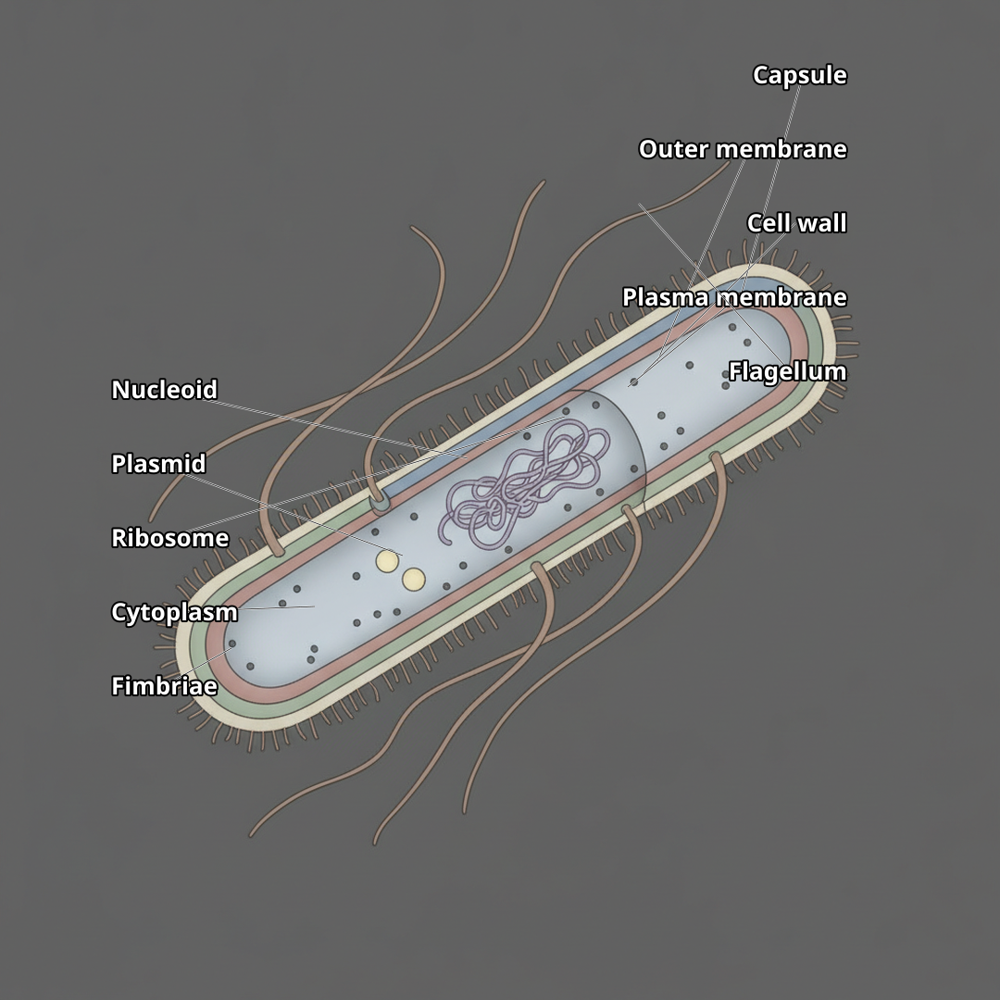 | **3D · labelled** 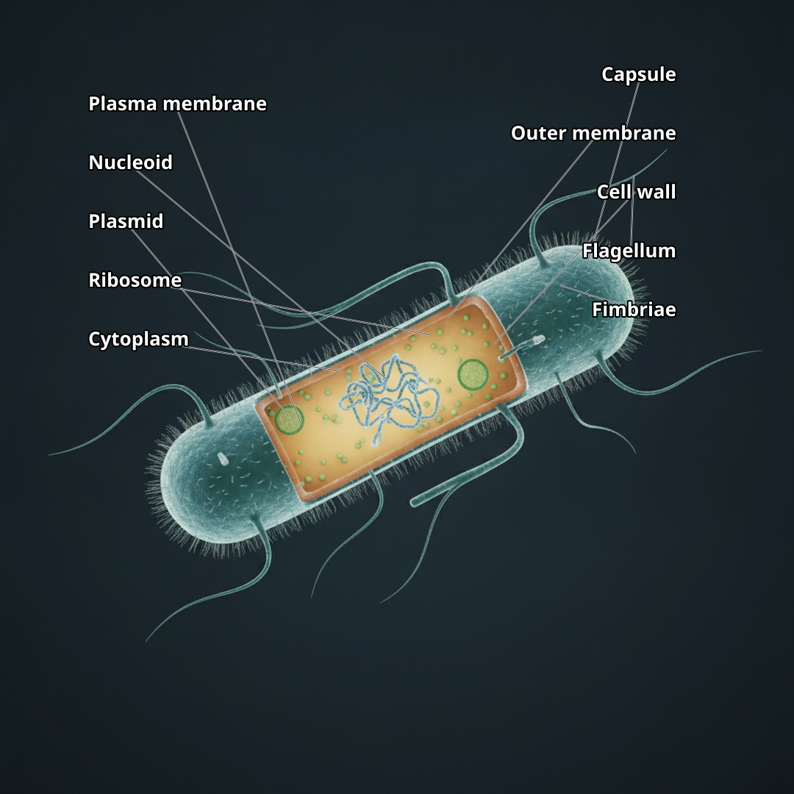 | **Watercolor · labelled**  |

| Audience | English | Deutsch |
| --- | --- | --- |
| **Kids** | Say hello to E. coli, a tiny sausage-shaped bacterium with wiggly tails for swimming! Billions of the friendly kind live in your gut right now, helping you digest dinner and even making vitamin K for you. But a few naughty relatives sneak in on undercooked burgers or unwashed veggies and give you a very sore, runny tummy. The best trick against them is simple: wash your hands and cook your food well, and most tummy troubles pass on their own with plenty of rest and water. | Sag Hallo zu E. coli, einem winzigen wurstförmigen Bakterium mit wackeligen Schwänzchen zum Schwimmen! Milliarden der freundlichen Sorte wohnen gerade jetzt in deinem Darm, helfen beim Verdauen und stellen sogar Vitamin K für dich her. Doch ein paar freche Verwandte schleichen sich auf halb durchgebratenen Burgern oder ungewaschenem Gemüse ein und machen dir einen ganz fiesen, flauschigen Bauch. Der beste Trick gegen sie ist einfach: Hände waschen und Essen gut durchgaren, dann geht der Bauchgrummel meist mit viel Ruhe und Trinken von allein wieder weg. |
| **Adults** | Escherichia coli is the best-studied bacterium on Earth and a normal resident of the human large intestine, where harmless strains aid digestion, crowd out invaders and supply vitamin K. Trouble comes from a handful of pathogenic pathotypes: enterohaemorrhagic E. coli (EHEC, such as O157:H7) produces Shiga toxin and can cause bloody diarrhoea and, rarely, kidney-damaging haemolytic uraemic syndrome, while other strains cause travellers' diarrhoea or urinary-tract infections. Infection is faecal-oral, typically from undercooked meat, contaminated produce or water. Most gut infections are self-limiting and treated with fluids rather than antibiotics, which for EHEC can even worsen toxin release; thorough cooking, hand hygiene and safe water remain the mainstays of prevention. | Escherichia coli ist das am besten untersuchte Bakterium der Welt und ein normaler Bewohner des menschlichen Dickdarms, wo harmlose Stämme die Verdauung unterstützen, Eindringlinge verdrängen und Vitamin K liefern. Probleme bereiten nur wenige krankmachende Pathotypen: enterohämorrhagische E. coli (EHEC, etwa O157:H7) bilden Shiga-Toxin und können blutigen Durchfall und selten das nierenschädigende hämolytisch-urämische Syndrom auslösen, während andere Stämme Reisedurchfall oder Harnwegsinfekte verursachen. Die Ansteckung erfolgt fäkal-oral, meist über nicht durchgegartes Fleisch, verunreinigte Lebensmittel oder Wasser. Die meisten Darminfektionen heilen von selbst und werden mit Flüssigkeit statt Antibiotika behandelt, die bei EHEC die Toxinfreisetzung sogar verschlimmern können; gründliches Garen, Handhygiene und sauberes Wasser bleiben der wichtigste Schutz. |
| **Scientific** | Escherichia coli is a Gram-negative, facultatively anaerobic, non-spore-forming bacillus (~0.5 x 2 um) of the family Enterobacteriaceae. Its envelope comprises an inner cytoplasmic membrane, a thin periplasmic peptidoglycan layer, and an outer membrane bearing lipopolysaccharide (O-antigen/endotoxin); motile strains are peritrichously flagellated (H-antigen) and bear type-1 fimbriae, with some carrying an F pilus for conjugation. The ~4.6 Mbp circular chromosome forms a membraneless nucleoid supplemented by plasmids that disseminate resistance and virulence genes via horizontal gene transfer. Pathotypes are defined by acquired factors rather than morphology: STEC/EHEC carry prophage-encoded Shiga toxins and a locus of enterocyte effacement, whereas ETEC, EPEC, EIEC, EAEC and UPEC deploy distinct adhesins and toxins. In the healthy gut, commensal E. coli is constrained by secretory IgA, the mucus barrier and colonisation resistance from the resident microbiota. | Escherichia coli ist ein gramnegatives, fakultativ anaerobes, nicht sporenbildendes Stäbchen (~0,5 x 2 um) aus der Familie der Enterobacteriaceae. Seine Hülle besteht aus einer inneren Zytoplasmamembran, einer dünnen periplasmatischen Peptidoglykanschicht und einer äußeren Membran mit Lipopolysaccharid (O-Antigen/Endotoxin); bewegliche Stämme sind peritrich begeißelt (H-Antigen) und tragen Typ-1-Fimbrien, manche zusätzlich einen F-Pilus zur Konjugation. Das etwa 4,6 Mbp große zirkuläre Chromosom bildet einen membranlosen Nukleoid, ergänzt durch Plasmide, die Resistenz- und Virulenzgene über horizontalen Gentransfer verbreiten. Pathotypen werden durch erworbene Faktoren und nicht durch die Morphologie definiert: STEC/EHEC tragen prophagenkodierte Shiga-Toxine und einen Locus of Enterocyte Effacement, während ETEC, EPEC, EIEC, EAEC und UPEC eigene Adhäsine und Toxine einsetzen. Im gesunden Darm wird kommensale E. coli durch sekretorisches IgA, die Schleimbarriere und die Kolonisationsresistenz der Mikrobiota in Schach gehalten. |

[full log](set/pathogens-bacteria/escherichia-coli.render.md) · [set overview](set/pathogens-bacteria/OVERVIEW.md)

---

### Helicobacter pylori (`helicobacter-pylori`)
Spiral, flagellated Gram-negative bacterium that colonises the stomach mucus layer; survives gastric acid via urease and causes gastritis, peptic ulcers and raises stomach-cancer risk.

| Textbook | SEM | 3D | Watercolor |
| --- | --- | --- | --- |
|  |  |  |  |
| **Reference (real)**  | **Textbook · labelled** 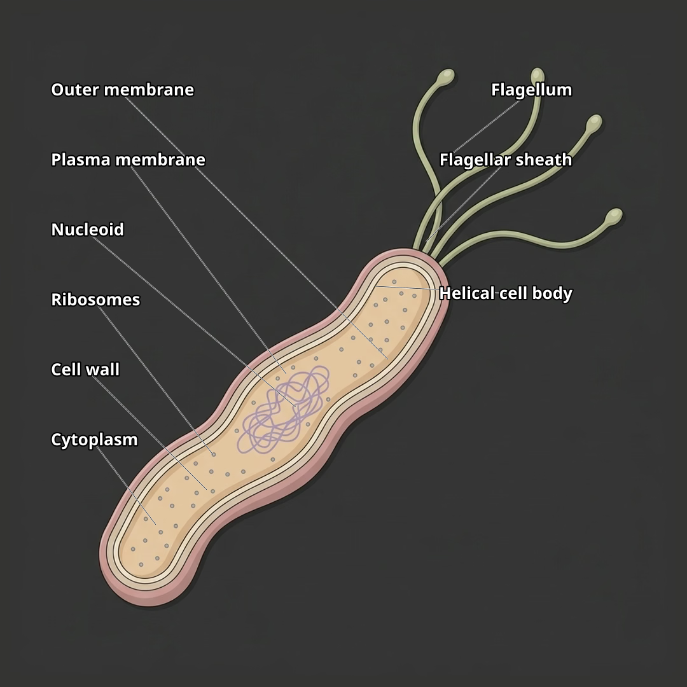 | **3D · labelled** 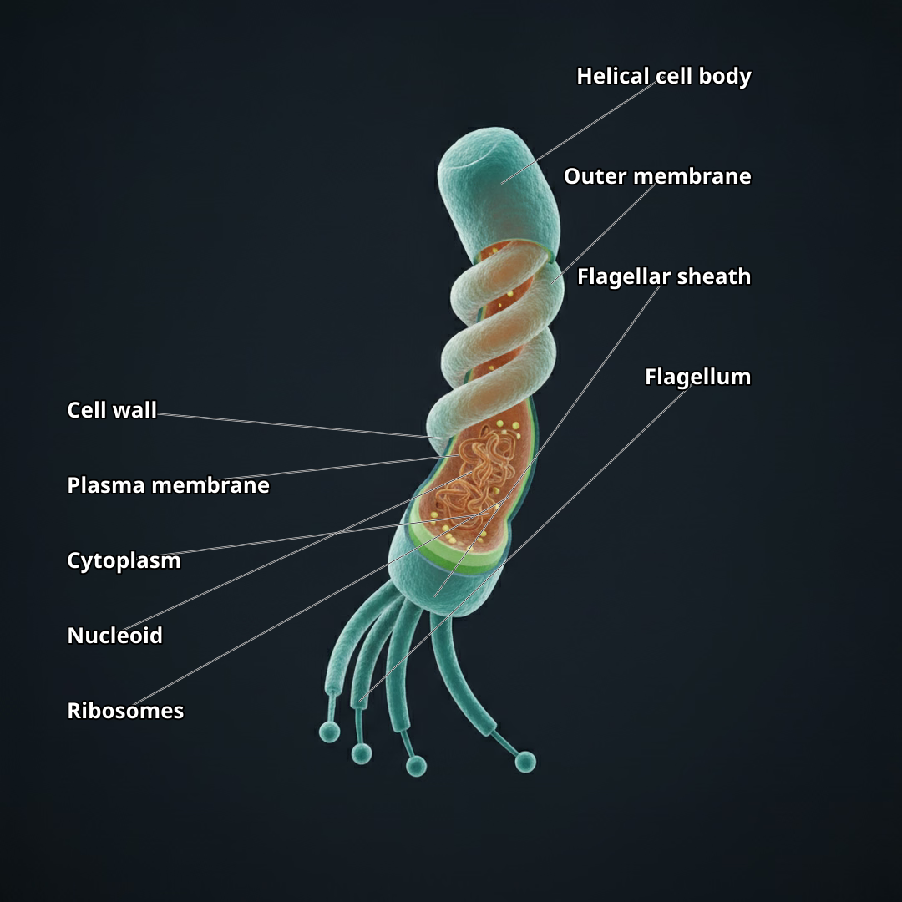 | **Watercolor · labelled** 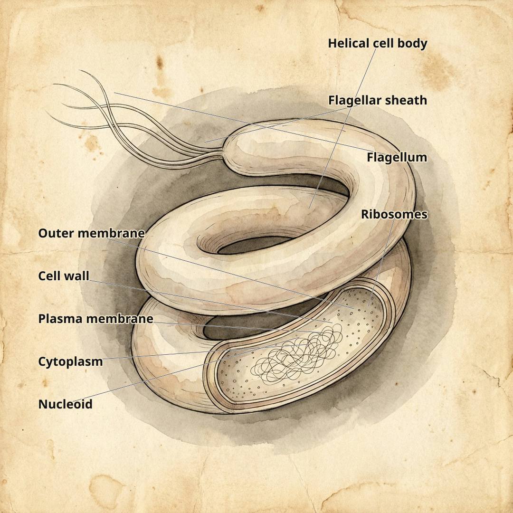 |

| Audience | English | Deutsch |
| --- | --- | --- |
| **Kids** | Meet Helicobacter pylori, a wiggly little spring-shaped germ that does something amazing: it lives in your stomach, where the acid is strong enough to dissolve food! It wears a tiny bundle of whip-like tails at one end and spins them like a drill to burrow into the slimy mucus lining. To survive the acid it puffs out a cloud of ammonia that fizzes the acid away, like a bubble of protection. Trouble is, this troublemaker can make your tummy sore and give you ulcers. The good news: a doctor can clear it out with a short course of antibiotics teamed up with a pill that turns the stomach acid down. | Das ist Helicobacter pylori, ein zappeliger, spiralförmiger Keim, der etwas Erstaunliches kann: Er lebt in deinem Magen, wo die Säure stark genug ist, um Essen aufzulösen! An einem Ende trägt er ein Büschel peitschenartiger Schwänzchen und dreht sie wie einen Bohrer, um sich in die schleimige Magenwand zu wühlen. Gegen die Säure pustet er eine Wolke aus Ammoniak aus, die die Säure wegblubbert, wie eine Schutzblase. Blöd nur: Dieser Störenfried kann deinen Bauch wehtun lassen und Geschwüre machen. Die gute Nachricht: Ein Arzt kann ihn mit einer kurzen Antibiotika-Kur loswerden, zusammen mit einer Tablette, die die Magensäure herunterdreht. |
| **Adults** | Helicobacter pylori is one of humanity's most common chronic infections, quietly colonising the stomach lining of roughly half the world's population, usually acquired in childhood. Most carriers never notice it, but in a sizeable minority it drives chronic gastritis, peptic ulcers of the stomach and duodenum, and over decades it is a leading risk factor for stomach cancer and a rare lymphoma called MALT lymphoma. Its trick is survival in acid: a corkscrew body and sheathed polar flagella let it swim into the protective mucus, while the enzyme urease neutralises acid in its immediate surroundings. Diagnosis is straightforward via a breath test, stool antigen or biopsy, and standard treatment pairs two or three antibiotics with an acid-suppressing proton-pump inhibitor for one to two weeks, though rising antibiotic resistance increasingly guides tailored regimens. | Helicobacter pylori zählt zu den häufigsten chronischen Infektionen des Menschen und besiedelt still die Magenschleimhaut von rund der Hälfte der Weltbevölkerung, meist bereits in der Kindheit erworben. Die meisten Träger merken nichts davon, doch bei einer beträchtlichen Minderheit löst er eine chronische Gastritis sowie Magen- und Zwölffingerdarmgeschwüre aus und ist über Jahrzehnte ein führender Risikofaktor für Magenkrebs und ein seltenes Lymphom, das MALT-Lymphom. Sein Kunststück ist das Überleben in Säure: Ein korkenzieherförmiger Körper und ummantelte polare Geißeln lassen ihn in den schützenden Schleim schwimmen, während das Enzym Urease die Säure in seiner unmittelbaren Umgebung neutralisiert. Die Diagnose gelingt einfach per Atemtest, Stuhlantigen oder Biopsie, und die Standardbehandlung kombiniert zwei bis drei Antibiotika mit einem säurehemmenden Protonenpumpenhemmer über ein bis zwei Wochen, wobei zunehmende Antibiotikaresistenzen immer öfter maßgeschneiderte Therapien nötig machen. |
| **Scientific** | Helicobacter pylori is a microaerophilic, Gram-negative, spiral bacterium of the Epsilonproteobacteria, typically 2.5–5 µm long with two to three helical turns and a unipolar tuft of two to seven sheathed flagella. Colonisation of the gastric mucosa depends on motility through mucus and on urease, which hydrolyses urea to ammonia and carbon dioxide to buffer periplasmic and local pH; adhesins such as BabA and SabA anchor the cell to gastric epithelium. Pathogenicity is strongly modulated by the cag pathogenicity island, whose type IV secretion system injects the effector protein CagA, and by the vacuolating cytotoxin VacA, driving inflammation, epithelial damage and, in a subset, carcinogenesis (WHO Group 1 carcinogen). The organism can convert to a viable-but-nonculturable coccoid form under stress. Clinical eradication uses combination antibiotic regimens with a proton-pump inhibitor, increasingly guided by clarithromycin-resistance testing. | Helicobacter pylori ist ein mikroaerophiles, gramnegatives, spiralförmiges Bakterium aus der Klasse der Epsilonproteobakterien, typischerweise 2,5–5 µm lang mit zwei bis drei Windungen und einem unipolaren Büschel aus zwei bis sieben ummantelten Geißeln. Die Besiedlung der Magenschleimhaut beruht auf der Beweglichkeit durch den Schleim und auf der Urease, die Harnstoff zu Ammoniak und Kohlendioxid spaltet und so den periplasmatischen und lokalen pH-Wert puffert; Adhäsine wie BabA und SabA verankern die Zelle am Magenepithel. Die Pathogenität wird stark durch die cag-Pathogenitätsinsel bestimmt, deren Typ-IV-Sekretionssystem das Effektorprotein CagA einschleust, sowie durch das vakuolisierende Zytotoxin VacA, was Entzündung, Epithelschäden und in einem Teil der Fälle Karzinogenese antreibt (WHO-Gruppe-1-Karzinogen). Unter Stress kann der Erreger in eine lebende, aber nicht kultivierbare kokkoide Form übergehen. Die klinische Eradikation erfolgt mit Antibiotika-Kombinationen plus einem Protonenpumpenhemmer, zunehmend gesteuert durch Testung auf Clarithromycin-Resistenz. |

[full log](set/pathogens-bacteria/helicobacter-pylori.render.md) · [set overview](set/pathogens-bacteria/OVERVIEW.md)

---

### Listeria monocytogenes (`listeria-monocytogenes`)
Short Gram-positive rod that keeps growing at fridge temperature and lives inside host cells, where it hijacks the host's own actin to build a comet tail at one pole and rockets from cell to cell; the classic foodborne danger of pregnancy, the newborn, the elderly and the immunosuppressed.

| Textbook | SEM | 3D | Watercolor |
| --- | --- | --- | --- |
|  |  |  |  |
| **Reference (real)**  | **Textbook · labelled**  | **3D · labelled**  | **Watercolor · labelled**  |

| Audience | English | Deutsch |
| --- | --- | --- |
| **Kids** | Meet Listeria — a short, stubby little rod with a very strange trick. Most germs get lazy in the cold, but Listeria keeps right on growing inside the fridge, quietly, on a slice of cold ham or a soft cheese, while everything else is fast asleep. And once it slips inside one of your cells, it does something almost cheeky: it grabs the springy scaffolding poles the cell uses to hold its own shape, glues them together behind itself into a bushy tail, and rides that tail like a rocket right through the cell and into the cell next door. It never has to step outside where it could be spotted. So how do people stay ahead of it? Mostly with heat. Listeria can shrug off cold and salt, but it cannot survive being properly cooked — steaming hot all the way to the middle, not just warm on the outside. That is why leftovers get reheated until they steam, and why smoked fish and soft cheese made from raw milk go into the sandwich of grown-ups rather than into a lunchbox for a pregnant mum. A hot pan is the one thing this fridge-loving rod has no answer for. | Das ist Listeria — ein kurzes, gedrungenes Stäbchen mit einem sehr merkwürdigen Trick. Die meisten Keime werden in der Kälte träge, aber Listeria wächst im Kühlschrank einfach weiter, ganz leise, auf einer Scheibe Aufschnitt oder einem Weichkäse, während alle anderen tief schlafen. Und wenn es erst einmal in eine deiner Zellen geschlüpft ist, macht es etwas fast Freches: Es packt die federnden Gerüststangen, mit denen die Zelle ihre eigene Form hält, klebt sie hinter sich zu einem buschigen Schweif zusammen und reitet auf diesem Schweif wie auf einer Rakete quer durch die Zelle und gleich in die Nachbarzelle hinein. So muss es nie nach draußen, wo man es entdecken könnte. Wie bleibt man ihm also voraus? Vor allem mit Hitze. Kälte und Salz machen Listeria nichts aus, aber richtiges Durchgaren übersteht es nicht — dampfend heiß bis in die Mitte, nicht nur außen warm. Deshalb wärmt man Reste auf, bis sie dampfen, und deshalb landen Räucherfisch und Weichkäse aus Rohmilch eher im Brot der Erwachsenen als im Pausenbrot einer Schwangeren. Gegen eine heiße Pfanne hat dieses kühlschrankverliebte Stäbchen kein Mittel. |
| **Adults** | Listeria monocytogenes is a short Gram-positive rod that lives in soil, water and silage and finds its way into food. What makes it unusual among foodborne bacteria is that it is psychrotrophic: it grows at refrigerator temperatures, down to around 0 °C, and it also tolerates salt and moderately acidic conditions. Chilling therefore slows it but does not stop it, and a contaminated ready-to-eat food can accumulate a meaningful dose over its shelf life without ever looking, smelling or tasting wrong. The classic risky products are all eaten cold and stored long: soft cheeses made from raw milk, cold-smoked fish, pâté, deli meats and pre-packed salads. The second unusual thing is where it goes. Rather than staying in the gut lumen, Listeria persuades intestinal cells to swallow it, breaks out of the vacuole they trap it in, and then hijacks the host cell's own actin cytoskeleton. A protein on one end of the bacterium recruits the host machinery that builds actin filaments, and the growing mesh pushes the bacterium forward at up to a micrometre per second — the comet tail seen in fluorescence microscopy. Driven into the neighbouring cell as a finger-like protrusion, it spreads from cell to cell without ever entering the bloodstream where antibodies could reach it. For most healthy adults the result is nothing at all, or a short bout of fever and diarrhoea. The danger is concentrated in pregnancy, in newborns, in the elderly and in people whose cell-mediated immunity is suppressed, where it can cause bloodstream infection and meningitis, or cross the placenta and threaten the pregnancy. Because it is invasive rather than toxin-mediated, listeriosis is treated with antibiotics — ampicillin, usually with gentamicin. Prevention is straightforward and mostly thermal: heat food through until it steams, keep the fridge genuinely cold, respect use-by dates, and during pregnancy skip the raw-milk soft cheeses, cold-smoked fish and cold deli meats rather than gambling on them. | Listeria monocytogenes ist ein kurzes grampositives Stäbchen, das in Boden, Wasser und Silage lebt und von dort in Lebensmittel gelangt. Unter den lebensmittelbedingten Erregern ist es ungewöhnlich, weil es psychrotroph ist: Es wächst bei Kühlschranktemperatur, bis hinunter zu etwa 0 °C, und verträgt zudem Salz und mäßig saure Bedingungen. Kühlen bremst es also, stoppt es aber nicht, und ein kontaminiertes verzehrfertiges Lebensmittel kann über seine Haltbarkeitsdauer eine relevante Keimzahl aufbauen, ohne dass es auffällig aussieht, riecht oder schmeckt. Die klassischen Risikoprodukte werden alle kalt gegessen und lange gelagert: Weichkäse aus Rohmilch, kalt geräucherter Fisch, Pastete, Aufschnitt und abgepackte Salate. Das zweite Ungewöhnliche ist der Weg, den der Erreger nimmt. Statt im Darmlumen zu bleiben, bringt Listeria Darmzellen dazu, es aufzunehmen, bricht aus dem Vakuolen-Einschluss aus und kapert dann das Aktin-Zytoskelett der Wirtszelle. Ein Protein an einem Pol des Bakteriums rekrutiert die wirtseigene Maschinerie, die Aktinfilamente baut, und das wachsende Geflecht schiebt das Bakterium mit bis zu einem Mikrometer pro Sekunde vorwärts — der Kometenschweif, den man in der Fluoreszenzmikroskopie sieht. Als fingerförmige Ausstülpung wird es in die Nachbarzelle gedrückt und breitet sich so von Zelle zu Zelle aus, ohne je in die Blutbahn zu geraten, wo Antikörper es erreichen könnten. Bei den meisten gesunden Erwachsenen passiert daraufhin gar nichts oder es kommt zu einer kurzen Episode mit Fieber und Durchfall. Gefährlich wird es in der Schwangerschaft, bei Neugeborenen, bei alten Menschen und bei geschwächter zellulärer Immunabwehr: Dann drohen Blutstrominfektion und Meningitis, oder der Erreger überquert die Plazenta und gefährdet die Schwangerschaft. Da die Listeriose invasiv und nicht toxinvermittelt ist, wird sie mit Antibiotika behandelt — Ampicillin, meist zusammen mit Gentamicin. Die Vorbeugung ist unkompliziert und im Wesentlichen thermisch: Speisen durcherhitzen, bis sie dampfen, den Kühlschrank wirklich kalt halten, Verbrauchsdaten ernst nehmen und in der Schwangerschaft auf Rohmilch-Weichkäse, kalt geräucherten Fisch und kalten Aufschnitt lieber verzichten, statt es darauf ankommen zu lassen. |
| **Scientific** | Listeria monocytogenes is a facultatively anaerobic, non-spore-forming, catalase-positive Gram-positive coccobacillus of roughly 0.4–0.5 × 1–2 µm, motile at ≤30 °C by one to a few peritrichous flagella and effectively non-motile at 37 °C, where the repressor MogR — antagonised by the thermosensitive anti-repressor GmaA/GmaR — silences flagellar gene expression. It is psychrotrophic, halotolerant and acid-tolerant, growing from about 0 °C to 45 °C, which underlies its epidemiology in refrigerated ready-to-eat foods. Virulence is coordinated by the master regulator PrfA and clusters largely in Listeria pathogenicity island 1. Entry into non-phagocytic cells is receptor-mediated: internalin A (InlA) engages E-cadherin on epithelial junctions, InlB engages the hepatocyte growth-factor receptor Met, and both routes are exploited at the intestinal barrier, the blood-brain barrier and the placenta, where the species tropism of InlA–E-cadherin binding explains why murine models underestimate human enteric invasion. Once internalised, the cholesterol-dependent pore-forming cytolysin listeriolysin O (hly), acid-activated and tuned to the phagosomal pH so that it does not perforate the plasma membrane, cooperates with the phospholipases PlcA and PlcB and the metalloprotease Mpl to rupture the vacuole and release the bacterium into the cytosol. There the surface protein ActA, distributed asymmetrically and concentrated at the older pole, mimics host nucleation-promoting factors: its acidic and proline-rich regions bind G-actin, profilin–actin and Ena/VASP and activate the Arp2/3 complex, nucleating a dense branched dendritic network that assembles a unipolar comet tail of host actin filaments and propels the bacterium at approximately 0.02–1.4 µm/s. Impact on the plasma membrane generates listeriopods that are engulfed by the neighbouring cell, yielding a double-membrane secondary vacuole lysed by LLO and PlcB, so that spread proceeds intracellularly and largely shielded from humoral immunity. Control depends on cell-mediated immunity, which is why listeriosis concentrates in pregnancy, neonates, the elderly and T-cell-suppressed patients; therapy is ampicillin, commonly with an aminoglycoside, since cephalosporins are intrinsically inactive. The actin comet tail is host cytoskeleton, not a bacterial appendage, and this system — together with Shigella IcsA and vaccinia A36 — is a foundational model for actin-based motility. | Listeria monocytogenes ist ein fakultativ anaerobes, nicht sporenbildendes, katalasepositives grampositives Kokkobazillus von etwa 0,4–0,5 × 1–2 µm, bei ≤30 °C beweglich durch eine bis wenige peritriche Geißeln und bei 37 °C praktisch unbeweglich, da dort der Repressor MogR — antagonisiert durch den thermosensitiven Anti-Repressor GmaA/GmaR — die Flagellengene stilllegt. Der Erreger ist psychrotroph, halotolerant und säuretolerant und wächst von etwa 0 °C bis 45 °C, was seine Epidemiologie in gekühlten verzehrfertigen Lebensmitteln erklärt. Die Virulenz wird vom Masterregulator PrfA koordiniert und liegt größtenteils in der Listeria-Pathogenitätsinsel 1. Der Eintritt in nichtphagozytierende Zellen ist rezeptorvermittelt: Internalin A (InlA) bindet E-Cadherin an epithelialen Zellkontakten, InlB bindet den Hepatozyten-Wachstumsfaktor-Rezeptor Met; beide Wege werden an der Darmbarriere, der Blut-Hirn-Schranke und der Plazenta genutzt, wobei die Speziesspezifität der InlA-E-Cadherin-Bindung erklärt, warum Mausmodelle die enterale Invasion beim Menschen unterschätzen. Nach der Aufnahme sprengt das cholesterinabhängige porenbildende Zytolysin Listeriolysin O (hly) — säureaktiviert und so auf den phagosomalen pH abgestimmt, dass es die Plasmamembran nicht perforiert — gemeinsam mit den Phospholipasen PlcA und PlcB sowie der Metalloprotease Mpl die Vakuole und entlässt das Bakterium ins Zytosol. Dort ahmt das asymmetrisch verteilte, am älteren Pol konzentrierte Oberflächenprotein ActA wirtseigene nukleationsfördernde Faktoren nach: Seine sauren und prolinreichen Regionen binden G-Aktin, Profilin-Aktin und Ena/VASP und aktivieren den Arp2/3-Komplex, wodurch ein dichtes verzweigtes dendritisches Netzwerk nukleiert wird, das einen unipolaren Kometenschweif aus Wirtsaktinfilamenten aufbaut und das Bakterium mit etwa 0,02–1,4 µm/s antreibt. Der Aufprall auf die Plasmamembran erzeugt Listeriopoden, die von der Nachbarzelle aufgenommen werden; die entstehende doppelmembranige Sekundärvakuole wird durch LLO und PlcB lysiert, sodass die Ausbreitung intrazellulär und weitgehend vor der humoralen Immunantwort geschützt verläuft. Die Kontrolle beruht auf zellvermittelter Immunität, weshalb sich die Listeriose auf Schwangerschaft, Neugeborene, Ältere und T-Zell-supprimierte Patienten konzentriert; therapiert wird mit Ampicillin, meist zusammen mit einem Aminoglykosid, da Cephalosporine intrinsisch unwirksam sind. Der Aktin-Kometenschweif ist Wirtszytoskelett, kein bakterielles Anhangsgebilde; dieses System ist — zusammen mit IcsA von Shigella und A36 des Vacciniavirus — ein grundlegendes Modell der aktinbasierten Motilität. |

[full log](set/pathogens-bacteria/listeria-monocytogenes.render.md) · [set overview](set/pathogens-bacteria/OVERVIEW.md)

---

### Mycobacterium tuberculosis (TB) (`mycobacterium-tuberculosis`)
Slender, waxy-coated acid-fast rod (~0.2–0.5 × 2–4 µm) that hides inside macrophages and can lurk in the lungs for years; the cause of tuberculosis.

| Textbook | SEM | 3D | Watercolor |
| --- | --- | --- | --- |
|  |  |  |  |
| **Reference (real)**  | **Textbook · labelled** 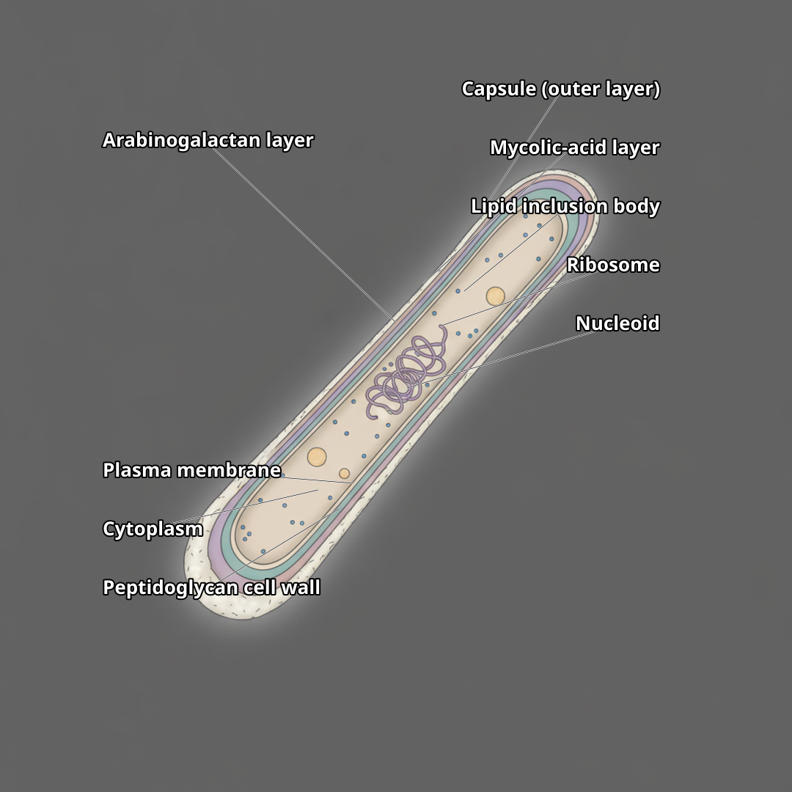 | **3D · labelled** 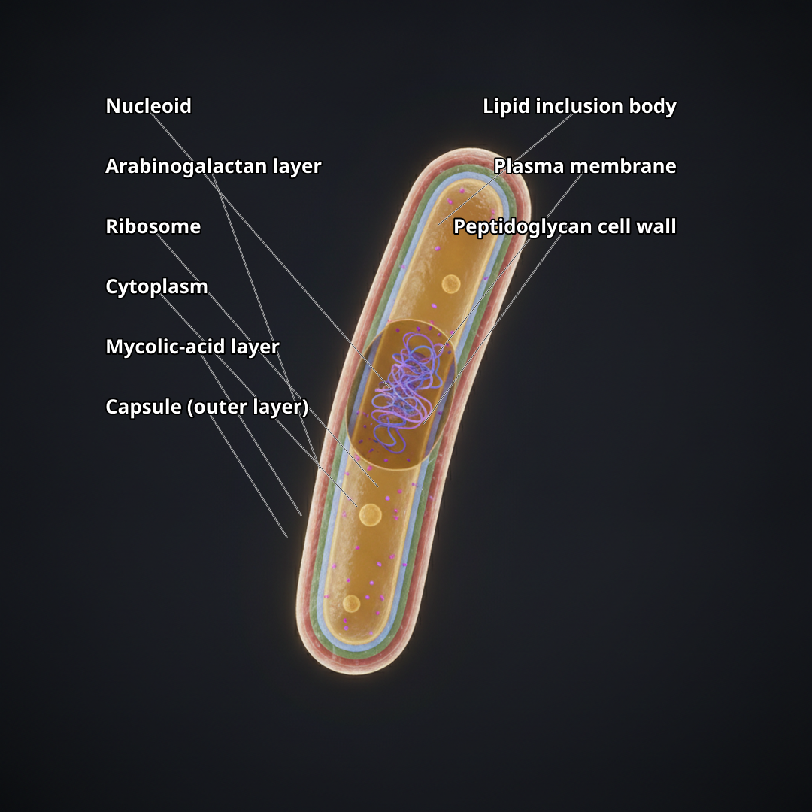 | **Watercolor · labelled**  |

| Audience | English | Deutsch |
| --- | --- | --- |
| **Kids** | Meet Mycobacterium tuberculosis, a slim little rod wrapped in a thick, waxy coat like a tiny raincoat that nothing can get through. That waxy armor lets it hide inside the very cells that are supposed to gobble it up, curling into a snug hideout deep in the lungs, sometimes for years without anyone noticing. It spreads through the air when someone coughs, so covering your mouth really matters. If it does wake up and cause trouble, doctors have special long-course medicines that can clear it out for good. | Das ist Mycobacterium tuberculosis, ein schlankes Stäbchen in einem dicken, wachsigen Mantel wie ein winziger Regenschutz, durch den nichts hindurchkommt. Dieser wachsige Panzer lässt es sich sogar in den Zellen verstecken, die es eigentlich auffressen sollen, tief in der Lunge, manchmal jahrelang, ohne dass es jemand merkt. Es verbreitet sich durch die Luft, wenn jemand hustet, darum ist Husten in die Armbeuge so wichtig. Wacht es doch auf und macht Ärger, gibt es beim Arzt eine spezielle Kur mit mehreren Medikamenten, die es dauerhaft vertreibt. |
| **Adults** | Mycobacterium tuberculosis is the bacterium behind tuberculosis, one of humanity's oldest and most persistent infectious diseases. Its unusually thick, lipid-rich cell wall makes it slow-growing but remarkably tough, letting it survive for years inside the very immune cells sent to destroy it, walled off in dormant lung lesions with no symptoms at all. Only about one in ten latent infections ever progresses to active disease, usually when the immune system is weakened by age, illness or malnutrition, at which point it causes the classic cough, weight loss and night sweats. TB spreads through airborne droplets from a cough, and treatment requires a demanding multi-drug antibiotic course lasting several months, since cutting it short breeds drug-resistant strains. | Mycobacterium tuberculosis ist der Erreger der Tuberkulose, einer der ältesten und hartnäckigsten Infektionskrankheiten der Menschheit. Seine ungewöhnlich dicke, fettreiche Zellwand macht es langsam wachsend, aber erstaunlich widerstandsfähig: Es kann jahrelang in genau jenen Immunzellen überleben, die es eigentlich zerstören sollen, eingekapselt in ruhenden Lungenherden ganz ohne Symptome. Nur etwa jede zehnte latente Infektion entwickelt sich je zur aktiven Erkrankung, meist wenn das Immunsystem durch Alter, Krankheit oder Mangelernährung geschwächt ist; dann folgen der typische Husten, Gewichtsverlust und Nachtschweiß. TB verbreitet sich über Tröpfchen beim Husten, und die Behandlung erfordert eine anspruchsvolle Mehrfach-Antibiotikatherapie über mehrere Monate, denn ein zu früher Abbruch züchtet resistente Stämme heran. |
| **Scientific** | Mycobacterium tuberculosis is a slow-growing, obligate aerobic, non-motile, acid-fast bacillus (~0.2-0.5 x 2-4 um) whose defining feature is a mycolic-acid-rich mycomembrane sitting outside an arabinogalactan-peptidoglycan complex, conferring low permeability, acid-fastness and resistance to desiccation and many antibiotics. Following inhalation, bacilli are phagocytosed by alveolar macrophages but arrest phagosome maturation via lipoarabinomannan and other cell-wall lipids, allowing intracellular persistence and replication. Recruited macrophages, dendritic cells and T lymphocytes organize into a granuloma that contains but rarely sterilizes the infection, producing a latent state maintained largely by CD4+ Th1 cells secreting IFN-gamma; reactivation occurs when this containment fails. Cell-wall lipids such as trehalose dimycolate (cord factor) also promote the serpentine cording seen on smear and contribute to virulence and immune modulation. | Mycobacterium tuberculosis ist ein langsam wachsendes, obligat aerobes, unbewegliches, säurefestes Stäbchenbakterium (ca. 0,2-0,5 x 2-4 um), dessen Kennzeichen eine mykolsäurereiche Mykomembran außerhalb eines Arabinogalaktan-Peptidoglykan-Komplexes ist, die geringe Permeabilität, Säurefestigkeit sowie Resistenz gegen Austrocknung und viele Antibiotika verleiht. Nach Inhalation werden die Bazillen von Alveolarmakrophagen phagozytiert, blockieren jedoch mittels Lipoarabinomannan und anderer Zellwandlipide die Phagosomenreifung, was intrazelluläres Überleben und Vermehrung ermöglicht. Rekrutierte Makrophagen, dendritische Zellen und T-Lymphozyten formen ein Granulom, das die Infektion eindämmt, aber selten vollständig eliminiert; der latente Zustand wird vor allem durch IFN-gamma-sezernierende CD4+-Th1-Zellen aufrechterhalten, und eine Reaktivierung erfolgt, wenn diese Kontrolle versagt. Zellwandlipide wie Trehalose-Dimycolat (Cord-Faktor) fördern zudem die im Ausstrich sichtbare schlangenartige Verklumpung und tragen zur Virulenz und Immunmodulation bei. |

[full log](set/pathogens-bacteria/mycobacterium-tuberculosis.render.md) · [set overview](set/pathogens-bacteria/OVERVIEW.md)

---

### Salmonella enterica (`salmonella-enterica`)
Gram-negative, peritrichously flagellated enteric rod (~0.7-1.5 x 2-5 um) spread by contaminated eggs and poultry; causes gastroenteritis or, for the typhoidal serovars, typhoid fever.

| Textbook | SEM | 3D | Watercolor |
| --- | --- | --- | --- |
|  |  |  |  |
| **Reference (real)**  | **Textbook · labelled** 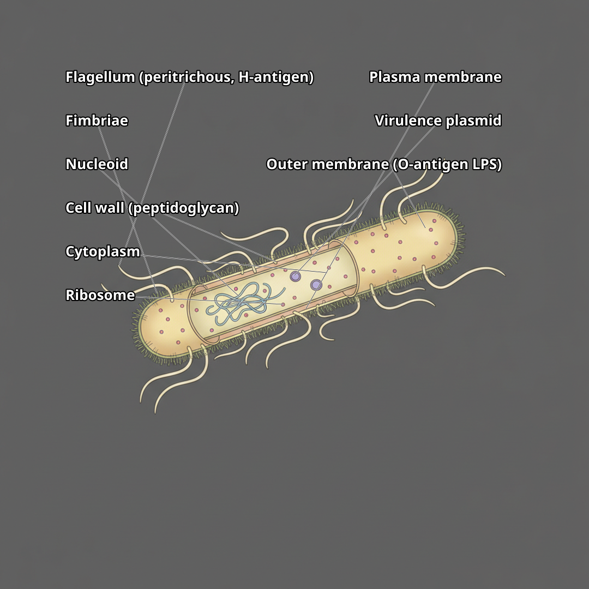 | **3D · labelled** 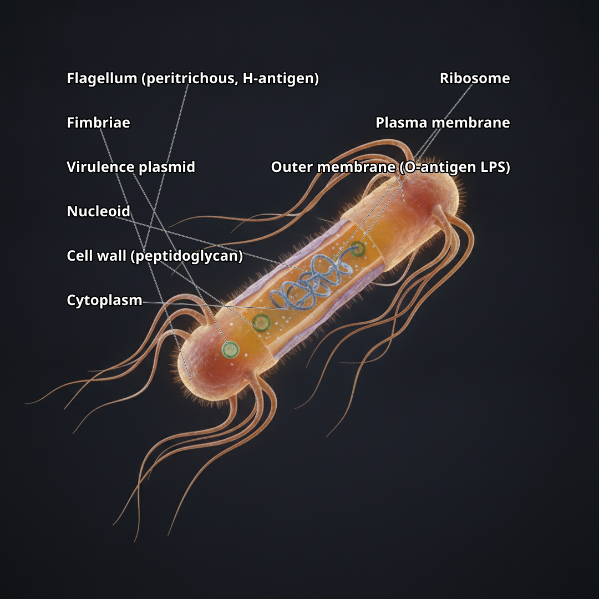 | **Watercolor · labelled**  |

| Audience | English | Deutsch |
| --- | --- | --- |
| **Kids** | Meet Salmonella, a tiny sausage-shaped germ with a bunch of wiggly tails it uses to swim like a little propeller. It loves to hitch a ride on raw eggs and undercooked chicken, and if it sneaks into your tummy it can throw a nasty party that gives you a tummy ache and lots of trips to the toilet. The good news: cooking eggs and chicken until they are piping hot roasts these germs before they ever reach your plate. And if one does slip through, plenty of rest and sipping water while your body clears it usually does the trick. | Das ist Salmonella, ein winziger würstchenförmiger Keim mit mehreren zappelnden Schwänzchen, mit denen er wie ein kleiner Propeller schwimmt. Am liebsten reist er auf rohen Eiern und halbgarem Hühnchen mit, und wenn er sich in deinen Bauch schleicht, feiert er eine fiese Party, die dir Bauchweh und viele Klogänge beschert. Die gute Nachricht: Wenn man Eier und Hühnchen richtig heiß durchgart, werden diese Keime schon vor dem Teller geröstet. Und rutscht doch mal einer durch, helfen meist viel Ruhe und Wasser trinken, während dein Körper ihn wieder loswird. |
| **Adults** | Salmonella enterica is one of the most common causes of food poisoning worldwide. Most infections come from non-typhoidal serovars carried on contaminated poultry, eggs, and other animal products; they invade the gut lining and trigger the cramps, fever, and diarrhoea of salmonellosis, which is usually self-limiting and managed with fluids and rest. A few specialised serovars, Typhi and Paratyphi, are adapted to humans and cause typhoid fever, a serious bloodstream infection that needs antibiotics. Thorough cooking, hand-washing, and keeping raw meat away from ready-to-eat food are the practical defences, and vaccines exist against typhoid for travellers to high-risk regions. | Salmonella enterica gehört zu den häufigsten Erregern von Lebensmittelvergiftungen weltweit. Die meisten Infektionen gehen auf nicht-typhöse Serovare zurück, die auf verunreinigtem Geflügel, Eiern und anderen tierischen Produkten sitzen; sie dringen in die Darmschleimhaut ein und lösen die Krämpfe, das Fieber und den Durchfall der Salmonellose aus, die meist von selbst abklingt und mit Flüssigkeit und Ruhe behandelt wird. Einige spezialisierte Serovare, Typhi und Paratyphi, sind an den Menschen angepasst und verursachen Typhus, eine ernste Blutstrominfektion, die Antibiotika erfordert. Gründliches Durchgaren, Händewaschen und das Fernhalten von rohem Fleisch von verzehrfertigen Speisen sind die praktischen Schutzmaßnahmen, und gegen Typhus gibt es Impfstoffe für Reisende in Risikogebiete. |
| **Scientific** | Salmonella enterica is a Gram-negative, facultatively anaerobic bacillus of the Enterobacteriaceae, ~0.7–1.5 × 2–5 µm, typically motile by peritrichous flagella (H-antigen). Its outer membrane carries lipopolysaccharide whose O-polysaccharide, together with the H flagellar and Vi capsular antigens, defines the >2,600 serovars of the Kauffmann–White scheme. It is a facultative intracellular pathogen: SPI-1 and SPI-2 type III secretion systems inject effectors that drive membrane ruffling and enterocyte invasion, then remodel the Salmonella-containing vacuole for survival within macrophages. Non-typhoidal serovars (e.g. Typhimurium, Enteritidis) cause localised inflammatory gastroenteritis, while human-restricted Typhi/Paratyphi cause systemic enteric fever. Clearance depends on neutrophils, macrophages, and gut epithelium with central Th1 (IFN-γ/IL-12) responses; many isolates carry virulence and antimicrobial-resistance plasmids spread by horizontal gene transfer. | Salmonella enterica ist ein gramnegatives, fakultativ anaerobes Stäbchen der Enterobacteriaceae, ~0,7–1,5 × 2–5 µm, meist durch peritriche Flagellen (H-Antigen) beweglich. Die äußere Membran trägt Lipopolysaccharid, dessen O-Polysaccharid zusammen mit dem H-Flagellen- und dem Vi-Kapselantigen die über 2600 Serovare des Kauffmann-White-Schemas definiert. Sie ist ein fakultativ intrazellulärer Erreger: Die Typ-III-Sekretionssysteme SPI-1 und SPI-2 injizieren Effektoren, die Membranaufwerfungen und das Eindringen in Enterozyten auslösen und anschließend die Salmonellen-haltige Vakuole für das Überleben in Makrophagen umbauen. Nicht-typhöse Serovare (z. B. Typhimurium, Enteritidis) verursachen eine lokale entzündliche Gastroenteritis, während die an den Menschen angepassten Serovare Typhi/Paratyphi das systemische enterische Fieber auslösen. Die Elimination hängt von Neutrophilen, Makrophagen und dem Darmepithel mit zentralen Th1-Antworten (IFN-γ/IL-12) ab; viele Isolate tragen Virulenz- und Antibiotikaresistenzplasmide, die über horizontalen Gentransfer verbreitet werden. |

[full log](set/pathogens-bacteria/salmonella-enterica.render.md) · [set overview](set/pathogens-bacteria/OVERVIEW.md)

---

### Staphylococcus aureus (MRSA) (`staphylococcus-aureus`)
Gram-positive coccus in grape-like clusters; often a harmless skin/nasal commensal, but causes wound infections, abscesses and sepsis. MRSA strains resist many antibiotics.

| Textbook | SEM | 3D | Watercolor |
| --- | --- | --- | --- |
|  |  |  |  |
| **Reference (real)**  | **Textbook · labelled** 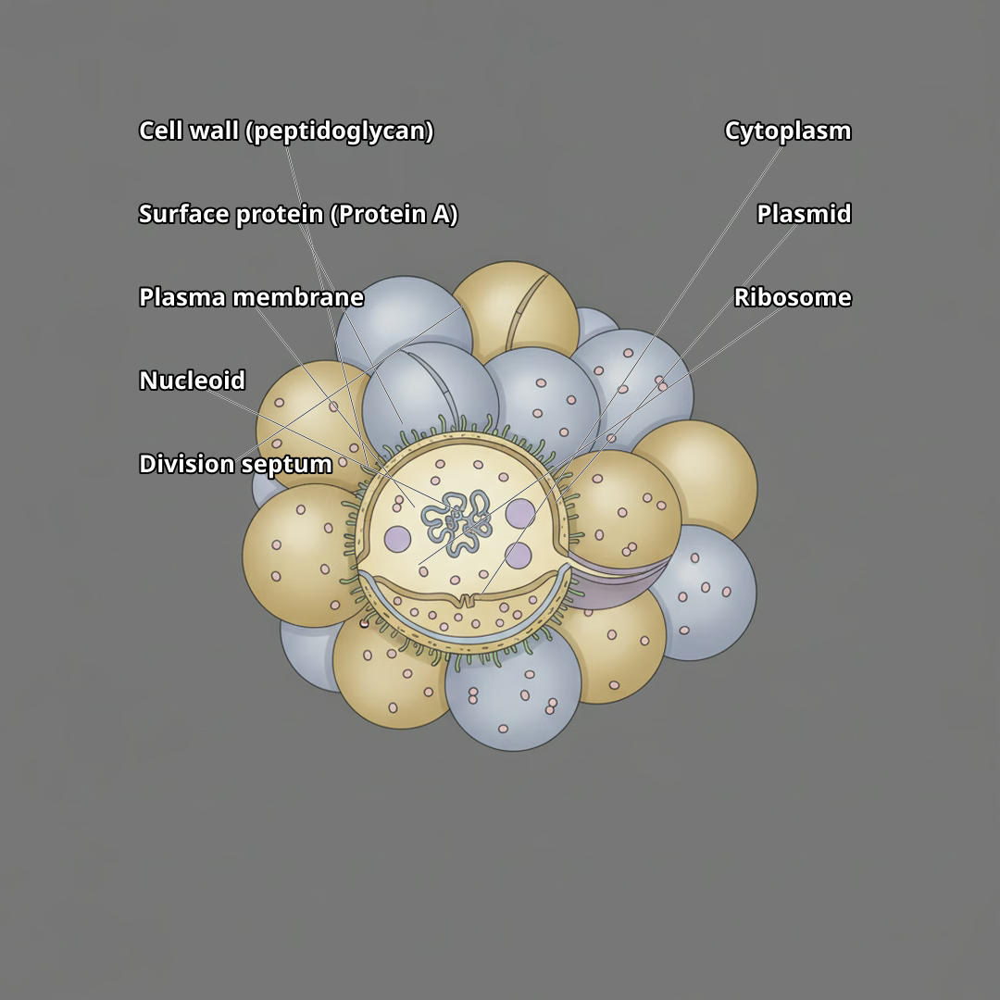 | **3D · labelled** 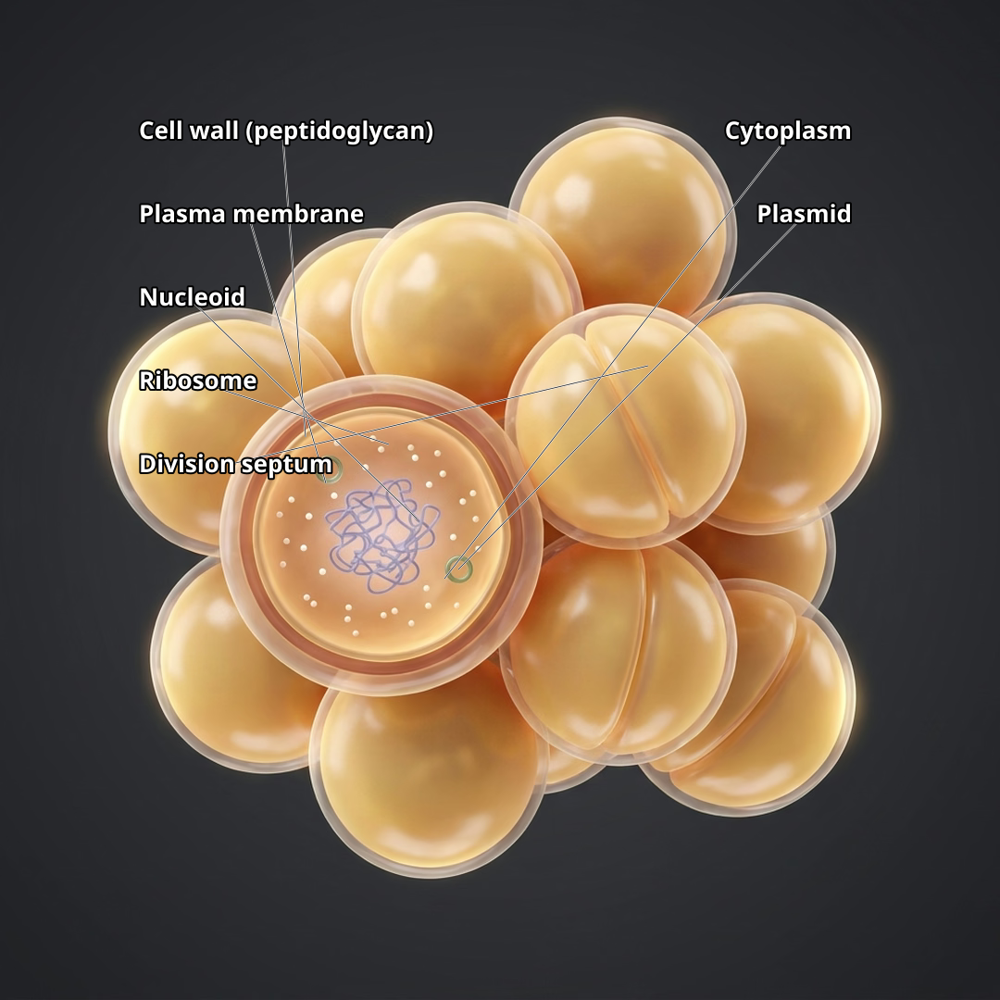 | **Watercolor · labelled** 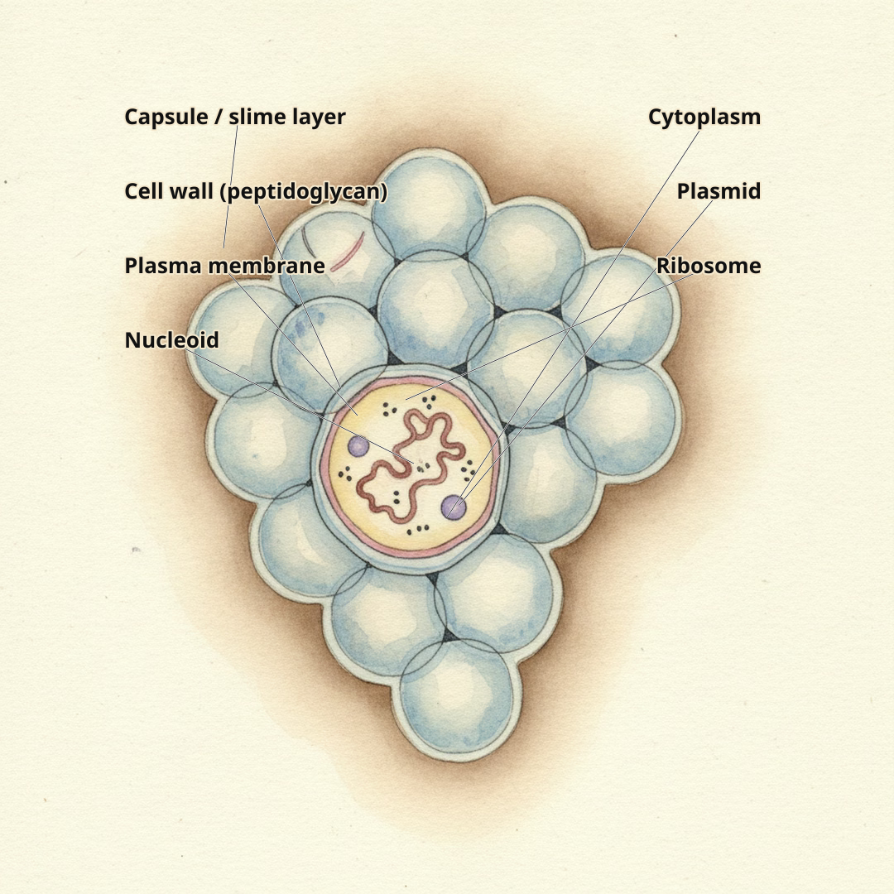 |

| Audience | English | Deutsch |
| --- | --- | --- |
| **Kids** | Meet Staph, a round little ball that never travels alone - it always piles up with its friends into a squishy bunch that looks just like a cluster of grapes! Most of the time Staph is just chilling on your skin or in your nose, being no trouble at all. But if it slips into a scrape or a cut, it can turn a wound red, puffy and sore. The good news: a clean bandage and some soap and water often send it packing, and for the stubborn clusters a doctor has a special cream or medicine that clears things right up. | Das ist Staph, eine runde kleine Kugel, die nie allein unterwegs ist - sie kuschelt sich immer mit ihren Freunden zu einem wabbeligen Haufen zusammen, der aussieht wie eine Weintraube! Meistens sitzt Staph einfach entspannt auf deiner Haut oder in deiner Nase und macht gar keinen Ärger. Rutscht es aber in eine Schürfwunde oder einen Kratzer, kann es die Stelle rot, dick und wund machen. Die gute Nachricht: Ein sauberes Pflaster und etwas Seife und Wasser schicken es oft schon wieder weg, und bei den hartnäckigen Haufen hat der Arzt eine besondere Creme oder Medizin, die alles wieder in Ordnung bringt. |
| **Adults** | Staphylococcus aureus is one of the most common bacteria carried on human skin and in the nose, usually without causing any harm at all - roughly a third of people carry it at any given time. Trouble starts when it gets past a break in the skin: a splinter, a shaving nick, a surgical incision, and it can trigger anything from a small boil to a deep abscess or, rarely, a bloodstream infection. What makes it a public-health concern today is MRSA, a strain that has picked up resistance to the penicillin-family antibiotics doctors would normally reach for first. Good wound care, hand hygiene and, when needed, antibiotics chosen to match the resistance pattern keep it in check. | Staphylococcus aureus gehört zu den häufigsten Bakterien auf der menschlichen Haut und in der Nase und richtet dabei meist keinerlei Schaden an - etwa ein Drittel aller Menschen trägt es zu jedem Zeitpunkt in sich. Probleme entstehen, wenn es durch eine Hautverletzung eindringt, etwa einen Splitter, eine Rasurwunde oder einen chirurgischen Schnitt, und dann von einem kleinen Furunkel bis zu einem tiefen Abszess oder, selten, einer Blutbahninfektion alles auslösen kann. Zum aktuellen Gesundheitsthema wird es durch MRSA, einen Stamm, der Resistenzen gegen die sonst als erste Wahl eingesetzten Penicillin-Antibiotika entwickelt hat. Gute Wundversorgung, Händehygiene und, wenn nötig, gezielt auf das Resistenzmuster abgestimmte Antibiotika halten es in Schach. |
| **Scientific** | Staphylococcus aureus is a Gram-positive, non-motile, catalase- and coagulase-positive coccus (~0.5-1.5 um) that divides in successive, irregular planes to form the characteristic grape-like clusters. Its envelope is a single thick peptidoglycan wall interwoven with wall teichoic acids and covalently anchored surface proteins (e.g. Protein A, clumping factor, fibronectin-binding proteins) that mediate adhesion and immune evasion, sitting directly on the cytoplasmic membrane with no outer membrane. The golden carotenoid staphyloxanthin confers oxidative-stress resistance and the species' namesake colour. Methicillin-resistant strains (MRSA) carry the SCCmec-borne mecA gene, encoding the low-affinity penicillin-binding protein PBP2a, which renders beta-lactam antibiotics ineffective without altering cell morphology. Clinically, S. aureus ranges from asymptomatic nasal/skin colonisation to superficial pyogenic infections (folliculitis, abscess) and, via secreted toxins and invasion, to bacteraemia, endocarditis and toxic shock syndrome. | Staphylococcus aureus ist ein grampositiver, unbeweglicher, katalase- und koagulasepositiver Kokkus (~0,5-1,5 um), der sich in aufeinanderfolgenden, unregelmäßigen Ebenen teilt und dadurch die charakteristischen traubenartigen Zellhaufen bildet. Seine Hülle besteht aus einer einzigen dicken Peptidoglykanwand, durchzogen von Teichonsäuren und kovalent verankerten Oberflächenproteinen (z. B. Protein A, Clumping-Faktor, Fibronektin-bindende Proteine), die Adhäsion und Immunevasion vermitteln, und liegt direkt der Zytoplasmamembran an, ohne äußere Membran. Das goldene Carotinoid Staphyloxanthin verleiht oxidativen Stressschutz und die namensgebende gelbe Farbe. Methicillin-resistente Stämme (MRSA) tragen das auf der SCCmec-Kassette liegende mecA-Gen, das das niedrig affine Penicillin-Bindeprotein PBP2a kodiert und Beta-Lactam-Antibiotika wirkungslos macht, ohne die Zellmorphologie zu verändern. Klinisch reicht S. aureus von symptomloser Besiedlung von Nase und Haut über eitrige Hautinfektionen (Follikulitis, Abszess) bis hin zu, durch sezernierte Toxine und Invasion, Bakteriämie, Endokarditis und toxischem Schocksyndrom. |

[full log](set/pathogens-bacteria/staphylococcus-aureus.render.md) · [set overview](set/pathogens-bacteria/OVERVIEW.md)

---

### Streptococcus mutans (tooth decay) (`streptococcus-mutans`)
Chain-forming Gram-positive coccus of dental plaque that turns sucrose into a sticky glucan biofilm and lactic acid, dissolving tooth enamel.

| Textbook | SEM | 3D | Watercolor |
| --- | --- | --- | --- |
|  |  |  |  |
| **Reference (real)**  | **Textbook · labelled**  | **3D · labelled**  | **Watercolor · labelled**  |

| Audience | English | Deutsch |
| --- | --- | --- |
| **Kids** | Meet Streptococcus mutans, the sweet tooth of the microbe world! It lives on your teeth, holding hands with its friends in long wobbly chains. Its favourite food is sugar - and whenever you eat something sweet, it spins the sugar into a sticky glue and builds a slimy fort called plaque right on your tooth. Safe inside its fort, it burps out acid, and that acid nibbles tiny holes into the hard white enamel until a cavity appears. Luckily this one is easy to beat, and you do it yourself: brush twice a day so the fort gets scrubbed away, slide floss between your teeth where the brush cannot reach, use a fluoride toothpaste that makes your enamel tough as armour, and keep the sugary snacks to mealtimes so the chain gang never gets a feast. | Das ist Streptococcus mutans, die Naschkatze unter den Mikroben! Er wohnt auf deinen Zähnen und hält sich mit seinen Freunden an den Händen - als lange, wackelige Kette. Am liebsten frisst er Zucker: Immer wenn du etwas Süßes isst, spinnt er daraus einen klebrigen Kleber und baut sich damit eine schleimige Burg auf dem Zahn, den Zahnbelag. Sicher in seiner Burg rülpst er Säure aus, und die knabbert winzige Löcher in den harten weißen Zahnschmelz, bis ein Loch im Zahn entsteht. Zum Glück kannst du ihn ganz leicht besiegen, und zwar selbst: zweimal am Tag putzen, damit die Burg weggeschrubbt wird, mit Zahnseide zwischen die Zähne fahren, wo die Bürste nicht hinkommt, eine Zahnpasta mit Fluorid benutzen, die den Zahnschmelz panzerhart macht, und Süßigkeiten nur zu den Mahlzeiten essen, damit die Kettenbande nie ein Festmahl bekommt. |
| **Adults** | Streptococcus mutans is a small Gram-positive coccus that grows in chains and is one of the best-studied residents of dental plaque. What makes it special is a set of enzymes called glucosyltransferases: they grab dietary sucrose, split it, and weave the glucose into long sticky glucan chains. That glue cements the bacteria onto the tooth's protein film and to one another, building the dense biofilm we scrape off every morning. Under that cap, the bacteria ferment sugar into lactic acid, and because the biofilm slows diffusion the acid stays put and pulls calcium and phosphate out of the enamel. S. mutans also tolerates acid far better than most of its neighbours, so a mouth bathed in sugar gradually selects for it. Nothing here needs an antibiotic: mechanical removal of the biofilm by brushing and flossing, fluoride to make enamel more resistant and to help it remineralise, and limiting how often sugar arrives are what keep it in check. Rarely, after dental work, the same species enters the bloodstream and can settle on a damaged heart valve. | Streptococcus mutans ist ein kleiner grampositiver Kokkus, der in Ketten wächst und zu den bestuntersuchten Bewohnern des Zahnbelags gehört. Das Besondere sind seine Glucosyltransferasen: Diese Enzyme greifen sich den Haushaltszucker aus der Nahrung, spalten ihn und verweben den Glucose-Anteil zu langen, klebrigen Glucan-Ketten. Dieser Kleber zementiert die Bakterien auf dem Eiweißfilm des Zahns und aneinander fest und baut so den dichten Biofilm, den wir jeden Morgen wegputzen. Unter dieser Decke vergären die Bakterien Zucker zu Milchsäure, und weil der Biofilm den Austausch bremst, bleibt die Säure liegen und löst Calcium und Phosphat aus dem Zahnschmelz heraus. S. mutans verträgt Säure zudem deutlich besser als die meisten Nachbarn, sodass ein dauernd zuckriger Mund ihn nach und nach begünstigt. Antibiotika braucht es dafür nicht: Der Biofilm wird mechanisch entfernt - Zähneputzen und Zahnseide -, Fluorid macht den Schmelz widerstandsfähiger und unterstützt die Remineralisation, und entscheidend ist, wie oft Zucker nachkommt. Selten gelangt dieselbe Art nach zahnärztlichen Eingriffen ins Blut und kann sich dort auf einer vorgeschädigten Herzklappe festsetzen. |
| **Scientific** | Streptococcus mutans is a non-motile, non-sporulating, facultatively anaerobic Gram-positive coccus, 0.5-0.75 µm in diameter, that divides in a single plane and therefore grows in chains; its envelope comprises a plasma membrane, a single thick peptidoglycan layer threaded with lipoteichoic acid, and a serotype-defining rhamnose-glucose polysaccharide, but no antiphagocytic capsule. Its cariogenicity rests on three linked traits: sucrose-dependent adherence, in which cell-wall-anchored glucosyltransferases GtfB, GtfC and GtfD polymerise the glucosyl moiety of sucrose into water-insoluble alpha(1-3)- and alpha(1-6)-linked glucans that form the extracellular polysaccharide matrix of dental plaque and are re-bound by glucan-binding proteins GbpA-D; sucrose-independent adherence to the acquired salivary pellicle via the antigen I/II adhesin P1 (SpaP); and a homolactic, strongly acidogenic metabolism coupled to marked aciduricity, sustained largely by an acid-tolerant F1Fo-ATPase that maintains delta-pH across the membrane. Within the diffusion-limited biofilm the resulting drop below the critical pH of about 5.5 drives net demineralisation of enamel hydroxyapatite. Control is ecological and mechanical rather than antimicrobial - biofilm disruption, fluoride-assisted remineralisation and reduced frequency of fermentable carbohydrate - while Cnm-positive strains are additionally associated with infective endocarditis after bacteraemia. | Streptococcus mutans ist ein unbeweglicher, nicht sporenbildender, fakultativ anaerober grampositiver Kokkus von 0,5-0,75 µm Durchmesser, der sich in nur einer Ebene teilt und deshalb in Ketten wächst; seine Hülle besteht aus Zytoplasmamembran, einer einzelnen dicken Peptidoglycanschicht mit eingelagerter Lipoteichonsäure und einem serotypbestimmenden Rhamnose-Glucose-Polysaccharid, jedoch ohne antiphagozytäre Kapsel. Seine Kariogenität beruht auf drei verknüpften Eigenschaften: der saccharoseabhängigen Adhärenz, bei der die zellwandverankerten Glucosyltransferasen GtfB, GtfC und GtfD den Glucoseanteil der Saccharose zu wasserunlöslichen alpha(1-3)- und alpha(1-6)-verknüpften Glucanen polymerisieren, die die extrazelluläre Polysaccharidmatrix des Zahnbelags bilden und über die Glucan-bindenden Proteine GbpA-D wieder gebunden werden; der saccharoseunabhängigen Anheftung an die erworbene Speichelpellikel über das Antigen-I/II-Adhäsin P1 (SpaP); sowie einem homolaktischen, stark acidogenen Stoffwechsel in Verbindung mit ausgeprägter Aciduritität, die vor allem durch eine säuretolerante F1Fo-ATPase zur Aufrechterhaltung des Protonengradienten getragen wird. Im diffusionsbegrenzten Biofilm führt der Abfall unter den kritischen pH-Wert von etwa 5,5 zur Netto-Demineralisation des Schmelz-Hydroxylapatits. Die Kontrolle erfolgt ökologisch und mechanisch statt antimikrobiell - Biofilmentfernung, fluoridgestützte Remineralisation und seltenere Zufuhr fermentierbarer Kohlenhydrate -, während Cnm-positive Stämme zusätzlich mit infektiöser Endokarditis nach Bakteriämie in Verbindung gebracht werden. |

[full log](set/pathogens-bacteria/streptococcus-mutans.render.md) · [set overview](set/pathogens-bacteria/OVERVIEW.md)

---

### Streptococcus pneumoniae (`streptococcus-pneumoniae`)
Lancet-shaped Gram-positive coccus in pairs and short chains, wrapped in a thick polysaccharide capsule; leading cause of pneumonia, otitis media and meningitis.

| Textbook | SEM | 3D | Watercolor |
| --- | --- | --- | --- |
|  |  |  |  |
| **Reference (real)**  | **Textbook · labelled** 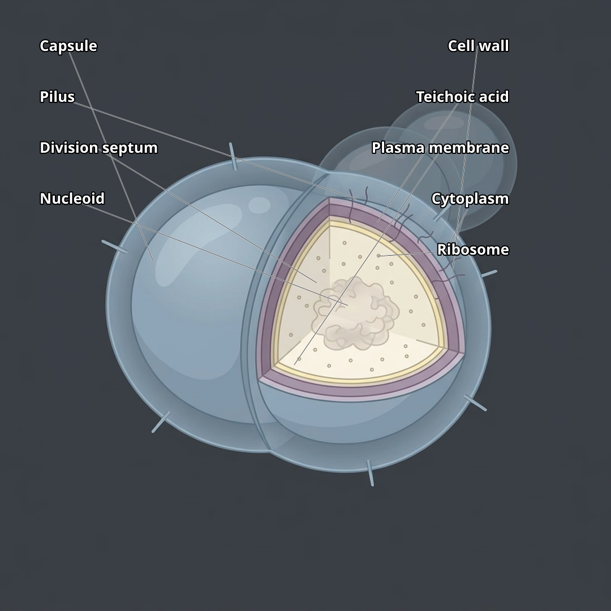 | **3D · labelled** 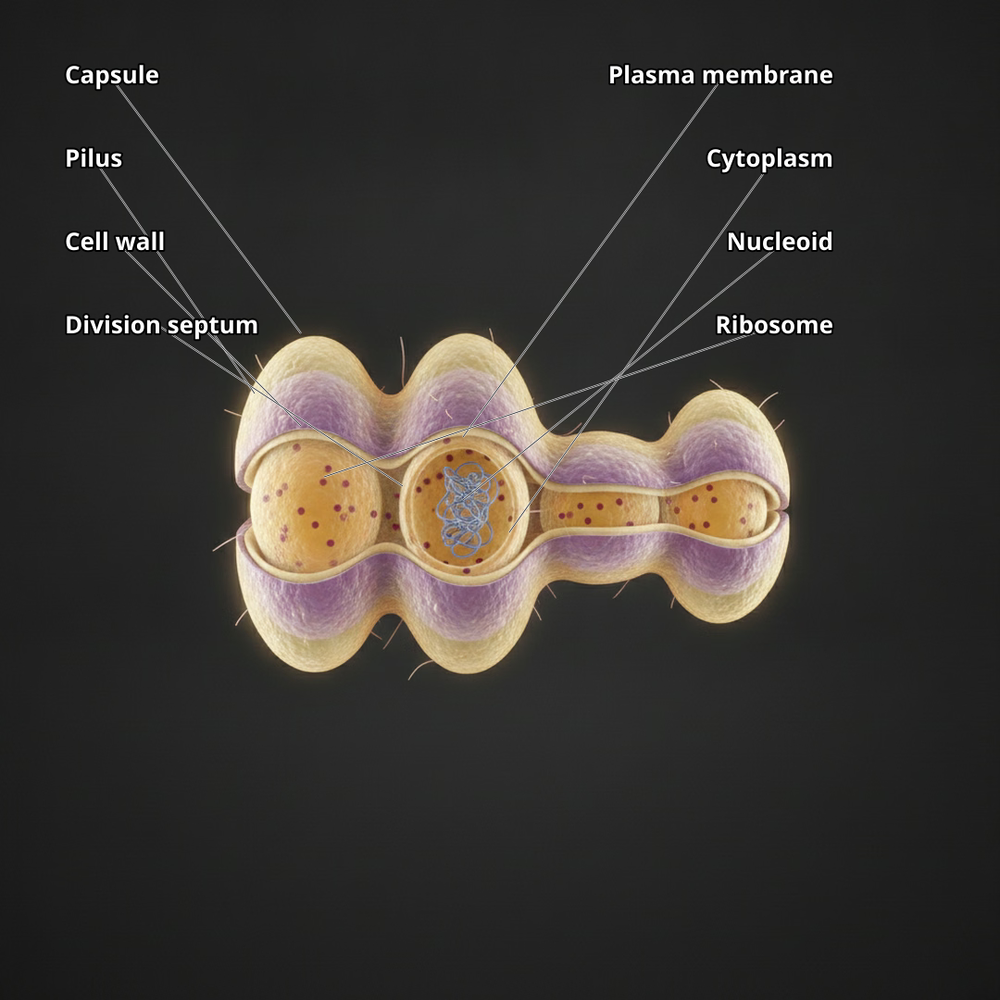 | **Watercolor · labelled** 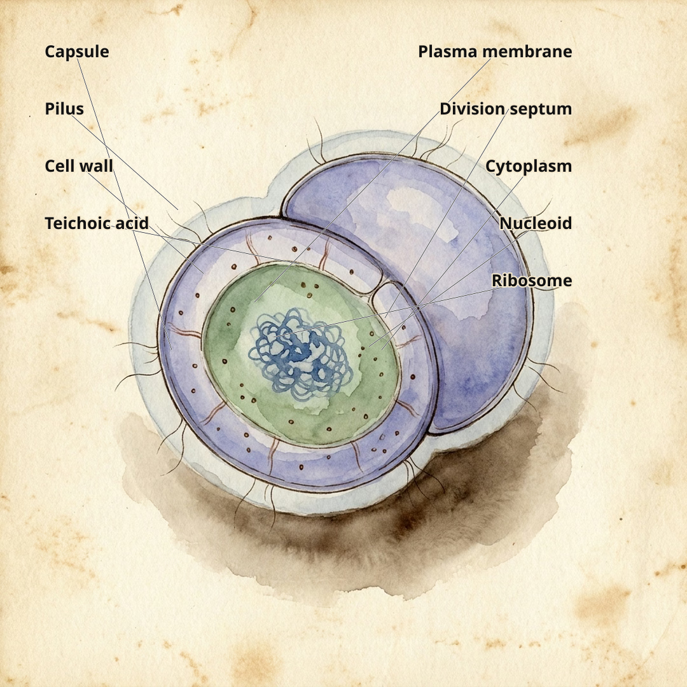 |

| Audience | English | Deutsch |
| --- | --- | --- |
| **Kids** | Meet the Pneumococcus, a tiny round buddy that never travels alone - it always comes paired up with a twin, sometimes lined up in a short little train! It wraps itself in a squishy, slippery coat so it can hide from the body's patrol cells. Most of the time it just naps quietly in someone's nose without causing any trouble. But if it sneaks down into the lungs or ears, it can make someone cough a lot or get an achy earache. The good news: doctors have a special vaccine that teaches your body to spot its slippery coat early, so it never gets the chance to cause a fuss. | Das ist der Pneumokokkus, ein winziger runder Kumpel, der nie allein unterwegs ist - er reist immer mit seinem Zwilling, manchmal sogar als kleine Perlenkette! Er hüllt sich in einen glitschigen, schleimigen Mantel, damit ihn die Wachzellen des Körpers nicht so leicht erwischen. Meistens döst er einfach ganz ruhig in jemandes Nase, ohne Ärger zu machen. Wenn er sich aber in die Lunge oder ins Ohr schleicht, kann er starken Husten oder ein pochendes Ohrweh auslösen. Die gute Nachricht: Es gibt eine besondere Impfung, die dem Körper beibringt, den glitschigen Mantel früh zu erkennen, damit er gar nicht erst Unfug treiben kann. |
| **Adults** | Streptococcus pneumoniae, the pneumococcus, is a lancet-shaped bacterium that typically sits in pairs or short chains and quietly colonises the nose and throat of many healthy people without ever causing harm. Its defining feature is a thick polysaccharide capsule, built in over ninety different chemical varieties, that shields it from being engulfed by immune cells. Trouble starts only if it spreads from its usual perch into the lungs, middle ear, sinuses or bloodstream, where it is a leading cause of pneumonia, ear infections and, more rarely, meningitis. Because the capsule is also what the immune system learns to recognise, pneumococcal vaccines that target its most common serotypes have dramatically cut severe disease in children and older adults. | Streptococcus pneumoniae, der Pneumokokkus, ist ein lanzettförmiges Bakterium, das meist paarweise oder in kurzen Ketten auftritt und bei vielen gesunden Menschen still in Nase und Rachen siedelt, ohne jemals Schaden anzurichten. Sein Erkennungsmerkmal ist eine dicke Polysaccharidkapsel in über neunzig chemisch unterschiedlichen Varianten, die es vor dem Verschlungenwerden durch Immunzellen schützt. Probleme entstehen erst, wenn es von seinem gewohnten Platz aus in die Lunge, das Mittelohr, die Nasennebenhöhlen oder die Blutbahn vordringt - dort zählt es zu den häufigsten Ursachen von Lungenentzündung, Ohrenentzündungen und, seltener, Hirnhautentzündung. Weil gerade die Kapsel das ist, was das Immunsystem erkennen lernt, haben Impfstoffe gegen die häufigsten Serotypen schwere Erkrankungen bei Kindern und älteren Menschen deutlich zurückgedrängt. |
| **Scientific** | Streptococcus pneumoniae is a Gram-positive, alpha-haemolytic, non-motile diplococcus with a characteristic lancet or ovoid morphology, arranged in pairs or short chains rather than the long chains typical of other streptococci. Its cell wall carries choline-decorated teichoic acid that anchors a family of choline-binding surface proteins, including the autolysin LytA, and its dominant virulence determinant is a capsular polysaccharide expressed in more than ninety serotypes that impedes complement deposition and phagocytic uptake until opsonised by serotype-specific antibody. Additional factors, including pneumolysin, pilus adhesins and IgA1 protease, contribute to colonisation of the nasopharyngeal mucosa and, upon dissemination, to invasive disease such as pneumonia, otitis media, sinusitis, bacteraemia and meningitis. Capsule-based conjugate and polysaccharide vaccines, together with naturally acquired and vaccine-induced anticapsular antibody, remain the principal correlates of protection against pneumococcal disease. | Streptococcus pneumoniae ist ein grampositiver, alpha-hämolysierender, unbeweglicher Diplokokkus mit charakteristisch lanzett- bis eiförmiger Morphologie, der paarweise oder in kurzen Ketten auftritt und nicht in den langen Ketten anderer Streptokokken. Seine Zellwand trägt cholinhaltige Teichonsäure, die eine Familie cholinbindender Oberflächenproteine verankert, darunter das Autolysin LytA; sein wichtigster Virulenzfaktor ist eine Kapselpolysaccharidhülle in mehr als neunzig Serotypen, die die Komplementablagerung und Phagozytose behindert, bis serotypspezifische Antikörper opsonisieren. Weitere Faktoren wie Pneumolysin, Pilus-Adhäsine und IgA1-Protease tragen zur Besiedlung der Nasen-Rachen-Schleimhaut und, bei Streuung, zu invasiven Erkrankungen wie Pneumonie, Otitis media, Sinusitis, Bakteriämie und Meningitis bei. Kapselbasierte Konjugat- und Polysaccharidimpfstoffe bleiben zusammen mit natürlich erworbenen und impfinduzierten Antikapsel-Antikörpern die wichtigsten Schutzkorrelate gegen Pneumokokkenerkrankungen. |

[full log](set/pathogens-bacteria/streptococcus-pneumoniae.render.md) · [set overview](set/pathogens-bacteria/OVERVIEW.md)

---

## Set: `pathogens-generic`

### Amoeba (Amoeba proteus) (`amoeba-proteus`)
Large free-living freshwater single cell (~250–750 µm) with no fixed shape: it crawls on blunt lobopodia by cytoplasmic streaming and engulfs its prey. Harmless to humans — the textbook example of a cell that crawls and eats, exactly as our macrophages do. Not Entamoeba histolytica.

| Textbook | SEM | 3D | Watercolor |
| --- | --- | --- | --- |
|  |  |  |  |
| **Reference (real)**  | **Textbook · labelled**  | **3D · labelled**  | **Watercolor · labelled**  |

| Audience | English | Deutsch |
| --- | --- | --- |
| **Kids** | Say hello to Amoeba — a single cell so big that you can spot it in a drop of pond water as a tiny creeping speck, without any microscope at all! It has no fixed shape whatsoever. To walk, it simply pours a fat blob of itself forward into a stubby false foot called a pseudopod, and the rest of it flows along behind, so it never takes a step — it just oozes in whichever direction it fancies. And it eats by hugging: when it bumps into a tasty green alga it stretches its blobby arms all the way around it, wraps them shut, and takes the snack inside into a little bubble where it slowly gets dissolved into lunch. Living in fresh water means water keeps seeping into it, so it also has its own built-in bilge pump — a clear round bubble that swells up and then squeezes the extra water back out again. Amoeba will never make you poorly; it just potters about in ponds and puddles eating even smaller things. And here is the really cool bit: the hunting cells in your own blood, the macrophages, crawl and gobble in exactly the same way. | Sag Hallo zur Amöbe — eine einzige Zelle, die so groß ist, dass du sie in einem Tropfen Teichwasser als winziges kriechendes Pünktchen sehen kannst, ganz ohne Mikroskop! Sie hat überhaupt keine feste Form. Zum Laufen schiebt sie einfach einen dicken Klecks von sich nach vorne, ein sogenanntes Scheinfüßchen, und der ganze Rest fließt hinterher — sie macht also nie einen Schritt, sie quillt einfach dorthin, wo sie hinmöchte. Und sie frisst, indem sie umarmt: Wenn sie auf eine leckere grüne Alge stößt, streckt sie ihre Klecksarme rundherum aus, schließt sie zu und nimmt den Snack in eine kleine Blase in ihrem Inneren auf, wo er langsam zu Mittagessen aufgelöst wird. Weil sie im Süßwasser lebt, sickert ständig Wasser in sie hinein, deshalb hat sie auch ihre eigene eingebaute Pumpe — eine klare runde Blase, die sich vollsaugt und das überschüssige Wasser dann wieder hinausdrückt. Krank machen wird dich die Amöbe nie; sie tuckert einfach in Teichen und Pfützen herum und frisst noch kleinere Sachen. Und jetzt kommt das Coolste: Die Jägerzellen in deinem eigenen Blut, die Makrophagen, kriechen und schlingen ganz genauso. |
| **Adults** | Amoeba proteus is the organism almost every school microscopy course starts with — and for good reason. At roughly 250 to 750 micrometres it is enormous for a single cell, big enough that a sharp eye can pick it out of pond water as a pale, slowly shifting speck without a microscope. It is a naked lobose amoeba: no cell wall, no shell, no flagella, no cilia and no shape it keeps for more than a moment, which is why it was named after Proteus, the shape-shifting sea god. It moves by turning its own cytoplasm from a stiff gel into a runnable fluid at the front and letting it stream into blunt, tube-shaped false feet called lobopodia — you can literally watch the granules inside flow forward under the microscope. And it feeds by wrapping: pseudopods flow around a ciliate, a flagellate or an algal cell until they meet and fuse, enclosing the prey in a food vacuole that is then digested from the inside. A clear round contractile vacuole works as a bilge pump, gathering the fresh water that constantly seeps in osmotically and expelling it at the surface every few minutes. One important thing to be clear about: Amoeba proteus is completely harmless to people. It is not Entamoeba histolytica, the very different gut parasite behind amoebic dysentery, and it is not the rare brain-infecting Naegleria. Its real significance is that it makes visible, at pond scale, the two things your own macrophages and neutrophils do every day — crawling on pseudopods and eating by engulfment. | Amoeba proteus ist der Organismus, mit dem fast jeder Mikroskopierkurs in der Schule beginnt — aus gutem Grund. Mit etwa 250 bis 750 Mikrometern ist sie für eine einzelne Zelle riesig, groß genug, dass ein scharfes Auge sie im Teichwasser als blasses, sich langsam veränderndes Pünktchen auch ohne Mikroskop erkennt. Sie ist eine nackte Lobosa-Amöbe: keine Zellwand, keine Schale, keine Geißel, keine Wimpern und keine Form, die sie länger als einen Augenblick behält — deshalb ist sie nach Proteus benannt, dem gestaltwandelnden Meeresgott. Sie bewegt sich, indem sie ihr eigenes Zytoplasma vorne von einem festen Gel in eine fließfähige Flüssigkeit umwandelt und in stumpfe, schlauchförmige Scheinfüßchen (Lobopodien) strömen lässt — unter dem Mikroskop kann man die Körnchen im Inneren regelrecht nach vorne fließen sehen. Und sie frisst, indem sie umschließt: Die Pseudopodien fließen um einen Wimpertierchen-, Geißeltierchen- oder Algenzelle herum, bis sie sich treffen und verschmelzen, und schließen die Beute in eine Nahrungsvakuole ein, die dann von innen verdaut wird. Eine klare runde kontraktile Vakuole arbeitet als Lenzpumpe: Sie sammelt das Süßwasser, das osmotisch ständig hereinsickert, und presst es alle paar Minuten an der Oberfläche wieder hinaus. Eines sollte man klar sagen: Amoeba proteus ist für den Menschen völlig harmlos. Sie ist nicht Entamoeba histolytica, der ganz andere Darmparasit hinter der Amöbenruhr, und auch nicht die seltene, das Gehirn befallende Naegleria. Ihre eigentliche Bedeutung liegt darin, dass sie in Teichgröße sichtbar macht, was deine eigenen Makrophagen und Neutrophilen jeden Tag tun — auf Scheinfüßchen kriechen und durch Umschließen fressen. |
| **Scientific** | Amoeba proteus is a large free-living naked lobose amoeba (Amoebozoa: Tubulinea: Euamoebida) of fresh water, commonly 250–750 µm in its locomotive form and therefore at the limit of naked-eye visibility. The moving cell is polypodial: several blunt, subcylindrical lobopodia with clear hyaline caps extend from a body bounded only by a plasma membrane and a thin glycocalyx — no cell wall, no test, no flagella and no cilia. Locomotion is actin-driven sol–gel cytoplasmic streaming: the peripheral gelated ectoplasm forms a semi-rigid tube through which fluid granular endoplasm flows forward, everts at the advancing hyaline front and gelates again at the periphery, while the trailing uroid is resorbed. The cell carries a single flattened, discoid, granular vesicular nucleus, numerous mitochondria, crystals and lipid inclusions, and one prominent contractile vacuole that periodically fills and discharges at the cell surface, expelling the water taken up osmotically in a strongly hypotonic medium. Nutrition is phagotrophic: pseudopods circumfluent around ciliates, flagellates, algae and other protists until the membranes fuse, forming a food vacuole that acidifies and fuses with lysosomes; undigested residue is egested, typically near the uroid. Reproduction is asexual, by mitosis followed by binary fission; no sexual cycle is established. The species is non-pathogenic and of no medical significance — it is not to be confused with the parasitic Entamoeba histolytica. Its enduring importance is as a model of amoeboid motility and phagocytosis, mechanisms homologous to those used by mammalian macrophages and neutrophils. | Amoeba proteus ist eine große, frei lebende nackte Lobosa-Amöbe (Amoebozoa: Tubulinea: Euamoebida) des Süßwassers, in der Fortbewegungsform meist 250–750 µm groß und damit an der Grenze der Sichtbarkeit mit bloßem Auge. Die kriechende Zelle ist polypodial: Mehrere stumpfe, walzenförmige Lobopodien mit klaren hyalinen Kappen gehen von einem Zellkörper aus, der lediglich von einer Plasmamembran und einer dünnen Glykokalyx begrenzt wird — ohne Zellwand, ohne Schale, ohne Geißel und ohne Wimpern. Die Fortbewegung beruht auf aktingetriebener Sol-Gel-Plasmaströmung: Das periphere, gelierte Ektoplasma bildet eine halbstarre Röhre, in der das flüssige, körnige Endoplasma nach vorne strömt, an der vorrückenden hyalinen Front nach außen umschlägt und am Rand erneut geliert, während der nachgezogene Uroid resorbiert wird. Die Zelle besitzt einen einzigen abgeflachten, scheibenförmigen, körnigen Bläschenkern, zahlreiche Mitochondrien, Kristalle und Lipideinschlüsse sowie eine auffällige kontraktile Vakuole, die sich periodisch füllt und an der Zelloberfläche entleert und so das im stark hypotonen Medium osmotisch aufgenommene Wasser wieder ausscheidet. Die Ernährung ist phagotroph: Pseudopodien umfließen Wimpertierchen, Geißeltierchen, Algen und andere Protisten, bis die Membranen verschmelzen und eine Nahrungsvakuole entsteht, die angesäuert wird und mit Lysosomen fusioniert; unverdaute Reste werden in der Regel nahe dem Uroid ausgeschieden. Die Vermehrung erfolgt ungeschlechtlich durch Mitose mit anschließender Zweiteilung; ein sexueller Zyklus ist nicht gesichert. Die Art ist apathogen und medizinisch bedeutungslos — sie ist nicht mit dem parasitischen Entamoeba histolytica zu verwechseln. Ihre bleibende Bedeutung liegt darin, dass sie als Modell für amöboide Beweglichkeit und Phagozytose dient, Mechanismen, die zu denen von Makrophagen und neutrophilen Granulozyten des Menschen homolog sind. |

[full log](set/pathogens-generic/amoeba-proteus.render.md) · [set overview](set/pathogens-generic/OVERVIEW.md)

---

### Coccus (spherical bacterium) (`cocci`)
Textbook Gram-positive coccus (~1 µm)

| Textbook | SEM | 3D | Watercolor |
| --- | --- | --- | --- |
|  |  |  |  |
| **Reference (real)**  | **Textbook · labelled** 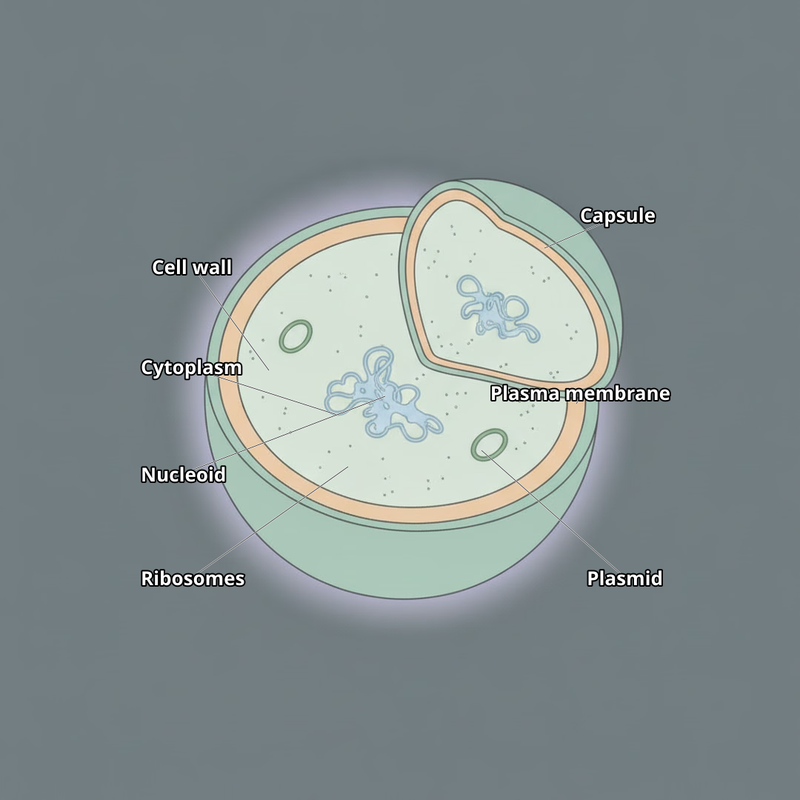 | **3D · labelled** 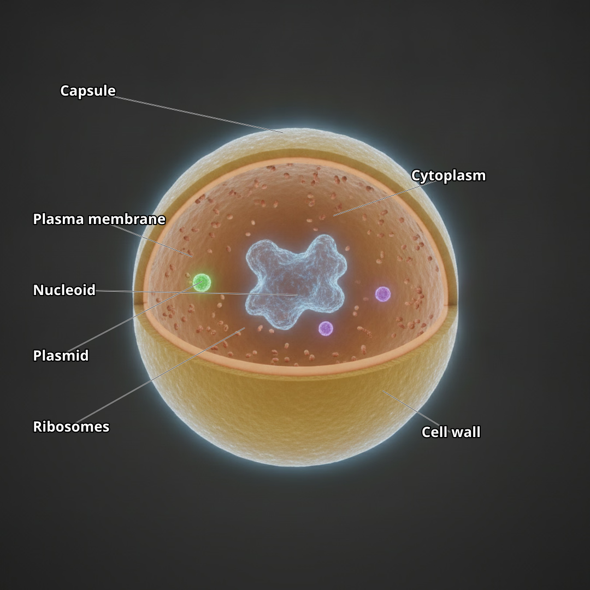 | **Watercolor · labelled** 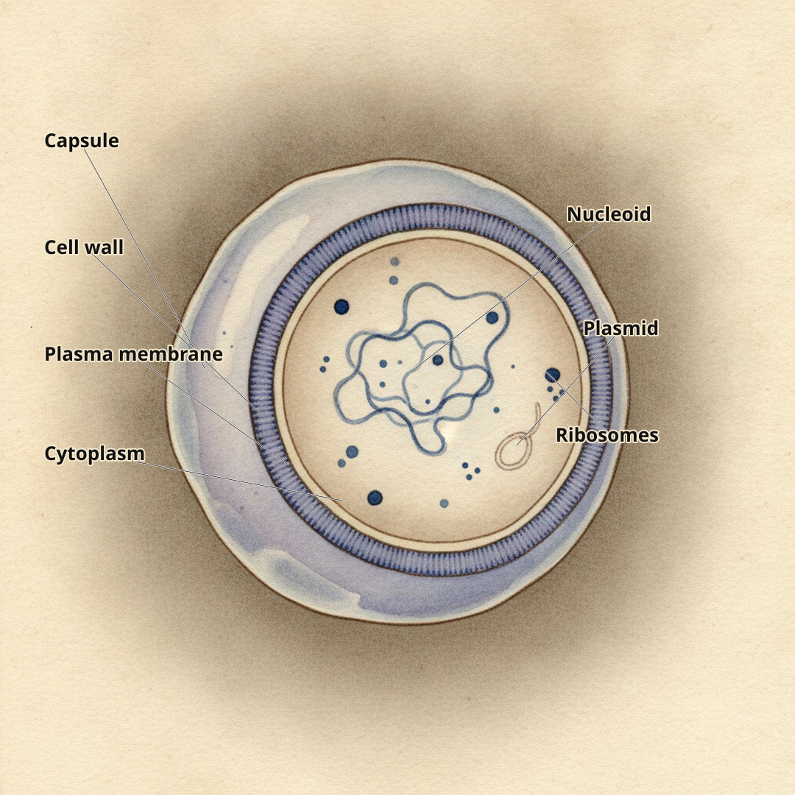 |

| Audience | English | Deutsch |
| --- | --- | --- |
| **Kids** | Say hello to a coccus - a teeny tiny round ball, way too small to see! Cocci love to hang out together: some bunch up like little grape clusters, others line up in chains like beads on a string. Lots of them live happily on your skin and never bother you. But a few troublemakers can give you a sore throat or a red, sore spot on your skin. When that happens, clean hands, a bit of rest and sometimes a little medicine from the doctor soon chase the round troublemakers away! | Sag Hallo zu einem Kokkus - einer winzig kleinen runden Kugel, viel zu klein zum Sehen! Kokken sind gern zusammen: Manche kleben aneinander wie kleine Weintrauben, andere reihen sich auf wie Perlen an einer Schnur. Viele von ihnen leben ganz friedlich auf deiner Haut und stören dich überhaupt nicht. Aber ein paar Störenfriede können dir Halsschmerzen machen oder eine rote, wunde Stelle auf der Haut. Dann helfen saubere Hände, etwas Ruhe und manchmal eine kleine Medizin vom Arzt, bis die runden Störenfriede wieder verschwinden! |
| **Adults** | Cocci are spherical bacteria, and they are constant companions of the human body. Many species are peaceful residents of the skin and throat, part of the microbiome that helps keep more aggressive microbes in check. Others, though, cause real disease: Staphylococcus aureus leads to skin, wound and bloodstream infections, while streptococci cause strep throat and pneumonia. Because staph and strep spread easily, antibiotic resistance is a growing concern - MRSA is a well-known resistant strain. Good hygiene, careful antibiotic use, and vaccines such as the pneumococcal shot are our main tools for keeping these round bacteria in balance. | Kokken sind kugelförmige Bakterien und ständige Begleiter des menschlichen Körpers. Viele Arten sind friedliche Bewohner von Haut und Rachen, ein Teil des Mikrobioms, das aggressivere Keime in Schach hält. Andere jedoch verursachen echte Erkrankungen: Staphylococcus aureus führt zu Haut-, Wund- und Blutstrominfektionen, Streptokokken lösen Halsentzündungen und Lungenentzündung aus. Da sich Staphylokokken und Streptokokken leicht verbreiten, wird Antibiotikaresistenz zunehmend zum Problem - MRSA ist ein bekannter resistenter Stamm. Gute Hygiene, umsichtiger Einsatz von Antibiotika und Impfungen wie die gegen Pneumokokken sind unsere wichtigsten Mittel, um diese runden Bakterien im Gleichgewicht zu halten. |
| **Scientific** | Cocci are spherical bacteria, typically 0.5-1.5 µm across, defined by their cell shape and division pattern. Depending on the planes of division they form pairs (diplococci), chains (streptococci) or grape-like clusters (staphylococci). Most medically important cocci are Gram-positive, with a single cytoplasmic membrane wrapped in a thick peptidoglycan wall studded with teichoic and lipoteichoic acids; they are generally non-motile and lack flagella. Their genome sits in a nucleoid, often accompanied by plasmids that carry virulence and antibiotic-resistance genes spread by horizontal gene transfer. Ecologically they range from commensal skin and mucosal flora to major human pathogens. | Kokken sind kugelförmige Bakterien, typischerweise 0,5-1,5 µm groß, definiert über Zellform und Teilungsmuster. Je nach Teilungsebenen bilden sie Paare (Diplokokken), Ketten (Streptokokken) oder traubenartige Haufen (Staphylokokken). Die meisten medizinisch bedeutsamen Kokken sind grampositiv: Sie besitzen eine einzelne Zytoplasmamembran, umgeben von einer dicken Peptidoglykanschicht mit eingelagerten Teichon- und Lipoteichonsäuren; in der Regel sind sie unbeweglich und ohne Flagellen. Ihr Genom liegt als Nukleoid vor, häufig ergänzt durch Plasmide, die Virulenz- und Antibiotikaresistenzgene tragen und über horizontalen Gentransfer verbreitet werden. Ökologisch reichen sie von kommensaler Haut- und Schleimhautflora bis zu bedeutenden Krankheitserregern des Menschen. |

[full log](set/pathogens-generic/cocci.render.md) · [set overview](set/pathogens-generic/OVERVIEW.md)

---

### Coronavirus (SARS-CoV-2) (`coronavirus`)
Enveloped +ssRNA betacoronavirus (SARS-CoV-2): a ~80–120 nm sphere with a crown of club-shaped Spike (S) trimers, M and E envelope proteins, and a helical nucleocapsid (N + single RNA strand).

| Textbook | SEM | 3D | Watercolor |
| --- | --- | --- | --- |
|  |  |  |  |
| **Reference (real)**  | **Textbook · labelled** 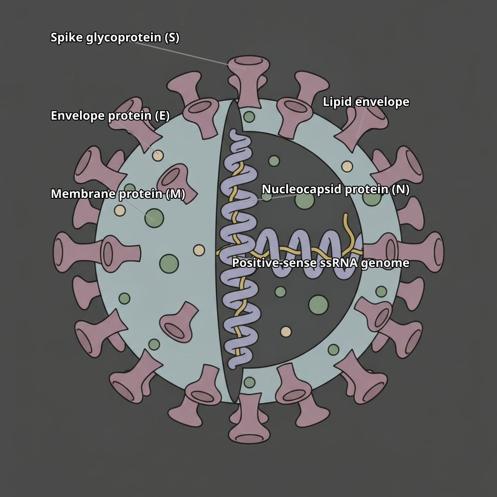 | **3D · labelled** 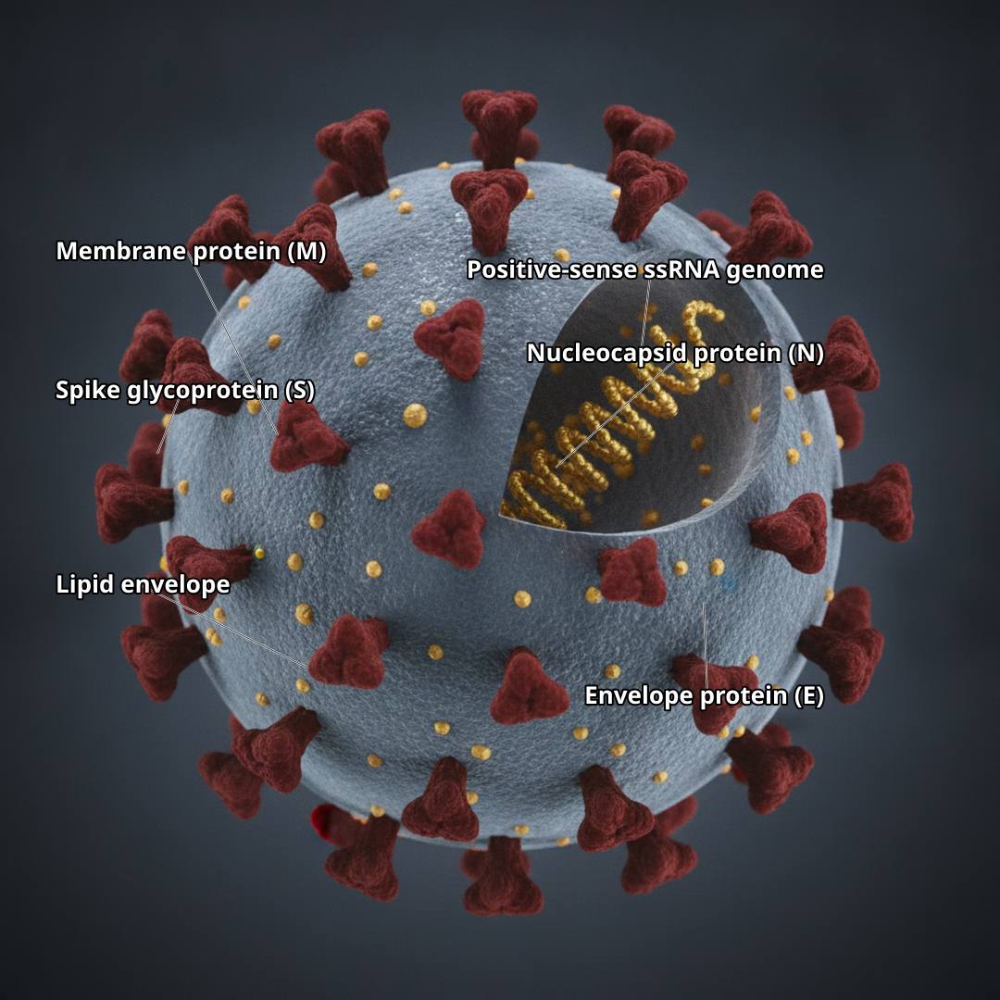 | **Watercolor · labelled** 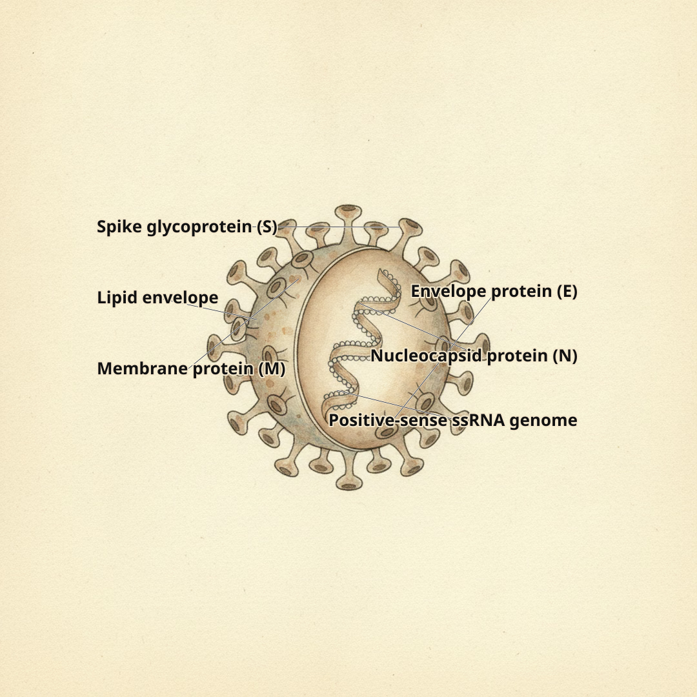 |

| Audience | English | Deutsch |
| --- | --- | --- |
| **Kids** | This is a coronavirus, a teeny-tiny spiky ball wearing a crown of little clubs called spikes. It uses those spikes to grab onto your cells and sneak inside, then makes loads of copies that can leave you coughing and sniffly. Most of the time your body clears it out with rest and plenty of drinks over a week or two. Fresh air and masks stop it drifting from person to person, and a vaccine gives your body a sneak-peek of that spiky crown so it's ready to fight back fast. | Das ist ein Coronavirus, ein winziger stacheliger Ball mit einer Krone aus kleinen Keulen, die man Spikes nennt. Mit diesen Spikes hakt es sich an deine Zellen und schleicht sich hinein, und dann baut es viele Kopien, die dich husten und schniefen lassen. Meistens wirst du es mit Ruhe und viel Trinken nach ein bis zwei Wochen wieder los. Frische Luft und Masken halten es davon ab, von Mensch zu Mensch zu wandern, und eine Impfung zeigt deinem Körper die stachelige Krone schon vorher, damit er schnell bereit ist. |
| **Adults** | SARS-CoV-2 is the coronavirus behind COVID-19, an enveloped particle roughly 100 nm across that spreads mainly through the air in respiratory droplets and fine aerosols. Its club-shaped Spike (S) proteins form the tell-tale crown and latch onto the ACE2 receptor on our cells before fusing in and hijacking them to make copies. Because Spike is the key that opens the door, it is the main target of antibodies and of mRNA and other vaccines, which train the immune system to recognise it. New variants keep tweaking Spike to dodge that recognition, which is why boosters get updated. For people at higher risk, antiviral drugs such as nirmatrelvir/ritonavir can blunt the infection if started early. | SARS-CoV-2 ist das Coronavirus hinter COVID-19, ein behülltes Partikel von rund 100 nm Größe, das sich vor allem über die Luft in Atemtröpfchen und feinen Aerosolen verbreitet. Seine keulenförmigen Spike-Proteine (S) bilden die verräterische Krone und docken am ACE2-Rezeptor unserer Zellen an, bevor das Virus mit ihnen verschmilzt und sie zur Kopienproduktion zwingt. Weil das Spike der Schlüssel zur Zelltür ist, ist es das Hauptziel von Antikörpern sowie von mRNA- und anderen Impfstoffen, die das Immunsystem darauf trainieren. Neue Varianten verändern das Spike immer wieder, um dieser Erkennung zu entgehen, weshalb Auffrischimpfungen angepasst werden. Für Risikogruppen können antivirale Medikamente wie Nirmatrelvir/Ritonavir die Infektion abschwächen, wenn man früh damit beginnt. |
| **Scientific** | SARS-CoV-2 is an enveloped, positive-sense single-stranded RNA betacoronavirus whose ~30 kb genome is the largest known among RNA viruses, capped and polyadenylated so it is translated directly by host ribosomes on entry. Four structural proteins build the ~80–120 nm virion: the Spike (S) trimer, which binds the ACE2 receptor and mediates membrane fusion and is the dominant antigen; the Membrane (M) and Envelope (E) proteins embedded in the host-derived lipid bilayer; and the Nucleocapsid (N) protein, which condenses the genome into a helical ribonucleoprotein rather than an icosahedral capsid. After receptor-mediated entry, replication proceeds entirely in the cytoplasm, where the RNA-dependent RNA polymerase (RdRp) of the replicase complex transcribes genomic and subgenomic RNAs on virus-induced double-membrane vesicles. Progeny assemble at the ER–Golgi intermediate compartment and are released by exocytosis. | SARS-CoV-2 ist ein behülltes Betacoronavirus mit positivsträngiger Einzelstrang-RNA, dessen ~30 kb großes Genom das größte bekannte RNA-Virusgenom ist; es trägt Cap und Poly-A-Schwanz und wird nach dem Eintritt direkt von den Ribosomen des Wirts translatiert. Vier Strukturproteine bauen das 80–120 nm große Virion auf: das Spike-Trimer (S), das den ACE2-Rezeptor bindet, die Membranfusion vermittelt und das dominante Antigen ist; die Proteine Membran (M) und Hülle (E), eingebettet in die wirtseigene Lipiddoppelschicht; sowie das Nukleokapsidprotein (N), das das Genom zu einem helikalen Ribonukleoprotein und nicht zu einem ikosaedrischen Kapsid verdichtet. Nach rezeptorvermitteltem Eintritt läuft die Replikation vollständig im Zytoplasma ab, wo die RNA-abhängige RNA-Polymerase (RdRp) des Replikasekomplexes an virusinduzierten Doppelmembranvesikeln genomische und subgenomische RNAs transkribiert. Die Nachkommen-Virionen werden im ER-Golgi-Zwischenkompartiment zusammengebaut und durch Exozytose freigesetzt. |

[full log](set/pathogens-generic/coronavirus.render.md) · [set overview](set/pathogens-generic/OVERVIEW.md)

---

### Fungus (budding yeast) (`fungus`)
Eukaryotic budding yeast (Candida-type, ~3–5 µm) with a daughter bud and germ tube; nucleus + organelles inside a chitin/β-glucan wall.

| Textbook | SEM | 3D | Watercolor |
| --- | --- | --- | --- |
|  |  |  |  |
| **Reference (real)**  | **Textbook · labelled** 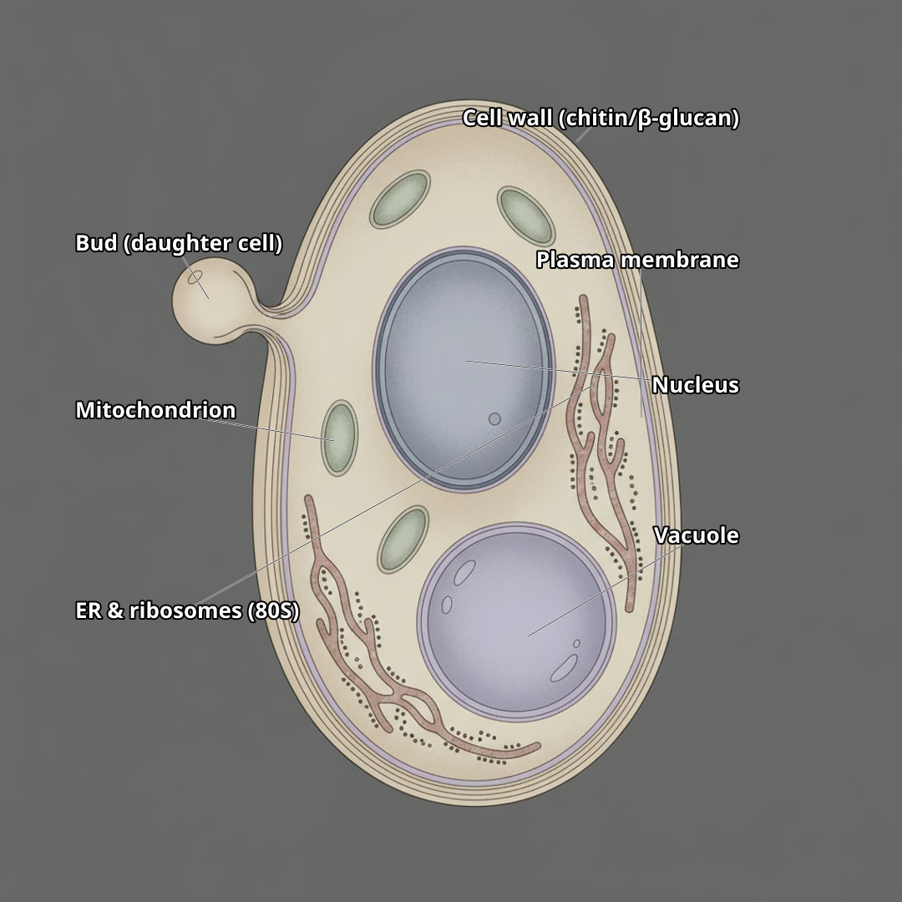 | **3D · labelled** 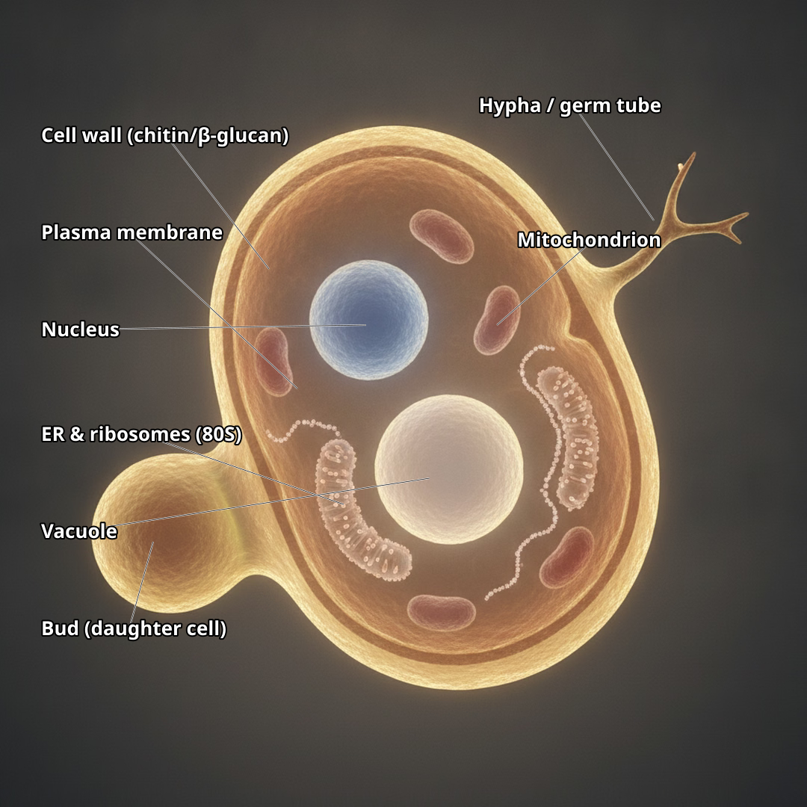 | **Watercolor · labelled** 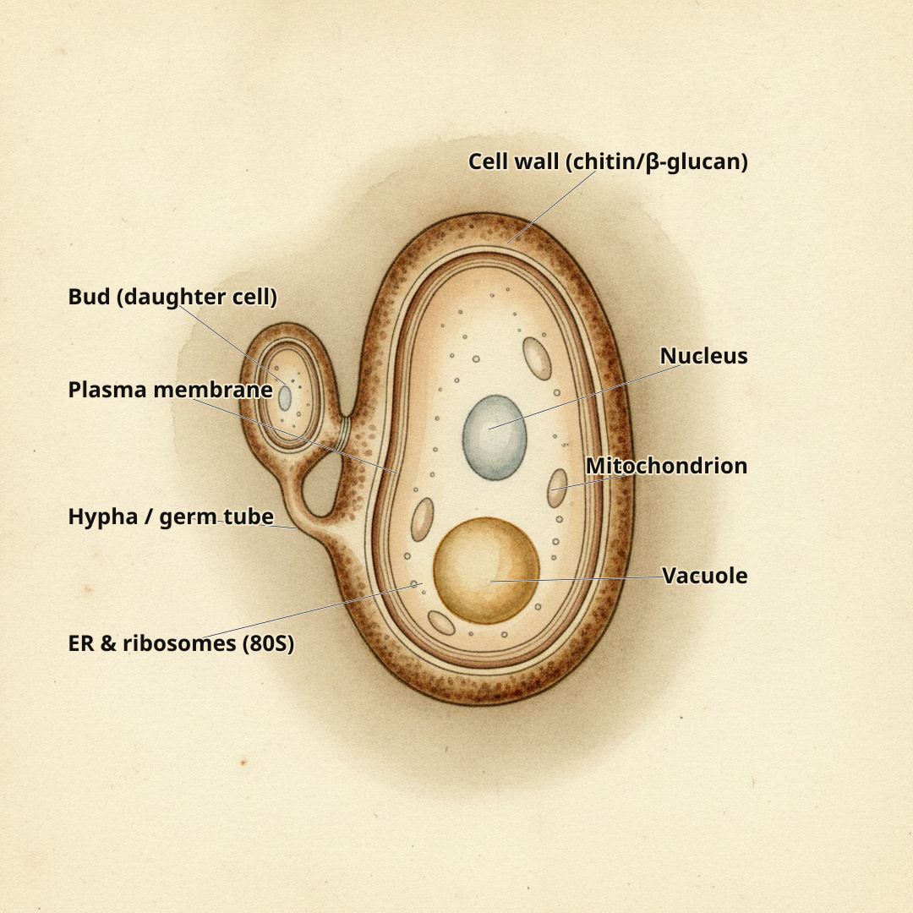 |

| Audience | English | Deutsch |
| --- | --- | --- |
| **Kids** | Meet the yeast — a tiny living blob much bigger and rounder than a bacterium, with a real control room (a nucleus) tucked inside. Instead of splitting in half, a yeast grows a little bump called a bud that swells up and pops off as a brand-new cell. Loads of yeasts live quietly on your skin and in your body and never bother you at all. But sometimes one type throws a party and causes an itchy patch of thrush or athlete's foot. A dab of antifungal cream, keeping the skin cool and dry, and your other friendly microbes crowding it back out usually settle things down. | Das ist die Hefe — ein winziger lebendiger Klecks, viel größer und runder als ein Bakterium, mit einer echten Schaltzentrale (einem Zellkern) darin. Statt sich einfach zu teilen, lässt eine Hefe eine kleine Beule wachsen, eine Knospe, die praller wird und als ganz neue Zelle abplatzt. Ganz viele Hefen leben still auf deiner Haut und in deinem Körper und stören überhaupt nicht. Doch manchmal feiert eine Sorte zu wild und macht einen juckenden Fleck wie Soor oder Fußpilz. Eine Antipilz-Creme, kühle und trockene Haut und deine anderen freundlichen Mikroben, die sie zurückdrängen, bringen alles meist wieder ins Lot. |
| **Adults** | Fungi like Candida are eukaryotic microbes — full cells with a nucleus and organelles — that usually live as harmless commensals in the mouth, gut, and on the skin. Trouble starts when the balance shifts: after antibiotics, with a suppressed immune system, or in warm moist folds, the yeast can overgrow and turn opportunistic, causing oral or vaginal thrush or skin infections. Because a fungal cell is biochemically quite different from a bacterium, it needs antifungal drugs (such as azole or polyene agents) rather than antibiotics. For most healthy people these infections are a nuisance rather than a danger, but in immunocompromised patients invasive fungal disease — including deep Aspergillus infections of the lungs — can be serious and needs prompt treatment. | Pilze wie Candida sind eukaryotische Mikroben — vollwertige Zellen mit Kern und Organellen —, die meist als harmlose Kommensalen im Mund, im Darm und auf der Haut leben. Probleme beginnen, wenn das Gleichgewicht kippt: nach einer Antibiotikakur, bei geschwächtem Immunsystem oder in warmen, feuchten Hautfalten kann die Hefe überwuchern und opportunistisch werden — als Mundsoor, Scheidenpilz oder Hautinfektion. Weil eine Pilzzelle biochemisch ganz anders gebaut ist als ein Bakterium, braucht sie Antimykotika (etwa Azole oder Polyene) statt Antibiotika. Für gesunde Menschen sind solche Infektionen eher lästig als gefährlich, doch bei immungeschwächten Patienten können invasive Pilzerkrankungen — bis hin zu tiefen Aspergillus-Infektionen der Lunge — ernst werden und müssen rasch behandelt werden. |
| **Scientific** | This is the archetypal budding yeast, a eukaryotic fungus (e.g. Candida albicans) with a membrane-bound nucleus, mitochondria, a large vacuole, endoplasmic reticulum and 80S ribosomes. Its boundary is a layered cell wall of an inner chitin skeleton, a β-1,3/β-1,6-glucan middle layer and an outer fibrillar coat of mannoproteins — with no peptidoglycan and no counterpart in human cells. The plasma membrane is rich in ergosterol, the target of azole (ergosterol-synthesis inhibitors) and polyene (ergosterol-binding) antifungals. It reproduces by budding, a daughter cell ballooning from a constricted neck and leaving a chitin-rich bud scar, and is dimorphic, switching between the yeast form and invasive hyphae or pseudohyphae. Related moulds such as Aspergillus grow as branching septate hyphae rather than as single yeast cells. | Dies ist die archetypische Sprosshefe, ein eukaryotischer Pilz (z. B. Candida albicans) mit membranumhülltem Zellkern, Mitochondrien, einer großen Vakuole, endoplasmatischem Retikulum und 80S-Ribosomen. Ihre Grenze ist eine geschichtete Zellwand aus einem inneren Chitingerüst, einer mittleren Schicht aus β-1,3/β-1,6-Glucan und einer äußeren fibrillären Hülle aus Mannoproteinen — ohne Peptidoglycan und ohne Entsprechung in menschlichen Zellen. Die Plasmamembran ist reich an Ergosterol, dem Angriffspunkt von Azol- (Hemmung der Ergosterol-Synthese) und Polyen-Antimykotika (Ergosterol-Bindung). Sie vermehrt sich durch Knospung, wobei eine Tochterzelle aus einem eingeschnürten Hals hervorquillt und eine chitinreiche Knospennarbe hinterlässt, und ist dimorph, wechselt also zwischen Hefeform und invasiven Hyphen oder Pseudohyphen. Verwandte Schimmelpilze wie Aspergillus wachsen als verzweigte, septierte Hyphen statt als einzelne Hefezellen. |

[full log](set/pathogens-generic/fungus.render.md) · [set overview](set/pathogens-generic/OVERVIEW.md)

---

### Parasite (Trypanosoma) (`parasite`)
Single-celled protozoan parasite — a Trypanosoma brucei trypomastigote with a true nucleus, one flagellum, an undulating membrane and a kinetoplast.

| Textbook | SEM | 3D | Watercolor |
| --- | --- | --- | --- |
|  |  |  |  |
| **Reference (real)**  | **Textbook · labelled** 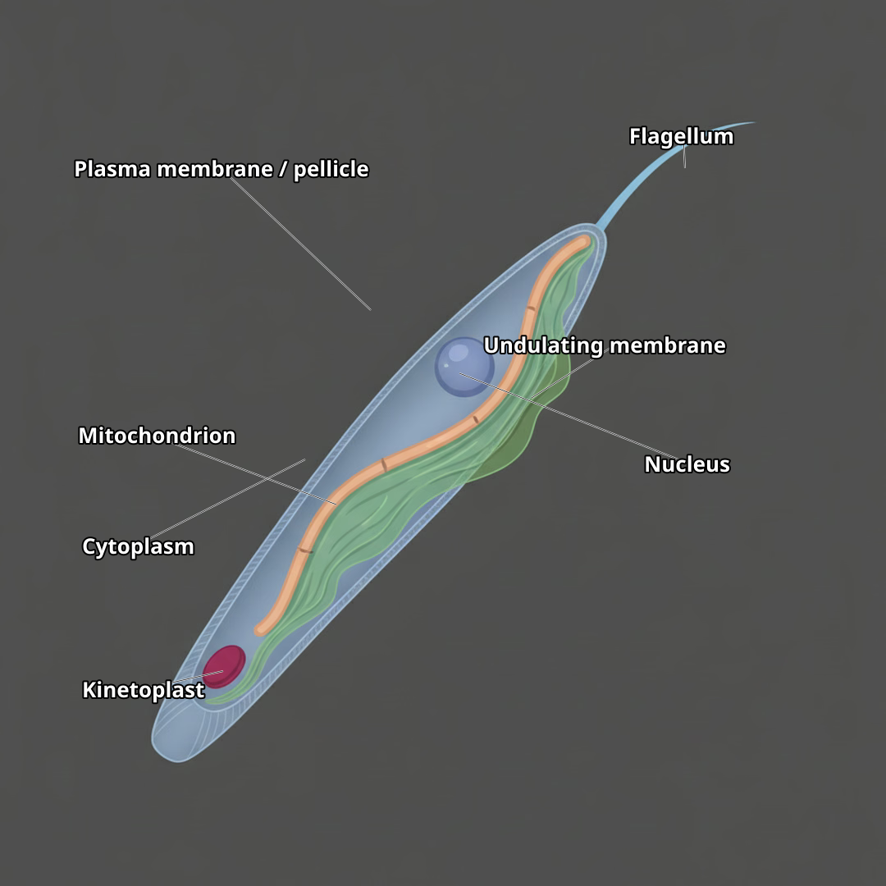 | **3D · labelled** 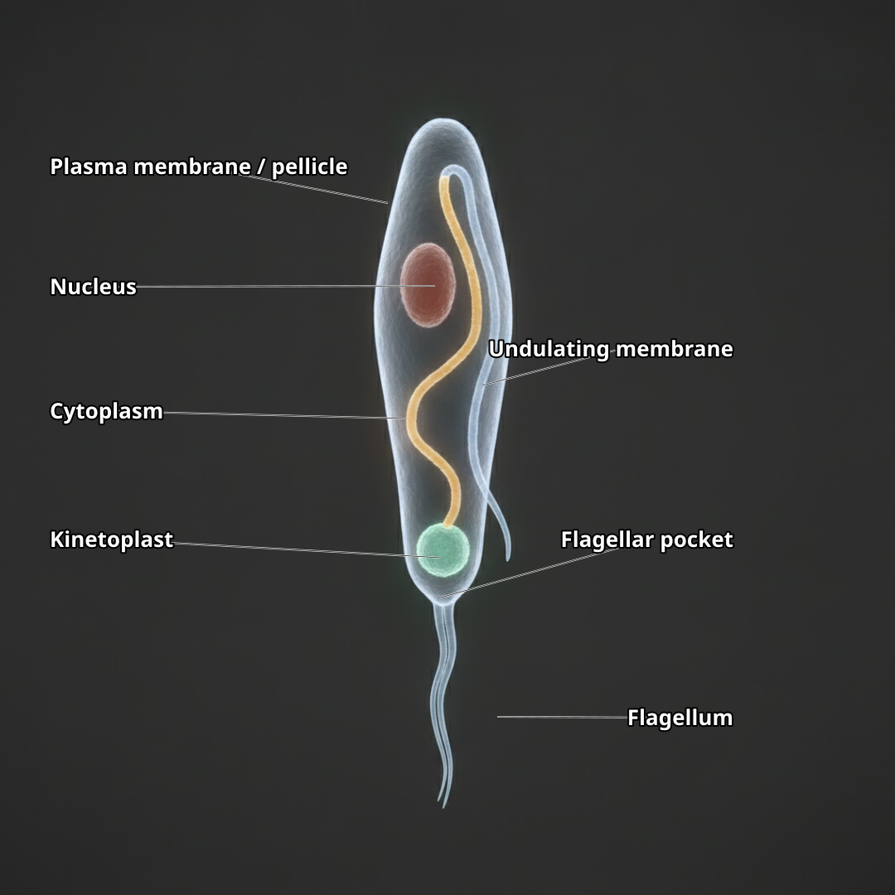 | **Watercolor · labelled** 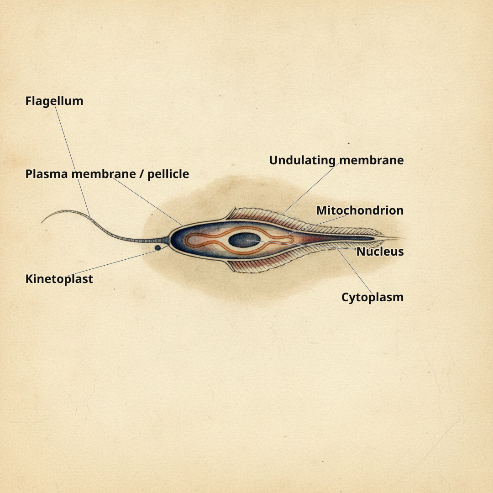 |

| Audience | English | Deutsch |
| --- | --- | --- |
| **Kids** | This sneaky little critter is a parasite, and it's just ONE cell with a long whippy tail called a flagellum that it uses to swim through your blood. It doesn't build a home or make its own food — it just moves into your body and lives off you, which is what parasites do. Parasites come in lots of sizes, from tiny single cells like this one all the way up to long wiggly worms, but this fellow is just one cell. It usually sneaks in through the bite of a tsetse fly, so bug nets and staying away from bites keep it out. And if one does get in, doctors have special medicines that hunt it down and clear it away. | Dieser hinterhältige kleine Kerl ist ein Parasit, und er besteht aus nur EINER Zelle mit einem langen Peitschenschwanz, den man Geißel nennt und mit dem er durch dein Blut schwimmt. Er baut kein Zuhause und macht sich kein eigenes Futter — er zieht einfach in deinen Körper und lebt von dir, genau das machen Parasiten. Parasiten gibt es in vielen Größen, von winzigen Einzellern wie diesem bis hin zu langen Schlängelwürmern, aber dieser hier ist nur eine einzige Zelle. Meistens schleicht er sich durch den Stich einer Tsetsefliege ein, deshalb helfen Moskitonetze und das Vermeiden von Stichen. Und wenn doch einer reinkommt, haben Ärzte besondere Medikamente, die ihn aufspüren und wegräumen. |
| **Adults** | This is a single-celled protozoan parasite — the archetype shown here is a Trypanosoma brucei bloodstream form, the microbe behind African sleeping sickness. Unlike bacteria, it is a full eukaryotic cell with a true nucleus, and it swims through the bloodstream using a single flagellum attached along an undulating membrane. Vector-borne protozoa like this cause some of the world's heaviest disease burdens: trypanosomes ride in on the bite of the tsetse fly, while the malaria parasite Plasmodium arrives via mosquitoes. What makes them so hard to vaccinate against is antigenic variation — the trypanosome constantly swaps the protein coat on its surface, so the immune system is always chasing a target that has already changed disguise. Prevention leans heavily on controlling the insect vectors (nets, repellents, bite avoidance), and infections are treated with specific antiparasitic drugs rather than antibiotics. | Dies ist ein einzelliger Protozoen-Parasit — der hier gezeigte Archetyp ist eine Blutform von Trypanosoma brucei, dem Erreger der Afrikanischen Schlafkrankheit. Anders als Bakterien ist er eine vollständige eukaryotische Zelle mit einem echten Zellkern, und er schwimmt mithilfe einer einzelnen Geißel durch die Blutbahn, die entlang einer undulierenden Membran verläuft. Von Insekten übertragene Protozoen wie dieses verursachen einige der schwersten Krankheitslasten weltweit: Trypanosomen gelangen über den Stich der Tsetsefliege in den Körper, während der Malaria-Parasit Plasmodium von Mücken übertragen wird. Besonders schwer gegen sie zu impfen ist wegen der Antigenvariation — der Trypanosom tauscht ständig die Eiweißhülle auf seiner Oberfläche aus, sodass das Immunsystem einem Ziel hinterherjagt, das seine Verkleidung längst gewechselt hat. Vorbeugung setzt vor allem auf die Bekämpfung der Insektenüberträger (Netze, Repellents, Stichvermeidung), und Infektionen werden mit gezielten Antiparasitika behandelt, nicht mit Antibiotika. |
| **Scientific** | Trypanosoma brucei is a flagellated eukaryotic protozoan of the order Kinetoplastida, shown here as the slender bloodstream trypomastigote (~17–30 µm long). A single flagellum arises from a posterior flagellar pocket and runs forward attached to the cell body by an undulating membrane, emerging free at the anterior end; the fixed spindle shape is maintained by a corset of subpellicular microtubules beneath the plasma membrane. It carries one central membrane-bound nucleus and a single large tubular mitochondrion that spans the length of the cell, within which — near the flagellar base and posterior to the nucleus — sits the kinetoplast, a dense disc of concatenated mitochondrial DNA (kDNA mini- and maxicircles) diagnostic of kinetoplastids. Its hallmark immune-evasion strategy is antigenic variation of a dense variant surface glycoprotein (VSG) coat, switched from a large genomic repertoire to stay ahead of host antibodies. The life cycle is vector-borne, alternating between the mammalian bloodstream and the tsetse fly (Glossina) as biological vector. | Trypanosoma brucei ist ein begeißelter eukaryotischer Protozoon aus der Ordnung Kinetoplastida, hier als schlanke Blutform (Trypomastigot, ~17–30 µm lang) dargestellt. Eine einzelne Geißel entspringt einer posterioren Geißeltasche, verläuft nach vorne und ist über eine undulierende Membran mit dem Zellkörper verbunden, bevor sie am Vorderende frei austritt; die feste Spindelform wird durch ein Korsett subpellikulärer Mikrotubuli unter der Zellmembran gehalten. Die Zelle besitzt einen zentralen, membranumhüllten Zellkern und ein einziges großes tubuläres Mitochondrium, das sich über die gesamte Zelllänge erstreckt und in dem — nahe der Geißelbasis und posterior zum Kern — der Kinetoplast liegt, eine dichte Scheibe aus verketteter mitochondrialer DNA (kDNA-Mini- und -Maxicircles), die für Kinetoplastiden kennzeichnend ist. Sein charakteristischer Immunausweich-Trick ist die Antigenvariation einer dichten Hülle aus variablem Oberflächenglykoprotein (VSG), die aus einem großen Genrepertoire umgeschaltet wird, um den Antikörpern des Wirts stets voraus zu sein. Der Lebenszyklus ist vektorübertragen und wechselt zwischen der Blutbahn des Säugetiers und der Tsetsefliege (Glossina) als biologischem Überträger. |

[full log](set/pathogens-generic/parasite.render.md) · [set overview](set/pathogens-generic/OVERVIEW.md)

---

### Prion (`prion`)
Not a cell and not a virus — a misfolded protein (PrP^Sc) that templates PrP^C into β-sheet copies which stack into amyloid fibrils.

| Textbook | SEM | 3D | Watercolor |
| --- | --- | --- | --- |
|  |  |  |  |
| **Reference (real)**  | **Textbook · labelled** 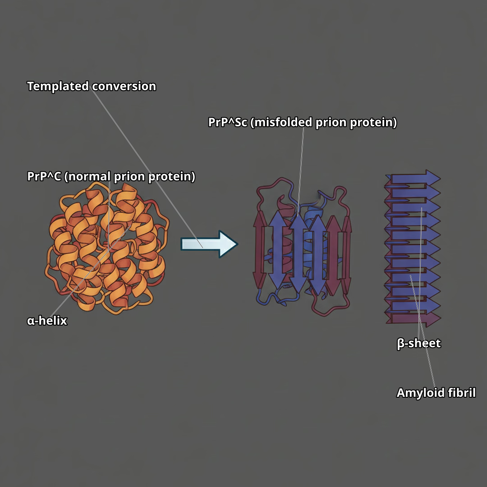 | **3D · labelled** 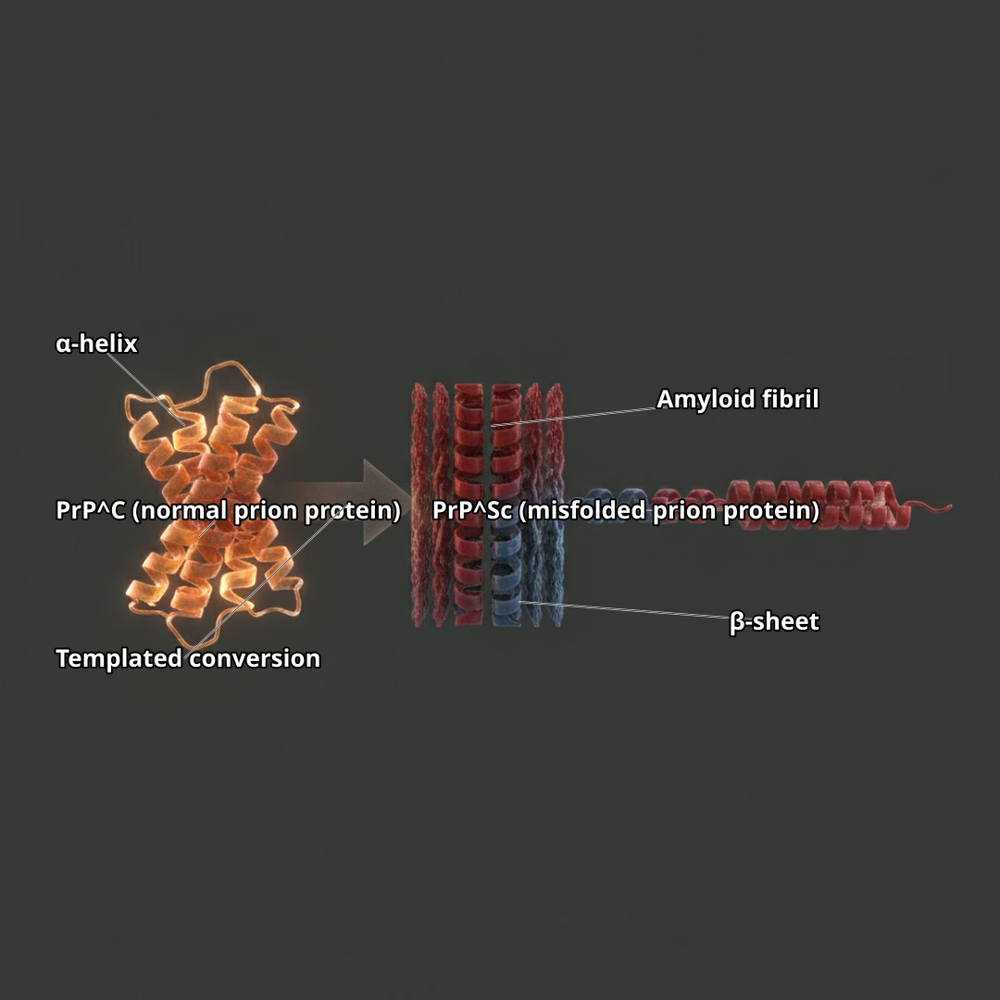 | **Watercolor · labelled** 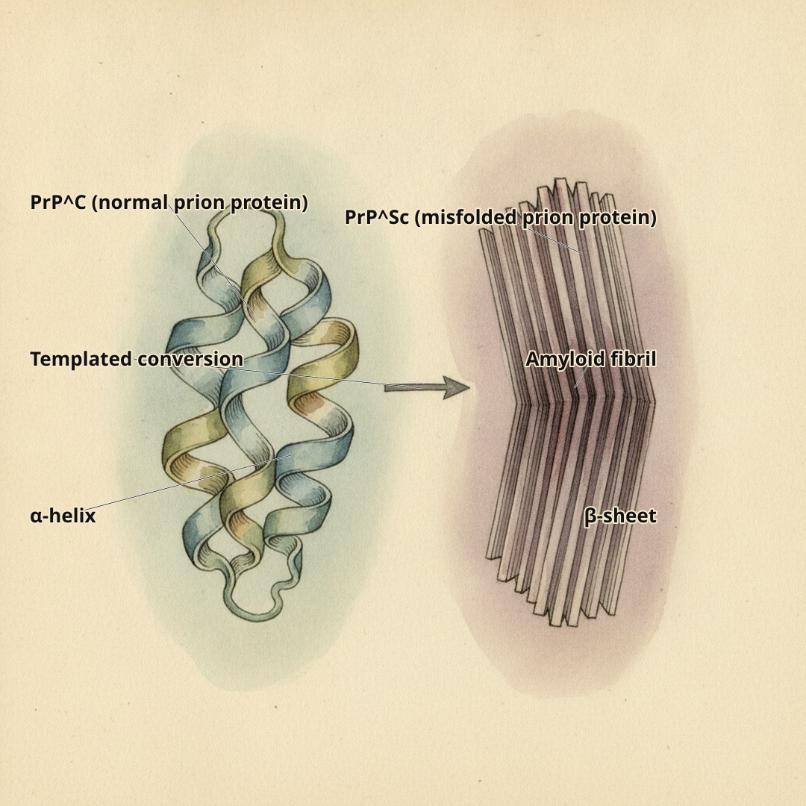 |

| Audience | English | Deutsch |
| --- | --- | --- |
| **Kids** | A prion isn't alive at all — it's just one of your own body's proteins that got folded into the wrong shape, like a piece of origami crumpled the wrong way. The tricky part is that when this wrongly-folded protein bumps into a normal one, it forces the normal one to crumple up exactly the same way, and then those force the next ones — so the wrong shape keeps spreading. Your body can't really fight it: there's nothing alive to catch, and it's so small your defences don't notice it. Luckily prions are extremely rare, and people mostly stay safe just by not eating infected meat and by super-carefully cleaning doctors' tools. | Ein Prion lebt überhaupt nicht — es ist einfach eines der Eiweiße aus deinem eigenen Körper, das sich in die falsche Form gefaltet hat, wie ein Origami, das falsch geknickt wurde. Das Fiese daran: Wenn dieses falsch gefaltete Eiweiß auf ein normales trifft, zwingt es das normale in genau dieselbe falsche Form, und diese knicken dann die nächsten um — so breitet sich die falsche Form immer weiter aus. Dein Körper kann sich kaum wehren: Es gibt nichts Lebendiges zum Fangen, und es ist so winzig, dass deine Abwehr es gar nicht bemerkt. Zum Glück sind Prionen sehr selten, und man bleibt sicher, indem man kein infiziertes Fleisch isst und Arztwerkzeuge ganz besonders gründlich reinigt. |
| **Adults** | A prion breaks the usual rules of infection: it carries no DNA or RNA and isn't even alive — it is a single misfolded protein, the "protein-only" agent proposed by Stanley Prusiner. A normal harmless protein already sitting in your cells (PrP) can flip into a rogue fold that then acts as a template, forcing neighbouring copies of the same protein to misfold too, so the damage self-propagates and clumps into deposits that slowly destroy brain tissue. Prions cause Creutzfeldt-Jakob disease in people, BSE ("mad cow disease") in cattle, and kuru, once spread by ritual cannibalism. Because there's no organism and no genetic material, the misfolded protein shrugs off ordinary cooking heat, radiation and most disinfectants that would kill bacteria or viruses. There is no cure yet, so the whole game is prevention: keeping infected tissue out of the food chain and rigorously sterilising surgical instruments. | Ein Prion bricht die üblichen Regeln der Infektion: Es trägt keine DNA oder RNA und lebt nicht einmal — es ist ein einzelnes fehlgefaltetes Eiweiß, der von Stanley Prusiner vorgeschlagene "Nur-Protein"-Erreger. Ein normales, harmloses Eiweiß, das ohnehin in deinen Zellen sitzt (PrP), kann in eine bösartige Faltung umkippen, die dann als Vorlage wirkt und benachbarte Kopien desselben Eiweißes zwingt, sich ebenfalls falsch zu falten — so vermehrt sich der Schaden von selbst und lagert sich zu Ablagerungen zusammen, die langsam das Hirngewebe zerstören. Prionen verursachen beim Menschen die Creutzfeldt-Jakob-Krankheit, beim Rind BSE ("Rinderwahn") und Kuru, das einst durch rituellen Kannibalismus übertragen wurde. Weil es weder einen Organismus noch Erbmaterial gibt, übersteht das fehlgefaltete Eiweiß normale Kochhitze, Strahlung und die meisten Desinfektionsmittel, die Bakterien oder Viren töten würden. Eine Heilung gibt es bisher nicht, deshalb zählt allein die Vorbeugung: infiziertes Gewebe aus der Nahrungskette fernhalten und chirurgische Instrumente streng sterilisieren. |
| **Scientific** | A prion is an infectious agent composed solely of protein, containing no nucleic acid genome. The normal cellular isoform PrP^C is a GPI-anchored, α-helix-rich and protease-sensitive protein; the pathogenic isoform PrP^Sc shares the identical amino-acid sequence but adopts a β-sheet-rich, protease-resistant and aggregation-prone conformation. PrP^Sc propagates by seeded (templated) conversion: it binds PrP^C and catalyses its refolding into the PrP^Sc conformation, and the accumulating monomers stack into ordered amyloid fibrils and plaques. This self-templating aggregation underlies the transmissible spongiform encephalopathies — including Creutzfeldt-Jakob disease, variant CJD, kuru, and bovine spongiform encephalopathy — which are characterised by neuronal loss and spongiform vacuolation. The absence of any nucleic acid and the extreme conformational stability of PrP^Sc explain its resistance to conventional heat, irradiation and chemical decontamination. | Ein Prion ist ein Infektionserreger, der ausschließlich aus Protein besteht und kein Nukleinsäure-Genom enthält. Die normale zelluläre Isoform PrP^C ist ein GPI-verankertes, α-Helix-reiches und protease-empfindliches Protein; die pathogene Isoform PrP^Sc besitzt dieselbe Aminosäuresequenz, nimmt aber eine β-Faltblatt-reiche, protease-resistente und aggregationsanfällige Konformation an. PrP^Sc vermehrt sich durch keimvermittelte (templatgesteuerte) Umfaltung: Es bindet PrP^C und katalysiert dessen Umfaltung in die PrP^Sc-Konformation, und die sich anhäufenden Monomere lagern sich zu geordneten Amyloidfibrillen und Plaques zusammen. Diese selbsttemplatierende Aggregation liegt den übertragbaren spongiformen Enzephalopathien zugrunde — darunter die Creutzfeldt-Jakob-Krankheit, die Variante CJK, Kuru und die bovine spongiforme Enzephalopathie (BSE) —, die durch Neuronenverlust und schwammartige Vakuolisierung gekennzeichnet sind. Das Fehlen jeglicher Nukleinsäure und die extreme Konformationsstabilität von PrP^Sc erklären seine Resistenz gegenüber üblicher Hitze, Bestrahlung und chemischer Dekontamination. |

[full log](set/pathogens-generic/prion.render.md) · [set overview](set/pathogens-generic/OVERVIEW.md)

---

### Rod-shaped bacterium (bacillus) (`rod-bacterium`)
Textbook Gram-negative motile rod (~1×2–4 µm)

| Textbook | SEM | 3D | Watercolor |
| --- | --- | --- | --- |
|  |  |  |  |
| **Reference (real)**  | **Textbook · labelled** 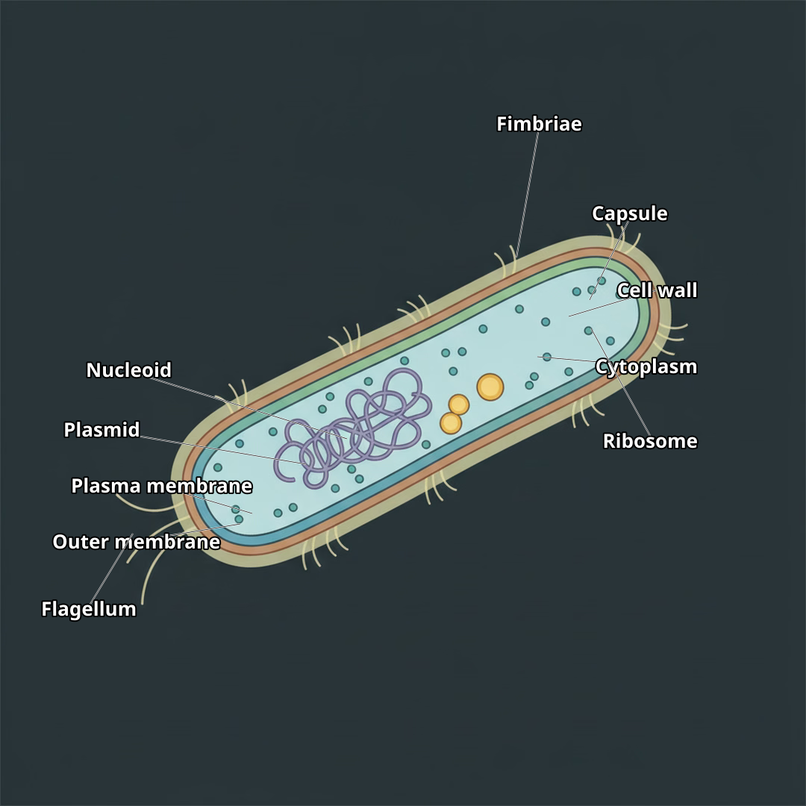 | **3D · labelled** 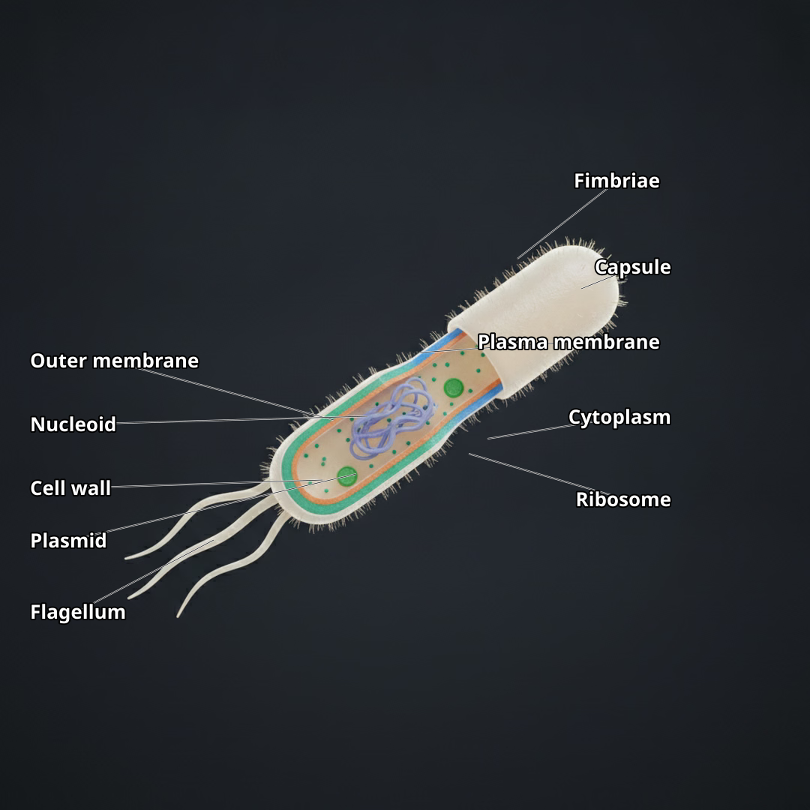 | **Watercolor · labelled** 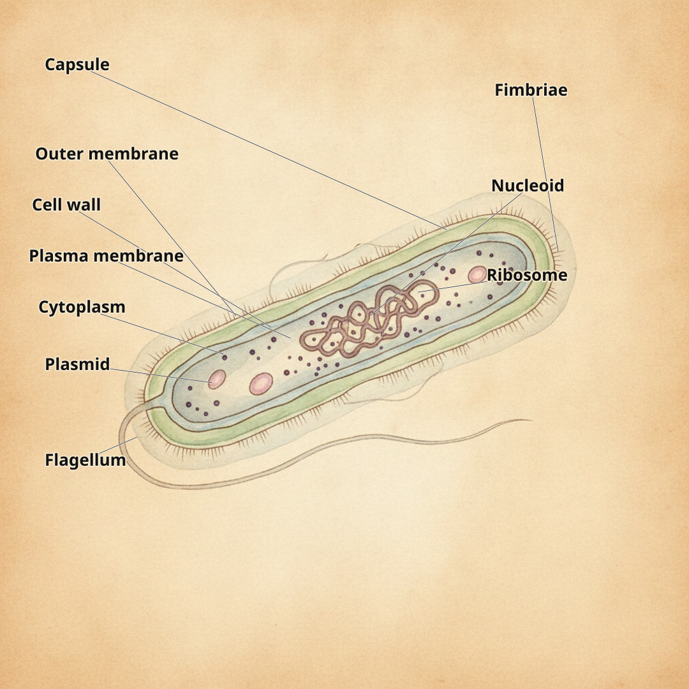 |

| Audience | English | Deutsch |
| --- | --- | --- |
| **Kids** | Meet the rod-shaped bacterium: a tiny stick-shaped cell, like a soft, squishy jellybean too small to see. Some of these rods are your buddies! They live in your gut, help you digest food, and even make vitamin K to keep your blood healthy. But watch out, some rod cousins (like Salmonella) sneak in on dirty food and try to make you sick. When they do, drinking plenty of water flushes the nasty rods back out - and for the really stubborn ones the doctor has medicine that finishes the job! | Das ist das Stäbchen-Bakterium: eine winzige, stabförmige Zelle, weich und wabbelig wie ein Mini-Gummibärchen, viel zu klein zum Sehen. Manche Stäbchen sind deine Freunde! Sie wohnen in deinem Bauch, helfen beim Verdauen und stellen sogar Vitamin K her, damit dein Blut gesund bleibt. Aber Achtung: Ein paar Verwandte (wie Salmonellen) schleichen sich mit schmutzigem Essen ein und wollen dich krank machen. Dann spült viel Trinken die fiesen Stäbchen wieder hinaus - und bei den ganz hartnäckigen hilft eine Medizin vom Arzt! |
| **Adults** | The rod-shaped bacterium is the workhorse of your microbiome. Trillions of these stick-like cells, such as most E. coli strains, line your gut, where they help break down food, crowd out invaders, and synthesise vitamin K and other nutrients. Their relatives can turn hostile: Salmonella and certain E. coli strains cause food poisoning and infections. Antibiotics remain our main defence, but overuse drives antibiotic resistance, and these rods readily swap resistance genes with one another. Keeping the balance, through good hygiene, sensible antibiotic use and a varied diet, matters far more than simply labelling them good or bad. | Das Stäbchen-Bakterium ist das Arbeitstier deines Mikrobioms. Billionen dieser stabförmigen Zellen, etwa die meisten E.-coli-Stämme, besiedeln deinen Darm, wo sie beim Abbau der Nahrung helfen, Eindringlinge verdrängen und Vitamin K sowie andere Nährstoffe herstellen. Ihre Verwandten können gefährlich werden: Salmonellen und bestimmte E.-coli-Stämme verursachen Lebensmittelvergiftungen und Infektionen. Antibiotika sind unsere wichtigste Waffe, doch ihr übermäßiger Einsatz fördert Antibiotikaresistenzen, und diese Stäbchen tauschen Resistenzgene bereitwillig untereinander aus. Das Gleichgewicht zu halten, durch Hygiene, umsichtigen Antibiotikaeinsatz und abwechslungsreiche Ernährung, zählt weit mehr als die simple Einteilung in gut und böse. |
| **Scientific** | The Gram-negative bacillus is a cylindrical rod, roughly 1 to 3 micrometres long. Its defining feature is a thin peptidoglycan layer sandwiched between an inner cytoplasmic membrane and an outer membrane bearing lipopolysaccharide (endotoxin). Many rods are motile, driven by peritrichous flagella and sensing gradients via chemotaxis. The genome sits in a compact nucleoid, supplemented by plasmids that carry virulence and resistance genes spread through horizontal gene transfer (conjugation, transformation, transduction). The elongated shape optimises surface area, nutrient uptake, motility and surface attachment. Ecologically these rods range from gut commensals to pathogens; their envelope structures underlie both antibiotic targets and immune recognition. | Das gramnegative Stäbchen ist eine zylindrische Zelle von etwa 1 bis 3 Mikrometern Länge. Sein Kennzeichen ist eine dünne Peptidoglykanschicht zwischen einer inneren Zytoplasmamembran und einer äußeren Membran mit Lipopolysaccharid (Endotoxin). Viele Stäbchen sind durch peritriche Flagellen beweglich und orientieren sich per Chemotaxis an Gradienten. Das Genom liegt in einem kompakten Nukleoid, ergänzt durch Plasmide, die Virulenz- und Resistenzgene tragen und ueber horizontalen Gentransfer (Konjugation, Transformation, Transduktion) verbreiten. Die längliche Form optimiert Oberfläche, Naehrstoffaufnahme, Beweglichkeit und Anheftung. Oekologisch reichen diese Stäbchen von Darmkommensalen bis zu Pathogenen; ihre Hüllstrukturen sind zugleich Angriffspunkt für Antibiotika und Ziel der Immunerkennung. |

[full log](set/pathogens-generic/rod-bacterium.render.md) · [set overview](set/pathogens-generic/OVERVIEW.md)

---

### Tick (Ixodes scapularis) (`tick`)
The only animal in the atlas: an adult Ixodes scapularis (blacklegged/deer tick), a hard tick with a fused idiosoma, no separate head, EIGHT legs, and barbed mouthparts on a forward capitulum. Vector, not a pathogen.

| Textbook | SEM | 3D | Watercolor |
| --- | --- | --- | --- |
|  |  |  |  |
| **Reference (real)**  | **Textbook · labelled**  | **3D · labelled**  | **Watercolor · labelled**  |

| Audience | English | Deutsch |
| --- | --- | --- |
| **Kids** | This is a tick, and it's the odd one out on this page: it's not a germ at all, it's a tiny eight-legged animal, a cousin of spiders. It waits on a blade of grass with its front legs stretched out, waiting for someone warm to walk by, and if it gets onto you it can bite and hang on for days while it drinks a little blood. The good habit is to check yourself (or have a grown-up check you) after playing outside in grass or bushes — the sooner a tick is found, the better. If you find one, a grown-up can lift it straight off with tweezers, gripping close to the skin and pulling straight up, no twisting. | Das hier ist eine Zecke, und sie ist der Sonderling auf dieser Seite: Sie ist gar kein Krankheitserreger, sondern ein winziges Tier mit acht Beinen, eine Verwandte der Spinnen. Sie wartet auf einem Grashalm mit ausgestreckten Vorderbeinen darauf, dass etwas Warmes vorbeikommt, und wenn sie auf dich gelangt, kann sie sich festbeißen und tagelang hängen bleiben, während sie ein bisschen Blut trinkt. Die gute Gewohnheit ist, dich nach dem Spielen im Gras oder im Gebüsch abzusuchen (oder von einem Erwachsenen absuchen zu lassen) — je früher eine Zecke gefunden wird, desto besser. Findet man eine, kann ein Erwachsener sie mit einer Pinzette dicht an der Haut fassen und gerade nach oben herausziehen, ohne zu drehen. |
| **Adults** | This is Ixodes scapularis, the blacklegged (deer) tick — an arachnid, not a microbe, and the only animal in this atlas. It matters here purely as a vector: it doesn't cause disease itself, it carries whatever it happens to be infected with from a previous blood meal and can pass that on during its own multi-day feed, chiefly Borrelia burgdorferi (Lyme disease) in North America. It finds hosts by "questing" — climbing a grass stem and holding its front legs out to sense heat and carbon dioxide — then anchors itself with a barbed mouthpart and feeds slowly, which is why removal technique matters: grip it with fine tweezers as close to the skin as possible and pull straight out with steady pressure, since twisting or crushing it can force more of its gut contents into the bite. Because transmission risk rises the longer it stays attached, prompt checks after time outdoors and prompt removal are the most effective everyday precautions. | Das ist Ixodes scapularis, die Zecke — ein Spinnentier, kein Mikrobe, und das einzige Tier in diesem Atlas. Im europäischen Raum ist die entsprechende Art vor allem Ixodes ricinus, der Holzbock. Die Zecke ist hier rein als Überträger interessant: Sie verursacht selbst keine Krankheit, sondern gibt weiter, was sie aus einer früheren Blutmahlzeit in sich trägt, und kann das während ihrer eigenen mehrtägigen Blutmahlzeit übertragen — in Nordamerika vor allem Borrelia burgdorferi (Lyme-Borreliose), in Europa zusätzlich das FSME-Virus (Frühsommer-Meningoenzephalitis). Sie findet ihre Wirte durch "Anlauern": Sie klettert einen Grashalm hoch und streckt die Vorderbeine aus, um Wärme und Kohlendioxid wahrzunehmen, verankert sich dann mit einem Widerhaken-Mundwerkzeug und saugt langsam über Tage — deshalb kommt es auf die richtige Entfernung an: mit einer feinen Pinzette so dicht wie möglich an der Haut fassen und mit gleichmäßigem Zug gerade herausziehen, denn Drehen oder Quetschen kann mehr Mageninhalt der Zecke in den Stich pressen. Da das Übertragungsrisiko mit der Saugdauer steigt, sind regelmäßiges Absuchen nach Aufenthalten im Freien und rasches Entfernen die wirksamsten Alltagsvorkehrungen. |
| **Scientific** | Ixodes scapularis (Ixodida: Ixodidae) is a three-host hard tick and the principal vector of Borrelia burgdorferi sensu stricto in eastern North America, alongside Anaplasma phagocytophilum and Babesia microti. The body is a fused idiosoma bearing a forward gnathosoma (capitulum) with a barbed hypostome flanked by cutting chelicerae and sensory palps; the genus is diagnostically eyeless, inornate and lacks festoons, with an anteriorly-placed anal groove (prostriate). A dorsal scutum covers the whole idiosoma in males but only a small anterior shield in females, nymphs and larvae, permitting the dramatic abdominal distension of blood-feeding in the latter stages. Host-seeking ("questing") uses Haller's organ, a tarsal chemosensory pit on leg I, to detect thermal, CO2 and volatile cues; attachment involves cheliceral laceration of the epidermis, hypostome insertion and cementation, and a multi-day slow blood meal during which pathogen transmission risk rises with attachment duration — a key rationale for prompt mechanical removal (fine-point forceps, traction close to the skin surface, steady axial pull) rather than chemical or thermal methods, which can provoke regurgitation of gut contents. | Ixodes scapularis (Ixodida: Ixodidae) ist eine dreiwirtige Schildzecke und der Hauptüberträger von Borrelia burgdorferi sensu stricto im östlichen Nordamerika, daneben auch von Anaplasma phagocytophilum und Babesia microti. In Europa übernimmt überwiegend Ixodes ricinus (Holzbock) diese Rolle, zusätzlich als Überträger des FSME-Virus. Der Körper ist ein verschmolzenes Idiosoma mit einem nach vorn ragenden Gnathosoma (Capitulum), das ein mit Widerhaken besetztes Hypostom trägt, flankiert von schneidenden Cheliceren und sensorischen Palpen; die Gattung Ixodes ist diagnostisch augenlos, unornamentiert und ohne Festons, mit anterior gelegener Analfurche (prostriat). Ein dorsales Scutum bedeckt beim Männchen das gesamte Idiosoma, bei Weibchen, Nymphen und Larven dagegen nur einen kleinen vorderen Schild, was die charakteristische Ausdehnung des Abdomens bei der Blutmahlzeit der letztgenannten Stadien erlaubt. Die Wirtssuche ("Anlauern") erfolgt über das Haller-Organ, eine chemosensorische Grube am Tarsus des ersten Beinpaars, die thermische, CO2- und flüchtige Reize erkennt; das Anheften umfasst das Aufschneiden der Epidermis durch die Cheliceren, das Einführen und Zementieren des Hypostoms sowie eine mehrtägige langsame Blutmahlzeit, während der das Übertragungsrisiko mit der Haftdauer steigt — ein zentraler Grund für die rasche mechanische Entfernung (feine Pinzette, Zug dicht an der Hautoberfläche, gleichmäßiger axialer Zug) statt chemischer oder thermischer Methoden, die ein Erbrechen des Mageninhalts provozieren können. |

[full log](set/pathogens-generic/tick.render.md) · [set overview](set/pathogens-generic/OVERVIEW.md)

---

### Virus (`virus`)
Idealized enveloped virion (~80–120 nm): envelope + glycoprotein spikes, matrix, capsid and a single nucleic-acid genome.

| Textbook | SEM | 3D | Watercolor |
| --- | --- | --- | --- |
|  |  |  |  |
| **Reference (real)**  | **Textbook · labelled** 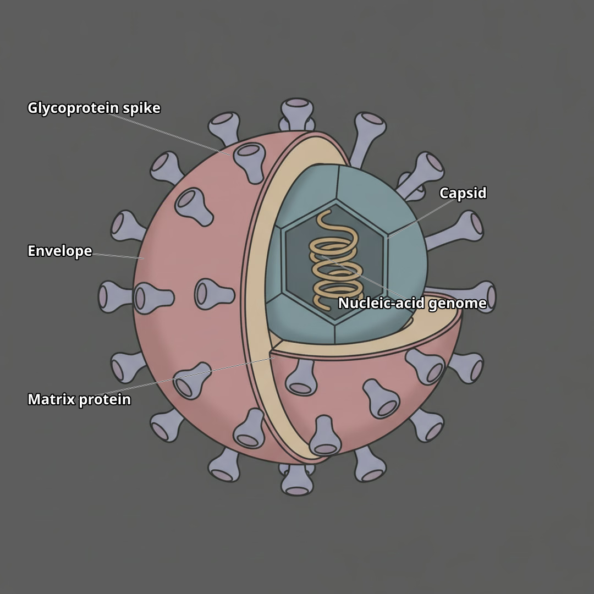 | **3D · labelled** 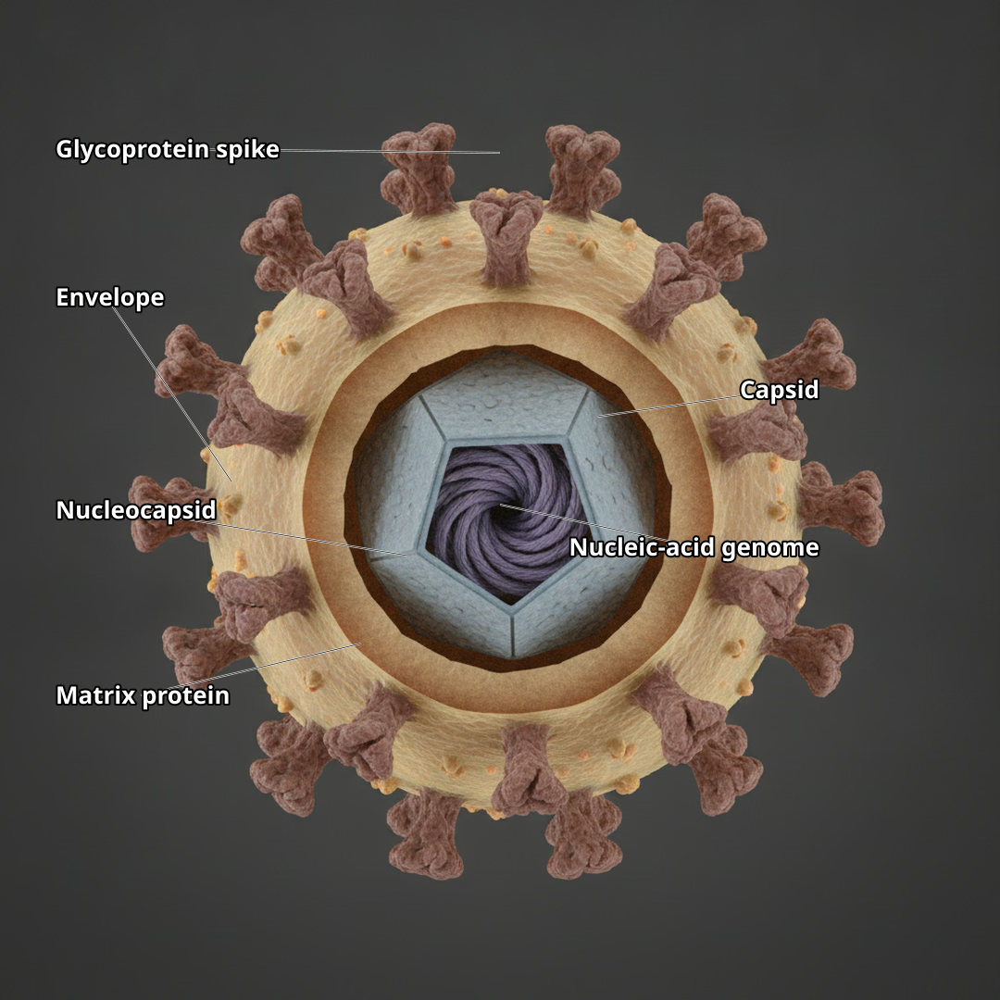 | **Watercolor · labelled** 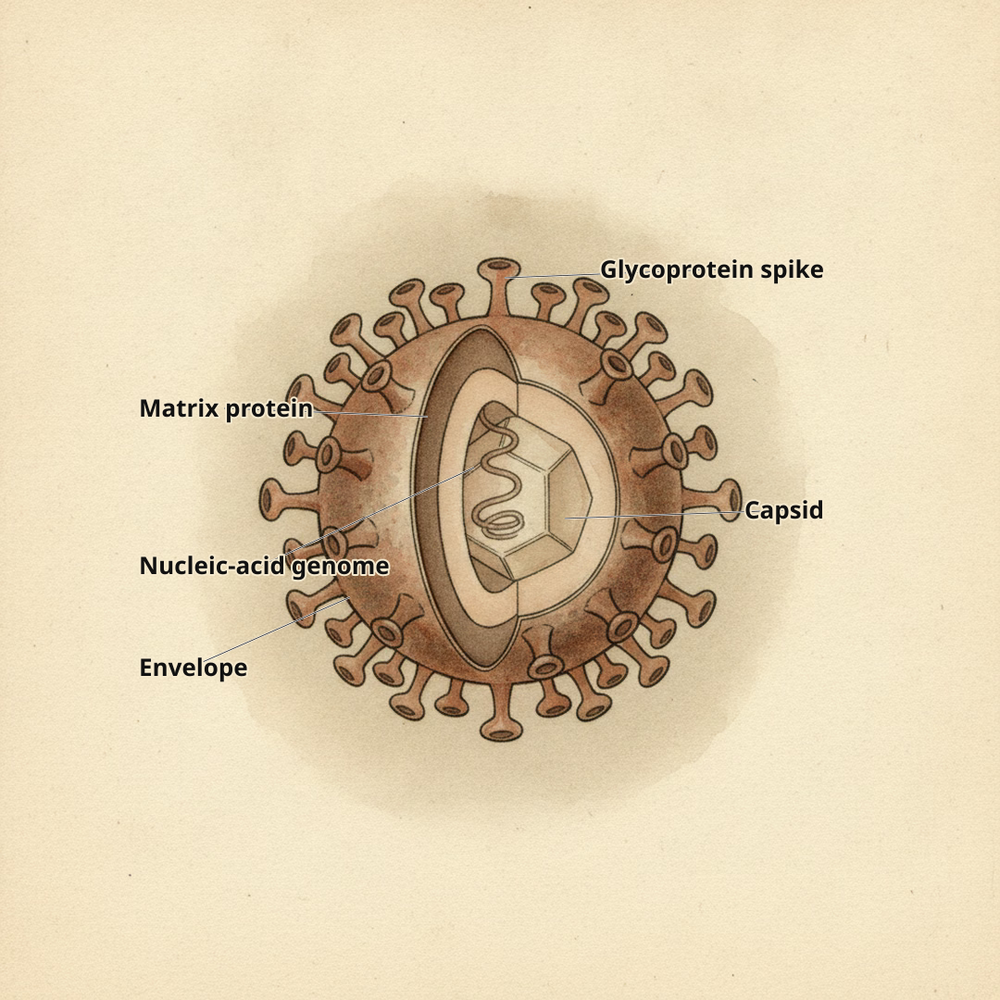 |

| Audience | English | Deutsch |
| --- | --- | --- |
| **Kids** | Say hello to a virus, the tiniest troublemaker of them all! It isn't really alive like a bacterium; it's just a scrap of genetic code zipped up inside a protein shell, sometimes with a bubbly outer coat covered in sticky spikes. On its own it can do absolutely nothing, so it sneaks into one of your cells and tricks it into building hundreds of brand-new copies. Most of the time your body clears the intruder in a few days with rest, warm soup and lots of fluids, and for some viruses a vaccine teaches your body to slam the door before they even get in. | Sag Hallo zum Virus, dem allerkleinsten Störenfried! Es ist nicht wirklich lebendig wie ein Bakterium; es ist nur ein Fetzchen Erbinformation, eingepackt in eine Eiweißhülle, manchmal mit einem blasigen Mantel voller klebriger Stacheln. Ganz allein kann es rein gar nichts, deshalb schleicht es sich in eine deiner Zellen und überredet sie, hunderte funkelnagelneue Kopien zu bauen. Meistens wird dein Körper den Eindringling nach ein paar Tagen mit Ruhe, warmer Suppe und viel Trinken wieder los, und gegen manche Viren bringt eine Impfung deinem Körper bei, die Tür zuzuschlagen, bevor sie überhaupt hereinkommen. |
| **Adults** | A virus sits right at the fuzzy border between chemistry and life: outside a host it is an inert particle, just a genome wrapped in a protein coat, often with a lipid envelope studded with spike proteins. It can only reproduce by entering one of your cells and redirecting that cell's own machinery to churn out fresh virus particles, which is why the familiar culprits behind colds, flu and COVID spread so efficiently. Antibiotics do nothing against them because those drugs target bacterial structures a virus simply doesn't have, so treatment usually means rest and fluids while your body does the work. For many viral illnesses, vaccines are the real game-changer, priming your defences to recognise the spikes and shut an infection down before it takes hold. | Ein Virus sitzt genau an der unscharfen Grenze zwischen Chemie und Leben: außerhalb eines Wirts ist es ein regloses Teilchen, nur ein Genom in einer Eiweißhülle, oft mit einer Lipidhülle voller Spike-Proteine. Vermehren kann es sich ausschließlich, indem es in eine deiner Zellen eindringt und deren eigene Maschinerie umlenkt, um frische Viruspartikel zu produzieren – deshalb verbreiten sich die bekannten Verursacher von Erkältung, Grippe und COVID so wirkungsvoll. Antibiotika richten nichts gegen sie aus, weil diese Medikamente auf bakterielle Strukturen zielen, die ein Virus schlicht nicht besitzt; die Behandlung heißt daher meist Ruhe und viel Trinken, während der Körper die Arbeit erledigt. Bei vielen Viruserkrankungen sind Impfungen der eigentliche Wendepunkt, denn sie trainieren die Abwehr, die Spikes zu erkennen und eine Infektion zu stoppen, bevor sie sich festsetzt. |
| **Scientific** | A virus is an obligate intracellular parasite: a submicroscopic particle, typically 80–120 nm in the enveloped archetype, that carries no metabolism or ribosomes and cannot replicate outside a host cell. Its architecture runs from the outside in — a host-derived lipid-bilayer envelope bearing glycoprotein spikes (peplomers) that mediate receptor binding and entry, an optional matrix layer, and a capsid of helical or icosahedral symmetry enclosing a single nucleic-acid genome, RNA or DNA but never both, together forming the nucleocapsid. Replication proceeds through attachment, entry and uncoating, genome expression and replication using host machinery, assembly, and release by budding or lysis. Host range and cell tropism are dictated largely by the match between viral spike proteins and specific host-cell receptors, and the spikes are the principal antigens recognised by neutralising antibodies. | Ein Virus ist ein obligat intrazellulärer Parasit: ein submikroskopisches Teilchen, im behüllten Archetyp typischerweise 80–120 nm groß, das keinen eigenen Stoffwechsel und keine Ribosomen besitzt und sich außerhalb einer Wirtszelle nicht vermehren kann. Sein Aufbau verläuft von außen nach innen – eine vom Wirt stammende Lipiddoppelschicht-Hülle mit Glykoprotein-Spikes (Peplomeren), die Rezeptorbindung und Eintritt vermitteln, eine optionale Matrixschicht sowie ein Kapsid mit helikaler oder ikosaedrischer Symmetrie, das ein einzelnes Nukleinsäure-Genom umschließt, RNA oder DNA, aber niemals beides; Kapsid und Genom bilden zusammen das Nukleokapsid. Die Replikation läuft über Anheftung, Eintritt und Enthüllung, Genexpression und Genomvervielfältigung mithilfe der Wirtsmaschinerie, Zusammenbau und Freisetzung durch Knospung oder Lyse. Wirtsspektrum und Zelltropismus werden weitgehend durch die Passung zwischen viralen Spike-Proteinen und spezifischen Wirtszellrezeptoren bestimmt, und die Spikes sind die wichtigsten von neutralisierenden Antikörpern erkannten Antigene. |

[full log](set/pathogens-generic/virus.render.md) · [set overview](set/pathogens-generic/OVERVIEW.md)

---

## Set: `pathogens-viruses`

### Candida albicans (`candida-albicans`)
Dimorphic yeast (~3-6 um ovoid) that lives harmlessly in the mouth, gut and genital tract; when immunity weakens or after antibiotics it switches to invasive hyphae and can cause thrush or serious infection. Kept in check by Th17 cells, neutrophils and the mucosal microbiome.

| Textbook | SEM | 3D | Watercolor |
| --- | --- | --- | --- |
|  |  |  |  |
| **Reference (real)**  | **Textbook · labelled** 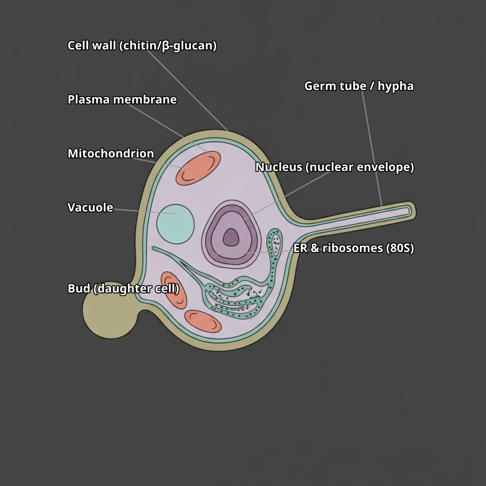 | **3D · labelled** 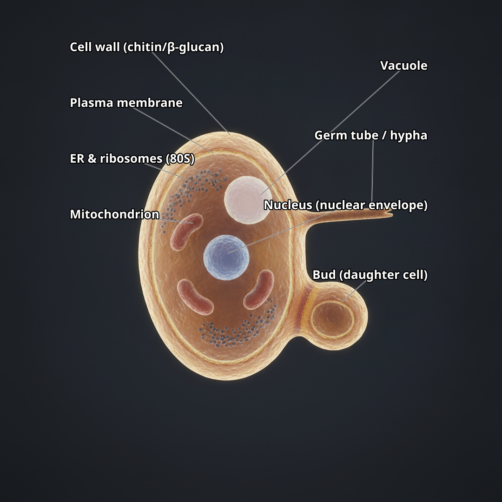 | **Watercolor · labelled**  |

| Audience | English | Deutsch |
| --- | --- | --- |
| **Kids** | Hi, I'm Candida — a round, squishy yeast, not a bacterium! I usually live quietly in your mouth, tummy, and other cozy warm spots, minding my own business and even helping keep things balanced. I make new yeast babies by budding: a little bump grows on my side and pops off as a brand-new me! But if you take strong medicine that clears out my neighbours, or your body's defences are having a tough week, I can grow long stringy arms called hyphae and get pushy, causing an itchy rash called thrush. A dab of antifungal cream from the pharmacy usually sends me back to behaving myself. | Hallo, ich bin Candida — eine runde, weiche Hefe, kein Bakterium! Normalerweise wohne ich ganz ruhig in deinem Mund, deinem Bauch und anderen warmen, gemütlichen Ecken und mische mich nicht ein, ich helfe sogar, das Gleichgewicht zu halten. Neue Hefe-Babys mache ich durch Knospung: An meiner Seite wächst ein kleines Beulchen und ploppt als brandneues Ich ab! Aber wenn starke Medikamente meine Nachbarn wegputzen oder die Abwehrkräfte mal eine schwache Woche haben, kann ich lange fädige Arme, Hyphen genannt, wachsen lassen und frech werden — das nennt man dann Soor, ein juckender Ausschlag. Eine Salbe aus der Apotheke schickt mich meistens wieder zurück ins brave Verhalten. |
| **Adults** | Candida albicans is a yeast that lives as a normal, usually harmless resident of the mouth, gut, skin and vaginal microbiome in most healthy people. Problems start when the balance tips: antibiotics wiping out competing bacteria, a weakened immune system, diabetes, or simply warm, moist skin can let it overgrow and switch from its round budding-yeast form into invasive, thread-like hyphae. The result ranges from a mildly annoying case of oral or vaginal thrush to, in severely immunocompromised patients, a dangerous bloodstream infection. Topical or oral antifungal medication clears most infections, and simple measures — keeping skin dry, treating underlying conditions, avoiding unnecessary antibiotics — go a long way toward keeping Candida in its usual, well-behaved state. | Candida albicans ist eine Hefe, die bei den meisten gesunden Menschen ganz normal und meist harmlos im Mund, Darm, auf der Haut und in der Vaginalflora lebt. Probleme entstehen, wenn das Gleichgewicht kippt: Antibiotika, die konkurrierende Bakterien wegräumen, ein geschwächtes Immunsystem, Diabetes oder einfach warme, feuchte Haut können ihr übermäßiges Wachstum begünstigen, wobei sie von der runden, knospenden Hefeform in fadenförmige, invasive Hyphen wechselt. Das Ergebnis reicht von einem leicht lästigen Mund- oder Vaginalsoor bis hin, bei stark immungeschwächten Patienten, zu einer gefährlichen Blutbahninfektion. Lokale oder orale antimykotische Medikamente heilen die meisten Infektionen, und einfache Maßnahmen — die Haut trocken halten, Grunderkrankungen behandeln, unnötige Antibiotika vermeiden — helfen sehr, Candida in ihrem gewohnten, gutartigen Zustand zu halten. |
| **Scientific** | Candida albicans is a polymorphic, diploid ascomycetous fungus and the most common cause of human candidiasis. Its commensal blastospore form is an ovoid budding yeast (~3-6 µm) enclosed by a chitin-β-glucan-mannoprotein cell wall; under host-derived cues (37 °C, neutral pH, serum, CO2, N-acetylglucosamine) it undergoes a morphogenetic switch to true septate hyphae via germ-tube formation, a transition governed by cAMP-PKA and MAPK signalling (Cph1, Efg1) and central to tissue invasion and biofilm formation. Mucosal homeostasis is maintained chiefly by Th17-driven IL-17/IL-22 responses, neutrophil and macrophage phagocytosis via Dectin-1 and TLR recognition of wall β-glucans and mannans, and competitive exclusion by the resident bacterial microbiota. Disruption of any of these — antibiotic-induced dysbiosis, neutropenia, HIV/AIDS-associated Th17 depletion, or breached mucosal/epithelial barriers (central venous catheters) — permits overgrowth and hyphal invasion, ranging from superficial mucocutaneous candidiasis to life-threatening candidemia and disseminated disease. | Candida albicans ist ein polymorpher, diploider Schlauchpilz (Ascomycet) und der häufigste Erreger humaner Candidosen. Seine kommensale Blastosporenform ist eine ovoide, knospende Hefezelle (ca. 3-6 µm), umgeben von einer Chitin-β-Glucan-Mannoprotein-Zellwand; unter wirtsabhängigen Signalen (37 °C, neutraler pH, Serum, CO2, N-Acetylglucosamin) vollzieht sie über die Bildung eines Keimschlauchs einen morphogenetischen Wechsel zu echten septierten Hyphen, gesteuert durch cAMP-PKA- und MAPK-Signalwege (Cph1, Efg1) und zentral für Gewebeinvasion und Biofilmbildung. Die Homöostase der Schleimhäute wird vor allem durch Th17-vermittelte IL-17/IL-22-Antworten, Phagozytose durch Neutrophile und Makrophagen über Dectin-1 und TLR-Erkennung von Wand-β-Glucanen und Mannanen sowie durch kompetitive Verdrängung durch die residente Bakterienflora aufrechterhalten. Wird eines dieser Systeme gestört — antibiotikabedingte Dysbiose, Neutropenie, HIV/AIDS-assoziierter Th17-Verlust oder durchbrochene Schleimhaut-/Epithelbarrieren (zentralvenöse Katheter) — kann es zu Überwucherung und Hyphen-Invasion kommen, von oberflächlicher mukokutaner Candidose bis zu lebensbedrohlicher Candidämie und disseminierter Erkrankung. |

[full log](set/pathogens-viruses/candida-albicans.render.md) · [set overview](set/pathogens-viruses/OVERVIEW.md)

---

### Giardia lamblia (giardiasis) (`giardia-lamblia`)
Binucleate flagellated protozoan (genus Giardia, also called G. duodenalis / G. intestinalis) whose bilaterally symmetric, teardrop-shaped trophozoite (~12-15 x 5-9 um) carries two symmetric anterior nuclei giving it a famously face-like look, a large concave ventral adhesive disc that clamps onto small-intestinal enterocytes, a median body of microtubules, and eight flagella in four bilateral pairs (anterior, posterolateral, ventral, caudal); it does not invade tissue but coats the mucosa, blunts villi and interferes with fat/vitamin absorption, and encysts into an oval four-nucleated environmentally resistant cyst that is shed in faeces and survives in untreated water, making it the classic 'backpacker's/beaver fever' waterborne diarrhoeal parasite.

| Textbook | SEM | 3D | Watercolor |
| --- | --- | --- | --- |
|  |  |  |  |
| **Reference (real)**  | **Textbook · labelled**  | **3D · labelled**  | **Watercolor · labelled**  |

| Audience | English | Deutsch |
| --- | --- | --- |
| **Kids** | Meet Giardia — a tiny single-celled swimmer that hitches a ride in water that has not been cleaned. It looks almost like a little face: two round nuclei sit side by side like a pair of eyes, and underneath its body is flat like a tiny suction cup, which it uses to hold on tight to the wall of your small intestine, the long tube where your food gets digested. Once it is holding on, Giardia gets in the way of how you absorb fat from your food, which can give you a grumbly tummy and diarrhoea. It swims using eight thin whip-like tails, and when things get tough — like when it is out in cold water instead of a warm intestine — it can seal itself inside a tough little shell called a cyst and just wait, sometimes for weeks, until another thirsty animal or person comes along. That is exactly why hikers and campers boil or filter water from streams and lakes before drinking it, even if the water looks perfectly clear — Giardia's cyst can be floating in it completely unseen. If Giardia does move in, a doctor can prescribe medicine that clears it out within a week or two, and most people feel completely better once the course is finished. | Das ist Giardia — ein winziger einzelliger Schwimmer, der sich in Wasser versteckt, das nicht sauber gemacht wurde. Er sieht fast aus wie ein kleines Gesicht: Zwei runde Zellkerne liegen nebeneinander wie ein Augenpaar, und die Unterseite seines Körpers ist flach wie ein winziger Saugnapf, mit dem er sich fest an der Wand deines Dünndarms festhält, dem langen Schlauch, in dem dein Essen verdaut wird. Sobald er sich festgesaugt hat, stört Giardia die Aufnahme von Fett aus deiner Nahrung, was zu Bauchgrummeln und Durchfall führen kann. Er schwimmt mit acht dünnen, peitschenartigen Geißeln, und wenn es ungemütlich wird — zum Beispiel im kalten Wasser statt im warmen Darm — kann er sich in eine harte kleine Hülle einschließen, die Zyste heißt, und dort einfach warten, manchmal wochenlang, bis das nächste durstige Tier oder ein Mensch vorbeikommt. Genau deshalb kochen Wanderer und Camper Wasser aus Bächen und Seen ab oder filtern es, bevor sie es trinken, selbst wenn es glasklar aussieht — die Zyste von Giardia kann völlig unsichtbar darin schwimmen. Hat sich Giardia doch eingenistet, kann ein Arzt oder eine Ärztin ein Medikament verschreiben, das ihn innerhalb von ein bis zwei Wochen wieder loswird, und danach geht es den meisten Menschen wieder rundum gut. |
| **Adults** | Giardia lamblia (also called G. duodenalis or G. intestinalis) is one of the most common intestinal parasites worldwide and a familiar hazard on hiking trails: 'beaver fever' picked up from untreated stream or lake water. Unlike many gut pathogens, it does not invade the intestinal wall or spread through the bloodstream — it stays in the lumen of the small intestine, its adhesive disc clamped onto the surface of the mucosa in such numbers that it can carpet the villi, physically blunting them and interfering with the enzymes and bile salts needed to digest fat. That is why giardiasis so often causes greasy, foul-smelling diarrhoea, bloating and cramps, sometimes lasting for weeks, alongside poor absorption of fat-soluble vitamins. Infection starts with swallowing surprisingly few cysts — as few as ten — which is why it spreads easily through contaminated drinking water, swimming pools, and person-to-person contact in childcare settings. The cyst is the tough, dormant stage that makes Giardia a genuine water-treatment problem: it resists chlorine at the concentrations used in routine disinfection and survives for weeks in cold water, so filtration (not just chlorination) is what actually removes it from a water supply. For travellers and hikers, boiling water for a minute or running it through a fine filter both destroy or remove the cysts reliably. Diagnosis is usually by stool antigen test or PCR, and treatment with a short course of an antiparasitic drug such as metronidazole or tinidazole clears the infection in the great majority of people. | Giardia lamblia (auch G. duodenalis oder G. intestinalis genannt) gehört weltweit zu den häufigsten Darmparasiten und ist auf Wanderwegen als sogenanntes 'Biberfieber' bekannt, aufgenommen über unbehandeltes Bach- oder Seewasser. Anders als viele andere Darmerreger dringt er nicht in die Darmwand ein und streut nicht über die Blutbahn — er bleibt im Lumen des Dünndarms, wo sich seine Haftscheibe in so großer Zahl an der Schleimhautoberfläche festsaugt, dass die Darmzotten regelrecht bedeckt und abgeflacht werden; das stört die Enzyme und Gallensalze, die für die Fettverdauung nötig sind. Deshalb verursacht eine Lambliasis so häufig fettigen, übelriechenden Durchfall, Blähungen und Krämpfe, manchmal über Wochen, zusammen mit einer schlechten Aufnahme fettlöslicher Vitamine. Die Infektion beginnt schon mit erstaunlich wenigen verschluckten Zysten — teils nur zehn Stück —, weshalb sie sich leicht über verunreinigtes Trinkwasser, Schwimmbäder und engen Kontakt etwa in Kindertagesstätten verbreitet. Die Zyste ist das widerstandsfähige Ruhestadium, das Giardia zu einem echten Problem für die Wasseraufbereitung macht: Sie übersteht Chlor in den bei der Routinedesinfektion üblichen Konzentrationen und hält sich wochenlang in kaltem Wasser, weshalb erst eine Filtration — nicht allein die Chlorung — sie zuverlässig aus dem Trinkwasser entfernt. Für Reisende und Wanderer reicht es, Wasser eine Minute abzukochen oder durch einen feinen Filter laufen zu lassen, um die Zysten zuverlässig unschädlich zu machen oder zu entfernen. Die Diagnose erfolgt meist über einen Stuhl-Antigentest oder eine PCR, und eine kurze Behandlung mit einem Antiparasitikum wie Metronidazol oder Tinidazol beseitigt die Infektion bei den allermeisten Betroffenen. |
| **Scientific** | Giardia lamblia (syn. G. duodenalis, G. intestinalis; phylum Metamonada, order Diplomonadida) is a binucleate, flagellated protozoan parasite of the small intestine and one of the most basal-branching eukaryotic lineages studied for cell-biology comparison, being essentially amitochondriate (retaining only vestigial mitosomes) and lacking canonical peroxisomes and a conventional Golgi stack in the trophozoite. The motile trophozoite is bilaterally symmetric, pyriform in outline, roughly 12-15 um long by 5-9 um wide by 2-4 um thick, dorsally convex and ventrally flattened/concave. It carries two morphologically identical, anteriorly-paired nuclei, each with a central karyosome and no peripheral chromatin, lying symmetrically either side of the sagittal axis and giving the classic 'face-like' appearance in stained smears. Eight flagella arranged in four bilateral pairs (anterior, posterolateral, ventral and caudal) arise from four pairs of basal bodies clustered between the nuclei; the anterior and ventral flagella contribute to the disc-associated cytoskeleton and are implicated in the hydrodynamic component of attachment, while flagellar beating is chiefly responsible for motility rather than adhesion per se. The single most diagnostic structure is the ventral adhesive (sucking) disc, a concave, spiral array of microtubules and associated disc-specific proteins (giardins, including alpha-, beta- and gamma-giardin) supported by a peripheral ring of microribbons and crossbridges that generates the suction/mechanical clamp onto the apical brush border of duodenal and jejunal enterocytes; attachment is non-invasive, and pathology (villus blunting, disaccharidase deficiency, malabsorption, particularly of fat and fat-soluble vitamins) arises from mechanical coverage of the mucosa, disruption of tight junctions and host and parasite factors rather than tissue invasion. A pair of median bodies, claw-hammer- or comma-shaped microtubule aggregates of unknown definitive function lying dorsal to the caudal axonemes on the midline, is a further diagnostic feature whose morphology varies taxonomically between Giardia species. Encystation, triggered by cholesterol deprivation, bile and alkaline pH as the trophozoite transits toward the colon, produces an oval, thick-walled cyst (~8-12 x 7-10 um) with a fibrillar wall of GalNAc-homopolymer material; the mature cyst contains four nuclei (formed by a single round of nuclear division without cytokinesis) plus internalized, retracted axonemes and typically two (immature) to four (mature) median bodies. The cyst is the environmentally stable and infective stage: it resists routine chlorination, tolerates cold water for weeks to months, and an infectious dose as low as 10-25 cysts is sufficient, which together with faecal-oral, waterborne and zoonotic transmission (multiple host-adapted assemblages, A and B being the main zoonotic/human-infecting groups) makes Giardia one of the most common protozoan causes of diarrhoeal disease and a WHO-listed neglected disease. Standard water treatment relies on filtration (the cyst's chlorine resistance being well above that of most bacteria) alongside boiling (>1 min) for point-of-use disinfection; first-line therapy is a 5-HT/nitroimidazole antiparasitic (metronidazole, tinidazole) or, second-line, nitazoxanide or albendazole. | Giardia lamblia (syn. G. duodenalis, G. intestinalis; Stamm Metamonada, Ordnung Diplomonadida) ist ein binukleärer, begeißelter Protozoen-Parasit des Dünndarms und zugleich eine der basalsten eukaryotischen Linien, die in der Zellbiologie vergleichend untersucht werden: Der Trophozoit ist praktisch amitochondrial (nur rudimentäre Mitosomen sind erhalten) und besitzt keine klassischen Peroxisomen sowie keinen konventionellen Golgi-Stapel. Der bewegliche Trophozoit ist bilateral symmetrisch, birnenförmig im Umriss, etwa 12-15 um lang, 5-9 um breit und 2-4 um dick, dorsal konvex und ventral abgeflacht bis konkav. Er trägt zwei morphologisch identische, anterior gepaarte Zellkerne mit je einem zentralen Karyosom ohne periphere Chromatinverdichtung, die symmetrisch beiderseits der Sagittalachse liegen und in gefärbten Ausstrichen den klassischen 'gesichtsähnlichen' Eindruck erzeugen. Acht Geißeln, angeordnet in vier bilateralen Paaren (anterior, posterolateral, ventral und kaudal), entspringen vier Paaren von Basalkörperchen zwischen den beiden Kernen; die anterioren und ventralen Geißeln sind mit dem Scheiben-assoziierten Zytoskelett verbunden und tragen vermutlich zur hydrodynamischen Komponente der Anheftung bei, während der Geißelschlag vor allem für die Fortbewegung und nicht für die Haftung selbst verantwortlich ist. Die diagnostisch wichtigste Struktur ist die ventrale Haftscheibe (Saugscheibe), eine konkave, spiralig angeordnete Anordnung von Mikrotubuli und scheibenspezifischen Proteinen (Giardinen, darunter Alpha-, Beta- und Gamma-Giardin), gestützt von einem peripheren Ring aus Mikroribbons und Querverbindungen, die den Saug-/Klemmmechanismus an der apikalen Bürstensaumoberfläche der Duodenal- und Jejunalenterozyten erzeugt; die Anheftung ist nicht-invasiv, und die Pathologie (Zottenabflachung, Disaccharidasemangel, Malabsorption vor allem von Fett und fettlöslichen Vitaminen) entsteht durch mechanische Bedeckung der Schleimhaut, Störung der Tight Junctions sowie Wirts- und Parasitenfaktoren, nicht durch Gewebeinvasion. Ein Paar median gelegener, hammer- oder kommaförmiger Mikrotubuli-Bündel mit noch nicht abschließend geklärter Funktion, dorsal der kaudalen Axoneme auf der Mittellinie gelegen, ist ein weiteres diagnostisches Merkmal, dessen Form taxonomisch zwischen Giardia-Arten variiert. Die Enzystierung, ausgelöst durch Cholesterinmangel, Galle und alkalischen pH-Wert auf dem Weg des Trophozoiten Richtung Kolon, erzeugt eine ovale, dickwandige Zyste (ca. 8-12 x 7-10 um) mit einer fibrillären Wand aus GalNAc-Homopolymermaterial; die reife Zyste enthält vier Zellkerne (entstanden durch eine einzige Kernteilungsrunde ohne Zytokinese) sowie eingezogene, zurückgebildete Axoneme und typischerweise zwei (unreif) bis vier (reif) mediane Körper. Die Zyste ist das umweltstabile und infektiöse Stadium: Sie widersteht der routinemäßigen Chlorung, übersteht kaltes Wasser über Wochen bis Monate, und schon eine infektiöse Dosis von 10 bis 25 Zysten genügt — zusammen mit fäkal-oraler, wasserassoziierter und zoonotischer Übertragung (mehrere wirtsangepasste Assemblagen, wobei A und B die wichtigsten zoonotischen bzw. humanpathogenen Gruppen sind) macht dies Giardia zu einer der häufigsten protozoären Ursachen von Durchfallerkrankungen und zu einer von der WHO gelisteten vernachlässigten Krankheit. Die Standard-Wasseraufbereitung setzt neben dem Abkochen (>1 Minute) für den Einsatz vor Ort vor allem auf Filtration, da die Chlorresistenz der Zyste deutlich über der der meisten Bakterien liegt; Mittel der ersten Wahl ist ein Nitroimidazol-Antiparasitikum (Metronidazol, Tinidazol), in zweiter Linie Nitazoxanid oder Albendazol. |

[full log](set/pathogens-viruses/giardia-lamblia.render.md) · [set overview](set/pathogens-viruses/OVERVIEW.md)

---

### Hepatitis B virus (HBV) (`hepatitis-b-virus`)
Enveloped, partially double-stranded DNA hepadnavirus (the ~42 nm Dane particle) that infects liver cells and can persist as a chronic infection; a leading cause of cirrhosis and liver cancer. Spread via blood, sexual contact and perinatally; prevented by a highly effective vaccine.

| Textbook | SEM | 3D | Watercolor |
| --- | --- | --- | --- |
|  |  |  |  |
| **Reference (real)**  | **Textbook · labelled** 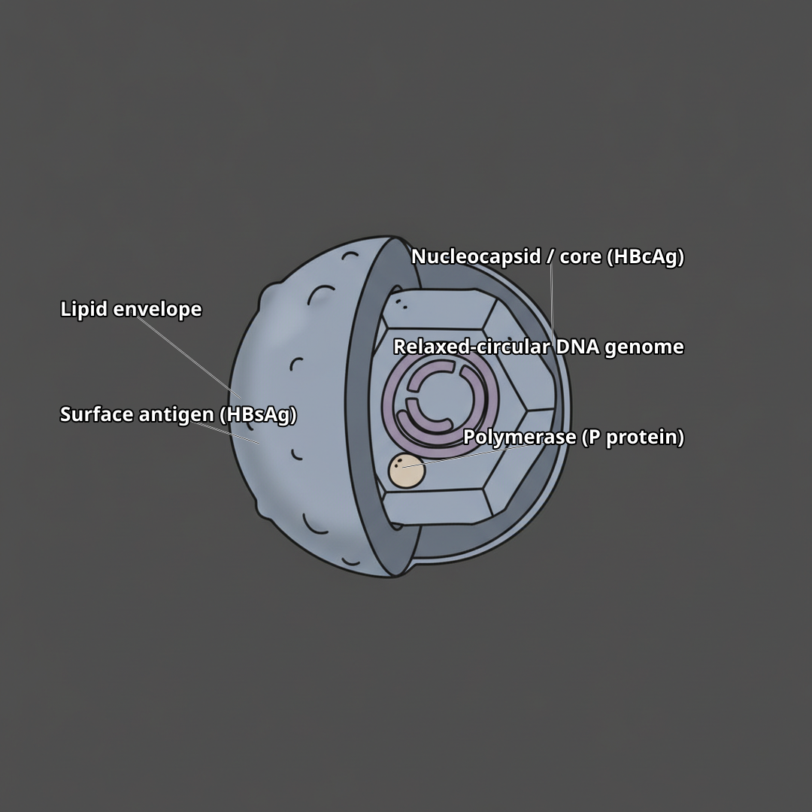 | **3D · labelled** 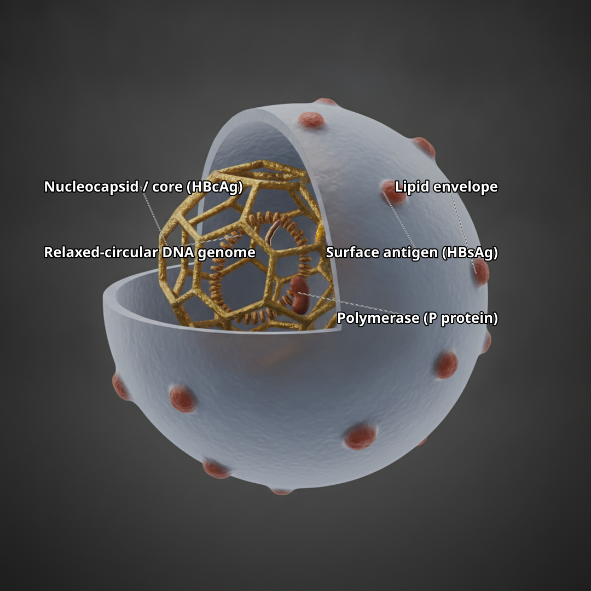 | **Watercolor · labelled**  |

| Audience | English | Deutsch |
| --- | --- | --- |
| **Kids** | Meet Hepatitis B: a tiny, tiny ball, much smaller than almost any germ you've heard of, so small it could hide inside a single one of your liver cells. It wears a soft round coat covered in little bumps, and inside it carries a coiled loop of its own DNA instructions. Hepatitis B likes to sneak in through blood or from a parent to a baby, and once inside it tries to move into your liver and stay there quietly for a long time. The best trick against it isn't a fight at all: a simple vaccine given as a baby teaches your body to recognise it instantly, so most people who are vaccinated never let it in the door in the first place. | Das ist Hepatitis B: eine winzig kleine Kugel, viel kleiner als fast jeder Keim, von dem du je gehört hast, so klein, dass sie sich in einer einzigen deiner Leberzellen verstecken könnte. Sie trägt einen weichen runden Mantel voller kleiner Beulen, und im Inneren trägt sie eine aufgerollte Schleife ihrer eigenen DNA-Bauanleitung. Hepatitis B schleicht sich gern über Blut oder von einem Elternteil aufs Baby ein, und drinnen versucht sie, in deine Leber zu ziehen und dort lange still zu bleiben. Der beste Trick gegen sie ist gar kein Kampf: Eine einfache Impfung im Babyalter bringt deinem Körper bei, sie sofort zu erkennen, sodass die meisten geimpften Menschen sie gar nicht erst hereinlassen. |
| **Adults** | Hepatitis B virus is one of the smallest viruses that infects humans, a roughly 42-nanometre sphere wrapped in a lipid envelope studded with its signature surface protein, HBsAg. It spreads through blood, sexual contact and from mother to child during birth, and it specifically targets liver cells, where it can either clear within months or settle into a lifelong chronic infection carried by an estimated 250 million people worldwide. Chronic infection is the quiet danger: it can slowly scar the liver into cirrhosis and, over decades, raise the risk of liver cancer, often without symptoms until damage is advanced. The good news is that HBV is one of the great vaccine success stories in medicine; a safe, highly effective vaccine given in infancy has already prevented millions of chronic infections, and antiviral drugs can control the virus in people who are already living with it. | Das Hepatitis-B-Virus ist eines der kleinsten Viren, die Menschen infizieren, eine etwa 42 Nanometer große Kugel, umhüllt von einer Lipidhülle mit ihrem charakteristischen Oberflächenprotein HBsAg. Es wird über Blut, Sexualkontakt und von der Mutter auf das Kind bei der Geburt übertragen und befällt gezielt Leberzellen, wo es entweder innerhalb weniger Monate abklingt oder zu einer lebenslangen chronischen Infektion wird, von der weltweit schätzungsweise 250 Millionen Menschen betroffen sind. Die chronische Infektion ist die stille Gefahr: Sie kann die Leber langsam vernarben lassen, bis hin zur Zirrhose, und über Jahrzehnte das Risiko für Leberkrebs erhöhen, oft ohne Symptome, bis der Schaden schon fortgeschritten ist. Die gute Nachricht: HBV ist eine der großen Erfolgsgeschichten der Impfmedizin; eine sichere, hochwirksame Impfung im Säuglingsalter hat bereits Millionen chronischer Infektionen verhindert, und antivirale Medikamente können das Virus bei bereits Infizierten gut in Schach halten. |
| **Scientific** | Hepatitis B virus (Hepadnaviridae, Orthohepadnavirus) forms an infectious 42 nm virion, the Dane particle, comprising a host-derived lipid envelope studded with small, middle and large surface proteins (HBsAg) surrounding an icosahedral nucleocapsid built from HBcAg. The nucleocapsid encloses a 3.2 kb relaxed-circular, partially double-stranded DNA genome with the polymerase (P protein, reverse transcriptase) covalently bound to the minus strand. After receptor-mediated entry via NTCP on hepatocytes, the genome is repaired to covalently closed circular DNA (cccDNA) in the nucleus, which serves as the template for pregenomic RNA and is the principal reservoir underlying chronic infection. Replication proceeds by reverse transcription of the pregenomic RNA within cytoplasmic capsids, a strategy unique among DNA viruses. Persistent cccDNA, HBx-mediated modulation of host gene expression, and chronic immune-mediated liver injury together drive progression to cirrhosis and hepatocellular carcinoma, making cccDNA the key target of curative research. | Das Hepatitis-B-Virus (Hepadnaviridae, Orthohepadnavirus) bildet ein infektiöses 42 nm großes Virion, das Dane-Partikel, bestehend aus einer wirtseigenen Lipidhülle mit kleinen, mittleren und großen Oberflächenproteinen (HBsAg), die ein aus HBcAg aufgebautes ikosaedrisches Nukleokapsid umgeben. Das Nukleokapsid umschließt ein 3,2 kb großes, relaxiert-zirkuläres, teilweise doppelsträngiges DNA-Genom, an dessen Minusstrang die Polymerase (P-Protein, Reverse Transkriptase) kovalent gebunden ist. Nach rezeptorvermittelter Aufnahme über NTCP an Hepatozyten wird das Genom im Zellkern zu kovalent geschlossener zirkulärer DNA (cccDNA) repariert, die als Matrize für die prägenomische RNA dient und das zentrale Reservoir der chronischen Infektion darstellt. Die Replikation erfolgt durch reverse Transkription der prägenomischen RNA in zytoplasmatischen Kapsiden, eine unter DNA-Viren einzigartige Strategie. Persistierende cccDNA, die durch HBx vermittelte Modulation der Wirtsgenexpression und die chronische immunvermittelte Leberschädigung treiben gemeinsam die Progression zu Zirrhose und hepatozellulärem Karzinom voran, weshalb cccDNA das zentrale Ziel kurativer Forschung ist. |

[full log](set/pathogens-viruses/hepatitis-b-virus.render.md) · [set overview](set/pathogens-viruses/OVERVIEW.md)

---

### HIV (Human Immunodeficiency Virus) (`hiv`)
Enveloped retrovirus (~120 nm) whose Env spikes dock onto CD4 T-helper cells; its conical capsid delivers two RNA copies plus reverse transcriptase, and the provirus integrates into human DNA. Untreated it drives AIDS; antiretroviral therapy (ART) keeps it suppressed.

| Textbook | SEM | 3D | Watercolor |
| --- | --- | --- | --- |
|  |  |  |  |
| **Reference (real)**  | **Textbook · labelled** 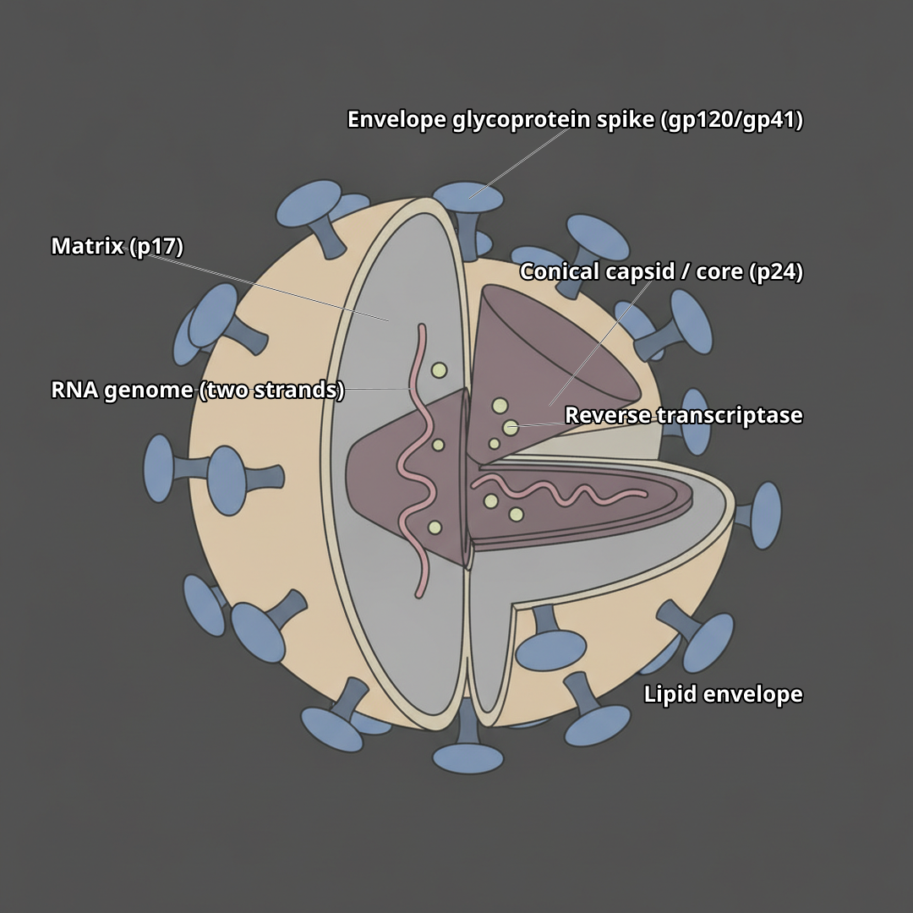 | **3D · labelled** 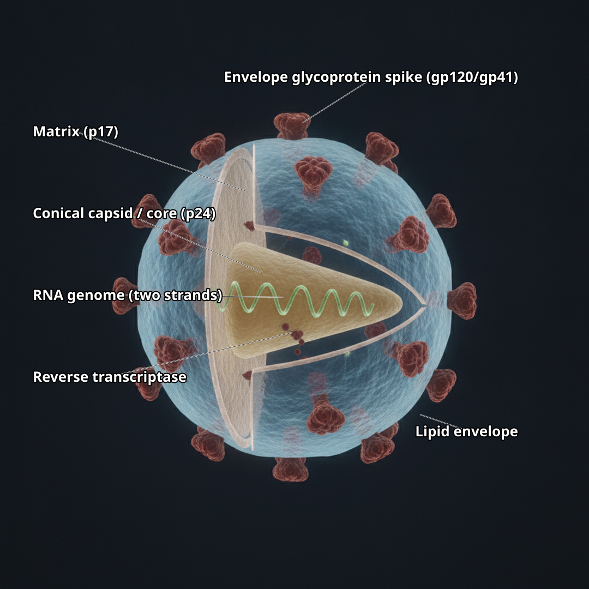 | **Watercolor · labelled**  |

| Audience | English | Deutsch |
| --- | --- | --- |
| **Kids** | Meet HIV, a tiny spiky ball of a virus that plays a very sneaky trick. It uses its little grappling-hook spikes to grab onto special helper cells that act like the captains of your body's defence team. Then it slips inside and hides its instructions right in the cell's own diary, so it is really hard to find. Doctors have clever daily pills that pin HIV down and stop it from making copies, so people who take them can stay healthy and strong for a whole lifetime. | Das ist HIV, ein winziger, stacheliger Virus-Ball mit einem hinterlistigen Trick. Mit seinen kleinen Enterhaken-Spikes klammert es sich an besondere Helferzellen, die wie die Kapitäne der Abwehrmannschaft deines Körpers sind. Dann schlüpft es hinein und versteckt seine Bauanleitung mitten im Tagebuch der Zelle, sodass man es kaum noch findet. Ärztinnen und Ärzte haben schlaue Tabletten für jeden Tag, die HIV festhalten und das Kopieren stoppen - wer sie nimmt, bleibt ein ganzes Leben lang gesund und munter. |
| **Adults** | HIV (human immunodeficiency virus) is a retrovirus that targets CD4-positive helper T cells, the coordinators of the immune response. Its envelope spikes (gp120/gp41) dock onto CD4 and a co-receptor, the virus fuses with the cell, and its enzyme reverse transcriptase copies its RNA into DNA that integrase then stitches permanently into the host genome. Left untreated, the slow loss of helper T cells eventually leads to AIDS, when the immune system can no longer fend off ordinary infections. Modern antiretroviral therapy (ART) blocks these steps so effectively that the virus becomes undetectable in the blood; people on treatment live long, healthy lives and cannot pass HIV on sexually (undetectable = untransmittable). | HIV (humanes Immundefizienz-Virus) ist ein Retrovirus, das gezielt CD4-positive Helfer-T-Zellen befällt, die Dirigenten der Immunabwehr. Seine Hüllproteine (gp120/gp41) docken an CD4 und einen Korezeptor an, das Virus verschmilzt mit der Zelle, und sein Enzym Reverse Transkriptase schreibt die RNA in DNA um, die die Integrase dann dauerhaft ins menschliche Erbgut einbaut. Unbehandelt führt der langsame Verlust der Helfer-T-Zellen schließlich zu AIDS, wenn die Immunabwehr auch harmlose Erreger nicht mehr abwehren kann. Moderne antiretrovirale Therapie (ART) blockiert diese Schritte so wirksam, dass das Virus im Blut nicht mehr nachweisbar ist; Behandelte leben lange und gesund und können HIV sexuell nicht weitergeben (nicht nachweisbar = nicht übertragbar). |
| **Scientific** | HIV-1 is an enveloped lentivirus (family Retroviridae) about 100–120 nm across. Each virion carries roughly 7–14 trimeric envelope glycoprotein spikes (surface gp120 non-covalently bound to transmembrane gp41) in a host-derived lipid bilayer, a matrix (p17) shell, and a distinctive conical p24 capsid enclosing two copies of positive-sense single-stranded RNA coated by nucleocapsid p7, together with reverse transcriptase, integrase and protease. Entry proceeds by gp120 binding CD4 and a chemokine co-receptor (CCR5 or CXCR4), gp41-mediated membrane fusion, reverse transcription, nuclear import and integrase-catalysed integration to form a provirus. High reverse-transcriptase error rates and rapid replication drive the sequence diversity underlying immune escape and drug resistance; combination ART targeting reverse transcriptase, integrase, protease and entry achieves durable virological suppression. | HIV-1 ist ein behülltes Lentivirus (Familie Retroviridae) von etwa 100–120 nm Größe. Jedes Virion trägt rund 7–14 trimere Hüllprotein-Spikes (oberflächliches gp120, nicht-kovalent an das transmembranäre gp41 gebunden) in einer wirtseigenen Lipiddoppelschicht, eine Matrixhülle (p17) sowie ein charakteristisches konisches p24-Kapsid, das zwei Kopien positivsträngiger Einzelstrang-RNA umschließt, die vom Nukleokapsid p7 ummantelt sind, zusammen mit Reverser Transkriptase, Integrase und Protease. Der Eintritt erfolgt über die Bindung von gp120 an CD4 und einen Chemokin-Korezeptor (CCR5 oder CXCR4), gp41-vermittelte Membranfusion, reverse Transkription, Kernimport und Integrase-katalysierte Integration zum Provirus. Hohe Fehlerraten der Reversen Transkriptase und schnelle Replikation erzeugen die Sequenzvielfalt, die Immunflucht und Resistenz zugrunde liegt; eine Kombinations-ART gegen Reverse Transkriptase, Integrase, Protease und Eintritt erreicht eine dauerhafte virologische Suppression. |

[full log](set/pathogens-viruses/hiv.render.md) · [set overview](set/pathogens-viruses/OVERVIEW.md)

---

### Influenza virus (flu) (`influenza-virus`)
Enveloped, pleomorphic respiratory RNA virus (~80-120 nm) of the Orthomyxoviridae, studded with hemagglutinin and neuraminidase spikes and carrying a segmented 8-piece negative-sense RNA genome; constant mutation drives seasonal flu and pandemics.

| Textbook | SEM | 3D | Watercolor |
| --- | --- | --- | --- |
|  |  |  |  |
| **Reference (real)**  | **Textbook · labelled** 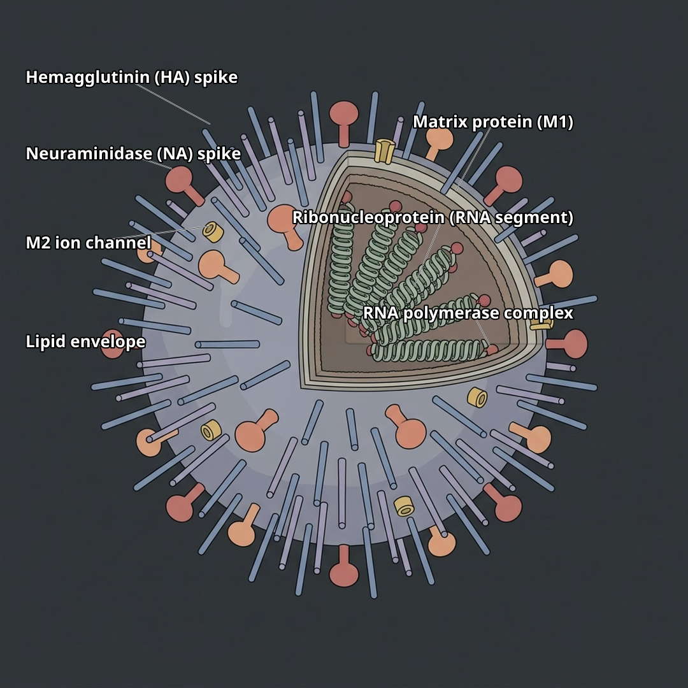 | **3D · labelled** 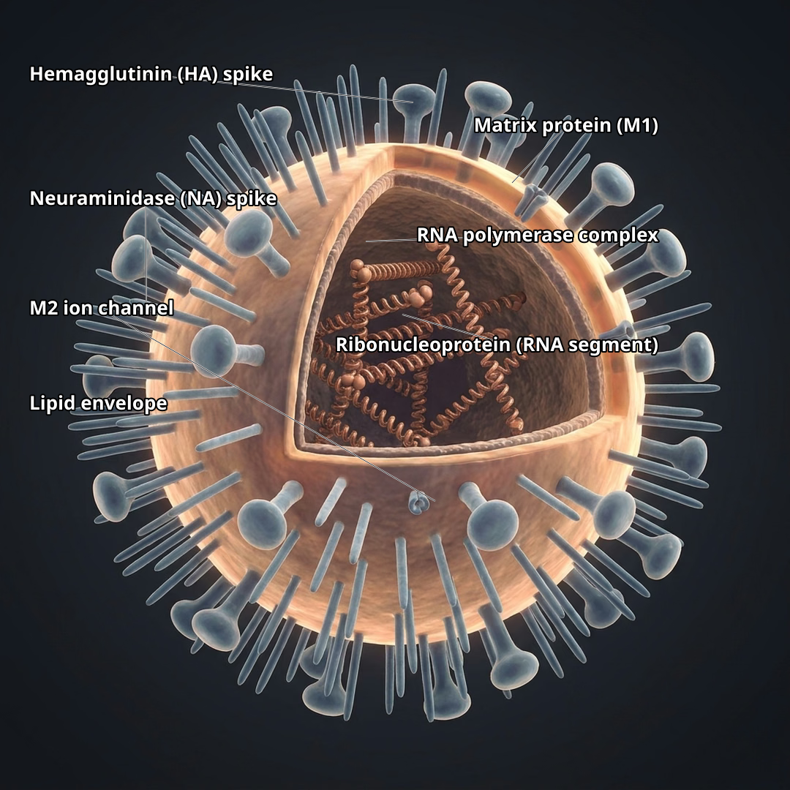 | **Watercolor · labelled** 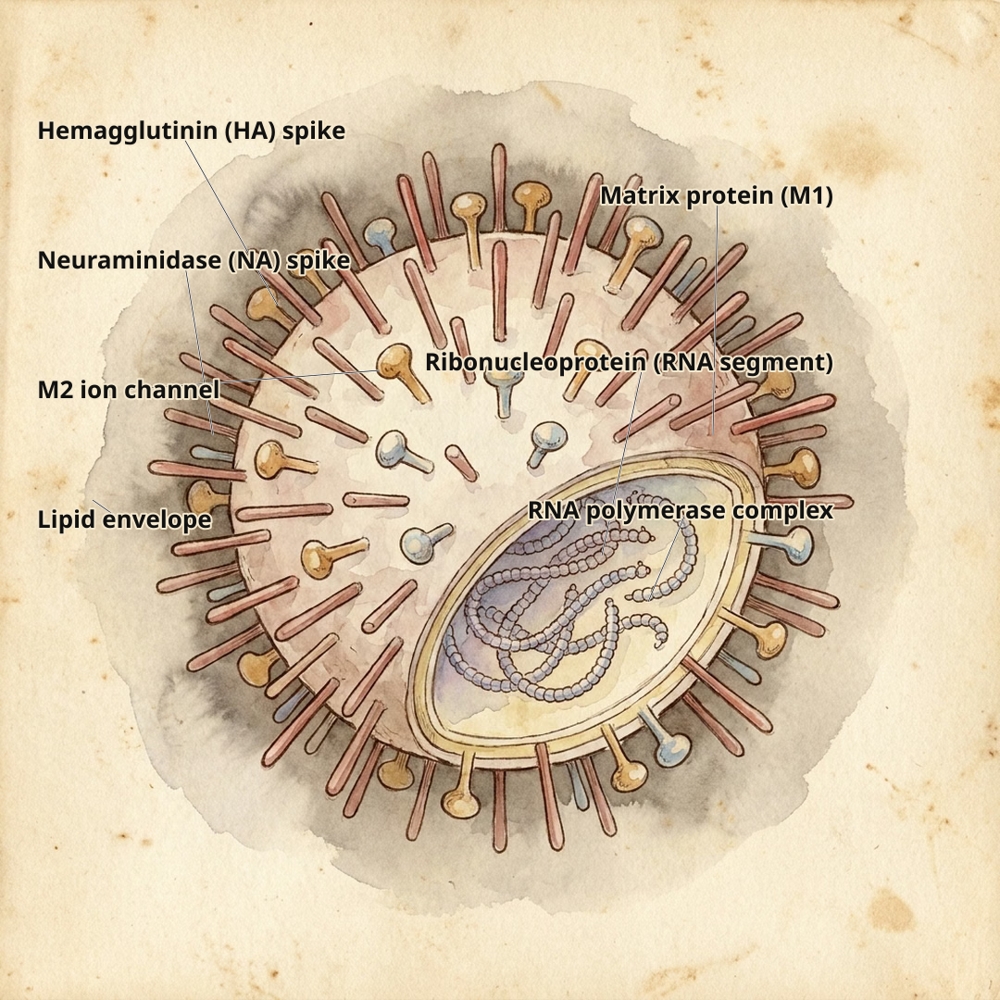 |

| Audience | English | Deutsch |
| --- | --- | --- |
| **Kids** | Meet the flu virus, a tiny prickly ball covered in fuzzy spikes like a microscopic burr! It floats through the air in the little droplets you sneeze and cough out, then lands in someone's nose or throat and sneaks inside to make copies of itself. That is why you feel achy, hot and tired for a few days. The flu is a quick-change artist: it swaps its spikes around so often that last year's version looks different this year. Cozy rest, plenty of water, and a yearly flu jab that teaches your body the newest spikes are the best ways to send it packing. | Das ist das Grippevirus, eine winzige stachelige Kugel voller flauschiger Spikes, wie eine Mini-Klette! Es schwebt in den kleinen Tröpfchen durch die Luft, die du beim Niesen und Husten ausstößt, landet in Nase oder Hals und schleicht sich hinein, um Kopien von sich zu bauen. Deshalb fühlst du dich ein paar Tage lang schlapp, heiß und müde. Die Grippe ist ein Verwandlungskünstler: Sie tauscht ihre Spikes so oft aus, dass die Version von letztem Jahr dieses Jahr schon anders aussieht. Ausruhen, viel trinken und die jährliche Grippeimpfung, die deinem Körper die neuesten Spikes zeigt, helfen am besten, sie loszuwerden. |
| **Adults** | Influenza is an enveloped RNA virus of the Orthomyxoviridae, spread mostly by respiratory droplets and close contact. Its surface carries two key proteins: hemagglutinin (H), which locks onto cells in the airway, and neuraminidase (N), which frees new virus copies — the H and N types are what names like H1N1 or H3N2 refer to. Because its genome comes in eight separate RNA pieces that mutate quickly (antigenic drift) and can be reshuffled when two strains meet (antigenic shift), the virus reinvents its coat every year, causing seasonal waves and occasional pandemics. That constant change is why the vaccine is updated annually, and antiviral drugs such as oseltamivir target the neuraminidase to blunt an infection. | Influenza ist ein behülltes RNA-Virus aus der Familie der Orthomyxoviridae und wird vor allem über Tröpfchen und engen Kontakt übertragen. Auf seiner Oberfläche sitzen zwei Schlüsselproteine: Hämagglutinin (H), das an Zellen der Atemwege andockt, und Neuraminidase (N), die neue Viruskopien freisetzt — die H- und N-Typen stecken in Namen wie H1N1 oder H3N2. Weil sein Erbgut aus acht getrennten RNA-Stücken besteht, die schnell mutieren (Antigendrift) und beim Zusammentreffen zweier Stämme neu gemischt werden können (Antigenshift), erneuert das Virus seine Hülle Jahr für Jahr und verursacht saisonale Wellen und gelegentlich Pandemien. Wegen dieses ständigen Wandels wird der Impfstoff jährlich angepasst, und Virostatika wie Oseltamivir hemmen die Neuraminidase, um eine Infektion abzuschwächen. |
| **Scientific** | Influenza A and B viruses (Orthomyxoviridae) are enveloped, pleomorphic virions ~80-120 nm in diameter with prominent filamentous forms. The host-derived lipid envelope bears two glycoproteins: trimeric hemagglutinin (HA), which binds sialic-acid receptors and drives receptor-mediated endocytosis and low-pH membrane fusion, and tetrameric neuraminidase (NA), a sialidase that releases progeny virions. Sparse M2 proton channels acidify the interior to trigger uncoating, and a matrix (M1) layer underlies the envelope. The genome is segmented into eight negative-sense single-stranded RNA molecules, each packaged with nucleoprotein and the heterotrimeric RNA-dependent RNA polymerase (PB1, PB2, PA) as a helical ribonucleoprotein; there is no icosahedral capsid. Segmentation permits reassortment (antigenic shift), while an error-prone polymerase produces antigenic drift, together underpinning immune escape, annual vaccine reformulation, and pandemic potential. | Influenza-A- und -B-Viren (Orthomyxoviridae) sind behüllte, pleomorphe Virionen mit ~80-120 nm Durchmesser und ausgeprägten filamentösen Formen. Die vom Wirt stammende Lipidhülle trägt zwei Glykoproteine: das trimere Hämagglutinin (HA), das an Sialinsäure-Rezeptoren bindet und die rezeptorvermittelte Endozytose sowie die Membranfusion bei niedrigem pH antreibt, und die tetramere Neuraminidase (NA), eine Sialidase, die Nachkommenvirionen freisetzt. Vereinzelte M2-Protonenkanäle säuern das Innere an und lösen das Uncoating aus, und eine Matrixschicht (M1) kleidet die Hülle von innen aus. Das Genom ist in acht negativsträngige einzelsträngige RNA-Moleküle segmentiert, die jeweils mit Nukleoprotein und der heterotrimeren RNA-abhängigen RNA-Polymerase (PB1, PB2, PA) als helikales Ribonukleoprotein verpackt sind; ein ikosaedrisches Kapsid fehlt. Die Segmentierung erlaubt Reassortment (Antigenshift), während eine fehleranfällige Polymerase Antigendrift erzeugt — zusammen die Grundlage für Immunflucht, jährliche Impfstoffanpassung und Pandemiepotenzial. |

[full log](set/pathogens-viruses/influenza-virus.render.md) · [set overview](set/pathogens-viruses/OVERVIEW.md)

---

### Measles virus (Morbillivirus) (`measles-virus`)
Enveloped, pleomorphic negative-sense RNA virus of the Paramyxoviridae (genus Morbillivirus), ~100-300 nm, studded with hemagglutinin (H) and fusion (F) spikes but carrying NO neuraminidase, its single non-segmented genome wound into a herringbone-like helical nucleocapsid; the most contagious human virus, prevented by the MMR vaccine.

| Textbook | SEM | 3D | Watercolor |
| --- | --- | --- | --- |
|  |  |  |  |
| **Reference (real)**  | **Textbook · labelled**  | **3D · labelled**  | **Watercolor · labelled**  |

| Audience | English | Deutsch |
| --- | --- | --- |
| **Kids** | Meet the measles virus, a soft fuzzy little ball with one enormous talent: floating. When somebody coughs, it sails off into the air and can still be drifting around the room two hours later, which makes it the long-distance champion of the whole virus world - one single sneeze can reach an entire classroom. Inside its bristly coat it keeps one long thread of instructions, coiled up like a tiny telephone cord. Here is the clever part: once measles is inside somebody, no medicine can simply switch it off, so people win this race before it even starts. Two small jabs of the MMR vaccine hand your body the complete measles building plan years ahead of time, and after that the great floating champion has nowhere left to land. | Das ist das Masernvirus, ein weiches, flauschiges Kügelchen mit einem riesigen Talent: Schweben. Wenn jemand hustet, segelt es durch die Luft und schwebt manchmal noch zwei Stunden später im Zimmer herum - damit ist es der Weitflug-Weltmeister unter allen Viren, denn ein einziges Niesen erreicht eine ganze Schulklasse. Unter seinem borstigen Mantel bewahrt es einen einzigen langen Faden mit seiner Bauanleitung auf, aufgewickelt wie ein winziges Telefonkabel. Und jetzt kommt der Trick: Ist das Masernvirus erst einmal drin, kann kein Medikament es einfach abschalten - deshalb gewinnt man dieses Rennen, bevor es überhaupt losgeht. Zwei kleine Piks mit der MMR-Impfung geben deinem Körper den kompletten Masern-Bauplan schon Jahre im Voraus. Danach findet der große Weitflug-Weltmeister einfach keinen Landeplatz mehr. |
| **Adults** | Measles is the most contagious virus known in humans: one infected person infects an average of 12 to 18 susceptible contacts, and the aerosol they leave behind stays infectious in a room for up to two hours. After roughly ten days of incubation come high fever, cough, runny nose and red eyes, the tiny white Koplik spots inside the cheeks, and then the familiar rash spreading from the face downwards. The real problem is what travels with it: ear infections and pneumonia are common, about one case in a thousand develops encephalitis, and years later the rare but invariably fatal brain disease SSPE can follow. Measles also wipes out part of the immune memory a person had already built up against other germs - so-called immune amnesia - leaving children more vulnerable to unrelated infections for months or even years afterwards. No drug attacks the virus itself; care is supportive, and vitamin A is given to children because it measurably reduces deaths. What does work is prevention. Two doses of the MMR vaccine are about 97% effective, and because measles exists as only one serotype worldwide, that protection generally lasts a lifetime. Around 95% coverage in a community is needed to stop the virus circulating at all. | Masern sind das ansteckendste bekannte Virus des Menschen: Eine infizierte Person steckt im Schnitt 12 bis 18 empfängliche Kontaktpersonen an, und das zurückgelassene Aerosol bleibt bis zu zwei Stunden lang im Raum infektiös. Nach etwa zehn Tagen Inkubationszeit folgen hohes Fieber, Husten, Schnupfen und gerötete Augen, die winzigen weißen Koplik-Flecken an der Wangenschleimhaut und schließlich der bekannte Ausschlag, der sich vom Gesicht abwärts ausbreitet. Das eigentliche Problem sind die Begleiter: Mittelohrentzündungen und Lungenentzündungen sind häufig, etwa einer von tausend Fällen entwickelt eine Gehirnentzündung, und Jahre später kann die seltene, immer tödliche Hirnerkrankung SSPE auftreten. Masern löschen zudem einen Teil des bereits aufgebauten Immungedächtnisses gegen andere Erreger - die sogenannte Immunamnesie - und lassen Kinder noch Monate bis Jahre danach anfälliger für ganz andere Infektionen zurück. Gegen das Virus selbst gibt es kein Medikament; behandelt werden nur die Beschwerden, und Kinder erhalten Vitamin A, weil es die Sterblichkeit nachweislich senkt. Wirksam ist die Vorbeugung: Zwei Dosen der MMR-Impfung schützen zu etwa 97%, und da Masern weltweit nur in einem einzigen Serotyp vorkommen, hält dieser Schutz in aller Regel lebenslang. Rund 95% Durchimpfung in der Bevölkerung sind nötig, damit das Virus gar nicht mehr zirkuliert. |
| **Scientific** | Measles virus (Morbillivirus hominis, genus Morbillivirus, family Paramyxoviridae, order Mononegavirales) is an enveloped, pleomorphic virion of roughly 100-300 nm. The host-derived lipid envelope carries two glycoproteins and, unlike the respiroviruses and rubulaviruses, no neuraminidase: the tetrameric hemagglutinin (H), a globular head on a short stalk that binds SLAMF1/CD150 on immune cells and nectin-4 on airway epithelium (CD46 for laboratory-adapted and vaccine strains), and the trimeric fusion protein (F), which mediates pH-independent fusion at the plasma membrane and drives syncytium formation. A matrix (M) layer coats the inner leaflet of the envelope and, as shown by cryo-electron tomography, forms a helical coat directly on the ribonucleocapsid. The genome is a single, linear, non-segmented negative-sense ssRNA of 15,894 nucleotides, encapsidated along its full length by nucleoprotein (N) into a 12-21 nm helical nucleocapsid with the classic herringbone appearance, associated with the phosphoprotein (P) and the large protein (L) that together constitute the RNA-dependent RNA polymerase. Replication follows the mononegavirus start-stop transcription gradient in the cytoplasm; V and C proteins antagonise interferon signalling. Infection of SLAM-positive memory lymphocytes depletes pre-existing humoral memory (immune amnesia), and persistent CNS infection can produce subacute sclerosing panencephalitis. Measles is antigenically monotypic, which underpins the durable protection of the live attenuated vaccine despite 24 circulating genotypes. | Das Masernvirus (Morbillivirus hominis, Gattung Morbillivirus, Familie Paramyxoviridae, Ordnung Mononegavirales) ist ein behülltes, pleomorphes Virion von etwa 100-300 nm. Die wirtseigene Lipidhülle trägt zwei Glykoproteine und - anders als bei Respiro- und Rubulaviren - keine Neuraminidase: das tetramere Hämagglutinin (H), ein kugeliger Kopf auf kurzem Stiel, der an SLAMF1/CD150 auf Immunzellen und an Nectin-4 auf dem Atemwegsepithel bindet (CD46 bei labor-adaptierten und Impfstämmen), sowie das trimere Fusionsprotein (F), das die pH-unabhängige Fusion an der Plasmamembran vermittelt und die Bildung von Synzytien antreibt. Eine Matrixschicht (M) kleidet die Hülle von innen aus und legt sich, wie die Kryo-Elektronentomographie zeigt, als helikaler Mantel direkt auf das Ribonukleokapsid. Das Genom ist eine einzelne, lineare, unsegmentierte negativsträngige ssRNA von 15.894 Nukleotiden, die über ihre gesamte Länge vom Nukleoprotein (N) zu einem 12-21 nm dicken helikalen Nukleokapsid mit dem klassischen Fischgrätmuster verpackt wird und mit dem Phosphoprotein (P) und dem Large-Protein (L) assoziiert ist, die zusammen die RNA-abhängige RNA-Polymerase bilden. Die Replikation folgt im Zytoplasma dem Start-Stopp-Transkriptionsgradienten der Mononegaviren; die V- und C-Proteine hemmen die Interferonantwort. Die Infektion SLAM-positiver Gedächtnislymphozyten löscht vorbestehendes humorales Immungedächtnis (Immunamnesie), und eine persistierende ZNS-Infektion kann zur subakuten sklerosierenden Panenzephalitis führen. Masern sind antigenisch monotypisch - darauf beruht der dauerhafte Schutz des attenuierten Lebendimpfstoffs trotz 24 zirkulierender Genotypen. |

[full log](set/pathogens-viruses/measles-virus.render.md) · [set overview](set/pathogens-viruses/OVERVIEW.md)

---

### Norovirus (stomach bug) (`norovirus`)
Tiny non-enveloped calicivirus (~38-40 nm) whose T=3 icosahedral capsid is built from 180 copies of the single protein VP1 arranged as 90 arch-shaped dimers over a contiguous shell, leaving the 32 cup-shaped surface hollows that give the family its name (Latin calix = cup); it packs one continuous ~7.5 kb positive-sense ssRNA with VPg on its 5' end plus a few copies of VP2, infects small-intestinal enterocytes, needs only ~10-100 particles to infect, and — being naked — shrugs off alcohol hand gel while soap and water still remove it.

| Textbook | SEM | 3D | Watercolor |
| --- | --- | --- | --- |
|  |  |  |  |
| **Reference (real)**  | **Textbook · labelled**  | **3D · labelled**  | **Watercolor · labelled**  |

| Audience | English | Deutsch |
| --- | --- | --- |
| **Kids** | Meet norovirus — the tiny troublemaker behind the "stomach bug" that races through schools, nurseries and cruise ships. It is one of the smallest viruses in this collection, a ball only about 38 millionths of a millimetre across, and it has no soft coat at all: just a bare, tough shell of protein wrapped straight around its single strand of RNA. Look closely at that shell and you will see it is not smooth. Ninety pairs of the same protein arch up out of the surface like little bridges, and between them sit thirty-two round hollows, like dents pressed into a golf ball with a thumb. Scientists thought those dents looked like tiny cups, so they named the whole virus family after the Latin word for cup, *calix*. Norovirus goes straight to your small intestine and upsets the lining there, which is why it makes people throw up suddenly and gives them watery diarrhoea. What makes it so good at spreading is that it barely needs any help: swallowing about ten particles can be enough, and one sick person sheds billions of them. Here is the surprising part — the squirty alcohol hand gel by the door hardly bothers it, because gel works by dissolving the greasy coat that norovirus does not have. Plain soap and warm water win instead: the soap lifts the little balls off your skin and the running water carries them down the drain, so scrub properly for a good twenty seconds, especially before eating. And if it does get you, the illness is usually short — a rough day or two and then it is over. The one job that really matters while you wait is drinking: small sips, often, so your body gets back the water it is losing. | Das ist das Norovirus — der winzige Störenfried hinter der "Magen-Darm-Grippe", die in Schulen, Kitas und auf Kreuzfahrtschiffen die Runde macht. Es ist eines der kleinsten Viren in dieser Sammlung, ein Kügelchen von nur etwa 38 Millionstel Millimetern, und es hat überhaupt keinen weichen Mantel: nur eine nackte, harte Eiweißschale, direkt um seinen einzelnen RNA-Faden gewickelt. Wenn du diese Schale genau anschaust, merkst du: Sie ist nicht glatt. Neunzig Paare desselben Proteins wölben sich wie kleine Brücken aus der Oberfläche, und dazwischen liegen zweiunddreißig runde Mulden, als hätte jemand mit dem Daumen Dellen in einen Golfball gedrückt. Den Forschern sahen diese Mulden aus wie winzige Becher, und deshalb ist die ganze Virusfamilie nach dem lateinischen Wort für Becher benannt: *calix*. Das Norovirus zieht schnurstracks in deinen Dünndarm und bringt die Schleimhaut dort durcheinander — darum muss man plötzlich erbrechen und bekommt wässrigen Durchfall. Besonders gut ist es im Weiterwandern: Etwa zehn Teilchen zu schlucken reicht schon, und ein kranker Mensch scheidet Milliarden davon aus. Und jetzt kommt das Überraschende — das Desinfektionsgel neben der Tür beeindruckt es kaum, denn das Gel wirkt, indem es die fettige Hülle auflöst, die das Norovirus gar nicht besitzt. Ganz normale Seife und warmes Wasser gewinnen stattdessen: Die Seife löst die Kügelchen von deiner Haut, und das fließende Wasser spült sie in den Abfluss. Also gründlich schrubben, gute zwanzig Sekunden lang, vor allem vor dem Essen. Und wenn es dich doch erwischt, ist der Spuk meist schnell vorbei — ein, zwei ungemütliche Tage, dann ist es überstanden. Die eine Aufgabe, auf die es in der Zwischenzeit wirklich ankommt, heißt Trinken: kleine Schlucke, immer wieder, damit dein Körper das Wasser zurückbekommt, das er gerade verliert. |
| **Adults** | Norovirus is the single commonest cause of acute gastroenteritis in adults worldwide, and the reason a nursery, a care home, a hospital ward or a cruise ship can go from normal to chaotic in forty-eight hours. The illness itself is unremarkable — abrupt vomiting, watery diarrhoea, cramps and a low fever starting a day or two after exposure and gone again within one to three days. What is remarkable is the transmission arithmetic. The infectious dose is on the order of ten to a hundred virions; an infected person sheds billions per gram of stool and continues shedding for a week or more after feeling well; and projectile vomiting aerosolises the virus across a room. Because the particle is non-enveloped it also survives for days on door handles, taps and worktops, tolerates freezing and normal cooking temperatures poorly enough to persist in raw oysters and salad, and shrugs off the alcohol hand rub that works so well against enveloped viruses like influenza and SARS-CoV-2 — alcohol has no lipid membrane to dissolve here. The practical consequences follow directly: wash with soap and running water rather than relying on gel, disinfect surfaces with a chlorine-based product rather than a quaternary ammonium wipe, keep symptomatic food handlers away from food for at least 48 hours after symptoms stop, and launder soiled fabrics hot. Treatment is oral rehydration and time; antibiotics are irrelevant and antiemetics are only occasionally needed. Immunity is short-lived and strain-specific, partly because the dominant GII.4 lineage keeps swapping its outer surface, so catching it once buys little protection — and susceptibility is partly genetic, since the virus binds histo-blood-group antigens, and people who lack a functioning FUT2 gene (so-called non-secretors, roughly a fifth of Europeans) are largely resistant to the common strains. Vaccine candidates are in clinical trials but none is licensed for general use. | Noroviren sind weltweit die häufigste Ursache akuter Gastroenteritis bei Erwachsenen und der Grund, warum eine Kita, ein Pflegeheim, eine Krankenhausstation oder ein Kreuzfahrtschiff binnen 48 Stunden vom Normalbetrieb ins Chaos kippen kann. Die Erkrankung selbst ist unspektakulär: schlagartiges Erbrechen, wässriger Durchfall, Krämpfe und leichtes Fieber, ein bis zwei Tage nach der Ansteckung beginnend und nach ein bis drei Tagen wieder vorbei. Bemerkenswert ist die Übertragungsrechnung. Die infektiöse Dosis liegt in der Größenordnung von zehn bis hundert Viruspartikeln; eine erkrankte Person scheidet Milliarden pro Gramm Stuhl aus und bleibt nach dem Abklingen der Beschwerden noch eine Woche oder länger ansteckend; und schwallartiges Erbrechen versprüht das Virus als Aerosol durch den ganzen Raum. Da das Partikel unbehüllt ist, überlebt es zudem tagelang auf Türklinken, Armaturen und Arbeitsflächen, übersteht Einfrieren und hält sich in rohen Austern und Salat, und es lässt sich von dem Alkohol-Händedesinfektionsmittel wenig beeindrucken, das gegen behüllte Viren wie Influenza oder SARS-CoV-2 so gut funktioniert — hier gibt es schlicht keine Lipidmembran zum Auflösen. Die praktischen Folgerungen ergeben sich unmittelbar: mit Seife unter fließendem Wasser waschen statt auf Gel zu vertrauen, Flächen mit einem chlorhaltigen Mittel desinfizieren statt mit einem Tuch auf Basis quartärer Ammoniumverbindungen, symptomatisches Küchenpersonal noch mindestens 48 Stunden nach Symptomende von Lebensmitteln fernhalten und verschmutzte Wäsche heiß waschen. Behandelt wird mit oraler Rehydratation und Geduld; Antibiotika sind wirkungslos, Antiemetika nur gelegentlich nötig. Die Immunität ist kurzlebig und stammspezifisch, auch weil die dominierende Linie GII.4 ihre Oberfläche laufend austauscht — eine durchgemachte Infektion schützt also kaum. Die Empfänglichkeit ist zudem teilweise genetisch bestimmt: Das Virus bindet an Histo-Blutgruppenantigene, und Menschen ohne funktionsfähiges FUT2-Gen (sogenannte Non-Sekretoren, etwa ein Fünftel der Europäer) sind gegen die verbreiteten Stämme weitgehend resistent. Impfstoffkandidaten befinden sich in klinischer Prüfung, zugelassen ist bislang keiner. |
| **Scientific** | Norovirus (family Caliciviridae, genus Norovirus, type species Norwalk virus) is a non-enveloped, icosahedral, positive-sense single-stranded RNA virus of roughly 27-40 nm; cryo-EM and the 1IHM crystal structure of recombinant Norwalk virus-like particles give an outer diameter close to 38 nm. The capsid has T=3 icosahedral symmetry and is built from 180 copies of the major capsid protein VP1 arranged as 90 dimers occupying three quasi-equivalent positions (A, B, C). Each VP1 folds into two domains connected by a flexible hinge: the shell (S) domain, an eight-stranded beta-sandwich whose 180 copies form the contiguous ~30 nm inner shell that encloses the genome, and the protruding (P) domain, which dimerises and arches away from the shell. The P domain subdivides into P1, the stem that supports the arch, and P2, a hypervariable insertion at the top of P1 that forms the outermost surface and carries both the neutralising epitopes and the binding site for histo-blood-group antigens (HBGAs), the fucosylated carbohydrate attachment factors whose expression depends on a functional FUT2 (secretor) gene. The 90 arching dimers leave 32 large cup-shaped depressions at the icosahedral five-fold and three-fold axes; these calices, first resolved by negative-stain electron microscopy as a characteristic ragged, feathery outline with a Star-of-David appearance, give the family its name (Latin calix, cup). A second, minor structural protein, VP2 (ORF3), is basic, present at one or two copies per virion, binds the interior surface of the S domain and is required for infectious particle assembly and genome stability. The genome is a single positive-sense ssRNA molecule of about 7.5-7.7 kb, polyadenylated at the 3' end and carrying the viral protein VPg covalently attached to the 5' end in place of a cap; VPg recruits eIF4E and the initiation machinery directly. Three open reading frames are used by human noroviruses: ORF1 encodes a polyprotein cleaved by the viral 3C-like protease NS6 into six non-structural proteins including the NS7 RNA-dependent RNA polymerase, ORF2 encodes VP1 and ORF3 encodes VP2; an additional overlapping ORF4 encoding VF1, an innate-immune antagonist, is present in murine norovirus. Replication occurs on rearranged cytoplasmic membranes with a negative-sense intermediate and a subgenomic RNA that expresses VP1 and VP2. Human noroviruses long resisted culture; they are now propagated in human intestinal enteroid (organoid) monolayers and in B cells with an HBGA-expressing enteric bacterial cofactor, and tuft cells have been identified as the tropic target of murine norovirus. Classification is by VP1 sequence into ten genogroups (GI-GX), of which GI, GII, GIV, GVIII and GIX infect humans; GII.4 has caused successive global epidemic waves through epochal antigenic drift in the P2 subdomain, together with recombination at the ORF1/ORF2 junction. Contrast with rotavirus, the other classic paediatric gut virus in this atlas: rotavirus is roughly twice the diameter, triple-layered, and carries eleven segments of double-stranded RNA, whereas norovirus has a single capsid layer and one continuous ssRNA molecule. | Noroviren (Familie Caliciviridae, Gattung Norovirus, Typspezies Norwalk-Virus) sind unbehüllte, ikosaedrische Einzelstrang-RNA-Viren mit Positivpolarität von etwa 27-40 nm; die Kryo-EM-Daten und die Kristallstruktur 1IHM rekombinanter Norwalk-virusähnlicher Partikel ergeben einen Außendurchmesser von annähernd 38 nm. Das Kapsid besitzt eine ikosaedrische T=3-Symmetrie und besteht aus 180 Kopien des Hauptkapsidproteins VP1, angeordnet als 90 Dimere in drei quasiäquivalenten Positionen (A, B, C). Jedes VP1 faltet sich in zwei über ein flexibles Scharnier verbundene Domänen: die Schalendomäne (shell, S), ein achtsträngiges Beta-Sandwich, dessen 180 Kopien die zusammenhängende, rund 30 nm große innere Schale bilden, die das Genom umschließt, und die hervorstehende Domäne (protruding, P), die dimerisiert und sich bogenförmig von der Schale abhebt. Die P-Domäne gliedert sich in P1, den Stiel, der den Bogen trägt, und P2, eine hypervariable Insertion an der Spitze von P1, die die äußerste Oberfläche bildet und sowohl die neutralisierenden Epitope als auch die Bindungsstelle für Histo-Blutgruppenantigene (HBGA) trägt — jene fukosylierten Kohlenhydrat-Anheftungsfaktoren, deren Ausprägung von einem funktionsfähigen FUT2-Gen (Sekretor-Status) abhängt. Die 90 aufgewölbten Dimere lassen 32 große becherförmige Vertiefungen an den fünf- und dreizähligen ikosaedrischen Achsen frei; diese Kelche, elektronenmikroskopisch im Negativkontrast zuerst als charakteristisch ausgefranster, gefiederter Umriss mit Davidstern-Anmutung sichtbar gemacht, gaben der Familie ihren Namen (lateinisch calix, Becher). Ein zweites, mengenmäßig untergeordnetes Strukturprotein, VP2 (ORF3), ist basisch, liegt in ein bis zwei Kopien pro Virion vor, bindet die Innenseite der S-Domäne und wird für den Zusammenbau infektiöser Partikel und die Genomstabilität benötigt. Das Genom ist ein einzelnes Plusstrang-ssRNA-Molekül von etwa 7,5-7,7 kb, am 3'-Ende polyadenyliert und am 5'-Ende anstelle einer Cap-Struktur kovalent mit dem viralen Protein VPg verknüpft; VPg rekrutiert eIF4E und die Initiationsmaschinerie unmittelbar. Humane Noroviren nutzen drei offene Leserahmen: ORF1 codiert ein Polyprotein, das von der viralen 3C-ähnlichen Protease NS6 in sechs Nichtstrukturproteine gespalten wird, darunter die RNA-abhängige RNA-Polymerase NS7; ORF2 codiert VP1, ORF3 codiert VP2. Beim murinen Norovirus kommt ein überlappendes ORF4 für VF1 hinzu, einen Antagonisten der angeborenen Immunantwort. Die Replikation läuft an umgebauten zytoplasmatischen Membranen über ein Minusstrang-Intermediat und eine subgenomische RNA ab, die VP1 und VP2 exprimiert. Humane Noroviren galten lange als nicht kultivierbar; heute vermehrt man sie in Monolayern humaner intestinaler Enteroide (Organoide) sowie in B-Zellen unter Zugabe HBGA-exprimierender Darmbakterien als Kofaktor, und beim murinen Norovirus wurden Tuft-Zellen als Zielzelltyp identifiziert. Die Einteilung erfolgt anhand der VP1-Sequenz in zehn Genogruppen (GI-GX), von denen GI, GII, GIV, GVIII und GIX den Menschen infizieren; GII.4 hat durch epochale Antigendrift in der P2-Subdomäne zusammen mit Rekombination an der ORF1/ORF2-Grenze aufeinanderfolgende weltweite Epidemiewellen ausgelöst. Im Vergleich zum Rotavirus, dem anderen klassischen kindlichen Darmvirus dieses Atlas: Rotaviren sind rund doppelt so groß, dreischichtig aufgebaut und tragen elf Segmente doppelsträngiger RNA, während Noroviren eine einzige Kapsidschicht und ein einziges durchgehendes ssRNA-Molekül besitzen. |

[full log](set/pathogens-viruses/norovirus.render.md) · [set overview](set/pathogens-viruses/OVERVIEW.md)

---

### Plasmodium (malaria) (`plasmodium`)
Single-celled apicomplexan parasite that causes malaria, spread by Anopheles mosquitoes. Shown here as the invasive merozoite (~1.5 µm): a small egg-shaped eukaryotic cell with a pointed apical complex (rhoptries, micronemes) for entering red blood cells, one nucleus, a single mitochondrion and a relict apicoplast. Not a worm, not a bacterium.

| Textbook | SEM | 3D | Watercolor |
| --- | --- | --- | --- |
|  |  |  |  |
| **Reference (real)**  | **Textbook · labelled** 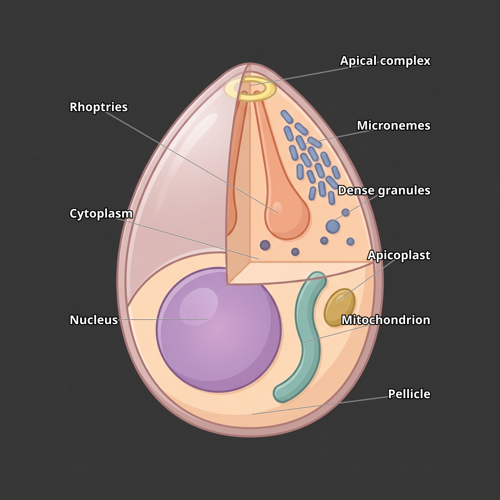 | **3D · labelled** 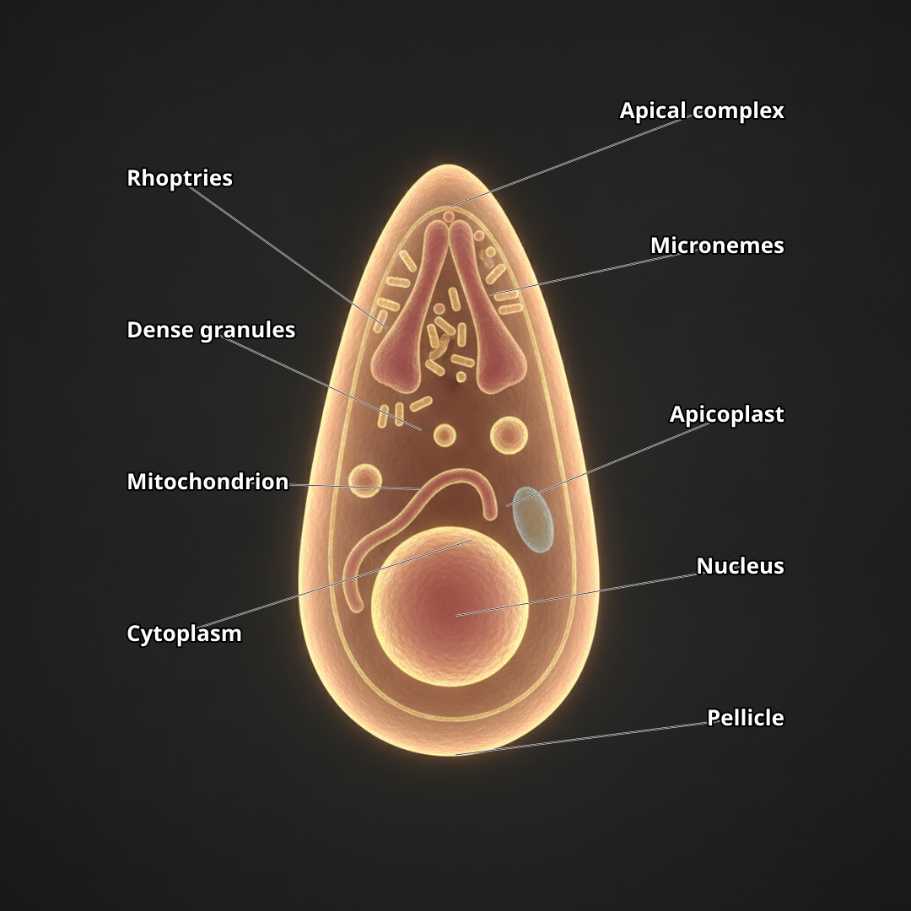 | **Watercolor · labelled**  |

| Audience | English | Deutsch |
| --- | --- | --- |
| **Kids** | Meet Plasmodium, the tiny troublemaker behind malaria! It is just one single cell, shaped a bit like a pointy egg, and it is far too small to see. A mosquito carries it: when the mosquito bites, Plasmodium sneaks into your blood, hides in your liver, then bursts into your red blood cells and makes you feel hot and shivery in waves. The pointed end is a special tool-kit it uses to drill its way inside a blood cell. The best trick to stop it is not letting the mosquito bite you at all — sleeping under a bed net keeps the little pests away. If someone does catch malaria, doctors have strong anti-malaria medicine, and clever new vaccines are now helping to shield kids too. | Das ist Plasmodium, der winzige Störenfried hinter der Malaria! Es ist nur eine einzige Zelle, geformt wie ein spitzes Ei, und viel zu klein zum Sehen. Eine Mücke trägt es mit sich: Wenn die Mücke sticht, schleicht sich Plasmodium in dein Blut, versteckt sich in deiner Leber und platzt dann in deine roten Blutkörperchen — davon wird dir in Wellen heiß und kalt. Mit seinem spitzen Ende bohrt es sich in ein Blutkörperchen hinein. Der beste Trick ist, die Mücke gar nicht erst stechen zu lassen — unter einem Moskitonetz zu schlafen hält die kleinen Plagegeister fern. Und wenn doch jemand Malaria bekommt, haben Ärzte starke Malaria-Medizin, und clevere neue Impfstoffe schützen jetzt auch Kinder. |
| **Adults** | Plasmodium is a single-celled apicomplexan parasite and the cause of malaria, one of the world's deadliest infectious diseases. It is transmitted by the bite of female Anopheles mosquitoes, which inject slender sporozoites that first multiply silently in the liver before pouring into the bloodstream. There the parasite invades red blood cells as a merozoite — the egg-shaped stage shown here — using a specialised apical complex to force its way in, then multiplies inside and bursts out in synchronised waves that produce malaria's classic recurring fevers and chills. Five species infect humans, with Plasmodium falciparum causing the most severe, sometimes fatal disease. Because it hides inside liver and blood cells and constantly varies its surface proteins, malaria has been extremely hard to control. Prevention still rests heavily on insecticide-treated bed nets and mosquito control, treatment relies on antimalarial drugs such as artemisinin-based combinations, and the first malaria vaccines (RTS,S and R21) are now being rolled out to children in high-burden regions. | Plasmodium ist ein einzelliger Apicomplexa-Parasit und der Erreger der Malaria, einer der tödlichsten Infektionskrankheiten der Welt. Übertragen wird er durch den Stich weiblicher Anopheles-Mücken, die schlanke Sporozoiten einspritzen, welche sich zunächst unbemerkt in der Leber vermehren, bevor sie in die Blutbahn strömen. Dort befällt der Parasit als Merozoit — das hier gezeigte eiförmige Stadium — die roten Blutkörperchen und dringt mit einem spezialisierten Apikalkomplex gewaltsam in sie ein; im Inneren vermehrt er sich und platzt in synchronen Wellen heraus, was die typischen wiederkehrenden Fieberschübe und Schüttelfröste der Malaria auslöst. Fünf Arten befallen den Menschen, wobei Plasmodium falciparum die schwersten, mitunter tödlichen Verläufe verursacht. Weil er sich in Leber- und Blutzellen versteckt und seine Oberflächenproteine ständig verändert, ist Malaria äußerst schwer zu bekämpfen. Vorbeugung beruht weiterhin stark auf insektizidbehandelten Moskitonetzen und Mückenbekämpfung, die Behandlung stützt sich auf Malariamittel wie Artemisinin-Kombinationstherapien, und die ersten Malaria-Impfstoffe (RTS,S und R21) werden nun an Kinder in stark betroffenen Regionen verteilt. |
| **Scientific** | Plasmodium is a genus of obligate intracellular apicomplexan protozoa (phylum Apicomplexa) with a complex two-host life cycle alternating between an Anopheles mosquito definitive host and a vertebrate intermediate host. The invasive stages — sporozoite, merozoite and ookinete — are polarised zoites defined by the apical complex: apical polar rings, secretory rhoptries and micronemes, and dense granules whose sequential release drives gliding motility and host-cell invasion. The merozoite depicted here (~1–1.5 µm) is a compact eukaryotic cell bounded by a pellicle of plasma membrane over an inner membrane complex with subpellicular microtubules; it contains a single nucleus, one large tubular mitochondrion, and an apicoplast, a non-photosynthetic relict plastid of secondary endosymbiotic origin that is essential for isoprenoid biosynthesis and a validated drug target. After erythrocyte invasion the parasite develops through ring, trophozoite and schizont stages, consuming haemoglobin and detoxifying haem into inert haemozoin, then lyses the cell to release fresh merozoites in a roughly 48-hour synchronous cycle (P. falciparum). Antigenic variation of surface proteins such as PfEMP1, and cytoadherence of infected erythrocytes, underlie immune evasion and severe falciparum pathology. | Plasmodium ist eine Gattung obligat intrazellulärer Apicomplexa-Protozoen (Stamm Apicomplexa) mit einem komplexen Zwei-Wirt-Lebenszyklus, der zwischen der Anopheles-Mücke als Endwirt und einem Wirbeltier als Zwischenwirt wechselt. Die invasiven Stadien — Sporozoit, Merozoit und Ookinet — sind polarisierte Zoiten, definiert durch den Apikalkomplex: apikale Polringe, sekretorische Rhoptrien und Mikronemen sowie dichte Granula, deren gestaffelte Freisetzung die Gleitbewegung und das Eindringen in die Wirtszelle antreibt. Der hier dargestellte Merozoit (~1–1,5 µm) ist eine kompakte eukaryotische Zelle, umgeben von einer Pellikula aus Zellmembran über einem inneren Membrankomplex mit subpellikulären Mikrotubuli; er besitzt einen einzelnen Zellkern, ein großes tubuläres Mitochondrium und einen Apikoplasten, ein nicht-photosynthetisches Relikt-Plastid sekundär-endosymbiotischen Ursprungs, das für die Isoprenoid-Biosynthese unentbehrlich und ein validiertes Wirkstoffziel ist. Nach dem Eindringen in den Erythrozyten durchläuft der Parasit Ring-, Trophozoiten- und Schizontenstadien, verbraucht Hämoglobin und wandelt Häm in inertes Hämozoin um, bevor er die Zelle lysiert und in einem etwa 48-stündigen synchronen Zyklus (P. falciparum) neue Merozoiten freisetzt. Antigenvariation von Oberflächenproteinen wie PfEMP1 und die Zytoadhärenz infizierter Erythrozyten liegen der Immunevasion und der schweren Falciparum-Pathologie zugrunde. |

[full log](set/pathogens-viruses/plasmodium.render.md) · [set overview](set/pathogens-viruses/OVERVIEW.md)

---

### Rhinovirus (common cold) (`rhinovirus`)
Tiny non-enveloped icosahedral +ssRNA virus (~30 nm) of the Picornaviridae (genus Enterovirus, species Rhinovirus A/B/C) whose ~170 genotypes cause most common colds; it replicates best at the cool 33-35 °C of the nasal lining and docks onto ICAM-1 through a canyon-shaped groove in its capsid.

| Textbook | SEM | 3D | Watercolor |
| --- | --- | --- | --- |
|  |  |  |  |
| **Reference (real)**  | **Textbook · labelled**  | **3D · labelled**  | **Watercolor · labelled**  |

| Audience | English | Deutsch |
| --- | --- | --- |
| **Kids** | Say hello to the rhinovirus, the little bumpy ball behind almost every runny nose! It is one of the tiniest viruses there is — you could line up four of them across one flu virus and still have room. It has no fuzzy coat and no spikes, just a hard, knobbly shell like a miniature golf ball carved with grooves, and it carries one single squiggle of RNA inside. Rhinovirus is picky about temperature: it likes things a bit chilly, so it settles in the cool front part of your nose instead of down in your warm chest. That is why a cold means sniffles and sneezes rather than the shivery, achy misery of the flu. It mostly travels on fingers — you touch a doorknob, then your nose, and in it hops. Scrubbing your hands with soap and warm water knocks it right off, because soap washes away the shell that hand gel cannot crack. And if one does get in? Your nose makes a lot of extra snot to flush it out, and in about a week the cold is simply gone. | Sag Hallo zum Rhinovirus, der kleinen knubbeligen Kugel hinter fast jeder Schnupfnase! Es ist eines der allerkleinsten Viren überhaupt — vier davon nebeneinander sind erst so breit wie ein einziges Grippevirus. Es hat keinen flauschigen Mantel und keine Stacheln, sondern nur eine harte, höckerige Schale wie ein winziger Golfball mit eingekerbten Rillen, und innen trägt es einen einzigen RNA-Faden. Rhinoviren sind wählerisch, was die Temperatur angeht: Sie mögen es etwas kühler und setzen sich deshalb vorn in der kalten Nase fest statt unten in der warmen Brust. Darum bekommst du bei einer Erkältung Schnupfen und Niesattacken und nicht das fiebrige Gliederweh einer echten Grippe. Meistens reist es per Finger: Du fasst eine Türklinke an, danach deine Nase, und schon ist es drin. Hände gründlich mit Seife und warmem Wasser waschen schüttelt es einfach ab, denn Seife spült die Schale weg, an der Handgel scheitert. Und wenn doch mal eines hineinkommt? Deine Nase produziert jede Menge Extra-Schnodder, um es hinauszuspülen, und nach ungefähr einer Woche ist die Erkältung von selbst vorbei. |
| **Adults** | Rhinoviruses cause the majority of common colds — an estimated half to three quarters of all upper-respiratory infections — and are the reason adults average two to three colds a year. They belong to the Picornaviridae and are structurally minimal: a naked protein shell about 30 nm wide, with no envelope and no surface spikes, wrapped around a single strand of positive-sense RNA. Two practical consequences follow from that shell. First, rhinoviruses replicate best at 33-35 °C, the temperature of the nasal passages, which keeps most infections in the upper airway; the symptoms you feel — congestion, runny nose, sore throat — are largely your own inflammatory response, not damage done by the virus. Second, having no lipid envelope makes them tough: they survive for hours on hands, doorknobs and toys and shrug off alcohol hand gels far better than flu or coronaviruses do, so soap-and-water hand washing and not touching your face are the interventions that actually work. With around 170 genotypes, immunity to one does little against the next, no vaccine exists, and no antiviral is licensed; the illness resolves on its own in roughly a week. For people with asthma or COPD, though, a rhinovirus infection is a leading trigger of exacerbations and deserves an action plan rather than a shrug. | Rhinoviren verursachen die meisten Erkältungen — schätzungsweise die Hälfte bis drei Viertel aller Infekte der oberen Atemwege — und sind der Grund, warum Erwachsene im Schnitt zwei bis drei Erkältungen pro Jahr durchmachen. Sie gehören zu den Picornaviridae und sind extrem einfach gebaut: eine nackte Proteinhülle von etwa 30 nm, ohne Membran und ohne Oberflächen-Spikes, um einen einzelnen Plusstrang-RNA-Faden herum. Aus dieser Hülle folgen zwei praktische Dinge. Erstens vermehren sich Rhinoviren am besten bei 33-35 °C, also in der Nase, weshalb die Infektion meist in den oberen Atemwegen bleibt; die Beschwerden — verstopfte Nase, Schnupfen, Halskratzen — entstehen vor allem durch die eigene Entzündungsreaktion, nicht durch Zerstörung von Gewebe. Zweitens macht die fehlende Lipidhülle sie robust: Sie überleben stundenlang auf Händen, Türklinken und Spielzeug und lassen sich von alkoholischem Handgel deutlich schlechter beeindrucken als Grippe- oder Coronaviren. Wirksam sind daher Händewaschen mit Seife und der Verzicht darauf, sich ins Gesicht zu fassen. Bei rund 170 Genotypen schützt eine durchgemachte Erkältung kaum vor der nächsten, ein Impfstoff existiert nicht und ein zugelassenes Virostatikum ebenso wenig; die Erkrankung heilt in etwa einer Woche von selbst aus. Für Menschen mit Asthma oder COPD ist eine Rhinovirus-Infektion allerdings einer der häufigsten Auslöser von Exazerbationen und gehört in einen Notfallplan statt achselzuckend abgetan. |
| **Scientific** | Human rhinoviruses (family Picornaviridae, genus Enterovirus; species Rhinovirus A, B and C, ~170 genotypes) are non-enveloped icosahedral virions of ~30 nm. The capsid has pseudo-T=3 (P=3) symmetry and comprises 60 protomers of VP1, VP2 and VP3, which form the outer surface, plus internal myristoylated VP4. VP1 pentamers create a raised star-shaped mesa at each five-fold axis, VP2/VP3 form the three-fold propeller, and a circular depression — the canyon — encircles each vertex. Major-group A and B serotypes bind ICAM-1 within the canyon, minor-group types bind LDL-receptor family members on the exposed surface, and RV-C, which has a shallow canyon, uses CDHR3. A hydrophobic pocket in VP1 beneath the canyon floor holds a lipid pocket factor that stabilises the capsid and is displaced by capsid-binding antivirals such as pleconaril. The genome is a single ~7.2 kb positive-sense ssRNA with a covalently linked VPg (3B) at the 5' end, a type-I IRES in the 5' UTR, one open reading frame encoding a polyprotein processed by the 2A and 3C proteinases, and a 3' poly(A) tail; no polymerase is packaged. Replication is optimal at 33-35 °C, restricting most infection to the upper airway, and the virion is acid-labile, distinguishing rhinoviruses from other enteroviruses. Clinical illness is driven predominantly by host cytokine and neurogenic responses rather than cytolysis, and rhinovirus is the principal viral trigger of asthma and COPD exacerbations. | Humane Rhinoviren (Familie Picornaviridae, Gattung Enterovirus; Spezies Rhinovirus A, B und C, rund 170 Genotypen) sind unbehüllte ikosaedrische Virionen von etwa 30 nm. Das Kapsid besitzt Pseudo-T=3-(P=3-)Symmetrie und besteht aus 60 Protomeren mit VP1, VP2 und VP3 an der Außenfläche sowie dem innen liegenden, myristoylierten VP4. VP1-Pentamere bilden an jeder fünfzähligen Achse ein erhabenes, sternförmiges Plateau, VP2/VP3 formen den dreizähligen Propeller, und eine ringförmige Vertiefung — der Canyon — umläuft jeden Vertex. Serotypen der Major-Gruppe (A und B) binden ICAM-1 im Canyon, Minor-Gruppen-Typen binden Mitglieder der LDL-Rezeptorfamilie an der freiliegenden Oberfläche, und RV-C mit seinem flachen Canyon nutzt CDHR3. Eine hydrophobe Tasche in VP1 unter dem Canyonboden enthält einen lipidischen Pocket-Faktor, der das Kapsid stabilisiert und von kapsidbindenden Virostatika wie Pleconaril verdrängt wird. Das Genom ist eine einzelne, etwa 7,2 kb lange Plusstrang-ssRNA mit kovalent gebundenem VPg (3B) am 5'-Ende, einer IRES vom Typ I in der 5'-UTR, einem einzigen offenen Leserahmen für ein Polyprotein, das von den Proteinasen 2A und 3C prozessiert wird, sowie einem 3'-Poly(A)-Schwanz; eine Polymerase wird nicht mitverpackt. Die Replikation verläuft optimal bei 33-35 °C, was die Infektion überwiegend auf die oberen Atemwege beschränkt, und das Virion ist säurelabil, was Rhinoviren von den übrigen Enteroviren abgrenzt. Die Symptomatik entsteht vorwiegend durch Zytokin- und neurogene Wirtsreaktionen und weniger durch Zytolyse; Rhinoviren sind zudem der wichtigste virale Auslöser von Asthma- und COPD-Exazerbationen. |

[full log](set/pathogens-viruses/rhinovirus.render.md) · [set overview](set/pathogens-viruses/OVERVIEW.md)

---

### Rotavirus (`rotavirus`)
Non-enveloped, wheel-shaped triple-layered icosahedral dsRNA virus (~75 nm across the smooth rim, ~100 nm including its spikes) of the Sedoreoviridae; named from Latin rota, "wheel", because in negative-stain EM the short blunt VP4 spikes around a sharp rim make it look like a spoked wheel. It packs 11 double-stranded RNA segments inside a VP2 core wrapped in VP6 and an outer VP7 shell, and is the leading cause of severe dehydrating gastroenteritis in infants worldwide.

| Textbook | SEM | 3D | Watercolor |
| --- | --- | --- | --- |
|  |  |  |  |
| **Reference (real)**  | **Textbook · labelled**  | **3D · labelled**  | **Watercolor · labelled**  |

| Audience | English | Deutsch |
| --- | --- | --- |
| **Kids** | Meet rotavirus — the virus that looks like a tiny wheel. Scientists gave it that name because *rota* means wheel in Latin: under a very strong microscope you see a smooth round rim with short blunt studs poking out all around it, exactly like a wagon wheel with stubby spokes. It is built in three layers, one shell inside the next like a set of nesting balls, and right in the middle it keeps its instructions on eleven separate little pieces of double-stranded RNA instead of one long strip. Rotavirus does not go for your nose or your lungs. It heads straight for the lining of your small intestine, the long velvety tube where your body soaks up food and water. When it damages that lining, the water rushes straight through instead of being absorbed, and that means a lot of watery poo and a very sore tummy. Being tiny and tough, it spreads easily from unwashed hands to mouths, especially among toddlers. The good news is that babies get a vaccine they simply swallow — a few sweet drops on the tongue in the first months of life, no needle at all — and that has made really bad cases rare. And if someone does catch it, the most important job is drinking: little sips of water or a special salty-sweet drink from the pharmacy, over and over, to put back exactly what the tummy is losing. | Das ist das Rotavirus — das Virus, das aussieht wie ein winziges Rad. Genau daher hat es seinen Namen: *rota* heißt auf Lateinisch Rad. Unter einem sehr starken Mikroskop sieht man einen glatten runden Reifen, aus dem ringsum kurze, stumpfe Noppen herausschauen, genau wie ein Wagenrad mit gedrungenen Speichen. Es ist aus drei Schichten gebaut, eine Hülle in der nächsten wie ineinandergesteckte Kugeln, und ganz in der Mitte bewahrt es seinen Bauplan auf elf einzelnen Stückchen doppelsträngiger RNA auf statt auf einem langen Band. Rotaviren interessieren sich nicht für deine Nase oder deine Lunge. Sie steuern direkt die Schleimhaut deines Dünndarms an, den langen samtigen Schlauch, in dem dein Körper Essen und Wasser aufsaugt. Wenn diese Schleimhaut beschädigt wird, läuft das Wasser einfach durch, statt aufgenommen zu werden — und das heißt sehr viel wässriger Durchfall und ein arg gebeuteltes Bäuchlein. Weil es so klein und robust ist, wandert es leicht von ungewaschenen Händen in den Mund, vor allem bei kleinen Kindern. Das Gute daran: Babys bekommen eine Impfung, die sie einfach schlucken — ein paar süße Tropfen auf die Zunge in den ersten Lebensmonaten, ganz ohne Spritze — und seitdem sind wirklich schwere Fälle selten geworden. Und wenn sich doch jemand ansteckt, ist die wichtigste Aufgabe das Trinken: immer wieder kleine Schlucke Wasser oder eine besondere salzig-süße Trinklösung aus der Apotheke, damit genau das zurückkommt, was der Bauch verliert. |
| **Adults** | Rotavirus is the classic cause of severe watery diarrhoea in infants and young children. Before vaccination it infected essentially every child worldwide by the age of five and killed on the order of half a million of them each year, almost all through dehydration rather than through the infection itself. The virion is a non-enveloped, triple-layered particle about 75 nm across whose short surface spikes give it the spoked-wheel look that earned it the name. It infects the mature enterocytes on the tips of the villi in the small intestine — the cells that do the absorbing — and causes diarrhoea by three routes at once: those cells are destroyed and replaced by immature ones that absorb poorly, a viral protein called NSP4 acts as an enterotoxin and drives chloride and water secretion, and the enteric nervous system is stimulated to speed everything along. Because the particle has no lipid envelope it is remarkably durable on hands, toys and surfaces, resists many disinfectants, and is shed in enormous numbers, so hygiene alone never controlled it. Two live oral vaccines given in the first months of life changed the picture completely: countries that introduced them saw hospital admissions for childhood gastroenteritis fall by roughly two thirds within a few years, and the seasonal winter peak flattened. There is no useful antiviral; treatment is rehydration, ideally with low-osmolarity oral rehydration solution, with intravenous fluids reserved for children who cannot keep anything down. Feeding should continue rather than be stopped, and zinc supplementation shortens the illness in settings where deficiency is common. Adults are not immune — they simply tend to get a milder illness, and they pass it on. | Rotaviren sind der klassische Erreger schwerer wässriger Durchfälle bei Säuglingen und Kleinkindern. Vor Einführung der Impfung infizierte sich praktisch jedes Kind weltweit bis zum fünften Geburtstag, und jährlich starben in der Größenordnung von einer halben Million Kinder daran — fast alle an der Austrocknung, nicht an der Infektion selbst. Das Virusteilchen ist unbehüllt, dreischichtig aufgebaut und etwa 75 nm groß; die kurzen Oberflächen-Spikes verleihen ihm jenes Speichenrad-Aussehen, dem es seinen Namen verdankt. Es befällt die reifen Enterozyten auf den Zottenspitzen des Dünndarms, also genau die Zellen, die resorbieren, und löst den Durchfall gleich auf drei Wegen aus: Diese Zellen gehen zugrunde und werden durch unreife ersetzt, die schlecht aufnehmen; das virale Protein NSP4 wirkt als Enterotoxin und treibt die Chlorid- und Wassersekretion an; und das enterische Nervensystem wird zusätzlich stimuliert. Da dem Partikel die Lipidhülle fehlt, hält es sich bemerkenswert lange auf Händen, Spielzeug und Oberflächen, widersteht vielen Desinfektionsmitteln und wird in gewaltigen Mengen ausgeschieden — Hygiene allein hat es deshalb nie in den Griff bekommen. Zwei lebende Schluckimpfstoffe in den ersten Lebensmonaten haben das Bild grundlegend verändert: Länder, die sie eingeführt haben, sahen die Krankenhauseinweisungen wegen kindlicher Gastroenteritis binnen weniger Jahre um rund zwei Drittel sinken, und der winterliche Saisongipfel flachte ab. Ein wirksames Virostatikum gibt es nicht; behandelt wird mit Flüssigkeitsersatz, idealerweise mit niedrigosmolarer oraler Rehydratationslösung, Infusionen bleiben Kindern vorbehalten, die nichts bei sich behalten. Die Ernährung sollte fortgesetzt und nicht pausiert werden, und wo Mangel verbreitet ist, verkürzt eine Zinkgabe die Erkrankung. Erwachsene sind nicht immun — sie erkranken nur meist milder und geben das Virus weiter. |
| **Scientific** | Rotavirus (family Sedoreoviridae, formerly Reoviridae; genus Rotavirus, species Rotavirus A-J, with group/species A responsible for nearly all human disease) is a non-enveloped, icosahedral, triple-layered particle (TLP) of about 75 nm. The genome is segmented: eleven segments of double-stranded RNA, roughly 18.5 kb in total, each segment encoding one protein except segment 11. Three concentric protein shells enclose it. The innermost core is a T=1 layer of 120 copies of VP2, which packages the eleven dsRNA segments together with the RNA-dependent RNA polymerase VP1 and the capping enzyme VP3, one transcription complex tethered beneath each five-fold vertex. The intermediate layer is 260 trimers of VP6 in T=13 laevo symmetry; VP6 carries the group and subgroup antigens and is the target of most diagnostic immunoassays. The outer layer is 780 copies of the glycoprotein VP7 (T=13), from which 60 spikes of the protease-sensitive protein VP4 project; trypsin cleavage of VP4 into VP8* and VP5* is required for infectivity and yields the rigid, blunt spikes that produce the wheel-like negative-stain profile. VP7 (G-type) and VP4 (P-type) define the binary G/P genotype nomenclature and carry the neutralising epitopes. Aqueous channels of three classes penetrate the VP7 and VP6 layers and permit import of nucleotides and export of nascent mRNA. The dsRNA genome is never released into the cytoplasm: loss of the outer layer during entry produces a transcriptionally active double-layered particle (DLP) in which VP1 transcribes capped, non-polyadenylated plus-strand RNAs that are extruded through the type-I channels. Replication occurs in cytoplasmic viroplasms organised by NSP2 and NSP5, and progeny DLPs bud through the endoplasmic reticulum membrane in an NSP4-dependent step, transiently acquiring and then losing a lipid envelope before the mature TLP is formed. NSP4 additionally functions as a viral enterotoxin, elevating intracellular calcium and triggering age-dependent chloride secretion; together with destruction of mature villus-tip enterocytes, resulting disaccharidase deficiency and enteric nervous system activation, it produces the characteristic secretory-plus-malabsorptive diarrhoea. Segment reassortment between co-infecting strains is frequent and underpins both the diversity of circulating G/P combinations and the design of the reassortant vaccine RotaTeq; Rotarix is instead an attenuated human G1P[8] monovalent strain. | Rotaviren (Familie Sedoreoviridae, früher Reoviridae; Gattung Rotavirus, Spezies Rotavirus A-J, wobei Gruppe bzw. Spezies A nahezu alle Erkrankungen des Menschen verursacht) sind unbehüllte, ikosaedrische, dreischichtige Partikel (triple-layered particle, TLP) von etwa 75 nm. Das Genom ist segmentiert: elf Segmente doppelsträngiger RNA mit zusammen rund 18,5 kb, wobei jedes Segment mit Ausnahme von Segment 11 für ein Protein codiert. Drei konzentrische Proteinschalen umschließen es. Der innerste Kern ist eine T=1-Schicht aus 120 Kopien VP2, die die elf dsRNA-Segmente zusammen mit der RNA-abhängigen RNA-Polymerase VP1 und dem Capping-Enzym VP3 verpackt — je ein Transkriptionskomplex unter jedem fünfzähligen Vertex. Die mittlere Schicht besteht aus 260 VP6-Trimeren in T=13-laevo-Symmetrie; VP6 trägt die Gruppen- und Subgruppenantigene und ist die Zielstruktur der meisten diagnostischen Immunoassays. Die äußere Schicht bilden 780 Kopien des Glykoproteins VP7 (T=13), aus der 60 Spikes des proteasesensitiven Proteins VP4 herausragen; die Spaltung von VP4 durch Trypsin in VP8* und VP5* ist Voraussetzung für die Infektiosität und erzeugt jene starren, stumpfen Fortsätze, die im Negativkontrast das radförmige Profil ergeben. VP7 (G-Typ) und VP4 (P-Typ) definieren die binäre G/P-Genotypisierung und tragen die neutralisierenden Epitope. Wässrige Kanäle dreier Klassen durchziehen die VP7- und VP6-Schicht und erlauben den Import von Nukleotiden sowie den Export naszierender mRNA. Das dsRNA-Genom wird niemals ins Zytoplasma freigesetzt: Der Verlust der äußeren Schicht beim Eintritt erzeugt ein transkriptionsaktives doppelschichtiges Partikel (DLP), in dem VP1 gecappte, nicht polyadenylierte Plusstrang-RNAs synthetisiert, die durch die Typ-I-Kanäle ausgeschleust werden. Die Replikation läuft in zytoplasmatischen Viroplasmen ab, die von NSP2 und NSP5 organisiert werden; Tochter-DLPs knospen in einem NSP4-abhängigen Schritt in das Lumen des endoplasmatischen Retikulums, erhalten dabei vorübergehend eine Lipidhülle und verlieren sie wieder, bevor das reife TLP entsteht. NSP4 wirkt zusätzlich als virales Enterotoxin, erhöht das intrazelluläre Calcium und löst eine altersabhängige Chloridsekretion aus; zusammen mit der Zerstörung reifer Enterozyten an den Zottenspitzen, dem daraus folgenden Disaccharidasemangel und der Aktivierung des enterischen Nervensystems entsteht die charakteristische sekretorisch-malabsorptive Diarrhö. Reassortment einzelner Segmente zwischen koinfizierenden Stämmen ist häufig und erklärt sowohl die Vielfalt zirkulierender G/P-Kombinationen als auch das Konstruktionsprinzip des Reassortanten-Impfstoffs RotaTeq; Rotarix ist demgegenüber ein attenuierter humaner monovalenter G1P[8]-Stamm. |

[full log](set/pathogens-viruses/rotavirus.render.md) · [set overview](set/pathogens-viruses/OVERVIEW.md)

---

### SARS-CoV-2 (COVID-19) (`sars-cov-2`)
Enveloped +ssRNA betacoronavirus with a crown of Spike (S) glycoprotein trimers; binds ACE2 in the airways; caused the COVID-19 pandemic.

| Textbook | SEM | 3D | Watercolor |
| --- | --- | --- | --- |
|  |  |  |  |
| **Reference (real)**  | **Textbook · labelled** 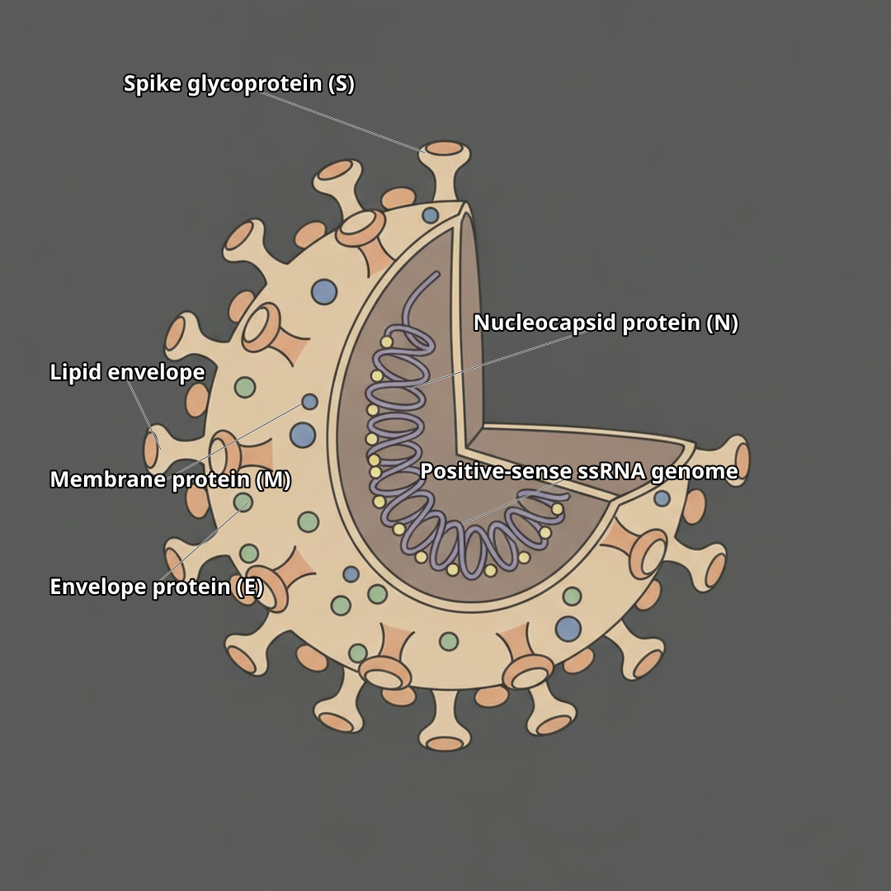 | **3D · labelled** 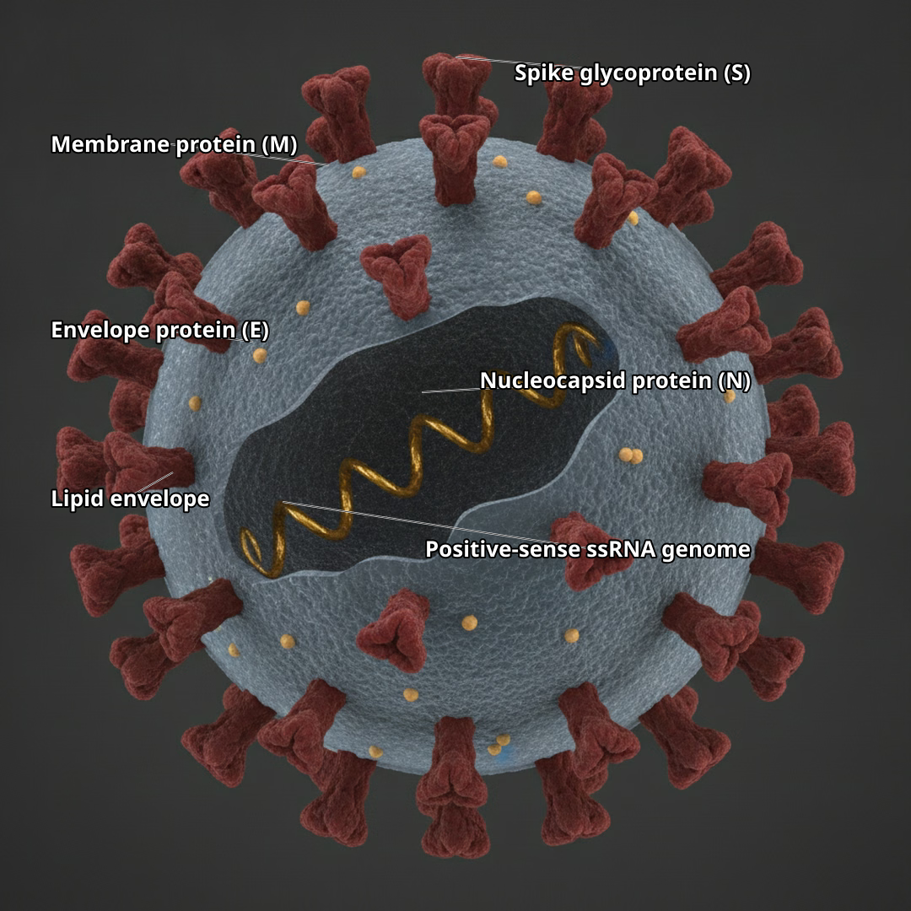 | **Watercolor · labelled** 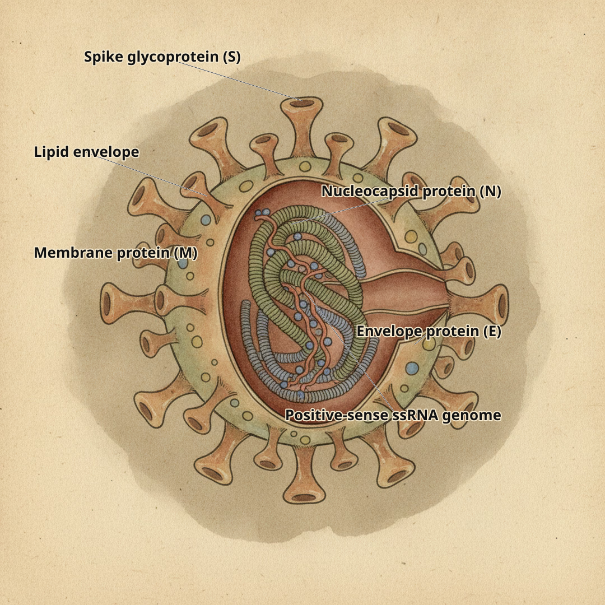 |

| Audience | English | Deutsch |
| --- | --- | --- |
| **Kids** | This is SARS-CoV-2, the coronavirus that gave the whole world COVID-19. It is a teeny-tiny spiky ball wearing a crown of little clubs called spikes, and it uses them to grab onto your cells and sneak inside to make loads of copies that can leave you coughing and sniffly. Most of the time you get better with rest and plenty of drinks over a week or two. Fresh air and masks stop it drifting from person to person, and a vaccine shows your body that spiky crown ahead of time so it is ready. | Das ist SARS-CoV-2, das Coronavirus, das der ganzen Welt COVID-19 gebracht hat. Es ist ein winziger stacheliger Ball mit einer Krone aus kleinen Keulen, die man Spikes nennt, und damit hakt es sich an deine Zellen und schleicht sich hinein, um viele Kopien zu bauen, die dich husten und schniefen lassen. Meistens wirst du mit Ruhe und viel Trinken nach ein bis zwei Wochen wieder gesund. Frische Luft und Masken halten es davon ab, von Mensch zu Mensch zu wandern, und eine Impfung zeigt deinem Körper die stachelige Krone schon vorher, damit er bereit ist. |
| **Adults** | SARS-CoV-2 is the coronavirus behind COVID-19, an enveloped particle roughly 100 nm across that spreads mainly through the air in respiratory droplets and fine aerosols. Its club-shaped Spike (S) proteins form the tell-tale crown and latch onto the ACE2 receptor on cells in our airways before fusing in and hijacking them to make copies. Because Spike is the key that opens the door, it is the main target of antibodies and of the mRNA and vector vaccines, which train the immune system to recognise it. New variants keep tweaking Spike to dodge that recognition, which is why boosters get updated. For people at higher risk, antiviral drugs such as nirmatrelvir/ritonavir can blunt the infection if started early. | SARS-CoV-2 ist das Coronavirus hinter COVID-19, ein behülltes Partikel von rund 100 nm Größe, das sich vor allem über die Luft in Atemtröpfchen und feinen Aerosolen verbreitet. Seine keulenförmigen Spike-Proteine (S) bilden die verräterische Krone und docken am ACE2-Rezeptor der Zellen unserer Atemwege an, bevor das Virus mit ihnen verschmilzt und sie zur Kopienproduktion zwingt. Weil das Spike der Schlüssel zur Zelltür ist, ist es das Hauptziel von Antikörpern sowie der mRNA- und Vektorimpfstoffe, die das Immunsystem darauf trainieren. Neue Varianten verändern das Spike immer wieder, um dieser Erkennung zu entgehen, weshalb Auffrischimpfungen angepasst werden. Für Risikogruppen können antivirale Medikamente wie Nirmatrelvir/Ritonavir die Infektion abschwächen, wenn man früh damit beginnt. |
| **Scientific** | SARS-CoV-2 is an enveloped, positive-sense single-stranded RNA betacoronavirus whose ~30 kb genome is the largest known among RNA viruses, capped and polyadenylated so it is translated directly by host ribosomes on entry. Four structural proteins build the ~80–120 nm virion: the Spike (S) trimer, which binds the ACE2 receptor and mediates membrane fusion and is the dominant antigen; the Membrane (M) and Envelope (E) proteins embedded in the host-derived lipid bilayer; and the Nucleocapsid (N) protein, which condenses the genome into a helical ribonucleoprotein rather than an icosahedral capsid. After ACE2-mediated entry, replication proceeds entirely in the cytoplasm, where the RNA-dependent RNA polymerase (RdRp) of the replicase complex transcribes genomic and subgenomic RNAs on virus-induced double-membrane vesicles. Progeny assemble at the ER–Golgi intermediate compartment and are released by exocytosis. | SARS-CoV-2 ist ein behülltes Betacoronavirus mit positivsträngiger Einzelstrang-RNA, dessen ~30 kb großes Genom das größte bekannte RNA-Virusgenom ist; es trägt Cap und Poly-A-Schwanz und wird nach dem Eintritt direkt von den Ribosomen des Wirts translatiert. Vier Strukturproteine bauen das 80–120 nm große Virion auf: das Spike-Trimer (S), das den ACE2-Rezeptor bindet, die Membranfusion vermittelt und das dominante Antigen ist; die Proteine Membran (M) und Hülle (E), eingebettet in die wirtseigene Lipiddoppelschicht; sowie das Nukleokapsidprotein (N), das das Genom zu einem helikalen Ribonukleoprotein und nicht zu einem ikosaedrischen Kapsid verdichtet. Nach ACE2-vermitteltem Eintritt läuft die Replikation vollständig im Zytoplasma ab, wo die RNA-abhängige RNA-Polymerase (RdRp) des Replikasekomplexes an virusinduzierten Doppelmembranvesikeln genomische und subgenomische RNAs transkribiert. Die Nachkommen-Virionen werden im ER-Golgi-Zwischenkompartiment zusammengebaut und durch Exozytose freigesetzt. |

[full log](set/pathogens-viruses/sars-cov-2.render.md) · [set overview](set/pathogens-viruses/OVERVIEW.md)

---

### Varicella-zoster virus (chickenpox) (`varicella-zoster-virus`)
Enveloped herpesvirus (human alphaherpesvirus 3, ~180-200 nm, pleomorphic) with the classic four-layer herpesvirus architecture: a ~125 kbp linear dsDNA genome packaged under pressure into a T=16 icosahedral capsid of 162 capsomeres (150 hexons + 12 pentons), the capsid cushioned by an asymmetric granular/fibrous protein tegument, the whole thing wrapped in a lipid envelope studded with short glycoprotein spikes. Causes chickenpox on primary infection, then establishes lifelong latency in nerve ganglia and can reactivate decades later as shingles.

| Textbook | SEM | 3D | Watercolor |
| --- | --- | --- | --- |
|  |  |  |  |
| **Reference (real)**  | **Textbook · labelled**  | **3D · labelled**  | **Watercolor · labelled**  |

| Audience | English | Deutsch |
| --- | --- | --- |
| **Kids** | Meet varicella-zoster virus, the one that gives people chickenpox. It belongs to a family called the herpesviruses, and they are built like a tiny parcel with four layers. Right in the middle is a long thread of DNA, the instruction manual, wound up tight like thread on a spool. Around that sits a lovely little ball made of 162 protein blocks fitted together into triangles, a bit like a miniature football; scientists call it the capsid. Then comes the layer that makes herpesviruses special and that most pictures forget: a soft, grainy padding called the tegument, stuffed with tools the virus wants to unpack the moment it arrives somewhere new. And wrapped around the whole thing is a soft, slightly floppy oily coat with hundreds of short blunt studs poking out of it, which is why a herpesvirus is never a perfectly neat sphere. The virus travels through the air, so it can drift from one person to another just by breathing. A week or two later, little itchy spots appear all over the skin. If that happens, the job is to be gentle with your skin while it heals: a cool bath, a soothing lotion dabbed on by a grown-up, soft loose clothes, fingernails cut short, and patting instead of scratching, so the spots heal away smooth. Better still, most children now get a vaccination before they ever meet the real thing, which teaches the body what that studded coat looks like in advance. And here is the strangest part. Even after the spots are long gone, the virus does not leave completely: it curls up and falls asleep deep inside a nerve near the spine and stays there quietly for decades. Much later in life it can wake up again as a painful rash called shingles, which is why grandparents are offered a different vaccination of their own. | Das ist das Varizella-Zoster-Virus, das Virus, von dem man Windpocken bekommt. Es gehört zur Familie der Herpesviren, und die sind gebaut wie ein winziges Päckchen mit vier Schichten. Ganz in der Mitte liegt ein langer DNA-Faden, die Bauanleitung, fest aufgewickelt wie Garn auf einer Spule. Darum sitzt eine hübsche kleine Kugel aus 162 Eiweißbausteinen, die zu Dreiecken zusammengesteckt sind, fast wie ein Miniatur-Fußball; die Fachleute nennen sie Kapsid. Dann kommt die Schicht, die Herpesviren besonders macht und die auf den meisten Bildern schlicht vergessen wird: eine weiche, körnige Polsterung namens Tegument, vollgepackt mit Werkzeugen, die das Virus sofort auspacken will, wenn es irgendwo ankommt. Und um das Ganze herum liegt ein weicher, etwas schlabbriger Fettmantel mit Hunderten kurzer, stumpfer Noppen darauf — deshalb ist ein Herpesvirus nie eine perfekt runde Kugel. Das Virus reist durch die Luft und kann allein beim Atmen von einem Menschen zum nächsten schweben. Ein bis zwei Wochen später erscheinen überall auf der Haut kleine juckende Pünktchen. Wenn das passiert, geht es vor allem darum, lieb zur Haut zu sein, während sie heilt: ein kühles Bad, eine beruhigende Lotion, die ein Erwachsener auftupft, weiche lockere Kleidung, kurz geschnittene Fingernägel und lieber sanft klopfen statt kratzen, damit alles glatt verheilt. Noch besser: Die meisten Kinder bekommen heute eine Impfung, bevor sie dem echten Virus überhaupt begegnen — sie zeigt dem Körper diesen genoppten Mantel schon vorher. Und jetzt das Merkwürdigste daran: Auch wenn die Pünktchen längst weg sind, verschwindet das Virus nicht ganz. Es rollt sich tief in einem Nerv nahe der Wirbelsäule zusammen, schläft dort jahrzehntelang still vor sich hin und kann viel später im Leben wieder aufwachen — als schmerzhafter Ausschlag, der Gürtelrose heißt. Genau dafür gibt es für Großeltern eine eigene, andere Impfung. |
| **Adults** | Varicella-zoster virus (VZV, human herpesvirus 3) is one of nine herpesviruses that infect people, and it has the classic herpesvirus build: a double-stranded DNA genome inside an icosahedral capsid of 162 capsomeres, that capsid cushioned by a thick, granular protein layer called the tegument, and the whole assembly wrapped in a lipid envelope carrying short glycoprotein spikes. The envelope makes the finished virion 180-200 nm across and slightly irregular in outline rather than perfectly round, and it also makes the particle fragile outside the body. Transmission is nonetheless extremely efficient because it happens by air: VZV is one of the few genuinely airborne human viruses, and in an unvaccinated household almost everyone exposed catches it. After roughly two weeks of quiet replication the familiar itchy, crop-by-crop rash appears. What sets VZV apart from most childhood infections is what happens next. Rather than being cleared entirely, the virus travels up sensory nerve fibres and establishes lifelong latency in the neurons of the dorsal root and cranial nerve ganglia, transcribing almost nothing and making no new particles. Decades later, as cell-mediated immunity wanes with age or immunosuppression, it can reactivate, travel back down a single nerve and erupt as herpes zoster - shingles - a painful, strictly one-sided band of blisters that can be followed by months of postherpetic neuralgia. Two quite different vaccines address the two halves of that story: a live attenuated varicella vaccine given in childhood to prevent chickenpox, and a separate adjuvanted recombinant subunit vaccine given to older adults to prevent shingles. Antivirals such as aciclovir and valaciclovir shorten an attack when started early. | Das Varizella-Zoster-Virus (VZV, humanes Herpesvirus 3) ist eines von neun Herpesviren des Menschen und zeigt den klassischen Herpesvirus-Bauplan: ein doppelsträngiges DNA-Genom in einem ikosaedrischen Kapsid aus 162 Kapsomeren, dieses Kapsid gepolstert von einer dicken, körnigen Proteinschicht namens Tegument, und das Ganze eingehüllt in eine Lipidmembran mit kurzen Glykoprotein-Spikes. Die Hülle macht das fertige Virion 180-200 nm groß und in der Kontur leicht unregelmäßig statt perfekt rund - und sie macht das Teilchen außerhalb des Körpers empfindlich. Trotzdem überträgt es sich außerordentlich effizient, weil es über die Luft geschieht: VZV gehört zu den wenigen echt aerogen übertragenen Viren des Menschen, und in einem ungeimpften Haushalt steckt sich praktisch jeder Kontakt an. Nach etwa zwei Wochen stiller Vermehrung erscheint der bekannte juckende Ausschlag, der schubweise in Schüben neuer Bläschen aufblüht. Was VZV von den meisten Kinderkrankheiten unterscheidet, ist das, was danach passiert. Statt vollständig eliminiert zu werden, wandert das Virus entlang sensibler Nervenfasern nach oben und richtet sich lebenslang latent in den Neuronen der Spinal- und Hirnnervenganglien ein, transkribiert dort fast nichts und bildet keine neuen Partikel. Jahrzehnte später, wenn die zelluläre Immunität mit dem Alter oder durch Immunsuppression nachlässt, kann es reaktivieren, denselben Nerv wieder hinabwandern und als Herpes zoster - Gürtelrose - ausbrechen: ein schmerzhaftes, streng einseitiges Bläschenband, dem eine monatelange postzosterische Neuralgie folgen kann. Zwei ganz unterschiedliche Impfstoffe decken die beiden Hälften dieser Geschichte ab: ein abgeschwächter Lebendimpfstoff im Kindesalter gegen die Windpocken und ein separater adjuvantierter rekombinanter Totimpfstoff für ältere Erwachsene gegen die Gürtelrose. Virostatika wie Aciclovir und Valaciclovir verkürzen einen Ausbruch, wenn sie früh begonnen werden. |
| **Scientific** | Varicella-zoster virus (VZV; human alphaherpesvirus 3) is classified in the family Orthoherpesviridae, subfamily Alphaherpesvirinae, genus Varicellovirus. The enveloped virion measures roughly 180-200 nm and is pleomorphic, with the four-layer herpesvirus architecture. Its genome is a linear double-stranded DNA molecule of about 125 kbp encoding roughly 70 open reading frames, the smallest genome among the human herpesviruses, packaged under pressure inside a T=16 icosahedral capsid built from 162 capsomeres - 150 hexons and 12 pentons - one vertex of which is replaced by the dodecameric portal through which DNA is inserted and later ejected. Between capsid and envelope lies the tegument, an amorphous to fibrillar proteinaceous compartment that is characteristically asymmetric, so the capsid is frequently eccentric within the particle; it delivers preformed effectors into the newly infected cell, notably the major transactivator IE62 (ORF62 product) and the ORF47 and ORF66 protein kinases. The envelope is derived from cytoplasmic membranes during secondary envelopment and carries at least eight glycoproteins - gB, gC, gE, gH, gI, gK, gL and gM with gN - which appear in electron micrographs as short, blunt, densely packed spikes rather than long projections; gE, essential and the most abundant, forms a heterodimer with gI that governs cell-to-cell spread, and gE is the antigen used in the recombinant zoster subunit vaccine. Primary infection begins in respiratory mucosa, is amplified in tonsillar T lymphocytes that traffic the virus to skin, and produces varicella. VZV then establishes lifelong latency in neurons of dorsal root, cranial nerve and autonomic ganglia with highly restricted transcription; reactivation on decline of VZV-specific cell-mediated immunity yields dermatomal herpes zoster. Replication is nuclear and, in culture, the virus is markedly cell-associated, with little free infectious virus released. | Das Varizella-Zoster-Virus (VZV; humanes Alphaherpesvirus 3) gehört zur Familie Orthoherpesviridae, Unterfamilie Alphaherpesvirinae, Gattung Varicellovirus. Das behüllte Virion misst etwa 180-200 nm, ist pleomorph und zeigt den vierschichtigen Herpesvirus-Aufbau. Sein Genom ist ein lineares doppelsträngiges DNA-Molekül von rund 125 kbp mit etwa 70 offenen Leserastern - das kleinste Genom unter den humanen Herpesviren - und wird unter hohem Druck in ein ikosaedrisches Kapsid der Triangulationszahl T=16 verpackt, das aus 162 Kapsomeren besteht: 150 Hexonen und 12 Pentonen. Eine Ecke ist durch das dodekamere Portal ersetzt, durch das die DNA eingefädelt und später wieder ausgestoßen wird. Zwischen Kapsid und Hülle liegt das Tegument, ein amorphes bis fibrilläres Proteinkompartiment, das charakteristischerweise asymmetrisch ist, weshalb das Kapsid im Partikel häufig exzentrisch sitzt; es liefert vorgefertigte Effektoren in die frisch infizierte Zelle, insbesondere den Haupttransaktivator IE62 (Produkt von ORF62) sowie die Proteinkinasen ORF47 und ORF66. Die Hülle entsteht bei der sekundären Umhüllung aus zytoplasmatischen Membranen und trägt mindestens acht Glykoproteine - gB, gC, gE, gH, gI, gK, gL sowie gM mit gN -, die im Elektronenmikroskop als kurze, stumpfe, dicht stehende Spikes erscheinen und nicht als lange Fortsätze. gE ist essenziell und am häufigsten, bildet mit gI ein Heterodimer, das die Zell-zu-Zell-Ausbreitung steuert, und dient als Antigen des rekombinanten Zoster-Subunit-Impfstoffs. Die Primärinfektion beginnt an der Atemwegsschleimhaut, wird in tonsillären T-Lymphozyten amplifiziert, die das Virus in die Haut tragen, und führt zur Varizellen-Erkrankung. Anschließend etabliert VZV eine lebenslange Latenz in Neuronen der Spinal-, Hirnnerven- und autonomen Ganglien mit stark eingeschränkter Transkription; die Reaktivierung bei nachlassender VZV-spezifischer zellulärer Immunität führt zum dermatomal begrenzten Herpes zoster. Die Replikation erfolgt im Zellkern; in Kultur ist das Virus ausgeprägt zellassoziiert, freies infektiöses Virus wird kaum freigesetzt. |

[full log](set/pathogens-viruses/varicella-zoster-virus.render.md) · [set overview](set/pathogens-viruses/OVERVIEW.md)

---

### Zika virus (`zika-virus`)
Enveloped flavivirus (genus Orthoflavivirus, ~40-65 nm, roughly 50 nm) with a +ssRNA genome (~10.7 kb) wrapped by a relatively unstructured capsid (C) protein shell, surrounded by a host-derived lipid envelope. The defining feature is the outer surface: 180 copies of the envelope (E) glycoprotein sit as 90 head-to-tail dimers lying FLAT against the membrane in an icosahedral herringbone raft, giving a smooth, tiled, spike-free surface. Spread by day-biting Aedes mosquitoes; usually mild or unnoticed, but crosses the placenta and can disturb fetal brain development.

| Textbook | SEM | 3D | Watercolor |
| --- | --- | --- | --- |
|  |  |  |  |
| **Reference (real)**  | **Textbook · labelled**  | **3D · labelled**  | **Watercolor · labelled**  |

| Audience | English | Deutsch |
| --- | --- | --- |
| **Kids** | Meet Zika virus, a tiny traveller that hitches a ride with mosquitoes. It is one of the smallest viruses in this whole collection - just a neat little ball, smaller even than most of its neighbours here. In the middle floats a single curled-up thread of RNA, its instruction book, wrapped snugly in a soft inner shell. Around that sits a stretchy oily coat borrowed from the last cell it visited. And here is the fun part: the outside of that coat is completely smooth, tiled edge to edge with flat little paired panels, like the dimples on a golf ball or the neat criss-cross weave of a little basket. No spikes, no bumps sticking out anywhere - just smooth, tidy tiling all the way round. Zika cannot fly or crawl on its own, so it needs a lift: a small, day-biting mosquito called Aedes picks it up from one person and carries it to the next with a bite. Most people who meet it barely notice - maybe a mild fever or a light rash for a few days, then it is gone on its own with rest and plenty of water. The best trick against it is not letting the mosquito bite you in the first place: long sleeves, a dab of insect repellent, and sleeping under a net if you are somewhere Aedes mosquitoes live. Scientists are still working on a vaccine, so for now, keeping the mosquitoes away is the best shield we have. | Das ist das Zika-Virus, ein winziger Reisender, der bei Mücken mitfährt. Es ist eines der kleinsten Viren in dieser ganzen Sammlung - eine ordentliche kleine Kugel, sogar kleiner als die meisten seiner Nachbarn hier. In der Mitte schwebt ein einzelner, zusammengerollter RNA-Faden, seine Bauanleitung, fest eingepackt in eine weiche innere Hülle. Darum liegt ein dehnbarer, öliger Mantel, den es sich von der letzten Zelle geliehen hat, in der es zu Gast war. Und jetzt kommt der spannende Teil: Die Außenseite dieses Mantels ist völlig glatt, dicht an dicht gekachelt mit kleinen flachen Doppel-Feldern, fast wie die Dellen eines Golfballs oder das ordentliche Flechtmuster eines kleinen Korbs. Keine Stacheln, keine Beulen, die irgendwo herausragen - nur glatte, ordentliche Kacheln ringsherum. Zika kann weder fliegen noch krabbeln, deshalb braucht es eine Mitfahrgelegenheit: Eine kleine, tagsüber stechende Mücke namens Aedes nimmt es bei einem Menschen auf und trägt es mit einem Stich zum nächsten. Die meisten Menschen, die ihm begegnen, merken kaum etwas davon - vielleicht ein paar Tage leichtes Fieber oder ein zarter Ausschlag, dann verschwindet es von selbst, mit Ruhe und viel zu trinken. Der beste Trick dagegen: gar nicht erst gestochen werden - lange Ärmel, ein bisschen Mückenspray und ein Moskitonetz zum Schlafen, wenn man dort unterwegs ist, wo Aedes-Mücken leben. Die Forschung arbeitet noch an einer Impfung, also ist Mückenschutz zurzeit unser bester Schild. |
| **Adults** | Zika virus is a flavivirus - a relative of dengue, yellow fever and West Nile virus - and one of the smallest agents in this atlas at roughly 40-50 nanometres across. Structurally it is elegantly simple: a single strand of RNA wrapped by a loosely organised protein shell, itself wrapped in a lipid envelope borrowed from a host cell membrane. What sets its surface apart from many other viruses is that it carries no spikes at all - 180 copies of its envelope glycoprotein lie flat against the membrane in interlocking pairs, tiling the whole particle into a smooth, almost geometric shell, more like a golf ball than a mace. It travels between people mainly via the bite of day-active Aedes mosquitoes, and less commonly through sexual contact or from a pregnant person to a fetus. For most people, an infection is unremarkable: mild fever, a rash, sore joints, red eyes, often nothing noticeable at all, resolving within a week or so. The reason Zika drew global attention during the 2015-2016 outbreak is narrower and more serious: crossing the placenta during pregnancy, the virus can interfere with fetal brain development, and it has also been linked to a small increase in Guillain-Barre syndrome in adults. There is still no licensed vaccine, so prevention leans entirely on avoiding mosquito bites and eliminating the standing water where Aedes mosquitoes breed. | Das Zika-Virus ist ein Flavivirus - verwandt mit Dengue-, Gelbfieber- und West-Nil-Virus - und mit rund 40 bis 50 Nanometern eines der kleinsten Erreger in diesem Atlas. Strukturell ist es elegant einfach aufgebaut: ein einzelner RNA-Strang, umhüllt von einer locker organisierten Proteinhülle, die wiederum in eine Lipidhülle eingepackt ist, die sich das Virus von einer Wirtszellmembran geliehen hat. Was seine Oberfläche von vielen anderen Viren unterscheidet: Sie trägt überhaupt keine Stacheln - 180 Kopien seines Hüllglykoproteins liegen flach an der Membran an, zu ineinandergreifenden Paaren verlegt, und kacheln das ganze Partikel zu einer glatten, fast geometrischen Schale - eher ein Golfball als eine Streitkolben. Es wandert vor allem durch den Stich tagaktiver Aedes-Mücken von Mensch zu Mensch, seltener auch über Sexualkontakt oder von einer schwangeren Person auf den Fötus. Für die meisten Menschen verläuft eine Infektion unspektakulär: leichtes Fieber, Hautausschlag, Gelenkschmerzen, gerötete Augen, oft auch völlig unbemerkt, und klingt innerhalb einer Woche von selbst ab. Der Grund, warum Zika beim Ausbruch 2015-2016 weltweite Aufmerksamkeit erregte, ist enger gefasst und ernster: Während der Schwangerschaft kann das Virus die Plazenta überwinden und die Hirnentwicklung des Fötus stören; außerdem wird es mit einem leicht erhöhten Risiko für das Guillain-Barre-Syndrom bei Erwachsenen in Verbindung gebracht. Eine zugelassene Impfung gibt es bislang nicht, weshalb die Vorbeugung ganz auf Mückenschutz und die Beseitigung von Brutstätten mit stehendem Wasser setzt. |
| **Scientific** | Zika virus (ZIKV) is a mosquito-borne member of genus Orthoflavivirus, family Flaviviridae, first isolated in 1947 from a sentinel rhesus macaque in the Zika Forest, Uganda. The mature virion is a small (~40-65 nm), enveloped, roughly icosahedral particle enclosing a positive-sense single-stranded RNA genome of approximately 10.7 kb with a single open reading frame that is co- and post-translationally processed into three structural proteins (capsid C, precursor membrane prM/mature membrane M, and envelope E) and seven nonstructural proteins (NS1, NS2A, NS2B, NS3, NS4A, NS4B, NS5) that drive replication and immune evasion. The capsid protein forms a comparatively disordered nucleocapsid rather than a rigid icosahedral shell. The defining structural feature, resolved by cryo-electron microscopy at 3.8 A resolution and essentially identical to dengue virus, is the arrangement of the E glycoprotein: 180 copies pack as 90 head-to-tail homodimers lying flat and parallel to the envelope in an icosahedral herringbone raft, producing a smooth, continuous surface with no projecting spikes - in contrast to the trimeric spikes of alphaviruses or the club-shaped spikes of coronaviruses. The M protein, generated by furin cleavage of prM during trans-Golgi maturation, sits beneath the E raft. Transmission occurs primarily via Aedes aegypti and Aedes albopictus mosquitoes, with documented secondary routes of sexual and vertical (transplacental) transmission. Most infections are subclinical or produce a mild, self-limited illness (low-grade fever, maculopapular rash, arthralgia, conjunctivitis). Clinical significance centers on two associations established during the 2015-2016 American outbreak: congenital Zika syndrome, in which transplacental infection disrupts neural progenitor cell proliferation and causes microcephaly and other structural brain anomalies, and a modestly elevated risk of Guillain-Barre syndrome following infection in adults. No vaccine is currently licensed; several candidates (inactivated, mRNA, DNA, live-attenuated) remain in clinical development. | Das Zika-Virus (ZIKV) ist ein durch Mücken übertragenes Mitglied der Gattung Orthoflavivirus, Familie Flaviviridae, erstmals 1947 aus einem Sentinel-Rhesusaffen im Zika-Wald in Uganda isoliert. Das reife Virion ist ein kleines (~40-65 nm), behülltes, annähernd ikosaedrisches Partikel, das ein Genom aus positivsträngiger Einzelstrang-RNA von etwa 10,7 kb mit einem durchgehenden offenen Leserahmen enthält; dieser wird ko- und posttranslational in drei Strukturproteine (Capsid C, Vorläufer-Membranprotein prM/reifes Membranprotein M und Hüllprotein E) sowie sieben Nichtstrukturproteine (NS1, NS2A, NS2B, NS3, NS4A, NS4B, NS5) prozessiert, die Replikation und Immunevasion steuern. Das Capsidprotein bildet ein vergleichsweise ungeordnetes Nukleokapsid statt einer starren ikosaedrischen Schale. Das entscheidende Strukturmerkmal, mittels Kryo-Elektronenmikroskopie bei 3,8 Å Auflösung aufgeklärt und praktisch identisch zum Dengue-Virus, ist die Anordnung des E-Glykoproteins: 180 Kopien lagern sich zu 90 Kopf-an-Schwanz-Homodimeren zusammen, die flach und parallel zur Hülle liegen und in einem ikosaedrischen Fischgrätmuster ("Herringbone") verlegt sind - das ergibt eine glatte, durchgehende Oberfläche ohne vorstehende Spikes, im Gegensatz zu den trimeren Spikes der Alphaviren oder den keulenförmigen Spikes der Coronaviren. Das M-Protein, das durch Furin-Spaltung von prM während der Reifung im trans-Golgi-Netzwerk entsteht, liegt unter der E-Schicht. Die Übertragung erfolgt vor allem durch die Mücken Aedes aegypti und Aedes albopictus, dokumentiert sind zudem sexuelle und vertikale (transplazentare) Übertragungswege. Die meisten Infektionen verlaufen subklinisch oder als milde, selbstlimitierende Erkrankung (leichtes Fieber, makulopapulöser Ausschlag, Gelenkschmerzen, Konjunktivitis). Die klinische Bedeutung beruht auf zwei Zusammenhängen, die während des Ausbruchs 2015-2016 in Amerika belegt wurden: dem kongenitalen Zika-Syndrom, bei dem eine transplazentare Infektion die Proliferation neuraler Vorläuferzellen stört und Mikrozephalie sowie weitere strukturelle Hirnanomalien verursacht, sowie einem mäßig erhöhten Risiko für das Guillain-Barre-Syndrom nach Infektion Erwachsener. Aktuell ist keine Impfung zugelassen; mehrere Kandidaten (inaktiviert, mRNA, DNA, lebend-attenuiert) befinden sich in der klinischen Entwicklung. |

[full log](set/pathogens-viruses/zika-virus.render.md) · [set overview](set/pathogens-viruses/OVERVIEW.md)

---

## Set: `red-blood`

### Erythroblast (`erythroblast`)
Nucleated red-blood-cell precursor in bone marrow; a round cell with an eccentric, densely condensed "clock-face" nucleus, actively synthesising haemoglobin.

| Textbook | SEM | 3D | Watercolor |
| --- | --- | --- | --- |
|  |  |  |  |
| **Reference (real)**  | **Textbook · labelled**  | **3D · labelled**  | **Watercolor · labelled**  |

| Audience | English | Deutsch |
| --- | --- | --- |
| **Kids** | Meet the Erythroblast — a busy little cell in your bone marrow's blood factory! Right now it still carries its own control-room nucleus, and it's using it to run one big project: packing itself full of haemoglobin, the special red stuff that will carry oxygen all around your body. The Erythroblast goes through several growing-up stages, changing colour a bit each time as it fills up. When the job is finally done, it does something no other cell in your body does — it pushes its own nucleus right out! A marrow helper cell scoops up the leftover nucleus, and what's left floats off as a fresh young reticulocyte, almost ready to become a full red blood cell. | Das ist der Erythroblast — eine fleißige kleine Zelle in der Blutfabrik deines Knochenmarks! Im Moment trägt er noch seinen eigenen Kontrollraum, den Zellkern, und nutzt ihn für ein großes Projekt: sich randvoll mit Hämoglobin zu füllen, dem besonderen roten Stoff, der später überall im Körper Sauerstoff transportiert. Der Erythroblast durchläuft dabei mehrere Wachstumsstufen und verändert dabei jedes Mal ein bisschen seine Farbe. Wenn die Arbeit endlich fertig ist, macht er etwas, das keine andere Zelle in deinem Körper tut — er stößt seinen eigenen Zellkern einfach aus! Eine Helferzelle im Knochenmark schnappt sich den übrig gebliebenen Kern, und was übrig bleibt, schwebt als frischer junger Retikulozyt davon, fast bereit, ein vollwertiges rotes Blutkörperchen zu werden. |
| **Adults** | The erythroblast is the nucleated stage of red blood cell production, living out its short career inside the bone marrow rather than the bloodstream. Over several sub-stages it steadily fills itself with haemoglobin while its nucleus shrinks down into a dense, tightly packed clump — a distinctive look that lets lab scientists identify exactly which stage of maturation a given cell is at under the microscope. In the final step, the erythroblast physically ejects its own nucleus, an unusual feat among human cells, and the nucleus is cleared away by a resident marrow macrophage. What remains becomes a reticulocyte and, a day or two later, a fully mature red blood cell. The whole process is driven by erythropoietin, a hormone the kidneys release whenever the body senses it needs more oxygen-carrying capacity — which is also why erythropoietin levels and counts of these precursor cells are useful clues in diagnosing anaemia and other blood disorders. | Der Erythroblast ist das kernhaltige Stadium der Entstehung roter Blutkörperchen und verbringt seine kurze Karriere im Knochenmark statt im Blutkreislauf. Über mehrere Zwischenstufen füllt er sich stetig mit Hämoglobin, während sein Zellkern zu einem dichten, fest gepackten Klumpen zusammenschrumpft — ein charakteristisches Erscheinungsbild, an dem Laborfachleute unter dem Mikroskop genau erkennen können, in welcher Reifestufe sich eine bestimmte Zelle gerade befindet. Im letzten Schritt stößt der Erythroblast seinen eigenen Zellkern tatsächlich aus, eine unter menschlichen Zellen ungewöhnliche Leistung, und der Kern wird von einem ortsansässigen Makrophagen im Knochenmark entsorgt. Was übrig bleibt, wird zum Retikulozyten und ein bis zwei Tage später zu einem vollständig ausgereiften roten Blutkörperchen. Der gesamte Prozess wird durch Erythropoetin angetrieben, ein Hormon, das die Nieren immer dann ausschütten, wenn der Körper mehr Sauerstoff-Transportkapazität benötigt — weshalb Erythropoetin-Spiegel und die Zahl dieser Vorläuferzellen auch wichtige Hinweise bei der Diagnose von Anämien und anderen Bluterkrankungen liefern. |
| **Scientific** | The erythroblast (normoblast) is the nucleated intermediate of the erythroid lineage, progressing through proerythroblast → basophilic → polychromatic → orthochromatic sub-stages within bone-marrow erythroblastic islands, typically anchored to a central macrophage. Maturation is marked by progressive haemoglobinisation, a falling nucleus-to-cytoplasm ratio, and stepwise heterochromatin condensation into the characteristic coarse, radially clumped ('clock-face') pattern, culminating at the orthochromatic stage in a small pyknotic nucleus. Cytoplasmic basophilia (from dense free polyribosomes translating globin mRNA on abundant rough ER) is progressively replaced by eosinophilia as haemoglobin accumulates, producing the diagnostic 'polychromatic' mixed staining at the intermediate stage. Mitochondria mediate transferrin-receptor-dependent iron uptake and the terminal step of haem biosynthesis (ferrochelatase). Terminal maturation culminates in enucleation: an asymmetric, actin-dependent extrusion of the condensed nucleus enclosed in a thin rim of plasma membrane, yielding a pyrenocyte that is phagocytosed by the niche macrophage, and a reticulocyte that subsequently clears residual organelles via autophagy. The lineage is regulated by erythropoietin (EPO) acting via the EPO receptor on earlier progenitors (BFU-E/CFU-E), with the erythroblast stage itself being largely EPO-independent but highly dependent on macrophage-supplied iron and adhesive signalling within the erythroblastic island niche. | Der Erythroblast (Normoblast) ist die kernhaltige Zwischenstufe der erythroiden Linie und durchläuft innerhalb erythroblastischer Inseln des Knochenmarks, meist an einen zentralen Makrophagen angeheftet, die Teilstadien Proerythroblast → basophiler → polychromatischer → orthochromatischer Erythroblast. Die Reifung ist gekennzeichnet durch fortschreitende Hämoglobinisierung, ein sinkendes Kern-Plasma-Verhältnis und eine stufenweise Kondensation des Heterochromatins zum charakteristischen groben, radiär geklumpten ('Uhrblatt'-)Muster, das im orthochromatischen Stadium in einem kleinen pyknotischen Kern gipfelt. Die zytoplasmatische Basophilie (durch dichte freie Polyribosomen, die Globin-mRNA am reichlich vorhandenen rauen ER translatieren) wird mit zunehmender Hämoglobinanreicherung schrittweise durch Eosinophilie ersetzt, was im mittleren Stadium die diagnostisch typische 'polychromatische' Mischfärbung ergibt. Mitochondrien vermitteln die transferrinrezeptor-abhängige Eisenaufnahme sowie den letzten Schritt der Häm-Biosynthese (Ferrochelatase). Die terminale Reifung mündet in die Enukleation: eine asymmetrische, aktinabhängige Ausstoßung des kondensierten Kerns, umhüllt von einem dünnen Plasmamembransaum, wodurch ein Pyrenozyt entsteht, der vom Nischen-Makrophagen phagozytiert wird, sowie ein Retikulozyt, der anschließend verbliebene Organellen durch Autophagie abbaut. Die Linie wird durch Erythropoetin (EPO) reguliert, das über den EPO-Rezeptor an früheren Vorläuferzellen (BFU-E/CFU-E) wirkt, während das Erythroblasten-Stadium selbst weitgehend EPO-unabhängig, aber stark auf die vom Makrophagen bereitgestellte Eisenversorgung und adhäsive Signale innerhalb der Nische der erythroblastischen Insel angewiesen ist. |

[full log](set/red-blood/erythroblast.render.md) · [set overview](set/red-blood/OVERVIEW.md)

---

### Erythrocyte (red blood cell) (`erythrocyte`)
Anucleate, biconcave-disc blood cell packed with haemoglobin; carries oxygen from the lungs to every tissue and CO₂ back, living about 120 days while squeezing through the entire capillary network millions of times.

| Textbook | SEM | 3D | Watercolor |
| --- | --- | --- | --- |
|  |  |  |  |
| **Reference (real)**  | **Textbook · labelled**  | **3D · labelled**  | **Watercolor · labelled**  |

| Audience | English | Deutsch |
| --- | --- | --- |
| **Kids** | Meet the Erythrocyte — the tireless delivery driver of your bloodstream! It gave up almost everything to be great at its one job: no nucleus, no factories inside, not even a proper 'brain' — just packed edge to edge with a red cargo protein called haemoglobin that grabs oxygen. Shaped like a squishy little doughnut with the hole pinched shut, it's flexible enough to fold itself in half and squeeze through capillaries even skinnier than it is. Born in your bone marrow, it spends about 120 days looping through your entire body again and again — lungs to toes to brain and back — dropping off fresh oxygen everywhere and picking up the leftover carbon dioxide on the way home. By the time it wears out, it has made that trip so many times nobody bothers counting anymore; the marrow just quietly builds a fresh one to take its place. | Das ist der Erythrozyt — der unermüdliche Lieferbote in deinem Blut! Er hat fast alles aufgegeben, um in seinem einen Job richtig gut zu sein: keinen Zellkern, keine Fabriken im Inneren, nicht mal ein richtiges 'Gehirn' — er ist einfach randvoll mit einem roten Transportprotein namens Hämoglobin, das Sauerstoff greift. Geformt wie ein weicher kleiner Donut mit fast geschlossenem Loch ist er biegsam genug, sich zusammenzufalten und durch Kapillaren zu zwängen, die sogar enger sind als er selbst. Geboren in deinem Knochenmark, saust er rund 120 Tage lang immer wieder durch deinen ganzen Körper — von der Lunge bis zu den Zehen und zum Gehirn und zurück — liefert überall frischen Sauerstoff und nimmt auf dem Rückweg das übrig gebliebene Kohlendioxid mit. Wenn er irgendwann verbraucht ist, hat er diese Reise so oft gemacht, dass niemand mehr mitzählt — das Knochenmark baut einfach still und leise einen frischen nach. |
| **Adults** | The erythrocyte is the body's dedicated oxygen carrier, and its structure reflects that single-mindedly: during maturation it ejects its nucleus and degrades every organelle, so the mature cell is essentially a flexible sac of haemoglobin — around 270 million molecules of it, each capable of binding up to four oxygen molecules. Its biconcave-disc shape, held in place by an elastic mesh of spectrin and actin just under the membrane, packs in a large surface area for gas exchange while letting the cell fold and squeeze through capillaries and splenic slits narrower than its own diameter, then spring back into shape. Made continuously in the bone marrow under the control of erythropoietin — a hormone released by the kidney when it senses low oxygen — a red blood cell circulates for about 120 days, travelling the entire vascular network millions of times before it is finally recycled by the spleen and liver. It cannot repair itself once damaged, since it has no ribosomes left to make new protein, which is part of why its lifespan is finite. | Der Erythrozyt ist der spezialisierte Sauerstoff-Transporter des Körpers, und sein Aufbau spiegelt genau das wider: Während der Reifung stößt er seinen Zellkern ab und baut jedes Organell ab, sodass die reife Zelle im Grunde ein flexibler Sack voller Hämoglobin ist — rund 270 Millionen Moleküle davon, jedes fähig, bis zu vier Sauerstoffmoleküle zu binden. Seine bikonkave Scheibenform, gehalten von einem elastischen Netz aus Spektrin und Aktin direkt unter der Membran, bietet eine große Oberfläche für den Gasaustausch und erlaubt der Zelle gleichzeitig, sich zu falten und durch Kapillaren und Milzspalten zu zwängen, die enger sind als ihr eigener Durchmesser, um danach wieder in Form zu schnellen. Ständig im Knochenmark neu gebildet und dabei vom Hormon Erythropoietin gesteuert — das die Niere freisetzt, wenn sie einen Sauerstoffmangel registriert —, zirkuliert ein rotes Blutkörperchen etwa 120 Tage lang und durchläuft dabei das gesamte Gefäßnetz millionenfach, bevor es schließlich von Milz und Leber recycelt wird. Reparieren kann es sich nicht mehr, sobald es beschädigt ist, denn ihm fehlen die Ribosomen, um neues Protein herzustellen — mit ein Grund für seine begrenzte Lebensdauer. |
| **Scientific** | The mature human erythrocyte is a terminally differentiated, anucleate cell that has extruded its nucleus and degraded all cytoplasmic organelles (mitochondria, ribosomes, rough/smooth endoplasmic reticulum, Golgi apparatus) via autophagy during the reticulocyte-to-erythrocyte transition, leaving a cytoplasm essentially saturated with haemoglobin (~27 pg/cell, ~270 million tetramers) and dependent entirely on anaerobic glycolysis (the Embden-Meyerhof pathway) for ATP, since the absence of mitochondria precludes oxidative phosphorylation. Its characteristic biconcave-disc morphology (7.5–8.7 µm diameter, 2–2.5 µm rim thickness, <1 µm central thickness) optimises the surface-area-to-volume ratio for gas diffusion and provides substantial excess membrane surface area relative to enclosed volume, a prerequisite for the large, reversible deformations required to traverse capillaries and interendothelial splenic slits narrower than the cell's resting diameter. This deformability is conferred by the spectrin-based membrane skeleton: (α/β)-spectrin tetramers cross-linked into a hexagonal lattice at short actin-protofilament junctional complexes (stabilised by protein 4.1R, adducin and dematin), tethered to the lipid bilayer via ankyrin-band 3 and protein 4.1R-glycophorin C vertical linkages. Integral membrane proteins glycophorin A/B/C and the band 3 anion exchanger (AE1/SLC4A1) mediate the chloride-bicarbonate exchange central to CO₂ transport and display the major ABO and Rh blood-group antigens. Erythropoiesis is regulated primarily by erythropoietin secreted by renal peritubular interstitial fibroblasts in response to hypoxia; the resulting erythrocyte has a circulatory lifespan of approximately 120 days before senescence markers trigger phagocytic clearance by splenic and hepatic macrophages. | Der reife menschliche Erythrozyt ist eine terminal differenzierte, kernlose Zelle, die während des Übergangs vom Retikulozyten zum Erythrozyten ihren Zellkern ausgestoßen und sämtliche Zytoplasmaorganellen (Mitochondrien, Ribosomen, raues/glattes endoplasmatisches Retikulum, Golgi-Apparat) durch Autophagie abgebaut hat, sodass das Zytoplasma im Wesentlichen mit Hämoglobin gesättigt ist (~27 pg/Zelle, ~270 Millionen Tetramere) und für die ATP-Gewinnung vollständig auf anaerobe Glykolyse (Embden-Meyerhof-Weg) angewiesen ist, da das Fehlen von Mitochondrien eine oxidative Phosphorylierung ausschließt. Seine charakteristische bikonkave Scheibenmorphologie (7,5–8,7 µm Durchmesser, 2–2,5 µm Randdicke, <1 µm Dicke im Zentrum) optimiert das Verhältnis von Oberfläche zu Volumen für die Gasdiffusion und liefert eine erhebliche Membran-Überschussfläche relativ zum eingeschlossenen Volumen — Voraussetzung für die großen, reversiblen Verformungen, die zum Durchqueren von Kapillaren und interendothelialen Milzspalten nötig sind, die enger als der Ruhedurchmesser der Zelle sind. Diese Verformbarkeit wird durch das spektrinbasierte Membranskelett vermittelt: (α/β)-Spektrin-Tetramere, vernetzt zu einem hexagonalen Gitter an kurzen Aktin-Protofilament-Knotenkomplexen (stabilisiert durch Protein 4.1R, Adducin und Dematin), verankert an der Lipiddoppelschicht über Ankyrin-Bande-3- und Protein-4.1R-Glykophorin-C-Vertikalverbindungen. Die integralen Membranproteine Glykophorin A/B/C und der Bande-3-Anionenaustauscher (AE1/SLC4A1) vermitteln den für den CO₂-Transport zentralen Chlorid-Bicarbonat-Austausch und tragen die wichtigsten ABO- und Rhesus-Blutgruppenantigene. Die Erythropoese wird primär durch Erythropoietin reguliert, das von peritubulären interstitiellen Fibroblasten der Niere als Reaktion auf Hypoxie ausgeschüttet wird; der entstehende Erythrozyt zirkuliert etwa 120 Tage, bevor Seneszenzmarker die phagozytäre Entfernung durch Milz- und Lebermakrophagen auslösen. |

[full log](set/red-blood/erythrocyte.render.md) · [set overview](set/red-blood/OVERVIEW.md)

---

### Megakaryocyte (`megakaryocyte`)
Giant bone-marrow cell with a multi-lobed polyploid nucleus and an internal demarcation membrane system; sheds thousands of platelets from long proplatelet extensions — a cousin of the erythrocyte lineage, sharing the MEP precursor.

| Textbook | SEM | 3D | Watercolor |
| --- | --- | --- | --- |
|  |  |  |  |
| **Reference (real)**  | **Textbook · labelled**  | **3D · labelled**  | **Watercolor · labelled**  |

| Audience | English | Deutsch |
| --- | --- | --- |
| **Kids** | Meet the Megakaryocyte — the biggest cell living in your bone marrow, and by far the strangest-shaped! While most cells split in two to make more of themselves, this giant just keeps growing bigger and bigger, packing its one enormous nucleus with copy after copy of DNA until it looks like a cluster of lobes all stuck together. Its real job is factory work: it grows long, beaded arms called proplatelets and pushes them right into a tiny blood vessel, where the flowing blood tugs off thousands of tiny platelets — the patches that rush in to seal up any scrape or cut. A single megakaryocyte can hand out several thousand platelets before its work is done. It gets its 'grow bigger, not more' orders from a hormone called thrombopoietin, sent all the way from the liver. | Das ist der Megakaryozyt — die größte Zelle in deinem Knochenmark und dazu die mit der seltsamsten Form! Während sich die meisten Zellen einfach teilen, um mehr von sich selbst zu machen, wird dieser Riese einfach immer größer und packt seinen einen riesigen Zellkern mit Kopie um Kopie seiner DNA voll, bis er aussieht wie ein Bündel zusammenhängender Lappen. Sein eigentlicher Job ist Fabrikarbeit: Er lässt lange, perlenschnurartige Arme wachsen, die Proplättchen genannt werden, und schiebt sie direkt in ein winziges Blutgefäß. Dort zieht der fließende Blutstrom Tausende winzige Blutplättchen ab — die kleinen Flicken, die sofort einspringen, um jede Schramme oder jeden Schnitt zu verschließen. Ein einziger Megakaryozyt kann mehrere Tausend Blutplättchen abgeben, bevor seine Arbeit getan ist. Seinen Befehl 'wachse größer, nicht mehr' bekommt er von einem Hormon namens Thrombopoietin, das extra aus der Leber zu ihm geschickt wird. |
| **Adults** | The megakaryocyte is the largest cell in human bone marrow — some ten to fifteen times the diameter of a red blood cell — and its entire purpose is to manufacture platelets, the cell fragments responsible for stopping bleeding. Rather than dividing like most cells, it grows through repeated rounds of DNA replication without cell division (endomitosis), ending up with a single, highly polyploid, multi-lobed nucleus. As it matures it builds an internal reservoir of folded membrane, the demarcation membrane system, which later unfurls into long, beaded proplatelet extensions that push into the bloodstream; platelets are sheared off these extensions by the flow of blood, with much of this final step now thought to occur as blood passes through the lungs. Its development is governed almost entirely by thrombopoietin, a hormone made continuously by the liver, and it shares its immediate precursor cell with the red blood cell lineage. A shortage of megakaryocytes, or of thrombopoietin signalling, is a common underlying cause of low platelet counts and the easy bruising or bleeding that comes with it. | Der Megakaryozyt ist die größte Zelle im menschlichen Knochenmark — etwa zehn- bis fünfzehnmal so groß wie ein rotes Blutkörperchen — und seine gesamte Aufgabe besteht darin, Blutplättchen herzustellen, jene Zellfragmente, die Blutungen stillen. Statt sich wie die meisten Zellen zu teilen, wächst er durch wiederholte Runden der DNA-Verdopplung ohne Zellteilung (Endomitose) und besitzt am Ende einen einzigen, stark polyploiden, vielfach gelappten Zellkern. Während seiner Reifung baut er ein inneres Vorratssystem aus gefalteter Membran auf, das Demarkationsmembransystem, das sich später zu langen, perlenschnurartigen Proplättchen-Fortsätzen entfaltet, die in den Blutstrom hineinreichen; Blutplättchen werden durch die Strömung von diesen Fortsätzen abgeschert, wobei ein Großteil dieses letzten Schritts heute in den Lungengefäßen vermutet wird. Seine Entwicklung wird fast vollständig vom Thrombopoietin gesteuert, einem Hormon, das kontinuierlich von der Leber gebildet wird, und er teilt sich seine unmittelbare Vorläuferzelle mit der Linie der roten Blutkörperchen. Ein Mangel an Megakaryozyten oder eine gestörte Thrombopoietin-Signalgebung ist eine häufige Ursache für niedrige Blutplättchenzahlen und die damit verbundene erhöhte Blutungs- und Blutergussneigung. |
| **Scientific** | The megakaryocyte arises from the bipotent megakaryocyte-erythroid progenitor (MEP) under GATA-1/FOG-1 and NF-E2-driven transcriptional programs, and matures under the control of thrombopoietin (TPO) signalling through its receptor c-Mpl (CD110). Uniquely among mature human cells, it undergoes endomitosis — repeated S- and M-phase cycles arrested before cytokinesis — yielding a single polyploid nucleus (commonly 8N–64N) that becomes progressively multi-lobed as ploidy increases. Cytoplasmic maturation is marked by expansion of the demarcation membrane system (DMS), an invagination of the plasma membrane that serves as the membrane reservoir for proplatelet formation; biogenesis of α-granules (vWF, fibrinogen, PDGF and other cargo) and dense δ-granules (ADP/ATP, serotonin, Ca2+) proceeds via the secretory pathway (rough ER, Golgi, multivesicular bodies). Platelet production occurs through elongation of microtubule-cored proplatelet processes into marrow sinusoids, with terminal platelet fission driven largely by vascular shear forces, a process substantially completed in the pulmonary microvasculature. A single megakaryocyte yields on the order of 2,000-5,000 platelets before undergoing apoptosis. | Der Megakaryozyt entsteht aus dem bipotenten Megakaryozyten-Erythrozyten-Vorläufer (MEP) unter der Kontrolle der Transkriptionsfaktoren GATA-1/FOG-1 sowie NF-E2 und reift unter dem Einfluss der Thrombopoietin(TPO)-Signalgebung über seinen Rezeptor c-Mpl (CD110). Einzigartig unter reifen menschlichen Zellen durchläuft er eine Endomitose — wiederholte S- und M-Phasen-Zyklen, die vor der Zytokinese arretiert werden — und erhält so einen einzigen polyploiden Zellkern (üblicherweise 8N–64N), der mit zunehmender Ploidie zunehmend vielfach gelappt wird. Die zytoplasmatische Reifung zeigt sich in der Ausdehnung des Demarkationsmembransystems (DMS), einer Einstülpung der Plasmamembran, die als Membranvorrat für die Proplättchenbildung dient; die Biogenese der Alpha-Granula (von-Willebrand-Faktor, Fibrinogen, PDGF und weitere Fracht) und der dichten Delta-Granula (ADP/ATP, Serotonin, Ca2+) erfolgt über den sekretorischen Weg (raues ER, Golgi-Apparat, multivesikuläre Körper). Die Plättchenbildung erfolgt durch Verlängerung mikrotubulusgestützter Proplättchen-Fortsätze in Knochenmarksinusoide hinein, wobei die endgültige Abtrennung der Plättchen überwiegend durch vaskuläre Scherkräfte erfolgt — ein Prozess, der wesentlich in den Lungenkapillaren abgeschlossen wird. Ein einzelner Megakaryozyt liefert in der Größenordnung von 2.000 bis 5.000 Blutplättchen, bevor er in die Apoptose übergeht. |

[full log](set/red-blood/megakaryocyte.render.md) · [set overview](set/red-blood/OVERVIEW.md)

---

### Reticulocyte (`reticulocyte`)
Young red blood cell, just released from bone marrow, still carrying residual RNA. Matures into a full erythrocyte in one to two days; its blood share (~1%) is a key clinical marker of marrow output.

| Textbook | SEM | 3D | Watercolor |
| --- | --- | --- | --- |
|  |  |  |  |
| **Reference (real)**  | **Textbook · labelled**  | **3D · labelled**  | **Watercolor · labelled**  |

| Audience | English | Deutsch |
| --- | --- | --- |
| **Kids** | Meet the Reticulocyte — the brand-new graduate fresh out of Bone Marrow Academy! It only finished training a moment ago: it already dropped off its nucleus on the way out the door, just like its grown-up self will look, but it's still carrying some leftover school supplies — scraps of RNA, a few tired old mitochondria — that it hasn't had time to tidy away yet. Under a special dye, those leftovers light up as a delicate blue net inside it, which is exactly how doctors spot it in a drop of blood and say 'ah, a rookie!'. Give it a day or two and it will have cleaned out every last scrap, settled into its perfect doughnut shape, and clocked in as a full oxygen-carrying Erythrocyte. Doctors actually count how many Reticulocytes are cruising around, because it tells them how hard the bone marrow's graduating class is working. | Das ist der Retikulozyt — der druckfrische Absolvent der Knochenmark-Akademie! Er hat sein Training erst vor kurzem beendet: Seinen Zellkern hat er schon beim Rausgehen abgegeben, genau wie sein erwachsenes Ich das später auch hat, aber er trägt noch ein paar Reste vom letzten Schultag mit sich herum — Krümel von RNA, ein paar müde alte Mitochondrien —, die er noch nicht wegräumen konnte. Unter einem besonderen Farbstoff leuchten diese Reste als feines blaues Netz in ihm auf, und genau daran erkennen Ärztinnen und Ärzte in einem Blutstropfen: 'Aha, ein Neuling!'. Gib ihm ein, zwei Tage, dann hat er jeden letzten Krümel weggeräumt, seine perfekte Donut-Form gefunden und als vollwertiger, sauerstofftragender Erythrozyt angefangen. Ärzte zählen tatsächlich, wie viele Retikulozyten gerade unterwegs sind, denn das verrät ihnen, wie fleißig der aktuelle Abschlussjahrgang des Knochenmarks gerade arbeitet. |
| **Adults** | The reticulocyte is the red blood cell in its final one-to-two days of finishing school. It leaves the bone marrow already anucleate, its haemoglobin cargo already loaded and doing its job, but it is still quietly clearing out the last construction debris from its former life as a nucleated precursor — scraps of ribosomal RNA, a handful of degenerating mitochondria and ER/Golgi fragments — via autophagy, while its membrane skeleton keeps remodelling toward the final, more efficient biconcave disc. That leftover RNA is what makes it clinically useful: stained with a supravital dye, it precipitates into a visible blue meshwork, letting a lab count exactly how many fresh cells the marrow is releasing. The reticulocyte percentage (normally around 0.5-2.5% of circulating red cells) is one of the simplest, most informative numbers in a blood count — it rises sharply after blood loss or in blood-cell-destroying conditions as the marrow ramps up production, and it falls when the marrow itself is struggling, making it a fast, practical window onto how well that production line is running. | Der Retikulozyt ist das rote Blutkörperchen in seinen letzten ein bis zwei Tagen der Ausbildung. Es verlässt das Knochenmark bereits ohne Zellkern, seine Hämoglobin-Fracht ist schon geladen und im Einsatz, doch im Hintergrund räumt es noch die letzten Baustellenreste seines früheren Lebens als kernhaltige Vorstufe weg — Schnipsel ribosomaler RNA, ein paar abgebaute Mitochondrien und ER-/Golgi-Fragmente — mittels Autophagie, während sein Membranskelett sich weiter in Richtung der endgültigen, effizienteren bikonkaven Scheibenform umbaut. Genau diese Rest-RNA macht ihn klinisch wertvoll: Mit einem Vitalfarbstoff angefärbt, fällt sie als sichtbares blaues Netzwerk aus, wodurch ein Labor genau zählen kann, wie viele frische Zellen das Knochenmark gerade freisetzt. Der Retikulozyten-Anteil (normal etwa 0,5-2,5 % der zirkulierenden roten Blutkörperchen) ist eine der einfachsten und zugleich aussagekräftigsten Zahlen im Blutbild — er steigt nach Blutverlust oder bei Erkrankungen, die rote Blutkörperchen zerstören, deutlich an, weil das Knochenmark die Produktion hochfährt, und er sinkt, wenn das Knochenmark selbst Probleme hat. Damit ist er ein schnelles, praktisches Fenster darauf, wie gut diese Produktionslinie gerade läuft. |
| **Scientific** | The reticulocyte is the immediate post-mitotic, post-enucleation product of the orthochromatic normoblast, released from the bone-marrow erythroblastic island into the peripheral circulation (or, for a fraction of the population, retained transiently in the marrow sinusoids/splenic cords) roughly 1-2 days before it completes maturation into a definitive erythrocyte. It is anucleate but retains residual polyribosomes, mitochondria, and Golgi/ER membrane fragments carried over from the nucleated precursor; these are progressively removed by autophagy (mitophagy/reticulophagy pathways) and, in part, by exosome release and splenic 'pitting'. Supravital staining with new methylene blue or brilliant cresyl blue precipitates the residual ribosomal RNA into the characteristic reticulofilamentous network from which the cell takes its name, the basis of both manual reticulocyte counting and modern flow-cytometric/automated reticulocyte indices (e.g. immature reticulocyte fraction, reticulocyte haemoglobin content). Concurrently, the spectrin-actin membrane skeleton continues to reorganise and surface area is lost, converting the still slightly larger, less perfectly biconcave reticulocyte into the mature erythrocyte's optimised biconcave-disc geometry. Because reticulocyte output tracks erythropoietin-driven marrow activity directly, the reticulocyte count/percentage and its corrected/absolute forms are a standard clinical index of erythropoietic response, elevated in haemolysis, acute blood loss, or exogenous erythropoietin administration, and suppressed in marrow aplasia, nutritional deficiency anaemias, or ineffective erythropoiesis. | Der Retikulozyt ist das unmittelbare postmitotische, kernlose Produkt des orthochromatischen Normoblasten, das aus der erythroblastischen Insel des Knochenmarks in die periphere Zirkulation entlassen wird (bzw. bei einem Teil der Population noch vorübergehend in den Marksinusoiden/Milzsträngen verbleibt) und etwa 1-2 Tage vor Abschluss seiner Reifung zum definitiven Erythrozyten steht. Er ist kernlos, trägt jedoch noch residuelle Polyribosomen, Mitochondrien sowie Golgi-/ER-Membranfragmente aus der kernhaltigen Vorstufe mit sich, die schrittweise durch Autophagie (Mitophagie-/Retikulophagie-Wege) sowie teilweise durch Exosomenabgabe und milzbedingtes 'Pitting' entfernt werden. Die Vitalfärbung mit Neumethylenblau oder Brillantkresylblau lässt die restliche ribosomale RNA zu dem charakteristischen retikulofilamentösen Netzwerk ausfallen, das der Zelle ihren Namen gibt und die Grundlage sowohl der manuellen Retikulozytenzählung als auch moderner durchflusszytometrischer/automatisierter Retikulozyten-Indizes (z. B. unreife Retikulozytenfraktion, retikulozytärer Hämoglobingehalt) bildet. Parallel dazu reorganisiert sich das Spektrin-Aktin-Membranskelett weiter und Membranoberfläche geht verloren, wodurch sich der noch etwas größere, weniger perfekt bikonkave Retikulozyt in die optimierte bikonkave Scheibengeometrie des reifen Erythrozyten umwandelt. Da die Retikulozytenproduktion die durch Erythropoietin gesteuerte Markaktivität direkt widerspiegelt, ist der Retikulozyten-Anteil bzw. dessen korrigierte/absolute Form ein klinischer Standardindex der erythropoetischen Reaktion — erhöht bei Hämolyse, akutem Blutverlust oder exogener Erythropoietin-Gabe, supprimiert bei Markaplasie, Mangelanämien oder ineffektiver Erythropoese. |

[full log](set/red-blood/reticulocyte.render.md) · [set overview](set/red-blood/OVERVIEW.md)

---

### Sickle cell (deformed erythrocyte) (`sickle-cell`)
Pathological erythrocyte form: mutated haemoglobin (HbS) deforms the cell into a sickle when oxygen drops. Clogs capillaries and causes sickle-cell anaemia.

| Textbook | SEM | 3D | Watercolor |
| --- | --- | --- | --- |
|  |  |  |  |
| **Reference (real)**  | **Textbook · labelled**  | **3D · labelled**  | **Watercolor · labelled**  |

| Audience | English | Deutsch |
| --- | --- | --- |
| **Kids** | This is the Sickle Cell — a red blood cell having a really rough day. It's the same kind of cell as the round, doughnut-shaped Erythrocyte, but it carries a slightly different oxygen-grabbing protein called haemoglobin S, and when oxygen runs low that protein clumps together into stiff little rods inside the cell. Instead of staying round and squishy, the cell gets pulled into a stiff, pointy banana shape — like a crescent moon. That stiff shape makes it much harder to squeeze through the tiny, twisty capillaries the way its round cousins do, so sometimes it gets stuck and causes a traffic jam. People who inherit this trait from both parents need extra care from doctors: plenty of fluids, rest, and sometimes medicine to help the blood keep flowing smoothly. Interestingly, carrying just one copy of the sickle gene doesn't cause the disease at all — it actually gives some protection against malaria, which is part of why it's stuck around in certain parts of the world. | Das ist die Sichelzelle — ein rotes Blutkörperchen, das gerade einen richtig schwierigen Tag hat. Es ist dieselbe Art Zelle wie der runde, donutförmige Erythrozyt, trägt aber ein leicht anderes Sauerstoff-Greifprotein namens Hämoglobin S. Wenn der Sauerstoff knapp wird, verklumpt dieses Protein zu steifen kleinen Stäbchen im Inneren der Zelle. Statt rund und weich zu bleiben, wird die Zelle in eine steife, spitze Bananenform gezogen — wie eine Mondsichel. Diese steife Form macht es viel schwerer, sich durch die winzigen, verwinkelten Kapillaren zu zwängen, wie es ihre runden Verwandten tun, sodass sie manchmal steckenbleibt und einen Stau verursacht. Menschen, die diese Eigenschaft von beiden Elternteilen geerbt haben, brauchen besondere Fürsorge von Ärzten: viel Flüssigkeit, Ruhe und manchmal Medikamente, damit das Blut gut fließt. Interessant ist: Nur eine Kopie des Sichelzell-Gens zu tragen macht gar nicht krank — es schützt sogar ein bisschen vor Malaria, weshalb es sich in manchen Regionen der Welt bis heute gehalten hat. |
| **Adults** | The sickle cell is a red blood cell reshaped by a single genetic change: a mutation in the beta-globin gene produces haemoglobin S instead of the usual haemoglobin A. When oxygen levels drop, haemoglobin S molecules stick together into rigid fibres that bend the normally flexible, doughnut-shaped red cell into a stiff crescent with pointed ends. That stiffness is the whole problem — sickle cells struggle to squeeze through small capillaries, can block blood flow to tissues (triggering the painful episodes known as sickle-cell crises), and are cleared from circulation much faster than normal red cells, leading to chronic anaemia. Sickle-cell disease is inherited in an autosomal recessive pattern, meaning it takes two copies of the mutated gene to cause illness; someone with only one copy has sickle-cell trait and is generally healthy. That single-copy state has a notable upside: it offers meaningful protection against severe malaria, which is why the trait remains common in regions where malaria has historically been widespread. | Die Sichelzelle ist ein rotes Blutkörperchen, das durch eine einzige genetische Veränderung umgeformt wird: Eine Mutation im Beta-Globin-Gen führt zur Bildung von Hämoglobin S anstelle des üblichen Hämoglobins A. Sinkt der Sauerstoffgehalt, lagern sich Hämoglobin-S-Moleküle zu starren Fasern zusammen, die das normalerweise flexible, donutförmige rote Blutkörperchen in eine steife Sichel mit spitzen Enden verbiegen. Genau diese Steifheit ist das Problem: Sichelzellen tun sich schwer, durch enge Kapillaren zu gelangen, können den Blutfluss in Geweben blockieren (was die schmerzhaften sogenannten Sichelzellkrisen auslöst) und werden viel schneller aus dem Kreislauf entfernt als normale rote Blutkörperchen, was zu einer chronischen Anämie führt. Die Sichelzellkrankheit wird autosomal-rezessiv vererbt, das heißt, es braucht zwei Kopien des veränderten Gens, um die Krankheit auszulösen; wer nur eine Kopie besitzt, trägt die Sichelzell-Anlage und ist in der Regel gesund. Dieser Ein-Kopie-Zustand hat einen bemerkenswerten Vorteil: Er bietet einen deutlichen Schutz vor schwerer Malaria, weshalb die Anlage in Regionen, in denen Malaria historisch weit verbreitet war, häufig geblieben ist. |
| **Scientific** | The sickle cell arises from a single missense mutation in the HBB gene (GAG→GTG, codon 6), substituting valine for glutamic acid in the β-globin chain to produce haemoglobin S (HbS). Under deoxygenated conditions, HbS tetramers undergo hydrophobic-interaction-driven polymerisation into long, rigid fibres that assemble into paracrystalline bundles, mechanically distorting the cell from its normal biconcave-disc geometry into the characteristic elongated crescent with pointed poles. Repeated polymerisation/depolymerisation cycles progressively damage the spectrin-actin membrane skeleton and induce oxidative membrane injury, cation leak and phosphatidylserine externalisation, reducing deformability and eventually producing irreversibly sickled cells. The resulting rigid, adhesive erythrocytes cause vaso-occlusion in the microcirculation (the pathophysiological basis of vaso-occlusive pain crises and end-organ ischaemia) and are removed prematurely by splenic and hepatic macrophages, producing a chronic haemolytic anaemia with erythrocyte lifespans as short as 10–20 days. Sickle-cell disease follows autosomal recessive inheritance (homozygous HbSS, or compound heterozygous states such as HbSC and HbS/β-thalassaemia); heterozygous carriers (HbAS, sickle-cell trait) are largely asymptomatic under normal physiological conditions and derive substantial protection against severe Plasmodium falciparum malaria, a textbook case of heterozygote advantage/balancing selection that maintains high HbS allele frequencies in historically malaria-endemic populations. | Die Sichelzelle entsteht durch eine einzelne Missense-Mutation im HBB-Gen (GAG→GTG, Codon 6), bei der Valin anstelle von Glutaminsäure in die β-Globin-Kette eingebaut wird und so Hämoglobin S (HbS) entsteht. Unter Sauerstoffmangel polymerisieren HbS-Tetramere durch hydrophobe Wechselwirkungen zu langen, starren Fasern, die sich zu parakristallinen Bündeln zusammenlagern und die Zelle mechanisch von ihrer normalen bikonkaven Scheibenform in die charakteristische langgestreckte Sichel mit spitzen Enden verformen. Wiederholte Polymerisations-/Depolymerisationszyklen schädigen fortlaufend das Spektrin-Aktin-Membranskelett und verursachen oxidative Membranschäden, einen Kationenverlust sowie eine Externalisierung von Phosphatidylserin, was die Verformbarkeit verringert und schließlich zu irreversibel sichelförmigen Zellen führt. Die dadurch entstehenden starren, adhäsiven Erythrozyten verursachen eine vasookklusive Blockade der Mikrozirkulation (die pathophysiologische Grundlage der schmerzhaften vasookklusiven Krisen und von Endorganischämien) und werden vorzeitig von Milz- und Lebermakrophagen entfernt, was zu einer chronischen hämolytischen Anämie mit Erythrozyten-Lebensdauern von nur 10–20 Tagen führt. Die Sichelzellkrankheit folgt einem autosomal-rezessiven Erbgang (homozygot HbSS oder gemischt-heterozygote Zustände wie HbSC und HbS/β-Thalassämie); heterozygote Träger (HbAS, Sichelzell-Anlage) sind unter normalen physiologischen Bedingungen weitgehend beschwerdefrei und profitieren von einem deutlichen Schutz vor schwerer Malaria durch Plasmodium falciparum — ein Lehrbuchbeispiel für einen Heterozygotenvorteil (balancierte Selektion), der die hohe Häufigkeit des HbS-Allels in historisch malariaendemischen Populationen erklärt. |

[full log](set/red-blood/sickle-cell.render.md) · [set overview](set/red-blood/OVERVIEW.md)

---

### Thrombocyte (platelet) (`thrombocyte`)
Tiny anucleate, disc-shaped cell fragment pinched off from megakaryocytes; carries a marginal microtubule band, alpha- and dense granules, and an open canalicular system. Plugs wounds, forms the first clot and triggers the coagulation cascade.

| Textbook | SEM | 3D | Watercolor |
| --- | --- | --- | --- |
|  |  |  |  |
| **Reference (real)**  | **Textbook · labelled**  | **3D · labelled**  | **Watercolor · labelled**  |

| Audience | English | Deutsch |
| --- | --- | --- |
| **Kids** | Meet the Thrombocyte, also called a platelet — the tiniest crew member in your blood, and also the fastest to react! It doesn't even have a nucleus of its own; it's really a little fragment that broke off from a giant cell called a megakaryocyte, like confetti pinched off a balloon. But don't let the size fool you: the second you get a scrape, hundreds of platelets rush to the spot, stick together, and change shape to grow sticky little arms that grab onto the edges of the cut. Within seconds they've built a plug to stop the bleeding, and they call in the coagulation factors to weave a tougher net called fibrin around the plug. Platelets are the body's emergency patch crew — small, speedy, and always first on the scene. | Das ist der Thrombozyt, auch Blutplättchen genannt — das kleinste Mitglied deiner Blutmannschaft, aber das schnellste, wenn es drauf ankommt! Es hat nicht einmal einen eigenen Zellkern; eigentlich ist es nur ein kleines Bruchstück, das von einer Riesenzelle namens Megakaryozyt abgeschnürt wurde, so wie Konfetti von einem Luftballon. Aber lass dich von der Größe nicht täuschen: Sobald du dich schneidest, eilen Hunderte Blutplättchen zur Stelle, kleben zusammen und bilden klebrige kleine Arme, mit denen sie sich an den Wundrändern festhalten. Innerhalb von Sekunden haben sie einen Pfropfen gebaut, der die Blutung stoppt, und rufen die Gerinnungsfaktoren herbei, die ein stabileres Netz aus Fibrin um den Pfropfen weben. Blutplättchen sind die Notfall-Flickmannschaft des Körpers — klein, blitzschnell und immer als Erste am Ort des Geschehens. |
| **Adults** | Platelets (thrombocytes) are anucleate cell fragments, roughly 2-4 micrometres across, budded off in their thousands from the cytoplasm of bone-marrow megakaryocytes. Despite lacking a nucleus, they are far from inert: when a blood vessel wall is breached, exposed collagen and von Willebrand factor trigger platelets to adhere, change from a smooth disc into a spiky, spread-out shape, and release the contents of their alpha- and dense granules. This recruits and activates more platelets, building a soft platelet plug within seconds — primary haemostasis — while surface phospholipids and released factors kick off the coagulation cascade that reinforces the plug with a fibrin mesh. A healthy adult carries roughly 150,000 to 450,000 platelets per microlitre of blood, each circulating for about 8 to 10 days before being cleared by the spleen and liver. | Thrombozyten (Blutplättchen) sind kernlose Zellfragmente von etwa 2 bis 4 Mikrometern Durchmesser, die zu Tausenden vom Zytoplasma der Megakaryozyten im Knochenmark abgeschnürt werden. Obwohl ihnen ein Zellkern fehlt, sind sie alles andere als untätig: Wird die Wand eines Blutgefäßes verletzt, lösen freigelegtes Kollagen und der von-Willebrand-Faktor aus, dass Thrombozyten anhaften, sich von einer glatten Scheibe in eine stachelige, ausgebreitete Form verwandeln und den Inhalt ihrer Alpha- und dichten Granula freisetzen. Das lockt und aktiviert weitere Thrombozyten, sodass sich innerhalb von Sekunden ein weicher Thrombozytenpfropf bildet — die primäre Hämostase —, während Oberflächen-Phospholipide und freigesetzte Faktoren die Gerinnungskaskade in Gang setzen, die den Pfropf mit einem Fibrinnetz verstärkt. Ein gesunder Erwachsener hat etwa 150.000 bis 450.000 Thrombozyten pro Mikroliter Blut, jedes zirkuliert rund 8 bis 10 Tage, bevor es in Milz und Leber abgebaut wird. |
| **Scientific** | Platelets are anucleate, discoid cytoplasmic fragments (~2-4 µm diameter, ~7-11 fL volume) released from bone-marrow megakaryocytes via proplatelet extension into marrow sinusoids, at a rate of roughly 10^11 platelets per day, regulated by thrombopoietin. Structurally they retain a peripheral zone (glycocalyx and plasma membrane studded with adhesion/aggregation receptors GPIb-IX-V and integrin αIIbβ3/GPIIb-IIIa), a marginal band of ~8-12 circumferentially coiled microtubules that maintains the discoid resting shape, a submembranous actin/myosin cytoskeleton, and an organelle zone containing alpha-granules (adhesive and coagulation proteins: von Willebrand factor, fibrinogen, platelet factor 4, PDGF, P-selectin), dense (delta) granules (ADP, ATP, serotonin, Ca2+), mitochondria, glycogen, and two membrane-reticular systems — the surface-connected open canalicular system (OCS), which serves as a reservoir for membrane expansion and receptor externalisation, and the dense tubular system (DTS), a smooth-ER-derived calcium store and site of thromboxane A2 synthesis. Upon exposure of subendothelial collagen and von Willebrand factor, platelets undergo adhesion, shape change (marginal-band and cytoskeletal remodelling into a spread, pseudopod-bearing form), granule secretion and integrin activation, driving aggregation into a primary haemostatic plug; exposed anionic phospholipids (phosphatidylserine) on the activated membrane then provide the catalytic surface for the tenase and prothrombinase complexes of the coagulation cascade, coupling platelet plug formation to fibrin generation. | Thrombozyten sind kernlose, scheibenförmige Zytoplasmafragmente (Durchmesser ca. 2-4 µm, Volumen ca. 7-11 fL), die von Megakaryozyten im Knochenmark durch Proplättchenbildung in die Marksinusoide freigesetzt werden, mit einer Rate von etwa 10^11 Thrombozyten pro Tag, reguliert durch Thrombopoetin. Strukturell besitzen sie eine periphere Zone (Glykokalyx und Plasmamembran mit den Adhäsions-/Aggregationsrezeptoren GPIb-IX-V und Integrin αIIbβ3/GPIIb-IIIa), ein marginales Band aus etwa 8-12 ringförmig angeordneten Mikrotubuli, das die scheibenförmige Ruheform aufrechterhält, ein submembranäres Aktin-Myosin-Zytoskelett sowie eine Organellzone mit Alpha-Granula (adhäsive und Gerinnungsproteine: von-Willebrand-Faktor, Fibrinogen, Plättchenfaktor 4, PDGF, P-Selektin), dichten (Delta-)Granula (ADP, ATP, Serotonin, Ca2+), Mitochondrien, Glykogen sowie zwei membranösen Retikulärsystemen — dem oberflächenverbundenen offenen kanalikulären System (OCS), das als Reservoir für Membranexpansion und Rezeptor-Externalisierung dient, und dem dichten tubulären System (DTS), einem vom glatten ER abgeleiteten Kalziumspeicher und Syntheseort von Thromboxan A2. Bei Freilegung von subendothelialem Kollagen und von-Willebrand-Faktor durchlaufen Thrombozyten Adhäsion, Formveränderung (Umbau von marginalem Band und Zytoskelett zu einer ausgebreiteten, pseudopodientragenden Form), Granulasekretion und Integrinaktivierung, was zur Aggregation zu einem primären Hämostase-Pfropf führt; freigelegte anionische Phospholipide (Phosphatidylserin) auf der aktivierten Membran liefern anschließend die katalytische Oberfläche für die Tenase- und Prothrombinase-Komplexe der Gerinnungskaskade und koppeln so die Plättchenpfropfbildung an die Fibrinbildung. |

[full log](set/red-blood/thrombocyte.render.md) · [set overview](set/red-blood/OVERVIEW.md)

---

## Set: `reproductive`

### Granulosa cell (`granulosa-cell`)
Small cuboidal-to-columnar epithelial cell that forms the wall of the ovarian follicle around the maturing oocyte, nurses it via gap junctions, and converts theca-cell androgens into estrogen; after ovulation it becomes part of the corpus luteum.

| Textbook | SEM | 3D | Watercolor |
| --- | --- | --- | --- |
|  |  |  |  |
| **Reference (real)**  | **Textbook · labelled**  | **3D · labelled**  | **Watercolor · labelled**  |

| Audience | English | Deutsch |
| --- | --- | --- |
| **Kids** | Say hello to the Granulosa Cell — the egg's own personal support crew! Dozens of these small, round cells huddle together in a snug ball around a growing egg cell, holding tiny hands (well, tiny cell-to-cell tunnels) so they can pass her food and messages all day long. When a hormone called FSH comes knocking, the Granulosa Cell gets to work like a tiny chemistry lab, taking a raw ingredient from its neighbor the Theca Cell and turning it into estrogen, one of the body's big messenger hormones. After the egg is released, the Granulosa Cell doesn't just retire — it teams up with its Theca Cell partner to build a cozy little hormone factory called the corpus luteum, keeping everything running smoothly just in case a new life is about to begin. | Das ist die Granulosazelle — die persönliche Unterstützungscrew der Eizelle! Dutzende dieser kleinen, runden Zellen kuscheln sich zu einer Kugel um eine heranwachsende Eizelle und halten sich quasi an den Händen (genauer: an winzigen Zell-zu-Zell-Tunneln), um ihr den ganzen Tag Nahrung und Botschaften zuzuschicken. Wenn das Hormon FSH anklopft, legt die Granulosazelle los wie ein winziges Chemielabor: Sie nimmt einen Rohstoff von ihrer Nachbarin, der Theca-Zelle, und verwandelt ihn in Östrogen, eines der wichtigen Botenhormone im Körper. Nachdem die Eizelle freigesetzt wurde, geht die Granulosazelle nicht einfach in Rente — sie tut sich mit ihrer Theca-Zell-Partnerin zusammen und baut eine gemütliche kleine Hormonfabrik, den Gelbkörper (Corpus luteum), damit alles rundläuft, falls gerade neues Leben entstehen soll. |
| **Adults** | Granulosa cells are the small, densely packed cells that line the wall of every ovarian follicle and directly surround the maturing egg. Linked to the oocyte and to each other by gap junctions, they act as its life-support system, shuttling nutrients and signalling molecules back and forth as the egg grows. Their other defining job is hormonal: granulosa cells carry FSH receptors, and in response to the pituitary hormone FSH they switch on an enzyme called aromatase that converts androgens made by neighbouring theca cells into estrogen, making them the ovary's main estrogen factory during the first half of the menstrual cycle. After ovulation, granulosa cells don't disappear; they transform, together with theca cells, into the corpus luteum, a temporary hormone-producing structure that now makes mostly progesterone to prepare and maintain the uterine lining in case of pregnancy. | Granulosazellen sind die kleinen, dicht gepackten Zellen, die die Wand jedes Eibläschens (Follikels) auskleiden und die heranreifende Eizelle direkt umgeben. Über Gap Junctions mit der Eizelle und untereinander verbunden, fungieren sie als ihr Lebenserhaltungssystem und leiten Nährstoffe und Botenstoffe hin und her, während die Eizelle heranwächst. Ihre andere zentrale Aufgabe ist hormoneller Natur: Granulosazellen tragen FSH-Rezeptoren, und als Reaktion auf das Hypophysenhormon FSH aktivieren sie ein Enzym namens Aromatase, das Androgene aus benachbarten Theca-Zellen in Östrogen umwandelt — damit sind sie in der ersten Zyklushälfte die wichtigste Östrogenquelle des Eierstocks. Nach dem Eisprung verschwinden Granulosazellen nicht, sondern verwandeln sich zusammen mit den Theca-Zellen in den Gelbkörper (Corpus luteum), eine vorübergehende Hormonstruktur, die nun vor allem Progesteron bildet, um die Gebärmutterschleimhaut auf eine mögliche Schwangerschaft vorzubereiten und zu erhalten. |
| **Scientific** | Granulosa cells are the somatic epithelial cells of the ovarian follicle, derived from the ovarian surface epithelium/coelomic mesothelium, that surround the oocyte from the primordial-follicle stage onward and proliferate to form the membrana granulosa within a basal lamina separating them from the theca. As antral follicles mature, granulosa cells segregate into mural (basal-lamina-attached) and cumulus (peri-oocyte) subpopulations, the latter coupled to the oocyte via extensive gap junctions that mediate bidirectional metabolic and paracrine exchange (including oocyte-derived GDF9/BMP15 signalling). Ultrastructurally they show a well-developed rough ER and Golgi, increasing smooth ER with differentiation, and mitochondria with tubulovesicular cristae typical of steroidogenic cells. Granulosa cells express FSH receptors that, via cAMP/PKA signalling, upregulate aromatase (CYP19A1), enabling conversion of theca-derived androgens (produced under LH stimulation) into estrogens — the two-cell, two-gonadotropin model of follicular estrogen synthesis — and later induce LH-receptor expression as ovulation approaches. Call-Exner bodies, eosinophilic pools of basal-lamina-like extracellular matrix surrounded by granulosa-cell rosettes, are a characteristic histological marker of granulosa differentiation. Following the LH surge and ovulation, mural granulosa cells undergo luteinization — hypertrophy, loss of proliferative capacity, and a steroidogenic shift toward progesterone — to become granulosa-lutein cells, the principal cell type of the corpus luteum, which sustains the secretory endometrium during the luteal phase pending implantation or, in its absence, undergoes luteolysis. | Granulosazellen sind die somatischen Epithelzellen des Ovarialfollikels, abgeleitet vom Oberflächenepithel des Ovars bzw. dem zölomischen Mesothel; sie umgeben die Eizelle ab dem Primordialfollikel-Stadium und proliferieren zur Membrana granulosa innerhalb einer Basallamina, die sie von der Theca trennt. In heranreifenden Antralfollikeln gliedern sich Granulosazellen in eine murale (basallaminanahe) und eine kumuläre (eizellnahe) Subpopulation; letztere ist über ausgedehnte Gap Junctions mit der Eizelle gekoppelt, die einen bidirektionalen metabolischen und parakrinen Austausch vermitteln (einschließlich der oozytären GDF9/BMP15-Signalgebung). Ultrastrukturell zeigen sie ein gut entwickeltes raues ER und Golgi-Apparat sowie mit fortschreitender Differenzierung zunehmend glattes ER und Mitochondrien mit tubulovesikulären Cristae, wie sie für steroidogene Zellen typisch sind. Granulosazellen exprimieren FSH-Rezeptoren, die über cAMP/PKA-Signalwege die Aromatase (CYP19A1) hochregulieren und so die Umwandlung von Theca-abgeleiteten Androgenen (unter LH-Stimulation gebildet) in Östrogene ermöglichen — das Zwei-Zell-Zwei-Gonadotropin-Modell der follikulären Östrogensynthese — und induzieren mit Annäherung an den Eisprung zusätzlich die Expression von LH-Rezeptoren. Call-Exner-Körperchen, eosinophile Ansammlungen basallaminaähnlicher extrazellulärer Matrix, umgeben von Granulosazell-Rosetten, gelten als charakteristisches histologisches Merkmal der Granulosazell-Differenzierung. Nach dem LH-Anstieg und dem Eisprung durchlaufen murale Granulosazellen die Luteinisierung — Hypertrophie, Verlust der Proliferationsfähigkeit und eine steroidogene Verschiebung hin zu Progesteron — und werden zu Granulosa-Luteinzellen, dem Haupt-Zelltyp des Gelbkörpers (Corpus luteum), der das sekretorische Endometrium in der Lutealphase bis zur Einnistung aufrechterhält oder andernfalls in die Luteolyse übergeht. |

[full log](set/reproductive/granulosa-cell.render.md) · [set overview](set/reproductive/OVERVIEW.md)

---

### Leydig cell (`leydig-cell`)
Hormone factory of the testis: makes testosterone on orders from the pituitary. Drives sperm production and male traits.

| Textbook | SEM | 3D | Watercolor |
| --- | --- | --- | --- |
|  |  |  |  |
| **Reference (real)**  | **Textbook · labelled**  | **3D · labelled**  | **Watercolor · labelled**  |

| Audience | English | Deutsch |
| --- | --- | --- |
| **Kids** | Meet the Leydig cell — the testis's own hormone factory worker, clocking in every single day! It doesn't move around or chase anything; it just sits quietly in little huddles between the sperm-making tubes, waiting for a radio call from the boss upstairs, the pituitary gland, which sends down the signal LH like a walkie-talkie order: "more testosterone, please!" The moment that message arrives, the Leydig cell's factory floor — a huge tangle of tiny production tubes — lights up, grabs cholesterol off the shelf, and assembles it, step by step, into fresh testosterone. It doesn't even bother storing the finished product in boxes; testosterone just walks straight out the door into the bloodstream the second it's made. From there it travels all over the body, deepening voices, building muscle, growing beards, and cheering on its neighbours the Sertoli cells as they nurse growing sperm cells. A quiet, tireless teammate that never asks for credit. | Das ist die Leydig-Zelle — die eigene Hormonfabrikarbeiterin des Hodens, die jeden einzelnen Tag zur Arbeit erscheint! Sie bewegt sich nicht herum und jagt nichts; sie sitzt einfach ruhig in kleinen Grüppchen zwischen den Spermien-Röhrchen und wartet auf einen Funkspruch vom Chef ganz oben, der Hypophyse, die das Signal LH schickt wie einen Walkie-Talkie-Befehl: "Mehr Testosteron, bitte!" Sobald diese Nachricht ankommt, leuchtet die Fabrikhalle der Leydig-Zelle auf — ein riesiges Gewirr winziger Produktionsröhrchen —, sie schnappt sich Cholesterin aus dem Regal und baut es Schritt für Schritt zu frischem Testosteron zusammen. Sie lagert das fertige Produkt nicht mal in Kisten ein; das Testosteron spaziert direkt aus der Tür in den Blutkreislauf, sobald es fertig ist. Von dort reist es durch den ganzen Körper, lässt Stimmen tiefer werden, Muskeln wachsen, Bärte sprießen und feuert nebenbei ihre Nachbarn, die Sertoli-Zellen, dabei an, wie sie die heranwachsenden Spermienzellen aufziehen. Eine stille, unermüdliche Teamkollegin, die nie nach Anerkennung fragt. |
| **Adults** | The Leydig cell is the testis's testosterone factory. Scattered in small clusters in the loose connective tissue between the sperm-producing seminiferous tubules, it responds to luteinizing hormone (LH) released by the pituitary gland with pulses of activity roughly every couple of hours, converting cholesterol into testosterone through a chain of enzymatic steps split between its mitochondria and an extensive smooth endoplasmic reticulum — by far its most prominent internal feature. Because steroid hormones are small and fat-soluble, none of it gets packaged into storage granules the way insulin or adrenaline are; it diffuses straight out of the cell into nearby blood vessels as fast as it's made. This testosterone does double duty: locally, it reaches astronomical concentrations inside the tubules to drive sperm maturation, and systemically, at far lower blood levels, it maintains muscle mass, bone density, libido, mood and the deep voice and body hair that mark adult male physiology. Leydig-cell output rises sharply at puberty and gradually declines with age, which is part of why testosterone levels in older men are typically lower — an active area of research in andrology. | Die Leydig-Zelle ist die Testosteronfabrik des Hodens. Sie sitzt in kleinen Gruppen im lockeren Bindegewebe zwischen den spermienproduzierenden Samenkanälchen und reagiert auf das luteinisierende Hormon (LH) aus der Hypophyse mit Aktivitätsschüben, die etwa alle paar Stunden pulsieren. Dabei wandelt sie Cholesterin über eine Kette enzymatischer Schritte, die sich auf ihre Mitochondrien und ein ausgedehntes glattes endoplasmatisches Retikulum — mit Abstand ihr auffälligstes inneres Merkmal — verteilen, in Testosteron um. Da Steroidhormone klein und fettlöslich sind, wird nichts davon in Speichergranula verpackt wie etwa Insulin oder Adrenalin; es diffundiert direkt aus der Zelle in nahegelegene Blutgefäße, sobald es fertig ist. Dieses Testosteron leistet doppelte Arbeit: lokal erreicht es in den Samenkanälchen astronomisch hohe Konzentrationen, um die Spermienreifung anzutreiben, und systemisch, bei weit niedrigeren Blutspiegeln, erhält es Muskelmasse, Knochendichte, Libido, Stimmung sowie die tiefe Stimme und Körperbehaarung, die die erwachsene männliche Physiologie prägen. Die Leydig-Zell-Produktion steigt in der Pubertät stark an und nimmt mit dem Alter allmählich ab — mit ein Grund, warum die Testosteronspiegel bei älteren Männern typischerweise niedriger liegen, ein aktives Forschungsfeld der Andrologie. |
| **Scientific** | Leydig (interstitial) cells are steroidogenic endocrine cells occupying the loose interstitial compartment between seminiferous tubules, closely apposed to fenestrated capillaries and resident macrophages. LH binds the G-protein-coupled LH receptor (LHCGR) on the plasma membrane, activating adenylyl cyclase; the resulting cAMP/PKA signal phosphorylates and upregulates the steroidogenic acute regulatory protein (StAR), which mediates the rate-limiting transfer of cholesterol from the outer to the inner mitochondrial membrane. There, CYP11A1 (cholesterol side-chain cleavage enzyme) converts cholesterol to pregnenolone, which is exported to the smooth endoplasmic reticulum for sequential processing by 3β-hydroxysteroid dehydrogenase, CYP17A1 (17α-hydroxylase/17,20-lyase) and 17β-hydroxysteroid dehydrogenase to yield testosterone. Because steroids are lipophilic and not vesicle-packaged, secretion is constitutive diffusion rather than regulated exocytosis, and intratesticular testosterone concentrations run roughly 25–100× serum levels, driving paracrine support of Sertoli-cell function and spermatogenesis, while spillover into testicular venous drainage supplies systemic androgen action. Leydig cells also secrete insulin-like factor 3 (INSL3), a marker of differentiated Leydig-cell mass and a regulator of testicular descent in development. Ultrastructurally, they show numerous mitochondria with distinctive tubulovesicular cristae (reflecting their role in steroidogenesis rather than oxidative ATP production), abundant lipid droplets storing cholesteryl esters, and, in mature adult cells, cytoplasmic crystalloids of Reinke — protein crystal aggregates of unresolved function that are a species-specific and maturation-specific histological hallmark of the human Leydig cell. | Leydig- (interstitielle) Zellen sind steroidogene endokrine Zellen im lockeren interstitiellen Kompartiment zwischen den Samenkanälchen, eng benachbart zu fenestrierten Kapillaren und ansässigen Makrophagen. LH bindet an den G-Protein-gekoppelten LH-Rezeptor (LHCGR) auf der Plasmamembran und aktiviert die Adenylatzyklase; das resultierende cAMP/PKA-Signal phosphoryliert und induziert das steroidogene akute regulatorische Protein (StAR), das den geschwindigkeitsbestimmenden Transfer von Cholesterin von der äußeren zur inneren Mitochondrienmembran vermittelt. Dort wandelt CYP11A1 (Cholesterin-Seitenkettenspaltungsenzym) Cholesterin in Pregnenolon um, das zum glatten endoplasmatischen Retikulum exportiert und dort durch die 3β-Hydroxysteroid-Dehydrogenase, CYP17A1 (17α-Hydroxylase/17,20-Lyase) und die 17β-Hydroxysteroid-Dehydrogenase schrittweise zu Testosteron umgebaut wird. Da Steroide lipophil sind und nicht in Vesikeln verpackt werden, erfolgt die Sekretion als konstitutive Diffusion statt regulierter Exozytose; die intratestikulären Testosteronkonzentrationen liegen etwa 25- bis 100-mal höher als im Serum und unterstützen parakrin die Sertoli-Zell-Funktion und die Spermatogenese, während der Überschuss über die testikuläre Venendrainage den Körper systemisch mit Androgen versorgt. Leydig-Zellen sezernieren außerdem den insulinähnlichen Faktor 3 (INSL3), einen Marker für die differenzierte Leydig-Zell-Masse und einen Regulator des Hodenabstiegs in der Entwicklung. Ultrastrukturell zeigen sie zahlreiche Mitochondrien mit charakteristischen tubulovesikulären Cristae (Ausdruck ihrer Rolle in der Steroidsynthese statt oxidativer ATP-Produktion), reichlich Lipidtröpfchen mit gespeicherten Cholesterinestern und, in reifen adulten Zellen, zytoplasmatische Reinke-Kristalloide — Proteinkristallaggregate mit ungeklärter Funktion, die ein art- und reifungsspezifisches histologisches Kennzeichen der menschlichen Leydig-Zelle darstellen. |

[full log](set/reproductive/leydig-cell.render.md) · [set overview](set/reproductive/OVERVIEW.md)

---

### Oocyte (egg cell) (`oocyte`)
The largest human cell (~100–120 µm), arrested in meiosis II at ovulation, wrapped in the glycoprotein zona pellucida and a corona of cumulus cells; packed with nutrient stores, mitochondria and cortical granules that block polyspermy after fertilisation.

| Textbook | SEM | 3D | Watercolor |
| --- | --- | --- | --- |
|  |  |  |  |
| **Reference (real)**  | **Textbook · labelled**  | **3D · labelled**  | **Watercolor · labelled**  |

| Audience | English | Deutsch |
| --- | --- | --- |
| **Kids** | Meet the Oocyte — the biggest star of the whole cell world! She's so huge you could almost spot her without a microscope, about the size of a fine grain of sand. Every month she gets pampered by her helper cells, the granulosa and theca crew, who wrap around her in a cosy ball and feed her nutrients so she grows plump and ready. She wears a thick, clear, protective shell called the zona pellucida, like a snug sleeping bag, and just under her surface she keeps thousands of tiny alarm-packets called cortical granules ready to snap the door shut the instant one sperm gets in, so no one else can follow. Once a month, she leaves home on a big adventure down the fallopian tube, patiently waiting for the one special sperm that will team up with her to start building a brand new person. | Das ist die Oozyte — der größte Star der ganzen Zellwelt! Sie ist so riesig, dass man sie fast ohne Mikroskop erkennen könnte, etwa so groß wie ein feines Sandkorn. Jeden Monat wird sie von ihrem Helferteam verwöhnt, den Granulosa- und Theca-Zellen, die sich schützend um sie herum kuscheln und sie mit Nährstoffen füttern, damit sie prall und bereit wird. Sie trägt eine dicke, durchsichtige Schutzhülle namens Zona pellucida, wie einen kuscheligen Schlafsack, und direkt unter ihrer Oberfläche hält sie Tausende winzige Alarm-Päckchen bereit, die Corticalgranula, die blitzschnell die Tür verriegeln, sobald ein Spermium eingetreten ist, damit kein zweites folgen kann. Einmal im Monat verlässt sie ihr Zuhause zu einer großen Reise durch den Eileiter und wartet geduldig auf das eine besondere Spermium, mit dem sie zusammen einen ganz neuen Menschen aufbaut. |
| **Adults** | The oocyte is the largest cell in the human body — around 100–120 micrometres across, just visible to the naked eye. Each menstrual cycle, one oocyte matures inside an ovarian follicle, nourished and hormonally supported by surrounding granulosa and theca cells, and is released at ovulation still arrested partway through its final cell division. It is encased in the zona pellucida, a tough glycoprotein shell that both selects compatible sperm and, after fertilisation, hardens to stop any others getting through — a safeguard against fatal genetic overload. Beneath its membrane sit thousands of cortical granules that trigger this block within seconds of the winning sperm's arrival. Packed with mitochondria, stored nutrients and maternal proteins built up over months of growth, the oocyte is less a busy factory than a very well-provisioned life-support capsule, built to sustain a future embryo through its first days before implantation. | Die Oozyte ist die größte Zelle des menschlichen Körpers — etwa 100 bis 120 Mikrometer groß und gerade noch mit bloßem Auge erkennbar. In jedem Menstruationszyklus reift eine Oozyte in einem Eierstockfollikel heran, ernährt und hormonell unterstützt von umgebenden Granulosa- und Theca-Zellen, und wird beim Eisprung freigesetzt, während sie mitten in ihrer letzten Zellteilung verharrt. Sie ist von der Zona pellucida umgeben, einer robusten Glykoprotein-Hülle, die passende Spermien auswählt und sich nach der Befruchtung verhärtet, um weitere Spermien abzuwehren — ein Schutz vor einer fatalen genetischen Überladung. Unter ihrer Membran liegen Tausende Corticalgranula, die diesen Verschluss innerhalb von Sekunden nach der Ankunft des siegreichen Spermiums auslösen. Vollgepackt mit Mitochondrien, gespeicherten Nährstoffen und mütterlichen Proteinen, die über Monate des Wachstums angelegt wurden, ist die Oozyte weniger eine geschäftige Fabrik als eine bestens ausgestattete Lebenserhaltungskapsel, die einen künftigen Embryo durch seine ersten Tage vor der Einnistung trägt. |
| **Scientific** | The human oocyte is a secondary oocyte arrested in metaphase II of meiosis at ovulation, roughly 100–120 µm in diameter, developed within an antral ovarian follicle under paracrine and endocrine support from cumulus granulosa cells (gap-junction-coupled nutrient/signal transfer) and theca cells (androgen substrate for granulosa-cell aromatisation to oestrogen). It is enveloped by the zona pellucida, an oocyte-secreted ZP1/ZP2/ZP3 glycoprotein matrix mediating species-specific sperm binding, and retains an outer investment of corona radiata and cumulus oophorus cells at ovulation. The ooplasm contains an eccentrically positioned, largely acentriolar meiotic spindle (having extruded the first polar body), abundant evenly dispersed mitochondria constituting the exclusive maternal source of mtDNA for the embryo, stored lipid droplets and nutrient granules accumulated during the growth phase, a subcortical layer of cortical granules, and comparatively sparse rough ER/ribosomes reflecting transcriptional quiescence. Sperm fusion triggers a Ca2+-wave-driven cortical reaction — cortical granule exocytosis that remodels the zona pellucida (zona reaction) to establish a definitive block to polyspermy, alongside completion of meiosis II and extrusion of the second polar body. | Die menschliche Oozyte ist eine sekundäre Oozyte, die beim Eisprung in der Metaphase II der Meiose arretiert ist, mit einem Durchmesser von etwa 100 bis 120 µm. Sie entwickelt sich in einem antralen Ovarialfollikel unter parakriner und endokriner Unterstützung durch Cumulus-Granulosazellen (über Gap Junctions vermittelter Nährstoff- und Signaltransfer) und Theca-Zellen (Androgen-Substrat für die Aromatisierung zu Östrogen in den Granulosazellen). Sie ist von der Zona pellucida umgeben, einer von der Oozyte selbst sezernierten ZP1/ZP2/ZP3-Glykoproteinmatrix, die die artspezifische Spermienbindung vermittelt, und trägt beim Eisprung noch eine äußere Hülle aus Corona radiata und Cumulus oophorus. Das Ooplasma enthält eine exzentrisch gelegene, weitgehend azentriolare Reifeteilungsspindel (nach Ausstoßung des ersten Polkörpers), zahlreiche gleichmäßig verteilte Mitochondrien, die die alleinige mütterliche Quelle der mtDNA für den Embryo darstellen, gespeicherte Lipidtröpfchen und Nährstoffgranula aus der Wachstumsphase, eine subkortikale Schicht von Corticalgranula sowie vergleichsweise spärliches raues ER und wenige Ribosomen, was die transkriptionelle Ruhe widerspiegelt. Die Verschmelzung mit dem Spermium löst eine calciumwellengetriebene corticale Reaktion aus — die Exozytose der Corticalgranula, die die Zona pellucida umbaut (Zona-Reaktion) und so den endgültigen Polyspermieblock etabliert, begleitet vom Abschluss der Meiose II und der Ausstoßung des zweiten Polkörpers. |

[full log](set/reproductive/oocyte.render.md) · [set overview](set/reproductive/OVERVIEW.md)

---

### Sertoli cell (`sertoli-cell`)
Tall, irregular columnar "nurse" cell that spans the seminiferous epithelium from the basal lamina to the tubule lumen, cradles and feeds developing sperm cells in deep lateral recesses, and forms the blood-testis barrier via tight junctions between neighbouring Sertoli cells.

| Textbook | SEM | 3D | Watercolor |
| --- | --- | --- | --- |
|  |  |  |  |
| **Reference (real)**  | **Textbook · labelled**  | **3D · labelled**  | **Watercolor · labelled**  |

| Audience | English | Deutsch |
| --- | --- | --- |
| **Kids** | Meet the Sertoli Cell — the tall, patient nanny of the testis! It stretches all the way from the outer wall of a tiny tube to the middle, like a scaffolding tower, and along its sides it keeps cosy little pockets where baby sperm cells grow up, step by step. It feeds them, gives them room to change shape, and builds a special safety wall so nothing bothers them while they finish growing. A Sertoli cell doesn't rush and it doesn't wander off, it just keeps steady watch over its own little team of sperm-in-training until each one is ready to swim off on its own. | Das ist die Sertoli-Zelle — die große, geduldige Kinderfrau im Hoden! Sie zieht sich von der Außenwand eines winzigen Röhrchens bis zur Mitte, wie ein Gerüstturm, und an ihren Seiten hält sie gemütliche kleine Nischen frei, in denen junge Spermien Schritt für Schritt heranwachsen. Sie füttert sie, gibt ihnen Platz zum Umformen und baut eine besondere Schutzwand, damit sie in Ruhe fertig heranreifen können. Eine Sertoli-Zelle hetzt nicht und wandert nicht weg, sie hält einfach die ganze Zeit wachsam ihre eigene kleine Mannschaft heranwachsender Spermien im Blick, bis jedes einzelne bereit ist, selbstständig loszuschwimmen. |
| **Adults** | The Sertoli cell is the testis's dedicated support cell: a tall, irregularly branching structure that spans the full height of the seminiferous tubule wall, from the outer basal lamina to the central lumen. Along its length it cradles developing sperm cells in deep cytoplasmic pockets, nourishing them and guiding them through the stages of maturation. Tight junctions between neighbouring Sertoli cells form the blood-testis barrier, a physical seal that keeps the bloodstream (and immune system) separate from the more advanced, genetically distinct germ cells, and that maintains the special fluid environment sperm need to develop properly. Sertoli cells respond to pituitary FSH and to testosterone from nearby Leydig cells, and in turn secrete inhibin (which feeds back to the pituitary to help regulate FSH levels) and androgen-binding protein (which keeps local testosterone concentrated where it's needed). Because each Sertoli cell can only support a fixed number of germ cells, the number of Sertoli cells a person has, largely set before and around puberty, puts a ceiling on lifetime sperm-production capacity. | Die Sertoli-Zelle ist die eigens zuständige Stützzelle des Hodens: eine hohe, unregelmäßig verzweigte Struktur, die die gesamte Höhe der Hodenkanälchen-Wand überspannt, von der äußeren Basallamina bis zum zentralen Lumen. Entlang ihrer Länge hält sie heranreifende Spermien in tiefen Zytoplasma-Taschen, ernährt sie und begleitet sie durch die Reifungsstufen. Tight Junctions zwischen benachbarten Sertoli-Zellen bilden die Blut-Hoden-Schranke, eine physische Abdichtung, die den Blutkreislauf (und das Immunsystem) von den weiter entwickelten, genetisch andersartigen Keimzellen trennt und die besondere Flüssigkeitsumgebung aufrechterhält, die Spermien zur richtigen Entwicklung brauchen. Sertoli-Zellen reagieren auf FSH aus der Hypophyse und auf Testosteron aus benachbarten Leydig-Zellen und geben ihrerseits Inhibin ab (das über eine Rückkopplung an die Hypophyse den FSH-Spiegel mitregelt) sowie Androgen-bindendes Protein (das lokal Testosteron dort konzentriert hält, wo es gebraucht wird). Da jede Sertoli-Zelle nur eine feste Anzahl an Keimzellen versorgen kann, setzt die Zahl der Sertoli-Zellen, die größtenteils schon vor und um die Pubertät festgelegt wird, eine Obergrenze für die lebenslange Spermienproduktion. |
| **Scientific** | The Sertoli cell (sustentacular cell) is the somatic epithelial cell of the seminiferous tubule, extending from the basal lamina to the tubular lumen and enveloping germ cells at all stages of spermatogenesis within elaborate lateral and apical cytoplasmic recesses. Ultrastructurally it is characterized by a basally located, irregularly infolded euchromatic nucleus with a prominent tripartite nucleolus, abundant smooth endoplasmic reticulum, comparatively scant rough ER, a well-developed Golgi apparatus, numerous elongated mitochondria, variable numbers of lipid droplets reflecting phagocytosis of residual bodies, and, in humans, characteristic Charcot-Böttcher crystalloids formed by aggregation of vimentin intermediate filaments. Extensive vimentin filament and microtubule networks provide structural support along the cell's basal-apical axis, while actin-based ectoplasmic specializations mediate junctional attachments to germ cells and neighbouring Sertoli cells. Occluding (tight) junctions between adjacent Sertoli cells near the basal lamina constitute the blood-testis barrier, subdividing the epithelium into basal and adluminal compartments, restricting paracellular permeability, and sequestering the meiotic and post-meiotic germ cells from systemic immune surveillance. Sertoli cells express FSH receptors and androgen receptors, integrating endocrine input from the hypothalamic-pituitary-gonadal axis and paracrine testosterone from Leydig cells to regulate spermatogenesis via secreted factors including inhibin B, androgen-binding protein, and stem-cell factor; being post-mitotic in the adult, their fixed number, established during the perinatal and pubertal proliferative windows, is a principal determinant of adult testicular sperm-production capacity. | Die Sertoli-Zelle (Stützzelle, sustentakuläre Zelle) ist die somatische Epithelzelle des Hodenkanälchens; sie erstreckt sich von der Basallamina bis zum Tubuluslumen und umhüllt Keimzellen aller Reifungsstadien in ausgedehnten lateralen und apikalen Zytoplasma-Nischen. Ultrastrukturell ist sie gekennzeichnet durch einen basal gelegenen, unregelmäßig eingefalteten euchromatischen Zellkern mit ausgeprägtem, dreiteiligem Nukleolus, reichlich glattem endoplasmatischem Retikulum, vergleichsweise spärlichem rauem ER, einem gut entwickelten Golgi-Apparat, zahlreichen langgestreckten Mitochondrien, einer variablen Anzahl an Lipidtröpfchen (Ausdruck der Phagozytose abgestoßener Residualkörperchen) sowie, beim Menschen, den charakteristischen Charcot-Böttcher-Kristalloiden, die durch Aggregation von Vimentin-Intermediärfilamenten entstehen. Ausgedehnte Vimentin-Filament- und Mikrotubuli-Netzwerke stützen die Zelle entlang ihrer basal-apikalen Achse, während aktinbasierte ektoplasmatische Spezialisierungen die junktionalen Verbindungen zu Keimzellen und benachbarten Sertoli-Zellen vermitteln. Verschlusskontakte (Tight Junctions) zwischen benachbarten Sertoli-Zellen nahe der Basallamina bilden die Blut-Hoden-Schranke, die das Epithel in ein basales und ein adluminales Kompartiment unterteilt, die parazelluläre Permeabilität einschränkt und die meiotischen sowie postmeiotischen Keimzellen der systemischen Immunüberwachung entzieht. Sertoli-Zellen exprimieren FSH-Rezeptoren und Androgenrezeptoren, integrieren endokrine Signale der Hypothalamus-Hypophysen-Gonaden-Achse sowie parakrines Testosteron aus Leydig-Zellen und steuern die Spermatogenese über sezernierte Faktoren wie Inhibin B, Androgen-bindendes Protein und Stammzellfaktor; da sie im erwachsenen Organismus postmitotisch sind, bestimmt ihre feste, während der perinatalen und pubertären Proliferationsphasen festgelegte Anzahl maßgeblich die spätere Spermienproduktionskapazität des Hodens. |

[full log](set/reproductive/sertoli-cell.render.md) · [set overview](set/reproductive/OVERVIEW.md)

---

### Spermatozoon (sperm) (`spermatozoon`)
Highly polarized, streamlined male germ cell (~55-60 micrometres long): a flattened oval head carrying the haploid, ultra-condensed nucleus under an enzyme-filled acrosomal cap, a short neck with the centrioles, a mitochondria-wrapped midpiece for ATP, and a long flagellar tail (principal piece + end piece) built around a 9+2 axoneme that drives whip-like swimming toward the egg.

| Textbook | SEM | 3D | Watercolor |
| --- | --- | --- | --- |
|  |  |  |  |
| **Reference (real)**  | **Textbook · labelled**  | **3D · labelled**  | **Watercolor · labelled**  |

| Audience | English | Deutsch |
| --- | --- | --- |
| **Kids** | Meet the Spermatozoon — the tiniest, speediest athlete in the whole body! He grows up in the testis, coached the whole way by his patient trainers, the Sertoli cells, who feed him and shape him into the perfect little swimmer, while next-door neighbours the Leydig cells send him testosterone to power his training. Once he's fully built, he's basically all tail and determination: a streamlined head up front carrying half of Dad's instruction book, and a long whip-like tail behind that lashes back and forth hundreds of times a minute. Millions of his brothers race alongside him, but only one lucky sperm gets to reach the oocyte at the finish line, tap her gently, and team up with her to start building a brand new person. | Das ist das Spermium — der kleinste und schnellste Sportler im ganzen Körper! Es wächst im Hoden auf, die ganze Zeit trainiert von seinen geduldigen Coaches, den Sertoli-Zellen, die es füttern und zum perfekten kleinen Schwimmer formen, während die Nachbarn nebenan, die Leydig-Zellen, ihm Testosteron als Trainingsbooster schicken. Fertig ausgebildet besteht es fast nur noch aus Schwanz und Willenskraft: vorne ein stromlinienförmiger Kopf mit der halben Bauanleitung von Papa, dahinter ein langer, peitschenartiger Schwanz, der hunderte Male pro Minute hin- und herschlägt. Millionen seiner Brüder schwimmen mit ihm um die Wette, aber nur ein einziges glückliches Spermium schafft es bis zur Eizelle im Ziel, tippt sie sanft an und tut sich mit ihr zusammen, um einen ganz neuen Menschen zu bauen. |
| **Adults** | The spermatozoon is the male gamete, produced continuously from puberty onward in the seminiferous tubules of the testis, where developing sperm cells are nursed and guided by Sertoli cells and driven to mature by testosterone from neighbouring Leydig cells. At roughly 55-60 micrometres long, it is one of the smallest and most specialised cells in the body: almost all cytoplasm is shed during maturation, leaving a compact, flattened head that carries a haploid, ultra-condensed nucleus beneath an enzyme-loaded acrosomal cap, and a long flagellar tail whose mitochondria-wrapped midpiece supplies the ATP for the whip-like beating that propels it forward. Of the roughly 200-300 million sperm released in an ejaculate, only a tiny fraction ever reach the egg, and typically just one penetrates it, delivering the father's chromosomes and triggering the biochemical changes that block any others from following. | Das Spermium ist die männliche Keimzelle, die ab der Pubertät fortlaufend in den Samenkanälchen des Hodens gebildet wird, wo heranreifende Spermien von Sertoli-Zellen betreut und geleitet werden und durch Testosteron aus den benachbarten Leydig-Zellen zur Reifung angetrieben werden. Mit etwa 55 bis 60 Mikrometern Länge ist es eine der kleinsten und am stärksten spezialisierten Zellen des Körpers: Fast das gesamte Zytoplasma wird während der Reifung abgestoßen, sodass ein kompakter, abgeflachter Kopf übrig bleibt, der einen haploiden, extrem verdichteten Zellkern unter einer enzymgefüllten Akrosomkappe trägt, sowie ein langer Geißelschwanz, dessen mitochondrienumhüllter Mittelabschnitt das ATP für den peitschenartigen Schlag liefert, der es vorwärtstreibt. Von den etwa 200 bis 300 Millionen Spermien, die bei einer Ejakulation freigesetzt werden, erreicht nur ein winziger Bruchteil die Eizelle, und in der Regel dringt nur eines ein, überträgt die väterlichen Chromosomen und löst die biochemischen Veränderungen aus, die alle weiteren blockieren. |
| **Scientific** | The mature human spermatozoon is a highly polarized, terminally differentiated haploid cell produced by spermatogenesis in the seminiferous epithelium, where Sertoli cells provide structural and nutritive support and establish the blood-testis barrier, while Leydig-cell-derived testosterone drives germ-cell maturation. It comprises a flattened, paddle-shaped head (~4-5 x 2.5-3.5 micrometres) containing a nucleus with chromatin compacted by protamines rather than histones, overlain by the acrosome, a Golgi-derived vesicle housing hydrolytic enzymes (including acrosin and hyaluronidase) that are released during the acrosome reaction to breach the zona pellucida. The head connects via a neck (connecting piece) containing the proximal centriole and segmented columns to the tail, which is subdivided into a midpiece, where a helical mitochondrial sheath encircles the axoneme and outer dense fibers to generate ATP for motility; a principal piece, where the axoneme and outer dense fibers are further wrapped by a fibrous sheath of longitudinal columns and circumferential ribs; and a short end piece containing only the axoneme. The axoneme itself follows the canonical 9+2 microtubule doublet arrangement, with dynein arms generating the sliding-filament motion that produces flagellar beating and forward propulsion. | Das reife menschliche Spermium ist eine stark polarisierte, terminal differenzierte haploide Zelle, die durch Spermatogenese im Keimepithel der Samenkanälchen entsteht, wo Sertoli-Zellen strukturelle und nutritive Unterstützung leisten und die Blut-Hoden-Schranke bilden, während von den Leydig-Zellen gebildetes Testosteron die Reifung der Keimzellen antreibt. Es besteht aus einem abgeflachten, ruderförmigen Kopf (etwa 4-5 x 2,5-3,5 Mikrometer), der einen Zellkern mit durch Protamine statt Histone verdichtetem Chromatin enthält, überlagert vom Akrosom, einem vom Golgi-Apparat abgeleiteten Vesikel mit hydrolytischen Enzymen (unter anderem Akrosin und Hyaluronidase), die bei der Akrosomreaktion freigesetzt werden, um die Zona pellucida zu durchdringen. Der Kopf ist über einen Hals (Verbindungsstück) mit dem proximalen Zentriol und segmentierten Säulen mit dem Schwanz verbunden, der sich in ein Mittelstück gliedert, wo eine spiralig gewundene Mitochondrienscheide das Axonem und die äußeren dichten Fasern umgibt und ATP für die Beweglichkeit liefert; ein Hauptstück, in dem Axonem und äußere dichte Fasern zusätzlich von einer Faserscheide aus Längssäulen und Querrippen umschlossen sind; sowie ein kurzes Endstück, das nur noch das Axonem enthält. Das Axonem selbst folgt der klassischen 9+2-Anordnung von Mikrotubuli-Doppeltubuli, wobei Dynein-Arme die Gleitbewegung erzeugen, die den Geißelschlag und den Vortrieb hervorbringt. |

[full log](set/reproductive/spermatozoon.render.md) · [set overview](set/reproductive/OVERVIEW.md)

---

### Theca cell (`theca-cell`)
Steroidogenic stromal cell forming the outer capsule (theca interna + externa) of a growing ovarian follicle; under LH stimulation it makes androgens that the neighbouring granulosa cells aromatize into estrogen.

| Textbook | SEM | 3D | Watercolor |
| --- | --- | --- | --- |
|  |  |  |  |
| **Reference (real)**  | **Textbook · labelled**  | **3D · labelled**  | **Watercolor · labelled**  |

| Audience | English | Deutsch |
| --- | --- | --- |
| **Kids** | Say hello to the Theca Cell — the ovary's own outer wall-builder and hormone chemist! Along with lots of neighbors, it wraps itself snugly around a growing egg-follicle like a round little fortress, holding everything together and bringing in blood vessels so the whole team gets fed. But building walls is only half the job: when a hormone called LH comes knocking, the Theca Cell fires up its inner factory and cooks up a raw hormone ingredient called androgen. It doesn't keep that ingredient for itself — it ships it straight over the wall to its best friend and neighbor, the Granulosa Cell, who turns it into estrogen. Theca Cell never asks for the credit; it just quietly keeps building, feeding and supplying, cycle after cycle. | Das ist die Theca-Zelle — die Außenmauer-Bauerin und Hormon-Chemikerin des Eierstocks! Zusammen mit vielen Nachbarinnen wickelt sie sich wie eine runde kleine Festung fest um einen heranwachsenden Eibläschen-Follikel, hält alles zusammen und holt Blutgefäße heran, damit das ganze Team versorgt wird. Mauern bauen ist aber nur die halbe Aufgabe: Wenn das Hormon LH anklopft, fährt die Theca-Zelle ihre innere Fabrik hoch und kocht eine rohe Hormon-Zutat namens Androgen. Diese Zutat behält sie nicht für sich — sie schickt sie direkt über die Mauer zu ihrer besten Freundin und Nachbarin, der Granulosazelle, die daraus Östrogen macht. Die Theca-Zelle will dafür kein Lob, sie baut, versorgt und liefert einfach weiter, Zyklus für Zyklus. |
| **Adults** | The theca cell forms the outer capsule of a growing ovarian follicle, organized in two layers: an inner theca interna of round, hormone-producing cells and an outer theca externa of tougher connective tissue that holds everything in shape. The theca interna is the follicle's only source of blood supply before ovulation, so it doesn't just wall the follicle in, it feeds it too. Its real specialty, though, is hormones: theca cells carry receptors for LH, the pituitary hormone that switches on androgen production. Those androgens then cross into the neighbouring layer of granulosa cells, which convert them into estrogen — a division of labour known as the two-cell system, since neither cell type can make estrogen from scratch alone. After ovulation, theca cells don't retire; alongside granulosa cells they help build the corpus luteum, keeping the hormone supply going in case pregnancy follows. | Die Theca-Zelle bildet die äußere Hülle eines heranwachsenden Eibläschens (Follikels) und ist in zwei Schichten organisiert: eine innere Theca interna aus runden, hormonproduzierenden Zellen und eine äußere Theca externa aus stabilerem Bindegewebe, das dem Ganzen seine Form gibt. Die Theca interna ist vor dem Eisprung die einzige Blutversorgung des Follikels — sie ummauert ihn also nicht nur, sie ernährt ihn auch. Ihre eigentliche Spezialität sind aber Hormone: Theca-Zellen tragen Rezeptoren für LH, das Hypophysenhormon, das die Androgenproduktion anschaltet. Diese Androgene wandern anschließend in die benachbarte Schicht der Granulosazellen, die sie in Östrogen umwandeln — eine Arbeitsteilung, die als Zwei-Zell-System bekannt ist, weil keiner der beiden Zelltypen alleine Östrogen von Grund auf herstellen kann. Nach dem Eisprung gehen Theca-Zellen nicht in Rente: Zusammen mit Granulosazellen bauen sie den Gelbkörper (Corpus luteum) auf und halten die Hormonversorgung aufrecht, falls eine Schwangerschaft folgt. |
| **Scientific** | Theca cells are steroidogenic stromal cells recruited from ovarian mesenchyme that organize into a bilayered capsule — theca interna and theca externa — outside the follicular basal lamina once a follicle reaches the secondary (pre-antral) stage. The theca interna comprises round-to-polygonal epithelioid cells with the classic ultrastructural signature of steroidogenesis: abundant smooth endoplasmic reticulum, mitochondria with tubulovesicular cristae, and numerous cholesterol-ester-laden lipid droplets. Theca interna cells express LH receptors that, via cAMP/PKA signalling, upregulate StAR and the steroidogenic enzymes (CYP11A1, CYP17A1) required to convert cholesterol to androgens (chiefly androstenedione). Lacking aromatase (CYP19A1), theca cells cannot synthesize estrogen autonomously; secreted androgens instead diffuse across the basal lamina into the granulosa cell layer, where FSH-driven aromatase completes estrogen synthesis — the two-cell, two-gonadotropin model of follicular steroidogenesis. The theca interna is densely capillarized, constituting the follicle's sole vascular supply prior to ovulation, and its outer theca externa layer of fibroblasts and smooth-muscle-like cells provides structural and contractile support. Following the LH surge and ovulation, theca interna cells luteinize alongside granulosa cells to form theca-lutein cells within the corpus luteum, continuing androgen and progesterone secretion during the luteal phase. | Theca-Zellen sind steroidogene Stromazellen, die aus dem ovariellen Mesenchym rekrutiert werden und sich, sobald ein Follikel das sekundäre (präantrale) Stadium erreicht, außerhalb der follikulären Basallamina zu einer zweischichtigen Hülle organisieren — Theca interna und Theca externa. Die Theca interna besteht aus rundlich-polygonalen, epitheloiden Zellen mit der klassischen ultrastrukturellen Signatur der Steroidogenese: reichlich glattem endoplasmatischem Retikulum, Mitochondrien mit tubulovesikulären Cristae und zahlreichen cholesterinester-haltigen Lipidtröpfchen. Theca-interna-Zellen exprimieren LH-Rezeptoren, die über cAMP/PKA-Signalwege StAR sowie die für die Umwandlung von Cholesterin in Androgene (vor allem Androstendion) nötigen steroidogenen Enzyme (CYP11A1, CYP17A1) hochregulieren. Da ihnen die Aromatase (CYP19A1) fehlt, können Theca-Zellen nicht eigenständig Östrogen synthetisieren; die sezernierten Androgene diffundieren stattdessen über die Basallamina in die Granulosazellschicht, wo die FSH-gesteuerte Aromatase die Östrogensynthese vervollständigt — das Zwei-Zell-Zwei-Gonadotropin-Modell der follikulären Steroidogenese. Die Theca interna ist dicht kapillarisiert und stellt vor dem Eisprung die einzige Gefäßversorgung des Follikels dar; ihre äußere Theca-externa-Schicht aus Fibroblasten und glattmuskelähnlichen Zellen sorgt für strukturelle und kontraktile Stabilität. Nach dem LH-Anstieg und dem Eisprung luteinisieren Theca-interna-Zellen gemeinsam mit Granulosazellen zu Theca-Luteinzellen im Gelbkörper (Corpus luteum) und setzen die Androgen- und Progesteronsekretion während der Lutealphase fort. |

[full log](set/reproductive/theca-cell.render.md) · [set overview](set/reproductive/OVERVIEW.md)

---

## Set: `stem-cells`

### Embryonic stem cell (ESC) (`embryonic-stem-cell`)
Pluripotent cell from the inner cell mass of the early blastocyst: small, with a very large nucleus, a prominent nucleolus and only a thin rim of cytoplasm; can become any of the body's 200+ cell types.

| Textbook | SEM | 3D | Watercolor |
| --- | --- | --- | --- |
|  |  |  |  |
| **Reference (real)**  | **Textbook · labelled**  | **3D · labelled** 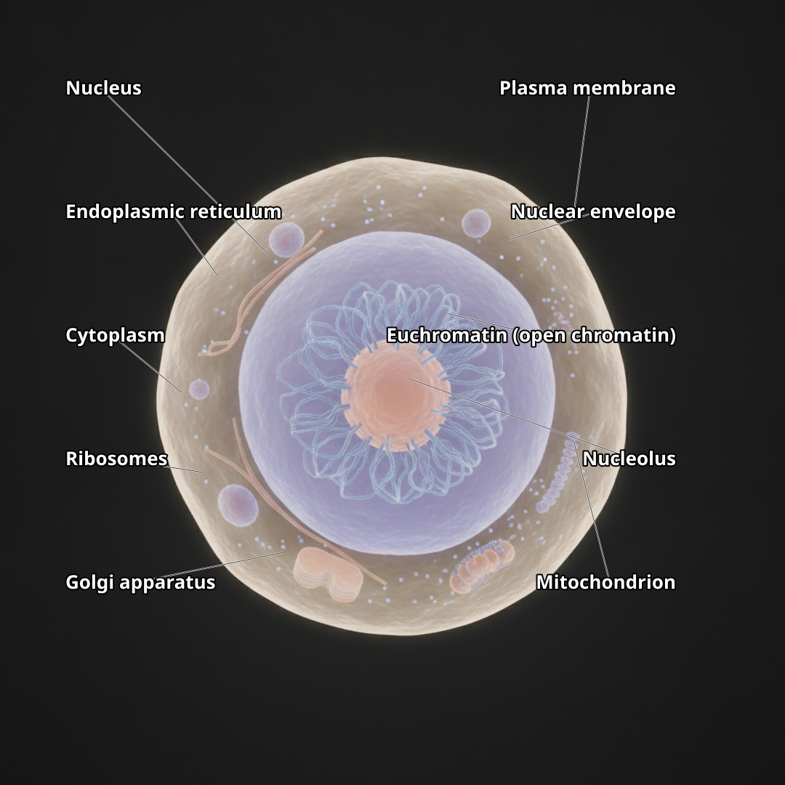 | **Watercolor · labelled**  |

| Audience | English | Deutsch |
| --- | --- | --- |
| **Kids** | Meet the embryonic stem cell: a tiny, round "blank" cell that hasn't decided what to be yet! It comes from the very early ball of cells that forms a few days after an egg is fertilised. This little cell is a superstar shapeshifter, it can grow up to become skin, muscle, brain, blood, bone, almost any of the 200-plus kinds of cell in your body. It is mostly one big round nucleus (its instruction library) with just a thin ring of jelly around it. Scientists give these cells special signals in the lab to gently nudge them into becoming exactly the cell type they want to study or repair. | Das ist die embryonale Stammzelle: eine winzige, runde "Blanko"-Zelle, die sich noch nicht entschieden hat, was sie werden möchte! Sie stammt aus dem allerersten Zellklümpchen, das wenige Tage nach der Befruchtung einer Eizelle entsteht. Diese kleine Zelle ist ein echter Verwandlungskünstler: Aus ihr können Haut, Muskeln, Gehirn, Blut oder Knochen werden, fast jede der über 200 Zellarten in deinem Körper. Sie besteht fast nur aus einem großen runden Zellkern (ihrer Anleitungs-Bibliothek) mit einem dünnen Gelee-Ring drumherum. Im Labor geben Forschende diesen Zellen bestimmte Signale, die sie sanft in genau den Zelltyp verwandeln, den sie untersuchen oder reparieren möchten. |
| **Adults** | Embryonic stem cells (ESCs) are pluripotent cells taken from the inner cell mass of a very early embryo (the blastocyst). "Pluripotent" means they can still become any of the roughly 200 cell types in the body, a flexibility that ordinary body cells lose as they specialise. Under the microscope an ESC is small and unremarkable: a dominant round nucleus with a bold nucleolus and only a sliver of cytoplasm, and in culture the cells pile into tight, sharp-edged colonies. Their promise lies in regenerative medicine, using lab-guided differentiation to grow replacement neurons, heart muscle or insulin-making cells, and in modelling disease and testing drugs. Because deriving classic ESC lines involves human embryos, the field is also governed by careful ethical and legal rules, and much current work uses induced pluripotent stem cells (iPSCs) that sidestep that concern. | Embryonale Stammzellen (ESCs) sind pluripotente Zellen aus der inneren Zellmasse eines sehr frühen Embryos (der Blastozyste). "Pluripotent" heißt, dass sie noch zu jedem der rund 200 Zelltypen des Körpers werden können, eine Wandelbarkeit, die gewöhnliche Körperzellen mit ihrer Spezialisierung verlieren. Unter dem Mikroskop wirkt eine ESC klein und unscheinbar: ein beherrschender runder Zellkern mit kräftigem Kernkörperchen und nur einem schmalen Saum Zytoplasma; in Kultur wachsen die Zellen zu dicht gepackten, scharf begrenzten Kolonien zusammen. Ihr Potenzial liegt in der regenerativen Medizin, indem man sie im Labor gezielt zu Ersatz-Nervenzellen, Herzmuskel oder insulinbildenden Zellen ausdifferenzieren lässt, sowie in der Krankheitsmodellierung und Wirkstoffprüfung. Da die Gewinnung klassischer ESC-Linien menschliche Embryonen betrifft, gelten strenge ethische und rechtliche Regeln, und viele Arbeiten nutzen heute induzierte pluripotente Stammzellen (iPSCs), die dieses Problem umgehen. |
| **Scientific** | Embryonic stem cells are pluripotent cells derived from the inner cell mass of the pre-implantation blastocyst. They self-renew indefinitely while retaining the capacity to differentiate into derivatives of all three germ layers (ectoderm, mesoderm, endoderm). Pluripotency is maintained by a core transcription-factor network, OCT4 (POU5F1), SOX2 and NANOG, and is marked by surface antigens SSEA-3/4 and TRA-1-60/81. Ultrastructurally the cells show a high nucleus-to-cytoplasm ratio, a prominent nucleolus, predominantly open euchromatin and few immature mitochondria, consistent with a largely glycolytic metabolism. Directed differentiation is achieved in vitro by modulating signalling pathways (e.g. BMP, Wnt, FGF, Nodal/Activin) with defined growth factors and small molecules. ESCs underpin regenerative-medicine strategies, developmental and disease modelling and drug screening; ethical constraints on human-embryo use motivated the development of induced pluripotent stem cells (iPSCs), which reprogram somatic cells to an ESC-like state. | Embryonale Stammzellen sind pluripotente Zellen aus der inneren Zellmasse der Blastozyste vor der Einnistung. Sie erneuern sich unbegrenzt selbst und behalten zugleich die Fähigkeit, sich in Abkömmlinge aller drei Keimblätter (Ektoderm, Mesoderm, Entoderm) zu differenzieren. Die Pluripotenz wird durch ein zentrales Transkriptionsfaktor-Netzwerk aus OCT4 (POU5F1), SOX2 und NANOG aufrechterhalten und ist durch die Oberflächenantigene SSEA-3/4 sowie TRA-1-60/81 gekennzeichnet. Ultrastrukturell zeigen die Zellen ein hohes Kern-Plasma-Verhältnis, ein prominentes Kernkörperchen, überwiegend offenes Euchromatin und wenige unreife Mitochondrien, passend zu einem vorwiegend glykolytischen Stoffwechsel. Die gerichtete Differenzierung gelingt in vitro durch Modulation von Signalwegen (etwa BMP, Wnt, FGF, Nodal/Activin) mit definierten Wachstumsfaktoren und kleinen Molekülen. ESCs sind Grundlage regenerativer Therapieansätze, der Entwicklungs- und Krankheitsmodellierung sowie des Wirkstoff-Screenings; die ethischen Einschränkungen beim Einsatz menschlicher Embryonen führten zur Entwicklung induzierter pluripotenter Stammzellen (iPSCs), die somatische Zellen in einen ESC-ähnlichen Zustand zurückprogrammieren. |

[full log](set/stem-cells/embryonic-stem-cell.render.md) · [set overview](set/stem-cells/OVERVIEW.md)

---

### Endothelial progenitor cell (EPC) (`endothelial-progenitor-cell`)
Young, bone-marrow-derived endothelial cell mobilised into the bloodstream during wound healing and angiogenesis; migrates to damaged vessel wall and differentiates into a mature vessel-lining endothelial cell. Elongated and motile, with a leading lamellipodium, rich rough ER/Golgi/mitochondria, actin cytoskeleton, and rod-shaped Weibel-Palade bodies as it matures. Responds to VEGF and other vascular growth factors.

| Textbook | SEM | 3D | Watercolor |
| --- | --- | --- | --- |
|  |  |  |  |
| **Reference (real)**  | **Textbook · labelled**  | **3D · labelled**  | **Watercolor · labelled**  |

| Audience | English | Deutsch |
| --- | --- | --- |
| **Kids** | Meet the Endothelial Progenitor Cell — the body's speedy road-repair crew, always on call! It normally naps quietly inside your bone marrow, but the moment a blood vessel gets a scrape or a cut needs new plumbing, a chemical signal called VEGF rings it up and sends it racing through the bloodstream to the rescue. When it arrives, it stretches out a wide, flat front foot to crawl right up to the damaged spot, patches itself into the vessel wall, and grows up into a full, grown-up lining cell so blood can flow smoothly again. It even carries its own tiny toolbox of rod-shaped packets ready to release the glue that helps stop bleeding. Without crews like this one, every little nick in a blood vessel would take forever to mend! | Das ist die Endotheliale Vorläuferzelle — die schnelle Straßenbau-Truppe deines Körpers, immer einsatzbereit! Normalerweise schlummert sie ruhig in deinem Knochenmark, aber sobald ein Blutgefäß einen Kratzer bekommt oder eine neue Leitung gebraucht wird, ruft sie ein Botenstoff namens VEGF herbei und schickt sie durch die Blutbahn zur Rettung. Am Einsatzort angekommen, streckt sie einen breiten, flachen Vorderfuß aus, krabbelt bis zur beschädigten Stelle, baut sich in die Gefäßwand ein und wächst zu einer vollwertigen, erwachsenen Auskleidungszelle heran, damit das Blut wieder ungehindert fließen kann. Sie trägt sogar ihren eigenen kleinen Werkzeugkasten aus stäbchenförmigen Päckchen bei sich, bereit, den Klebstoff freizusetzen, der beim Blutstillen hilft. Ohne Trupps wie sie würde jeder kleine Riss in einem Blutgefäß ewig brauchen, um zu heilen! |
| **Adults** | The endothelial progenitor cell (EPC) is a young, bone-marrow-derived cell that the body dispatches whenever a blood vessel needs repairing or a tissue needs a new blood supply. In response to VEGF and related growth factors — released, for example, after an injury or during exercise — EPCs leave the bone marrow, travel through the bloodstream, and home in on the site of vascular damage or on tissue that is actively building new capillaries (angiogenesis). Once there, they either integrate directly into the vessel wall or, more often, support nearby cells by releasing their own growth signals, before maturing into full endothelial cells that form the smooth, blood-contacting lining of a vessel. Because they mark and support the body's capacity to grow and repair blood vessels, circulating EPC numbers are widely studied as an indicator of vascular health and regenerative potential. | Die endotheliale Vorläuferzelle (EPC) ist eine junge, aus dem Knochenmark stammende Zelle, die der Körper immer dann losschickt, wenn ein Blutgefäß repariert werden muss oder ein Gewebe eine neue Blutversorgung braucht. Als Reaktion auf VEGF und verwandte Wachstumsfaktoren – die etwa nach einer Verletzung oder beim Sport freigesetzt werden – verlassen EPCs das Knochenmark, wandern durch die Blutbahn und steuern gezielt die Stelle einer Gefäßschädigung oder ein Gewebe an, das gerade neue Kapillaren bildet (Angiogenese). Dort angekommen, bauen sie sich entweder direkt in die Gefäßwand ein oder unterstützen, was häufiger vorkommt, benachbarte Zellen durch eigene Wachstumssignale, bevor sie zu vollwertigen Endothelzellen heranreifen, die die glatte, blutberührende Auskleidung eines Gefäßes bilden. Da sie die Fähigkeit des Körpers zum Aufbau und zur Reparatur von Blutgefäßen anzeigen und unterstützen, wird die Zahl zirkulierender EPCs häufig als Marker für Gefäßgesundheit und Regenerationspotenzial untersucht. |
| **Scientific** | The endothelial progenitor cell (EPC) is a bone-marrow-derived, CD34+/CD133+/VEGFR-2+ mononuclear cell population, first characterised by Asahara et al. (1997), that is mobilised into peripheral blood by angiogenic cytokines (VEGF, SDF-1/CXCR4, G-CSF) in response to ischaemia, tissue injury, or exercise. EPCs home to sites of endothelial denudation or active neovascularisation, where they contribute to vessel repair and angiogenesis predominantly through paracrine secretion of pro-angiogenic factors, with direct incorporation into the vessel wall now considered a comparatively minor contribution. Morphologically, an EPC differentiating along the endothelial lineage is a flattened, motile, spindle/fan-shaped cell with a broad leading lamellipodium and filopodia driven by cortical and stress-fibre actin, a single eccentric nucleus, extensive rough endoplasmic reticulum and Golgi supporting active receptor and secretory-protein turnover, and, as maturation proceeds, Weibel-Palade bodies — rod-shaped, endothelial-lineage-specific secretory organelles that store von Willebrand factor and P-selectin for regulated exocytosis. Progressive loss of CD133 and acquisition of VE-cadherin (CD144), PECAM-1 (CD31) and von Willebrand factor mark the transition from progenitor to mature endothelial phenotype; circulating EPC number and function are studied as biomarkers of vascular regenerative capacity in cardiovascular disease. | Die endotheliale Vorläuferzelle (EPC) ist eine aus dem Knochenmark stammende, CD34+/CD133+/VEGFR-2+ mononukleäre Zellpopulation, die erstmals von Asahara et al. (1997) beschrieben wurde und durch angiogene Zytokine (VEGF, SDF-1/CXCR4, G-CSF) als Reaktion auf Ischämie, Gewebeverletzung oder körperliche Belastung ins periphere Blut mobilisiert wird. EPCs steuern Orte einer Endothelläsion oder aktiver Neovaskularisation an, wo sie überwiegend durch parakrine Sekretion proangiogener Faktoren zur Gefäßreparatur und Angiogenese beitragen, während eine direkte Einbindung in die Gefäßwand heute als vergleichsweise geringer Beitrag gilt. Morphologisch ist eine sich entlang der endothelialen Linie differenzierende EPC eine abgeflachte, bewegliche, spindel- bis fächerförmige Zelle mit einem breiten, durch kortikales und Stressfaser-Aktin angetriebenen Lamellipodium und Filopodien an der Vorderkante, einem einzelnen exzentrischen Zellkern, ausgedehntem rauem endoplasmatischem Retikulum und Golgi-Apparat zur Unterstützung des aktiven Rezeptor- und Sekretionsprotein-Umsatzes sowie, mit fortschreitender Reifung, Weibel-Palade-Körperchen – stäbchenförmigen, endotheltypischen Sekretionsorganellen, die von-Willebrand-Faktor und P-Selektin für die regulierte Exozytose speichern. Der schrittweise Verlust von CD133 und der Erwerb von VE-Cadherin (CD144), PECAM-1 (CD31) und von-Willebrand-Faktor markieren den Übergang vom Vorläufer- zum reifen Endothelphänotyp; Zahl und Funktion zirkulierender EPCs werden als Biomarker der vaskulären Regenerationsfähigkeit bei Herz-Kreislauf-Erkrankungen untersucht. |

[full log](set/stem-cells/endothelial-progenitor-cell.render.md) · [set overview](set/stem-cells/OVERVIEW.md)

---

### Hematopoietic stem cell (HSC) (`hematopoietic-stem-cell`)
Rare bone-marrow stem cell (~7–10 µm), the mother of all blood cells — a small round agranular cell with a large euchromatic nucleus and a thin cytoplasmic rim, that self-renews and gives rise to every blood lineage.

| Textbook | SEM | 3D | Watercolor |
| --- | --- | --- | --- |
|  |  |  |  |
| **Reference (real)**  | **Textbook · labelled**  | **3D · labelled**  | **Watercolor · labelled**  |

| Audience | English | Deutsch |
| --- | --- | --- |
| **Kids** | Say hello to the hematopoietic stem cell — the great-grandmother of your blood! She is a tiny round cell who lives deep inside your bones, in a cosy spot called the marrow. She is a bit lazy and rests most of the time, but every now and then she wakes up and makes a brand-new blood cell: red ones to carry oxygen, white ones to fight germs, and sticky platelets to patch up cuts. All day long her helper neighbours whisper 'stay here, we need you!' and feed her special growth signals so she never runs out. Thanks to her, your blood is always being topped up. | Sag Hallo zur hämatopoetischen Stammzelle — der Urgroßmutter deines Blutes! Sie ist eine winzige runde Zelle und wohnt tief in deinen Knochen, an einem gemütlichen Ort namens Knochenmark. Meistens ruht sie gemütlich, doch ab und zu wacht sie auf und macht eine ganz neue Blutzelle: rote, die Sauerstoff tragen, weiße, die Keime bekämpfen, und klebrige Blutplättchen, die Wunden flicken. Den ganzen Tag flüstern ihr die Nachbarzellen zu 'bleib hier, wir brauchen dich!' und füttern sie mit besonderen Wachstumssignalen, damit sie nie ausgeht. Dank ihr wird dein Blut immer wieder aufgefüllt. |
| **Adults** | The hematopoietic stem cell (HSC) sits at the very top of the blood family tree. A few thousand of these rare cells live in the bone marrow and, over a lifetime, replace the hundreds of billions of red cells, white cells and platelets we use up every single day. They manage this with two tricks: self-renewal (making a copy of themselves) and differentiation (committing to a blood lineage). HSCs are famously home-bodies — they depend on a supportive 'niche' of marrow cells and growth factors, and mostly stay quiet, dividing rarely to protect their genome. Medically they are the cells transferred in a bone-marrow or stem-cell transplant, a curative therapy for leukaemia and several blood and immune disorders. | Die hämatopoetische Stammzelle (HSC) steht an der Spitze des Blut-Stammbaums. Nur einige Tausend dieser seltenen Zellen leben im Knochenmark und ersetzen im Lauf des Lebens die hunderte Milliarden roten und weißen Blutkörperchen und Blutplättchen, die wir Tag für Tag verbrauchen. Das gelingt ihnen mit zwei Kunststücken: Selbsterneuerung (eine Kopie ihrer selbst herstellen) und Differenzierung (sich auf eine Blutzelllinie festlegen). HSCs sind ausgesprochene Stubenhocker — sie brauchen eine schützende 'Nische' aus Knochenmarkzellen und Wachstumsfaktoren und bleiben meist ruhig, teilen sich nur selten, um ihr Erbgut zu schonen. Medizinisch sind sie die Zellen, die bei einer Knochenmark- oder Stammzelltransplantation übertragen werden — eine heilende Therapie bei Leukämie und mehreren Blut- und Immunkrankheiten. |
| **Scientific** | Hematopoietic stem cells (HSCs) are multipotent, self-renewing cells that reside chiefly in adult bone marrow and sustain lifelong haematopoiesis, giving rise to all myeloid and lymphoid lineages. Morphologically they are unremarkable — small (~7–10 µm), round, agranular cells with a high nucleus-to-cytoplasm ratio, dispersed euchromatin and a thin basophilic cytoplasmic rim — and are instead identified immunophenotypically (in humans classically Lin− CD34+ CD38− CD90+ CD45RA−). Most HSCs are quiescent (G0), rely largely on glycolysis with low mitochondrial output, and divide infrequently, a strategy that limits replicative and oxidative DNA damage. Their fate is governed by a specialised perivascular/endosteal niche whose stromal and endothelial cells supply anchoring signals and cytokines such as stem cell factor (SCF/KIT ligand), CXCL12 (via CXCR4) and thrombopoietin. This niche dependence underpins HSC mobilisation, homing and engraftment in clinical stem-cell transplantation. | Hämatopoetische Stammzellen (HSCs) sind multipotente, selbsterneuernde Zellen, die vor allem im adulten Knochenmark liegen und die lebenslange Hämatopoese aufrechterhalten, also alle myeloischen und lymphatischen Linien hervorbringen. Morphologisch sind sie unauffällig — kleine (~7–10 µm), runde, granulafreie Zellen mit hohem Kern-Plasma-Verhältnis, aufgelockertem Euchromatin und einem schmalen basophilen Zytoplasmasaum — und werden stattdessen immunphänotypisch identifiziert (beim Menschen klassisch Lin− CD34+ CD38− CD90+ CD45RA−). Die meisten HSCs sind ruhend (G0), decken ihren Energiebedarf überwiegend glykolytisch bei geringer mitochondrialer Aktivität und teilen sich selten — eine Strategie, die replikative und oxidative DNA-Schäden begrenzt. Ihr Schicksal steuert eine spezialisierte perivaskuläre/endostale Nische, deren Stroma- und Endothelzellen Halte-Signale und Zytokine wie Stammzellfaktor (SCF/KIT-Ligand), CXCL12 (über CXCR4) und Thrombopoietin liefern. Diese Nischenabhängigkeit erklärt Mobilisierung, Homing und Anwachsen der HSCs bei der klinischen Stammzelltransplantation. |

[full log](set/stem-cells/hematopoietic-stem-cell.render.md) · [set overview](set/stem-cells/OVERVIEW.md)

---

### Induced pluripotent stem cell (iPS) (`induced-pluripotent-stem-cell`)
A body cell reprogrammed by a few transcription factors (Yamanaka factors: OCT4, SOX2, KLF4, c-MYC) back into an embryonic-like pluripotent state; small, round, with a huge nucleus, prominent nucleoli and immature mitochondria.

| Textbook | SEM | 3D | Watercolor |
| --- | --- | --- | --- |
|  |  |  |  |
| **Reference (real)**  | **Textbook · labelled**  | **3D · labelled**  | **Watercolor · labelled**  |

| Audience | English | Deutsch |
| --- | --- | --- |
| **Kids** | Meet the iPS cell: it used to be an ordinary skin cell, until scientists gave it four special reset switches (called the Yamanaka factors) that turned back its clock! Now it is young and round again, with a giant nucleus that takes up almost the whole cell, like a balloon stuffed into a tiny room. Because it forgot what kind of cell it used to be, it can grow up all over again into almost ANY cell in the body: a brain cell, a heart cell, a skin cell, you name it. Doctors love growing colonies of these cells in dishes so they can study diseases up close and test new medicines without needing to poke anyone. | Das ist die iPS-Zelle: Früher war sie eine ganz normale Hautzelle, bis Forschende ihr vier besondere Reset-Schalter gaben (die Yamanaka-Faktoren genannt werden) und ihre Uhr zurückdrehten! Jetzt ist sie wieder jung und rund, mit einem riesigen Zellkern, der fast die ganze Zelle ausfüllt, wie ein Luftballon in einem winzigen Zimmer. Weil sie vergessen hat, was für eine Zelle sie mal war, kann sie noch einmal zu fast JEDER Zelle im Körper heranwachsen: eine Gehirnzelle, eine Herzzelle, eine Hautzelle, alles ist möglich. Forschende züchten gerne ganze Kolonien dieser Zellen in Schälchen, um Krankheiten genau zu untersuchen und neue Medikamente zu testen, ohne dass dafür jemand gepikst werden muss. |
| **Adults** | An induced pluripotent stem cell starts life as an ordinary adult cell, often a skin or blood cell, until researchers introduce four reprogramming genes, the Yamanaka factors, that erase its specialised identity and reset it to an embryonic-like state. The result is a small, round cell dominated by an oversized nucleus with prominent nucleoli, surrounded by only a thin rim of cytoplasm holding immature, energy-frugal mitochondria. From this blank-slate state, an iPS cell can be coaxed with the right chemical cues into neurons, heart muscle, insulin-producing pancreas cells and more. That versatility, achieved without using embryos, is why iPS cells have become a mainstay for modelling disease in a dish, screening drugs on a patient's own cells, and developing personalised regenerative therapies. | Eine induzierte pluripotente Stammzelle beginnt ihr Leben als ganz gewöhnliche erwachsene Zelle, oft eine Haut- oder Blutzelle, bis Forschende vier Reprogrammierungsgene, die Yamanaka-Faktoren, einschleusen, die ihre spezialisierte Identität löschen und sie in einen embryoähnlichen Zustand zurückversetzen. Das Ergebnis ist eine kleine, runde Zelle, die von einem übergroßen Zellkern mit auffälligen Nukleoli dominiert wird, umgeben von nur einem schmalen Zytoplasmasaum mit unreifen, sparsam arbeitenden Mitochondrien. Aus diesem gleichsam unbeschriebenen Zustand lässt sich eine iPS-Zelle mit den passenden chemischen Signalen zu Nervenzellen, Herzmuskelzellen, insulinproduzierenden Bauchspeicheldrüsenzellen und vielem mehr heranreifen. Diese Vielseitigkeit, erreicht ohne Embryonen zu verwenden, macht iPS-Zellen zu einem festen Werkzeug, um Krankheiten in der Petrischale nachzustellen, Medikamente an den eigenen Zellen von Patientinnen und Patienten zu testen und personalisierte regenerative Therapien zu entwickeln. |
| **Scientific** | Induced pluripotent stem cells (iPSCs) are generated by forced ectopic expression of a defined set of transcription factors, canonically OCT3/4, SOX2, KLF4 and c-MYC, in a somatic cell, which triggers a stepwise epigenetic reprogramming process that erases lineage-specific DNA methylation and chromatin marks and reactivates the endogenous pluripotency network (OCT4, SOX2, NANOG). Morphologically, iPSCs display a very high nucleus-to-cytoplasm ratio, one or more prominent, reticulated nucleoli, and globally decondensed euchromatin with minimal heterochromatin, consistent with a permissive, broadly transcribed genome. Their mitochondria remain small, rounded and cristae-poor, reflecting a predominantly glycolytic metabolic profile typical of pluripotent cells rather than the oxidative metabolism of the parental somatic cell. Cells are validated as bona fide pluripotent by surface marker expression (SSEA-4, TRA-1-60, TRA-1-81), pluripotency gene expression, and functional differentiation assays into derivatives of all three germ layers (embryoid body formation or teratoma assay). Clinically and experimentally, iPSCs underpin disease-in-a-dish modelling, high-throughput drug screening, and autologous cell-therapy strategies, since they can be derived from a patient's own cells and later directed via defined differentiation protocols into the desired target lineage. | Induzierte pluripotente Stammzellen (iPSZ) entstehen durch erzwungene ektopische Expression eines definierten Satzes von Transkriptionsfaktoren, klassischerweise OCT3/4, SOX2, KLF4 und c-MYC, in einer somatischen Zelle; dies löst einen stufenweisen epigenetischen Reprogrammierungsprozess aus, der linienspezifische DNA-Methylierungs- und Chromatinmarkierungen löscht und das endogene Pluripotenznetzwerk (OCT4, SOX2, NANOG) reaktiviert. Morphologisch zeigen iPSZ ein sehr hohes Kern-Plasma-Verhältnis, ein oder mehrere auffällige, retikulierte Nukleoli sowie global dekondensiertes Euchromatin mit minimalem Heterochromatin, was einem offenen, breit transkribierten Genom entspricht. Ihre Mitochondrien bleiben klein, rundlich und cristaearm, was ein überwiegend glykolytisches Stoffwechselprofil widerspiegelt, wie es für pluripotente Zellen typisch ist, im Gegensatz zum oxidativen Stoffwechsel der ursprünglichen somatischen Zelle. Zellen werden als echt pluripotent validiert durch Expression von Oberflächenmarkern (SSEA-4, TRA-1-60, TRA-1-81), Expression von Pluripotenzgenen sowie funktionelle Differenzierungstests in Derivate aller drei Keimblätter (Embryoidkörper-Bildung oder Teratom-Test). Klinisch und experimentell bilden iPSZ die Grundlage für Krankheitsmodellierung in der Schale, Hochdurchsatz-Wirkstoffscreening und autologe Zelltherapie-Strategien, da sie aus den eigenen Zellen einer Patientin oder eines Patienten gewonnen und anschließend über definierte Differenzierungsprotokolle in die gewünschte Ziellinie gelenkt werden können. |

[full log](set/stem-cells/induced-pluripotent-stem-cell.render.md) · [set overview](set/stem-cells/OVERVIEW.md)

---

### Mesenchymal stem cell (MSC) (`mesenchymal-stem-cell`)
Reserve cell for supporting tissues (bone marrow, fat, umbilical cord); can differentiate into bone, cartilage, muscle, fat or connective-tissue cells.

| Textbook | SEM | 3D | Watercolor |
| --- | --- | --- | --- |
|  |  |  |  |
| **Reference (real)**  | **Textbook · labelled**  | **3D · labelled** 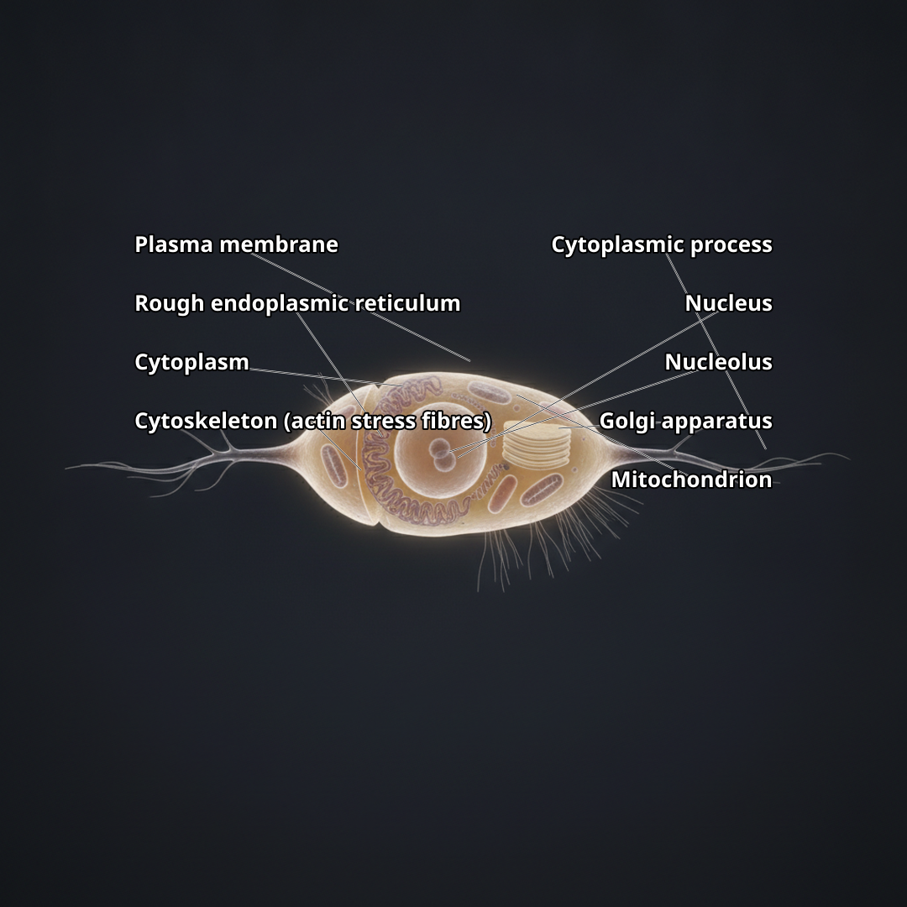 | **Watercolor · labelled**  |

| Audience | English | Deutsch |
| --- | --- | --- |
| **Kids** | Meet the Mesenchymal Stem Cell — the body's handy fix-it helper! It lives in cosy hideouts like your bone marrow, your squishy body fat, and even the umbilical cord you had as a tiny baby. Whenever your bones, cartilage or muscles need a new part, this stretchy, long-shaped cell can turn itself into exactly what's needed. It can grow up to become a bone-builder, a cartilage-cushioner, or a fluffy fat cell. Doctors and scientists study it closely because it is so good at helping the body repair itself. | Das ist die Mesenchymale Stammzelle — die geschickte Reparatur-Helferin deines Körpers! Sie wohnt an gemütlichen Orten wie deinem Knochenmark, deinem weichen Körperfett und sogar in der Nabelschnur, die du als winziges Baby hattest. Immer wenn deine Knochen, Knorpel oder Muskeln ein neues Teil brauchen, kann sich diese lang gestreckte, dehnbare Zelle in genau das verwandeln, was gebraucht wird. Sie kann zu einer Knochenbauerin, einer Knorpel-Polsterin oder einer flauschigen Fettzelle heranwachsen. Ärzte und Forscher untersuchen sie ganz genau, weil sie dem Körper so gut beim Selbst-Reparieren hilft. |
| **Adults** | The mesenchymal stem cell (MSC) is one of the body's key repair specialists, residing quietly in bone marrow, fatty tissue and the umbilical cord until it is needed. Spindle-shaped and fibroblast-like, it can differentiate into bone-forming osteoblasts, cartilage-forming chondrocytes, fat cells, or other connective-tissue cells, making it central to how tissues maintain and heal themselves. Because of this versatility, MSCs are widely studied in regenerative medicine, from cartilage and bone repair to calming inflammation in joint and autoimmune conditions. They are not immune cells themselves, but they release signalling molecules that support nearby tissue repair and dampen excess inflammation. | Die mesenchymale Stammzelle (MSC) ist eine der wichtigsten Reparaturspezialistinnen des Körpers und wartet still im Knochenmark, im Fettgewebe und in der Nabelschnur, bis sie gebraucht wird. Spindelförmig und fibroblastenähnlich kann sie sich zu knochenbildenden Osteoblasten, knorpelbildenden Chondrozyten, Fettzellen oder anderen Bindegewebszellen entwickeln, was sie für die Erhaltung und Heilung von Gewebe zentral macht. Wegen dieser Vielseitigkeit wird die MSC in der regenerativen Medizin intensiv erforscht, von der Knorpel- und Knochenreparatur bis zur Dämpfung von Entzündungen bei Gelenk- und Autoimmunerkrankungen. Sie ist selbst keine Immunzelle, gibt aber Botenstoffe ab, die die Gewebereparatur in der Umgebung unterstützen und überschießende Entzündungen bremsen. |
| **Scientific** | The mesenchymal stem/stromal cell (MSC) is a multipotent, plastic-adherent stromal cell defined by the ISCT minimal criteria as CD73+/CD90+/CD105+ while lacking haematopoietic markers (CD34, CD45, CD14/CD11b, CD19/CD79α, HLA-DR), with trilineage differentiation into osteoblasts, chondrocytes and adipocytes in vitro. Morphologically it is an elongated, bipolar, fibroblast-like cell with a large euchromatic nucleus and prominent nucleolus, extensive rough endoplasmic reticulum and a well-developed Golgi apparatus reflecting high secretory activity, and actin stress fibres that mediate substrate adhesion and migration. MSCs reside in perivascular niches across many tissues (bone-marrow stroma, adipose tissue, umbilical-cord Wharton's jelly) and act largely through paracrine secretion of cytokines, growth factors and extracellular vesicles rather than direct engraftment, conferring immunomodulatory and trophic support functions. Their multipotency and secretome make them a major focus of cell-therapy research for orthopaedic, immunological and regenerative applications. | Die mesenchymale Stamm-/Stromazelle (MSC) ist eine multipotente, plastikadhärente Stromazelle, die nach den ISCT-Mindestkriterien CD73+/CD90+/CD105+ ist und keine hämatopoetischen Marker (CD34, CD45, CD14/CD11b, CD19/CD79α, HLA-DR) trägt, mit trilinearer Differenzierung in vitro zu Osteoblasten, Chondrozyten und Adipozyten. Morphologisch ist sie eine langgestreckte, bipolare, fibroblastenähnliche Zelle mit großem euchromatischem Zellkern und deutlichem Nukleolus, ausgedehntem rauem endoplasmatischem Retikulum und einem gut entwickelten Golgi-Apparat, was ihre hohe Sekretionsaktivität widerspiegelt, sowie Aktin-Stressfasern, die Substrathaftung und Migration vermitteln. MSCs sitzen in perivaskulären Nischen zahlreicher Gewebe (Knochenmarkstroma, Fettgewebe, Whartonsulze der Nabelschnur) und wirken überwiegend parakrin durch die Sekretion von Zytokinen, Wachstumsfaktoren und extrazellulären Vesikeln statt durch direkte Engraftment, was ihnen immunmodulatorische und trophische Unterstützungsfunktionen verleiht. Ihre Multipotenz und ihr Sekretom machen sie zu einem zentralen Forschungsschwerpunkt der Zelltherapie für orthopädische, immunologische und regenerative Anwendungen. |

[full log](set/stem-cells/mesenchymal-stem-cell.render.md) · [set overview](set/stem-cells/OVERVIEW.md)

---

### Neural stem cell (NSC) (`neural-stem-cell`)
Precursor of all neural cell types (neurons, astrocytes, oligodendrocytes); a radial-glia-like cell with a single apical primary cilium and a long basal process, high nucleus-to-cytoplasm ratio and a nestin/GFAP intermediate-filament cytoskeleton. In the adult brain only active in a few niches (e.g. the hippocampus).

| Textbook | SEM | 3D | Watercolor |
| --- | --- | --- | --- |
|  |  |  |  |
| **Reference (real)**  | **Textbook · labelled**  | **3D · labelled**  | **Watercolor · labelled**  |

| Audience | English | Deutsch |
| --- | --- | --- |
| **Kids** | Meet the Neural Stem Cell — the quiet dreamer tucked away inside your brain! Long ago, an army of cells just like this one built your entire brain and spinal cord, neuron by neuron. These days, most of that building work is done, so the Neural Stem Cell mostly rests in a couple of cosy corners — like the hippocampus, your brain's memory workshop. It keeps one thin arm stretched out to sniff the fluid around it for signals, and another long arm reaching toward a blood vessel for supplies, just in case it's ever called into action. When it does get the signal, it can transform into a brand-new neuron or a helper glial cell. It's not the loudest or busiest cell in the brain, but it's the one holding onto the recipe for making more. | Das ist die Neuronale Stammzelle — die stille Träumerin tief in deinem Gehirn! Vor langer Zeit hat eine ganze Armee von Zellen wie sie dein gesamtes Gehirn und Rückenmark aufgebaut, Nervenzelle für Nervenzelle. Heute ist der große Bau fast fertig, deshalb ruht sich die Neuronale Stammzelle meistens in ein paar gemütlichen Ecken aus — zum Beispiel im Hippocampus, der Erinnerungswerkstatt deines Gehirns. Sie streckt einen dünnen Arm aus, um die Flüssigkeit um sich herum nach Signalen abzutasten, und einen langen Arm zu einem Blutgefäß, um versorgt zu werden, falls sie gebraucht wird. Bekommt sie das Signal, kann sie sich in eine ganz neue Nervenzelle oder eine helfende Gliazelle verwandeln. Sie ist nicht die lauteste oder geschäftigste Zelle im Gehirn, aber sie bewahrt das Rezept, um neue Zellen herzustellen. |
| **Adults** | The neural stem cell (NSC) is the precursor from which the entire nervous system is built, generating neurons, astrocytes and oligodendrocytes during development. In the adult human brain, active NSCs are largely restricted to two small niches: the subventricular zone lining the brain's ventricles and the subgranular zone of the hippocampus, a region central to learning and memory. There they sit as radial-glia-like cells, one thin process sensing the cerebrospinal fluid and another contacting a nearby blood vessel, staying mostly quiescent until local growth factors such as EGF and FGF prompt them to divide. This slow-trickle adult neurogenesis is thought to support memory formation and mood regulation, and it declines with age, which is why NSC biology is a major focus of research into brain repair and neurodegenerative disease. | Die neuronale Stammzelle (NSC) ist der Vorläufer, aus dem das gesamte Nervensystem aufgebaut wird — während der Entwicklung entstehen aus ihr Neuronen, Astrozyten und Oligodendrozyten. Im erwachsenen menschlichen Gehirn sind aktive NSCs weitgehend auf zwei kleine Nischen beschränkt: die subventrikuläre Zone entlang der Hirnventrikel und die subgranuläre Zone des Hippocampus, einer für Lernen und Gedächtnis zentralen Region. Dort sitzen sie als radialglia-ähnliche Zellen, mit einem dünnen Fortsatz, der die Gehirn-Rückenmarks-Flüssigkeit abtastet, und einem weiteren, der ein nahes Blutgefäß kontaktiert, meist in Ruhe, bis lokale Wachstumsfaktoren wie EGF und FGF sie zur Teilung anregen. Diese langsame, lebenslange Neubildung von Nervenzellen im Erwachsenenalter unterstützt vermutlich Gedächtnisbildung und Stimmungsregulation und nimmt mit dem Alter ab, weshalb die NSC-Biologie ein zentraler Forschungsschwerpunkt für Hirnreparatur und neurodegenerative Erkrankungen ist. |
| **Scientific** | The neural stem cell (NSC) is a multipotent, self-renewing precursor of the central nervous system that generates neurons, astrocytes and oligodendrocytes. In the adult mammalian brain, NSCs persist as morphologically astrocyte-like radial glia (SVZ type B cells; SGZ radial glia-like cells), retaining a polarized architecture with an apical process bearing a single primary cilium that contacts the cerebrospinal fluid and a basal process contacting the local vasculature, positioning the cell to integrate niche cues. NSCs express nestin, Sox2, vimentin and (in their adult astrocyte-like state) GFAP as intermediate-filament/transcription-factor markers, maintain a high nucleus-to-cytoplasm ratio with modest rough-ER/Golgi content consistent with an undifferentiated state, and respond to EGF and FGF-2 signalling governing quiescence-to-proliferation transitions. NSCs can be propagated in vitro as clonal neurospheres or adherent monolayer cultures and, upon activation, produce transit-amplifying progenitors that generate neuroblasts (SVZ, migrating via the rostral migratory stream to the olfactory bulb in rodents) or granule neurons (SGZ), underlying adult neurogenesis and its roles in olfaction, learning and memory, and its relevance to neural-repair and glioma-origin research. | Die neuronale Stammzelle (NSC) ist ein multipotenter, sich selbst erneuernder Vorläufer des zentralen Nervensystems, aus dem Neuronen, Astrozyten und Oligodendrozyten hervorgehen. Im erwachsenen Säugetiergehirn persistieren NSCs als morphologisch astrozytenähnliche Radialglia (Typ-B-Zellen der SVZ; radialglia-ähnliche Zellen der SGZ) mit einer polarisierten Architektur: ein apikaler Fortsatz mit einem einzelnen primären Zilium, das die Zerebrospinalflüssigkeit kontaktiert, und ein basaler Fortsatz, der die lokale Gefäßversorgung berührt, sodass die Zelle Nischensignale integrieren kann. NSCs exprimieren Nestin, Sox2, Vimentin und, in ihrem adulten astrozytenähnlichen Zustand, GFAP als Intermediärfilament-/Transkriptionsfaktor-Marker, weisen ein hohes Kern-Plasma-Verhältnis mit mäßigem rauem ER/Golgi-Gehalt auf, was einem undifferenzierten Zustand entspricht, und reagieren auf EGF- und FGF-2-Signale, die den Übergang von Ruhe zu Proliferation steuern. NSCs lassen sich in vitro als klonale Neurosphären oder adhärente Monolayer-Kulturen vermehren und erzeugen nach Aktivierung transit-amplifizierende Vorläuferzellen, aus denen Neuroblasten (SVZ, die über den rostralen migratorischen Strom zum Bulbus olfactorius wandern) oder Körnerzellneurone (SGZ) hervorgehen — die Grundlage der adulten Neurogenese mit Bedeutung für Geruchssinn, Lernen und Gedächtnis sowie für die Forschung zu Hirnreparatur und zum Ursprung von Gliomen. |

[full log](set/stem-cells/neural-stem-cell.render.md) · [set overview](set/stem-cells/OVERVIEW.md)

---

