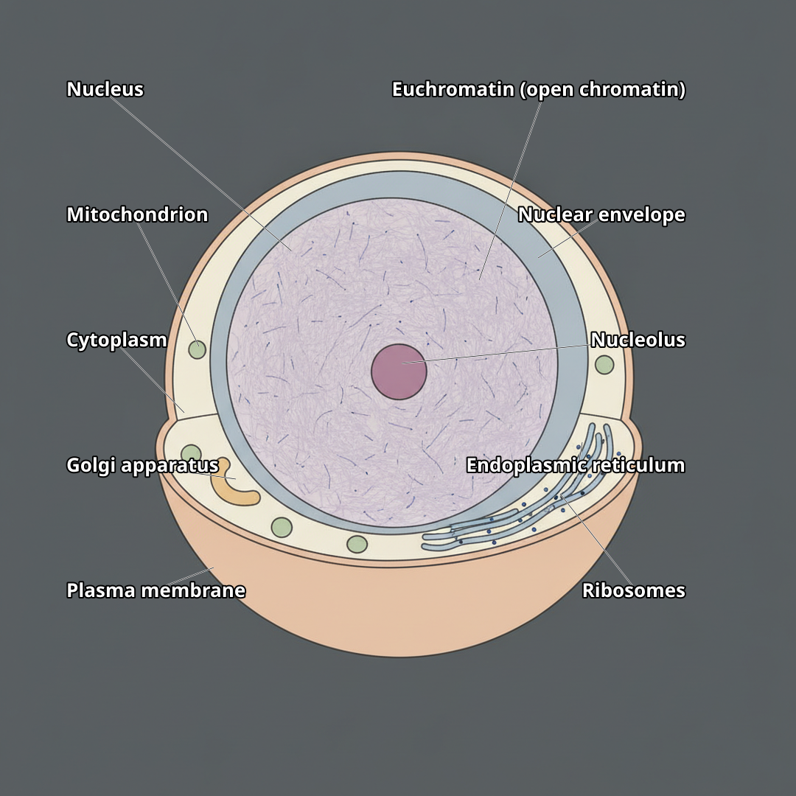
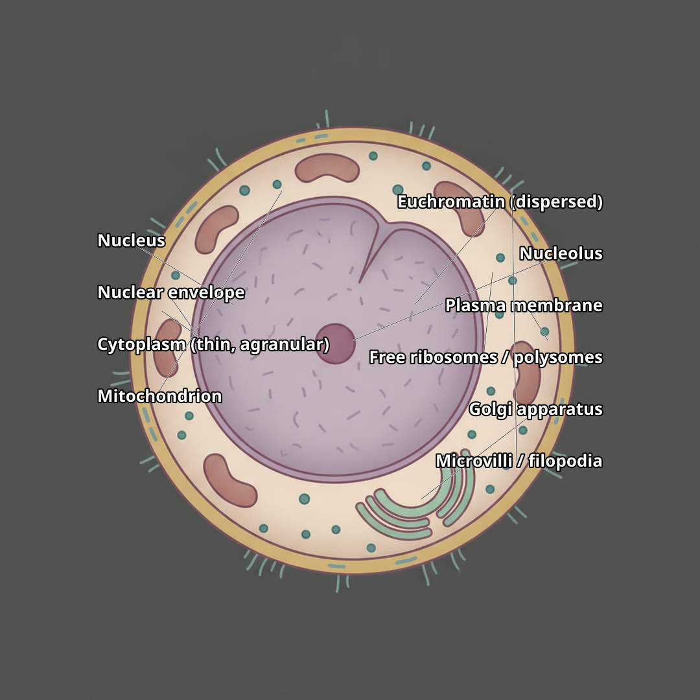
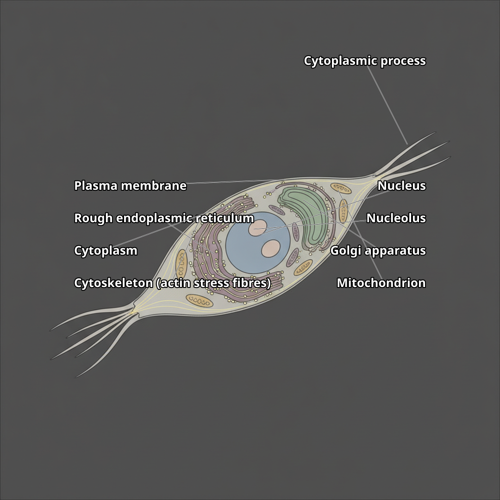

# stem-cells · textbook — gallery

Every microbe's `textbook` image — labelled SVG where built, else the last render. [← set overview](../../OVERVIEW.md)

## Embryonic stem cell (ESC) (`embryonic-stem-cell`)

[full log](../../embryonic-stem-cell.render.md)

## Endothelial progenitor cell (EPC) (`endothelial-progenitor-cell`)

[full log](../../endothelial-progenitor-cell.render.md)

## Hematopoietic stem cell (HSC) (`hematopoietic-stem-cell`)

[full log](../../hematopoietic-stem-cell.render.md)

## Induced pluripotent stem cell (iPS) (`induced-pluripotent-stem-cell`)

[full log](../../induced-pluripotent-stem-cell.render.md)

## Mesenchymal stem cell (MSC) (`mesenchymal-stem-cell`)

[full log](../../mesenchymal-stem-cell.render.md)

## Neural stem cell (NSC) (`neural-stem-cell`)

[full log](../../neural-stem-cell.render.md)
